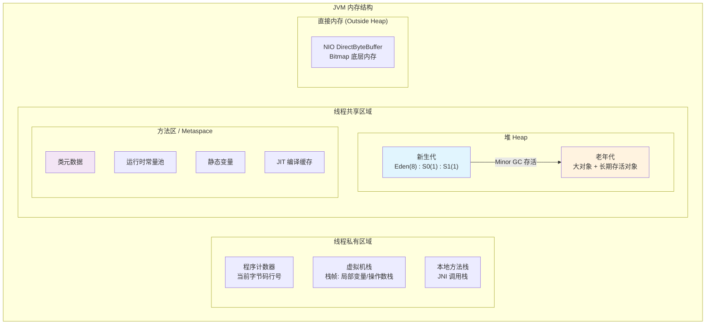
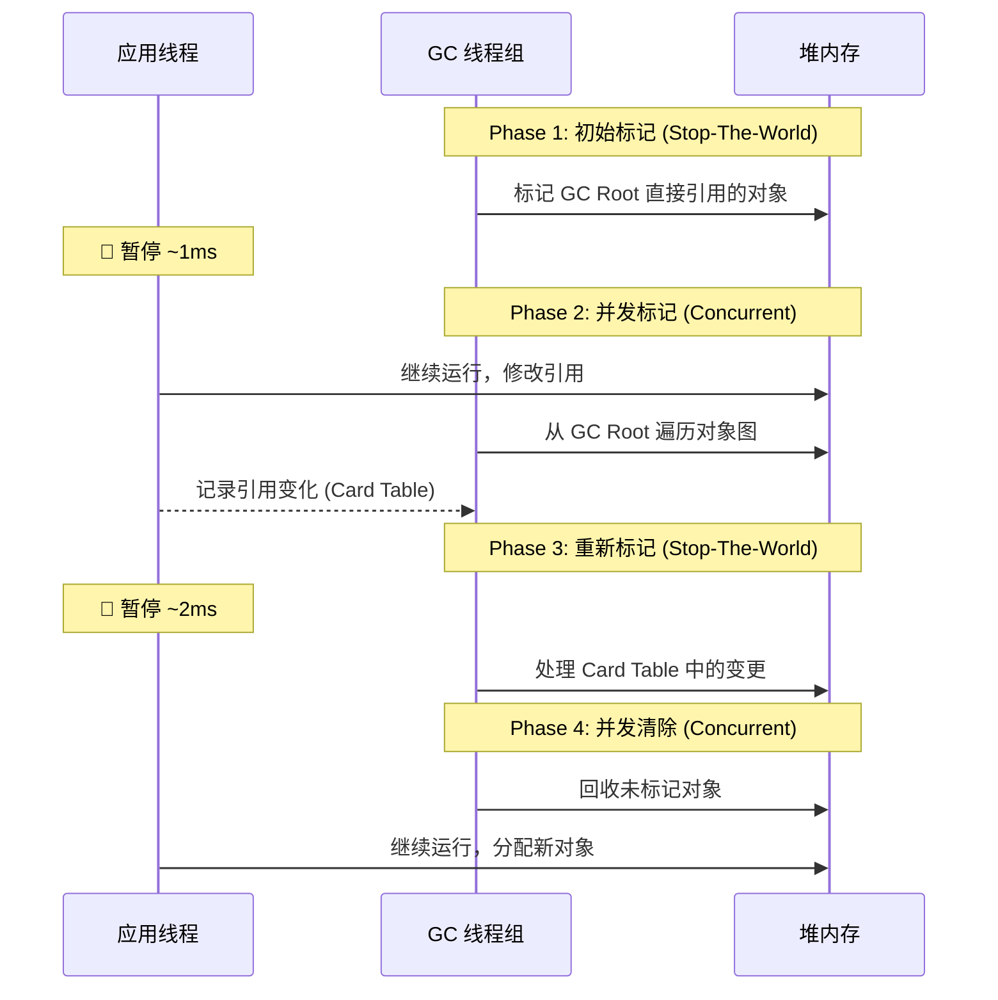
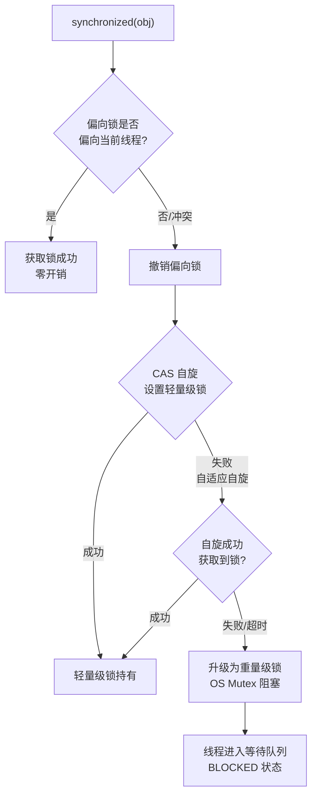

# Java 语言特性 —— 面试学习完整指南

> **六层递进体系**：面试问题 → 标准答案 → 核心原理 → 流程图 → 源码分析 → 实战场景
> 适用岗位：高级/资深 Android 工程师、架构师

---

## 目录

1. [常见面试问题（5+题）](#1-常见面试问题)
2. [标准答案与要点解析](#2-标准答案与要点解析)
3. [核心原理深度讲解](#3-核心原理深度讲解)
4. [原理流程图（HTML + Mermaid.js）](#4-原理流程图)
5. [核心源码分析](#5-核心源码分析)
6. [应用场景举例](#6-应用场景举例)

---

## 1. 常见面试问题

### Q1: JVM 内存模型是怎样的？堆、栈、方法区分别存储什么？在 Android ART 中有何差异？
### Q2: GC 的三大基础算法（标记-清除 / 复制 / 标记-整理）的原理与对比？Android ART 的 GC 做了哪些优化？
### Q3: volatile 和 synchronized 的底层实现原理是什么？在 Android 开发中的实际应用场景？
### Q4: 注解处理器（APT）的工作原理？ButterKnife / Room / Hilt 编译期代码生成的流程？
### Q5: Java 泛型类型擦除是怎么回事？如何在运行时通过反射获取泛型信息？

---

## 2. 标准答案与要点解析

### Q1: JVM 内存模型 —— 堆、栈、方法区

```text
┌─────────────────────────────────────────────────────┐
│                     JVM 内存区域                      │
├───────────────┬─────────────────────────────────────┤
│  线程私有区域   │  线程共享区域                          │
├───────────────┼─────────────────────────────────────┤
│  程序计数器     │  堆 (Heap)                           │
│  虚拟机栈       │    - 新生代 (Eden + S0 + S1)          │
│  本地方法栈     │    - 老年代 (Tenured)                 │
│               │  方法区 (Method Area)                  │
│               │    - 运行时常量池                       │
│               │    - 类元数据                          │
│               │    - 静态变量                          │
└───────────────┴─────────────────────────────────────┘
```

| 内存区域 | 存储内容 | 线程共享 | OOM 风险 |
|---------|---------|:-------:|:-------:|
| **堆 (Heap)** | 所有对象实例、数组 | 是 | `OutOfMemoryError: Java heap space` |
| **虚拟机栈** | 栈帧（局部变量表、操作数栈、返回地址） | 否 | `StackOverflowError` |
| **本地方法栈** | Native 方法调用的栈帧 | 否 | `StackOverflowError` |
| **方法区** | 类信息、常量、静态变量、JIT 编译后的代码缓存 | 是 | `OutOfMemoryError: Metaspace` |
| **程序计数器** | 当前线程执行字节码的行号指示器 | 否 | 无 |

**ART 与 HotSpot JVM 的关键差异**：

| 维度 | HotSpot JVM | Android ART (5.0+) |
|------|------------|--------------------|
| 编译策略 | 解释 + JIT 混合，热点代码编译 | AOT 预编译（dex → oat），7.0+ 加入 JIT |
| 内存布局 | 分代：Young / Old / PermGen(→Metaspace) | 不分代（或弱分代），按对象大小分类 |
| GC 暂停 | Stop-The-World 标记，CMS/G1 追求低暂停 | 并发为主，CMS → CMC（Compacting），减少暂停 |
| 方法区实现 | Metaspace（Native 内存） | oat 文件映射（代码）+ 堆（元数据） |
| 对象头大小 | 12~16 字节（压缩指针） | 8~16 字节（无压缩指针） |

**面试加分点**：
- ART 的 `Runtime.gc()` 行为与标准 JVM 完全不同——它不是"建议"，而是"必然执行"，但仅在当前进程空闲时
- Android 8.0+ 的 **Concurrent Copying (CC) GC** 将 GC 暂停时间降低到 1ms 以内，通过 `read-barrier` 实现

---

### Q2: GC 三大算法 —— 标记-清除 / 复制 / 标记-整理

```
标记-清除 (Mark-Sweep):
  [标记] → 从 GC Root 出发，标记所有可达对象
  [清除] → 遍历堆，回收未被标记的对象
  缺陷：内存碎片，大对象可能无法分配

复制算法 (Copying):
  [新生代专用] Eden + 两个 Survivor (S0/S1)
  将 Eden + S0 存活对象复制到 S1，清空 Eden + S0
  优势：无碎片，实现简单  缺陷：浪费一半空间

标记-整理 (Mark-Compact):
  [老年代专用] 标记后，将存活对象移动到一端，整理出连续空间
  优势：无碎片、无空间浪费  缺陷：移动成本高，暂停时间长
```

**ART 的 GC 演进路线**：

| Android 版本 | GC 方案 | 暂停时间 | 特点 |
|:----------:|--------|:-------:|------|
| 2.3 ~ 4.4 | Dalvik：Stop-The-World 分代 GC | 100~600ms | 标记-清除为主，单线程 GC |
| 5.0 ~ 5.1 | ART：CMS（并发标记清除） | 2~5ms | 非压缩，可能产生碎片 |
| 6.0 | ART：CMS → 部分 Compacting | 2~5ms | 后台线程碎片整理 |
| 7.0 ~ 7.1 | ART：Hybrid GC（JIT + AOT） | 1~3ms | 编译期 profile 指导 |
| 8.0+ | ART：Concurrent Copying (CC) | <1ms | Read-barrier，并发复制 |
| 10+ | ART：Generational CC | <1ms | 分代并发复制，进一步提升 |

**面试深度追问**：为什么 Android 不直接用分代 GC？
- 移动端内存受限（早年 512MB~2GB），分代的空间浪费不可接受
- 移动端进程生命周期短，对象存活率分布与服务器不同——很多对象"朝生夕死"或"永生"，分代收益不大
- ART 的 CC GC 通过 `read-barrier` 替代 `write-barrier`，在不分代前提下实现了低暂停

---

### Q3: volatile 与 synchronized 的底层实现

#### volatile 的三层语义

```java
// 1. 可见性：写后立即刷新到主内存，读直接从主内存读
volatile boolean flag = false;

// 2. 禁止指令重排序（内存屏障）
// LoadLoad + LoadStore + StoreStore + StoreLoad
// 在字节码层面插入 memory barrier

// 3. 不保证原子性：i++ 不是原子的！
volatile int count = 0;
count++; // 读-改-写，多线程不安全
```

**内存屏障（Memory Barrier）**

| 屏障类型 | 语义 | x86 指令 | ARM 指令 |
|---------|------|---------|---------|
| LoadLoad | 在屏障后的 Load 不能重排到屏障前的 Load 之前 | —（x86 自动保证） | `dmb ishld` |
| StoreStore | 在屏障后的 Store 不能重排到屏障前的 Store 之前 | —（x86 自动保证） | `dmb ishst` |
| LoadStore | 在屏障后的 Store 不能重排到屏障前的 Load 之前 | — | `dmb ish` |
| StoreLoad | 在屏障后的 Load 不能重排到屏障前的 Store 之前 | `mfence` / `lock` | `dmb ish` |

#### synchronized 锁升级过程

```text
synchronized(obj) { ... } 执行过程：

① 偏向锁（Biased Locking）
   - 对象头 Mark Word 记录当前线程 ID
   - 同一个线程再次获取时，无需 CAS，直接比对 Thread ID
   - 适用于"大多数时候只有一个线程访问"的场景

② 轻量级锁（Lightweight Locking）—— 偏向锁撤销后升级
   - 在线程栈中创建 Lock Record，CAS 将对象头指向 Lock Record
   - 自旋等待（适应式自旋：根据历史成功概率决定自旋次数）
   - 适用于"多个线程交替访问，无真正竞争"的场景

③ 重量级锁（Heavyweight Locking）—— 自旋失败后升级
   - 向 OS 申请 mutex，线程进入阻塞队列
   - 涉及系统调用 + 上下文切换，开销大
   - 适用于"多个线程同时竞争，持有时间长"的场景
```

**Android 中的特殊用法**：

```java
// ★ 经典面试题：ActivityThread 中的 synchronized 使用
// ActivityThread.java (Android Framework)
public final class ActivityThread {
    // 通过 synchronized 保证对 mActivities 的线程安全访问
    // 因为 Activity 生命周期回调可能来自 Binder 线程池的任意线程

    final ArrayMap<IBinder, ActivityClientRecord> mActivities = new ArrayMap<>();

    // 线程安全获取 Activity 记录
    ActivityClientRecord getActivityRecord(IBinder token) {
        synchronized (mActivities) {  // ← 关键：保护数据结构
            return mActivities.get(token);
        }
    }
}
```

**面试追问**：synchronized vs ReentrantLock 的选择？

| 维度 | synchronized | ReentrantLock |
|------|:-----------:|:-------------:|
| 锁获取方式 | 隐式，关键字 | 显式，API 调用 |
| 锁释放 | 自动（代码块/方法退出） | 必须在 finally 中 unlock |
| 可中断 | 不可中断 | `lockInterruptibly()` |
| 超时获取 | 不支持 | `tryLock(timeout)` |
| 公平锁 | 非公平 | 可配置 NonfairSync / FairSync |
| 条件变量 | wait/notify（一个） | 多个 Condition |
| 性能 | 优化后的轻量级锁 vs 纯 CAS | 取决于实现 |
| Android 倾向 | **高**（无额外对象开销，内存友好） | 低（复杂场景才用） |

---

### Q4: 注解处理器（APT）原理

```
编译期代码生成流程：

[源代码 .java] → [javac] → [APT 轮询处理]
                              ↓
                     @SupportedAnnotationTypes
                     Processor.process()
                              ↓
                     生成 .java 源文件
                              ↓
                     javac 继续编译生成的代码
                              ↓
                     .class → .dex → APK
```

**APT 核心接口**：

```java
// AbstractProcessor 是编译期代码生成的核心
public class MyProcessor extends AbstractProcessor {

    // Round 模式：javac 可能多轮调用，直到没有新文件生成
    @Override
    public boolean process(Set<? extends TypeElement> annotations,
                           RoundEnvironment roundEnv) {
        for (TypeElement annotation : annotations) {
            for (Element element : roundEnv.getElementsAnnotatedWith(annotation)) {
                // 1. 收集注解信息
                // 2. 使用 JavaPoet 或直接拼接字符串生成代码
                // 3. 通过 Filer.write() 输出新源文件
            }
        }
        return true; // 声明"我处理了这些注解"（阻止其他 Processor 处理）
    }
}
```

**ButterKnife 等价实现伪代码**：

```java
// 1. 源码中的注解
@BindView(R.id.tv_title) TextView title;

// 2. APT 生成代码（简化）
// 文件名：MainActivity_ViewBinding.java
public class MainActivity_ViewBinding {
    public MainActivity_ViewBinding(MainActivity target) {
        // Element 获取到的变量名 + 注解 value
        target.title = (TextView) target.findViewById(R.id.tv_title); // 行 6
    }
}

// 3. ButterKnife.bind() 反射调用生成的类
ButterKnife.bind(this);
// → Class.forName("MainActivity_ViewBinding")
// → constructor.newInstance(this)
```

**KAPT vs KSP（Kotlin 领域的 APT 演进）**：

| 特性 | KAPT (Annotation Processing) | KSP (Kotlin Symbol Processing) |
|------|-----------------------------|-------------------------------|
| 原理 | 先用 kotlinc 生成 Java Stub，再用 javac APT | 直接解析 Kotlin 源文件语法树 |
| 速度 | 慢（需要两次编译） | 快（原生 Kotlin，单次解析） |
| 支持语言 | 同时支持 Java + Kotlin | 仅 Kotlin |
| Room 迁移 | Room 2.4+ 默认 KSP | Room 2.2+ 可选 KAPT |
| Hilt 支持 | Hilt 基于 KAPT | Hilt 正在迁移 KSP |

---

### Q5: 泛型类型擦除与反射获取泛型

**类型擦除的本质**：

```java
List<String> strList = new ArrayList<>();
List<Integer> intList = new ArrayList<>();
// 运行时，这两个 List 的 Class 对象完全相同！
System.out.println(strList.getClass() == intList.getClass()); // true
// 它们都是：ArrayList.class
```

**为什么擦除？** —— 向后兼容 Java 5 之前的字节码。泛型信息仅保留在编译期，`javac` 编译后的 `.class` 文件中，所有泛型参数被替换为上限类型（通常是 `Object`）。

**反射绕开擦除 —— Signature 属性**：

```java
// 运行时获取泛型参数类型
public class GenericHelper {
    // 场景1：通过 Field 获取
    List<String> data;
    // 反射方式：
    //   Field field = GenericHelper.class.getDeclaredField("data");
    //   ParameterizedType pType = (ParameterizedType) field.getGenericType();
    //   Type[] args = pType.getActualTypeArguments(); // [java.lang.String]

    // 场景2：通过方法返回值获取（Retrofit 的核心）
    // Retrofit 如何知道 Call<List<Repo>> 的返回类型？答：ParameterizedType
    interface GitHubService {
        @GET("users/{user}/repos")
        Call<List<Repo>> listRepos(@Path("user") String user);
    }

    // 场景3：Gson 的 TypeToken 技巧
    // new TypeToken<List<String>>(){}  —— 匿名内部类保留了泛型签名
    Type type = new TypeToken<List<String>>(){}.getType();
}

// TypeToken 原理：匿名内部类不被擦除
// 因为匿名内部类会被编译为 GenericHelper$1.class
// 其继承的父类 TypeToken<List<String>> 的泛型信息
// 通过 Signature 属性保留在字节码中，JVM 可读取
```

**面试追问**：为什么 Java 泛型不能是基本类型（`List<int>` 非法）？

- 擦除后的代码中，泛型参数被替换为 `Object`，基本类型无法强转为 `Object`
- 变通方案：自动装箱为 `List<Integer>`，但带来额外的对象分配开销，这也是 Android 内存优化中不推荐 `HashMap<Integer, ...>` 而推荐 `SparseArray` / `ArrayMap` 的原因之一

---

## 3. 核心原理深度讲解

### 3.1 GC Root 枚举与可达性分析

GC 的核心是"哪些对象还活着"。现代 GC 通过 **可达性分析 (Reachability Analysis)** 而非引用计数来判断：

```text
GC Root 集合（一组必须活跃的引用）：
  ┌─ 虚拟机栈（栈帧局部变量表）中引用的对象
  ├─ 方法区中静态属性引用的对象
  ├─ 方法区中常量引用的对象
  ├─ 本地方法栈中 JNI 引用的对象
  ├─ 所有被同步锁（synchronized）持有的对象
  └─ Java 虚拟机内部的引用（ClassLoader、基本类型 Class 对象）

从这些 GC Root 出发，沿着引用链遍历：
  GC Root → 存活对象 → ... → 存活对象
  没有被遍历到的对象 = 可回收
```

**对象引用类型与 GC 行为**：

| 引用类型 | 示例 | GC 行为 | Android 典型场景 |
|---------|------|--------|-----------------|
| **强引用** | `Object obj = new Object()` | 死不回收 | 普通对象持有 |
| **软引用** | `SoftReference<Bitmap>` | 内存不足时回收 | LruCache 降级方案 |
| **弱引用** | `WeakReference<Activity>` | GC 发现即回收 | Handler 避免 Activity 泄露 |
| **虚引用** | `PhantomReference` | 随时可能回收 | Cleaner，堆外内存管理 |

### 3.2 happens-before 规则（JMM）

`volatile` 的可见性保证建立在 **happens-before** 规则之上：

```text
JMM 定义的 6 种 happens-before 规则（写在上面的对下面的可见）：

1. 程序顺序规则：同一线程内，前面的操作 happens-before 后面的操作
2. volatile 变量规则：对 volatile 的写 happens-before 后续对它的读
3. 锁规则：解锁 happens-before 后续加锁
4. 传递性：A hb B，B hb C → A hb C
5. 线程启动/终止规则：Thread.start() hb 被启动线程的任何操作
6. 中断规则：interrupt() hb 被中断线程检测到中断

经典应用：双重检查锁定（DCL）单例中为什么需要 volatile？
  对象创建分三步：分配内存 → 初始化 → 引用赋值
  volatile 防止重排序，避免读到"未初始化完成的对象"
```

### 3.3 synchronized 锁升级在对象头的具体过程

```
Mark Word 状态转换（64位 JVM）：

无锁状态:          [ unused:25 | hashCode:31 | unused:1 | age:4 | 0 | 01 ]
                   (偏向标志位 0，锁标志位 01)

偏向锁:            [ ThreadID:54 | Epoch:2 | unused:1 | age:4 | 1 | 01 ]
                   (偏向标志位 1，锁标志位 01)

轻量级锁:          [ 指向栈中 Lock Record 的指针:62 | 00 ]
                   (锁标志位 00)

重量级锁:          [ 指向 Monitor 的指针:62 | 10 ]
                   (锁标志位 10)

GC 标记:           [ 标记位:62 | 11 ]
                   (锁标志位 11，GC 线程使用)
```

**Android ART 的特例**：Bangcle 等加壳方案会修改字节码结构的 `synchronized` 代码块，导致 ART 优化器无法识别，所以在安全敏感场景（如 TV 支付 SDK）中，需要特别注意 `synchronized` 和加壳的兼容性。

---

## 4. 原理流程图

### 4.1 JVM 内存模型图（Mermaid.js）



### 4.2 GC 流程时序图（CMS 并发标记清除）



### 4.3 synchronized 锁升级流程图



---

## 5. 核心源码分析

### 5.1 ActivityThread 中 synchronized 的真实使用

```java
// 源码位置：frameworks/base/core/java/android/app/ActivityThread.java
// 行 1660 附近（Android 14 源码）

// ★ 关键数据结构 —— 锁保护 ArrayMap
final ArrayMap<IBinder, ActivityClientRecord> mActivities = new ArrayMap<>();  // 行 1

// ★ performPauseActivity —— Binder 线程可能调用
// 行 2
@Override
public void handlePauseActivity(IBinder token, ...) {
    // 行 3
    ActivityClientRecord r;
    synchronized (mActivities) {                                    // 行 4
        r = mActivities.get(token);                                 // 行 5
    }                                                               // 行 6
    if (r != null) {
        performPauseActivity(r, ...);  // 行 7 - 锁外执行耗时操作
    }
}

// ★ 为什么不在 synchronized 块内 performPause？
// 答：锁只保护数据结构的读/写一致性，耗时操作在锁外执行，
//     避免 blocking 其他 Binder 线程的生命周期回调。
```

### 5.2 APT 实现伪代码（对标 ButterKnife / Room）

```java
// 行 1: APT Processor 注册
// META-INF/services/javax.annotation.processing.Processor
// 行 2: 内容: com.example.BindViewProcessor

@AutoService(Processor.class)                            // 行 3
@SupportedAnnotationTypes("com.example.BindView")        // 行 4
@SupportedSourceVersion(SourceVersion.RELEASE_17)        // 行 5
public class BindViewProcessor extends AbstractProcessor {
                                                         // 行 6
    @Override                                            // 行 7
    public boolean process(Set<? extends TypeElement> annotations,
                           RoundEnvironment roundEnv) {
                                                         // 行 8
        // 遍历每个被 @BindView 注解的元素（Field）
        for (Element element : roundEnv.getElementsAnnotatedWith(
                BindView.class)) {                       // 行 9
                                                         // 行 10
            // 1. 获取所属类的信息
            TypeElement enclosingClass =
                (TypeElement) element.getEnclosingElement();  // 行 11
                                                         // 行 12
            // 2. 获取包名、类名
            String packageName = processingEnv
                .getElementUtils()
                .getPackageOf(enclosingClass)
                .getQualifiedName().toString();          // 行 13
            String className = enclosingClass
                .getSimpleName().toString();             // 行 14
                                                         // 行 15
            // 3. 获取注解的 value（R.id.xxx）
            BindView annotation = element.getAnnotation(
                BindView.class);                         // 行 16
            int viewId = annotation.value();             // 行 17
            String fieldName = element.getSimpleName()
                .toString();                             // 行 18
                                                         // 行 19
            // 4. 用 JavaPoet 生成绑定代码
            MethodSpec constructor = MethodSpec
                .constructorBuilder()
                .addParameter(
                    TypeName.get(enclosingClass.asType()),
                    "target")                            // 行 20
                .addStatement("target.$L = ($T) target"
                    + ".findViewById($L)",
                    fieldName,                           // 行 21
                    TypeName.get(element.asType()),
                    viewId)                              // 行 22
                .build();                                // 行 23
                                                         // 行 24
            TypeSpec bindingClass = TypeSpec
                .classBuilder(className + "_ViewBinding")
                .addModifiers(Modifier.PUBLIC)
                .addMethod(constructor)
                .build();                                // 行 25
                                                         // 行 26
            // 5. 写入文件
            JavaFile.builder(packageName, bindingClass)
                .build()
                .writeTo(processingEnv.getFiler());      // 行 27
        }                                                // 行 28
        return true;  // 声明注解已被处理                // 行 29
    }                                                    // 行 30
}                                                        // 行 31
```

### 5.3 Retrofit 动态代理中获取泛型类型

```java
// 源码位置：retrofit2.ServiceMethod.java (Retrofit 2.x)

// 行 1: Retrofit.create() 核心 —— 动态代理
public <T> T create(final Class<T> service) {
    return (T) Proxy.newProxyInstance(
        service.getClassLoader(),
        new Class<?>[]{service},
        new InvocationHandler() {                    // 行 2
            @Override                                // 行 3
            public Object invoke(Object proxy,
                    Method method, Object[] args) {
                                                     // 行 4
                // ★ 关键：获取方法返回值的泛型参数
                Type returnType = method
                    .getGenericReturnType();         // 行 5
                                                     // 行 6
                // 判断是否带泛型参数
                if (returnType instanceof
                        ParameterizedType) {         // 行 7
                    ParameterizedType pType =
                        (ParameterizedType) returnType;
                    Type[] typeArgs = pType
                        .getActualTypeArguments();   // 行 8
                    // typeArgs[0] = List.class
                    // typeArgs[1] = Repo.class
                    // 用于确定 Converter 的反序列化目标类型
                }                                    // 行 9
                                                     // 行 10
                // 构建 OkHttpCall 并执行请求
                return new OkHttpCall<>(...);        // 行 11
            }                                        // 行 12
        });                                          // 行 13
}                                                    // 行 14
```

---

## 6. 应用场景举例

### 场景1：内存敏感场景下的对象分配优化

**问题**：直播连麦 SDK，每秒处理 64KB 音频帧，频繁 `new byte[]` 导致 GC 频繁、画面卡顿。

**优化方案**：

```java
// ❌ 错误做法：每次 new
while (isReceiving) {
    byte[] buffer = new byte[640];  // 每 10ms 一次, 每秒 100 次分配
    decoder.decode(buffer);
}

// ✅ 正确做法1：对象池复用
class BufferPool {
    private final Queue<byte[]> pool = new ConcurrentLinkedQueue<>();

    byte[] obtain() {
        byte[] buf = pool.poll();
        return buf != null ? buf : new byte[640];
    }

    void recycle(byte[] buf) {
        Arrays.fill(buf, (byte) 0); // 清空脏数据
        pool.offer(buf);
    }
}

// ✅ 正确做法2：Stack 分配（直接将 byte[] 放在栈上）
// 利用逃逸分析：JIT 发现 buffer 不逃逸线程，自动在栈上分配
// 栈上对象随栈帧弹出自动消亡，零 GC 开销
// 前提：方法足够热，触发 C2/JIT 编译
```

**面试加分**：提到 "Android 8.0+ Concurrent Copying GC 的 read-barrier 也会对高频分配场景有额外开销，所以对象池仍是有效手段"。

### 场景2：APT 在模块化架构中的实际应用

**问题**：大型 App 有 50+ 模块，需要一个路由框架实现模块间页面跳转。

**APT 实现路由表自动注册**：

```java
// Step 1：定义注解
@Target(ElementType.TYPE)
@Retention(RetentionPolicy.CLASS)  // ★ 编译期保留
public @interface Route {
    String path();
}

// Step 2：各模块注解标记
@Route(path = "/user/profile")
public class UserProfileActivity extends AppCompatActivity { ... }

// Step 3：APT 自动生成路由表
// 输出: generated/RouterRegistry.java
public class RouterRegistry {
    // ★ 这个 Map 由 APT 在编译时生成，零反射开销
    public static final Map<String, Class<?>> ROUTE_TABLE = new HashMap<>();
    static {
        ROUTE_TABLE.put("/user/profile", UserProfileActivity.class);
        ROUTE_TABLE.put("/order/detail", OrderDetailActivity.class);
        ROUTE_TABLE.put("/chat/room", ChatRoomActivity.class);
        // ... 所有模块的 @Route 标注的类
    }
}
```

### 场景3：泛型处理在 Retrofit 中的应用

```java
// 统一响应体封装
public class ApiResponse<T> {
    public int code;
    public String message;
    public T data;  // ★ 泛型承载业务数据
}

// Retrofit 接口
@GET("/api/user/info")
Call<ApiResponse<UserInfo>> getUserInfo();

// ★ 关键是：Retrofit 通过 ParameterizedType 解析出
//   ApiResponse<UserInfo> → UserInfo
//   进而找到对应的 Converter<ResponseBody, UserInfo>
//   完成自动 JSON 反序列化

// 如果自己想写一个简单的反射解析：
public static <T> T parseResponse(String json, Type typeOfT) {
    // typeOfT = ApiResponse<UserInfo>（带泛型参数）
    // 而不是被擦除的 ApiResponse.class
    return new Gson().fromJson(json, typeOfT);
}
```

### 场景4：synchronized 在 Android 主线程中的注意事项

```java
// ⚠️ 危险：主线程持有锁，后台线程等待
class DataManager {
    private final Object lock = new Object();

    // 后台线程调用
    void saveData(byte[] data) {
        synchronized (lock) {  // 若主线程正持有 lock...
            // IO 操作可能耗时几百ms
            file.write(data);
        }
    }

    // 主线程调用
    byte[] loadData() {
        synchronized (lock) {
            return file.read(); // 阻塞主线程 → ANR 风险
        }
    }
}

// ✅ 改进：使用读写锁或异步回调
class SafeDataManager {
    private final ReadWriteLock rwLock = new ReentrantReadWriteLock();

    // 读操作用读锁，允许多线程并发读
    byte[] loadData() {
        rwLock.readLock().lock();
        try { return file.read(); } finally {
            rwLock.readLock().unlock();
        }
    }

    // 写操作用写锁
    void saveData(byte[] data) {
        rwLock.writeLock().lock();
        try { file.write(data); } finally {
            rwLock.writeLock().unlock();
        }
    }
}
```

---

## 总结：面试高频追问点

| 追问方向 | 考察点 | 准备建议 |
|---------|--------|---------|
| "volatile 能保证线程安全吗？" | 原子性 vs 可见性 | 举 `i++` 反例，说明需要 synchronized/AtomicInteger |
| "Android 为什么用 ART 不用 HotSpot？" | 移动端约束 | 内存、电量、启动速度、预编译 AOT |
| "synchronized 在 Android 10 上有什么变化？" | 锁优化 | 偏向锁在某些 JDK 版本被废弃/延迟启用 |
| "APT 和 ASM/Transform 的区别？" | 编译期 vs 字节码期 | APT 生成源码，ASM 修改字节码 |
| "泛型擦除后 Gson 怎么解析 List\<User\>?" | TypeToken | 匿名内部类保留 Signature → ParameterizedType |

---

> **学习建议**：Java 语言特性是 Android 面试的必修课。JVM 内存模型和 GC 原理在高级/资深岗位几乎是必问题；APT 在框架设计面试中出现频率极高。建议结合 Android 源码（ActivityThread、Handler、Looper）实际阅读 synchronized 和 volatile 的应用，加深理解。
