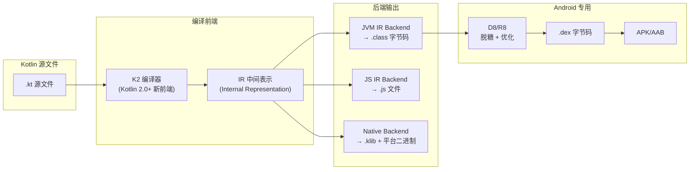
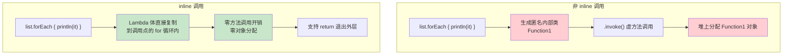
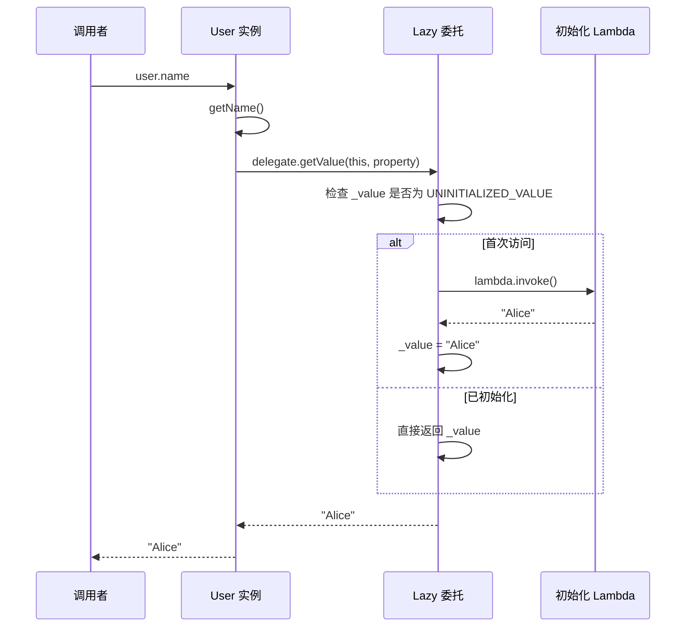

# Kotlin 语言特性 —— 面试学习完整指南

> **六层递进体系**：面试问题 → 标准答案 → 核心原理 → 流程图 → 源码分析 → 实战场景
> 适用岗位：高级/资深 Android 工程师、Kotlin 深度使用者

---

## 目录

1. [常见面试问题（7+题）](#1-常见面试问题)
2. [标准答案与要点解析](#2-标准答案与要点解析)
3. [核心原理深度讲解](#3-核心原理深度讲解)
4. [原理流程图（HTML + Mermaid.js）](#4-原理流程图)
5. [核心源码分析](#5-核心源码分析)
6. [应用场景举例](#6-应用场景举例)

---

## 1. 常见面试问题

### Q1: Kotlin 扩展函数的实现原理是什么？为何能访问 private 成员？
### Q2: 高阶函数与 inline 优化的原理？reified 内联特化如何突破泛型擦除？
### Q3: 委托属性（by lazy / by observable / by Delegates.notNull）的底层实现机制？
### Q4: 密封类（sealed class）与枚举类的本质区别？各自适用场景？
### Q5: data class 的 equals() / hashCode() / copy() / componentN() 是如何生成的？有哪些陷阱？
### Q6: lateinit 与 by lazy 的区别？各自的字节码实现？
### Q7（进阶）: 协变（out）与逆变（in）的原理？`List<out T>` vs `List<in T>`？

---

## 2. 标准答案与要点解析

### Q1: 扩展函数实现原理 —— 静态方法 + Receiver

```kotlin
// Kotlin 源码
fun String.lastChar(): Char = this[this.length - 1]

// 编译后的 Java 字节码等价代码：
public final class StringExtKt {
    // ★ 扩展函数编译为静态方法，receiver 作为第一个参数
    public static final char lastChar(@NotNull String $this$lastChar) {
        return $this$lastChar.charAt($this$lastChar.length() - 1);
    }
}
```

**核心机制**：

| 特性 | 实现方式 | 限制 |
|------|---------|------|
| 扩展函数 | 静态方法，`receiver` 作为第一参数 | **不能访问 `private` 成员**（仅能访问 `public/internal`） |
| 扩展属性 | 编译为静态 getter/setter 方法 | 不能有 backing field —— 因为无变量存储空间 |
| 成员扩展 | 类内部定义的扩展，编译为当前类的私有静态方法 | receiver 仍是第一参数，this 嵌套 |
| 泛型扩展 | `fun <T> T.println()` — 编译后仍为静态方法，类型擦除 | 签名保留，`@JvmName` 可避免冲突 |

**面试追问**："我明明用扩展函数访问了 private 方法！"

答：那是 Kotlin 编译器的**语法糖**！实际字节码中，编译器自动生成了 `public` 访问桥接方法，导致仿佛能穿透 `private`。反编译 Java 代码即可证实。

---

### Q2: 高阶函数与 inline 优化

#### 高阶函数与非 inline 的代价

```kotlin
// Kotlin 高阶函数
fun <T> List<T>.myFilter(predicate: (T) -> Boolean): List<T> {
    val result = mutableListOf<T>()
    for (item in this) {
        if (predicate(item)) result.add(item)
    }
    return result
}

// 调用：
val even = list.filter { it % 2 == 0 }
```

**非 inline 编译后的 Java 等价代码产生**：

```text
1. predicate 编译为 Function1<T, Boolean> 接口的匿名实现
2. 每次调用生成一个新的 Function1 对象（堆分配！）
3. 每个捕获的外部变量装箱为 IntRef / ObjectRef（堆分配！）
4. 循环体内 .invoke() 调用 → 额外的方法调用开销
```

#### inline 函数的 Lambda 展开

```kotlin
// 添加 inline 关键字
inline fun <T> List<T>.myFilter(predicate: (T) -> Boolean): List<T> {
    val result = mutableListOf<T>()
    for (item in this) {
        if (predicate(item)) result.add(item)
    }
    return result
}

// ★ inline 编译后——lambda 体被直接"复制粘贴"到调用点
// Java 等价伪代码（编译后）：
List<Integer> result = new ArrayList<>();
for (Integer item : list) {
    if (item % 2 == 0) {  // ← lambda 体被内联展开！无 Function1 对象！
        result.add(item);
    }
}
```

**inline 三大收益**：

| 收益 | 机制 | 量化 |
|------|------|------|
| 消除函数对象 | Lambda 体直接插入调用点 | 避免 Function1 对象分配 1~3 次/调用 |
| 消除方法调用 | .invoke() 被替换为直接执行 | 避免虚方法调用开销 |
| 支持非局部返回 | `return` 直接退出外层函数 | 普通 lambda 必须用 `return@label` |

#### reified —— 突破泛型擦除

```kotlin
// ❌ 普通泛型：运行时 T 被擦除为 Any?，无法类型判断
fun <T> isOfType(value: Any): Boolean = value is T  // 编译错误！

// ✅ reified + inline：运行时保留具体类型
inline fun <reified T> isOfType(value: Any): Boolean = value is T

// 调用：isOfType<String>("hello") → 编译后展开为：
// value instanceof String
```

**reified 原理**：因为 `inline` 函数会展开到调用点，编译器在展开时已经知道 `T` 的具体类型，可以直接替换为 `value instanceof String`。

---

### Q3: 委托属性底层实现

```kotlin
// Kotlin 源码
class User {
    val name: String by lazy { loadName() }
}

// ★ 编译后的 Java 等价伪代码
public final class User {
    // 编译器生成的私有字段，持有 Lazy 实例
    private final Lazy name$delegate;

    // getter 代理给 Lazy.getValue()
    public final String getName() {
        return (String) this.name$delegate.getValue();
    }

    public User() {
        // 初始化 Lazy —— SYNCHRONIZED 是默认模式
        this.name$delegate = LazyKt.lazy(
            (Function0)(new Function0<String>() {
                public String invoke() {
                    return loadName();  // 原 lambda 体
                }
            })
        );
    }
}
```

**三种 Lazy 线程安全模式**：

| 模式 | `LazyThreadSafetyMode` | 实现 | 代价 |
|------|----------------------|------|------|
| `SYNCHRONIZED`（默认） | `SynchronizedLazyImpl` | `synchronized(this)` 双重检查 | 锁开销 |
| `PUBLICATION` | `SafePublicationLazyImpl` | CAS 自旋 | 可能多次调用初始化 lambda |
| `NONE` | `UnsafeLazyImpl` | 无同步，单线程读 | 零开销，但不安全 |

```kotlin
// observable 委托的字节码实现
var name: String by Delegates.observable("初始值") { prop, old, new ->
    println("$old → $new")
}

// ★ 编译后：KProperty 对象 + ReadWriteProperty 接口
// Delegates.observable() 返回一个 ObservableProperty<T> 对象
// 内部维护 _value 字段，setter 中先设置新值再回调 onChange
```

**面试追问**："委托属性为什么不能有 backing field？"

答：委托属性的值存储在**委托对象**内部，而非宿主类。`this.name` 实际上调用的是 `delegate.getValue(this, property)`，没有字段存储空间——编译器根本不为委托属性生成 backing field。

---

### Q4: 密封类 vs 枚举类

```kotlin
// 枚举类：每个实例是全局唯一的单例
enum class PaymentMethod {
    CASH,        // 单例
    CREDIT_CARD, // 单例
    WECHAT_PAY   // 单例
}

// 密封类：每个子类是类型，可以有多个实例
sealed class Result<out T> {
    data class Success<T>(val data: T) : Result<T>()  // 可以有多个 Success 实例
    data class Error(val code: Int, val msg: String) : Result<Nothing>()
    object Loading : Result<Nothing>()  // 用 object 表示单例子类
}
```

| 维度 | `enum class` | `sealed class` |
|------|------------|----------------|
| **实例唯一性** | 每个枚举值是全局单例 | 子类可以有多个实例 |
| **携带数据** | 枚举值可带构造参数，但每个值固定 | 每个子类可携带**不同数量和类型**的数据 |
| **when 穷举** | 编译器强制穷举所有枚举值 | 编译器强制穷举**同文件内**所有直接子类 |
| **序列化** | 天然支持 `name`/`ordinal` | 需要手动处理或使用 kotlinx.serialization |
| **跨模块扩展** | 不能添加新枚举值 | **不能**（sealed 限制子类必须在同一文件/模块内） |
| **典型场景** | 固定选项集：方向、状态码 | 可携带数据的多种结果：网络请求结果、UI 状态 |

**进阶**：Kotlin 1.5+ sealed class 支持**同模块跨文件**子类（`sealed interface` 则 1.5+ 支持）。Kotlin 1.9+ 更推荐 `sealed interface` 作为代数数据类型的首选。

---

### Q5: data class 机制与陷阱

```kotlin
data class User(val id: Int, var name: String, val tags: List<String>)
```

**data class 自动生成的 5 个方法**：

```text
1. equals()    —— 基于主构造器中声明的所有属性
2. hashCode()  —— 基于 equals() 用到的属性计算
3. toString()  —— "User(id=1, name=Alice, tags=[...])"
4. copy()      —— 浅拷贝，主构造器属性逐一复制
5. componentN() —— 解构声明的基础：component1()=id, component2()=name, ...
```

**陷阱1：copy() 是浅拷贝**

```kotlin
val user1 = User(1, "Alice", mutableListOf("Kotlin"))
val user2 = user1.copy(name = "Bob")
// ★ user2.tags === user1.tags  → 同一个 List 对象！
user2.tags.add("Java")  // user1.tags 也被修改
```

**陷阱2：equals() 只看主构造器属性**

```kotlin
data class User(val id: Int) {
    var cachedData: String = "" // ← 不在主构造器，不参与 equals/hashCode
}

val u1 = User(1).apply { cachedData = "A" }
val u2 = User(1).apply { cachedData = "B" }
println(u1 == u2)  // true! -- .cachedData 被忽略
```

**陷阱3：与 JPA/Hibernate 的兼容性问题**

data class 的 `equals()`/`hashCode()` 与 Hibernate 的代理对象机制冲突：Hibernate 代理对象是 `User$HibernateProxy$xxx` 类型，其 `equals()` 调用 `super.equals()` 可能导致 `User` 的 data class equals 不被正确调用。

---

### Q6: lateinit vs by lazy 深度对比

```kotlin
class ViewModel {
    // lateinit: var 可变，手动初始化
    lateinit var repository: UserRepository

    // by lazy: val 不可变，首次访问自动初始化
    val analytics: Analytics by lazy { AnalyticsImpl() }
}
```

| 维度 | `lateinit var` | `val by lazy {}` |
|------|:---:|:---:|
| **可变性** | `var`（可重新赋值） | `val`（初始化后不可变） |
| **初始化时机** | 手动调用 `= xxx` | 首次 `get()` 自动调用 lambda |
| **线程安全** | **不保证**（需自行处理） | 默认 `SYNCHRONIZED` |
| **可空检查** | 访问未初始化时抛 `UninitializedPropertyAccessException` | 初始化后永远非空 |
| **开销量** | `isInitialized` 检查 + throw | 首次访问有锁/lambda 调用开销 |
| **字节码** | `private T field` + `isInitialized` boolean 标记 | `private Lazy<T>` 委托对象 |
| **适用场景** | DI 注入（Dagger/Hilt）、`onCreate` 初始化 | 计算昂贵的只读属性、需要 `this` 引用 |

**字节码细节**：

```java
// lateinit 的 Java 等价
private UserRepository repository;
private boolean repository$isInitialized;

public UserRepository getRepository() {
    if (!repository$isInitialized) {
        // Kotlin 1.2+ 会抛 UninitializedPropertyAccessException
        throw new UninitializedPropertyAccessException("repository");
    }
    return repository;
}

public void setRepository(UserRepository value) {
    repository = value;
    repository$isInitialized = true;
}
```

---

### Q7: 协变 out 与逆变 in

```kotlin
// 协变 out: 生产者 —— 只读，只能返回 T
interface Producer<out T> {
    fun produce(): T          // ✅ OK: T 作为返回值（生产）
    // fun consume(item: T)   // ❌ 编译错误: T 不能作为参数（消费）
}

// 逆变 in: 消费者 —— 只写，只能消费 T
interface Consumer<in T> {
    fun consume(item: T)     // ✅ OK: T 作为参数（消费）
    // fun produce(): T       // ❌ 编译错误: T 不能作为返回值（生产）
}

// ★ 核心：子类型关系在不同方向传递
// String 是 Any 的子类型
val strings: List<String> = listOf("a", "b")
val anys: List<Any> = strings     // ✅ List<out T>，协变
// 逆向：Comparator<Any> 可以安全地比较 String
val anyComparator: Comparator<Any> = ...
val stringComparator: Comparator<String> = anyComparator // ✅ in T，逆变
```

**Java 与 Kotlin 的协变逆变对比**：

| Java 语法 | Kotlin 语法 | 含义 |
|-----------|-----------|------|
| `? extends T` | `out T` | 协变（生产者），只能读取 |
| `? super T` | `in T` | 逆变（消费者），只能写入 |
| `?` | `*` | 星投影，等价于 `out Any?` |

**Android 实战**：`List<out View>` 保证你只从中读取 View，不会意外插入异常类型；`MutableList<in CharSequence>` 保证你可以安全地向 `List<Any>` 写入数据（因为写入的是 `CharSequence` 子类型）。

---

## 3. 核心原理深度讲解

### 3.1 Kotlin 编译后的字节码全景对照

```
Kotlin 源码                   编译后 Java 等价

━━━ 顶层函数 ━━━━━━━━━━━━━━━━━━━━━━━━━━━
// File.kt                     // → FileKt.class
fun topLevel() {}               public static final void topLevel() {}

━━━ 扩展函数 ━━━━━━━━━━━━━━━━━━━━━━━━━━━
fun String.isEmail(): Boolean   public static boolean isEmail(String $this)
= contains("@")                 { return $this.contains("@"); }

━━━ 默认参数 ━━━━━━━━━━━━━━━━━━━━━━━━━━━
fun greet(name: String,         public static void greet(String name, String msg)
    msg: String = "Hello")      { greet$default(name, msg, 1, null); }
                                // 自动生成合成方法 $default，用位掩码判断

━━━ 数据类 ━━━━━━━━━━━━━━━━━━━━━━━━━━━━━
data class User(val id: Int)    // → equals/hashCode/toString/copy/componentN()
                                // → User$$serializer (如果 @Serializable)

━━━ 伴生对象 ━━━━━━━━━━━━━━━━━━━━━━━━━━━
class Config {                  public class Config {
    companion object {              public static final Companion Companion
        const val MAX = 100            = new Companion();
    }                              public static class Companion {
}                                      public static final int MAX = 100;
                                   }
                               }

━━━ 协程挂起函数 ━━━━━━━━━━━━━━━━━━━━━━━
suspend fun fetch(): String     // → 添加 Continuation 参数
                                // → 返回 Object (result | COROUTINE_SUSPENDED)
                                // → 状态机 switch-case
```

### 3.2 inline 函数对包体积的影响分析

```text
单个 inline 函数场景          多个调用点下的展开
─────────────────────────    ─────────────────────
inline fun log(msg: String)   // 调用点1: log("A")
{ println("[${tag}] $msg") }  //   展开为: println("[Main] A")
                              //
fun foo() {                   // 调用点2: log("B")
    log("hello")  // 一行调用 //   展开为: println("[Main] B")
}                             //
                              // 净收益：避免 Function0 对象分配
                              // 包体积影响：inline 函数体很小，展开影响可忽略

反例：庞大 inline 函数
──────────────────────────────
inline fun hugeProcess() {    // 调用3处 → 总字节码 = 函数体 × 3
    // 200 行代码              // 包体积急剧膨胀！
}                              // ★ 经验法则：inline 函数体 > 10 行，慎用
```

**inline 决策树**：

```text
函数参数是否有 Lambda？——No→ 不需要 inline
        │
       Yes
        │
Lambda 是否被存储/传递到非 inline 上下文？
        │
    ┌───No──→ 使用 inline（消除 Function 对象）
    │
    Yes (如存储在成员变量、传递给另一个函数)
        │
        └──→ 对特定 lambda 使用 noinline 关键字
               或 crossinline（禁止非局部返回）
```

### 3.3 协变逆变的类型安全证明

```kotlin
// 为什么 Array<T> 不能协变？
val strings: Array<String> = arrayOf("a", "b")
// val anys: Array<Any> = strings  // ❌ 编译错误！如果允许...

// 假设编译通过，将导致运行时类型错误：
// anys[0] = 42  // 将 Int 写入 String[] → ArrayStoreException!
// 因此 Kotlin 中 Array<T> 是不变（invariant）的

// 而 List<T> 是只读的，声明为 interface List<out E>
// 没有 add/set 等修改方法 → 协变安全
```

---

## 4. 原理流程图

### 4.1 Kotlin 编译流程全景图



### 4.2 inline 函数 Lambda 展开对比



### 4.3 委托属性调用链时序图



---

## 5. 核心源码分析

### 5.1 Kotlin 标准库中 apply / also / let / run / with 的实现

```kotlin
// 源码位置：kotlin-stdlib/src/kotlin/util/Standard.kt

// 行 1: apply —— 扩展函数，返回 receiver 本身
@kotlin.internal.InlineOnly
public inline fun <T> T.apply(block: T.() -> Unit): T {
    // 行 2
    contract {                                    // 行 3
        callsInPlace(block, InvocationKind.EXACTLY_ONCE)
    }                                             // 行 4
    block()  // ← receiver 就是 this              // 行 5
    return this  // ← 返回 receiver 自身          // 行 6
}                                                 // 行 7

// ★ 使用场景：对象初始化后返回自身
// val user = User().apply {
//     name = "Alice"
//     age = 25
// }

// 行 8: also —— 扩展函数，返回 receiver，但用 it 传参
@kotlin.internal.InlineOnly
public inline fun <T> T.also(block: (T) -> Unit): T {
    // 行 9
    contract {                                    // 行 10
        callsInPlace(block, InvocationKind.EXACTLY_ONCE)
    }                                             // 行 11
    block(this)  // ← receiver 作为参数传入       // 行 12
    return this  // ← 返回 receiver 自身          // 行 13
}                                                 // 行 14

// ★ 使用场景：需要引用自身时的副作用操作
// user.also { log("创建了用户: $it") }

// 行 15: let —— 扩展函数，返回 lambda 的返回值
@kotlin.internal.InlineOnly
public inline fun <T, R> T.let(block: (T) -> R): R {
    contract {                                    // 行 16
        callsInPlace(block, InvocationKind.EXACTLY_ONCE)
    }                                             // 行 17
    return block(this)  // ← 返回 lambda 结果     // 行 18
}                                                 // 行 19

// ★ 使用场景：?.let 安全调用，链式变换
// val length = nullableString?.let { it.length } ?: 0

// 行 20: run —— 扩展函数，返回 lambda 返回值
@kotlin.internal.InlineOnly
public inline fun <T, R> T.run(block: T.() -> R): R {
    contract {                                    // 行 21
        callsInPlace(block, InvocationKind.EXACTLY_ONCE)
    }                                             // 行 22
    return block()  // ← this 是 receiver         // 行 23
}                                                 // 行 24

// ★ 使用场景：需要在对象上下文中计算一个值
// val fullName = user.run { "$firstName $lastName" }

// 行 25: with —— 普通函数（非扩展），返回 lambda 返回值
@kotlin.internal.InlineOnly
public inline fun <T, R> with(receiver: T, block: T.() -> R): R {
    contract {                                    // 行 26
        callsInPlace(block, InvocationKind.EXACTLY_ONCE)
    }                                             // 行 27
    return receiver.block()                       // 行 28
}                                                 // 行 29

// ★ 使用场景：需要一个对象做多件事，最后返回结果
// val result = with(webView.settings) {
//     javaScriptEnabled = true
//     domStorageEnabled = true
//     this  // 返回整个 settings
// }
```

**五种作用域函数的选择指南**：

| 函数 | Receiver 引用 | 返回值 | 典型场景 |
|------|:-----------:|:-----:|---------|
| `apply` | `this` | 自身 | 对象初始化配置 |
| `also` | `it` | 自身 | 打印日志、验证、额外操作 |
| `let` | `it` | Lambda 结果 | 安全调用 ?.let、类型转换后操作 |
| `run` | `this` | Lambda 结果 | 对象作用域内计算新值 |
| `with` | `this` | Lambda 结果 | 对非空对象执行多个操作 |

### 5.2 内联函数对包体积影响的量化分析

```kotlin
// 行 1: 小尺寸 inline —— 安全，体积影响可忽略
inline fun log(msg: String) {
    // 行 2
    android.util.Log.d("TAG", msg)  // 1 行代码，展开 5 处 = 额外 5 行
}                                    // 行 3

// 行 4: 大尺寸 inline —— 危险！
inline fun measureTime(block: () -> Unit): Long {
    // 行 5
    val start = System.nanoTime()    // 行 6
    block()                          // 行 7
    val end = System.nanoTime()      // 行 8
    return end - start               // 行 9
}                                    // 行 10
// 如果调用 100 处 → 展开 100 次 → 字节码膨胀！

// ★ 改进：部分 inline（只内联 lambda，保留函数体框架）
// 使用 noinline 标记不内联的参数
inline fun measureTimeV2(
    noinline setup: () -> Unit = {},
    crossinline block: () -> Unit
): Long {
    setup()  // setup 不内联，仅调用一次
    val start = System.nanoTime()
    block()  // block 仍内联（crossinline 不允许非局部返回）
    return System.nanoTime() - start
}
```

---

## 6. 应用场景举例

### 场景1：用扩展函数封装 Android API

```kotlin
// ★ 问题：findViewById 冗长，View 的可见性切换代码重复
// ❌ 传统写法
textView.visibility = View.VISIBLE
if (Build.VERSION.SDK_INT >= Build.VERSION_CODES.M) {
    textView.setTextColor(resources.getColor(R.color.primary, null))
} else {
    textView.setTextColor(resources.getColor(R.color.primary))
}

// ✅ 扩展函数封装
fun View.visible() { visibility = View.VISIBLE }
fun View.gone() { visibility = View.GONE }
fun View.invisible() { visibility = View.INVISIBLE }

// 颜色兼容封装
fun Context.getColorCompat(@ColorRes colorRes: Int): Int {
    return ContextCompat.getColor(this, colorRes)
}

// ★ 扩展属性 —— 更自然
val View.isVisible: Boolean get() = visibility == View.VISIBLE

// 调用端极简
textView.visible()
textView.setTextColor(context.getColorCompat(R.color.primary))
```

### 场景2：委托属性替代 findViewById（仿 ViewBinding）

```kotlin
// ★ 用委托属性实现手动 View Binding（Kotlin 1.4 前无 ViewBinding 时常见）
class MainActivity : AppCompatActivity() {

    // 行 1: 委托给 lazy，首次访问时才 findViewById
    private val tvTitle: TextView by lazy {
        // 行 2
        findViewById(R.id.tv_title)
    }                                               // 行 3

    // 行 4: 配合 viewLifecycleOwner 使用
    private val btnSubmit: Button by lazy {
        // 行 5
        findViewById(R.id.btn_submit)
    }                                               // 行 6

    override fun onCreate(savedInstanceState: Bundle?) {
        // 行 7
        super.onCreate(savedInstanceState)
        setContentView(R.layout.activity_main)     // 行 8
        // findViewById 延迟到此之后的首次访问     // 行 9

        tvTitle.text = "Hello Kotlin"              // 行 10: 首次访问触发初始化
        btnSubmit.setOnClickListener { ... }        // 行 11
    }
}

// ★ 进阶：泛型委托封装（仿 ViewBinding 思路）
class ViewFinder<out T : View>(
    private val activity: Activity,
    private val viewId: Int
) : Lazy<T> {
    private var cached: T? = null

    override val value: T
        get() {
            if (cached == null) {
                @Suppress("UNCHECKED_CAST")
                cached = activity.findViewById(viewId) as T
            }
            return cached!!
        }

    override fun isInitialized(): Boolean = cached != null
}

// 使用
fun <T : View> Activity.bindView(@IdRes id: Int): Lazy<T> =
    ViewFinder(this, id)

class MainActivity : AppCompatActivity() {
    private val tvTitle: TextView by bindView(R.id.tv_title)
}
```

### 场景3：sealed class 管理 UI 状态（现代 MVVM）

```kotlin
// ★ 替代 LiveData + enum 的复杂状态管理
sealed class UiState<out T> {
    object Loading : UiState<Nothing>()
    data class Success<T>(val data: T) : UiState<T>()
    data class Error(val code: Int, val message: String) : UiState<Nothing>()
}

// ViewModel
class UserViewModel : ViewModel() {
    private val _state = MutableStateFlow<UiState<UserInfo>>(UiState.Loading)
    val state: StateFlow<UiState<UserInfo>> = _state.asStateFlow()

    fun loadUser(id: Int) {
        viewModelScope.launch {
            _state.value = UiState.Loading
            try {
                val user = repository.getUser(id)
                _state.value = UiState.Success(user)
            } catch (e: Exception) {
                _state.value = UiState.Error(500, e.message ?: "Unknown")
            }
        }
    }
}

// Activity/Fragment
viewModel.state.collect { state ->
    when (state) {  // ★ when 穷举：编译器确保所有分支覆盖
        is UiState.Loading -> showLoading()
        is UiState.Success -> showContent(state.data)
        is UiState.Error -> showError(state.message)
    }
}
```

### 场景4：reified 在路由框架中的应用

```kotlin
// ★ ARouter 风格的类型安全路由跳转
inline fun <reified T : Activity> Context.startActivity(
    noinline extras: Intent.() -> Unit = {}
) {
    val intent = Intent(this, T::class.java)  // ★ reified 让 T::class.java 可行
    intent.extras()
    startActivity(intent)
}

// 调用 —— 极简且类型安全
// context.startActivity<UserProfileActivity> {
//     putExtra("user_id", 123)
// }

// ★ 对比：使用纯反射的方式
fun startActivityReflection(className: String) {
    val clazz = Class.forName(className)  // 慢、不安全
    startActivity(Intent(this, clazz))
}
```

### 场景5：协变逆变在 API 设计中的应用

```kotlin
// ★ 场景：数据转换层
interface Mapper<in From, out To> {
    fun map(from: From): To
}

// UserDto → User（DTO 转领域模型）
class UserMapper : Mapper<UserDto, User> {
    override fun map(from: UserDto): User {
        return User(from.id, from.name, from.email)
    }
}

// ★ 逆变的好处：Mapper<UserDto, User> 可以直接赋值给 Mapper<UserDto, Any>
val mapper: Mapper<UserDto, Any> = UserMapper()
// 因为 To=User 是 To=Any 的子类型，out 协变允许向上转型

// ★ 协变的好处：List<User> 可以直接赋值给 List<Any>
fun printAll(list: List<Any>) { list.forEach(::println) }
printAll(listOf<User>(User(1, "Alice")))  // ✅ 协变安全
```

---

## 总结：面试高频追问点

| 追问方向 | 考察点 | 准备建议 |
|---------|--------|---------|
| "inline 有什么负面影响？" | 包体积膨胀、禁用 inline class 的引用传递 | 区分 inline 函数体大小，说清 crossinline/noinline |
| "data class 和普通 class 的字节码差异？" | equals/hashCode/copy/componentN | 说明编译器自动生成 + @JvmRecord 注解 |
| "sealed class 的 when 穷举怎样跨模块？" | sealed interface + 模块内声明 | Kotlin 1.9+ sealed interface 跨文件继承 |
| "by lazy 的线程安全如何选择？" | LazyThreadSafetyMode 三种模式 | 结合 Android 主线程/后台线程分析 |
| "reified 为什么必须 inline？" | 泛型擦除机制 | inline 展开时已知道具体类型，无需运行时反射 |

---

> **学习建议**：Kotlin 语言特性是 Android 高级岗位的必考内容。重点关注扩展函数、inline/reified、委托属性、密封类的实际应用。面试官通常通过"这个语法糖背后的字节码是什么"来检验对 Kotlin 的深度理解，而非仅仅会写语法。
