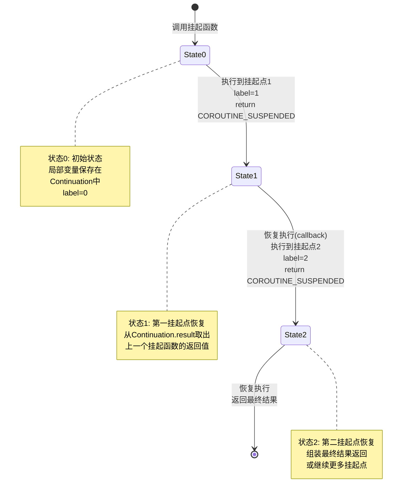
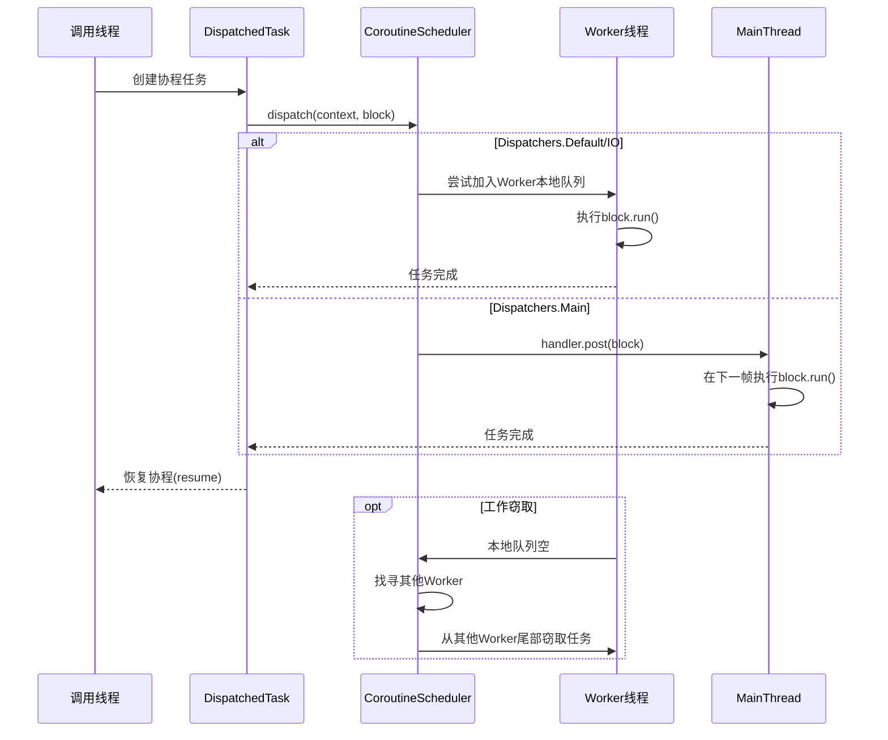
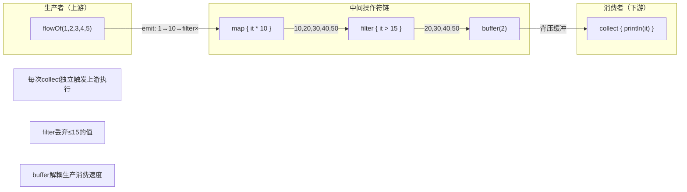

# Kotlin 协程 —— 面试学习完整指南

> **六层递进体系**：面试问题 → 标准答案 → 核心原理 → 流程图 → 源码分析 → 实战场景
> 适用岗位：高级/资深 Android 工程师、Kotlin 协程深度使用者

---

## 目录

1. [常见面试问题（7+题）](#1-常见面试问题)
2. [标准答案与要点解析](#2-标准答案与要点解析)
3. [核心原理深度讲解](#3-核心原理深度讲解)
4. [原理流程图（HTML + Mermaid.js）](#4-原理流程图)
5. [核心源码分析](#5-核心源码分析)
6. [应用场景举例](#6-应用场景举例)

---

## 1. 常见面试问题

### Q1: 挂起函数（suspend function）的实现原理是什么？Continuation 和 CPS 转换是怎么回事？
### Q2: 协程调度器 Dispatchers.Main / IO / Default 的底层实现有什么区别？各自的线程池策略？
### Q3: 协程上下文（CoroutineContext）与协程作用域（CoroutineScope）的关系？结构化并发（Structured Concurrency）如何管理生命周期？
### Q4: Kotlin Flow 冷流与热流的区别？SharedFlow 和 StateFlow 的实现机制和适用场景？
### Q5: 协程取消机制的原理？Job.cancel() / ensureActive() / yield() 的协作式取消如何工作？
### Q6: launch / async / runBlocking 三者的区别？各自的异常处理策略有何不同？
### Q7（进阶）: supervisorScope 与 coroutineScope 的区别？SupervisorJob 如何实现异常隔离？

---

## 2. 标准答案与要点解析

### Q1: 挂起函数原理 —— Continuation + CPS 转换

```kotlin
// Kotlin 源码：一个简单的挂起函数
suspend fun fetchUser(id: Int): User {
    val token = getToken()           // 挂起点1
    val user = getUser(token, id)    // 挂起点2
    return user
}

// ★ 编译后的伪代码（CPS 转换 + 状态机）：
public final Object fetchUser(int id, Continuation<? super User> $completion) {
    // 状态机状态：0=初始, 1=第1挂起点恢复, 2=第2挂起点恢复
    switch ($completion.label) {
        case 0:
            $completion.label = 1;
            Object result = getToken($completion);
            if (result == COROUTINE_SUSPENDED) return COROUTINE_SUSPENDED;
            // 未真正挂起（已同步返回），继续执行
        case 1:
            String token = (String) $completion.result;
            $completion.label = 2;
            Object result = getUser(token, id, $completion);
            if (result == COROUTINE_SUSPENDED) return COROUTINE_SUSPENDED;
        case 2:
            User user = (User) $completion.result;
            return user;
    }
}
```

**核心机制**：

| 概念 | 说明 | 关键点 |
|------|------|--------|
| **CPS 变换** | 编译器将挂起函数转换为回调风格 `(Continuation) -> Any?` | 每个挂起点都成为状态机的一个 `case` 分支 |
| **Continuation** | 协程的"续体"，封装了恢复执行所需的全部上下文 | 包含 `CoroutineContext`、状态标签 `label`、当前结果 `result` |
| **状态机** | 用 `switch-case` 实现，`label` 字段记录当前执行到哪个挂起点 | 避免创建多个匿名内部类，性能优于传统回调 |
| **COROUTINE_SUSPENDED** | 挂起标记值 —— 返回该值表示"我已挂起，等异步操作完成后回调" | 编译器识别此哨兵值，不返回则视为同步结果直接继续 |

**面试加分表述**：

> "挂起函数本质上是 CPS（Continuation Passing Style）变换的产物。Kotlin 编译器在编译期将每个 `suspend` 函数改写为一个接收 `Continuation` 参数的普通函数，内部通过状态机模式组织多个挂起点。这种实现的精妙之处在于：**没有引入额外的 JVM 字节码指令**，完全兼容 Java 6+，且状态机避免了传统回调地狱中创建大量匿名内部类的开销。反编译 class 文件即可看到 `label` 字段驱动的 `switch-case` 结构。"

---

### Q2: 调度器底层实现 —— 线程池策略对比

```kotlin
// 源码：Dispatchers 的创建链
// Dispatchers.Main → AndroidDispatcherFactory → HandlerContext(Looper.getMainLooper())
// Dispatchers.Default → DefaultScheduler(CorePoolSize = CPU核心数, MaxPoolSize = MAX_POOL_SIZE)
// Dispatchers.IO → LimitingDispatcher(DefaultScheduler, parallelism = 64)
```

| 调度器 | 线程数 | 底层实现 | 适用场景 |
|--------|--------|----------|----------|
| **Dispatchers.Main** | 1（主线程） | `Handler(Looper.getMainLooper())` 将任务 post 到主线程消息队列 | UI 更新、LiveData 赋值 |
| **Dispatchers.Default** | `max(2, CPU核心数)` | `DefaultScheduler` 基于 `ForkJoinPool` 风格的工作窃取线程池 | CPU 密集型：JSON 解析、数据排序、复杂计算 |
| **Dispatchers.IO** | 默认 64（可弹性扩缩） | `LimitingDispatcher` 包装 DefaultScheduler，限制并行度 | I/O 密集型：网络请求、文件读写、数据库操作 |
| **Dispatchers.Unconfined** | 不切换线程 | 在调用线程启动，在第一个挂起点恢复后随机切换线程 | 仅测试或特殊场景 |

**面试加分表述**：

> "`Dispatchers.Default` 使用 CPU 核心数作为线程池大小，背后是 **工作窃取算法**（Work Stealing）—— 每个工作线程维护一个本地双端队列，当一个线程处理完自己的任务后会从其他线程的队列尾部窃取任务执行，避免线程间的负载不均衡。而 `Dispatchers.IO` 虽然默认有 64 个线程的上限，但底层共享了 Default 的线程池，通过 `LimitingDispatcher` 做了一层限流代理，实现了 **同一套物理线程、不同逻辑限制** 的精妙设计。实际面试中要说清楚：**Default 和 IO 共享底层线程资源，区别仅在于并行度限制策略不同。**

---

### Q3: 协程上下文与 Scope —— 结构化并发

```kotlin
// CoroutineContext = Job + Dispatcher + CoroutineName + CoroutineExceptionHandler + ...
// Element 通过 Key 索引，使用 + 操作符组合（相当于 Map 的叠加）

val scope = CoroutineScope(SupervisorJob() + Dispatchers.Main + CoroutineName("MyScope"))

// 结构化并发：父协程等待所有子协程完成
scope.launch {          // 父协程
    launch {            // 子协程1 —— 异常会取消父协程（除非 SupervisorJob）
        delay(1000)
    }
    async {             // 子协程2
        delay(2000)
    }
    // 父协程离开作用域前自动等待所有子协程完成
}
```

**关键机制**：

- **结构化并发三定律**：
  1. 父协程会等待所有子协程执行完毕才结束
  2. 取消父协程会级联取消所有子协程
  3. 子协程未捕获的异常（除 `SupervisorJob` 和 `CancellationException`）会向上传播并取消父协程
- **CoroutineContext 的 "+" 操作符**：左侧优先（后加的同 key 元素会覆盖先加的），本质是 `fold` 合并
- **`coroutineContext[Job]`**：始终可以获取当前协程的 Job，用于结构化并发树

**面试加分表述**：

> "CoroutineContext 的设计是 Kotlin 协程的基石 —— 它采用了 **不可变集合 + 函数式组合** 的模式。每个 Element 既是集合中的单个元素，自身也是一个只包含单个元素的 Context，通过 `plus` 操作符实现类似 `Map.plus` 的语义。这种设计比传统的显式 Map 更类型安全，且利用 Kotlin 的 `companion object Key` 实现了编译期 key-type 绑定，避免了运行时的类型转换错误。"

---

### Q4: Flow 冷流 vs 热流 —— SharedFlow / StateFlow

```kotlin
// 冷流：每次 collect 都重新执行上游代码
val coldFlow = flow {
    println("开始执行")     // 每次收集都打印
    emit(1)
    delay(1000)
    emit(2)
}

// 热流 SharedFlow：不重复执行，适合事件分发
val sharedFlow = MutableSharedFlow<String>(
    replay = 0,           // 新订阅者重放最近 N 个值
    extraBufferCapacity = 64,
    onBufferOverflow = BufferOverflow.DROP_OLDEST
)

// 热流 StateFlow：始终持有最新值，自动去重
val stateFlow = MutableStateFlow<User?>(null)  // 必须有初始值
```

| 特性 | Flow（冷流） | SharedFlow（热流） | StateFlow（热流） |
|------|-------------|-------------------|-------------------|
| 执行时机 | 每次 `collect` 触发 | 生产者主动 emit | 生产者主动更新 value |
| 重复执行 | 是 | 否 | 否 |
| 缓存/重放 | 无（除非 buffer 操作符） | `replay` 配置重放数量 | 始终持有 1 个最新值 |
| 去重 | 不主动去重 | 不主动去重 | **自动去重**（`equals` 判断） |
| 初始值 | 无需 | 无需 | **必须有初始值** |
| 典型场景 | 数据库查询响应 | 按钮点击事件、全局通知 | UI 状态持有 |

**面试加分表述**：

> "StateFlow 和 LiveData 的核心区别在于：StateFlow 是 **Kotlin 原生** 的，不依赖 Android 生命周期，支持 `combine`、`map` 等强大操作符链，且自动去重避免了无意义的 UI 刷新。同时它的 `value` 属性可以同步读取最新值，而 LiveData 必须通过 `observe` 回调。在 Jetpack Compose 中，`collectAsStateWithLifecycle()` 天然解决了生命周期感知问题，使得 StateFlow 成为 MVVM 中替代 LiveData 的首选方案。"

---

### Q5: 协程取消机制 —— 协作式取消

```kotlin
// 取消是协作式的 —— 挂起点才会检查取消
val job = scope.launch {
    for (i in 1..1000) {
        // ★ 方案1：调用挂起函数（内部自动检查取消）
        delay(100)                 // → 被取消时抛出 CancellationException

        // ★ 方案2：手动检查
        ensureActive()             // → 被取消时抛出 CancellationException
        yield()                    // → 让出执行权并检查取消

        // ★ 方案3：显式判断
        if (!isActive) throw CancellationException()
    }
}
job.cancel()  // 标记为取消状态，等待下一个挂起点响应
```

**取消传播规则**：

| 场景 | 行为 |
|------|------|
| `job.cancel()` | 标记 Job 为取消中，在下一个挂起点抛出 `CancellationException` |
| `job.cancel(cause)` | 可传入自定义取消原因 |
| `CancellationException` | **不向上传播**到父协程（被认为是正常退出） |
| 非 `CancellationException` | 向上传播 → 取消父协程 → 级联取消兄弟协程 |
| `withContext(NonCancellable)` | 在取消后仍需执行的清理代码块（如关闭资源） |

**面试加分表述**：

> "Kotlin 协程的取消是 **协作式** 的而非抢占式的 —— 这与 Java 已废弃的 `Thread.stop()` 有本质区别。抢占式取消可能导致资源未释放、锁未解开等严重问题，而协作式取消保证了代码只在安全的挂起点响应取消，开发者完全掌控资源清理时机。`NonCancellable` 的设计尤为精妙：它在取消已发生时创建一个新的 Job 上下文，使得 `finally` 块中的清理代码可以安全执行而不被立即取消。"

---

### Q6: launch / async / runBlocking 对比

```kotlin
// launch：发射即忘，返回 Job
val job: Job = scope.launch {
    doSomething()       // 异常直接传播到父协程
}

// async：返回结果，返回 Deferred<T>
val deferred: Deferred<String> = scope.async {
    fetchData()         // ★ 异常被 deferred 捕获，await() 时重新抛出
}
val result = deferred.await()

// runBlocking：阻塞当前线程，桥接常规代码和协程
fun main() = runBlocking {
    launch { delay(1000) }
}
```

| 维度 | launch | async | runBlocking |
|------|--------|-------|-------------|
| 返回值 | `Job` | `Deferred<T>` | `T`（直接返回值） |
| 阻塞调用线程 | 否 | 否 | **是**（阻塞直到内部完成） |
| 异常处理 | 立即传播到父协程 | **延迟传播**：`await()` 时抛出 | 传播到调用线程 |
| 典型场景 | 无返回值的后台任务 | 并发请求、需要返回值 | `main()` 函数、单元测试 |
| 是否可在挂起函数内调用 | 是（需 scope） | 是（需 scope） | 是（可直接调用） |

**面试加分表述**：

> "`launch` 和 `async` 的异常处理差异是面试高频考点。`async` 将异常封装在 `Deferred` 内部，只有在调用 `await()` 时才会重新抛出 —— 这意味着如果你创建了 `async` 但从不 `await()`，异常会被静默吞掉。最佳实践是永远在结构化并发中使用 `async`：要么用 `coroutineScope { async { } }` 确保异常最终传播，要么用 `supervisorScope { async { } }` 隔离子协程的失败。而 `runBlocking` 在 Android 主线程调用会直接导致 ANR，仅限单元测试或 JVM 命令行程序中使用。"

---

### Q7: supervisorScope vs coroutineScope —— 异常隔离

```kotlin
// coroutineScope：一个子协程失败 → 取消所有兄弟协程
suspend fun loadAll() = coroutineScope {
    val users = async { loadUsers() }      // 若失败 → 取消下面所有
    val config = async { loadConfig() }
    val feed = async { loadFeed() }
    users.await() to config.await()        // 任一失败则 scope 整体失败
}

// supervisorScope：子协程失败互不影响
suspend fun loadAllSafe() = supervisorScope {
    val users = async { loadUsers() }      // 若失败 → 不影响下面
    val config = async { loadConfig() }    // ★ 独立失败，互不牵连
    val feed = async { loadFeed() }
    users.await() to config.await()
}
```

**核心差异**：

- `coroutineScope` 内部使用普通 `Job`：**单向取消传播**，子异常 → 父失败 → 取消所有子
- `supervisorScope` 内部使用 `SupervisorJob`：**仅向下取消**，子异常不影响父和其他兄弟
- `SupervisorJob` 的 `childCancelled()` 方法重写为 **不传播非 CancellationException**

**面试加分表述**：

> "`supervisorScope` + `CoroutineExceptionHandler` 构成了协程异常处理的 **金字塔模型**：
> - **顶层**：`SupervisorJob` 确保一个模块崩溃不影响全局
> - **中层**：`coroutineScope` 确保相关任务要么全成功要么全失败
> - **底层**：`try-catch` 处理单个挂起函数的异常
> 这个分层异常处理体系是协程相比于 RxJava 异常处理的核心优势 —— 异常传播路径清晰可预测。"

---

## 3. 核心原理深度讲解

### 3.1 CPS（Continuation Passing Style）变换与状态机

Kotlin 协程最核心的编译魔法是 **CPS 变换**：编译器将每个 `suspend` 函数重写为接收 `Continuation` 参数的普通函数，并将函数体内的多个挂起点展开为状态机。

**编译阶段发生了什么：**

```
源码阶段：
suspend fun fetch(x: Int): String {
    val a = api1(x)       // 挂起点1
    val b = api2(a)       // 挂起点2
    return b
}

CPS 变换后（伪码）：
fun fetch(x: Int, $completion: Continuation<String>): Any? {
    val $continuation = $completion as? FetchContinuation ?: FetchContinuation($completion)
    when ($continuation.label) {
        0 -> {
            $continuation.x = x
            $continuation.label = 1
            val result = api1(x, $continuation)
            if (result == COROUTINE_SUSPENDED) return COROUTINE_SUSPENDED
            goto case 1  (with result)
        }
        1 -> {
            $continuation.a = result as String
            $continuation.label = 2
            val result = api2($continuation.a, $continuation)
            if (result == COROUTINE_SUSPENDED) return COROUTINE_SUSPENDED
            goto case 2  (with result)
        }
        2 -> {
            return result as String
        }
    }
}
```

**状态机类的生成**：编译器为每个挂起函数生成一个内部类，继承自 `ContinuationImpl`，包含：

- `label: Int` — 当前状态（执行到第几个挂起点）
- `result: Any?` — 上一次挂起点恢复时的返回值
- 原函数的局部变量 —— 在挂起点之间需要保持的变量提升为类字段

**为何不直接用回调嵌套？**

传统回调方式每层嵌套都会创建一个匿名内部类对象，N 层嵌套 = N 个对象分配。而状态机方式将 N 层合并为 **1 个对象 + 1 个 int label**，内存和 GC 压力大幅降低。

---

### 3.2 调度器的线程池架构

```
                  ┌──────────────────────────┐
                  │      CoroutineScheduler   │
                  │   (DefaultScheduler)       │
                  │                            │
                  │  ┌────────┐  ┌────────┐   │
                  │  │Worker-1│  │Worker-2│   │
                  │  │ 本地   │  │ 本地   │   │
                  │  │ 队列 ██│██│ 队列   │   │
                  │  └───┬────┘  └────────┘   │
                  │      │   工作窃取(steal)    │
                  │  ┌───┴────┐                │
                  │  │Worker-N│                │
                  │  │ 本地   │                │
                  │  │ 队列   │                │
                  │  └────────┘                │
                  └──────────┬───────────────┘
                             │
              ┌──────────────┼──────────────┐
              │              │              │
     ┌────────┴──┐   ┌──────┴──────┐  ┌───┴──────────┐
     │Dispatchers│   │Dispatchers  │  │Dispatchers   │
     │  .Main    │   │  .Default   │  │    .IO       │
     │           │   │             │  │              │
     │Handler +  │   │直接使用     │  │LimitingDispatcher│
     │MainLooper │   │Scheduler    │  │parallelism=64│
     └───────────┘   └─────────────┘  └──────────────┘
```

**Dispatchers.Main 的 Android 实现**：

```kotlin
// AndroidDispatcherFactory 在 classpath 中自动注册
// 通过 ServiceLoader 机制加载
internal class AndroidDispatcherFactory : MainDispatcherFactory {
    override fun createDispatcher(allFactories: List<MainDispatcherFactory>) =
        HandlerContext(Looper.getMainLooper())
}

// HandlerContext 内部：
override fun dispatch(context: CoroutineContext, block: Runnable) {
    handler.post(block)  // 就是普通的 Handler.post() —— 将任务放入主线程消息队列
}
```

**Dispatchers.Default 的工作窃取（Work Stealing）**：

每个 Worker 线程维护一个 **双端队列**（deque）：Worker 自己从队列头部取任务（LIFO，利用 CPU 缓存局部性），空闲 Worker 从其他 Worker 队列尾部窃取任务（FIFO，保证公平性）。这种设计使得线程池在 CPU 密集型计算中达到接近 100% 的利用率。

**Dispatchers.IO 的弹性并行度**：

```kotlin
// LimitingDispatcher 的核心逻辑
class LimitingDispatcher(
    private val dispatcher: CoroutineDispatcher,  // DefaultScheduler
    private val parallelism: Int                   // 64
) {
    private val queue = ConcurrentLinkedQueue<Runnable>()
    private val inFlight = AtomicInteger(0)

    override fun dispatch(context: CoroutineContext, block: Runnable) {
        if (inFlight.incrementAndGet() <= parallelism) {
            dispatcher.dispatch(context, block)
        } else {
            queue.add(block)  // 超出并行度限制，排队等待
        }
    }
}
```

---

### 3.3 Channel 的内部模式

```kotlin
// Channel 的三种容量模式
Channel<String>(Channel.RENDEZVOUS)   // 0 缓冲：send 等待 receive（同步握手）
Channel<String>(Channel.BUFFERED)     // 64 缓冲：生产者先发到缓冲队列
Channel<String>(Channel.CONFLATED)    // 1 缓冲：只保留最新值，旧值被丢弃
Channel<String>(Channel.UNLIMITED)    // 无限缓冲：类似 LinkedList（慎用，可能 OOM）
```

| 模式 | 缓冲区大小 | send 行为 | receive 行为 | 适用场景 |
|------|-----------|-----------|-------------|----------|
| RENDEZVOUS | 0 | 挂起直到有接收者 | 挂起直到有发送者 | 双向同步通信 |
| BUFFERED | 64 | 缓冲满时挂起 | 缓冲空时挂起 | 典型的生产者-消费者 |
| CONFLATED | 1（覆盖式） | 永远不挂起，新值覆盖旧值 | 缓冲空时挂起 | 只关心最新状态（类似 StateFlow） |
| UNLIMITED | 无限 | 永远不挂起 | 缓冲空时挂起 | 仅限数据量确定的场景 |

---

### 3.4 Flow 操作符链与背压（Backpressure）

```kotlin
// Flow 操作符链：每个操作符都是一个新的 Flow
flowOf(1, 2, 3)
    .map { it * 10 }      // 返回 FlowCollector 的转换代理
    .filter { it > 15 }   // 返回条件过滤代理
    .collect { println(it) }

// 底层原理：每个中间操作符创建一个装饰器 Flow
// flowOf → MapFlow → FilterFlow → 最终 collect 驱动整个链条
```

**背压处理的三种策略**：

```kotlin
// 1. buffer：生产者不等待消费者
flow.buffer(capacity = 64)

// 2. conflate：消费者只处理最新值
flow.conflate()

// 3. collectLatest：新值到达时取消上一个处理
flow.collectLatest { value ->
    processSlowly(value)  // 若新值到达，此协程被取消
}
```

**Flow 冷流的本质**：Flow 本身只是一个"配方"（recipe），`collect` 相当于点火执行。每次 `collect` 都独立启动一个新的协程来执行上游代码，所以是"冷的"。SharedFlow 则在内部维护了一个 `SharedFlowImpl` 对象，其中用数组维护所有活跃的收集者，emit 时遍历数组分发数据——所以是"热的"。

---

## 4. 原理流程图

### 4.1 挂起函数状态机转换图

<div class="mermaid">



</div>

### 4.2 协程调度时序图

<div class="mermaid">



</div>

### 4.3 Flow 操作符链数据流图

<div class="mermaid">



</div>

---

## 5. 核心源码分析

### 5.1 `suspendCoroutine` 的实现

```kotlin
// kotlin-stdlib / kotlin/coroutines/Continuation.kt
public suspend inline fun <T> suspendCoroutine(
    crossinline block: (Continuation<T>) -> Unit
): T {
    contract { callsInPlace(block, InvocationKind.EXACTLY_ONCE) }
    return suspendCoroutineUninterceptedOrReturn { c: Continuation<T> ->
        // SafeContinuation 确保 block 只被调用一次，防止内存泄漏
        val safe = SafeContinuation(c.intercepted())
        block(safe)
        safe.getOrThrow()  // 返回 COROUTINE_SUSPENDED 或直接返回结果
    }
}

// SafeContinuation 的核心防护
internal class SafeContinuation<in T>(
    private val delegate: Continuation<T>
) : Continuation<T> {
    // 使用原子变量确保 resume/resumeWithException 只被调用一次
    private val _result = atomic<Any?>(UNDECIDED)

    override fun resumeWith(result: Result<T>) {
        while (true) {
            val cur = _result.value
            if (cur == UNDECIDED) {
                if (_result.compareAndSet(UNDECIDED, result)) return
            } else if (cur == COROUTINE_SUSPENDED) {
                if (_result.compareAndSet(COROUTINE_SUSPENDED, RESUMED)) {
                    delegate.resumeWith(result)
                    return
                }
            } else {
                throw IllegalStateException("Already resumed")
            }
        }
    }
}
```

**关键点解读**：

- `SafeContinuation` 的原子状态机有三种状态：`UNDECIDED`（初始）、`COROUTINE_SUSPENDED`（已挂起）、`RESUMED`（已恢复）
- `suspendCoroutine` 使用 `inline` 确保零开销 —— 编译后 block 体被内联到调用处
- `intercepted()` 方法允许调度器拦截 Continuation，实现线程切换（核心 hook 点）

---

### 5.2 Dispatchers.Main 的 AndroidDispatcherFactory

```kotlin
// kotlinx-coroutines-android / Dispatchers.android.kt
internal class AndroidDispatcherFactory : MainDispatcherFactory {

    override fun createDispatcher(
        allFactories: List<MainDispatcherFactory>
    ): HandlerContext {
        // 必须在主线程调用 Looper.getMainLooper()
        val mainLooper = Looper.getMainLooper()
            ?: throw IllegalStateException("Main looper not available")
        return HandlerContext(Handler(mainLooper), "Main")
    }

    override val loadPriority: Int
        get() = Int.MAX_VALUE / 2  // 高优先级确保 Android 平台优先加载
}

// HandlerContext —— 关键实现
internal class HandlerContext(
    private val handler: Handler,
    private val name: String?
) : MainCoroutineDispatcher(), Delay {

    override fun dispatch(context: CoroutineContext, block: Runnable) {
        if (handler.looper == Looper.myLooper()) {
            block.run()  // ★ 已在主线程则直接执行（避免消息队列延迟）
        } else {
            handler.post(block)  // 否则 post 到消息队列
        }
    }

    // 实现 Delay 接口：在 Main 上 delay 使用 Handler.postDelayed
    override fun scheduleResumeAfterDelay(
        timeMillis: Long,
        continuation: CancellableContinuation<Unit>
    ) {
        val block = Runnable {
            with(continuation) { resumeUndispatched(Unit) }
        }
        handler.postDelayed(block, timeMillis.coerceAtMost(MAX_DELAY))
        continuation.invokeOnCancellation { handler.removeCallbacks(block) }
    }
}
```

**关键洞察**：

- `dispatch` 中先判断 `Looper.myLooper() == handler.looper`，如果已在主线程则直接执行，**避免了一次不必要的 post**，减少了一帧的延迟
- `scheduleResumeAfterDelay` 就是 `delay()` 在 Main 上的实现 —— 本质是 `Handler.postDelayed`
- `invokeOnCancellation` 确保协程取消时移除 Handler 回调，防止内存泄漏

---

### 5.3 AbstractCoroutine 的 cancel 流程

```kotlin
// kotlinx-coroutines-core / AbstractCoroutine.kt
public abstract class AbstractCoroutine<in T>(
    parentContext: CoroutineContext,
    initParentJob: Boolean,
    active: Boolean
) : JobSupport(active), Job, Continuation<T>, CoroutineScope {

    // cancel() 的调用链：
    // Job.cancel() → cancelInternal() → cancelImpl() → parentHandle?.childCancelled()

    public override fun cancel(cause: CancellationException?) {
        cancelInternal(cause ?: defaultCancellationException())
    }

    internal fun cancelInternal(cause: Throwable) {
        // 1. 标记状态为取消中 (Cancelling)
        cancelImpl(cause)
        // 2. 如果是 async，通知 deferred 异常
        // 3. 取消所有子 Job
    }

    // makeCancelling 是状态转移的核心
    private fun makeCancelling(cause: Throwable): Boolean {
        var state = this.state.value
        loop@ while (true) {
            when {
                state is Finishing -> return false  // 已取消
                state is Incomplete -> {
                    // ★ 原子 CAS：INCOMPLETE → CANCELLING
                    val update = Cancelling(state, cause)
                    if (this.state.compareAndSet(state, update)) {
                        // 级联取消所有子 Job
                        forEachChild { child ->
                            child.parentCancelled(cause)
                        }
                        return true
                    }
                }
                else -> return false
            }
        }
    }
}
```

**取消流程核心链路**：

```
job.cancel()
  → cancelInternal(cause)
    → cancelImpl(cause)              # 标记为 Cancelling 状态
      → makeCancelling(cause)        # CAS 状态转移
        → forEachChild → parentCancelled  # 级联取消子Job
      → tryFinalizeSimpleState()     # 转移到最终状态 Cancelled
    → handleOnCompletionException()  # 异常处理：CancellationException 被静默
    → parentHandle?.childCancelled() # ★ 向上传播（SupervisorJob 重写此方法阻断）
```

---

### 5.4 StateFlow 的读写源码

```kotlin
// kotlinx-coroutines-core / StateFlow.kt
public interface StateFlow<out T> : SharedFlow<T> {
    public val value: T  // ★ 永远同步返回最新值，不会挂起
}

public class MutableStateFlow<T>(
    value: T
) : AbstractSharedFlow<SharedFlowSlot>(), MutableStateFlow<T>, CancellableFlow<T> {

    // 内部存储：原子引用 + 版本号（解决 ABA 问题）
    private val _state = atomic(StateState(initial = value))

    override var value: T
        get() = _state.value.value         // ★ 直接读取，无锁
        set(value) {
            updateState { expectedState ->
                if (expectedState != null && value == expectedState.value)
                    expectedState          // ★ 去重：值相同则不更新
                else
                    StateState(value)
            }
        }

    override suspend fun emit(value: T) {
        val oldValue = _state.value.value
        if (value != oldValue) {           // ★ 去重检查
            updateState { StateState(value) }
            // 通知所有收集者
            val collectors = _collectors.value
            collectors?.let { emitToAll(it, value) }
        }
    }

    override suspend fun collect(collector: FlowCollector<T>): Nothing {
        val slot = StateFlowSlot()
        // 注册当前收集者
        collector.emit(value)              // 立即发射当前值
        try {
            // 挂起等待新值
            awaitPending(slot)
        } finally {
            // 取消注册
            slot.free()
        }
    }
}
```

**关键设计点**：

- **版本号机制**：`StateState` 内维护 `version`，每次更新递增，防止 ABA 问题
- **原子引用**：`_state` 使用 `kotlinx.atomicfu.atomic` 实现 lock-free 读写
- **去重策略**：使用 `equals` 比较新旧值，相同则跳过通知（节省 UI 刷新开销）
- **同步读取**：`value` getter 总是直接返回内存中的当前值，永不挂起

---

## 6. 应用场景举例

### 6.1 并发网络请求 —— async/await 合并

```kotlin
// 场景：同时请求用户信息、订单列表、促销信息，全部返回后渲染页面
suspend fun loadDashboardData(): DashboardData = coroutineScope {
    // 三个请求并发执行，总耗时 = max(T1, T2, T3) 而非 T1+T2+T3
    val userDeferred = async { apiService.getUser() }
    val ordersDeferred = async { apiService.getOrders() }
    val promotionsDeferred = async { apiService.getPromotions() }

    DashboardData(
        user = userDeferred.await(),
        orders = ordersDeferred.await(),
        promotions = promotionsDeferred.await()
    )
}

// 进阶：设置超时 + 失败降级
suspend fun loadDashboardDataSafe(): DashboardData = supervisorScope {
    val user = async {
        try {
            withTimeout(3000) { apiService.getUser() }
        } catch (e: TimeoutCancellationException) {
            User.defaultUser()   // 降级：使用默认用户
        }
    }
    val orders = async {
        try {
            apiService.getOrders()
        } catch (e: IOException) {
            emptyList()           // 降级：空订单列表
        }
    }
    DashboardData(user = user.await(), orders = orders.await())
}
```

**面试加分表述**：

> "使用 `coroutineScope` + `async` 并发请求时，总耗时等于三个请求中耗时最长的一个，而非顺序累加。但要注意：`coroutineScope` 下任何一个请求失败都会导致整体失败。如果各请求之间不应互相牵连，应改用 `supervisorScope` 并为每个 `async` 单独添加异常处理。结合 `withTimeout` 可以防止某个慢请求拖垮整个页面。"

---

### 6.2 Flow 替代 LiveData 做数据流

```kotlin
// ViewModel 中使用 StateFlow 替代 LiveData
class NewsViewModel(
    private val repository: NewsRepository
) : ViewModel() {

    // ★ StateFlow 替代 LiveData
    private val _uiState = MutableStateFlow(NewsUiState())
    val uiState: StateFlow<NewsUiState> = _uiState.asStateFlow()

    // 使用 Flow 操作符链组合多个数据源
    val topHeadlines: StateFlow<List<Article>> = repository
        .observeArticles()          // 返回 Flow<List<Article>>（冷流变热流可用 stateIn）
        .map { articles ->
            articles
                .filter { it.isTopStory }
                .sortedByDescending { it.publishTime }
                .take(10)
        }
        .stateIn(
            scope = viewModelScope,
            started = SharingStarted.WhileSubscribed(5000),
            initialValue = emptyList()
        )

    fun refreshNews() {
        viewModelScope.launch {
            _uiState.update { it.copy(isLoading = true) }
            try {
                val news = repository.fetchLatestNews()
                _uiState.update { it.copy(news = news, isLoading = false) }
            } catch (e: Exception) {
                _uiState.update { it.copy(error = e.message, isLoading = false) }
            }
        }
    }
}

// Compose 中收集（生命周期感知）
@Composable
fun NewsScreen(viewModel: NewsViewModel = hiltViewModel()) {
    val uiState by viewModel.uiState.collectAsStateWithLifecycle()
    // UI 自动响应 StateFlow 的变化
}
```

**StateFlow vs LiveData 优势总结**：

| 特性 | LiveData | StateFlow |
|------|----------|-----------|
| 操作符链 | 需 Transformations.map/switchMap | 原生支持 map/filter/combine/zip/flatMapLatest |
| 初始值 | 不需要 | **必须提供**（避免空状态） |
| 线程安全 | `postValue` 保证 | `AtomicReference` 保证 |
| 去重 | 版本号决定 | `equals` 判断 |
| Compose 集成 | 需 `observeAsState()` | 原生 `collectAsStateWithLifecycle()` |
| 跨平台 | Android only | Kotlin Multiplatform |

---

### 6.3 协程异常处理金字塔

```
                        ┌──────────────────────────────────┐
                        │   SupervisorJob + CEH            │ ← 顶层：兜底
                        │   (ViewModel / Application 级别)  │    隔离模块
                        └──────────────┬───────────────────┘
                                       │
                   ┌───────────────────┼───────────────────┐
                   │                   │                   │
        ┌──────────┴──┐      ┌────────┴──┐      ┌─────────┴──┐
        │ coroutineScope│    │ coroutineScope│  │ supervisorScope│
        │ (一组相关任务) │    │ (一组相关任务) │  │ (独立任务)    │ ← 中层：决定
        │ 全成功或全失败│    │ 全成功或全失败│  │ 互不影响      │   传播策略
        └──────┬──────┘      └──────┬──────┘  └──────┬──────┘
               │                   │                 │
        ┌──────┴──────┐   ┌───────┴───────┐  ┌─────┴──────┐
        │ try-catch   │   │ try-catch     │  │ try-catch  │ ← 底层：精确
        │ 单个挂起点  │   │ async.await() │  │ 网络/IO    │   捕获
        └─────────────┘   └───────────────┘  └────────────┘
```

**实战代码**：

```kotlin
// 顶层：Application 级别全局异常处理
val globalScope = CoroutineScope(SupervisorJob() + Dispatchers.Default +
    CoroutineExceptionHandler { _, e ->
        Log.e("GlobalCrash", "Unhandled coroutine exception", e)
        // 上报到崩溃平台（Firebase Crashlytics 等）
    })

// 中层：ViewModel 中 supervisorScope + 异常降级
class DashboardViewModel : ViewModel() {
    fun loadDashboard() {
        viewModelScope.launch {
            supervisorScope {
                // 子协程1：用户信息（失败用缓存降级）
                launch(CoroutineExceptionHandler { _, e ->
                    _uiState.update { it.copy(userError = e.message) }
                }) {
                    val user = repository.getUser()
                    _uiState.update { it.copy(user = user) }
                }

                // 子协程2：消息通知（失败静默）
                launch(CoroutineExceptionHandler { _, _ -> /* 静默忽略 */ }) {
                    val notifications = repository.getNotifications()
                    _uiState.update { it.copy(notifications = notifications) }
                }
            }
        }
    }
}

// 底层：具体操作 try-catch
suspend fun safeApiCall(): Result<Data> = try {
    Result.success(apiService.fetchData())
} catch (e: IOException) {
    Result.failure(e)
}
```

---

## 附录：高频追问速查

| 追问 | 要点答法 |
|------|---------|
| "挂起函数能挂起多长时间？" | **没有上限**，取决于异步操作何时完成。协程挂起不占用线程（线程被释放回池），可以在内存中存留任意久 |
| "`GlobalScope` 为什么不推荐？" | 生命周期绑定到整个应用进程，无法被取消，容易内存泄漏。应用中使用 `viewModelScope` / `lifecycleScope` / 自定义 `CoroutineScope` 并在 `onCleared` / `onDestroy` 中 cancel |
| "协程和 RxJava 核心区别？" | 协程是**语言级**支持，编译器帮你管理回调；RxJava 是**库级**实现，操作符链更丰富但学习成本高。协程的取消和异常传播机制比 RxJava 的 `dispose()` + `onError` 更清晰 |
| "`Dispatchers.IO` 和 `Dispatchers.Default` 实际可互换吗？" | **不推荐**。IO 上用 Default 会耗尽 CPU 核心线程导致饥饿；Default 上用 IO 会让 CPU 密集型任务线程数膨胀到 64，产生大量上下文切换开销 |
| "`StateFlow` 的 `value` 线程安全吗？" | 是，底层使用 `AtomicReference` + `version` 号保证 **lock-free 线程安全**，读写均无锁竞争 |

---

> **学习建议**：协程面试的核心是理解**编译期的状态机变换**和**运行时的调度与取消机制**。建议反编译一个简单的 suspend 函数（Android Studio → Tools → Kotlin → Show Kotlin Bytecode → Decompile），直观感受 label 和 switch-case 的结构，这比死记硬背更有效。
