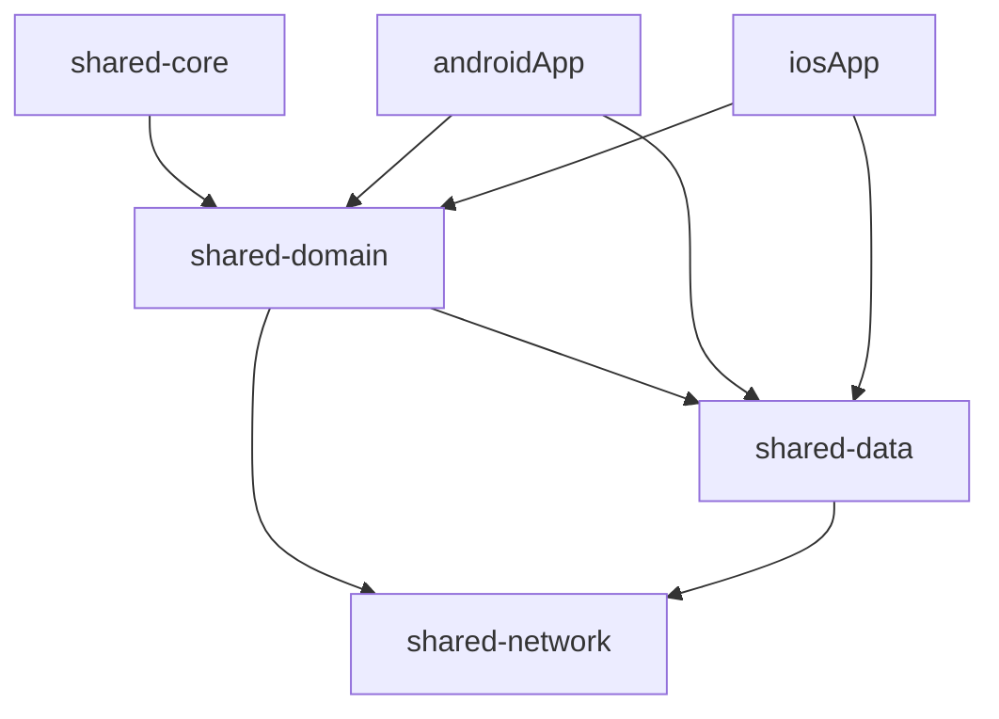
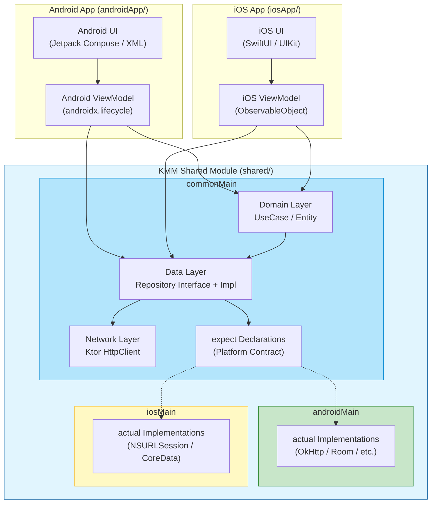
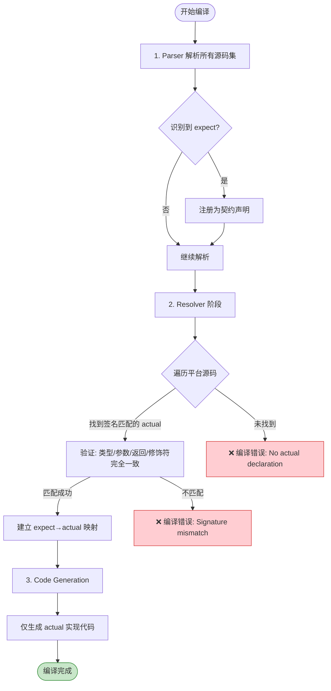

# KMM（Kotlin Multiplatform Mobile）跨平台面试全攻略

> 面向高级/资深 Android 工程师的 KMM 面试深度内容，涵盖 expect/actual 机制、Kotlin/Native 编译链、内存模型演进、模块化架构及渐进式接入策略。全文六层递进，≥2000 字。

---

## 目录

1. [面试问题（≥4）](#1-面试问题)
2. [标准答案（含对比表格）](#2-标准答案)
3. [核心原理](#3-核心原理)
4. [流程图（HTML + Mermaid）](#4-流程图)
5. [源码分析](#5-源码分析)
6. [应用场景](#6-应用场景)

---

## 1. 面试问题（≥4）

| 序号 | 问题 | 考察维度 |
|:---:|------|:---------|
| **Q1** | `expect`/`actual` 机制的原理是什么？编译器在哪个阶段进行解析？如果某个平台的 `actual` 声明缺失会发生什么？ | 语法机制、编译器原理 |
| **Q2** | KMM 与 Flutter / React Native 的定位差异是什么？什么场景下选 KMM 而不是 Flutter？ | 跨平台方案选型 |
| **Q3** | 在 KMM 中，共享业务逻辑的边界如何划定？ViewModel、Repository、UseCase 哪些适合下沉到共享模块？ | 架构设计、职责边界 |
| **Q4** | Kotlin/Native 如何与 iOS 互操作？`cinterop` 的工作原理是什么？生成的 KLib 包含哪些内容？ | Native 互操作、编译产物 |
| **Q5** | 如何设计一个可扩展的 KMM 模块化架构？模块间依赖如何管理？ | 工程化、模块化设计 |
| **Q6（进阶）** | KMM 的内存模型从「旧 freeze 模型」演进到「新 GC 模型」解决了什么问题？并发编程模型有何变化？ | 内存管理、并发原理 |

---

## 2. 标准答案

### Q1：`expect`/`actual` 机制原理

**核心概念：**

- `expect` 声明在 **commonMain** 中，代表"各平台必须提供此实现"的契约。
- `actual` 声明在 **androidMain** / **iosMain** / **jvmMain** 等平台源码集中，提供具体实现。
- 可以声明：类、函数、属性、注解、类型别名（Kotlin 1.9+ 还支持 expect 的 sealed class/interface）。

**编译器解析时机：**

在 **Kotlin 编译器前端（Frontend）** 阶段完成匹配校验。编译器遍历所有 `expect` 声明，在对应的平台源码集中查找匹配的 `actual` 声明——匹配依据是签名完全相同。若某个平台缺少 `actual`，**编译阶段报错**；若多处重复声明，同样报错。

**典型示例：**

```kotlin
// commonMain/kotlin/Platform.kt
expect fun getPlatformName(): String
expect class HttpClient() {
    fun get(url: String): String
}

// androidMain/kotlin/Platform.android.kt
actual fun getPlatformName(): String = "Android ${android.os.Build.VERSION.SDK_INT}"

actual class HttpClient actual constructor() {
    actual fun get(url: String): String {
        // 使用 OkHttp 实现
        return okhttp3.OkHttpClient().newCall(/* ... */).execute().body?.string() ?: ""
    }
}

// iosMain/kotlin/Platform.ios.kt
actual fun getPlatformName(): String = "iOS ${UIDevice.currentDevice.systemVersion}"

actual class HttpClient actual constructor() {
    actual fun get(url: String): String {
        // 使用 NSURLSession 实现
        return ""
    }
}
```

> **关键细节：** `expect`/`actual` 是 **纯编译期机制**，不产生运行时开销。编译产物中只有对应平台的 `actual` 实现，`expect` 声明在最终字节码/机器码中不存在。

---

### Q2：KMM vs Flutter vs React Native — 定位差异

| 维度 | KMM | Flutter | React Native |
|------|-----|---------|-------------|
| **核心哲学** | 共享业务逻辑，UI 保持原生 | 统一 UI 框架 + 自绘引擎 | 跨平台 UI + JS Bridge |
| **UI 方案** | 原生 UI（Jetpack Compose / SwiftUI / UIKit） | Skia 自绘引擎（非原生控件） | 原生控件映射（Bridge） |
| **语言** | Kotlin | Dart | JavaScript / TypeScript |
| **热重载** | ❌ 无（需编译） | ✅ Hot Reload | ✅ Fast Refresh |
| **性能** | ⭐⭐⭐⭐⭐（原生性能） | ⭐⭐⭐⭐（接近原生） | ⭐⭐⭐（Bridge 有开销） |
| **接入成本** | ✅ 渐进式引入，与现有原生项目共存 | ❌ 通常需要重写 | 中等（需要适配） |
| **生态成熟度** | 发展中（JetBrains 主导） | 成熟（Google 主导） | 成熟（Meta 主导） |
| **iOS 互操作** | ✅ Kotlin/Native 直接调用 | 通过 Platform Channel | 通过 Native Modules |
| **适用场景** | 已有原生 App，共享网络/数据/业务逻辑 | 新项目，统一 UI，快速迭代 | 新项目或已有 React Web 团队 |

**选型决策树：**

```
已有 iOS + Android 原生团队？
├── 是 → 选 KMM：
│       共享网络层、数据层、Domain 层
│       UI 层保持原生（各自平台最优体验）
│       渐进式接入，零风险
└── 否 → 选 Flutter / RN：
        从头构建，统一 UI
        团队无原生开发背景
```

---

### Q3：共享业务逻辑边界

**推荐分层策略（Clean Architecture 视角）：**

| 层级 | 是否共享 | 理由 |
|------|:--------:|------|
| **Data Source（DB/Network I/O）** | ✅ 共享 | 网络请求、本地缓存、数据序列化可跨平台 |
| **Repository** | ✅ 共享 | 纯 Kotlin 业务逻辑，无 UI 依赖 |
| **UseCase / Interactor** | ✅ 共享 | 领域逻辑、数据组合、业务规则 |
| **ViewModel (Compose Multiplatform)** | ✅ 可共享 | 若使用 Compose Multiplatform，ViewModel 也可共享 |
| **ViewModel (传统 mvvm)** | ⚠️ 谨慎 | 依赖 `androidx.lifecycle`，iOS 侧需额外封装 |
| **UI（View / Controller）** | ❌ 平台独立 | 各平台 UI 范式不同，保持原生最优 |

**黄金法则：**

> 凡是无 UI 依赖、无平台特定 API 调用的代码，均可下沉到 `commonMain`。有平台依赖则用 `expect`/`actual` 声明契约。

---

### Q4：Kotlin/Native 与 iOS 互操作（cinterop）

**cinterop 工作原理：**

1. **输入**：`.def` 文件（描述 C/Objective-C 库的接口） + `.h` 头文件 + 静态库/动态库
2. **过程**：cinterop 工具解析头文件，利用 LLVM/Clang 解析 ObjC 类型，生成 Kotlin 绑定代码
3. **输出**：`.klib` 文件（Kotlin 库格式），包含类型映射、函数签名、内存管理规则

**生成 KLib 的内部结构：**

```
MyLibrary.klib
├── linkdata/          # 序列化的 IR（中间表示）
│   ├── module         # 模块元信息
│   ├── classes        # 类/接口声明
│   ├── functions      # 函数签名
│   └── types          # 类型映射表
├── targets/           # 平台目标
│   └── ios_arm64/
│       └── native/    # 编译后的 ObjC stub
└── manifest           # 版本、依赖信息
```

**代码示例：**

```kotlin
// iosMain 中直接调用 iOS 原生 API
import platform.Foundation.NSURL
import platform.Foundation.NSURLSession
import platform.Foundation.NSData

actual class HttpClient actual constructor() {
    actual fun get(url: String): String {
        val nsUrl = NSURL(string = url)
        // 直接用 Kotlin 风格调用 ObjC API
        val data = NSURLSession.sharedSession
            .dataTaskWithURL(nsUrl) { data, _, _ ->
                // callback
            }
        // ...
    }
}
```

> **与 Flutter Platform Channel 的差异：** KMM 通过 cinterop **直接调用** ObjC/Swift API，无 Bridge 开销；Flutter 需要通过 MessageCodec 序列化/反序列化走异步通道。

---

### Q5：KMM 模块化架构设计

**推荐模块结构：**

```
MyKMMProject/
├── shared/                          # KMM 共享模块
│   ├── shared-core/                 # 纯通用工具（无平台依赖）
│   ├── shared-domain/               # UseCase + Repository 接口
│   ├── shared-data/                 # Repository 实现 + DTO + Mapper
│   ├── shared-network/              # Ktor 网络层
│   └── shared-di/                   # 依赖注入（Koin / Kotlin-inject）
├── androidApp/                      # Android 宿主
├── iosApp/                          # iOS 宿主
└── shared-ui/                       # (可选) Compose Multiplatform UI
```

**依赖关系：**



关键原则：
- 按层拆分（Clean Architecture），不是按平台拆分
- 每个模块尽可能少依赖，`shared-core` 零平台依赖
- DI 模块统一管理平台实现注入

---

### Q6：KMM 内存模型演进

| 特性 | 旧模型（Freeze 模型） | 新模型（GC 模型，Kotlin 1.7.20+） |
|------|----------------------|----------------------------------|
| **对象跨线程** | 必须 `freeze()` 冻结 | 自由传递，无需冻结 |
| **并发原语** | Worker（类 Actor 模型） | 标准协程 + `Dispatchers.Default` |
| **异常机制** | 冻结后修改抛 `InvalidMutabilityException` | 普通并发异常 |
| **开发者体验** | 需要手动 `freeze()`、`ensureNeverFrozen()` | 自然编写，无需特殊处理 |
| **GC 实现** | 基于引用计数的循环回收算法 | 新一代 Tracing GC（标记-清除） |
| **性能** | freeze 有冻结开销 | GC 暂停可控，性能更好 |

**演进意义：** 新 GC 模型让 Kotlin/Native 的并发编程接近 JVM 体验，开发者不再需要关心"这个对象是否已冻结"，大幅降低心智负担。

---

## 3. 核心原理

### 3.1 Kotlin/Native 编译链：Kotlin → LLVM IR → Native Code

```
┌─────────────────────────────────────────────────────────┐
│  Kotlin Source Code (*.kt)                              │
├─────────────────────────────────────────────────────────┤
│  1. Kotlin Frontend (Parser + Resolver)                 │
│     ↓ 生成 PSI → Descriptors → IR (Kotlin IR)          │
├─────────────────────────────────────────────────────────┤
│  2. Kotlin/Native Backend                               │
│     ↓ IR lowering（降级）→ LLVM IR Generator           │
├─────────────────────────────────────────────────────────┤
│  3. LLVM IR (.ll / .bc 位码)                            │
│     ↓ LLVM Optimizer (O2/O3)                           │
├─────────────────────────────────────────────────────────┤
│  4. LLVM Backend                                       │
│     ↓ 目标平台代码生成                                 │
├─────────────────────────────────────────────────────────┤
│  5. Native Binary                                      │
│     ├── Android: .so (ELF shared object)               │
│     ├── iOS: .dylib / Framework                        │
│     ├── macOS: .dylib                                  │
│     └── Linux: .so                                     │
└─────────────────────────────────────────────────────────┘
```

**关键点：**

- Kotlin/Native 不依赖 JVM，完全绕过字节码阶段。
- 生成的 LLVM IR 与 Clang 编译的 C/C++ 处于同一层级，因此能与 C/ObjC 直接链接。
- `-opt` 编译参数可控制优化级别，与 Clang 的 `-O2`/`-O3` 效果类似。

### 3.2 `expect`/`actual` 的编译器解析流程

```
1. Parser 阶段：
   识别 expect/actual 关键字 → 标记 AST 节点

2. Resolver 阶段（多平台解析）：
   commonMain 中的 expect 声明 → 注册为"平台需实现"契约
   各平台源码集中的 actual 声明 → 与 common 契约进行签名匹配

3. Checker 阶段：
   遍历所有 expect 声明：
   ├── 找到匹配 actual → ✅ 通过
   ├── 未找到         → ❌ 编译错误:
   │   "Expected declaration 'xxx' has no actual declaration
   │    in module <shared> for platform <iOS>"
   └── 重复 actual    → ❌ 编译错误:
       "More than one actual declaration matches expected 'xxx'"

4. Code Generation 阶段：
   只生成 actual 实现的代码
   expect 声明在产物中不存在（零运行时开销）
```

### 3.3 cinterop 生成 KLib 的过程

```
         ┌──────────────┐
         │  .def 文件    │ ← 描述库的 linkage、headers、静态库路径
         └──────┬───────┘
                │
         ┌──────▼───────┐
         │  头文件解析   │ ← libclang 解析 .h，提取类型、函数签名
         └──────┬───────┘
                │
         ┌──────▼───────┐
         │  类型映射     │ ← C/ObjC 类型 → Kotlin 类型
         │               │    NSInteger → Long
         │               │    NSString* → String
         │               │    BOOL      → Boolean
         │               │    Block     → Kotlin Lambda
         └──────┬───────┘
                │
         ┌──────▼───────┐
         │  IR 生成      │ ← 生成 Kotlin IR 节点
         └──────┬───────┘
                │
         ┌──────▼───────┐
         │  KLib 打包    │ ← linkdata + targets + manifest
         └──────────────┘
```

### 3.4 内存模型：旧 Freeze vs 新 GC

**旧模型（Freeze）核心机制：**

```kotlin
// 旧模型必须手动冻结
val data = SomeData()
data.freeze()  // 递归冻结整个对象图
// 之后 data 变为不可变，可在任意线程读取
// 再次修改 data 会抛出 InvalidMutabilityException
```

**新 GC 模型（Kotlin 1.7.20+）：**

- 基于 **Tracing GC**（标记-清除算法，类似于 Go/OpenJDK Shenandoah）
- 对象在堆上自由分配，GC 根可达分析判断存活
- 跨线程传递对象时不做任何特殊处理
- 并发安全由开发者通过协程/锁自行保证

**启用新 GC：**

```kotlin
// gradle.properties
kotlin.native.binary.memoryModel=experimental  // 旧（1.7.20 之前）
// 1.7.20+ 默认启用新 GC，无需配置
```

---

## 4. 流程图

### 4.1 KMM 架构分层图



### 4.2 Kotlin → Native 编译流程

```mermaid
flowchart LR
    subgraph Source["源码"]
        A["*.kt 源文件\n(commonMain + platformMain)"]
    end

    subgraph Frontend["Kotlin Frontend"]
        B["Lexer + Parser\n→ PSI Tree"]
        C["Resolver\n→ Binding Context"]
        D["IR Generator\n→ Kotlin IR (FIR)"]
    end

    subgraph Backend["Kotlin/Native Backend"]
        E["IR Lowering\n(去语法糖、内联)"]
        F["LLVM IR Generator\n(Kotlin IR → LLVM IR)"]
    end

    subgraph LLVM["LLVM 工具链"]
        G["LLVM Optimizer\n(O2/O3 + LTO)"]
        H["LLVM Backend\n(目标机器码生成)"]
    end

    subgraph Output["编译产物"]
        I["Static Library (.a)\n/ Dynamic Library (.dylib/.so)\n/ Framework"]
    end

    A --> B --> C --> D --> E --> F --> G --> H --> I

    style Source fill:#ffccbc
    style Frontend fill:#b3e5fc
    style Backend fill:#c8e6c9
    style LLVM fill:#fff9c4
    style Output fill:#e1bee7
```



### 4.3 expect/actual 解析流程



---

## 5. 源码分析

### 5.1 expect/actual 编译后代码对照

**源码（commonMain）：**

```kotlin
// commonMain/kotlin/com/example/Platform.kt
expect class PlatformContext {
    fun getAppVersion(): String
    fun getDeviceId(): String
}

expect fun createDatabase(context: PlatformContext): AppDatabase
```

**androidMain 的 actual 实现：**

```kotlin
// androidMain/kotlin/com/example/Platform.android.kt
actual class PlatformContext actual constructor(
    val context: android.content.Context
) {
    actual fun getAppVersion(): String {
        return context.packageManager
            .getPackageInfo(context.packageName, 0)
            .versionName ?: "unknown"
    }

    actual fun getDeviceId(): String {
        return android.provider.Settings.Secure.getString(
            context.contentResolver,
            android.provider.Settings.Secure.ANDROID_ID
        )
    }
}
```

**编译后的 Java 字节码等效（反编译视角）：**

```java
// 编译后：expect 声明消失，只有 actual 实现
// shared-android.aar 中：
public final class PlatformContext {
    private final android.content.Context context;

    public PlatformContext(@NotNull android.content.Context context) {
        this.context = context;
    }

    @NotNull
    public final String getAppVersion() {
        // ... 实现代码
    }

    @NotNull
    public final String getDeviceId() {
        // ... 实现代码
    }
}
```

**iOS 侧（Kotlin/Native 编译为 ObjC 头文件）：**

```objc
// shared.h (自动生成的 Framework Header)
__attribute__((objc_subclassing_restricted))
__attribute__((swift_name("PlatformContext")))
@interface SharedPlatformContext : SharedBase
- (instancetype)initWithContext:(id)context __attribute__((swift_name("init(context:)")));
- (NSString *)getAppVersion __attribute__((swift_name("getAppVersion()")));
- (NSString *)getDeviceId __attribute__((swift_name("getDeviceId()")));
@end
```

> **关键发现：** `expect` 声明在编译产物中 **完全不存在**。它只是编译器在中间阶段的"占位符"，用于跨平台源码集的一致性校验。

### 5.2 KMM 共享模块 Gradle 配置（完整示例）

```kotlin
// shared/build.gradle.kts
plugins {
    kotlin("multiplatform")          // KMM 核心插件
    kotlin("plugin.serialization")   // kotlinx.serialization
    id("com.android.library")        // Android Library
    id("org.jetbrains.kotlin.native.cocoapods") // CocoaPods 集成
}

kotlin {
    // ── 目标平台声明 ──
    androidTarget {
        compilations.all {
            kotlinOptions {
                jvmTarget = "17"
            }
        }
    }

    iosX64()
    iosArm64()
    iosSimulatorArm64()

    // 统一 iOS 目标（可选）
    listOf(
        iosX64(),
        iosArm64(),
        iosSimulatorArm64()
    ).forEach { target ->
        target.binaries.framework {
            baseName = "shared"
            isStatic = true  // 静态 Framework（推荐）
        }
    }

    // ── CocoaPods 配置（自动生成 podspec）──
    cocoapods {
        summary = "KMM Shared Module"
        homepage = "https://example.com"
        ios.deploymentTarget = "15.0"
        podfile = project.file("../iosApp/Podfile")
        framework {
            baseName = "shared"
            isStatic = true
        }
    }

    // ── 源码集配置 ──
    sourceSets {
        val commonMain by getting {
            dependencies {
                // 网络
                implementation("io.ktor:ktor-client-core:$ktorVersion")
                implementation("io.ktor:ktor-client-content-negotiation:$ktorVersion")
                implementation("io.ktor:ktor-serialization-kotlinx-json:$ktorVersion")

                // 序列化
                implementation("org.jetbrains.kotlinx:kotlinx-serialization-json:1.6.0")

                // 协程
                implementation("org.jetbrains.kotlinx:kotlinx-coroutines-core:1.7.3")

                // 依赖注入
                implementation("io.insert-koin:koin-core:3.5.3")

                // 日期时间
                implementation("org.jetbrains.kotlinx:kotlinx-datetime:0.4.1")
            }
        }

        val commonTest by getting {
            dependencies {
                implementation(kotlin("test"))
            }
        }

        val androidMain by getting {
            dependencies {
                implementation("io.ktor:ktor-client-okhttp:$ktorVersion")
                implementation("androidx.room:room-runtime:2.6.0")
            }
        }

        val iosX64Main by getting
        val iosArm64Main by getting
        val iosSimulatorArm64Main by getting
        val iosMain by creating {
            dependsOn(commonMain)
            iosX64Main.dependsOn(this)
            iosArm64Main.dependsOn(this)
            iosSimulatorArm64Main.dependsOn(this)
            dependencies {
                implementation("io.ktor:ktor-client-darwin:$ktorVersion")
            }
        }
    }
}

// ── Android 配置 ──
android {
    namespace = "com.example.shared"
    compileSdk = 34

    defaultConfig {
        minSdk = 24
    }

    compileOptions {
        sourceCompatibility = JavaVersion.VERSION_17
        targetCompatibility = JavaVersion.VERSION_17
    }
}
```

**关键配置说明：**

| 配置项 | 作用 |
|--------|------|
| `androidTarget()` | 声明 Android 目标，生成 `.aar` |
| `iosArm64()` / `iosX64()` | iOS 真机/模拟器目标 |
| `cocoapods {}` | 自动生成 podspec，无需手动编写 |
| `sourceSets.iosMain` | 自定义中间源码集，聚合多个 iOS target |
| `isStatic = true` | 静态 Framework（避免动态库签名问题） |
| `ktor-client-okhttp` | Android 侧使用 OkHttp 引擎 |
| `ktor-client-darwin` | iOS 侧使用 Darwin（基于 NSURLSession） |

---

## 6. 应用场景

### 场景一：已有原生项目渐进式接入 KMM

**背景：** 假设你有一个成熟的 Android（Kotlin + Jetpack Compose）和 iOS（Swift + SwiftUI）项目，希望共享网络层和数据层。

**接入步骤（分阶段、零风险）：**

```
阶段 1：基础设施建设（1-2周）
├── 创建 KMM shared 模块
├── 搭建 Gradle 多模块工程
├── 配置 CI/CD（Android + iOS 并行构建）
└── 编写 smoke test 验证双向集成

阶段 2：网络层迁移（2-3周）
├── 将 Android 的 Retrofit/OkHttp 调用 → Ktor (commonMain)
│   用 expect/actual 封装平台引擎
├── 将 iOS 的 URLSession 调用 → commonMain 统一接口
├── 共享 DTO + JSON 序列化（kotlinx.serialization）
└── 运行现有集成测试，确保行为一致

阶段 3：数据层下沉（3-4周）
├── Repository 从各平台抽离到 shared-data
├── 本地缓存/数据库 → SQLDelight（KMM 原生支持）
├── 业务模型 → commonMain
└── 逐模块替换，每替换一个跑一次回归测试

阶段 4：业务逻辑共享（持续）
├── UseCase 下沉到 shared-domain
├── 平台特定逻辑通过 expect/actual 注入
└── 新功能优先在 shared 模块开发

阶段 5（可选）：UI 共享
└── 引入 Compose Multiplatform，共享部分 UI 组件
```

**DI 注入示例（Koin for KMM）：**

```kotlin
// shared-di/src/commonMain/kotlin/di/SharedModule.kt
val sharedModule = module {
    single<HttpClient> { createHttpClient() }  // expect/actual 创建的客户端
    single<ApiService> { ApiServiceImpl(get()) }
    single<UserRepository> { UserRepositoryImpl(get()) }
    single<GetUserUseCase> { GetUserUseCase(get()) }
}

// androidApp/.../MyApplication.kt
class MyApplication : Application() {
    override fun onCreate() {
        super.onCreate()
        startKoin {
            androidContext(this@MyApplication)
            modules(sharedModule, androidModule)  // KMM + Android 特定模块
        }
    }
}
```

### 场景二：网络层 + 数据层共享的 KMM 设计

**设计目标：** 共享 100% 的网络请求代码 + 数据持久化代码，iOS 和 Android 仅维护 UI 层。

**架构图：**

```
┌──────────────────────────────────────────────────┐
│                  Presentation Layer               │
│  ┌─────────────────────┐ ┌─────────────────────┐ │
│  │  Android UI (原生)   │ │  iOS UI (原生)       │ │
│  │  Jetpack Compose     │ │  SwiftUI / UIKit     │ │
│  └──────────┬──────────┘ └──────────┬──────────┘ │
│             │                       │             │
│  ┌──────────▼───────────────────────▼──────────┐ │
│  │          ViewModel / Presenter              │ │
│  │      (平台独立，但调用 shared UseCase)        │ │
│  │  Android: androidx ViewModel               │ │
│  │  iOS: ObservableObject / @Observable        │ │
│  └──────────────────────┬─────────────────────┘ │
└─────────────────────────┼───────────────────────┘
                          │
┌─────────────────────────▼───────────────────────┐
│              Shared Module (KMM)                │
│  ┌─────────────────────────────────────────────┐│
│  │  Domain Layer (commonMain)                  ││
│  │  ├── UseCase: GetUserProfileUseCase         ││
│  │  ├── Entity: User, Post, Comment            ││
│  │  └── Repository Interface: IUserRepository  ││
│  └─────────────────────────────────────────────┘│
│  ┌─────────────────────────────────────────────┐│
│  │  Data Layer (commonMain)                    ││
│  │  ├── Repository Impl: UserRepositoryImpl    ││
│  │  ├── DTO + Mapper: UserDto → User           ││
│  │  └── DataSource: Remote / Local             ││
│  └─────────────────────────────────────────────┘│
│  ┌─────────────────────────────────────────────┐│
│  │  Network Layer (commonMain)                 ││
│  │  ├── HttpClient (Ktor)                      ││
│  │  ├── ApiService (REST 接口定义)             ││
│  │  └── AuthInterceptor (Token 管理)           ││
│  └─────────────────────────────────────────────┘│
│  ┌─────────────────────────────────────────────┐│
│  │  Platform Bridge (expect/actual)            ││
│  │  expect fun createHttpEngine(): HttpClientEngine ││
│  │  expect fun createDatabaseDriver(): SqlDriver   ││
│  └─────────────────────────────────────────────┘│
└─────────────────────────────────────────────────┘
```

**核心网络层实现（commonMain）：**

```kotlin
// shared-network/src/commonMain/kotlin/ApiClient.kt
object ApiClient {
    // expect 声明：由各平台提供 HTTP 引擎
    expect fun createEngine(): HttpClientEngine

    val httpClient: HttpClient by lazy {
        HttpClient(createEngine()) {
            install(ContentNegotiation) {
                json(Json {
                    ignoreUnknownKeys = true
                    isLenient = true
                })
            }
            install(HttpTimeout) {
                requestTimeoutMillis = 30_000
                connectTimeoutMillis = 15_000
            }
            defaultRequest {
                url("https://api.example.com/")
                contentType(ContentType.Application.Json)
            }
        }
    }
}

// shared-network/src/commonMain/kotlin/ApiService.kt
class ApiService(private val client: HttpClient) {
    suspend fun getUsers(): List<UserDto> =
        client.get("users").body()

    suspend fun getUser(id: String): UserDto =
        client.get("users/$id").body()

    suspend fun createUser(request: CreateUserRequest): UserDto =
        client.post("users") {
            setBody(request)
        }.body()
}
```

**优势总结：**

| 维度 | 传统原生双端开发 | KMM 共享方案 |
|------|:---------------:|:-----------:|
| 网络层代码 | 2份（OkHttp + URLSession） | 1份（Ktor commonMain） |
| 数据模型 | 2份（Kotlin + Swift） | 1份（kotlinx.serialization） |
| 业务逻辑测试 | 2份 | 1份（commonTest） |
| 需求变更工作量 | 200% | ~110%（仅 UI 需双端修改） |
| Bug 修复 | 需同步修改两处 | 修改一处，两端受益 |
| 团队技能要求 | Kotlin + Swift | Kotlin 为主，Swift 仅 UI |

---

## 总结

KMM 作为 **"共享逻辑而非 UI"** 的跨平台方案，在当前移动开发中的定位愈发清晰：

1. **expect/actual** 是平台抽象的优雅契约，编译期零开销
2. **Kotlin/Native** 通过 LLVM 生成原生机器码，性能无损失
3. **新 GC 内存模型** 让并发编程回归自然
4. **渐进式接入** 是 KMM 最大竞争力——对现有项目零风险
5. **模块化分层** 让共享代码的可维护性达到新高度

对于面试而言，掌握上述六个维度的内容，足以应对资深工程师级别的 KMM 考察。

---

> 本文适用于：高级/资深 Android 工程师面试准备 | KMM 项目架构设计参考 | 跨平台技术选型决策
