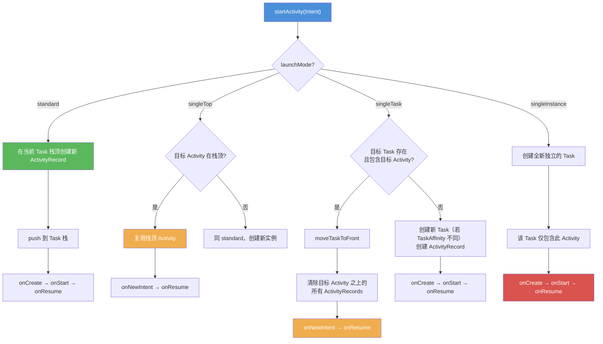
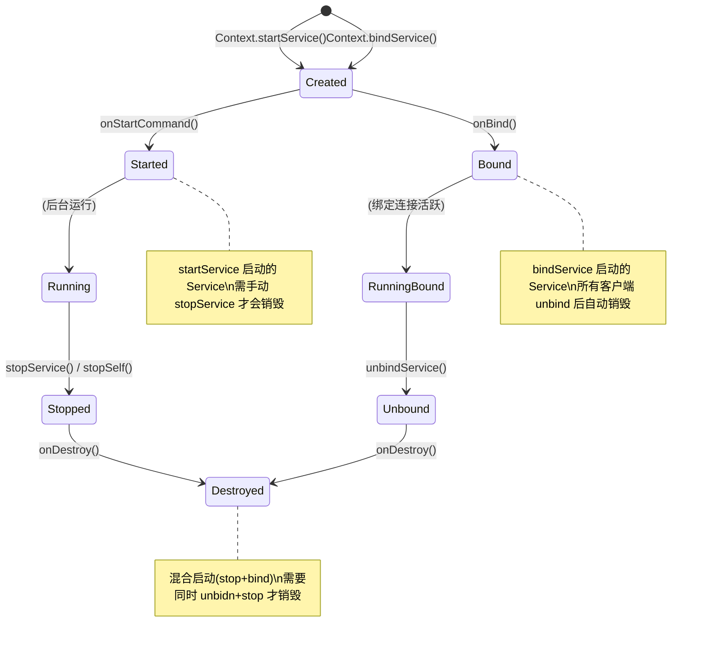
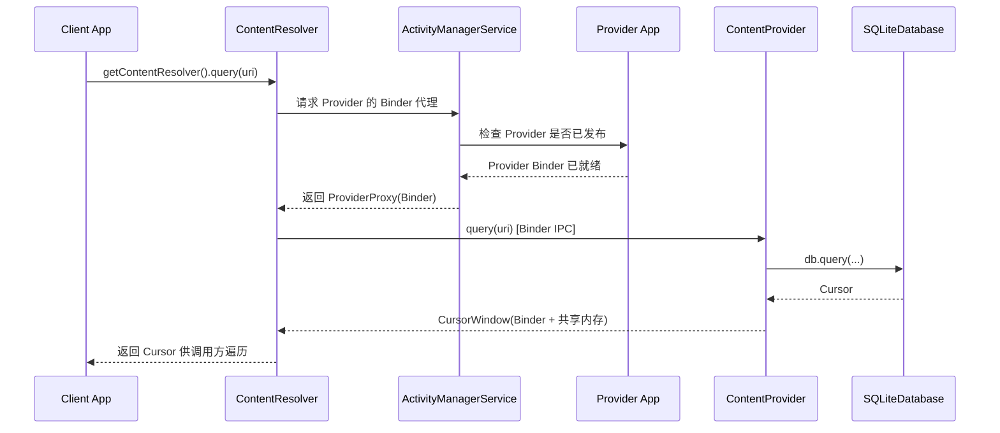

# 四大组件 —— 面试学习完整指南

> **六层递进体系**：面试问题 → 标准答案 → 核心原理 → 流程图 → 源码分析 → 实战场景
> 适用岗位：高级/资深 Android 工程师、Framework 开发工程师

---

## 目录

1. [常见面试问题（6+题）](#1-常见面试问题)
2. [标准答案与要点解析](#2-标准答案与要点解析)
3. [核心原理深度讲解](#3-核心原理深度讲解)
4. [原理流程图（Mermaid.js）](#4-原理流程图)
5. [核心源码分析](#5-核心源码分析)
6. [应用场景举例](#6-应用场景举例)

---

## 1. 常见面试问题

### Q1: Activity 四种启动模式（standard / singleTop / singleTask / singleInstance）的区别？分别适用于什么场景？
### Q2: TaskAffinity 是什么？如何配合 singleTask 使用？多任务栈的应用场景？
### Q3: Service 的三种启动方式（startService / bindService / foreground）的区别？各自的生命周期？
### Q4: BroadcastReceiver 静态注册 vs 动态注册有什么区别？Android 8.0+ 有哪些限制？如何绕过？
### Q5: ContentProvider 的 CRUD 底层原理？如何实现跨进程数据共享？为什么要用 ContentProvider 而不是直接操作数据库？
### Q6（进阶）: Intent 的显式调用与隐式调用的区别？隐式匹配的完整规则（action / category / data）？

---

## 2. 标准答案与要点解析

### Q1: Activity 四种启动模式

| 启动模式 | 行为特征 | Task 栈表现 | 典型场景 |
|---------|---------|------------|---------|
| **standard** | 每次创建新实例 | 默认入当前栈，可存在多个实例 | 一般页面（如商品详情，A→A→A 都在同一栈） |
| **singleTop** | 栈顶复用，非栈顶新建 | 若目标 Activity 已在栈顶则回调 `onNewIntent()`，否则新建 | 推送通知点击、搜索页 |
| **singleTask** | 栈内唯一，复用已有 | 检查目标 Task（由 TaskAffinity 决定）；若 Activity 已存在则清除其上所有 Activity 并回调 `onNewIntent()` | 主页（MainActivity）、WebView 容器 |
| **singleInstance** | 全局唯一，独占新栈 | 单独占据一个 Task 栈，不允许其他 Activity 进入该栈 | 系统级页面（如闹钟响铃界面）、来电界面 |

**面试加分点**：
- `singleTask` 的 `clearTop` 效果（`Intent.FLAG_ACTIVITY_CLEAR_TOP` 语义等效）：当目标 Activity 已存在时，它上面的所有 Activity 会被销毁（`onDestroy`）
- `singleInstance` 场景非常罕见，滥用会导致 back 键行为异常——用户按 back 时在不同 Task 栈之间切换，体验很糟糕
- `singleTask` + `taskAffinity` 配合可以实现**多任务栈管理**（如微信小程序打开独立任务卡）
- API 30+ 引入 `ActivityOptions.setPendingIntentBackgroundActivityStartMode` 来控制后台启动行为

---

### Q2: TaskAffinity 与多任务栈

**TaskAffinity 定义**：每个 Activity 的 `taskAffinity` 属性指定它**偏好**的 Task 栈名称。默认值为应用的包名。

**核心机制**：
```
TaskAffinity 只在以下情况生效：
1. 启动的 Activity 设置了 FLAG_ACTIVITY_NEW_TASK
2. 或者启动模式为 singleTask / singleInstance
```

**多任务栈实战**：

```xml
<!-- AndroidManifest.xml -->
<activity
    android:name=".MainActivity"
    android:launchMode="singleTask"
    android:taskAffinity="" />  <!-- 默认包名栈 -->

<activity
    android:name=".WebViewActivity"
    android:launchMode="singleTask"
    android:taskAffinity="com.example.webview" />  <!-- 独立 WebView 栈 -->

<activity
    android:name=".PaymentActivity"
    android:launchMode="singleTask"
    android:taskAffinity="com.example.payment" />  <!-- 独立支付栈 -->
```

**实际效果**：用户在最近任务列表中会看到**3 张独立的任务卡片**，可以分别切换。微信小程序就利用了这一机制——每个小程序运行在独立 Task 中。

**注意事项**：
- 不同 TaskAffinity 的 Activity 之间跳转，需要 `Intent.FLAG_ACTIVITY_NEW_TASK`
- 过多独立 Task 会消耗内存，且用户体验可能混乱
- `ActivityManager.getRunningTasks()` 在 Android 5.0+ 已废弃，应用无法获取其他应用的 Task 信息

---

### Q3: Service 的三种启动方式

| 启动方式 | API | 生命周期 | 通信方式 | 适用场景 |
|---------|-----|---------|---------|---------|
| **startService** | `startService(intent)` | `onCreate → onStartCommand → (运行中) → onDestroy` | 单向，组件无法与 Service 通信 | 后台下载、日志上传 |
| **bindService** | `bindService(intent, conn, flags)` | `onCreate → onBind → (运行中) → onUnbind → onDestroy` | 双向，通过 IBinder 接口通信 | 音乐播放控制、数据同步 |
| **foreground** | `startForeground(id, notification)` | 与 startService 相同 + 持续通知 | 单向/双向均可 | 音乐播放、运动追踪、导航 |

**混合启动（start + bind）**：
```
startService() → onStartCommand()
bindService()  → onBind()
// 此时 Service 同时被启动和绑定
unbindService() → onUnbind()
stopService()   → onDestroy()  // 必须 unbind + stop 都执行才会销毁
```

**ANR 时间窗口**：
- **前台 Service**：ANR 时限约 **20 秒**（`SERVICE_TIMEOUT = 20s`）
- **后台 Service**：ANR 时限约 **200 秒**（`SERVICE_BACKGROUND_TIMEOUT = 200s`）
- Android 8.0+ 对后台 Service 有严格限制：应用进入后台后几分钟内会被 `stopService`，**必须迁移到 JobScheduler / WorkManager 或前台 Service**

**Android 8.0+ 后台限制**：
- `startService()` 在后台会抛出 `IllegalStateException`
- 替代方案：`JobIntentService`、`WorkManager`、前台 Service

---

### Q4: BroadcastReceiver 注册方式与 Android 8.0+ 限制

| 特性 | 静态注册（Manifest） | 动态注册（代码） |
|------|-------------------|----------------|
| **注册时机** | 应用安装时由 PMS 解析 | 运行时调用 `registerReceiver()` |
| **生命周期** | 随应用安装一直存在 | 跟随注册组件（如 Activity）的生命周期 |
| **广播接收** | 即使应用未启动也能接收（系统发送广播时拉起进程） | 仅在注册期间接收，组件销毁时必须 `unregisterReceiver()` |
| **内存占用** | 持久占用（每个静态注册广播都需维护记录） | 临时占用 |
| **Android 8.0+ 隐式广播限制** | 大部分系统隐式广播不再发送给静态注册的 Receiver | 无限制（但需应用存活） |

**Android 8.0+ 限制详解**：

Android O 开始，除**白名单广播**外，系统不再向静态注册的 Receiver 发送隐式广播（即不是专门针对你应用的广播）。

**白名单广播（仍可使用静态注册）**：
```
ACTION_BOOT_COMPLETED          // 开机完成
ACTION_LOCALE_CHANGED          // 语言切换
ACTION_TIMEZONE_CHANGED        // 时区切换
ACTION_POWER_CONNECTED         // 电源连接
ACTION_POWER_DISCONNECTED      // 电源断开
ACTION_MEDIA_MOUNTED           // 媒体挂载
...（完整列表见 Android 官方文档）
```

**绕过方案**：
1. 使用 `JobScheduler` / `WorkManager` 替代隐式广播监听
2. 发送**显式广播**（指定包名 + ComponentName），静态注册仍然有效
3. 使用前台 Service 维持进程，配合动态注册

---

### Q5: ContentProvider 的 CRUD 原理与跨进程数据共享

**ContentProvider 架构**：

```
Client App                          Provider App
   │                                    │
   │  getContentResolver().query()      │
   │           │                        │
   ▼           │                        │
ContentResolver ─── Binder IPC ───► ContentProvider
   │           │                        │
   │    (AMS 获取 Provider Binder)       │
   │           │                        │
   │    ◄─── Cursor(Binder) ────        │
   ▼                                    ▼
CursorWindow                      SQLiteDatabase
(共享内存)                         (实际数据源)
```

**CRUD 对应方法**：
```
insert(Uri, ContentValues)      → 返回新插入行的 Uri
query(Uri, projection, selection, selectionArgs, sortOrder) → 返回 Cursor
update(Uri, ContentValues, selection, selectionArgs) → 返回影响行数
delete(Uri, selection, selectionArgs) → 返回影响行数
```

**为什么要用 ContentProvider 而不是直接操作数据库？**
1. **跨进程安全共享**：通过 Binder 机制和 URI 权限控制（`android:grantUriPermissions`），可以精确控制外部应用的数据访问范围
2. **统一的数据抽象**：不暴露底层存储实现（可以是 SQLite/文件/网络），调用方只看到 URI
3. **数据变更通知**：`ContentResolver.notifyChange(uri, observer)` 配合 `ContentObserver` 实现数据变更的实时监听
4. **系统集成**：Contacts、Calendar、MediaStore 等系统数据都通过 ContentProvider 暴露

**CursorWindow 的 2MB 限制**：
`CursorWindow` 是 Binder 驱动为跨进程数据传输分配的共享内存缓冲区，默认大小为 **2MB**。如果查询结果超过 2MB，会抛出 `CursorWindowAllocationException`。解决方案：分页查询、减少返回列。

---

### Q6: Intent 显式 vs 隐式调用与匹配规则

**显式 Intent**：
```java
Intent intent = new Intent(this, TargetActivity.class);
intent.setComponent(new ComponentName("com.example", "com.example.TargetActivity"));
startActivity(intent);
```
- 直接指定目标组件的包名和类名
- 高效、精确，不需要系统匹配
- 用于应用内部跳转

**隐式 Intent**：
```java
Intent intent = new Intent(Intent.ACTION_VIEW);
intent.setData(Uri.parse("https://www.example.com"));
startActivity(intent);
```
- 只描述要执行的动作，由系统匹配能处理该动作的组件
- 用于跨应用调用、Deep Link

**隐式匹配三要素（必须全部匹配才能通过）**：

| 要素 | 说明 | 匹配规则 |
|------|------|---------|
| **Action** | 动作类型（如 `ACTION_VIEW`） | Intent 中的 action 必须在 IntentFilter 的 actions 列表中 |
| **Category** | 附加信息（如 `CATEGORY_DEFAULT`） | Intent 中的**每一个** category 都必须存在于 IntentFilter 中（`CATEGORY_DEFAULT` 由 `startActivity()` 自动添加） |
| **Data** | URI 数据类型（scheme/host/type） | IntentFilter 中的 data 规则必须覆盖 Intent 中的 data |

**常见匹配失败原因**：
1. 忘记添加 `CATEGORY_DEFAULT` —— 隐式启动必须声明此 category
2. `intent.setDataAndType()` vs `intent.setData()` + `intent.setType()` 互斥
3. URI scheme 大小写敏感
4. Android 11+ 包可见性限制（需要在 Manifest 中声明 `<queries>`）

---

## 3. 核心原理深度讲解

### 3.1 AMS 管理的 Task 栈模型

AMS（ActivityManagerService）是 Android 系统中管理四大组件的核心服务，运行在 `system_server` 进程中。对于 Activity，AMS 维护了一套**Task 栈模型**：

```
ActivityStackSupervisor (管理所有 Stack)
    │
    ├── ActivityStack #1 (Home Stack — Launcher)
    │       ├── TaskRecord #1 (Launcher Task)
    │       │     ├── ActivityRecord (LauncherActivity)
    │       │
    ├── ActivityStack #2 (应用 Stack — 默认)
    │       ├── TaskRecord #2 (com.example.app)
    │       │     ├── ActivityRecord (MainActivity)
    │       │     ├── ActivityRecord (DetailActivity)
    │       │     └── ActivityRecord (ProfileActivity)
    │       │
    │       ├── TaskRecord #3 (com.example.app:webview — 不同 TaskAffinity)
    │       │     └── ActivityRecord (WebViewActivity)  ← singleInstance/singleTask
```

**关键数据结构（Android 11+ 架构）**：

| 层级 | 类名 | 职责 |
|------|------|------|
| **Root** | `RootWindowContainer` | 管理所有 Window 和 Display |
| **Display** | `DisplayContent` | 代表一个屏幕（主屏/副屏） |
| **Stack** | `ActivityStack` → `Task`（Android 10+ 简化） | 管理一组 Task（如 HOME Stack / 应用 Stack） |
| **Task** | `Task`（原 `TaskRecord`） | 代表一个 Task 栈，包含多个 Activity |
| **Activity** | `ActivityRecord` | 代表一个 Activity 实例 |

**Task 栈的核心行为规则**：

1. **standard**：`ActivityRecord` 直接 push 到当前 Task 顶部
2. **singleTop**：检查当前 Task 顶部是否为同类型 ActivityRecord，是则回调 `onNewIntent()`
3. **singleTask**：遍历目标 Task（由 taskAffinity 决定），查找是否存在同类型 ActivityRecord；如果存在则 `moveTaskToFront` + 清除其上的 ActivityRecords + `onNewIntent()`；如果不存在则新建
4. **singleInstance**：创建新的 Task，且该 Task 永远只包含这一个 ActivityRecord

### 3.2 Service 的 ANR 机制

Service 中的耗时操作会触发 ANR（Application Not Responding），核心代码在 `ActiveServices` 类中：

```
// frameworks/base/services/core/java/com/android/server/am/ActiveServices.java

static final int SERVICE_TIMEOUT = 20 * 1000;            // 前台 Service 20s
static final int SERVICE_BACKGROUND_TIMEOUT = 200 * 1000; // 后台 Service 200s
```

**ANR 触发流程**：

```
1. AMS 调用 scheduleServiceTimeoutLocked(proc)
2. 向主线程 MessageQueue 发送一条定时消息 (delay = 20s/200s)
3. Service 的 onCreate/onStartCommand/onBind 执行
4a. 如果在超时前 Service 完成 → 移除超时消息 → 正常
4b. 如果超时 → 超时消息被处理 → AMS 判定 ANR
    → 采集 traces → 弹出 ANR 对话框
```

**关键点**：`onStartCommand()` 如果在 20 秒内没有返回（`return START_STICKY` 等），就会触发 ANR。因此**耗时操作必须放到子线程**，主线程只做分发。

### 3.3 广播分发队列机制

BroadcastQueue 是 AMS 中管理广播分发优先级和顺序的核心结构：

```
AMS
 │
 ├── BroadcastQueue #1 (前台广播 — 高优先级，超时 10s)
 │
 └── BroadcastQueue #2 (后台广播 — 低优先级，超时 60s)
```

**分发流程**：

```
1. sendBroadcast(intent)
2. AMS 根据 IntentFilter 匹配所有 Receiver
3. 将匹配的 Receiver 放入对应的 BroadcastQueue
4. 按顺序（串行）向每个 Receiver 进程发送广播
5. 每个 Receiver 处理完毕后回调 AMS（scheduleRegisteredReceiver）
6. 继续下一个 Receiver
```

**ANR 超时**：如果某个 Receiver 的 `onReceive()` 在主线程执行超过 **10s（前台）/ 60s（后台）**，且该广播是串行广播（Ordered Broadcast），则触发 ANR。

**并行广播（普通广播）**：所有 Receiver 同时接收，没有超时限制，但 `onReceive()` 仍应在短时间内完成。

---

## 4. 原理流程图

### 4.1 Activity 启动模式与 Task 栈行为图



### 4.2 Service 生命周期状态机



### 4.3 ContentProvider 跨进程数据共享流程



---

## 5. 核心源码分析

### 5.1 ActivityManagerService.startActivity() 核心流程

```java
// 文件: frameworks/base/services/core/java/com/android/server/am/ActivityManagerService.java
// 行号: 约 4200-4300（Android 11 基准）

// === 步骤 1: 外部入口（Binder 调用入口）===
@Override
public final int startActivity(IApplicationThread caller, String callingPackage,
        Intent intent, String resolvedType, IBinder resultTo, String resultWho,
        int requestCode, int startFlags, ProfilerInfo profilerInfo, Bundle bOptions) {
    return startActivityAsUser(caller, callingPackage, intent, resolvedType, resultTo,
            resultWho, requestCode, startFlags, profilerInfo, bOptions,
            UserHandle.getCallingUserId());  // 行 4250: 获取调用者 UserId
}

// === 步骤 2: startActivityAsUser → startActivityMayWait ===
public final int startActivityAsUser(...) {
    // ... 权限检查
    return mActivityStartController.obtainStarter(intent, "startActivityAsUser")
            .setCaller(caller)
            .setCallingPackage(callingPackage)
            .setResolvedType(resolvedType)
            .setResultTo(resultTo)
            // ... 链式配置参数
            .execute();  // 行 4320: 触发实际启动流程
}

// === 步骤 3: ActivityStarter.execute() 核心启动逻辑 ===
// 文件: frameworks/base/services/core/java/com/android/server/am/ActivityStarter.java
int execute() {
    try {
        // 步骤 3a: 解析 Intent（如果还没解析）
        if (mRequest.component == null) {
            mRequest.resolveActivity(mSupervisor);  // 行 650: 隐式解析
        }
        // 步骤 3b: 执行启动
        int res;
        synchronized (mService.mGlobalLock) {
            // 检查组件的启动模式
            ActivityRecord sourceRecord = ...;
            ActivityRecord targetRecord = ...;
            
            // 步骤 3c: 根据 launchMode 计算目标 Task
            final ActivityStack targetStack = mSupervisor.getStack(
                mStartActivity, mLaunchFlags, mLaunchMode, ...);  // 行 910
            
            // 步骤 3d: 关键 — launchMode 决策逻辑
            if (mLaunchMode == LAUNCH_SINGLE_INSTANCE) {
                // 创建独立 Task 栈
                targetStack = new ActivityStack(...);  // 行 940
            } else if (mLaunchMode == LAUNCH_SINGLE_TASK) {
                // 查找或创建对应 TaskAffinity 的 Task
                Task targetTask = targetStack.findTask(mStartActivity);
                if (targetTask != null) {
                    // 复用已有 Activity，清除上面的 Activity
                    targetTask.performClearTop(mStartActivity);  // 行 960
                }
            } else if (mLaunchMode == LAUNCH_SINGLE_TOP) {
                // 栈顶复用判断
                if (targetStack.topRunningActivity() == mStartActivity) {
                    mStartActivity.deliverNewIntentLocked(...);  // 行 980
                }
            }
            
            // 步骤 3e: 调度 Activity 启动（通知应用进程）
            mTargetStack.startActivityLocked(mStartActivity, ...);  // 行 1020
        }
    } finally {
        // ...
    }
    return mResultCode;
}

// === 步骤 4: 通知应用进程 — ApplicationThread.scheduleLaunchActivity ===
// 文件: frameworks/base/core/java/android/app/ActivityThread.java (ApplicationThread 内部类)
@Override
public final void scheduleLaunchActivity(Intent intent, IBinder token, int ident,
        ActivityInfo info, Configuration curConfig, ...) {
    // 封装为 ActivityClientRecord
    ActivityClientRecord r = new ActivityClientRecord();
    r.token = token;
    r.intent = intent;
    // ...
    sendMessage(H.LAUNCH_ACTIVITY, r);  // 行 2640: 发送到主线程 MessageQueue
}

// === 步骤 5: 主线程处理 — handleLaunchActivity ===
private void handleLaunchActivity(ActivityClientRecord r, ...) {
    // 5a: 创建 Activity 实例
    Activity a = performLaunchActivity(r, customIntent);  // 行 2900
    
    if (a != null) {
        // 5b: 触发 onCreate → onStart
        r.createdConfig = new Configuration(mConfiguration);
        Bundle oldState = r.state;
        
        // 5c: 进入 Resume 状态
        handleResumeActivity(r.token, false, r.isForward, ...);  // 行 2920
        // → performResumeActivity → onResume()
    }
}
```

**源码关键点总结**：

| 步骤 | 位置 | 关键操作 |
|------|------|---------|
| `startActivity()` | AMS.java:4250 | Binder 入口，获取调用者 UserId |
| `execute()` | ActivityStarter.java:650 | 解析 Intent + 根据 launchMode 计算 Task |
| `findTask()` | ActivityStarter.java:940 | singleTask 的 Task 查找逻辑 |
| `performClearTop()` | Task.java | 清除栈顶 Activity |
| `scheduleLaunchActivity()` | ApplicationThread.java:2640 | Binder 回调通知应用进程 |
| `handleLaunchActivity()` | ActivityThread.java:2900 | 主线程创建 Activity 并触发生命周期 |

### 5.2 Service 的 ANR 超时设置源码

```java
// 文件: frameworks/base/services/core/java/com/android/server/am/ActiveServices.java

// === 超时常量定义（行 180-190）===
// How long we wait for a service to finish executing.
static final int SERVICE_TIMEOUT = 20 * 1000;             // 前台: 20秒
// How long we wait for a service to finish executing (background).
static final int SERVICE_BACKGROUND_TIMEOUT = 200 * 1000;  // 后台: 200秒

// === 超时消息发送（行 1200）===
void scheduleServiceTimeoutLocked(ProcessRecord proc) {
    if (proc.executingServices.size() == 0 || proc.thread == null) {
        return;
    }
    Message msg = mAm.mHandler.obtainMessage(
            ActivityManagerService.SERVICE_TIMEOUT_MSG);
    msg.obj = proc;
    // 发送延迟消息，超时后触发 SERVICE_TIMEOUT_MSG 处理
    mAm.mHandler.sendMessageDelayed(msg,
            proc.execServicesFg ? SERVICE_TIMEOUT : SERVICE_BACKGROUND_TIMEOUT);
}

// === 超时处理（行 1250）===
void serviceTimeout(ProcessRecord proc) {
    // 收集 ANR trace 信息
    // 如果是前台 Service 则弹出 ANR 对话框
    if (proc.execServicesFg) {
        // 前台 Service 超时 → 强制 ANR
        mAm.mAppErrors.appNotResponding(proc, null, null, false, 
                "executing service " + proc.execServices.get(0).shortClassName);
    }
}
```

---

## 6. 应用场景举例

### 场景 6.1：微信小程序的多任务栈设计

**需求**：用户打开微信小程序时，在最近任务列表中显示为独立的任务卡片。

**实现方案**：
```xml
<!-- 小程序容器 Activity -->
<activity
    android:name=".MiniProgramActivity"
    android:launchMode="singleTask"
    android:taskAffinity="com.tencent.mm.miniprogram.${appId}"
    android:alwaysRetainTaskState="true"
    android:autoRemoveFromRecents="false" />
```

- 每个小程序使用不同的 `taskAffinity`（基于 appId 动态生成）
- 用户在最近任务列表中可以独立切换和关闭
- 按 Back 键时，`onBackPressed()` 先回退小程序内页面栈，栈空时 `finishAndRemoveTask()` 销毁整个 Task

### 场景 6.2：音乐播放器的前台 Service

```java
public class MusicService extends Service {
    @Override
    public int onStartCommand(Intent intent, int flags, int startId) {
        // 构建通知（必须包含 channelId，Android O+ 强制）
        Notification notification = new NotificationCompat.Builder(this, CHANNEL_ID)
                .setContentTitle("正在播放")
                .setContentText("歌曲名 - 歌手")
                .setSmallIcon(R.drawable.ic_music)
                .addAction(R.drawable.ic_pause, "暂停", pausePendingIntent)
                .addAction(R.drawable.ic_next, "下一首", nextPendingIntent)
                .setStyle(new MediaStyle()  // 使用 MediaStyle 支持锁屏控制
                        .setMediaSession(mediaSession.getSessionToken()))
                .build();
        
        // 启动前台 Service
        startForeground(NOTIFICATION_ID, notification);
        
        // 实际音乐播放在子线程
        musicPlayer.play();
        return START_STICKY;  // 被杀后自动重启
    }
}
```

**关键点**：
- Android 8.0+ 必须创建 `NotificationChannel`
- `MediaStyle` 提供锁屏和通知栏的完整媒体控制
- `START_STICKY` 保证 Service 被系统杀死后自动重新创建（但 Intent 为 null）

### 场景 6.3：ContentProvider 实现全局配置共享

```java
// 定义：各模块通过 ContentProvider 读取全局配置
public class ConfigProvider extends ContentProvider {
    private static final UriMatcher sUriMatcher = new UriMatcher(UriMatcher.NO_MATCH);
    
    static {
        sUriMatcher.addURI("com.example.config", "config/#", CODE_CONFIG);
        sUriMatcher.addURI("com.example.config", "config", CODE_CONFIGS);
    }
    
    @Override
    public Cursor query(Uri uri, String[] projection, String selection,
            String[] selectionArgs, String sortOrder) {
        // 通过 MatrixCursor 返回数据（不依赖 SQLite）
        MatrixCursor cursor = new MatrixCursor(new String[]{"key", "value"});
        // ... 从 MMKV / 文件中读取配置并填充 cursor
        return cursor;
    }
    
    @Override
    public Uri insert(Uri uri, ContentValues values) {
        // 写入配置
        String key = values.getAsString("key");
        String value = values.getAsString("value");
        ConfigManager.put(key, value);
        // 通知数据变更
        getContext().getContentResolver().notifyChange(uri, null);
        return uri;
    }
}
```

### 场景 6.4：Android 8.0+ 静态注册广播的替代方案

```java
// ❌ 旧方案（Android O+ 不再生效）
// <receiver android:name=".NetworkReceiver">
//     <intent-filter>
//         <action android:name="android.net.conn.CONNECTIVITY_CHANGE"/>
//     </intent-filter>
// </receiver>

// ✅ 替代方案 1：动态注册
public class MainActivity extends AppCompatActivity {
    private NetworkReceiver mReceiver;
    
    @Override
    protected void onResume() {
        super.onResume();
        mReceiver = new NetworkReceiver();
        IntentFilter filter = new IntentFilter(ConnectivityManager.CONNECTIVITY_ACTION);
        registerReceiver(mReceiver, filter);
    }
    
    @Override
    protected void onPause() {
        super.onPause();
        if (mReceiver != null) {
            unregisterReceiver(mReceiver);  // 必须取消注册！
        }
    }
}

// ✅ 替代方案 2：JobScheduler + NetworkCallback
ConnectivityManager cm = getSystemService(ConnectivityManager.class);
cm.registerDefaultNetworkCallback(new ConnectivityManager.NetworkCallback() {
    @Override
    public void onAvailable(Network network) {
        // 网络可用
    }
    
    @Override
    public void onLost(Network network) {
        // 网络断开
    }
});
```

---

> **学习检查清单**
> - [ ] 能画出四种 launchMode 的 Task 栈变化图
> - [ ] 理解 Service ANR 的超时阈值及触发条件
> - [ ] 能解释 ContentProvider 为什么用 CursorWindow 而非直接 Binder 传数据
> - [ ] 了解 Android 8.0+ 对静态广播和后台 Service 的限制
> - [ ] 理解 Intent 隐式匹配三要素及常见失败原因
> - [ ] 熟悉 AMS 中 ActivityStarter 的核心启动流程
