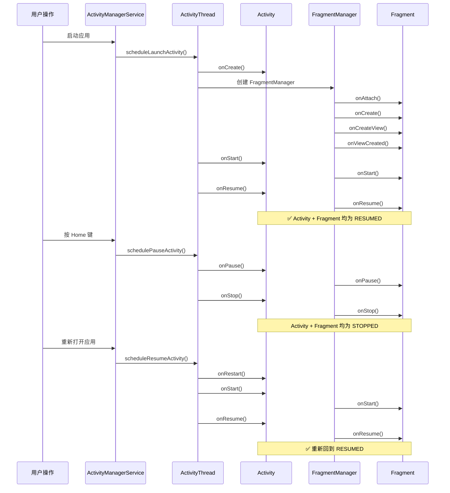
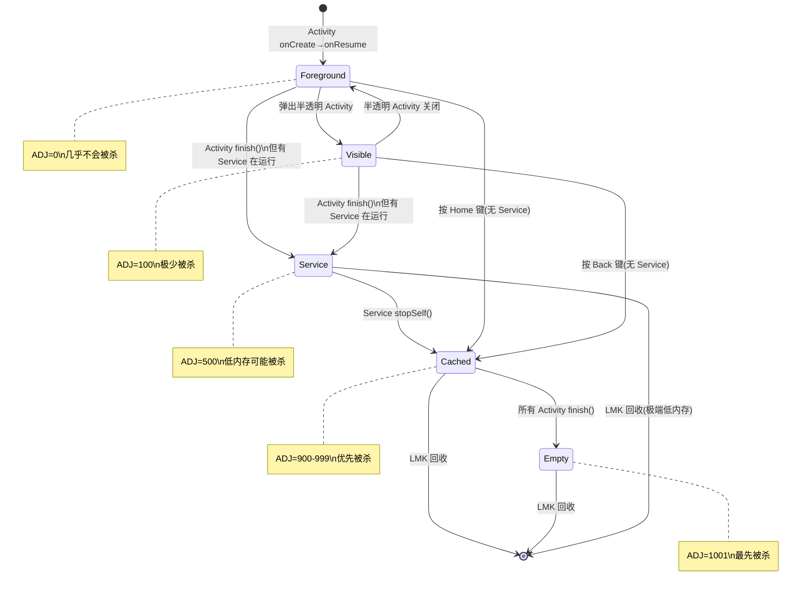
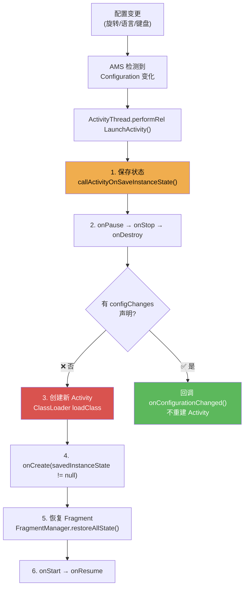

# 生命周期管理 —— 面试学习完整指南

> **六层递进体系**：面试问题 → 标准答案 → 核心原理 → 流程图 → 源码分析 → 实战场景
> 适用岗位：高级/资深 Android 工程师、Framework 开发工程师

---

## 目录

1. [常见面试问题（7+题）](#1-常见面试问题)
2. [标准答案与要点解析](#2-标准答案与要点解析)
3. [核心原理深度讲解](#3-核心原理深度讲解)
4. [原理流程图（Mermaid.js）](#4-原理流程图)
5. [核心源码分析](#5-核心源码分析)
6. [应用场景举例](#6-应用场景举例)

---

## 1. 常见面试问题

### Q1: Activity 完整生命周期（onCreate → onStart → onResume → onPause → onStop → onDestroy）各自的触发时机和在什么场景下被调用？
### Q2: Fragment 生命周期与宿主 Activity 生命周期如何联动（attach → onViewCreated → onDestroyView 的完整时序）？
### Q3: 横竖屏切换时，Activity 和 Fragment 的生命周期发生了哪些变化？如何保留数据？
### Q4: onSaveInstanceState(Bundle) vs ViewModel 的区别？各自适用于什么场景？
### Q5: onStop() 后多久 Activity 可能被系统杀死？进程优先级（Process Importance Hierarchy）是如何划分的？
### Q6（进阶）: FragmentManager 的后退栈（BackStack）是如何管理的？add vs replace 对生命周期的影响？
### Q7（进阶）: 配置变更时，RetainFragment（setRetainInstance）的原理？和 ViewModel 的关系？

---

## 2. 标准答案与要点解析

### Q1: Activity 完整生命周期触发时机

| 生命周期方法 | 触发时机 | 可见性 | 可交互 | 典型场景 |
|-------------|---------|:---:|:---:|---------|
| **onCreate()** | Activity 首次创建，只调用一次 | ❌ | ❌ | `setContentView()`、初始化成员变量、bind ViewModel |
| **onStart()** | Activity 从不可见变为可见 | ✅ | ❌ | 注册 BroadcastReceiver（动态）、初始化动画 |
| **onResume()** | Activity 获得焦点，处于前台 | ✅ | ✅ | 开始视频播放、开始定位、恢复动画 |
| **onPause()** | Activity 失去焦点但仍可见（如弹出 Dialog/PopupWindow） | 部分 | ❌ | 暂停视频、暂停动画、保存草稿 |
| **onStop()** | Activity 完全不可见（跳转到新 Activity 或按 Home 键） | ❌ | ❌ | 释放重资源（Bitmap）、停止定位 |
| **onDestroy()** | Activity 被销毁（finish() 或系统回收） | ❌ | ❌ | 清理所有资源、取消协程、移除监听器 |
| **onRestart()** | Activity 从 onStop 重新回到前台（非首次创建） | → ✅ | → ✅ | 刷新数据、重新注册监听器 |

**完整生命周期链路**：

```
正常启动:  onCreate → onStart → onResume
跳转新页面: onPause → onStop (新页面: onCreate → onStart → onResume)
返回原页面: onRestart → onStart → onResume
按 Back 退出: onPause → onStop → onDestroy
弹出 Dialog: onPause (不会 onStop!)
旋转屏幕:   onPause → onStop → onDestroy → onCreate → onStart → onResume
```

**面试加分点**：
- `onPause()` 必须在短时间内完成，因为下一个 Activity 的 `onResume()` 要等当前 `onPause()` 执行完毕
- `onStop()` 可能在内存不足时不被调用（直接被 kill），因此**关键数据保存不应依赖 onStop()**
- 弹出**半透明** Activity 时，前一个 Activity 走 `onPause()` 而非 `onStop()`（因为仍然可见）
- `onCreate` 中 `savedInstanceState != null` 时表示 Activity 正在被重建（配置变更或进程恢复）

---

### Q2: Fragment 生命周期与 Activity 联动

Fragment 的生命周期由 FragmentManager 管理，与宿主 Activity 的生命周期紧密联动。完整的时序关系如下：

```
Activity 创建阶段:
Activity.onCreate()
    → Fragment.onAttach()           // Fragment 与 Activity 关联
    → Fragment.onCreate()           // Fragment 自身初始化
    → Fragment.onCreateView()       // 创建并返回 Fragment 的 View
    → Fragment.onViewCreated()      // View 创建完成，可进行 findViewById
Activity.onStart()
    → Fragment.onStart()            // Fragment 变为可见
Activity.onResume()
    → Fragment.onResume()           // Fragment 获得焦点

Activity 销毁阶段:
    → Fragment.onPause()
Activity.onPause()
    → Fragment.onStop()
Activity.onStop()
    → Fragment.onDestroyView()      // View 被销毁，Fragment 实例仍存活
    → Fragment.onDestroy()
Activity.onDestroy()
    → Fragment.onDetach()           // Fragment 与 Activity 解除关联
```

**Fragment 特有的生命周期方法**：

| 方法 | 时机 | 注意事项 |
|------|------|---------|
| `onAttach(Context)` | Fragment 与 Activity 关联时 | 获取宿主 Activity 引用（`requireActivity()`） |
| `onCreateView()` | 创建 Fragment 的 View 层级 | 返回 null 表示无 UI Fragment |
| `onViewCreated()` | View 创建完成后 | **最佳时机**：`findViewById()`、设置 RecyclerView |
| `onDestroyView()` | Fragment 的 View 被移除 | **必须清理 View 引用**，避免内存泄漏 |

**add vs replace 对生命周期的影响**：

| 操作 | 生命周期行为 | FragmentManager 行为 |
|------|-------------|---------------------|
| `add(A)` | A: onCreate → ... → onResume | A 加入容器，和原有 Fragment 共存 |
| `add(B)` | B: onCreate → ... → onResume（A 不变） | A 和 B 同时存在于容器（重叠显示） |
| `replace(A)` | A: onCreate → ... → onResume | 移除容器中所有 Fragment，添加 A |
| `replace(B)` | A: onPause → onStop → onDestroyView → onDestroy → onDetach; B: 全套创建 | A 被完全销毁并从 FragmentManager 移除 |
| `add + addToBackStack` | 同上 add | 按 Back 键时 `popBackStack()`：B 被销毁，A 的 View 重新创建 |

**关键面试点**：`replace` 会销毁被替换的 Fragment，导致返回时需要重建，性能开销大。`add + hide/show` 更轻量但内存占用高。

---

### Q3: 横竖屏切换的生命周期变化

**默认行为（无任何配置）**：

```
竖屏 → 横屏:
onPause → onStop → onDestroy → onCreate → onStart → onResume
（Activity 被完全销毁并重建，Fragment 同样）

横屏 → 竖屏:
onPause → onStop → onDestroy → onCreate → onStart → onResume
（同样经历完整销毁+重建）
```

**三种处理策略**：

#### 策略 1：配置 configChanges（阻止重建）

```xml
<!-- AndroidManifest.xml -->
<activity
    android:name=".MainActivity"
    android:configChanges="orientation|screenSize|screenLayout|keyboardHidden" />
```

配置后，横竖屏切换时**不再重建 Activity**，而是回调 `onConfigurationChanged()`：

```java
@Override
public void onConfigurationChanged(Configuration newConfig) {
    super.onConfigurationChanged(newConfig);
    if (newConfig.orientation == Configuration.ORIENTATION_LANDSCAPE) {
        // 切换到横屏：重新调整布局
    } else {
        // 切换到竖屏
    }
}
```

**注意事项**：
- 使用 `configChanges` 后需要**手动处理**布局适配（重新 inflate 不同 layout）
- `android:configChanges="screenSize"` 从 API 13+ 必须配合 `orientation` 一起声明

#### 策略 2：ViewModel 保留数据

```java
public class MyViewModel extends ViewModel {
    // ViewModel 在配置变更时不会被销毁
    private final MutableLiveData<String> data = new MutableLiveData<>();
}

// Activity 中
MyViewModel vm = new ViewModelProvider(this).get(MyViewModel.class);
// 重建后 vm 是同一个实例，data 仍然存在
```

#### 策略 3：onSaveInstanceState + onCreate 恢复

```java
@Override
protected void onSaveInstanceState(Bundle outState) {
    super.onSaveInstanceState(outState);
    outState.putString("key", "value");  // 保存临时数据
}

@Override
protected void onCreate(Bundle savedInstanceState) {
    super.onCreate(savedInstanceState);
    if (savedInstanceState != null) {
        String value = savedInstanceState.getString("key");  // 恢复
    }
}
```

---

### Q4: onSaveInstanceState vs ViewModel 的区别

| 维度 | onSaveInstanceState(Bundle) | ViewModel |
|------|---------------------------|-----------|
| **存活范围** | 进程被杀后也能恢复（序列化到系统进程） | 仅在进程存活期间保留 |
| **数据容量** | 有限（Bundle 大小约 500KB，通过 Binder 传输） | 无严格限制（受内存限制） |
| **数据类型** | 仅支持基本类型和可序列化对象 | 任意 Java/Kotlin 对象 |
| **触发场景** | 配置变更、进程被系统杀死后恢复 | 仅配置变更（屏幕旋转等） |
| **数据生命周期** | 一次恢复后即被消费（setState(null) 后不保留） | 直到 Activity finish 或进程死亡 |
| **适用场景** | 用户输入的表单数据、页面滚动位置 | 网络请求结果、复杂业务对象、UI 状态 |

**最佳实践**：
- **ViewModel**：存储页面级别的 UI 状态和业务数据（网络请求结果、列表数据）
- **onSaveInstanceState**：存储轻量级的 UI 状态（EditText 文本、RecyclerView 滚动位置）
- **持久化存储**（SharedPreferences / Room / MMKV）：用户数据（需要跨 Session 保留的数据）
- **三者的关系**：`onSaveInstanceState` 是「进程死亡后的保底恢复」，ViewModel 是「配置变更的优雅过渡」，持久化存储是「用户数据的最终归宿」

---

### Q5: onStop() 后多久可能被杀 & 进程优先级

**没有固定时间！** 系统基于**内存压力**和**进程优先级**动态决定。Android 的进程优先级层级（由高到低）：

| 优先级 | 进程类别 | 判定条件 | 被杀概率 |
|:-----:|---------|---------|:-----:|
| **1** | Foreground（前台） | 用户正在交互的 Activity / 前台 Service / 正在执行 onReceive 的 BroadcastReceiver | 几乎不会被杀 |
| **2** | Visible（可见） | Activity 可见但不在前台（onPause，如被半透明 Activity 覆盖）/ 绑定到可见 Activity 的 Service | 极少被杀 |
| **3** | Service（服务） | 通过 startService 启动的 Service（非前台）/ 后台定位 | 低内存时可能被杀 |
| **4** | Cached（缓存） | 不可见且无 Service 的进程（onStop 后的 Activity） | 内存不足时优先被杀 |
| **5** | Empty（空进程） | 没有任何活跃组件的进程（纯粹为了加速下次启动的缓存） | 内存不足时最先被杀 |

**面试关键点**：
- 一个 onStop 的 Activity 所属进程属于 **Cached 优先级**，是系统回收内存的首要目标
- 不能假设 onStop 后进程能存活多久——可能是几秒，也可能是几分钟，完全取决于内存压力
- 如果有后台 Service，进程会被提升到 Service 优先级，存活概率大大提高
- 自 Android 6.0 (Doze) 开始，息屏后所有应用进入低功耗模式，Cached 进程被快速清理

---

### Q6: FragmentManager 后退栈管理

```java
// 标准操作
getSupportFragmentManager().beginTransaction()
    .add(R.id.container, new FragmentA())
    .addToBackStack("tag_A")       // 压入后退栈
    .commit();

// 后退栈结构
// BackStackEntry[0]: FragmentA ("tag_A")
// BackStackEntry[1]: FragmentB ("tag_B")  -- 当前
```

**popBackStack 行为**：
```
popBackStack()                        // 弹出栈顶一项
popBackStack("tag_A", INCLUSIVE)      // 弹出直到（包含）tag_A
popBackStack("tag_A", EXCLUSIVE)      // 弹出直到（不包含）tag_A
```

**内存泄漏风险**：
- `addToBackStack` 后 Fragment 的 View 被 destroy，但 Fragment 实例**不会**被销毁（泄露风险）
- 如果在 Fragment 中持有 Activity 引用或 View 引用未清理，会导致内存泄漏
- 解决方案：在 `onDestroyView()` 中清理所有 View 引用

---

### Q7: RetainFragment 与 ViewModel

**RetainFragment（已废弃，API 28 标记 @Deprecated）**：

```java
// 旧方案（不推荐）
public class RetainFragment extends Fragment {
    @Override
    public void onCreate(Bundle savedInstanceState) {
        super.onCreate(savedInstanceState);
        setRetainInstance(true);  // 配置变更时保留实例
    }
}
```

**原理**：`setRetainInstance(true)` 使 Fragment 在 Activity 重建时不被销毁，Fragment 实例被 detach 后直接 re-attach 到新 Activity，`onCreate()` 和 `onDestroy()` 不会再次调用。

**ViewModel 替代方案（推荐）**：

```java
public class MyViewModel extends ViewModel {
    private final MutableLiveData<MyData> data = new MutableLiveData<>();
    
    public LiveData<MyData> getData() { return data; }
    
    public void loadData() {
        // 异步加载数据...
    }
    
    @Override
    protected void onCleared() {
        // ViewModel 真正被销毁时（Activity finish）
        super.onCleared();
    }
}
```

**ViewModel 的内部原理**：
1. ViewModel 存储在 `ViewModelStore` 中（一个 `HashMap<String, ViewModel>`）
2. `ViewModelStore` 由宿主的 `NonConfigurationInstances` 持有
3. Activity 重建时，`NonConfigurationInstances` 被传递给新 Activity
4. 新 Activity 的 `ViewModelProvider` 从同一个 `ViewModelStore` 中获取 ViewModel

**ViewModel vs RetainFragment 对比**：

| 特性 | ViewModel | RetainFragment |
|------|-----------|---------------|
| 生命周期感知 | ✅ 自动跟随宿主 | ❌ 需手动管理 |
| 与 LiveData 集成 | ✅ 原生支持 | ❌ 需手动绑定 |
| 避免内存泄漏 | ✅ onCleared() 自动清理 | ❌ 容易忘记清理 |
| 状态 | ✅ Google 官方推荐 | ⚠️ Deprecated |

---

## 3. 核心原理深度讲解

### 3.1 Activity 生命周期状态机

Android 框架通过 `ActivityThread` 将 Activity 生命周期建模为一个**有限状态机**，每个生命周期方法都对应一个状态转换：

```
                 ┌─────────────┐
                 │   (初始)    │
                 └──────┬──────┘
                        │ onCreate()
                 ┌──────▼──────┐
                 │   CREATED   │
                 └──────┬──────┘
                        │ onStart()
                 ┌──────▼──────┐
                 │   STARTED   │◄────────── onRestart()
                 └──────┬──────┘
                        │ onResume()
                 ┌──────▼──────┐
                 │   RESUMED   │ (用户可见且可交互)
                 └──────┬──────┘
                        │ onPause()
                 ┌──────▼──────┐
                 │   PAUSED    │ (部分可见，不可交互)
                 └──────┬──────┘
                        │ onStop()
                 ┌──────▼──────┐
                 │   STOPPED   │ (完全不可见)
                 └──────┬──────┘
                        │ onDestroy()
                 ┌──────▼──────┐
                 │  DESTROYED  │
                 └─────────────┘
```

**关键设计原则**：
- 生命周期方法**必须成对出现**：`onCreate ↔ onDestroy`、`onStart ↔ onStop`、`onResume ↔ onPause`
- 只有 RESUMED 状态用户可以交互
- `onPause()` 是系统保证一定会被调用的最后一个方法（`onStop()` 不一定）

### 3.2 配置变更的 Activity 重建机制

当配置变更（屏幕旋转、语言切换、键盘可用性改变等）发生时，Android 默认**销毁并重建 Activity**：

```
1. 系统检测到配置变更
2. AMS 通知 ActivityThread: scheduleRelaunchActivity()
3. ActivityThread 调用:
   a. handlePauseActivity()      → onPause()
   b. handleStopActivity()       → onStop()
   c. callActivityOnSaveInstanceState() → onSaveInstanceState() ← 关键！
   d. handleDestroyActivity()    → onDestroy()
   e. handleLaunchActivity()     → 创建新 Activity 实例
   f. 新 Activity.onCreate(savedInstanceState) → savedInstanceState != null
   g. onStart → onRestoreInstanceState() → onResume()
```

**onSaveInstanceState 调用时机**：
- Android 9+ (API 28)：在 `onStop()` **之后**调用
- Android 9 以下：在 `onPause()` **之后**、`onStop()` 之前调用
- 这个变化意味着：**不能在 onSaveInstanceState 中依赖 onStop 已经完成的假设**

### 3.3 Process 生命周期（Importance Hierarchy）

Android 系统通过 `ActivityManagerService` 中的 `ProcessList` 类计算每个进程的重要性：

```java
// frameworks/base/services/core/java/com/android/server/am/ProcessList.java

// 进程重要性常量（值越小优先级越低，越小越容易被杀）
static final int UNKNOWN_ADJ = 1001;         // 未知
static final int CACHED_APP_MAX_ADJ = 999;   // 缓存进程的最大 ADJ（越高越容易被杀）
static final int CACHED_APP_MIN_ADJ = 900;   // 缓存进程的最小 ADJ
static final int SERVICE_B_ADJ = 800;        // B 类 Service
static final int PREVIOUS_APP_ADJ = 700;     // 上一个使用的应用
static final int HOME_APP_ADJ = 600;         // Home 应用
static final int SERVICE_ADJ = 500;          // 服务进程
static final int HEAVY_WEIGHT_APP_ADJ = 400; // 重量级进程
static final int BACKUP_APP_ADJ = 300;       // 备份进程
static final int PERCEPTIBLE_APP_ADJ = 200;  // 可感知进程（如后台音乐播放）
static final int VISIBLE_APP_ADJ = 100;      // 可见进程
static final int FOREGROUND_APP_ADJ = 0;     // 前台进程
static final int PERSISTENT_SERVICE_ADJ = -700; // 持久服务（不会被杀）
static final int SYSTEM_ADJ = -900;          // 系统进程
```

**LMK（Low Memory Killer）的决策过程**：
1. 监控系统可用内存（通过 `/sys/module/lowmemorykiller/` 接口）
2. 当内存低于阈值时，从高 ADJ（即 CACHED_APP_MAX_ADJ）开始回收进程
3. 同一 ADJ 级别内，优先回收**内存占用最大**的进程
4. 进程被 kill 时不会执行任何 Java 代码（`SIGKILL` 信号），因此 `onDestroy()` 不会执行

---

## 4. 原理流程图

### 4.1 Activity + Fragment 生命周期联动时序图



### 4.2 进程优先级状态图



### 4.3 配置变更重建流程



---

## 5. 核心源码分析

### 5.1 ActivityThread.handleRelaunchActivity() — 配置变更核心

```java
// 文件: frameworks/base/core/java/android/app/ActivityThread.java
// 行号: 约 4500-4800（Android 11 基准）

// === 步骤 1: 处理 LAUNCH_ACTIVITY 消息中的 relaunch ===
private void handleRelaunchActivityInner(ActivityClientRecord r, int configChanges,
        List<ResultInfo> pendingResults, List<ReferrerIntent> pendingIntents,
        PendingTransactionActions pendingActions, boolean startsNotResumed,
        Configuration overrideConfig, String reason) {
    
    // 步骤 1a: 保存即将销毁的 Activity 状态
    // 关键: 这里的 savedState 会传递给新建的 Activity
    Bundle savedState = null;
    if (!r.paused) {
        // 行 4700: 如果还没 pause，先 pause
        performPauseActivity(r, false, reason, null /* pendingActions */);
    }
    if (!r.stopped) {
        // 行 4710: 如果还没 stop，先 stop
        callActivityOnStop(r, true /* saveState */, reason);
    }
    
    // 步骤 1b: 处理 onSaveInstanceState (根据 API 级别不同时机不同)
    // API 28+: 在 onStop 之后
    // API < 28: 在 onPause 之后、onStop 之前
    if (!r.activity.mFinished) {
        savedState = new Bundle();
        mInstrumentation.callActivityOnSaveInstanceState(r.activity, savedState);
        // 行 4730: savedState 包含了用户手动保存的所有数据
    }
    
    // 步骤 1c: 销毁当前 Activity
    handleDestroyActivity(r, false, configChanges, true, reason);

    // 步骤 1d: 重建 Activity（核心！）
    // NonConfigurationInstances 在此处传递给新实例
    handleLaunchActivity(r, pendingActions, 
            null /* customIntent */);
    
    // 步骤 1e: 恢复 Fragment 状态
    if (r.activity.mFragments != null) {
        r.activity.mFragments.restoreAllState(
                savedState,                    // Activity 保存的状态
                r.activity.mFragments.mSavedFragmentState  // Fragment 状态
        );
    }
    // 行 4800: 重建完成
}

// === 步骤 2: NonConfigurationInstances 跨重建传递 ===
// 文件: frameworks/base/core/java/android/app/Activity.java
static final class NonConfigurationInstances {
    Object activity;          // 上个 Activity 实例
    HashMap<String, Object> children;  // Fragment 的 NonConfiguration
    FragmentManagerNonConfig fragments; // FragmentManager 状态
    ArrayMap<String, LoaderManager> loaders;
    VoiceInteractor voiceInteractor;
}

// 行 1100: Activity.retainNonConfigurationInstances()
NonConfigurationInstances retainNonConfigurationInstances() {
    Object activity = onRetainNonConfigurationInstance();  // 废弃 API
    HashMap<String, Object> children = onRetainNonConfigurationChildInstances();
    FragmentManagerNonConfig fragments = mFragments.retainNestedNonConfig();
    
    // ... 打包所有需要跨重建保留的数据
    
    NonConfigurationInstances nci = new NonConfigurationInstances();
    nci.activity = activity;
    nci.children = children;
    nci.fragments = fragments;
    // 行 1160
    return nci;
}
```

### 5.2 ViewModel 的生存原理源码

```java
// 文件: lifecycle-viewmodel/src/main/java/androidx/lifecycle/ViewModelProvider.java

// === ViewModelProvider 如何获取 ViewModel ===
public <T extends ViewModel> T get(@NonNull String key, @NonNull Class<T> modelClass) {
    ViewModel viewModel = mViewModelStore.get(key);  // 行 100
    
    if (modelClass.isInstance(viewModel)) {
        // ViewModel 已经存在 → 直接返回
        return (T) viewModel;
    }
    
    // ViewModel 不存在 → 通过 Factory 创建
    viewModel = mFactory.create(modelClass);
    mViewModelStore.put(key, viewModel);  // 行 120: 存入 ViewModelStore
    return (T) viewModel;
}

// === ViewModelStore 存储 ===
// 文件: lifecycle-viewmodel/src/main/java/androidx/lifecycle/ViewModelStore.java
public class ViewModelStore {
    private final HashMap<String, ViewModel> mMap = new HashMap<>();  // 行 30
    
    // Activity 重建时，ViewModelStore 通过 NonConfigurationInstances 传递
    // → 新 Activity 拿到同一个 ViewModelStore → get() 返回同一个 ViewModel 实例
}

// === ComponentActivity 中 ViewModelStore 的生存 ===
// 文件: activity/activity/src/main/java/androidx/activity/ComponentActivity.java
public final class ComponentActivity extends Activity implements
        ViewModelStoreOwner, ... {
    
    private ViewModelStore mViewModelStore;
    
    @Override
    public ViewModelStore getViewModelStore() {
        if (mViewModelStore == null) {
            // 步骤 1: 尝试从 NonConfigurationInstances 恢复
            NonConfigurationInstances nc =
                    (NonConfigurationInstances) getLastNonConfigurationInstance();
            if (nc != null) {
                mViewModelStore = nc.viewModelStore;  // 行 280: 复用！
            }
            if (mViewModelStore == null) {
                mViewModelStore = new ViewModelStore();  // 行 290: 全新创建
            }
        }
        return mViewModelStore;
    }
    
    @Override  // Activity.onRetainNonConfigurationInstance() 被框架调用
    public final Object onRetainNonConfigurationInstance() {
        Object custom = onRetainCustomNonConfigurationInstance();
        ViewModelStore viewModelStore = mViewModelStore;
        if (viewModelStore == null) {
            viewModelStore = getViewModelStore();
        }
        // 将 ViewModelStore 打包进 NonConfigurationInstances
        NonConfigurationInstances nci = new NonConfigurationInstances();
        nci.viewModelStore = viewModelStore;  // 行 340: ViewModelStore 跨 Activity 实例传递
        return nci;
    }
    
    @Override
    protected void onDestroy() {
        super.onDestroy();
        // 只有非配置变更导致的 onDestroy 才清理 ViewModel
        if (mViewModelStore != null && !isChangingConfigurations()) {
            mViewModelStore.clear();  // 行 380: Activity 真正 finish() 时清理
        }
    }
}
```

### 5.3 onSaveInstanceState 调用时机变化源码

```java
// 文件: frameworks/base/core/java/android/app/ActivityThread.java

// Android 9 以下 (API < 28):
private void handleStopActivity(IBinder token, boolean show, int configChanges, ...) {
    ActivityClientRecord r = performStopActivityInner(r, ...);  // onStop()
    // onSaveInstanceState 在 onPause 之后、onStop 之前被调用
    // callActivityOnSaveInstanceState() 在 performPauseActivity 中
}

// Android 9+ (API >= 28):
private void handleStopActivity(IBinder token, boolean show, int configChanges, ...) {
    // onPause 先执行，然后 onStop
    ActivityClientRecord r = performStopActivityInner(r, ...);  // onStop()
    // 关键变化: onSaveInstanceState 在 onStop 之后调用！
    if (!r.activity.mFinished && !r.stateNotSaved) {
        callActivityOnSaveInstanceState(r);  // 行 4180: onStop 之后
    }
}
```

---

## 6. 应用场景举例

### 场景 6.1：视频播放器的生命周期管理

```java
public class VideoPlayerActivity extends AppCompatActivity {
    private ExoPlayer player;
    private long playbackPosition = 0;
    private boolean playWhenReady = true;
    
    @Override
    protected void onCreate(Bundle savedInstanceState) {
        super.onCreate(savedInstanceState);
        if (savedInstanceState != null) {
            // 从 savedState 恢复播放位置
            playbackPosition = savedInstanceState.getLong("position", 0);
            playWhenReady = savedInstanceState.getBoolean("play_when_ready", true);
        }
    }
    
    @Override
    protected void onResume() {
        super.onResume();
        // 初始化或恢复播放器
        if (player == null) {
            player = new ExoPlayer.Builder(this).build();
            player.seekTo(playbackPosition);
            player.setPlayWhenReady(playWhenReady);
        }
    }
    
    @Override
    protected void onPause() {
        super.onPause();
        // 暂停播放并保存位置（使用 ViewModel 而非 onSaveInstanceState）
        if (player != null) {
            playbackPosition = player.getCurrentPosition();
            playWhenReady = player.getPlayWhenReady();
            player.setPlayWhenReady(false);
        }
    }
    
    @Override
    protected void onStop() {
        super.onStop();
        // 释放视频解码器资源（大量内存）
        if (player != null) {
            player.stop();
            player.release();
            player = null;
        }
    }
    
    @Override
    protected void onSaveInstanceState(Bundle outState) {
        super.onSaveInstanceState(outState);
        outState.putLong("position", playbackPosition);
        outState.putBoolean("play_when_ready", playWhenReady);
    }
}
```

### 场景 6.2：Fragment 懒加载 + ViewPager 生命周期

```java
public class LazyFragment extends Fragment {
    private boolean isViewCreated = false;
    private boolean isDataLoaded = false;
    
    @Override
    public void onViewCreated(View view, Bundle savedInstanceState) {
        super.onViewCreated(view, savedInstanceState);
        isViewCreated = true;
        // 不要在这里加载数据！可能用户还没切换到该页面
        lazyLoad();
    }
    
    @Override
    public void setUserVisibleHint(boolean isVisibleToUser) {
        super.setUserVisibleHint(isVisibleToUser);
        // ViewPager 中 Fragment 的可见性回调
        lazyLoad();
    }
    
    private void lazyLoad() {
        if (isViewCreated && getUserVisibleHint() && !isDataLoaded) {
            // 真正发起数据请求
            loadData();
            isDataLoaded = true;
        }
    }
    
    @Override
    public void onDestroyView() {
        super.onDestroyView();
        // 清理所有 View 引用
        isViewCreated = false;
        isDataLoaded = false;
        // 将 View 引用置空，防止内存泄漏
    }
}
```

### 场景 6.3：进程被杀的保活与恢复

```java
// 现象：用户从应用 A 跳到应用 B，10 分钟后回到应用 A
// 可能发现应用 A 被重新启动了 (冷启动)
// 原因：应用 A 进入 Cached 状态后被 LMK 回收

// ✅ 正确做法：在 onSaveInstanceState 中保存关键状态
public class OrderActivity extends AppCompatActivity {
    private static final String KEY_ORDER_ID = "order_id";
    private static final String KEY_SCROLL_POS = "scroll_pos";
    private long orderId;
    
    @Override
    protected void onCreate(Bundle savedInstanceState) {
        super.onCreate(savedInstanceState);
        if (savedInstanceState != null) {
            orderId = savedInstanceState.getLong(KEY_ORDER_ID);
            int scrollPos = savedInstanceState.getInt(KEY_SCROLL_POS);
            restoreScrollPosition(scrollPos);
        } else if (getIntent() != null) {
            orderId = getIntent().getLongExtra("order_id", -1);
        }
        // 🔥 使用 ViewModel 保存实时数据
        OrderViewModel vm = new ViewModelProvider(this).get(OrderViewModel.class);
        vm.loadOrder(orderId);
    }
    
    @Override
    protected void onSaveInstanceState(Bundle outState) {
        super.onSaveInstanceState(outState);
        outState.putLong(KEY_ORDER_ID, orderId);
        outState.putInt(KEY_SCROLL_POS, getCurrentScrollPosition());
    }
}
```

### 场景 6.4：横竖屏切换的三种处理对比实战

```java
// 方案对比:
//
// 方案 1: configChanges（无重建）
// 优点: 性能最好，无重建开销
// 缺点: 需手动处理布局切换，容易遗漏状态同步
//
// 方案 2: ViewModel + onSaveInstanceState（默认重建）
// 优点: 标准方案，Google 推荐，自动处理布局切换
// 缺点: 有重建开销，复杂对象需序列化/反序列化
//
// 方案 3: 锁定方向（禁止旋转）
// 优点: 最简单
// 缺点: 用户体验差（平板横屏使用场景受限）

// 推荐: 方案 2，通过 ViewModel 保留复杂状态
public class RotationSafeActivity extends AppCompatActivity {
    private MyViewModel viewModel;
    
    @Override
    protected void onCreate(Bundle savedInstanceState) {
        super.onCreate(savedInstanceState);
        viewModel = new ViewModelProvider(this).get(MyViewModel.class);
        
        // 观察数据
        viewModel.getData().observe(this, data -> {
            // 旋转后自动恢复数据展示
            updateUI(data);
        });
        
        // 仅在首次创建时加载
        if (savedInstanceState == null) {
            viewModel.loadData();
        }
    }
}
```

---

> **学习检查清单**
> - [ ] 能按顺序默写 Activity 的 7 个生命周期方法
> - [ ] 理解 Fragment 生命周期比 Activity 多出来的 onAttach/onCreateView/onViewCreated/onDestroyView/onDetach
> - [ ] 能画出横竖屏切换时的完整生命周期调用链
> - [ ] 清楚 onSaveInstanceState、ViewModel、持久化存储三者各自的使用场景
> - [ ] 能说出进程优先级的 5 个层级及对应的 ADJ 值范围
> - [ ] 理解 NonConfigurationInstances 如何实现 ViewModel 的跨重建存活
> - [ ] 知道 add + addToBackStack 和 replace 的生命周期差异
