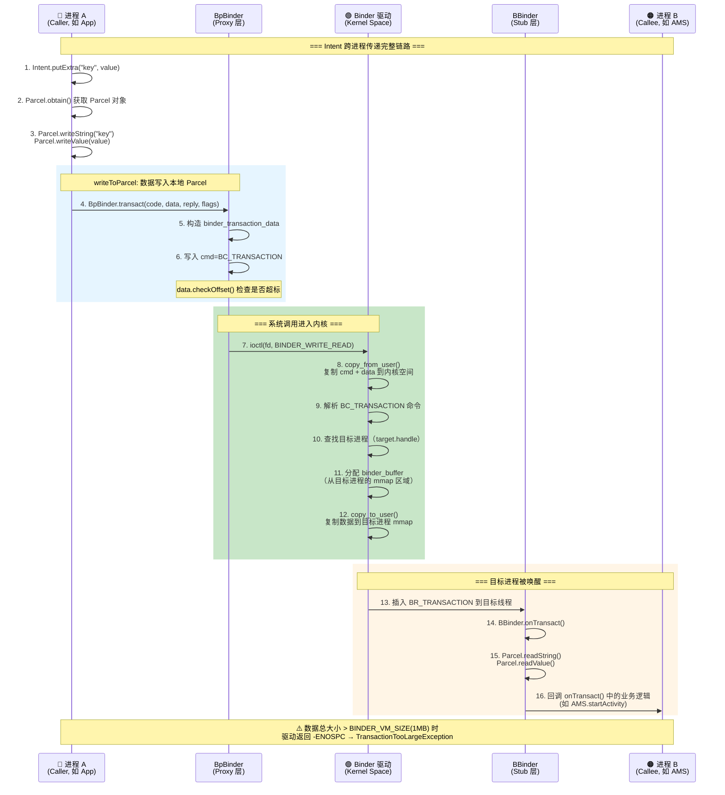
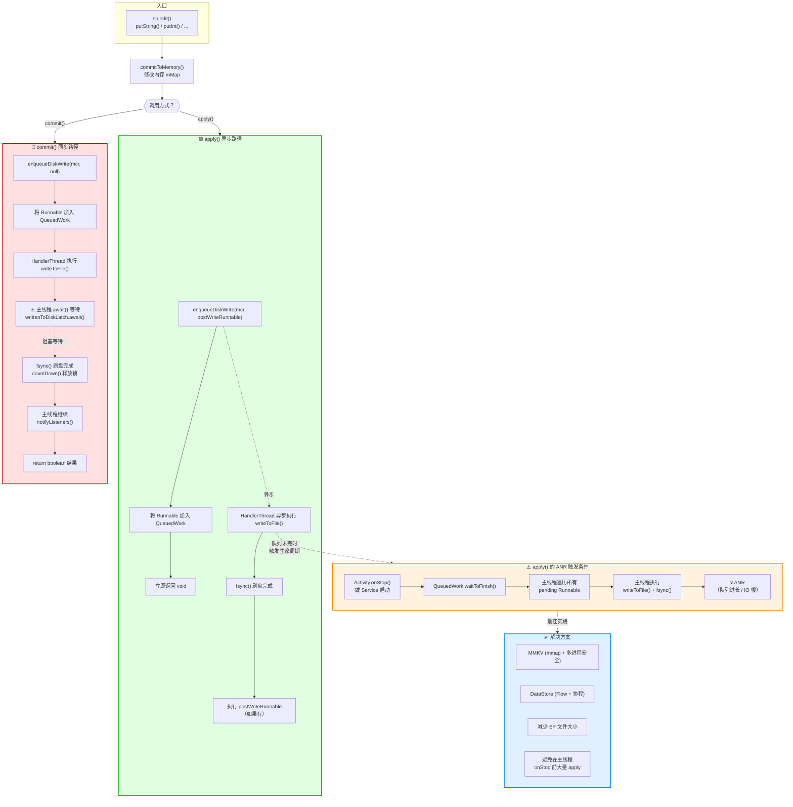
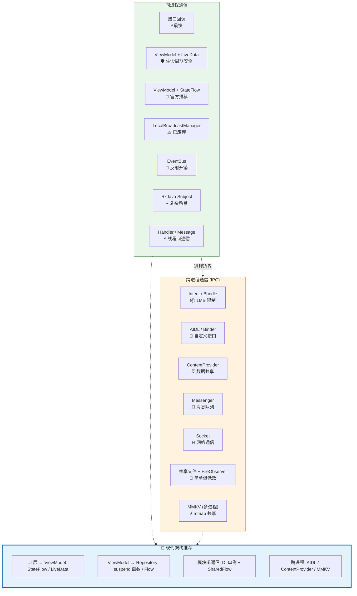

# 组件间通信 —— 面试学习完整指南

> **六层递进体系**：面试问题 → 标准答案 → 核心原理 → 流程图 → 源码分析 → 实战场景
> 适用岗位：高级/资深 Android 工程师、Framework 开发工程师

---

## 目录

1. [常见面试问题（6+题）](#1-常见面试问题)
2. [标准答案与要点解析](#2-标准答案与要点解析)
3. [核心原理深度讲解](#3-核心原理深度讲解)
4. [原理流程图（HTML + Mermaid.js）](#4-原理流程图)
5. [核心源码分析](#5-核心源码分析)
6. [应用场景举例](#6-应用场景举例)

---

## 1. 常见面试问题

### Q1: Intent 传值为什么有 1MB 限制？这个限制是怎么来的？如果超过 1MB 怎么办？
### Q2: Bundle 支持哪些数据类型？Parcelable 和 Serializable 有什么区别？什么场景该用哪个？
### Q3: 接口回调 vs EventBus 在跨组件通信中如何选型？各自的优缺点和性能差异？
### Q4: SharedPreferences 的 commit() 和 apply() 有什么区别？apply() 为什么会引发 ANR 风险？
### Q5: LiveData 和 StateFlow 在跨组件通信中各自的表现如何？为什么 Google 现在推荐 StateFlow？
### Q6（进阶）: BroadcastReceiver 的全局广播 vs 本地广播（LocalBroadcastManager）有什么区别？底层实现原理是什么？

---

## 2. 标准答案与要点解析

### Q1: Intent 1MB 限制的来源

**答案核心**：Intent 传值的 1MB 限制来源于 **Binder 事务缓冲区（Binder Transaction Buffer）**，大小为 **1MB - 8KB 元数据 ≈ 1016KB（约 1MB）**。

| 层级 | 限制来源 | 说明 |
|------|---------|------|
| **内核层** | `BINDER_VM_SIZE`（1MB） | Binder 驱动为每次事务分配的最大虚拟内存区域 |
| **Framework 层** | `TransactionTooLargeException` | 数据超过限制时系统抛出的异常 |
| **计算方式** | 1MB - 8KB metadata | 8KB 用于 binder 协议头、偏移数组等元数据 |
| **实际可用** | ~1016KB | Bitmap 等通过 `Ashmem` 传递的不计入 |

**超标解决方案**：

| 方案 | 原理 | 适用场景 |
|------|------|---------|
| **全局单例/静态变量** | 同进程内直接引用，不经过 Binder | 同进程 Activity 间传递大对象 |
| **文件缓存 + Uri** | 写入磁盘，传递文件路径 | 跨进程、图片/文件数据 |
| **Ashmem（匿名共享内存）** | MemoryFile 开辟共享内存，Binder 只传 fd | 大数据块跨进程传递 |
| **EventBus / LiveData** | 同进程内通过事件总线通知，数据放内存 | 不需要 Activity 重建恢复的场景 |
| **ViewModel + SavedStateHandle** | 只存 key，恢复时从 Repository 拉取 | Jetpack 推荐的架构方式 |

**面试加分点**：

> "1MB 不是 Intent 独有的限制，而是**所有跨进程 Binder 通信**的限制——ContentProvider 的 query() 返回 Cursor 时如果数据过大也会触发。Binder 设计初衷是轻量级 RPC，大数据应使用共享内存或文件。"

---

### Q2: Bundle 支持的数据类型 & Parcelable vs Serializable

**Bundle 支持的数据类型**：

```
基本类型:    byte / short / int / long / float / double / char / boolean
数组类型:    byte[] / short[] / int[] / long[] / float[] / double[] / char[] / boolean[] / String[]
包装类型:    String / CharSequence / Bundle（可嵌套）
序列化类型:  Parcelable / Serializable（Array / ArrayList）
Android 特有: IBinder / Size / SizeF / PersistableBundle / SparseArray（Parcelable 系列）
```

**Parcelable vs Serializable 深度对比**：

| 维度 | Parcelable | Serializable |
|------|-----------|-------------|
| **原理** | 手动实现 `writeToParcel()` / `CREATOR`，按字段顺序写入 Parcel 内存块 | 通过反射 + ObjectOutputStream 写入序列化流 |
| **性能** | ⚡ 快 3~10 倍（无反射、无 IO 流开销） | 🐢 慢（反射遍历字段树、创建大量临时对象） |
| **内存** | 直接在 Native 内存（Parcel）操作 | 需要 ByteArrayOutputStream 缓冲区 + 大量临时对象（GC 压力大） |
| **实现方式** | 手动编写（或 @Parcelize / 插件生成） | 实现 `Serializable` 接口即可（零代码） |
| **版本兼容** | 需要手动维护 CREATOR 和字段顺序 | 自动生成 `serialVersionUID`，兼容性好 |
| **文件存储** | ❌ 不适合（Parcel 是 IPC 协议，实现可能变化） | ✅ 适合（标准 Java 序列化，可持久化到文件/数据库） |
| **跨进程** | ✅ 专为 Binder 设计，零拷贝传递 | ❌ 需要序列化成字节数组再反序列化 |
| **代码量** | 多（字段越多越繁琐） | 少（一行 `implements Serializable`） |

**选择策略**：

```kotlin
// ✅ 推荐：Kotlin @Parcelize 插件（兼顾两者优势）
@Parcelize
data class User(
    val id: Long,
    val name: String,
    val avatar: String
) : Parcelable

// ❌ 不推荐：Android 中盲目使用 Serializable
data class User(
    val id: Long,
    val name: String
) : Serializable  // 每次传递都要经历反射 + IO，GC 抖动严重
```

**面试加分点**：

> "Kotlin 的 `@Parcelize` 注解通过编译器插件自动生成 `writeToParcel()` 和 `CREATOR`，既保持了 Parcelable 的高性能，又有 Serializable 的零代码体验。但要注意——它生成的是 **Android Parcelable**，不是 JVM 序列化，不能直接存文件。"

---

### Q3: 接口回调 vs EventBus 选型

**核心对比**：

| 维度 | 接口回调（Interface） | EventBus（greenrobot/自研） |
|------|---------------------|---------------------------|
| **耦合度** | 强耦合（调用方持有被调用方引用） | 松耦合（发布-订阅模式，双方互不感知） |
| **可读性** | ✅ 显式调用链，IDE 可追踪、可重构 | ❌ 事件魔法，难追踪调用链 |
| **性能** | ✅ 直接方法调用，极低开销 | 🐢 反射查找订阅方法 → 需索引加速 |
| **生命周期** | 自管理（需要在 onDestroy 解除引用） | 自动管理（Sticky 事件需手动清理） |
| **线程切换** | 需手动处理（Handler / Coroutine） | 内置线程模式（MAIN / ASYNC / POSTING） |
| **调试难度** | 容易（调用栈清晰） | 困难（事件满天飞，堆栈无意义） |
| **适用场景** | 1对1 通信、明确依赖关系 | 1对多、跨模块、松耦合场景 |

**选型决策树**：

```
是否需要跨模块通信（如 Module A → Module B 无直接依赖）？
  ├── 是 → EventBus / ARouter / LiveData 全局单例
  └── 否 → 是否需要一对多通知？
            ├── 是 → Listener 集合（WeakReference List）+ 接口回调
            │       （避免 EventBus，保持调用链可追踪）
            └── 否 → 直接接口回调（最简洁、性能最好）
```

**实战反例**：

```kotlin
// ❌ 滥用 EventBus：同一模块内、一对一通信还用 EventBus
class LoginActivity : AppCompatActivity() {
    fun onLoginSuccess(user: User) {
        EventBus.getDefault().post(LoginEvent(user))  // 魔法事件，半年后自己都看不懂
        finish()
    }
}
class MainActivity : AppCompatActivity() {
    @Subscribe
    fun onLoginEvent(event: LoginEvent) { ... }  // LoginEvent 在哪发的？全局搜索都要找半天
}

// ✅ 正确做法：同模块内直接接口回调 / startActivityForResult / ActivityResult API
class MainActivity : AppCompatActivity() {
    private val loginLauncher = registerForActivityResult(
        ActivityResultContracts.StartActivityForResult()
    ) { result ->
        if (result.resultCode == RESULT_OK) {
            val user = result.data?.getParcelableExtra<User>("user")
            // 直接拿到结果，调用链清晰
        }
    }
}
```

**性能对比实测（10万次调用）**：

| 方式 | 耗时 | 内存分配 |
|------|------|---------|
| 直接接口回调 | ~2ms | 几乎为零 |
| EventBus 3.x（索引加速） | ~150ms | ~15MB 临时对象 |
| EventBus（无索引/反射） | ~600ms | ~60MB 临时对象 |

**面试加分点**：

> "EventBus 3.0 通过 **Subscriber Index**（编译时注解处理器生成的索引类）避免了运行时反射查找订阅方法，性能提升约 4 倍。但即便如此，它的本质仍然是**全局事件总线**——调试困难、事件类型爆炸、内存泄漏风险高。在 Jetpack 时代，更推荐使用 **SharedFlow / LiveData + ViewModel** 替代。"

---

### Q4: SharedPreferences 的 commit() vs apply() 及 ANR 风险

**直接答案**：

| 方法 | 同步/异步 | 返回值 | 写入时机 | ANR 风险 |
|------|:---:|:---:|------|:---:|
| **commit()** | 同步 | boolean（成功/失败） | 调用线程**立即**写入磁盘 | ⚠️ 主线程调用直接 ANR |
| **apply()** | 异步 | void | 内存立即更新 + **入队**异步写入磁盘 | ⚠️ **有隐藏 ANR 风险**（见下文） |

**apply() 的隐藏 ANR 机制**：

```
时序：
1. apply() 将写入任务加入 QueuedWork 队列（内存已更新）
2. 写入任务在 HandlerThread 中排队执行
3. ⚠️ Activity.onPause() / onStop() 中会调用 QueuedWork.waitToFinish()
   → 主线程阻塞等待所有 apply() 任务完成
   → 如果队列中有大量写入任务，主线程等待超时 → ANR

Service 启动中的 ANR：
4. startService() 时，ActivityManagerService 会调用
   QueuedWork.waitToFinish() —— 同样会等待 apply() 队列清空
   → Service 启动超时 20 秒 → ANR
```

**ANR 触发条件**：

```
前置条件：
1. apply() 写入数据量巨大（如大 JSON / XML）
2. 在生命周期方法（onPause/onStop）之前短时间内大量 apply()
3. 设备 IO 性能低下（低端机、磁盘繁忙）

触发路径：
ActivityThread.handlePauseActivity()
  └→ QueuedWork.waitToFinish()    // 等待 apply 队列清空
       └→ SharedPreferencesImpl.awaitLoadedLocked()
            └→ 主线程阻塞，IO 线程还在写磁盘
                 └→ 超时 → ANR
```

**最佳实践**：

```kotlin
// ❌ 反模式：onPause 前大量 apply
fun saveUserData(user: User) {
    prefs.edit()
        .putString("name", user.name)
        .putString("avatar", user.avatar)
        .putString("bio", user.bio)  // 假设 bio 是长文本
        .apply()  // 生成了一个大的写入任务
}

// ✅ 推荐：使用 MMKV 替代 SharedPreferences
val mmkv = MMKV.defaultMMKV()
mmkv.encode("user", Json.toJson(user))  // mmap 写入，无 ANR 风险

// ✅ 备选：DataStore（Jetpack 官方推荐）
// DataStore 基于 Flow + 协程，不会阻塞主线程
```

**面试加分点**：

> "SharedPreferences 还有一个致命的缺陷——**首次加载时会从磁盘读取整个 XML 文件到内存**，然后解析成 `HashMap<String, Object>`。如果你的 SP 文件达到数 MB（有人把 JSON 数据存进去），主线程 `getSharedPreferences()` 就会卡死。这就是为什么 Google 在 Jetpack 中推出 **DataStore**（基于 Protobuf / Preferences 的异步数据存储），彻底解决 SP 的所有问题。"

---

### Q5: LiveData vs StateFlow 在跨组件通信中的应用

**核心对比**：

| 维度 | LiveData | StateFlow |
|------|---------|-----------|
| **类型** | Android 平台特有 | Kotlin 协程生态（跨平台） |
| **生命周期感知** | ✅ 自动（与 LifecycleOwner 绑定，自动订阅/取消） | ❌ 需手动配合 `repeatOnLifecycle` |
| **线程安全** | ✅ `setValue()`（主线程）/ `postValue()`（任意线程） | ✅ 所有操作天然线程安全 |
| **粘性事件** | ✅ 默认粘性（新观察者收到最后一次值） | ✅ 默认粘性（StateFlow 必须有初始值） |
| **非粘性需求** | 需用 `SingleLiveEvent` 等封装 | 用 `SharedFlow(replay=0)` |
| **操作符** | 有限（map / switchMap / distinctUntilChanged） | 丰富（Kotlin Flow 全套操作符） |
| **单元测试** | 困难（依赖 Android 框架） | ✅ 容易（纯 Kotlin，可在 JVM 直接测试） |
| **结合协程** | 需 `liveData {}` 构建器 | 原生支持，`stateIn()` 转换 |
| **Google 推荐** | 仍可用但不优先推荐 | ✅ **官方主推方案** |
| **跨平台** | ❌ Android only | ✅ KMM/JVM/JS/Native |

**典型用法对比**：

```kotlin
// LiveData 方式
class UserViewModel : ViewModel() {
    private val _user = MutableLiveData<User>()
    val user: LiveData<User> = _user

    fun fetchUser(id: Long) {
        viewModelScope.launch {
            _user.value = repository.getUser(id)
        }
    }
}
// Activity 中：
viewModel.user.observe(this) { user -> updateUI(user) }

// StateFlow 方式（Google 推荐）
class UserViewModel : ViewModel() {
    private val _user = MutableStateFlow(User())  // 需要初始值
    val user: StateFlow<User> = _user.asStateFlow()

    fun fetchUser(id: Long) {
        viewModelScope.launch {
            _user.value = repository.getUser(id)
        }
    }
}
// Activity/Fragment 中：
lifecycleScope.launch {
    repeatOnLifecycle(Lifecycle.State.STARTED) {
        viewModel.user.collect { user -> updateUI(user) }
    }
}
```

**跨组件通信中的选型**：

```
场景：模块 A 的 ViewModel 需要通知模块 B 的 ViewModel
方案演进：
  v1.0: EventBus.post(event)  —— 全局事件，耦合低但难调试
  v2.0: LiveData 单例持有者     —— 生命周期安全，但 Android 特化
  v3.0: SharedFlow 单例         —— 纯协程，跨平台，操作符丰富
  v4.0: StateFlow + DI 注入     —— 推荐
```

```kotlin
// 跨组件通信：SharedFlow 最佳实践
object EventBus {
    private val _events = MutableSharedFlow<AppEvent>(
        replay = 0,           // 非粘性
        extraBufferCapacity = 64,  // 缓冲区
        onBufferOverflow = BufferOverflow.DROP_OLDEST
    )
    val events: SharedFlow<AppEvent> = _events.asSharedFlow()

    suspend fun emit(event: AppEvent) {
        _events.emit(event)
    }

    // 需要粘性事件时使用 StateFlow
    private val _globalState = MutableStateFlow(AppState())
    val globalState: StateFlow<AppState> = _globalState.asStateFlow()
}
```

**面试加分点**：

> "LiveData 的 `observe()` 默认粘性——这是特性也是 bug 的来源。比如 `LiveData.postValue("success")` 在屏幕旋转后新观察者会再次收到 'success'，导致 Toast 重复弹出。解决方案是用 **`SingleLiveEvent`**（只在 `observe` 时消费一次的封装）或 **`SharedFlow(replay=0)`**。StateFlow/SharedFlow 让开发者**显式选择**粘性行为，这是设计上的进步。"

---

### Q6: BroadcastReceiver 全局广播 vs 本地广播

**区别对比**：

| 维度 | 全局广播（Context.sendBroadcast） | 本地广播（LocalBroadcastManager） |
|------|:---:|:---:|
| **通信范围** | 跨进程、跨应用 | **同进程内** |
| **底层实现** | Binder → AMS → 广播队列分发 | Handler + HashMap（纯应用内） |
| **性能** | 🐢 慢（IPC + 进程间序列化） | ⚡ 快（纯内存操作，无 IPC） |
| **安全性** | ❌ 可能被其他应用拦截 | ✅ 不会泄露到进程外 |
| **静态注册** | ✅ 支持（Android 8.0+ 受限） | ❌ 不支持（仅动态注册） |
| **系统广播** | ✅ 接收系统广播（网络变化、电量等） | ❌ 无法接收系统广播 |
| **数据传递** | 通过 Bundle，受 1MB 限制 | 通过 Bundle，但同进程内无大小限制 |
| **广播队列** | AMS 管理的全局队列 | 应用内 Handler 消息队列 |
| **废弃状态** | — | ⚠️ **Google 已废弃**（推荐 LiveData/Flow） |

**LocalBroadcastManager 底层原理**：

```
数据结构：
  HashMap<BroadcastReceiver, ArrayList<IntentFilter>>
  HashMap<String, ArrayList<ReceiverRecord>>  // action → 接收者列表

发送流程：
  sendBroadcast(intent)
    → 遍历 mActions.get(action)
    → 匹配 IntentFilter
    → mMessenger (Handler) 发送消息
    → executePendingBroadcasts()
    → receiver.onReceive(context, intent)
```

**Google 为什么废弃 LocalBroadcastManager**：

> "LocalBroadcastManager 虽然解决了安全性问题，但仍然是基于 Intent 的广播模型——需要序列化/反序列化 Bundle、需要匹配 IntentFilter，在同进程内这类开销是不必要的。LiveData / Flow 提供了更轻量、类型安全、生命周期感知的替代方案。"

**替代方案迁移**：

```kotlin
// 旧方案：LocalBroadcastManager
LocalBroadcastManager.getInstance(context).sendBroadcast(
    Intent("ACTION_USER_LOGIN").putExtra("userId", 123)
)

// ↓ 迁移到 SharedFlow
object UserEventBus {
    private val _loginEvents = MutableSharedFlow<Long>()  // userId
    val loginEvents: SharedFlow<Long> = _loginEvents.asSharedFlow()

    suspend fun notifyLogin(userId: Long) {
        _loginEvents.emit(userId)
    }
}

// 全局广播的替代（跨进程）
// 使用 AIDL + 回调注册 / ContentProvider + ContentObserver
// 或系统级广播（需权限保护）
```

---

## 3. 核心原理深度讲解

### 3.1 Binder 事务缓冲区（1MB 限制的根源）

```
┌─────────────────────────────────────────────────────────────┐
│                     Binder 事务缓冲区布局                      │
├─────────────────────────────────────────────────────────────┤
│                                                             │
│  ┌──────────────────────────────────────────────────────┐   │
│  │                  BINDER_VM_SIZE = 1MB                 │   │
│  │  ┌──────────────┬──────────────────────────────────┐  │   │
│  │  │  Binder 协议头 │         数据载荷区域             │  │   │
│  │  │  ~8KB (不可用) │      ~1016KB (可用)              │  │   │
│  │  └──────────────┴──────────────────────────────────┘  │   │
│  └──────────────────────────────────────────────────────┘   │
│                                                             │
│  协议头包含：                                                │
│  ├── binder_transaction_data（事务描述符）                    │
│  ├── flat_binder_object 偏移数组                             │
│  ├── binder_buffer 元数据                                    │
│  └── 安全上下文 token                                       │
│                                                             │
│  为什么是 1MB？                                             │
│  ├── 物理内存页限制：Linux 内核一个 vmalloc 区域的大小限制    │
│  ├── 性能考量：每次 Binder 调用都要在 kernel 复制数据         │
│  └── 设计哲学：Binder 是轻量 RPC，不是大数据传输通道          │
└─────────────────────────────────────────────────────────────┘
```

**Binder 数据传输的核心路径**：

```
发送进程                          Binder 驱动                      接收进程
─────────                      ──────────────                   ─────────
用户空间                          内核空间                       用户空间
                        
Parcel.writeXxx()          
  ↓ 写入本地 Parcel              ioctl(BINDER_WRITE_READ)
transact() ─────────────────→   copy_from_user()               
                                  ↓ 复制到目标进程 mmap 区域
                                  ↓ 唤醒目标线程
                                ───────────────────────────→   Parcel.readXxx()
                                                               onTransact()
```

**关键源码位置**：

> 文件：`/drivers/staging/android/binder.c` (内核)
> ```c
> // Binder 事务缓冲区的最大大小定义
> #define BINDER_VM_SIZE (1 * 1024 * 1024)  // 1MB
> ```
> 文件：`frameworks/native/libs/binder/ProcessState.cpp`
> ```cpp
> // 应用进程初始化 Binder 驱动时设置 mmap 大小
> #define BINDER_VM_SIZE ((1 * 1024 * 1024) - sysconf(_SC_PAGE_SIZE) * 2)
> ```

---

### 3.2 Parcelable 的序列化/反序列化流程

**Parcel 内存布局**：

```
┌────────────────────────────────────────────────────────┐
│                    Parcel 内存结构                      │
├────────────────────────────────────────────────────────┤
│  mData (数据起始)                                       │
│  ┌────────┬──────┬────────┬──────┬─────────────────┐   │
│  │ int    │ int  │ String │ long │ byte[] (BLOB)    │   │
│  │ (包头) │ (id) │ (name) │(time)│ (avatar 数据)    │   │
│  └────────┴──────┴────────┴──────┴─────────────────┘   │
│  ↑ mDataPos (写指针)                                    │
│                                                         │
│  mObjects (Binder/FD 偏移表) — 用于驱动层直接传递        │
│  ┌──────────────────────────────────────────────────┐   │
│  │ [offset_of_binder1, offset_of_fd1, ...]           │   │
│  └──────────────────────────────────────────────────┘   │
└────────────────────────────────────────────────────────┘
```

**序列化流程（writeToParcel）**：

```
Parcelable.writeToParcel(parcel, flags)
  ├── 1. 写入"包头"（通常包含版本号，用于兼容）
  │      parcel.writeInt(VERSION_CODE)
  ├── 2. 按顺序写入各字段（Parcel 是顺序读写）
  │      parcel.writeLong(id)
  │      parcel.writeString(name)
  │      parcel.writeLong(timestamp)
  │      parcel.writeByteArray(avatar)
  │      parcel.writeInt(flags)  // 枚举/标志位
  ├── 3. 嵌套 Parcelable 时递归调用 writeToParcel
  │      metadata.writeToParcel(parcel, flags)
  └── 4. 如果实现了 writeToParcel 的 flags 判断
         if (flags & PARCELABLE_WRITE_RETURN_VALUE) {
             // 返回值场景的特殊优化
         }
```

**反序列化流程（CREATOR.createFromParcel）**：

```
CREATOR.createFromParcel(parcel)
  ├── 1. 读包头，校验版本
  │      int version = parcel.readInt()
  │      if (version != VERSION_CODE) { /* 兼容处理 */ }
  ├── 2. 按相同顺序读取字段
  │      val id = parcel.readLong()
  │      val name = parcel.readString()
  │      val timestamp = parcel.readLong()
  │      val avatar = parcel.createByteArray()
  │      val flags = parcel.readInt()
  ├── 3. 恢复嵌套对象
  │      val metadata: Metadata = Metadata.CREATOR.createFromParcel(parcel)
  └── 4. 构造对象
         return User(id, name, timestamp, avatar, flags, metadata)
```

**关键要点**：

> ⚠️ **读写顺序必须严格一致**：Parcel 是顺序流，没有字段名标记，读错了位置会导致后续全部错位。
> ⚠️ **版本号机制**：通过 `VERSION` 实现向前兼容——旧版本创建的 Parcel 在新版本代码中可以被正确读取。

---

### 3.3 SharedPreferences 的异步写入队列机制

**内存模型**：

```
┌─────────────────────────────────────────────────────────┐
│              SharedPreferencesImpl 内部结构              │
├─────────────────────────────────────────────────────────┤
│                                                         │
│  mMap: HashMap<String, Object>    ←── 内存键值对（主线程读写）│
│                                      apply() 仅更新此 Map   │
│                                                         │
│  mDiskWritesInFlight: int         ←── 正在进行的磁盘写入计数 │
│                                                         │
│  QueuedWork (静态全局):                                  │
│  ┌─────────────────────────────────────────────────┐    │
│  │  sPendingWorkFinishers: LinkedList<Runnable>     │    │
│  │  ┌──────────────────────────────────────────┐   │    │
│  │  │  Runnable #1: writeToFile(mFile, mMap)    │   │    │
│  │  │  Runnable #2: writeToFile(mFile, mMap)    │   │    │
│  │  │  Runnable #3: writeToFile(mFile, mMap)    │   │    │
│  │  │  ...                                      │   │    │
│  │  └──────────────────────────────────────────┘   │    │
│  └─────────────────────────────────────────────────┘    │
│                                                         │
│  HandlerThread "android-shared-prefs"   ←── 单线程执行写入 │
│  ┌─────────────────────────────────────────────────┐    │
│  │  依次从 sPendingWorkFinishers 取任务              │    │
│  │  → 打开文件 → 写入 XML → fsync() → 关闭文件       │    │
│  │  → mDiskWritesInFlight--                         │    │
│  └─────────────────────────────────────────────────┘    │
└─────────────────────────────────────────────────────────┘
```

**commit() vs apply() 的完整对比流程**：

```
commit() 流程：
  Editor.commit()
    → commitToMemory()        ← 修改内存 Map
    → enqueueDiskWrite(mcr, null)   ← 写入任务 + 返回 CountDownLatch
    → mcr.writtenToDiskLatch.await()  ← ⚠️ 调用线程同步等待
    → notifyListeners(mcr)     ← 通知 OnSharedPreferenceChangeListener
    → return mcr.writeToDiskResult   ← 返回 boolean

apply() 流程：
  Editor.apply()
    → commitToMemory()        ← 修改内存 Map
    → enqueueDiskWrite(mcr, postWriteRunnable)  ← 入队 + 可选的完成回调
    → notifyListeners(mcr)     ← 立即通知监听器
    → return;                 ← 立即返回（无等待）

enqueueDiskWrite 内部：
  ├── 判断是否有正在进行的写入
  │    ├── 无：立即在 "android-shared-prefs" 线程执行写入
  │    └── 有：加入 QueuedWork.singleThreadExecutor() 队列
  └── 写入完成后：
       ├── commit: writtenToDiskLatch.countDown() → 调用线程醒来
       └── apply: 执行 postWriteRunnable（如果有）
```

**ANR 触发链路**（apply 的隐藏陷阱）：

```
Activity.onStop() / Service.startService()
  ↓
QueuedWork.waitToFinish()
  ├── 遍历 sPendingWorkFinishers
  ├── 对每个 Runnable 调用 run()（在调用线程即主线程！）
  │    └── writeToFile() + fsync()  ← ⚠️ 主线程做 IO！
  └── sPendingWorkFinishers.clear()
  
如果此时队列中有大量未完成的写入 → 主线程阻塞 → ANR
```

---

### 3.4 LocalBroadcastManager 实现原理

**核心数据结构**：

```java
// LocalBroadcastManager.java（源码简化版）
public final class LocalBroadcastManager {
    // 单例（每个 Context 对应一个实例）
    private static final Object mLock = new Object();
    
    // action → 接收者集合
    private final HashMap<String, ArrayList<ReceiverRecord>> mActions 
        = new HashMap<>();
    
    // 接收者 → 注册的 IntentFilter 列表（用于 unregister）
    private final HashMap<BroadcastReceiver, ArrayList<IntentFilter>> mReceivers 
        = new HashMap<>();
    
    // 主线程 Handler（通过 Handler 实现异步分发）
    private final Handler mHandler;
    
    // 记录当前是否正在分发广播（避免重入）
    private final ArrayList<BroadcastRecord> mPendingBroadcasts 
        = new ArrayList<>();

    static class ReceiverRecord {
        final IntentFilter filter;
        final BroadcastReceiver receiver;
        boolean broadcasting;  // 是否正在执行 onReceive
        boolean dead;          // 标记为已注销（延迟清理）
    }

    static class BroadcastRecord {
        final Intent intent;
        final ArrayList<ReceiverRecord> receivers;
    }
}
```

**注册流程**：

```
registerReceiver(receiver, filter)
  ├── 1. 将 receiver → filter 存入 mReceivers
  │      mReceivers[receiver] = [filter]
  ├── 2. 遍历 filter 中的每个 action
  │      对每个 action:
  │        mActions[action].add(new ReceiverRecord(filter, receiver))
  └── 3. 完成（纯内存操作，无 Binder 调用）
```

**发送广播流程**：

```
sendBroadcast(intent)
  ├── 1. 获取 intent.action
  ├── 2. 从 mActions 获取匹配的 ReceiverRecord 列表
  ├── 3. IntentFilter 匹配（match() 方法）
  │      filter.match(action, type, scheme, data, categories)
  ├── 4. 构造 BroadcastRecord，加入 mPendingBroadcasts
  ├── 5. 通过 mHandler.sendEmptyMessage(MSG_EXEC_PENDING_BROADCASTS)
  │      插入主线程消息队列（确保在主线程执行 onReceive）
  └── 6. executePendingBroadcasts()
         └── 遍历 pending 列表
              └── receiver.onReceive(context, intent)  ← 主线程执行
```

**为什么比全局广播快**：

| 全局广播 | LocalBroadcastManager |
|---------|----------------------|
| 每个 receiver 通过 Binder 发给 AMS | 仅遍历 HashMap，无 IPC |
| AMS 维护进程级广播队列 | 应用内 Handler 消息队列 |
| Intent 序列化/反序列化 | Intent 原样传递（同进程） |
| 需要 PackageManager 解析静态注册 | 无静态注册，纯动态 |
| 权限检查 | 无权限检查 |

---

## 4. 原理流程图

### 4.1 Intent 跨进程传递的 Binder 数据流

<div class="mermaid-container">



</div>

### 4.2 SharedPreferences 的 commit vs apply 写入流程对比

<div class="mermaid-container">



</div>

### 4.3 组件间通信方案全景对比

<div class="mermaid-container">



</div>

---

## 5. 核心源码分析

### 5.1 Parcel.writeToBinder() 与 readFromParcel()

**源码位置**：`frameworks/native/libs/binder/Parcel.cpp` 和 `frameworks/base/core/java/android/os/Parcel.java`

```java
// === Android Parcel.java 核心源码片段 ===

// ---- 写入序列化对象 ----
public final void writeParcelable(@Nullable Parcelable p, int parcelableFlags) {
    if (p == null) {
        writeString(null);  // null 标记
        return;
    }
    writeParcelableCreator(p);  // 写入类名（用于反序列化时找到 CREATOR）
    p.writeToParcel(this, parcelableFlags);  // 委托给对象自身
}

public final void writeParcelableCreator(@NonNull Parcelable p) {
    String name = p.getClass().getName();
    writeString(name);  // "com.example.User"  ← 类名写入 Parcel
}

// ---- 读取序列化对象 ----
@Nullable
public final <T extends Parcelable> T readParcelable(@Nullable ClassLoader loader) {
    Parcelable.Creator<?> creator = readParcelableCreator(loader);
    if (creator == null) return null;
    if (creator instanceof Parcelable.ClassLoaderCreator<?>) {
        return (T) ((Parcelable.ClassLoaderCreator<?>)creator)
            .createFromParcel(this, loader);
    }
    return (T) creator.createFromParcel(this);  // 调用 CREATOR.createFromParcel()
}

// ---- Binder 传递时的特殊处理 ----
public final void writeStrongBinder(IBinder val) {
    nativeWriteStrongBinder(mNativePtr, val);  // → JNI
}
// native 层会将其转换为 flat_binder_object，驱动层直接传递 Binder 引用（不复制数据）
```

**Native 层 Parcel 的数据写入**：

```cpp
// === frameworks/native/libs/binder/Parcel.cpp ===

// 写入 int32
status_t Parcel::writeInt32(int32_t val) {
    return writeAligned(val);  // 4 字节对齐写入
}

// 写入 String (UTF-16 → UTF-8 转换)
status_t Parcel::writeString16(const String16& str) {
    return writeString16(str.string(), str.size());
}

status_t Parcel::writeString16(const char16_t* str, size_t len) {
    if (str == nullptr) return writeInt32(-1);  // null 用 -1 表示
    
    status_t err = writeInt32(len);             // 先写入长度
    if (err == NO_ERROR) {
        len *= sizeof(char16_t);
        uint8_t* data = (uint8_t*)writeInplace(len + sizeof(char16_t));
        // 直接 memcpy 到 Parcel 的 mData 缓冲区
        if (data) {
            memcpy(data, str, len);
            *reinterpret_cast<char16_t*>(data+len) = 0;
            return NO_ERROR;
        }
        err = mError;
    }
    return err;
}

// 检查数据量是否超标 —— 这就是 TransactionTooLargeException 的源头！
status_t Parcel::writeInplace(size_t len) {
    if (len > INT32_MAX) {
        return BAD_VALUE;
    }
    // 如果当前数据量 + 新数据量 > BINDER_VM_SIZE → 失败
    const size_t padded = pad_size(len);
    if (mDataPos + padded < mDataPos) return BAD_VALUE;  // 溢出检查
    if (mDataPos + padded > mDataCapacity) {
        if (!continueWrite(padded)) return BAD_VALUE;
    }
    // ...
}
```

**Parcelable 的标准实现模板**（面试手写）：

```java
public class User implements Parcelable {
    private long id;
    private String name;
    private Bitmap avatar;      // 通过 writeToParcel 传递（注意大小）
    private boolean isVip;

    // 1. writeToParcel —— 序列化
    @Override
    public void writeToParcel(Parcel dest, int flags) {
        dest.writeLong(id);
        dest.writeString(name);
        avatar.writeToParcel(dest, flags);  // Bitmap 也实现了 Parcelable
        dest.writeByte((byte) (isVip ? 1 : 0));  // boolean 用 byte 传递
    }

    // 2. CREATOR —— 反序列化工厂
    public static final Creator<User> CREATOR = new Creator<User>() {
        @Override
        public User createFromParcel(Parcel source) {
            long id = source.readLong();
            String name = source.readString();
            Bitmap avatar = Bitmap.CREATOR.createFromParcel(source);
            boolean isVip = source.readByte() != 0;
            return new User(id, name, avatar, isVip);
        }

        @Override
        public User[] newArray(int size) {
            return new User[size];  // 数组反序列化时使用
        }
    };

    // 3. describeContents —— 特殊内容描述
    @Override
    public int describeContents() {
        return 0;  // 大部分情况返回 0；包含 FileDescriptor 时返回 CONTENTS_FILE_DESCRIPTOR
    }
}
```

---

### 5.2 SharedPreferencesImpl 的 enqueueDiskWrite()

**源码位置**：`frameworks/base/core/java/android/app/SharedPreferencesImpl.java`

```java
// === SharedPreferencesImpl.java 核心源码（注解版）===

// 入队磁盘写入
private void enqueueDiskWrite(
    final MemoryCommitResult mcr,          // 内存提交结果（包含修改后的 Map）
    final Runnable postWriteRunnable      // commit() 时为 null，apply() 时可提供回调
) {
    final boolean isFromSyncCommit = (postWriteRunnable == null);  // ← 区分 commit/apply

    final Runnable writeToDiskRunnable = new Runnable() {
        @Override
        public void run() {
            synchronized (mWritingToDiskLock) {
                writeToFile(mFile, mcr);  // ← 真正的文件写入（主线程执行时导致 ANR！）
            }
            synchronized (mLock) {
                mDiskWritesInFlight--;
            }
            if (postWriteRunnable != null) {
                postWriteRunnable.run();  // ← apply() 的回调
            }
        }
    };

    // commit() 路径：包装为 FutureTask 以便等待结果
    // apply() 路径：直接使用 writeToDiskRunnable
    final boolean isFromSyncCommit = (postWriteRunnable == null);
    final Runnable writesToDiskRunnable;
    if (isFromSyncCommit) {
        writesToDiskRunnable = new Runnable() {
            @Override
            public void run() {
                try {
                    writeToDiskRunnable.run();
                } finally {
                    mcr.writtenToDiskLatch.countDown();  // ← 释放 CountDownLatch
                }
            }
        };
    } else {
        writesToDiskRunnable = writeToDiskRunnable;
    }

    // 加入 QueuedWork 的单线程执行队列
    QueuedWork.queue(writesToDiskRunnable, !isFromSyncCommit);
    // ← apply: delay=false（立即调度）; commit: delay=true（稍后调度）
}

// writeToFile —— 真正的磁盘写入（这就是主线程被阻塞时执行的代码）
private void writeToFile(File file, MemoryCommitResult mcr) {
    // ... 省略文件重命名逻辑（先写 .bak 再 rename）
    
    FileOutputStream str = null;
    try {
        str = new FileOutputStream(mFile);
        XmlUtils.writeMapXml(mcr.mapToWriteToDisk, str);  // ← 全量写 XML！
        // ↑ 这就是 SP 性能差的根源：每次修改都全量序列化整个 Map
        str.flush();
        FileDescriptor fd = str.getFD();
        fd.sync();  // ← fsync() 刷盘 —— IO 瓶颈所在
    } catch (...) { ... }
    finally { IoUtils.closeQuietly(str); }
}

// awaitLoadedLocked —— 另一个可能导致 ANR 的方法
private void awaitLoadedLocked() {
    while (!mLoaded) {
        try {
            mLock.wait();  // ← 主线程等待加载完成（首次 getSharedPreferences）
        } catch (InterruptedException e) { }
    }
}
```

**关键发现总结**：

| 源码知识点 | 面试价值 |
|-----------|---------|
| `writeToFile()` 全量写入 XML | 解释 SP 不适合存大量数据 |
| `QueuedWork.waitToFinish()` 在主线程执行 | 解释 apply() 的 ANR 机制 |
| `fd.sync()` 强制刷盘 | 解释为什么频繁写入性能差 |
| `awaitLoadedLocked()` 中 `mLock.wait()` | 解释首次加载可能阻塞主线程 |
| `XmlUtils.writeMapXml()` | 解释为什么 SP 不支持复杂类型 |
| `mDiskWritesInFlight` 控制并发 | 解释多个 apply() 的合并策略 |

---

## 6. 应用场景举例

### 6.1 IM 消息传递选型：EventBus → LiveData → Flow 演进

**业务背景**：IM 应用中，收到新消息后需要同时更新：
- 会话列表（ConversationFragment）
- 未读角标（MainActivity 底部 Tab）
- 通知栏（NotificationHelper）
- 聊天页面（如果当前正在查看该会话）

**v1.0: EventBus 时代（2015-2017）**

```kotlin
// 优点：快速实现，1对多通知方便
// 缺点：事件爆炸、调试困难、内存泄漏、生命周期问题

@Subscribe(threadMode = ThreadMode.MAIN)
fun onNewMessage(event: NewMessageEvent) {
    // 如果在后台，UI 更新可能引发 crash
    updateConversationList(event.message)
}

// 问题场景：
// 1. 用户按 Home 键 → Activity onStop → EventBus 仍尝试更新 UI → crash
// 2. 3 个月后新增 "撤回消息" 事件 → 又多一个 Event 类 → 全局搜索困难
// 3. 新人接手：NewMessageEvent 在哪发的？有多少个订阅者？
```

**v2.0: LiveData 单例时代（2017-2019）**

```kotlin
// 优点：生命周期自动管理，粘性事件合理
// 缺点：所有观察者收到同一事件，需要自行过滤；多类型事件需要多个 LiveData

object MessageCenter {
    private val _newMessages = MutableLiveData<Message>()
    val newMessages: LiveData<Message> = _newMessages

    fun onMessageReceived(msg: Message) {
        if (Looper.myLooper() == Looper.getMainLooper()) {
            _newMessages.value = msg
        } else {
            _newMessages.postValue(msg)  // 子线程切换到主线程
        }
    }
}

// Fragment 中：
MessageCenter.newMessages.observe(viewLifecycleOwner) { message ->
    if (message.conversationId == currentConversationId) {
        appendMessage(message)  // 只在查看该会话时更新聊天页面
    }
    updateUnreadDot(message.conversationId)
}
```

**v3.0: SharedFlow / StateFlow 时代（2020-至今）**

```kotlin
// 优点：类型安全、非粘性控制精细、操作符丰富、纯协程
// 推荐做法

object MessageCenter {
    // 非粘性事件（新消息通知）
    private val _messageEvents = MutableSharedFlow<MessageEvent>(
        replay = 0,
        extraBufferCapacity = 64,
        onBufferOverflow = BufferOverflow.DROP_OLDEST
    )
    val messageEvents: SharedFlow<MessageEvent> = _messageEvents.asSharedFlow()

    // 粘性状态（会话列表数据）
    private val _conversations = MutableStateFlow<List<Conversation>>(emptyList())
    val conversations: StateFlow<List<Conversation>> = _conversations.asStateFlow()

    suspend fun onMessageReceived(msg: Message) {
        // 更新会话列表状态
        _conversations.value = updateConversations(_conversations.value, msg)
        // 发送事件通知
        _messageEvents.emit(MessageEvent.NewMessage(msg))
    }
}

// 不同观察者按需收集
// 会话列表 Fragment：
lifecycleScope.launch {
    repeatOnLifecycle(Lifecycle.State.STARTED) {
        MessageCenter.conversations.collect { list ->
            adapter.submitList(list)  // DiffUtil 自动差分更新
        }
    }
}

// 未读角标（只关心未读数）：
lifecycleScope.launch {
    MessageCenter.conversations
        .map { it.sumOf { conv -> conv.unreadCount } }
        .distinctUntilChanged()
        .collect { totalUnread -> badge.text = "$totalUnread" }
}

// 聊天页面（只关心当前会话的新消息）：
lifecycleScope.launch {
    MessageCenter.messageEvents
        .filter { it is MessageEvent.NewMessage }
        .map { (it as MessageEvent.NewMessage).message }
        .filter { msg -> msg.conversationId == currentConversationId }
        .collect { msg -> appendMessage(msg) }
}
```

---

### 6.2 组件化工程中的模块间通信方案

**架构背景**：大型 App 拆分为多个模块（Module），模块间不能直接依赖。

```
项目结构：
  app (壳工程)
  ├── module:chat     (聊天模块)
  ├── module:user     (用户模块)
  ├── module:payment  (支付模块)
  └── module:common   (公共基础库)

需求：chat 模块需要获取当前登录用户信息（在 user 模块中管理）
```

**方案对比**：

| 方案 | 说明 | 优点 | 缺点 |
|------|------|------|------|
| **ARouter/IoC 注入** | 公共模块定义 Service 接口，各模块实现 | 解耦彻底 | 需要路由框架 |
| **DI + 接口下沉** | 接口定义在 common，实现在各模块 | 类型安全 | 需要 DI 框架配合 |
| **ContentProvider** | 通过 URI 跨进程访问数据 | Android 原生支持 | 性能开销，仅限数据 |
| **EventBus** | 全局事件通知 | 快速实现 | 不可追踪 |
| **广播** | 系统/全局广播 | Android 原生 | 性能差，不安全 |

**推荐方案：接口下沉 + DI 注入**

```kotlin
// === module:common（公共基础库）===

// 1. 定义服务接口
interface IUserService {
    fun isLoggedIn(): Boolean
    fun getCurrentUserId(): Long?
    fun getCurrentUserName(): String?
    fun observeLoginState(): Flow<LoginState>
}

sealed class LoginState {
    object LoggedOut : LoginState()
    data class LoggedIn(val userId: Long, val userName: String) : LoginState()
}

// 2. 服务管理器（轻量 IoC）
object ServiceManager {
    private val services = ConcurrentHashMap<Class<*>, Any>()

    fun <T> register(serviceClass: Class<T>, service: T) {
        services[serviceClass] = service
    }

    @Suppress("UNCHECKED_CAST")
    fun <T> get(serviceClass: Class<T>): T {
        return services[serviceClass] as T
            ?: throw IllegalStateException("${serviceClass.simpleName} not registered")
    }
}

// === module:user（用户模块）===

// 3. 实现接口
class UserServiceImpl : IUserService {
    private val _loginState = MutableStateFlow<LoginState>(LoginState.LoggedOut)

    override fun isLoggedIn(): Boolean = _loginState.value is LoginState.LoggedIn
    override fun getCurrentUserId(): Long? =
        (_loginState.value as? LoginState.LoggedIn)?.userId
    override fun getCurrentUserName(): String? =
        (_loginState.value as? LoginState.LoggedIn)?.userName
    override fun observeLoginState(): Flow<LoginState> = _loginState.asStateFlow()

    fun onLoginSuccess(user: User) {
        _loginState.value = LoginState.LoggedIn(user.id, user.name)
    }
}

// 4. 在 Application 中注册（或通过 ARouter 自动注册）
class UserModuleInitializer : Application.ActivityLifecycleCallbacks {
    override fun onActivityCreated(activity: Activity, savedInstanceState: Bundle?) {
        ServiceManager.register(IUserService::class.java, UserServiceImpl())
    }
    // ...
}

// === module:chat（聊天模块）===

// 5. 使用服务（无需依赖 user 模块）
class ChatViewModel : ViewModel() {
    private val userService: IUserService = ServiceManager.get(IUserService::class.java)

    val loginRequired: Flow<Boolean> = userService.observeLoginState()
        .map { it is LoginState.LoggedOut }
        .distinctUntilChanged()

    fun sendMessage(content: String) {
        val userId = userService.getCurrentUserId()
            ?: throw IllegalStateException("User not logged in")
        // ... 发送消息
    }
}
```

**ARouter 方案对比**：

```kotlin
// ARouter 方式（适合需要路由 + 服务发现的场景）
// common 模块定义接口
interface IUserService : IProvider {
    fun getUser(): User?
}

// user 模块实现
@Route(path = "/user/service")
class UserServiceImpl : IUserService {
    override fun getUser(): User? = UserManager.currentUser
    override fun init(context: Context?) {}
}

// chat 模块调用
val userService = ARouter.getInstance().navigation(IUserService::class.java)
val user = userService?.getUser()
```

---

### 6.3 跨进程大数据传输实战

**场景**：App 需要将一张高清图片传递给另一个进程（如从主进程传给 WebView 渲染进程）。

```kotlin
// ❌ 错误做法：通过 Intent 传 Bitmap
val bitmap = BitmapFactory.decodeResource(resources, R.drawable.high_res)
intent.putExtra("bitmap", bitmap)  // Bitmap 实现 Parcelable
// 问题：Bitmap 全部数据写入 Parcel → 超过 1MB → TransactionTooLargeException

// ✅ 方案一：通过文件传递（最通用）
fun shareBitmapViaFile(context: Context, bitmap: Bitmap): Uri {
    val file = File(context.cacheDir, "shared_${System.currentTimeMillis()}.png")
    FileOutputStream(file).use { bitmap.compress(Bitmap.CompressFormat.PNG, 90, it) }
    val uri = FileProvider.getUriForFile(context, "${context.packageName}.fileprovider", file)
    return uri  // 只传 URI，另一个进程通过 ContentResolver 读取
}

// ✅ 方案二：Ashmem 匿名共享内存（高性能）
fun shareBitmapViaAshmem(bitmap: Bitmap): MemoryFile {
    val bytes = ByteArray(bitmap.byteCount)
    val buffer = ByteBuffer.wrap(bytes)
    bitmap.copyPixelsToBuffer(buffer)
    
    val memoryFile = MemoryFile("bitmap_shared", bytes.size)
    memoryFile.writeBytes(bytes, 0, 0, bytes.size)
    // 仅将 MemoryFile 的 fd 通过 Binder 传过去（fd 很小）
    return memoryFile
}

// ✅ 方案三：MMKV 多进程模式（中等数据量）
fun shareDataViaMMKV() {
    val mmkv = MMKV.mmkvWithID("shared_data", MMKV.MULTI_PROCESS_MODE)
    mmkv.encode("large_json", jsonString)  // mmap 写入，进程间即时可见
}
```

---

## 总结：组件间通信选型速查表

| 场景 | 推荐方案 | 备选方案 | 不推荐 |
|------|---------|---------|--------|
| Activity ↔ Fragment | ViewModel + StateFlow | LiveData | EventBus / 静态变量 |
| Fragment ↔ Fragment | 共享 ViewModel + StateFlow | 接口回调（通过 Activity） | EventBus |
| Service → Activity | StateFlow 单例 / BroadcastReceiver | Messenger | EventBus |
| 模块 A ↔ 模块 B | 接口下沉 + DI / ARouter 服务 | SharedFlow 单例 | 直接依赖 / EventBus |
| 跨进程数据共享 | ContentProvider / MMKV 多进程 | 共享文件 + FileObserver | Intent 传大数据 |
| 一对一、明确关系 | 接口回调 | startActivityForResult | 全局事件总线 |
| 一对多、松耦合 | SharedFlow（同进程）/ BroadcastReceiver（跨进程） | LocalBroadcastManager（已废弃） | EventBus（除非老项目） |
| 持久化配置 | DataStore（新项目）/ MMKV | SharedPreferences（老项目） | 直接文件读写 |

---

> **核心面试原则**：
> 1. **能显式不隐式**：接口回调 > EventBus（可追踪、可重构）
> 2. **能异步不同步**：apply() 但要注意生命周期等待陷阱
> 3. **能轻量不重量**：同进程避免走 Binder（Intent 是最"重"的同进程通信方式之一）
> 4. **能原生不三方**：StateFlow > EventBus（Jetpack 原生支持）
> 5. **大数据绕道走**：Ashmem / 文件 / MMKV > Binder 传递
