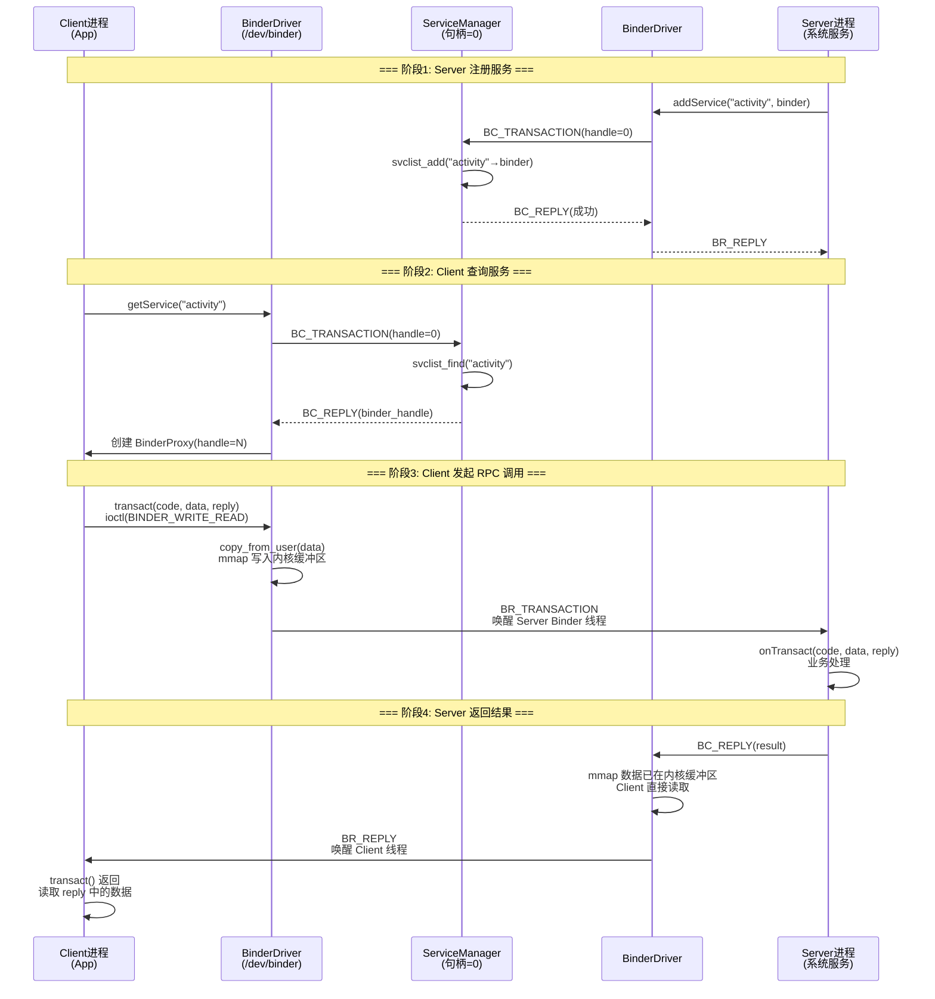

# Binder 机制 —— 面试学习完整指南

> **六层递进体系**：面试问题 → 标准答案 → 核心原理 → 流程图 → 源码分析 → 实战场景
> 适用岗位：高级/资深 Android 工程师、Framework 开发工程师、系统底层开发工程师

---

## 目录

1. [常见面试问题（7+题）](#1-常见面试问题)
2. [标准答案与要点解析](#2-标准答案与要点解析)
3. [核心原理深度讲解](#3-核心原理深度讲解)
4. [原理流程图（Mermaid.js + HTML）](#4-原理流程图)
5. [核心源码分析](#5-核心源码分析)
6. [应用场景举例](#6-应用场景举例)

---

## 1. 常见面试问题

### Q1: Binder 为什么只需要一次拷贝？mmap 是如何实现"零拷贝"的？
### Q2: 画出 Binder 的 C/S 架构图，说明 Client / Server / ServiceManager / BinderDriver 四个角色的职责和交互流程？
### Q3: AIDL 自动生成的 Stub 和 Proxy 类中，`onTransact()` 和 `transact()` 分别做了哪些事情？完整调用链路是什么样的？
### Q4: Binder 线程池默认多少个线程？如何理解 Binder 的同步调用和异步 oneway 调用？线程安全问题如何处理？
### Q5: 匿名 Binder 和实名 Binder 有什么区别？分别适用于什么场景？
### Q6（进阶）: DeathRecipient 死亡代理机制的原理是什么？如何监听 Binder 服务端的意外死亡？
### Q7（进阶）: Binder vs Socket / 共享内存 / 管道，各自的优缺点和适用场景是什么？为什么 Android 选择 Binder 作为主要 IPC 机制？

---

## 2. 标准答案与要点解析

### Q1: Binder 为什么只需要一次拷贝？

**核心答案**：Binder 借助 Linux 的 `mmap` 系统调用，在内核空间开辟一块缓冲区，同时将这块内核缓冲区映射到**接收方进程的用户空间**。发送方进程通过 `copy_from_user()` 将数据拷贝到内核缓冲区后，接收方进程可以直接通过 mmap 映射地址读取，从而实现"一次拷贝"。

**传统 IPC 的两次拷贝问题**：

```
传统 IPC（如 Socket/Pipe）:
发送方用户空间 → 内核缓冲区（copy_from_user, 第1次）
内核缓冲区 → 接收方用户空间（copy_to_user, 第2次）
总计：2 次拷贝

Binder IPC:
发送方用户空间 → 内核缓冲区（copy_from_user, 唯一1次）
接收方用户空间 ← 内核缓冲区（mmap 映射，直接读取，无需拷贝）
总计：1 次拷贝
```

**面试加分点**：
- 严格来说 Binder 不是"零拷贝"（Zero Copy），而是"单次拷贝"——发送方数据仍然需要 copy_from_user
- mmap 的映射关系在进程打开 Binder 驱动时就已经建立好了，接收方读取时相当于从自己的用户空间直接读取
- Linux 内核 5.x+ 引入的 `binderfs` 进一步优化了 Binder 节点的管理

---

### Q2: Binder 的 C/S 架构四角色

| 角色 | 职责 | 典型实现 |
|------|------|---------|
| **Client** | 发起 RPC 调用，通过 Proxy 调用远程方法 | `ActivityManager.getRunningAppProcesses()` 的调用方 |
| **Server** | 实现具体业务逻辑，通过 Stub 响应请求 | `ActivityManagerService`（系统服务） |
| **ServiceManager** | Binder 服务的"DNS"——负责服务注册与查询 | `servicemanager` 守护进程（init 进程 fork），句柄固定为 0 |
| **BinderDriver** | 内核驱动，负责数据传递、线程管理、引用计数 | `/dev/binder`（或 `/dev/binderfs`）字符设备 |

**交互流程**：

1. **Server 注册**：Server 通过 ServiceManager（句柄0）的 `addService` 注册自己，SM 维护"服务名 → Binder 句柄"的映射表
2. **Client 查询**：Client 通过 ServiceManager 的 `getService` 查询目标服务，获得 Binder 句柄（BinderProxy 对象）
3. **Client 调用**：Client 拿到 BinderProxy 后，调用其 `transact()` 方法发起 RPC
4. **BinderDriver 处理**：驱动根据句柄找到目标 Server，唤醒 Server 的 Binder 线程处理请求
5. **Server 响应**：Server 在 `onTransact()` 中处理，通过 `BC_REPLY` 返回结果给 Client

---

### Q3: AIDL 自动生成的 Stub/Proxy 代码解读

**AIDL 生成的代码结构**：

```
IMyService.aidl
    └── IMyService.java（自动生成）
          ├── Stub（抽象类，Server 端继承并实现业务方法）
          │     ├── asInterface(IBinder) → 区分进程内/跨进程，返回 Stub 自身或 Proxy
          │     ├── onTransact(code, data, reply, flags) → 解析 code 并分发到业务方法
          │     └── Proxy（静态内部类，Client 端持有）
          │           └── transact(code, data, reply, flags) → 发起 Binder 调用
          └── 业务方法（如 getValue、setValue）
```

**onTransact() 的工作流程**（Server 端）：

```java
@Override
public boolean onTransact(int code, Parcel data, Parcel reply, int flags) {
    switch (code) {
        case TRANSACTION_getValue:
            data.enforceInterface(DESCRIPTOR);  // 校验接口签名
            int _result = this.getValue();       // 调用真实的业务方法
            reply.writeNoException();
            reply.writeInt(_result);             // 写入返回结果
            return true;
        case TRANSACTION_setValue:
            data.enforceInterface(DESCRIPTOR);
            int _value = data.readInt();          // 读取参数
            this.setValue(_value);
            reply.writeNoException();
            return true;
        default:
            return super.onTransact(code, data, reply, flags);
    }
}
```

**transact() 的工作流程**（Client 端）：

```java
// Proxy 中的 transact() 最终调用
mRemote.transact(Stub.TRANSACTION_getValue, _data, _reply, 0);
//               ↓
// BinderProxy.transact() → native → ioctl(BINDER_WRITE_READ) → Binder 驱动
```

**完整调用链路**：
```
Client 进程                      Binder 驱动                     Server 进程
Proxy.getValue()
  → transact()                   BC_TRANSACTION                onTransact()
    → BinderProxy.transact()       → 找到目标 Server              → getValue()（业务方法）
      → ioctl(BINDER_WRITE_READ)   → 唤醒 Server Binder 线程      → reply.writeInt()
                                     ← BR_REPLY              ← BC_REPLY
```

---

### Q4: Binder 线程池与线程安全

**线程池默认大小**：

| 配置项 | 默认值 | 说明 |
|--------|-------|------|
| 最大 Binder 线程数 | **16**（或15+1主线程） | `ProcessState::setThreadPoolMaxThreadCount()` 可修改 |
| 核心线程数 | **1** | 启动时自动创建 |
| 线程命名 | `Binder:<pid>_<n>` | n 从 1 到 15 |

**同步调用（TF_SYNC） vs 异步调用（TF_ONE_WAY）**：

| 特性 | 同步调用（默认） | 异步调用（oneway） |
|------|----------------|-------------------|
| 标记 | flags=0（或 TF_ACCEPT_FDS） | flags=TF_ONE_WAY（0x01） |
| Client 行为 | 阻塞等待 Server 返回结果 | 立即返回，不等待 |
| reply 参数 | 有效，包含返回数据 | 必须为 null |
| 线程调度 | 驱动确保 Client 线程挂起等待 | 驱动不等待，Fire-and-Forget |
| 异常处理 | 调用失败会收到 RemoteException | 调用失败无法感知 |
| 典型场景 | `getService`、查询操作 | 通知事件、广播、死亡回调 |

**线程安全面试要点**：
- Binder 驱动保证**多个并发请求会分配到不同的线程**处理，Server 端的 `onTransact()` 可能被多线程并发调用
- **需要自己保证线程安全**：AIDL 生成的 Stub 不会加锁，业务逻辑中的数据竞争需要自行处理（如 synchronized、ReentrantLock、ConcurrentHashMap）
- 同一个 Client 线程发起的同步调用，驱动会保证**顺序返回**（Binder 协议中的 `binder_transaction` 排序机制）
- 如果所有 Binder 线程都在忙碌，新的请求会在驱动层排队等待

---

### Q5: 匿名 Binder vs 实名 Binder

| 特性 | 实名 Binder（Named Binder） | 匿名 Binder（Anonymous Binder） |
|------|--------------------------|-------------------------------|
| 注册方式 | 通过 ServiceManager 注册（有名字） | 不注册，通过已建立的 Binder 连接传递 |
| 发现机制 | `ServiceManager.getService("name")` | 只能通过其他 Binder 接口返回 |
| 生命周期 | 由 ServiceManager 管理引用 | 由持有它的 Binder 对象管理引用 |
| 典型场景 | 系统服务（AMS、WMS、PMS） | Activity 的 Token、跨进程回调接口 |
| Binder 节点 | 驱动层有全局唯一名称 | 驱动层只有句柄，无名称 |
| 安全控制 | ServiceManager 可做权限校验 | 由传递者自行控制 |

**面试加分点**：
- Activity 与 AMS 之间的 `ApplicationThread` 是典型的匿名 Binder——AMS 没有向 ServiceManager 注册 `ApplicationThread`，而是通过 `attachApplication()` 方法将 Binder 对象传递给 AMS
- 匿名 Binder 是 Android 安全模型的核心：普通 App 无法直接发现已建立的匿名 Binder 连接，防止第三方进程劫持通信通道
- 匿名 Binder 的引用计数完全依赖驱动层的强弱引用机制

---

### Q6: DeathRecipient 死亡代理机制

**原理**：

DeathRecipient（死亡接收）是 Binder 提供的一种**对端进程死亡通知机制**。Client 可以通过 `linkToDeath()` 注册一个 `DeathRecipient`，当 Server 进程意外死亡时，Binder 驱动会向 Client 发送 `BR_DEAD_BINDER` 指令，触发 `DeathRecipient.binderDied()` 回调。

```java
// Client 端注册死亡监听
IBinder.DeathRecipient deathRecipient = new IBinder.DeathRecipient() {
    @Override
    public void binderDied() {
        // Server 进程已死亡，执行清理和重连逻辑
        Log.w(TAG, "Server died, try to rebind...");
        // 移除旧的死亡监听
        binder.unlinkToDeath(this, 0);
        // 重新绑定服务
        bindService(intent, serviceConnection, Context.BIND_AUTO_CREATE);
    }
};
binder.linkToDeath(deathRecipient, 0);
```

**底层流程**：
```
1. Client 调用 binder.linkToDeath(recipient, flags)
2. Binder 驱动收到 BC_REQUEST_DEATH_NOTIFICATION
3. 驱动在内核层为 Binder 节点注册死亡通知
4. Server 进程崩溃 / 被杀 → 驱动感知到进程退出
5. 驱动发送 BR_DEAD_BINDER 给所有注册了死亡通知的 Client
6. Client 的 Binder 线程收到后回调 DeathRecipient.binderDied()
```

**关键注意点**：
- `binderDied()` 回调是在 **Binder 线程池** 中执行的，不是主线程，需要自行切线程更新 UI
- `linkToDeath()` 和 `unlinkToDeath()` 必须成对调用，否则可能导致 Binder 代理对象无法被 GC 回收（内存泄漏）
- 如果 Server 是正常 unbind（非意外死亡），不会触发 `binderDied()`

---

### Q7: Binder vs Socket vs 共享内存 vs 管道 对比

| 维度 | Binder | Socket | 共享内存(ashmem) | 管道(Pipe) |
|------|--------|--------|-----------------|-----------|
| **数据拷贝次数** | **1次** | 2次 | 0次（但需同步机制） | 2次 |
| **C/S 架构支持** | ✅ 原生支持 | ✅ 支持 | ❌ 需自行实现 | ❌ 单向 |
| **安全性（UID/PID）** | ✅ 驱动层自带身份校验 | ✅ 可通过 SO_PEERCRED | ❌ 无 | ❌ 无 |
| **引用计数/生命周期** | ✅ 驱动管理强弱引用 | ❌ 无 | ❌ 无 | ❌ 无 |
| **并发请求管理** | ✅ 驱动层线程池调度 | ❌ 需自行管理 | ❌ 需自行管理 | ❌ 需自行管理 |
| **传输数据量** | 中等（≤1MB/次） | 灵活 | **大**（适合大数据） | 小（4KB/PIPE_BUF） |
| **死亡通知** | ✅ 原生 DeathRecipient | ❌ 需心跳检测 | ❌ 无 | ❌ 无 |
| **性能** | 高（单次拷贝+线程池） | 中 | 最高（无拷贝） | 低 |
| **典型用途** | 系统服务IPC、AIDL | RILD、Zygote | 大Buffer共享、SurfaceFlinger | 进程间简单通信 |

**为什么 Android 选择 Binder 作为主要 IPC 机制**：

1. **安全性**：Binder 驱动天然支持 `getpid()`/`getuid()` 校验调用方身份，这是 Socket 不具备的
2. **高性能**：mmap 实现单次拷贝，线程池管理并发调用
3. **面向对象**：Binder 是"远程对象引用"的思想，API 设计非常 Java-friendly（IBinder 接口）
4. **生命周期管理**：引用计数机制自动管理 Binder 对象的生命周期
5. **同步语义**：天然支持同步调用（RPC 风格），开发者感知不到底层 IPC

---

## 3. 核心原理深度讲解

### 3.1 mmap 实现"一次拷贝"的内存布局

```
 ┌─────────────────────────────────────────────────────┐
 │                  物理内存                              │
 │  ┌───────────────────────────────────────────────┐   │
 │  │          Binder 内核缓冲区（mmap 区域）          │   │
 │  │  ┌─────┬────────────────────────────────────┐  │   │
 │  │  │ ... │  Binder 事务数据（binder_transaction_data） │
 │  │  └─────┴────────────────────────────────────┘  │   │
 │  └───────┬───────────────────┬───────────────────┘   │
 │          │ 页面映射           │ 页面映射               │
 │          ▼                   ▼                        │
 │  ┌──────────────┐    ┌──────────────┐                │
 │  │ 进程A（发送方）│    │ 进程B（接收方）│                │
 │  │ copy_from_user│    │ 直接读取      │                │
 │  │    ↓         │    │ mmap 映射区   │                │
 │  │ 用户缓冲区    │    │ 直接可访问    │                │
 │  └──────────────┘    └──────────────┘                │
 └─────────────────────────────────────────────────────┘
```

**关键步骤**：

1. **mmap 初始化**：进程打开 `/dev/binder` 时，Binder 驱动调用 `mmap` 在内核空间分配一块缓冲区（默认 ~1MB），并将这些内核页面映射到进程的用户地址空间
2. **发送方写入**：Client 调用 `transact()` → `ioctl(BINDER_WRITE_READ)` → 驱动执行 `copy_from_user()` 将发送方用户空间数据拷贝到内核缓冲区（唯一一次拷贝）
3. **接收方读取**：Server 的 Binder 线程被唤醒后，直接从 mmap 映射的用户空间地址读取数据——因为内核缓冲区页已经在接收方进程的页表中建立了映射，CPU 可以直接访问

**为什么不能做到真正的零拷贝**：
- 发送方用户空间和内核空间是不同的虚拟地址空间，必须通过 `copy_from_user` 跨越边界
- 内核无法信任用户空间的指针（安全考虑），必须拷贝到内核缓冲区进行校验后再传递给接收方
- 真正零拷贝需要像 ashmem 那样双方共享同一块物理内存，但这样就没有安全性保证了

---

### 3.2 Binder 协议命令码

Binder 驱动和用户空间通过 `ioctl(BINDER_WRITE_READ, &bwr)` 交互，`bwr` 包含一系列命令（Command）：

**BC_ 系列（Binder Command：用户空间 → 驱动）**：

| 命令 | 值 | 说明 | 发起方 |
|------|---|------|-------|
| `BC_TRANSACTION` | 0x40406300 | 发起同步 Binder 事务 | Client |
| `BC_TRANSACTION_SG` | 0x40406306 | 发起 scatter-gather 事务 | Client |
| `BC_REPLY` | 0x40406301 | 回复事务结果 | Server |
| `BC_ACQUIRE` | 0x40406302 | 增加强引用计数 | Client |
| `BC_RELEASE` | 0x40406303 | 减少强引用计数 | Client |
| `BC_INCREFS` | 0x40406304 | 增加弱引用计数 | Client |
| `BC_DECREFS` | 0x40406305 | 减少弱引用计数 | Client |
| `BC_REQUEST_DEATH_NOTIFICATION` | 0x40406308 | 注册死亡通知 | Client |
| `BC_CLEAR_DEATH_NOTIFICATION` | 0x40406309 | 取消死亡通知 | Client |
| `BC_ENTER_LOOPER` | 0x4040630b | 线程注册为 Binder 线程 | Server 线程 |
| `BC_REGISTER_LOOPER` | 0x4040630a | 线程注册到线程池 | Server 线程 |
| `BC_EXIT_LOOPER` | 0x4040630c | 线程退出线程池 | Server 线程 |

**BR_ 系列（Binder Return：驱动 → 用户空间）**：

| 命令 | 值 | 说明 | 接收方 |
|------|---|------|-------|
| `BR_TRANSACTION` | 0x72046300 | 收到事务请求，触发 `onTransact()` | Server |
| `BR_REPLY` | 0x72046301 | 收到事务回复 | Client |
| `BR_DEAD_BINDER` | 0x72046305 | Binder 对端已死亡 | Client |
| `BR_SPAWN_LOOPER` | 0x72046307 | 驱动要求创建新的 Binder 线程 | Server |
| `BR_NOOP` | 0x7204630c | 空操作，用于探测 | - |

**一次完整调用的命令序列**：

```
Client                                Driver                              Server
BC_TRANSACTION(handle=N, code=M)  →   [找到目标进程]                   
                                   →   BR_TRANSACTION                  →   onTransact(code=M)
                                   ←   BC_REPLY                        ←   [业务处理完成]
BR_REPLY                           ←   [唤醒 Client 线程]
```

---

### 3.3 同步调用 vs 异步调用（oneway）

**同步调用流程**（默认，`flags=0`）：

```c
// 用户空间
status_t result = proxy->transact(code, data, &reply, 0);
// transact 内部调用 ioctl(BINDER_WRITE_READ)，参数中包含 TF_ROOT_OBJECT
// Client 线程进入等待队列（TASK_INTERRUPTIBLE），直到 BR_REPLY 返回
// reply 参数不为 NULL，包含 Server 返回的数据
```

**异步调用流程**（`flags=IBinder.FLAG_ONEWAY`）：

```c
// 用户空间
status_t result = proxy->transact(code, data, NULL, IBinder.FLAG_ONEWAY);
// transact 内部调用 ioctl(BINDER_WRITE_READ)，flags 中包含 TF_ONE_WAY
// Client 线程立即返回，不等待 Server 处理结果
// reply 参数必须为 NULL，否则报错
```

**驱动层的 oneway 处理**：

```c
// kernel/drivers/android/binder.c
static void binder_transaction(...) {
    ...
    if (t->flags & TF_ONE_WAY) {
        // 不设置 reply 相关的 todo 队列
        // 事务加入目标进程/线程的 todo 队列后立即返回
        // 不需要等待 BR_REPLY
        binder_enqueue_work_ilocked(t->work, &target_list);
    } else {
        // 同步调用：需要将当前线程加入等待队列
        // 同时修改 t->work 类型为 BINDER_WORK_TRANSACTION
        binder_enqueue_work_ilocked(t->work, &target_list);
        // Client 线程睡眠在此，等待 BR_REPLY
        binder_wait_for_work(thread, ...);
    }
    ...
}
```

---

### 3.4 ServiceManager 的 addService/getService 流程

ServiceManager 是 Binder 体系中的"命名服务"，句柄固定为 **0**。

#### addService 流程

```
1. Server 进程创建 Binder 对象（如 AMS）
2. 调用 ServiceManagerProxy.addService("activity", binder)
3. 通过驱动发送 BC_TRANSACTION（目标句柄=0, code=ADD_SERVICE_TRANSACTION）
4. SM 收到 BR_TRANSACTION，解析出服务名和 Binder 句柄
5. SM 将 "activity" → binder_node 的映射写入内部 svclist 链表
6. SM 回复 BC_REPLY（成功 / 失败）
```

#### getService 流程

```
1. Client 调用 ServiceManagerProxy.getService("activity")
2. 通过驱动发送 BC_TRANSACTION（目标句柄=0, code=CHECK_SERVICE_TRANSACTION）
3. SM 收到 BR_TRANSACTION，在 svclist 中查找 "activity"
4. 找到后，SM 调用 flatten_binder() 将 Binder 引用写入 reply
5. 驱动在 Client 进程创建 BINDER_TYPE_HANDLE 类型的引用（BinderProxy）
6. Client 收到 BR_REPLY，Parcel 中读取出 BinderProxy 对象
7. Client 后续通过此 BinderProxy 与真正的 Server 通信
```

**ServiceManager 的特殊性**：
- ServiceManager 本身也是一个 Binder Server，句柄固定为 0
- SM 由 `init` 进程 fork 并启动（`/system/bin/servicemanager`）
- SM 的 `do_add_service()` 会检查调用方 UID，只有 root 和 system 进程能注册系统服务
- SM 维护一个 `struct svcinfo` 的单链表，每个节点包含服务名和 Binder 句柄

---

### 3.5 Binder 引用计数与强弱引用机制

Binder 驱动使用**强弱引用计数**来管理 Binder 实体的生命周期，这是 Android IPC 内存管理中最精巧的设计之一。

**两种引用**：

| 引用类型 | 命令 | 含义 | 作用 |
|---------|------|------|------|
| **强引用（Strong Reference）** | `BC_ACQUIRE` / `BC_RELEASE` | 表示对 Binder 实体的"持有" | 强引用计数归零 → 可安全释放 |
| **弱引用（Weak Reference）** | `BC_INCREFS` / `BC_DECREFS` | 表示对 Binder 实体的"观察" | 弱引用不影响生命周期 |

**Java 层的对应**：

```java
// Binder.java
private WeakReference<Object> mObject;   // 弱引用：指向原始 Binder 对象
// Binder 的 finalize() 方法：
// 当 Java 对象被 GC 时，调用 native bcDecStrongRef() → 驱动层 BC_RELEASE
// 如果强引用计数归零且弱引用计数也归零 → Binder 实体被真正销毁
```

**引用计数规则**：

```
1. 初始状态：Server 创建 Binder 实体 → 强引用=1，弱引用=0
2. Client 获得引用：驱动为每个引用（BinderProxy）增加强引用计数
3. Client 释放引用：BinderProxy 被 GC 或 close() → 驱动减少强引用计数
4. 强引用归零、弱引用仍存在：Binder 实体存在但"不可用"（zombie 状态）
5. 弱引用也归零：Binder 实体彻底销毁，释放内核资源
```

**为什么需要强弱引用分离**：
- 防止循环引用导致内存泄漏
- DeathRecipient 使用弱引用：Server 死亡后，Client 的弱引用可以安全清理
- `linkToDeath` 使用弱引用计数：不影响 Binder 实体本身的生死，但能感知生死状态
- 类似 JNI 中的 `NewGlobalRef`（强）vs `NewWeakGlobalRef`（弱）

---

## 4. 原理流程图

### 4.1 Binder 通信完整链路（Mermaid.js）



### 4.2 AIDL 自动生成的 Stub/Proxy 类图

```mermaid
classDiagram
    class IBinder {
        <<interface>>
        +transact(code, data, reply, flags) boolean
        +linkToDeath(recipient, flags)
        +unlinkToDeath(recipient, flags)
    }

    class Binder {
        +onTransact(code, data, reply, flags) boolean
        +transact(code, data, reply, flags) boolean
        +attachInterface(owner, descriptor)
    }

    class BinderProxy {
        +transact(code, data, reply, flags) boolean
        +linkToDeath(recipient, flags)
        -mNativeData: long
    }

    class IMyService {
        <<interface>>
        +getValue() int
        +setValue(value int)
    }

    class Stub {
        +asInterface(obj IBinder) IMyService
        +onTransact(code, data, reply, flags) boolean
        +getValue() int*
        +setValue(value int)*
        -DESCRIPTOR: String
    }

    class Proxy {
        -mRemote: IBinder
        +getValue() int
        +setValue(value int)
    }

    class ServerImpl {
        +getValue() int
        +setValue(value int)
    }

    IBinder <|.. Binder
    IBinder <|.. BinderProxy
    Binder <|-- Stub
    IMyService <|.. Stub
    IMyService <|.. Proxy
    Stub +-- Proxy : 内部类
    Stub <|-- ServerImpl : extends
    Proxy o-- IBinder : mRemote (BinderProxy)
```

### 4.3 Binder 内存映射模型（HTML 可视化）

<div style="border:2px solid #4CAF50; border-radius:8px; padding:16px; background:#f1f8e9; font-family:monospace; line-height:1.8; margin:16px 0;">

<pre style="margin:0; white-space:pre;">
┌──────────────────────────────────────────────────────────────┐
│                    <b>物理内存 (Physical RAM)</b>                   │
│  ┌────────────────────────────────────────────────────────┐  │
│  │              <b>Binder 内核缓冲区 (mmap 区域)</b>              │  │
│  │  ┌──────────────────────────────────────────────────┐  │  │
│  │  │  <span style="color:#e65100;">binder_transaction_data {</span>                          │  │  │
│  │  │    <span style="color:#0d47a1;">target_handle:</span> 目标 Binder 句柄              │  │  │
│  │  │    <span style="color:#0d47a1;">code:</span> 方法标识（TRANSACTION_xxx）         │  │  │
│  │  │    <span style="color:#0d47a1;">flags:</span> TF_ONE_WAY / TF_ACCEPT_FDS        │  │  │
│  │  │    <span style="color:#0d47a1;">data.ptr.buffer:</span> 指向 Parcel 数据的指针      │  │  │
│  │  │    <span style="color:#0d47a1;">data_size:</span> 数据大小                        │  │  │
│  │  │  <span style="color:#e65100;">}</span>                                            │  │  │
│  │  └──────────────────────────────────────────────────┘  │  │
│  │     ▲ 共享同一块物理内存                                    │  │
│  └─────┼──────────────────────────┼──────────────────────────┘  │
│        │ <b>页表映射</b>                │ <b>页表映射</b>                    │
│  ┌─────┴──────────────┐    ┌──────┴──────────────┐             │
│  │ <b>进程 A (Client)</b>  │    │ <b>进程 B (Server)</b>  │             │
│  │ 用户虚拟地址空间     │    │ 用户虚拟地址空间     │             │
│  │                    │    │                    │             │
│  │ copy_from_user()   │    │ <b>直接读取 ✅</b>      │             │
│  │      │             │    │ (无需 copy_to_user) │             │
│  │      ▼             │    │      ▲             │             │
│  │  ┌──────────┐      │    │  ┌──────────┐      │             │
│  │  │ Parcel   │──────┼────┼──│ Parcel   │      │             │
│  │  │ (用户态)  │      │    │  │ (可直接读) │      │             │
│  │  └──────────┘      │    │  └──────────┘      │             │
│  └────────────────────┘    └────────────────────┘             │
│                                                                 │
│  <b>数据流方向</b>: Client Parcel → [copy_from_user ×1] → 内核缓冲区  │
│                Server 通过 mmap 直接读取内核缓冲区（<span style="color:#c62828;">0次额外拷贝</span>）│
└──────────────────────────────────────────────────────────────┘
</pre>

</div>

---

## 5. 核心源码分析

### 5.1 Binder.java 的 transact() 和 onTransact()

**文件路径**：`frameworks/base/core/java/android/os/Binder.java`

#### transact() —— Client 端发起调用

```java
// Binder.java (line ~545)
public final boolean transact(int code, @NonNull Parcel data, @Nullable Parcel reply,
        int flags) throws RemoteException {
    // 1. 检查 data 是否有效
    if (data != null) {
        data.setDataPosition(0);
    }
    // 2. 调用 native 方法，进入驱动层
    boolean r = onTransact(code, data, reply, flags);
    // 3. 对于 Binder 自身（Server端），onTransact 是虚方法调用
    // 对于 BinderProxy（Client端），重定向到驱动的 ioctl
    if (r && reply != null) {
        reply.setDataPosition(0);
    }
    return r;
}
```

**BinderProxy 中的 transact()**（关键区别）：

```java
// BinderProxy.java
public boolean transact(int code, Parcel data, Parcel reply, int flags) 
        throws RemoteException {
    // 使用 Parcel 中的死对象检测
    Binder.checkParcel(this, code, data, "Unreasonably large binder buffer");
    // 核心：此方法调用 native transactNative() → ioctl(BINDER_WRITE_READ)
    return transactNative(code, data, reply, flags);
}
```

#### onTransact() —— Server 端响应调用

```java
// Binder.java (line ~600)
protected boolean onTransact(int code, @NonNull Parcel data, @Nullable Parcel reply,
        int flags) throws RemoteException {
    // 系统保留 code：处理一些通用命令
    if (code == INTERFACE_TRANSACTION) {
        reply.writeString(getInterfaceDescriptor());
        return true;
    } else if (code == DUMP_TRANSACTION) {
        // 处理 dumpsys 命令
        ...
    } else if (code == SHELL_COMMAND_TRANSACTION) {
        // 处理 adb shell 命令
        ...
    }
    return false;  // 子类（AIDL Stub）覆盖此方法处理具体业务
}
```

**调用链总结**：

```
Client (BinderProxy)                Server (Binder)
proxy.transact(code, data, reply, 0)
  ↓
transactNative() [JNI]
  ↓
ioctl(BINDER_WRITE_READ)           binder_loop() [驱动]
  ↓                                    ↓
[驱动层处理]                        BR_TRANSACTION
  ↓                                    ↓
[写入内核缓冲区]                    IPCThreadState::executeCommand()
  ↓                                    ↓
[唤醒Server线程]                    BBinder::transact()
  ↓                                    ↓
[mmap映射读取]                      JavaBBinder::onTransact()
                                       ↓
                                   Binder.java::onTransact()
                                       ↓
                                   Stub::onTransact() [AIDL生成]
                                       ↓
                                   ServerImpl::getValue() [业务方法]
```

---

### 5.2 Binder 驱动层 binder_transaction() 核心逻辑

**文件路径**：`kernel/drivers/android/binder.c`（Linux 主线）/ `drivers/staging/android/binder.c`（旧版）

```c
static void binder_transaction(struct binder_proc *proc,
                               struct binder_thread *thread,
                               struct binder_transaction_data *tr, int reply,
                               binder_size_t extra_buffers_size)
{
    struct binder_transaction *t;
    struct binder_work *tcomplete;
    binder_size_t buffer_size = 0;
    
    // 1. 查找目标 Binder 实体/引用
    if (reply) {
        // 这是回复：从当前线程的事务栈中获取原始事务
        in_reply_to = thread->transaction_stack;
        target_thread = binder_get_txn_from_and_acq_inner(in_reply_to);
        target_proc = target_thread->proc;
    } else {
        // 这是新事务：根据 handle 查找目标引用
        if (tr->target.handle) {
            // handle > 0: 通过进程的 refs 红黑树查找
            ref = binder_get_ref_olocked(proc, tr->target.handle, true);
            target_node = ref->node;  // 找到 Binder 实体节点
        } else {
            // handle == 0: 目标就是 ServiceManager
            target_node = binder_context_mgr_node;
        }
        target_proc = target_node->proc;  // 获取目标进程
    }
    
    // 2. 分配内核缓冲区，拷贝用户空间数据（**唯一的一次拷贝**）
    t->buffer = binder_alloc_new_buf(&target_proc->alloc, buffer_size, ...);
    if (copy_from_user(t->buffer->data, 
                       (const void __user *)(uintptr_t)tr->data.ptr.buffer,
                       tr->data_size)) {
        // 拷贝失败，释放缓冲区
        goto err_copy_data_failed;
    }
    
    // 3. 处理 Binder 对象偏移（flat_binder_object）
    off_end = (void *)off_start + tr->offsets_size;
    for (; offp < off_end; offp++) {
        struct flat_binder_object *fp;
        fp = (struct flat_binder_object *)(t->buffer->data + *offp);
        switch (fp->hdr.type) {
        case BINDER_TYPE_BINDER:  // 传输 Binder 实体
            // 在目标进程创建 binder_node
            break;
        case BINDER_TYPE_HANDLE:  // 传输 Binder 引用
            // 在目标进程创建/查找 binder_ref
            break;
        case BINDER_TYPE_FD:      // 传输文件描述符
            // 在目标进程复制 fd
            break;
        }
    }
    
    // 4. 处理 oneway 还是同步
    if (tr->flags & TF_ONE_WAY) {
        // 异步调用：不等待回复，事务加入目标 todo 队列后直接返回
        binder_enqueue_work_ilocked(t->work, &target_list);
    } else {
        // 同步调用：当前线程需要等待回复
        tcomplete->type = BINDER_WORK_TRANSACTION_COMPLETE;
        binder_enqueue_work_ilocked(tcomplete, &thread->todo);
        binder_enqueue_work_ilocked(t->work, &target_list);
        // 驱动使当前线程睡眠，直到收到 BR_REPLY
        binder_wait_for_work(thread, !!(t->flags & TF_ONE_WAY));
    }
}
```

**面试关键点**：
- `binder_get_ref_olocked()` 通过**红黑树**查找目标引用，时间复杂度 O(log n)
- `binder_alloc_new_buf()` 从目标进程的 mmap 区域分配缓冲区，避免了跨进程的缓冲区拷贝
- `flat_binder_object` 是 Binder 对象传输的核心数据结构，支持 BINDER_TYPE_BINDER/HANDLE/FD 三种类型
- `binder_wait_for_work()` 使线程进入 `TASK_INTERRUPTIBLE` 状态，CPU 不使用忙等

---

### 5.3 ServiceManagerProxy 的 addService 和 getService

**文件路径**：`frameworks/native/libs/binder/IServiceManager.cpp`（Native 层）

```cpp
// IServiceManager.cpp - addService 实现
virtual status_t addService(const String16& name, const sp<IBinder>& service,
                            bool allowIsolated, int dumpsysPriority)
{
    Parcel data, reply;
    data.writeInterfaceToken(IServiceManager::getInterfaceDescriptor());
    data.writeString16(name);         // 写入服务名
    data.writeStrongBinder(service);  // 写入 Binder 对象 (BINDER_TYPE_BINDER)
    data.writeInt32(allowIsolated ? 1 : 0);
    data.writeInt32(dumpsysPriority);
    
    // 通过 Binder 驱动发送事务给 ServiceManager（handle=0）
    status_t err = remote()->transact(ADD_SERVICE_TRANSACTION, data, &reply);
    return err == NO_ERROR ? reply.readExceptionCode() : err;
}

// IServiceManager.cpp - getService 实现
virtual sp<IBinder> getService(const String16& name) const
{
    unsigned n;
    for (n = 0; n < 5; n++) {  // 最多重试5次
        sp<IBinder> svc = checkService(name);
        if (svc != NULL) return svc;
        // 服务尚未就绪，等待 250ms 再重试
        usleep(250000);
    }
    return NULL;
}

virtual sp<IBinder> checkService(const String16& name) const
{
    Parcel data, reply;
    data.writeInterfaceToken(IServiceManager::getInterfaceDescriptor());
    data.writeString16(name);
    
    // 向 ServiceManager 发送查询请求
    status_t err = remote()->transact(CHECK_SERVICE_TRANSACTION, data, &reply);
    if (err != NO_ERROR || reply.readExceptionCode() != 0) return NULL;
    
    // 从 reply 中读取 Binder 引用 (BINDER_TYPE_HANDLE)
    sp<IBinder> binder = reply.readStrongBinder();
    return binder;
}
```

**ServiceManager 的 svclist 结构**（C++ 实现）：

```c
// servicemanager/service_manager.c
struct svcinfo {
    struct svcinfo *next;   // 单链表
    uint32_t handle;        // Binder 句柄
    struct binder_death death; // 死亡监听
    size_t len;
    uint16_t name[0];       // 服务名（柔性数组）
};

struct svcinfo *svclist = NULL;  // 全局链表头

// do_add_service: 向链表中添加服务
int do_add_service(struct binder_state *bs, const uint16_t *s, unsigned len,
                   uint32_t handle, unsigned uid, ...) {
    struct svcinfo *si;
    // 遍历链表检查是否已存在
    for (si = svclist; si; si = si->next) {
        if (!strcmp(si->name, s)) {
            // 已存在，更新句柄（覆盖旧服务）
            si->handle = handle;
            return 0;
        }
    }
    // 新服务：分配 svcinfo 并插入链表
    si = malloc(sizeof(*si) + (len + 1) * sizeof(uint16_t));
    si->handle = handle;
    si->len = len;
    memcpy(si->name, s, (len + 1) * sizeof(uint16_t));
    si->next = svclist;
    svclist = si;  // 头插法
    return 0;
}
```

---

## 6. 应用场景举例

### 6.1 AMS 通过 Binder 管理 Activity 生命周期

**场景描述**：当 App 启动一个 Activity 时，从 `startActivity()` 到最终 `onCreate()` 被调用，Binder 在中间扮演了核心通信角色。

**完整 IPC 调用链路**：

```
[App 进程]                            [system_server 进程]
Activity.startActivity()
  → Instrumentation.execStartActivity()
    → ActivityTaskManager.getService()    // 获取 ATMS 的 BinderProxy
      .startActivity(...)                 // 通过 Binder 调用 ATMS
                                          → ActivityTaskManagerService.startActivity()
                                            → 检查权限、创建 ActivityRecord
                                            → 如果 App 进程未启动
                                              → AMS.startProcessLocked()
                                                → Zygote fork 新进程
                                            → ApplicationThread.bindApplication()
                                              ← Binder 调用 App 进程的 ApplicationThread
    ← [返回 Binder 调用]                      
  → ActivityThread.handleBindApplication()
    → 创建 Application、初始化 ContentProvider
  
  → ActivityThread.handleLaunchActivity()
    → performLaunchActivity()
      → Instrumentation.newActivity()
      → Activity.onCreate() ✅
```

**关键 Binder 对象**：

| Binder 对象 | 进程 | 注册方式 | 作用 |
|-------------|------|---------|------|
| `ActivityTaskManagerService` (ATMS) | system_server | 实名（ServiceManager） | 管理 Activity 栈和任务 |
| `ActivityManagerService` (AMS) | system_server | 实名（ServiceManager） | 管理进程和组件 |
| `ApplicationThread` | App 进程 | 匿名（通过 attachApplication 传递） | 接收 system_server 的生命周期回调 |
| `IActivityClientController` | App 进程 | 匿名 | 处理 Activity 相关的 IPC 回调 |

**面试话术**：
> AMS（ActivityManagerService）运行在 system_server 进程中，是一个向 ServiceManager 注册的实名 Binder 服务。当 App 调用 `startActivity()` 时，通过 AMS 的 BinderProxy 发起跨进程调用。AMS 完成权限检查、栈管理后，通过 App 进程传递过来的匿名 Binder（ApplicationThread）反向调用 `scheduleLaunchActivity()`，最终在 App 主线程执行 `onCreate()`。整个过程中，Binder 的同步阻塞特性保证了生命周期回调的顺序性。

---

### 6.2 自定义 AIDL 实现多进程 Service 通信

**场景描述**：音乐播放 App 将播放器运行在独立进程（`android:process=":player"`），主进程通过 AIDL 控制播放。

**步骤 1：定义 AIDL 接口**

```java
// IPlayerService.aidl
package com.example.music;

import com.example.music.Song;

interface IPlayerService {
    void play(in Song song);
    void pause();
    void resume();
    void stop();
    boolean isPlaying();
    int getCurrentPosition();
    
    // 异步状态回调（匿名 Binder）
    void registerCallback(IPlayerCallback callback);
    void unregisterCallback(IPlayerCallback callback);
}

// IPlayerCallback.aidl
package com.example.music;

oneway interface IPlayerCallback {
    void onPlayStateChanged(int state);
    void onProgressUpdate(int position, int duration);
}
```

**步骤 2：Server 端实现（`:player` 进程）**

```java
public class PlayerService extends Service {
    private final IPlayerService.Stub mBinder = new IPlayerService.Stub() {
        private final RemoteCallbackList<IPlayerCallback> mCallbacks = 
            new RemoteCallbackList<>();
        
        @Override
        public void play(Song song) {
            // 线程安全：此方法在 Binder 线程池中执行
            synchronized (PlayerService.this) {
                mediaPlayer.reset();
                mediaPlayer.setDataSource(song.getUrl());
                mediaPlayer.prepareAsync();
            }
            // 通知所有注册的回调
            broadcastState(PLAY_STATE_PLAYING);
        }
        
        @Override
        public void registerCallback(IPlayerCallback callback) {
            mCallbacks.register(callback);  // RemoteCallbackList 线程安全
        }
        
        @Override
        public void unregisterCallback(IPlayerCallback callback) {
            mCallbacks.unregister(callback);
        }
        
        private void broadcastState(int state) {
            int n = mCallbacks.beginBroadcast();
            for (int i = 0; i < n; i++) {
                try {
                    mCallbacks.getBroadcastItem(i).onPlayStateChanged(state);
                } catch (RemoteException e) {
                    // 客户端已死亡，RemoteCallbackList 会自动清理
                }
            }
            mCallbacks.finishBroadcast();
        }
    };
    
    @Override
    public IBinder onBind(Intent intent) {
        return mBinder;  // 返回 Stub 对象
    }
}
```

**步骤 3：Client 端调用（主进程）**

```java
public class MainActivity extends AppCompatActivity {
    private IPlayerService mPlayerService;
    private boolean mBound = false;
    
    // 死亡监听
    private IBinder.DeathRecipient mDeathRecipient = new IBinder.DeathRecipient() {
        @Override
        public void binderDied() {
            mPlayerService.asBinder().unlinkToDeath(this, 0);
            mPlayerService = null;
            // 重新绑定服务
            bindPlayerService();
        }
    };
    
    private ServiceConnection mConnection = new ServiceConnection() {
        @Override
        public void onServiceConnected(ComponentName name, IBinder service) {
            mPlayerService = IPlayerService.Stub.asInterface(service);
            try {
                // 注册死亡监听
                service.linkToDeath(mDeathRecipient, 0);
                // 注册播放回调
                mPlayerService.registerCallback(mCallback);
            } catch (RemoteException e) {
                e.printStackTrace();
            }
            mBound = true;
        }
        
        @Override
        public void onServiceDisconnected(ComponentName name) {
            mBound = false;
            mPlayerService = null;
        }
    };
    
    // 播放回调（运行在 Binder 线程池，需要切到主线程）
    private IPlayerCallback.Stub mCallback = new IPlayerCallback.Stub() {
        @Override
        public void onPlayStateChanged(int state) {
            // 切换到主线程更新 UI
            runOnUiThread(() -> updatePlayButton(state));
        }
        
        @Override
        public void onProgressUpdate(int position, int duration) {
            runOnUiThread(() -> updateProgressBar(position, duration));
        }
    };
    
    private void playSong(Song song) {
        if (mBound && mPlayerService != null) {
            try {
                mPlayerService.play(song);
            } catch (RemoteException e) {
                // 处理 Binder 调用失败
                bindPlayerService();  // 尝试重连
            }
        }
    }
    
    @Override
    protected void onDestroy() {
        super.onDestroy();
        if (mBound) {
            try {
                mPlayerService.unregisterCallback(mCallback);
                mPlayerService.asBinder().unlinkToDeath(mDeathRecipient, 0);
            } catch (RemoteException e) {
                // ignore
            }
            unbindService(mConnection);
        }
    }
}
```

**Manifest 注册**：

```xml
<service
    android:name=".PlayerService"
    android:process=":player"
    android:exported="false">
    <intent-filter>
        <action android:name="com.example.music.PLAYER_SERVICE" />
    </intent-filter>
</service>
```

**关键设计要点**：

| 设计点 | 说明 | 面试加分 |
|--------|------|---------|
| `RemoteCallbackList` | 跨进程回调的专用容器，底层使用 Binder 的唯一性保证线程安全 | 必须用它替代普通 List，否则跨进程回调会出问题 |
| `linkToDeath` + `DeathRecipient` | 监听播放服务进程的意外死亡，实现自动重连 | 需成对调用 link/unlink，防止内存泄漏 |
| `oneway` 接口 | `IPlayerCallback` 使用 `oneway` 修饰，避免回调阻塞主进程 | 回调类接口默认应使用 oneway |
| 线程切换 | Binder 回调运行在 Binder 线程池，UI 更新必须切换到主线程 | `runOnUiThread()` / `Handler(Looper.getMainLooper())` |
| 同步锁 | `play()` 方法需要 synchronized 保护，因为可能被多线程并发调用 | Binder 线程池的线程安全是高频面试题 |

---

## 快速检查清单（面试自测）

- [ ] 能画出 Binder 的 mmap 内存模型，解释为什么只有一次拷贝
- [ ] 能口述 Binder 四角色（Client/Server/SM/Driver）的交互流程
- [ ] 能解释 AIDL 生成的 Stub.onTransact() 的 switch-case 分发逻辑
- [ ] 能说明 Binder 默认线程池 16 个线程，以及同步/oneway 的区别和线程安全问题
- [ ] 能举例说明实名 Binder（AMS）和匿名 Binder（ApplicationThread）的使用场景
- [ ] 能手写 DeathRecipient 的注册和清理代码，知道在哪个线程回调
- [ ] 能对比 Binder vs Socket vs 共享内存的优劣，说出 Android 选择 Binder 的五大理由
- [ ] 能写出 Binder 协议中的 BC_TRANSACTION / BR_TRANSACTION / BC_REPLY / BR_REPLY 命令含义
- [ ] 能解释强弱引用计数的设计目的，以及 Binder 实体何时被真正销毁
- [ ] 能说出 ServiceManager 的句柄固定为 0，以及 SM 自身如何启动和注册

---

> **推荐阅读**：
> - 《Android Binder 设计与实现》—— 杨立祥
> - AOSP 源码：`frameworks/native/libs/binder/` / `kernel/drivers/android/binder.c`
> - [Android Binder 机制详解 — Gityuan 博客](http://gityuan.com/2015/10/31/binder-prepare/)
> - [Binder 驱动源码分析 — CSDN](https://blog.csdn.net/universus/article/details/6211589)
