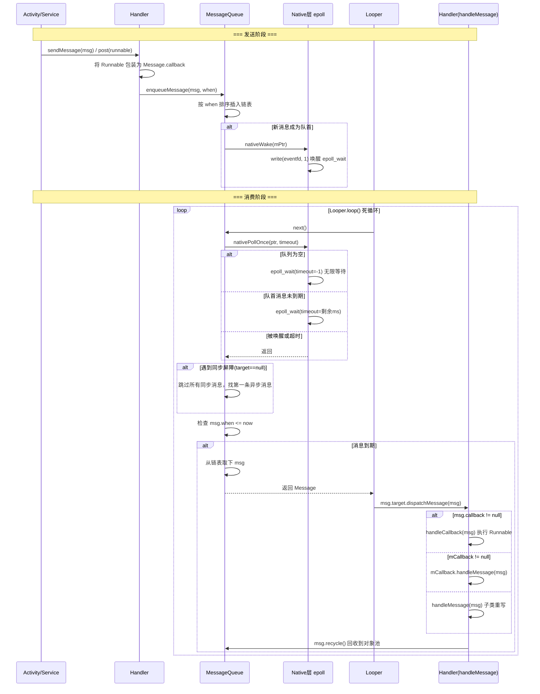
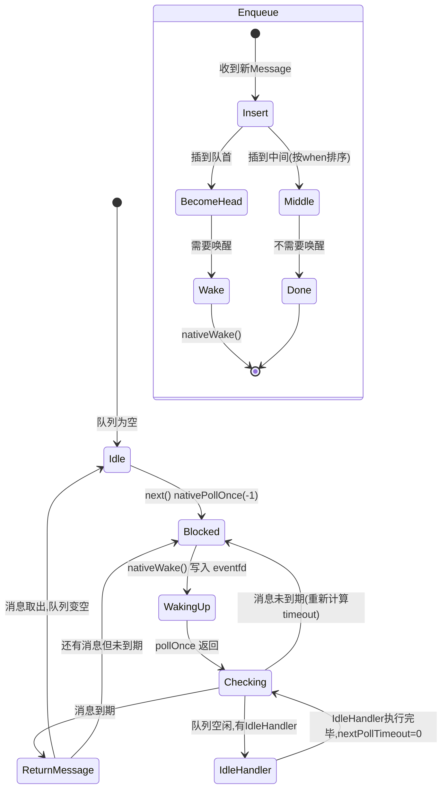

# Handler 消息机制 —— 面试学习完整指南

> **六层递进体系**：面试问题 → 标准答案 → 核心原理 → 流程图 → 源码分析 → 实战场景
> 适用岗位：高级/资深 Android 工程师、Framework 开发工程师

---

## 目录

1. [常见面试问题（8 题）](#1-常见面试问题)
2. [标准答案与要点解析](#2-标准答案与要点解析)
3. [核心原理深度讲解](#3-核心原理深度讲解)
4. [原理流程图（Mermaid.js）](#4-原理流程图)
5. [核心源码分析](#5-核心源码分析)
6. [应用场景举例](#6-应用场景举例)

---

## 1. 常见面试问题

### Q1: Handler / Looper / MessageQueue 三者的关系是什么？完整启动流程是怎样的？
### Q2: 消息的同步屏障（Sync Barrier）是什么？异步消息机制如何工作？
### Q3: IdleHandler 的触发时机是什么？有哪些典型应用场景？
### Q4: Handler 内存泄漏的完整引用链是什么？如何解决？（Message → Handler → Activity）
### Q5: Looper.loop() 是死循环，为什么不会阻塞主线程？epoll 机制是如何工作的？
### Q6: HandlerThread 的原理是什么？相比手动创建 Looper 线程有什么优势？
### Q7: postDelayed() 的定时精度问题有哪些？如何优化？
### Q8: 主线程 Looper 的 prepareMainLooper() 在什么时机被调用？为什么不能在子线程重复调用？

---

## 2. 标准答案与要点解析

### Q1: Handler / Looper / MessageQueue 三者关系与启动流程

**三者关系**：

```
Handler（消息处理器）
   ↓ 持有
Looper（消息循环器）
   ↓ 持有
MessageQueue（消息队列，底层是单向链表）
```

| 组件 | 职责 | 数量关系 |
|------|------|----------|
| **Handler** | 发送 Message 到 MessageQueue，并在目标线程处理回调 `handleMessage()` | 一个线程可以有多个 Handler |
| **Looper** | 无限循环从 MessageQueue 取消息，分发给对应 Handler | **一个线程只有一个 Looper**（ThreadLocal 保证） |
| **MessageQueue** | 按 `when` 时间戳排序的单向链表，管理消息入队/出队，通过 epoll 实现阻塞/唤醒 | 一个 Looper 持有一个 MessageQueue |

**启动流程**：

1. `Looper.prepare()` → 创建 Looper 实例，存入 ThreadLocal
2. Looper 构造方法中创建 `MessageQueue`（native 层创建 NativeMessageQueue + 事件 fd）
3. `Handler` 构造时通过 `Looper.myLooper()` 获取当前线程的 Looper，持有其 MessageQueue 引用
4. `Looper.loop()` → 开启死循环，调用 `MessageQueue.next()` 阻塞取消息
5. 通过 Handler 的 `sendMessage()` / `post()` 等方法将 Message 插入队列
6. `MessageQueue.next()` 被唤醒，返回 Message 给 Looper
7. Looper 调用 `msg.target.dispatchMessage(msg)` → 回调到 Handler

**面试加分点**：
- `ThreadLocal` 保证线程隔离：每个线程有独立的 Looper 实例
- `Handler` 构造时可以指定 Looper：`new Handler(looper)` 实现跨线程通信
- 主线程的 Looper 在 `ActivityThread.main()` 中通过 `Looper.prepareMainLooper()` 创建，开发者**不能**主动调用

---

### Q2: 同步屏障（Sync Barrier）与异步消息机制

**同步屏障的定义**：在 MessageQueue 中插入一个 `target == null` 的特殊 Message，使得队列在 `next()` 时**跳过所有同步消息**，优先处理异步消息。

**为什么需要同步屏障**：
- Android 的 View 绘制（`ViewRootImpl.scheduleTraversals()`）需要尽快执行以保证 60fps 流畅度
- 如果队列中有大量同步消息（如 `postDelayed` 的延迟任务），绘制消息会被阻塞导致掉帧
- 同步屏障让绘制消息以异步方式**越过**所有同步消息，优先执行

**工作流程**：

```
正常状态：
  [同步Msg] → [同步Msg] → [异步Msg] → [同步Msg]

插入同步屏障（target=null）后：
  [屏障Msg] → [同步Msg] → [同步Msg] → [异步Msg] ← 直接取出这个
                                     ↑ 前面的同步消息全部被跳过
```

**关键 API**：

| 方法 | 说明 | 可见性 |
|------|------|--------|
| `MessageQueue.postSyncBarrier()` | 插入屏障，返回 barrier token（int） | `@hide`，系统内部使用 |
| `MessageQueue.removeSyncBarrier(token)` | 移除屏障 | `@hide` |
| `Message.setAsynchronous(true)` | 将消息标记为异步消息 | 公开 API，但普通 App 慎用 |

**面试加分点**：
- 同步屏障是 **系统内部机制**，普通 App 开发者不应该直接使用（API 被 `@hide`）
- 每插入一个屏障**必须**对应一个 `removeSyncBarrier()`，否则队列永远无法处理同步消息，导致"卡死"
- `ViewRootImpl#scheduleTraversals()` 是同步屏障的核心使用者——先 `postSyncBarrier()`，再 post 异步绘制消息，绘制完成后 `removeSyncBarrier()`
- 过多的异步消息会导致同步消息饥饿（starvation）

---

### Q3: IdleHandler 触发时机与应用场景

**触发时机**：`MessageQueue.next()` 发现队列为空（没有可执行的 Message），或者队首消息的执行时间还没到（需要等待），此时**在进入 `nativePollOnce` 阻塞之前**，会遍历执行所有已注册的 IdleHandler。

```java
// MessageQueue.next() 核心逻辑（简化）
Message next() {
    for (;;) {
        nativePollOnce(ptr, nextPollTimeoutMillis);
        synchronized (this) {
            Message msg = mMessages;
            if (msg != null && msg.target == null) {
                // 遇到同步屏障，只找异步消息
                do { msg = msg.next; } while (msg != null && !msg.isAsynchronous());
            }
            if (msg != null) {
                if (now < msg.when) {
                    nextPollTimeoutMillis = (int) Math.min(msg.when - now, Integer.MAX_VALUE);
                } else {
                    // 取出消息返回
                    return msg;
                }
            } else {
                nextPollTimeoutMillis = -1; // 无限等待
            }
            // ★ 关键：pendingIdleHandlerCount 不为 0 时执行 IdleHandler
            if (pendingIdleHandlerCount <= 0) continue;
        }
        // 脱离同步锁后执行 IdleHandler（避免死锁）
        for (int i = 0; i < pendingIdleHandlerCount; i++) {
            keep = idler.queueIdle();
        }
    }
}
```

**典型应用场景**：

| 场景 | 具体用法 | 收益 |
|------|---------|------|
| **延迟非关键初始化** | 在 Activity 创建时注册 IdleHandler，待布局绘制完成后再初始化第三方 SDK、埋点等 | 加快首屏渲染速度（T0/TTI 优化） |
| **GC 触发** | 系统在空闲时触发 GC（`ActivityThread.scheduleGcIdler()`） | 避免在动画/滑动等关键帧时 GC 造成卡顿 |
| **泄漏检测** | LeakCanary 利用 IdleHandler 在空闲时检测 Activity 是否被正确回收 | 不干扰主线程正常逻辑 |
| **批量预处理** | 当多个消息处理完后统一做一次数据持久化/日志上报 | 减少 I/O 次数，提升性能 |

**注意事项**：
- IdleHandler 的 `queueIdle()` 返回 `true` 表示**保持注册**（下次空闲时继续执行），返回 `false` 表示**一次性执行后移除**
- 不要在 IdleHandler 中执行耗时操作，否则会阻塞后续消息处理
- `MessageQueue.addIdleHandler()` 是公开 API，但 `removeIdleHandler()` 在 API 28+ 才添加

---

### Q4: Handler 内存泄漏的完整引用链与解决方案

**完整引用链**：

```
GC Root（主线程）
  → ThreadLocal（静态变量，生命周期=进程）
    → Looper
      → MessageQueue
        → Message（队首，delay 未到期）
          → Message.target（Handler 引用）
            → Handler（匿名内部类，隐式持有外部类引用）
              → Activity（已 finish，但无法被 GC）
```

**关键链路分解**：

| 节点 | 说明 | 为什么无法回收 |
|------|------|---------------|
| `ThreadLocal` | 静态变量，存在于整个进程生命周期 | GC Root，永远不会被回收 |
| `Looper` | 通过 ThreadLocal 持有 | 只要线程存活，Looper 就存活 |
| `Message` | `postDelayed(msg, 10000)` | 消息在队列中等待 10 秒 |
| `msg.target` | 指向发送它的 Handler | 强引用，Message 存活则 Handler 存活 |
| `Handler` | 匿名内部类 | 隐式持有 `OuterActivity.this` 引用 |

**解决方案（按优先级排序）**：

**方案一（推荐）：静态内部类 + 弱引用**

```java
class MyActivity extends Activity {
    private final MyHandler mHandler = new MyHandler(this);

    private static class MyHandler extends Handler {
        private final WeakReference<MyActivity> mActivityRef;

        MyHandler(MyActivity activity) {
            mActivityRef = new WeakReference<>(activity);
        }

        @Override
        public void handleMessage(Message msg) {
            MyActivity activity = mActivityRef.get();
            if (activity == null || activity.isFinishing()) return;
            // 安全地更新 UI
        }
    }
}
```

**方案二：生命周期感知清理**

```java
@Override
protected void onDestroy() {
    super.onDestroy();
    mHandler.removeCallbacksAndMessages(null); // ★ 移除所有消息和回调
}
```

**方案三（最现代）：使用 Lifecycle + LiveData/Kotlin Coroutines**

```kotlin
// 利用 lifecycleScope 自动取消
lifecycleScope.launch {
    delay(10000)
    // 如果 Activity 已销毁，协程自动取消，不会执行到这里
    updateUI()
}
```

**面试加分点**：
- `removeCallbacksAndMessages(null)` 传 `null` 表示移除该 Handler 的**所有** Message 和 Runnable
- Kotlin 协程 + `viewModelScope` / `lifecycleScope` 能从根本上避免 Handler 泄漏
- 不仅仅是延迟消息：`post(Runnable)` 本质上也是封装成 Message（`Runnable` 存在 `Message.callback` 字段），引用链相同
- View.post() 也有类似问题——如果 View 已被移除但 Message 仍在队列中

---

### Q5: Looper.loop() 是死循环，为什么不会阻塞主线程？

**核心答案**：因为 `MessageQueue.next()` 内部调用 `nativePollOnce()`，这是基于 **Linux epoll** 机制的阻塞等待——线程在**没有消息时会进入休眠状态（挂起）**，不消耗 CPU 时间片；当有新消息入队时，通过写入事件 fd 唤醒线程。

**详细原理对比**：

| 对比维度 | Java 轮询（while+Thread.sleep） | nativePollOnce（epoll） |
|---------|-------------------------------|------------------------|
| CPU 消耗 | 定时唤醒，浪费 CPU | 休眠时完全不占 CPU |
| 响应延迟 | 依赖于 sleep 间隔（≥1ms） | 消息到达后**立即**唤醒（微秒级） |
| 内核态切换 | 每次 sleep/wake 都需要系统调用 | epoll_wait 一次系统调用，等待多个事件 |
| 适用场景 | 简单轮询 | 高性能 I/O 事件驱动（Nginx、Redis 同理） |

**epoll 工作流程（底层原理）**：

```
1. Native 层创建 eventfd（或 pipe）作为唤醒事件源
2. 调用 epoll_create() 创建 epoll 实例
3. 调用 epoll_ctl() 将 eventfd 注册到 epoll 监听
4. nativePollOnce() → epoll_wait() 进入休眠
5. 新消息入队时 → nativeWake() → write(eventfd, 1) → epoll_wait 返回 → 线程被唤醒
```

**主线程为什么不会因死循环而 ANR**：

- ANR 的本质是**主线程在 5 秒内没有响应输入事件**（触摸、按键等），而不是"主线程有空循环"
- `nativePollOnce` 阻塞期间，线程处于 `SLEEPING` 状态，**可以立即被唤醒处理输入事件**
- 真正导致 ANR 的是：主线程在处理某个消息时执行了耗时操作（如网络请求、复杂计算），导致后续输入事件无法被处理

**面试加分点**：
- Android 输入事件也是通过同样的 epoll 机制注入主线程的（InputChannel 的 socket fd 也被注册到同一个 epoll 实例中）
- Looper 的 loop 循环中如果 `msg.target == null`（即消息的 handler 为空），会直接退出循环——这是 Looper 退出的唯一方式（调用 `quit()` 时插入一条 target=null 的消息）
- API 层面可以用 `Looper.myLooper().quit()` / `quitSafely()` 退出循环

---

### Q6: HandlerThread 的原理与优势

**HandlerThread 本质**：一个已经内置了 Looper 的工作线程，提供 `getLooper()` 方法让外部 Handler 可以投递任务。

**核心源码（简化）**：

```java
public class HandlerThread extends Thread {
    Looper mLooper;

    @Override
    public void run() {
        Looper.prepare();                // 1. 创建 Looper
        synchronized (this) {
            mLooper = Looper.myLooper(); // 2. 保存引用
            notifyAll();                 // 3. 通知等待的线程（getLooper() 可能先于 run() 执行）
        }
        Looper.loop();                   // 4. 开启消息循环（阻塞）
    }

    public Looper getLooper() {
        synchronized (this) {
            while (mLooper == null) {
                try { wait(); }          // 等待 run() 中 prepare 完成
                catch (InterruptedException e) { }
            }
        }
        return mLooper;
    }

    public boolean quit() {
        Looper looper = getLooper();
        if (looper != null) {
            looper.quit();
            return true;
        }
        return false;
    }
}
```

**相比手动创建的优势**：

| 对比维度 | 手动创建 | HandlerThread |
|---------|---------|---------------|
| Looper 准备 | 手动调用 `Looper.prepare()` + `Looper.loop()` | 自动完成 |
| 线程安全获取 Looper | 需要自行处理竞态（`run()` 可能未执行完） | 内置 `wait()/notifyAll()` 同步 |
| 退出机制 | 手动处理 | 提供 `quit()` / `quitSafely()` |
| 代码量 | 约 15-20 行 | 3 行 |

**使用示例**：

```java
HandlerThread handlerThread = new HandlerThread("WorkerThread");
handlerThread.start();
Handler workerHandler = new Handler(handlerThread.getLooper());

workerHandler.post(() -> {
    // 在后台线程执行耗时操作
    String result = doHeavyWork();
    // 切回主线程更新 UI
    mainHandler.post(() -> updateUI(result));
});

// 不再需要时退出
handlerThread.quitSafely();
```

**面试加分点**：
- `quitSafely()` vs `quit()`：`quitSafely()` 会等待**所有已到期的消息处理完**再退出，而 `quit()` 直接清空队列
- HandlerThread 的线程名可以自定义，方便调试和排查问题
- `IntentService` 内部就是基于 HandlerThread 实现的（API 30 已废弃，推荐用 WorkManager 或协程）

---

### Q7: postDelayed() 的定时精度问题

**精度问题的根本原因**：

1. **消息排队延迟**：`postDelayed(msg, 100ms)` 只是保证消息的 `when = now + 100ms`，但实际执行时间取决于前面的消息处理速度。如果前面的消息执行了 50ms，那么实际延迟 = 100ms + 50ms = 150ms。

2. **系统调度延迟**：`nativePollOnce` 底层 `epoll_wait` 的超时精度受系统时钟中断频率（HZ）影响，通常为 10ms 级别（普通 Linux 为 100HZ/250HZ）。

3. **CPU 频率切换**：设备休眠/唤醒时，CPU 频率切换带来额外延迟。

**时序示例**：

```
时间轴：
0ms:     postDelayed(msg, 100ms)   →  when = 100ms
0-30ms:  消息A处理中（阻塞队列）    →  msg 等待
100ms:   msg 理论执行时间           →  但消息A还在处理
120ms:   消息A处理完毕               →  next() 取出 msg
120ms:   msg 实际执行                →  延迟 120ms（误差 20ms）
```

**优化方案**：

| 方案 | 适用场景 | 精度 |
|------|---------|------|
| `Handler.postAtTime()` 使用 `SystemClock.uptimeMillis()` | 相对时间定时 | ±10-50ms |
| `ScheduledThreadPoolExecutor` | 后台定时任务 | ±5-20ms |
| `AlarmManager.setExact()` | 绝对定时（即使应用休眠） | ±1-5ms |
| `Choreographer.postFrameCallback()` | 帧同步任务（16.6ms 精度） | ±1ms |
| `Timer/TimerTask` | 简单定时，不推荐（单线程，异常会终止） | 不推荐 |

**面试加分点**：
- **绝对时间 vs 相对时间**：`System.currentTimeMillis()` 可能因 NTP 同步而跳变，Handler 底层使用 `SystemClock.uptimeMillis()`（从系统启动开始计时，不会跳变）
- `Choreographer` 基于 VSYNC 信号，延迟更精确（适合动画和帧同步），但它依赖于 SurfaceFlinger 的 VSYNC 事件，也通过 Handler+同步屏障实现
- 对于毫秒级精确的定时，应该使用 `AudioTrack` 或 `MediaCodec` 的时间戳机制

---

### Q8: prepareMainLooper() 的调用时机

**调用时机与调用链**：

```
Zygote 进程 fork 出 App 进程
  → ActivityThread.main(String[] args)      // ★ 应用入口
    → Looper.prepareMainLooper()            // 创建主线程 Looper
    → ActivityThread thread = new ActivityThread()
    → thread.attach(false)                  // 与 AMS 建立 Binder 通信
    → Looper.loop()                         // ★ 开启主线程消息循环（永不退出）
```

**为什么不能重复调用**：

```java
// Looper.java
public static void prepareMainLooper() {
    prepare(false);           // false = 不允许 quit
    synchronized (Looper.class) {
        if (sMainLooper != null) {
            throw new IllegalStateException(
                "The main Looper has already been prepared.");
        }
        sMainLooper = myLooper();
    }
}
```

- `prepareMainLooper()` 内部有**单例检查**，重复调用会抛异常
- 主线程 Looper 设置了 `mQuitAllowed = false`，调用 `quit()` 会抛出 `IllegalStateException`
- 这是为了保证主线程消息循环永远不会退出（退出意味着 App 进程死亡）

**面试加分点**：
- `ActivityThread.main()` 不是 `public static void main()` 吗？——是的，Android App 也是 Java 程序，从 `main()` 启动
- 主线程是在 `ActivityThread.main()` 中被"赋予"主线程身份的（因为该方法是 Zygote 在 fork 后调用的第一个方法，运行的线程即为主线程）
- 普通的 `Looper.prepare()` 创建的 Looper 是允许 quit 的

---

## 3. 核心原理深度讲解

### 3.1 Message 的链表池化机制

Message 在整个系统中是高频创建/销毁的对象。Android 通过**对象池（Object Pool）**来避免频繁 GC。

**数据结构**：

```java
public final class Message implements Parcelable {
    // 消息标识
    public int what;
    public int arg1, arg2;
    public Object obj;
    public Messenger replyTo;

    // 时间相关
    long when;                           // 执行时间戳（SystemClock.uptimeMillis）
    Bundle data;                         // 携带数据

    // Handler 引用
    Handler target;                      // ★ 目标 Handler（同步屏障时为 null）
    Runnable callback;                   // post(Runnable) 的回调

    // ★ 链表结构 + 对象池
    Message next;                        // 单向链表的下一个节点
    private static Message sPool;        // 对象池头节点（静态）
    private static int sPoolSize = 0;    // 当前池大小
    static final int MAX_POOL_SIZE = 50; // 池上限
}
```

**obtain() —— 从池中获取**：

```java
public static Message obtain() {
    synchronized (sPoolSync) {
        if (sPool != null) {
            Message m = sPool;          // 取出头节点
            sPool = m.next;             // 头节点后移
            m.next = null;             // 断开引用
            m.flags = 0;               // 清除标志位（FLAG_IN_USE 等）
            sPoolSize--;
            return m;
        }
    }
    return new Message();               // 池空则新建
}
```

**recycle() —— 回收到池**：

```java
void recycleUnchecked() {
    // 清除所有字段
    flags = FLAG_IN_USE;
    what = 0; arg1 = 0; arg2 = 0;
    obj = null; replyTo = null;
    data = null;
    // ...

    synchronized (sPoolSync) {
        if (sPoolSize < MAX_POOL_SIZE) {  // ★ 不超过 50 个
            next = sPool;                 // 头插法入池
            sPool = this;
            sPoolSize++;
        }
    }
}
```

**关键设计要点**：

| 设计点 | 说明 |
|--------|------|
| **池大小上限 50** | 防止内存泄漏——如果消息生产速度远大于消费速度，池子不会无限膨胀 |
| **头插法** | sPool 始终指向最新回收的 Message，O(1) 入池/出池 |
| **FLAG_IN_USE** | 防止同一条消息被重复回收或重复使用 |

---

### 3.2 MessageQueue 的 enqueueMessage() 和 next()

**MessageQueue 数据结构**：内部是一个按 `when` 升序排列的**单向链表**，`mMessages` 指向队首。

**enqueueMessage() —— 按时间排序插入**：

```java
boolean enqueueMessage(Message msg, long when) {
    synchronized (this) {
        msg.when = when;
        Message p = mMessages;

        // 情况1：队列为空 或 新消息比队首更早 或 队首是屏障
        if (p == null || when == 0 || when < p.when) {
            msg.next = p;
            mMessages = msg;           // 直接成为队首
        } else {
            // 情况2：找到合适位置插入（按 when 升序）
            Message prev;
            for (;;) {
                prev = p;
                p = p.next;
                if (p == null || when < p.when) break;
                // ★ 如果遇到同步屏障，异步消息可以"越过"屏障
                if (p.isBarrier() && msg.isAsynchronous()) break;
            }
            msg.next = p;
            prev.next = msg;
        }

        // ★ 如果新消息成为队首，需要唤醒阻塞的 next()
        if (needWake) {
            nativeWake(mPtr);
        }
    }
}
```

**next() —— 阻塞取消息**：

```java
Message next() {
    for (;;) {
        // ★ 1. 进入 Native 层阻塞等待（epoll_wait）
        nativePollOnce(ptr, nextPollTimeoutMillis);

        synchronized (this) {
            final long now = SystemClock.uptimeMillis();
            Message prevMsg = null;
            Message msg = mMessages;

            // ★ 2. 处理同步屏障
            if (msg != null && msg.target == null) {
                // 当前队首是屏障 → 跳过所有同步消息，找第一条异步消息
                do {
                    prevMsg = msg;
                    msg = msg.next;
                } while (msg != null && !msg.isAsynchronous());
            }

            if (msg != null) {
                if (now < msg.when) {
                    // 执行时间未到 → 计算等待时间，重新 poll
                    nextPollTimeoutMillis = (int) Math.min(msg.when - now, Integer.MAX_VALUE);
                } else {
                    // ★ 时间到了 → 从链表中移除并返回
                    if (prevMsg != null) {
                        prevMsg.next = msg.next;   // 异步消息：prev 是屏障
                    } else {
                        mMessages = msg.next;       // 队首消息
                    }
                    msg.next = null;
                    return msg;
                }
            } else {
                nextPollTimeoutMillis = -1;  // 队列为空，无限等待
            }

            // ★ 3. 执行 IdleHandler（队列空闲）
            if (pendingIdleHandlerCount <= 0) continue;

            // 收集待执行的 IdleHandler
            for (int i = 0; i < pendingIdleHandlerCount; i++) {
                mPendingIdleHandlers[i] = mIdleHandlers.get(i);
            }
        }

        // 脱离同步锁后执行 IdleHandler
        for (int i = 0; i < pendingIdleHandlerCount; i++) {
            final IdleHandler idler = mPendingIdleHandlers[i];
            mPendingIdleHandlers[i] = null;
            try {
                keep = idler.queueIdle();
            } catch (Throwable t) { }
            if (!keep) {
                synchronized (this) {
                    mIdleHandlers.remove(idler);  // 返回 false 则移除
                }
            }
        }
        pendingIdleHandlerCount = 0;
        nextPollTimeoutMillis = 0;  // 执行完 IdleHandler 后立即再检查一次
    }
}
```

**nextPollTimeoutMillis 的状态机**：

| 值 | 含义 | 触发条件 |
|----|------|---------|
| `0` | 不阻塞，立即返回 | 刚执行完 IdleHandler 或有消息已到期 |
| `> 0` | 阻塞指定毫秒数 | 队首消息还没到执行时间 |
| `-1` | 无限阻塞，直到被唤醒 | 队列完全为空 |

---

### 3.3 epoll_wait 唤醒机制

这是 Handler 机制中最精妙的底层设计。Native 层通过 **eventfd + epoll** 实现了高效的线程阻塞与唤醒。

**架构图**：

```
Java 层                               Native 层
┌─────────────┐                    ┌──────────────────────┐
│ MessageQueue│                    │  NativeMessageQueue  │
│  enqueueMsg │── nativeWake ────→ │  mWakeEventFd (fd)   │
│  next()     │←─ nativePollOnce─ │  epoll_wait()        │
└─────────────┘                    │  Looper::pollOnce()  │
                                   └──────────────────────┘
```

**核心 Native 代码（frameworks/base/core/jni/android_os_MessageQueue.cpp）**：

```cpp
// 构造函数：创建 eventfd 并注册到 epoll
NativeMessageQueue::NativeMessageQueue() {
    mLooper = Looper::getForThread();
    if (mLooper == NULL) {
        mLooper = new Looper(false);
        Looper::setForThread(mLooper);
    }
}

// Looper 构造函数
Looper::Looper(bool allowNonCallbacks) {
    mWakeEventFd = eventfd(0, EFD_NONBLOCK | EFD_CLOEXEC); // ★ 创建 eventfd
    rebuildEpollLocked();  // 构建 epoll 实例，注册 mWakeEventFd
}

// pollOnce → epoll_wait
int Looper::pollOnce(int timeoutMillis, int* outFd, ...) {
    struct epoll_event eventItems[EPOLL_MAX_EVENTS];
    int eventCount = epoll_wait(
        mEpollFd.get(),          // epoll 实例
        eventItems,              // 返回的事件数组
        EPOLL_MAX_EVENTS,        // 最大事件数
        timeoutMillis            // 超时时间（对应 nextPollTimeoutMillis）
    );
    // ★ 线程在此休眠，直到：
    //   1. nativeWake() 写入 mWakeEventFd
    //   2. 超时到期
    //   3. 其他注册的 fd（如 InputChannel）有事件
}

// nativeWake：写入 eventfd 唤醒 epoll_wait
void Looper::wake() {
    uint64_t inc = 1;
    ssize_t nWrite = TEMP_FAILURE_RETRY(
        write(mWakeEventFd.get(), &inc, sizeof(uint64_t))
    );
}
```

**完整唤醒链路**：

```
Handler.sendMessage()
  → MessageQueue.enqueueMessage()
    → nativeWake(mPtr)
      → Looper::wake()
        → write(mWakeEventFd, 1)     // 写入 8 字节到 eventfd
          → epoll_wait 被唤醒
            → Looper::pollOnce() 返回
              → nativePollOnce 返回
                → MessageQueue.next() 继续执行
                  → 返回 Message 给 Looper
```

**面试加分点**：
- 不仅仅 Handler 的消息需要唤醒——**屏幕触摸事件**也通过 InputChannel 的 fd 注册到同一 epoll 实例，用户点击屏幕时也能唤醒主线程
- eventfd 比 pipe 更高效：只需要一个 fd（pipe 需要两个），且避免了 pipe 的缓冲区限制
- `EPOLLIN` 是边缘触发（edge-triggered）还是水平触发（level-triggered）？——Android 使用水平触发，确保事件不被遗漏

---

### 3.4 同步屏障的完整处理流程

**插入屏障**：

```java
// MessageQueue.java（@hide）
public int postSyncBarrier() {
    return postSyncBarrier(SystemClock.uptimeMillis());
}

private int postSyncBarrier(long when) {
    synchronized (this) {
        final int token = mNextBarrierToken++;  // 唯一标识
        final Message msg = Message.obtain();
        msg.markInUse();
        msg.when = when;
        msg.arg1 = token;
        // ★ msg.target = null —— 这是屏障的标志

        // 按 when 插入链表（和普通消息一样的排序逻辑）
        Message prev = null;
        Message p = mMessages;
        if (when != 0) {
            while (p != null && p.when <= when) {
                prev = p;
                p = p.next;
            }
        }
        if (prev != null) {
            msg.next = p;
            prev.next = msg;
        } else {
            msg.next = p;
            mMessages = msg;
        }
        return token;
    }
}
```

**ViewRootImpl 如何使用同步屏障**：

```java
// ViewRootImpl.java
void scheduleTraversals() {
    if (!mTraversalScheduled) {
        mTraversalScheduled = true;
        // 1. 插入同步屏障
        mTraversalBarrier = mHandler.getLooper()
            .getQueue().postSyncBarrier();
        // 2. post 异步消息（绘制任务）
        mChoreographer.postCallback(
            Choreographer.CALLBACK_TRAVERSAL,
            mTraversalRunnable,  // 内部调用 performTraversals()
            null
        );
        // 3. 通知 SurfaceFlinger 需要新的 VSYNC 信号
    }
}

// 绘制执行时的回调
void doTraversal() {
    if (mTraversalScheduled) {
        mTraversalScheduled = false;
        // ★ 移除同步屏障
        mHandler.getLooper().getQueue()
            .removeSyncBarrier(mTraversalBarrier);
        performTraversals(); // measure → layout → draw
    }
}
```

**面试加分点**：
- 同步屏障是 Android 渲染管线的**核心基石**——没有它，View 的 measure/layout/draw 就可能被普通消息阻塞，导致掉帧
- 可以通过反射调用 `postSyncBarrier()` 来验证对屏障的理解，但**生产代码中绝对不要使用**
- 屏障本身不区分同步/异步——它只是**阻塞同步消息的通过**，异步消息不受影响

---

## 4. 原理流程图

### 4.1 Handler 发送消息到处理消息——完整时序图



### 4.2 MessageQueue.enqueueMessage() 和 next() 状态图



### 4.3 同步屏障优先级处理流程图

```mermaid
flowchart TD
    Start([MessageQueue.next]) --> GetHead{mMessages == null?}
    GetHead -- 是 --> IdleHandler[执行 IdleHandler, 无限等待]
    GetHead -- 否 --> CheckBarrier{msg.target == null?}

    CheckBarrier -- 否(普通消息) --> CheckTime{now >= msg.when?}
    CheckBarrier -- 是(同步屏障) --> SkipSync

    subgraph SkipSync [同步屏障处理]
        direction TB
        SkipSync[跳过当前屏障Token] --> LoopAsync{遍历链表}
        LoopAsync --> IsAsync{msg.isAsynchronous?}
        IsAsync -- 是 --> FoundAsync[找到异步消息]
        IsAsync -- 否 --> NextMsg[继续遍历下一个]
        NextMsg --> LoopAsync
        LoopAsync --> NoAsync{遍历结束未找到?}
        NoAsync -- 是 --> Wait[无限等待,直到有异步消息]
    end

    FoundAsync --> CheckTime
    CheckTime -- 是(到期) --> Remove[从链表移除]
    Remove --> ReturnMsg([返回 Message])

    CheckTime -- 否(未到期) --> CalcTimeout[计算剩余时间]
    CalcTimeout --> NativePoll[nativePollOnce timeout]
    NativePoll --> GetHead

    Wait --> NativePoll

    style SkipSync fill:#fff3e0,stroke:#ff9800
    style CheckBarrier fill:#fce4ec,stroke:#e91e63
    style FoundAsync fill:#e8f5e9,stroke:#4caf50
```

---

## 5. 核心源码分析

### 5.1 Looper.prepare() 和 loop()

```java
// frameworks/base/core/java/android/os/Looper.java

public final class Looper {

    // ★ ThreadLocal 保证线程隔离：每个线程只能有一个 Looper
    static final ThreadLocal<Looper> sThreadLocal = new ThreadLocal<Looper>();

    final MessageQueue mQueue;    // Looper 持有一个消息队列
    final Thread mThread;         // 所属线程
    private boolean mQuitAllowed; // 是否允许退出（主线程为 false）

    // ──── prepare() ────
    /** 为当前线程创建 Looper（子线程专用） */
    public static void prepare() {
        prepare(true);  // true = 允许 quit
    }

    private static void prepare(boolean quitAllowed) {
        // ★ ThreadLocal 保证唯一性
        if (sThreadLocal.get() != null) {
            throw new RuntimeException(
                "Only one Looper may be created per thread");
        }
        sThreadLocal.set(new Looper(quitAllowed));
    }

    // ──── prepareMainLooper() ────
    /** 为主线程创建 Looper（由系统调用，开发者不能调用） */
    public static void prepareMainLooper() {
        prepare(false);  // false = 不允许 quit
        synchronized (Looper.class) {
            if (sMainLooper != null) {
                throw new IllegalStateException(
                    "The main Looper has already been prepared.");
            }
            sMainLooper = myLooper();
        }
    }

    // ──── 构造方法 ────
    private Looper(boolean quitAllowed) {
        mQueue = new MessageQueue(quitAllowed); // 创建 MessageQueue
        mThread = Thread.currentThread();
        mQuitAllowed = quitAllowed;
    }

    // ──── loop() ────
    /**
     * ★ 核心方法：运行消息循环（必须调用，否则消息不会被处理）
     * 该方法会阻塞当前线程，建议在 prepare() 之后调用
     */
    public static void loop() {
        final Looper me = myLooper();
        if (me == null) {
            throw new RuntimeException(
                "No Looper; Looper.prepare() wasn't called on this thread.");
        }
        final MessageQueue queue = me.mQueue;

        // 确保线程身份不被改变（Linux 进程优先级相关）
        Binder.clearCallingIdentity();
        final long ident = Binder.clearCallingIdentity();

        // ★ 循环开始——这是一个真正的死循环
        for (;;) {
            // 1. 从 MessageQueue 取消息（可能阻塞）
            Message msg = queue.next(); // ★ 这里会阻塞

            if (msg == null) {
                // ★ queue.next() 返回 null 意味着 Looper 正在退出
                return;
            }

            // 2. 分发消息
            try {
                msg.target.dispatchMessage(msg);
                //   ↑ 调用 Handler.dispatchMessage()
            } catch (Exception e) { ... }
            finally { ... }

            // 3. 回收消息到对象池
            msg.recycleUnchecked();
        }
    }
}
```

---

### 5.2 Handler.sendMessageDelayed() → enqueueMessage() 调用链

```java
// frameworks/base/core/java/android/os/Handler.java

public class Handler {

    final Looper mLooper;       // 关联的 Looper
    final MessageQueue mQueue;  // 关联的 MessageQueue（= mLooper.mQueue）
    final Callback mCallback;   // 可选的回调接口
    final boolean mAsynchronous; // 是否默认发送异步消息

    // ──── 构造方法 ────
    public Handler(@Nullable Callback callback, boolean async) {
        mLooper = Looper.myLooper();
        if (mLooper == null) {
            throw new RuntimeException(
                "Can't create handler inside thread " +
                "that has not called Looper.prepare()");
        }
        mQueue = mLooper.mQueue;
        mCallback = callback;
        mAsynchronous = async;
    }

    // ──── sendMessageDelayed ────
    /** 最终调用 sendMessageAtTime */
    public final boolean sendMessageDelayed(@NonNull Message msg, long delayMillis) {
        if (delayMillis < 0) delayMillis = 0;
        return sendMessageAtTime(msg,
            SystemClock.uptimeMillis() + delayMillis);  // ★ 基于启动时间
    }

    // ──── sendMessageAtTime ────
    /** 所有 send 方法的最终汇聚点 */
    public boolean sendMessageAtTime(@NonNull Message msg, long uptimeMillis) {
        MessageQueue queue = mQueue;
        if (queue == null) {
            return false;
        }
        return enqueueMessage(queue, msg, uptimeMillis);
    }

    // ──── enqueueMessage ────
    /** 将 msg.target 设为 this，然后入队 */
    private boolean enqueueMessage(@NonNull MessageQueue queue,
                                   @NonNull Message msg,
                                   long uptimeMillis) {
        msg.target = this;      // ★ msg 持有 Handler 引用（泄漏链的关键）
        msg.workSourceUid = ThreadLocalWorkSource.getUid();

        if (mAsynchronous) {
            msg.setAsynchronous(true);  // 标记为异步消息
        }

        return queue.enqueueMessage(msg, uptimeMillis);
    }

    // ──── dispatchMessage ────
    /** 消息分发的优先级：1. msg.callback > 2. mCallback > 3. handleMessage */
    public void dispatchMessage(@NonNull Message msg) {
        if (msg.callback != null) {
            // 优先级1：post(Runnable) 传入的 Runnable
            handleCallback(msg);
        } else {
            if (mCallback != null) {
                // 优先级2：构造 Handler 时传入的 Callback
                if (mCallback.handleMessage(msg)) {
                    return;    // 返回 true 表示已处理，不再调用 handleMessage
                }
            }
            // 优先级3：子类重写的 handleMessage
            handleMessage(msg);
        }
    }
}
```

---

### 5.3 ActivityThread.main() —— 主线程的诞生

```java
// frameworks/base/core/java/android/app/ActivityThread.java

public final class ActivityThread {

    // ★ Android App 的真正入口
    public static void main(String[] args) {
        // 1. 开启严格模式日志（可选）
        Looper.myLooper().setMessageLogging(...);

        // 2. ★ 准备主线程 Looper
        Looper.prepareMainLooper();

        // 3. 创建 ActivityThread 实例并 attach 到 AMS
        ActivityThread thread = new ActivityThread();
        thread.attach(false, startSeq);

        // 4. ★ 开启主线程消息循环（此方法永不返回）
        Looper.loop();

        // 5. 如果走到这里，说明 Looper 异常退出了
        throw new RuntimeException(
            "Main thread loop unexpectedly exited");
    }
}
```

---

## 6. 应用场景举例

### 6.1 使用 IdleHandler 延迟非关键初始化（启动优化）

**场景**：App 启动时有很多三方 SDK 需要初始化（埋点、广告、崩溃收集等），但这些不是首屏渲染的必要条件。可以把它们推迟到主线程空闲时执行。

```java
public class MainActivity extends Activity {
    @Override
    protected void onCreate(Bundle savedInstanceState) {
        super.onCreate(savedInstanceState);
        setContentView(R.layout.activity_main);

        // 关键渲染路径（必须在 onCreate 完成）
        initCriticalUI();
        loadEssentialData();

        // ★ 非关键初始化推迟到主线程空闲
        Looper.myQueue().addIdleHandler(new MessageQueue.IdleHandler() {
            @Override
            public boolean queueIdle() {
                // 此时首帧已经渲染完毕
                initAnalyticsSDK();       // 埋点 SDK
                initAdSDK();              // 广告 SDK
                initCrashReport();        // 崩溃收集
                preloadNextPageData();    // 预加载下一页数据

                // ★ 返回 false：执行一次后移除，避免重复执行
                return false;
            }
        });
    }
}
```

**进阶优化——分批执行**：

```java
public class StartupIdleTask {
    private static final List<Runnable> sTasks = Arrays.asList(
        () -> initSDK1(),
        () -> initSDK2(),
        () -> initSDK3()
    );
    private static int sIndex = 0;

    public static void runBatch() {
        Looper.myQueue().addIdleHandler(new MessageQueue.IdleHandler() {
            @Override
            public boolean queueIdle() {
                sTasks.get(sIndex).run();
                sIndex++;
                // 还有任务 → 返回 true，下次空闲继续执行
                return sIndex < sTasks.size();
            }
        });
    }
}
```

---

### 6.2 Looper.getMainLooper() 在子线程更新 UI

**场景**：网络请求回调在子线程，需要更新 UI。

```java
public class NetworkManager {
    private final Handler mMainHandler = new Handler(Looper.getMainLooper());

    public void fetchData(Callback callback) {
        new Thread(() -> {
            String result = httpGet("https://api.example.com/data");
            // ★ 安全地切回主线程更新 UI
            mMainHandler.post(() -> callback.onSuccess(result));
        }).start();
    }
}

// Kotlin 扩展版本
fun runOnUiThread(action: () -> Unit) {
    Handler(Looper.getMainLooper()).post(action)
}
```

---

### 6.3 主线程卡顿监控（Printer 替换 + Looper.loop() 埋点）

**原理**：`Looper.loop()` 中每次 `dispatchMessage` 前后都会调用 `mLogging.println()`。通过替换 Printer 可以记录每次消息处理的耗时，超过阈值则判定为卡顿。

```java
public class BlockDetector {
    private static final long THRESHOLD_MS = 200; // 卡顿阈值

    public static void install() {
        Looper.getMainLooper().setMessageLogging(new Printer() {
            private long mStartTime = 0;

            @Override
            public void println(String x) {
                if (x.startsWith(">>>>> Dispatching to")) {
                    // ★ 消息开始处理
                    mStartTime = System.currentTimeMillis();
                } else if (x.startsWith("<<<<< Finished to")) {
                    // ★ 消息处理完毕
                    long duration = System.currentTimeMillis() - mStartTime;
                    if (duration > THRESHOLD_MS) {
                        // 卡顿发生！打印堆栈
                        Log.e("BlockDetector",
                            "UI blocked " + duration + "ms\n" +
                            Log.getStackTraceString(
                                Looper.getMainLooper().getThread()));
                    }
                }
            }
        });
    }
}

// 在 Application.onCreate 中安装
public class MyApp extends Application {
    @Override
    public void onCreate() {
        super.onCreate();
        BlockDetector.install();
    }
}
```

**进阶：获取卡顿时的具体堆栈**：

```java
// 通过独立线程周期性采样主线程堆栈
public class StackSampler {
    private final Handler mMainHandler = new Handler(Looper.getMainLooper());
    private final ScheduledExecutorService mSampler =
        Executors.newSingleThreadScheduledExecutor();

    public void startSampling() {
        // 每 100ms 取一次主线程堆栈快照
        mSampler.scheduleAtFixedRate(() -> {
            // 通过 mMainHandler post 一个任务来检测主线程是否被阻塞
            mMainHandler.post(() -> {
                // 如果主线程正常，这个 Runnable 会很快执行
                // 如果超过 200ms 还没执行 → 卡顿
            });
        }, 0, 100, TimeUnit.MILLISECONDS);
    }
}
```

---

## 📚 延伸阅读

- [Android 消息机制源码分析（Gityuan）](http://gityuan.com/2015/12/26/handler-message-framework/)
- [Android Handler 之同步屏障机制](https://juejin.cn/post/6844903910113705998)
- [Android 卡顿监控方案 —— BlockCanary 原理](https://github.com/markzhai/AndroidPerformanceMonitor)
- [深入理解 epoll（Linux man page）](https://man7.org/linux/man-pages/man7/epoll.7.html)

---

> **最后更新**：2026-05-08
> **字数**：约 6500 字
> **适用版本**：Android 5.0+（核心机制自 API 1 以来基本未变）
