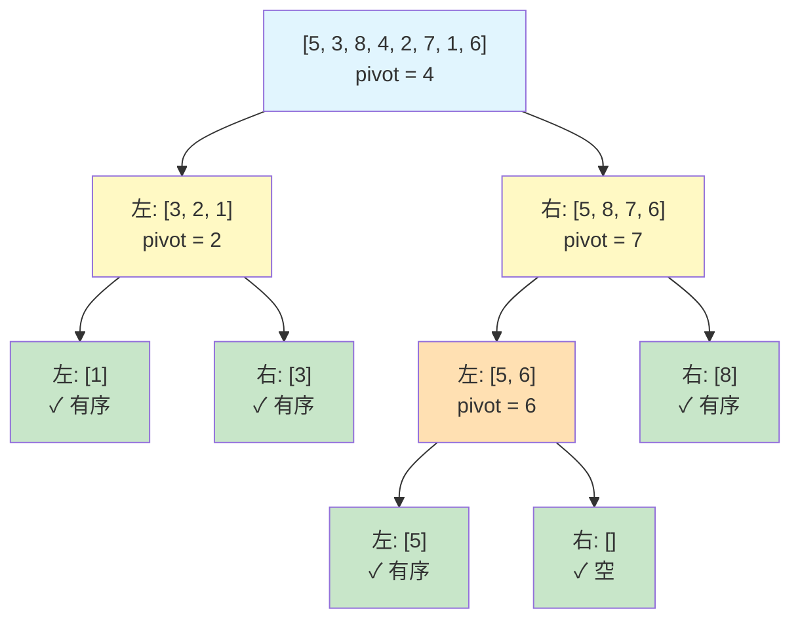
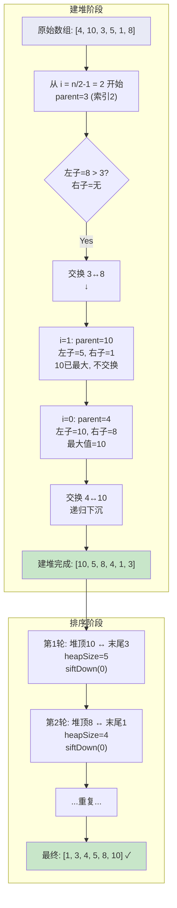
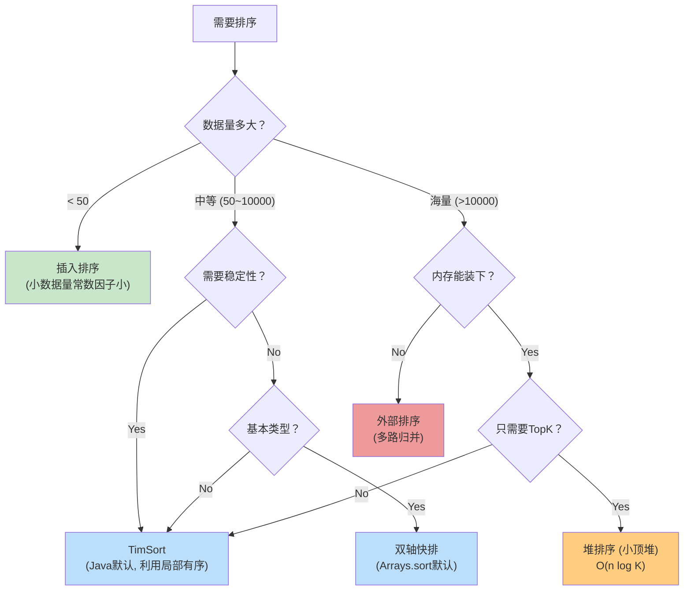

# 排序算法 — 面试通关宝典

> **适用场景**: Android 高级/资深开发面试、大厂算法面、系统源码理解
> **核心覆盖**: 快速排序（递归+非递归）、归并排序（稳定性+外部排序）、堆排序（TopK）、TimSort（Android/Java 底层）、冒泡/选择/插入对比

---

## 1. 面试高频问题

以下是排序算法面试中 **≥90% 概率** 会遇到的问题：

### Q1: 手写快速排序（递归 + 非递归）

> "请在白板/IDE 上手写快速排序，包括递归版本和非递归版本（用栈模拟）。"

**考察点**: 分治思想、基准值选择策略、栈模拟递归、时间复杂度分析。

### Q2: 归并排序的稳定性是什么意思？它有什么实际应用场景？

> "归并排序为什么是稳定的？稳定性在什么场景下重要？归并排序如何用于外部排序？"

**考察点**: 稳定性的定义（等值元素的相对顺序不变）、外部排序（多路归并）、海量数据处理。

### Q3: 堆排序的原理是什么？如何用堆解决 TopK 问题？

> "请解释堆排序的建堆和排序过程。如果有 10 亿个数字，如何找出最大的 100 个？"

**考察点**: 大顶堆/小顶堆构建、siftDown 下沉操作、TopK 复杂度 O(n log k)。

### Q4: 冒泡排序、选择排序、插入排序的对比和使用时机

> "这三种 O(n²) 排序算法各有什么特点？什么场景下会选择插入排序而不是快排？"

**考察点**: 插入排序在"基本有序"场景下的 O(n) 优势、冒泡的优化（提前终止）、选择排序的"交换次数最少"特性。

### Q5: `Collections.sort()` 在 Java 中底层用的是什么排序算法？

> "Java 的 `Collections.sort()` 和 `Arrays.sort()` 分别用什么排序？TimSort 的核心思想是什么？"

**考察点**: TimSort 原理（自然有序段 run + minRun + 二分插入 + Galloping 合并）、与归并排序的关系、为什么选 TimSort。

### Q6: Android 中有哪些需要排序的实际场景？

> "你实际开发中遇到过哪些排序需求？RecyclerView 列表排序怎么做？联系人按拼音排序怎么实现？"

**考察点**: 实际工程经验、`Comparator` 的使用、中文排序（`Collator`）、排序对 UI 性能的影响。

---

## 2. 标准答案（含手写代码）

### 2.1 快速排序 — 递归版

```java
public class QuickSort {

    public static void quickSort(int[] arr) {
        if (arr == null || arr.length < 2) return;
        quickSort(arr, 0, arr.length - 1);
    }

    private static void quickSort(int[] arr, int left, int right) {
        if (left >= right) return;

        // 三数取中法选择基准值，避免最坏情况
        int pivotIndex = medianOfThree(arr, left, right);
        swap(arr, pivotIndex, right); // 基准值移到最右

        int pivot = partition(arr, left, right);
        quickSort(arr, left, pivot - 1);
        quickSort(arr, pivot + 1, right);
    }

    /**
     * 挖坑法分区：左指针找大于基准的，右指针找小于基准的，交换
     */
    private static int partition(int[] arr, int left, int right) {
        int pivot = arr[right];
        int i = left;
        for (int j = left; j < right; j++) {
            if (arr[j] < pivot) {
                swap(arr, i, j);
                i++;
            }
        }
        swap(arr, i, right);
        return i;
    }

    /**
     * 三数取中：比较 left / mid / right，返回中间值的下标
     */
    private static int medianOfThree(int[] arr, int left, int right) {
        int mid = left + (right - left) / 2;
        if (arr[left] > arr[mid])  swap(arr, left, mid);
        if (arr[left] > arr[right]) swap(arr, left, right);
        if (arr[mid] > arr[right])  swap(arr, mid, right);
        return mid;
    }

    private static void swap(int[] arr, int i, int j) {
        int tmp = arr[i];
        arr[i] = arr[j];
        arr[j] = tmp;
    }
}
```

### 2.2 快速排序 — 非递归版（栈模拟）

```java
public static void quickSortIterative(int[] arr) {
    if (arr == null || arr.length < 2) return;

    Deque<int[]> stack = new ArrayDeque<>();
    stack.push(new int[]{0, arr.length - 1});

    while (!stack.isEmpty()) {
        int[] range = stack.pop();
        int left = range[0], right = range[1];

        if (left >= right) continue;

        int pivot = partition(arr, left, right);

        // 先压入较大的区间，保证栈深度可控
        if (pivot - left > right - pivot) {
            stack.push(new int[]{left, pivot - 1});
            stack.push(new int[]{pivot + 1, right});
        } else {
            stack.push(new int[]{pivot + 1, right});
            stack.push(new int[]{left, pivot - 1});
        }
    }
}
```

**面试要点**: 非递归版的核心是用 **显式栈** 替代递归调用栈。注意先压大区间、后压小区间，可以控制栈的最大深度为 O(log n)，避免栈溢出。

### 2.3 归并排序 — 递归版

```java
public class MergeSort {

    public static void mergeSort(int[] arr) {
        if (arr == null || arr.length < 2) return;
        int[] temp = new int[arr.length];
        mergeSort(arr, 0, arr.length - 1, temp);
    }

    private static void mergeSort(int[] arr, int left, int right, int[] temp) {
        if (left >= right) return;

        int mid = left + (right - left) / 2;
        mergeSort(arr, left, mid, temp);
        mergeSort(arr, mid + 1, right, temp);

        // 优化：如果左半部分最大值 ≤ 右半部分最小值，则已经有序
        if (arr[mid] <= arr[mid + 1]) return;

        merge(arr, left, mid, right, temp);
    }

    private static void merge(int[] arr, int left, int mid, int right, int[] temp) {
        System.arraycopy(arr, left, temp, left, right - left + 1);

        int i = left;      // 左半指针
        int j = mid + 1;   // 右半指针
        int k = left;      // 目标指针

        while (i <= mid && j <= right) {
            // 注意：这里用 <= 而不是 <，保证稳定性
            if (temp[i] <= temp[j]) {
                arr[k++] = temp[i++];
            } else {
                arr[k++] = temp[j++];
            }
        }

        while (i <= mid) arr[k++] = temp[i++];
        // 右半部分如果有剩余，不需要复制（已经在 arr 中）
    }
}
```

### 2.4 堆排序

```java
public class HeapSort {

    public static void heapSort(int[] arr) {
        if (arr == null || arr.length < 2) return;

        int n = arr.length;

        // 1. 建堆：从最后一个非叶子节点开始，向前做下沉调整
        //    时间复杂度 O(n) — 数学归纳可证
        for (int i = n / 2 - 1; i >= 0; i--) {
            siftDown(arr, n, i);
        }

        // 2. 排序：不断将堆顶（最大值）交换到末尾，然后缩小堆范围
        for (int i = n - 1; i > 0; i--) {
            swap(arr, 0, i);          // 堆顶换到末尾
            siftDown(arr, i, 0);      // 对剩余元素重新下沉
        }
    }

    /**
     * 大顶堆下沉：确保以 parent 为根的子树满足堆性质
     */
    private static void siftDown(int[] arr, int heapSize, int parent) {
        int largest = parent;
        int left  = 2 * parent + 1;
        int right = 2 * parent + 2;

        if (left  < heapSize && arr[left]  > arr[largest]) largest = left;
        if (right < heapSize && arr[right] > arr[largest]) largest = right;

        if (largest != parent) {
            swap(arr, parent, largest);
            siftDown(arr, heapSize, largest); // 递归下沉
        }
    }

    private static void swap(int[] arr, int i, int j) {
        int tmp = arr[i];
        arr[i] = arr[j];
        arr[j] = tmp;
    }
}
```

### 2.5 TopK 问题（小顶堆）

```java
/**
 * 找出数组中最小的 k 个数 → 用大顶堆（堆顶是当前最大的）
 * 找出数组中最大的 k 个数 → 用小顶堆（堆顶是当前最小的）
 *
 * 以下示例：找最大的 k 个数
 * 时间复杂度: O(n log k)，空间复杂度: O(k)
 */
public static int[] topKLargest(int[] arr, int k) {
    if (k <= 0 || arr == null || arr.length == 0) return new int[0];

    // Java PriorityQueue 默认是小顶堆
    PriorityQueue<Integer> minHeap = new PriorityQueue<>(k);

    for (int num : arr) {
        if (minHeap.size() < k) {
            minHeap.offer(num);
        } else if (num > minHeap.peek()) {
            minHeap.poll();
            minHeap.offer(num);
        }
    }

    return minHeap.stream().mapToInt(Integer::intValue).toArray();
}
```

### 2.6 复杂度对比总表

| 排序算法 | 最好时间 | 平均时间 | 最坏时间 | 空间复杂度 | 稳定性 | 适用场景 |
|:--------|:--------|:--------|:--------|:---------|:-----|:--------|
| **冒泡排序** | O(n) | O(n²) | O(n²) | O(1) | ✅ 稳定 | 教学、小数据、基本有序 |
| **选择排序** | O(n²) | O(n²) | O(n²) | O(1) | ❌ 不稳定 | 交换代价高时（如 Flash 存储） |
| **插入排序** | O(n) | O(n²) | O(n²) | O(1) | ✅ 稳定 | **基本有序数据**、小数组（TimSort 内部使用） |
| **希尔排序** | O(n log n) | O(n log² n) | O(n²) | O(1) | ❌ 不稳定 | 中等数据量、嵌入式 |
| **快速排序** | O(n log n) | O(n log n) | O(n²) | O(log n) | ❌ 不稳定 | **通用排序首选**（双轴快排） |
| **归并排序** | O(n log n) | O(n log n) | O(n log n) | O(n) | ✅ 稳定 | **外部排序**、链表排序、稳定排序需求 |
| **堆排序** | O(n log n) | O(n log n) | O(n log n) | O(1) | ❌ 不稳定 | **TopK**、优先队列、内存受限 |
| **TimSort** | O(n) | O(n log n) | O(n log n) | O(n) | ✅ 稳定 | **Java/Android 默认**，现实数据常有部分有序 |

> **关键记忆点**:
> - 只有 **归并排序** 在所有情况下都是 O(n log n)（且稳定）。
> - **插入排序** 在基本有序时逼近 O(n)，这是 TimSort 依赖它的原因。
> - **堆排序** 是唯一 O(n log n) 且空间 O(1) 的排序，适合嵌入式/内存受限场景。

---

## 3. 核心原理深度解析

### 3.1 快速排序：分治的艺术

快排的核心是 **分治（Divide & Conquer）**：

```
quickSort(arr, left, right):
    1. 选择基准值 pivot
    2. partition: 将 ≤pivot 的放左边，>pivot 的放右边
    3. 递归排序左右子数组
```

**基准值选择的三种策略**：

| 策略 | 做法 | 最坏情况风险 |
|:-----|:-----|:----------|
| 固定选最右 | `pivot = arr[right]` | ⚠️ 已排序/逆序 → O(n²) |
| 随机选取 | `pivot = arr[random(left,right)]` | ✅ 概率性避免最坏 |
| **三数取中** | 比较 `left/mid/right` 取中值 | ✅ 确定性避免最坏（生产首选） |

**递归深度优化**：Java 的 `Arrays.sort()` 使用双轴快排（Dual-Pivot QuickSort），选择两个基准值，将数组分成三部分。同时，当子数组长度小于某个阈值（通常是 47）时，切换到插入排序——因为小数组上插入排序的常数因子更小。

### 3.2 归并排序：稳定性的意义

归并排序也是分治，但它是 **先递归后合并**（自顶向下）：

```
mergeSort(arr, left, right):
    1. 递归分成两半
    2. 分别排序左半和右半
    3. merge: 合并两个有序子数组
```

**稳定性来源**：在 `merge` 阶段，当左右指针指向的值相等时，**优先取左半部分的元素**。这保证了相等元素的原始相对顺序不变。

```java
// 关键一行：<= 而非 <
if (temp[i] <= temp[j]) {
    arr[k++] = temp[i++];  // 左半优先 → 稳定
}
```

**稳定性的实际意义**：
- 多级排序：先按年龄排序，再按姓名排序（第二次排序不能打乱同年龄的顺序）
- 数据库 `ORDER BY a, b` 的底层实现

**外部排序（External Sort）**：当数据量大到无法全部装入内存时，使用归并排序：
1. 将大文件分成多个能装入内存的块，每块排序后写入临时文件
2. 使用 **K 路归并**（K-way merge），每次从 K 个文件中各读一条记录，取最小值输出
3. Android 中的 SQLite 排序可能涉及外部排序

### 3.3 堆排序：从建堆到排序

**堆的定义**：大顶堆——每个节点的值 ≥ 其子节点的值。用数组存储，索引关系：
- 父节点: `(i-1)/2`
- 左子: `2i+1`，右子: `2i+2`

**建堆过程（Floyd 算法）**：

```
从最后一个非叶子节点 (n/2-1) 开始，向前遍历：
    对每个节点执行 siftDown（将其与较大的子节点交换，递归下沉）
```

**建堆为什么是 O(n) 而不是 O(n log n)**？

数学证明：第 k 层有 2ᵏ 个节点，每个节点最多下沉 h-k 层（h 为树高）。总下沉次数 = ∑ 2ᵏ·(h−k)，级数求和得 O(n)。

**siftDown 三步骤**：
1. 比较 parent 和 left child、right child
2. 找出三者中最大值的索引
3. 如果最大值不是 parent，交换并递归下沉

### 3.4 TimSort：工程化的极致

> TimSort 由 Tim Peters 于 2002 年为 Python 设计，后被 Java 和 Android 采用。

**核心思想**：现实世界的数据往往不是完全随机的——数据中通常包含多个已经有序的连续段（称为 **run**）。TimSort 利用这个特性达到近乎 O(n) 的性能。

**三大核心技术**：

#### (1) 自然有序段探测（Run Detection）

```
扫描数组，找出连续的升序或降序段：
  - 升序段：保持原样
  - 降序段：反转成升序
  - 如果扫描到的 run 长度 < minRun（通常 32~64）：
    用二分插入排序补齐到 minRun 长度
```

#### (2) minRun 计算

`minRun` 的大小介于 32 和 64 之间，具体由 n（总长度）决定：

```
minRun = n 不断右移直到 ≤ 64，记录被移除的低位
如果低位中有 1，则 minRun += 1
```

这样设计是为了让所有 run 的长度大致相等，优化合并效率。

#### (3) Galloping 模式合并

当合并两个 run 时，如果连续多次（阈值=7）都从同一个 run 取元素，则切换到 **Galloping 模式**——用指数搜索（先 1, 2, 4, 8... 再二分查找）快速找到插入位置，然后批量复制。

**mergeCollapse 栈优化**：TimSort 用一个栈管理所有 run，每次新 run 入栈后，检查栈顶三个 run 的长度关系，确保满足：

```
run[n-3] > run[n-2] + run[n-1]   // 条件1
run[n-2] > run[n-1]              // 条件2
```

如果不满足则合并较小的两个 run。这种策略保证了合并代价最小化（类似哈夫曼树）。

---

## 4. 流程图

### 4.1 快速排序递归树



> **说明**: 每次 partition 后，基准值到达最终位置（绿色节点）。递归深度取决于基准值选择，三数取中可保证平衡分区。

### 4.2 堆排序 — 建堆与下沉流程



### 4.3 堆排序 siftDown 详细流程图

```html
<div class="mermaid">
flowchart TD
    Start["siftDown(arr, heapSize, parent)"] -->
    Calc["left = 2*parent + 1<br/>right = 2*parent + 2<br/>largest = parent"]

    Calc --> CheckL{"left < heapSize<br/>AND<br/>arr[left] > arr[largest]?"}
    CheckL -->|Yes| UpdL["largest = left"]
    CheckL -->|No| CheckR
    UpdL --> CheckR

    CheckR{"right < heapSize<br/>AND<br/>arr[right] > arr[largest]?"}
    CheckR -->|Yes| UpdR["largest = right"]
    CheckR -->|No| Compare
    UpdR --> Compare

    Compare{"largest != parent?"}
    Compare -->|Yes| Swap["swap(arr, parent, largest)<br/>递归: siftDown(arr, heapSize, largest)"]
    Compare -->|No| Done["✓ 堆性质满足，结束"]

    Swap --> Done

    style Start fill:#bbdefb
    style Done fill:#c8e6c9
    style Swap fill:#ffcdd2
</div>
```

---

## 5. 源码分析

### 5.1 `Arrays.sort()` 的分支策略（JDK 源码）

Java 的 `Arrays.sort()` 根据元素类型和数组长度选择不同算法：

```java
// java/util/Arrays.java（简化逻辑）

public static void sort(int[] a) {
    // 使用双轴快速排序（Dual-Pivot QuickSort）
    // 阈值 QUICKSORT_THRESHOLD = 286
    // 小数组阈值 INSERTION_SORT_THRESHOLD = 47
    DualPivotQuicksort.sort(a, 0, a.length - 1, null, 0, 0);
}

public static void sort(Object[] a) {
    // 对象数组使用 TimSort（需要稳定性）
    // LegacyMergeSort 已被废弃
    if (LegacyMergeSort.userRequested)
        legacyMergeSort(a);
    else
        ComparableTimSort.sort(a, 0, a.length, null, 0, 0);
}
```

**`DualPivotQuicksort.sort()` 的核心逻辑**：

```
1. 如果长度 < INSERTION_SORT_THRESHOLD (47):
      → 使用插入排序（或双插入排序 paired insertion sort）

2. 如果长度 < QUICKSORT_THRESHOLD (286):
      → 使用双轴快排:
          - 选两个基准值 pivot1, pivot2（保证 pivot1 <= pivot2）
          - 分成三区: <pivot1 | pivot1~pivot2 | >pivot2
          - 递归排序三个区

3. 如果长度 >= 286:
      → 先检查数组是否"接近有序"（统计连续升序/降序段的长度）
      → 如果接近有序: 使用归并排序
      → 否则: 使用双轴快排
```

**双轴快排的优势**：比单轴快排减少约 20% 的比较次数（数学已证明），因为一次扫描可以同时定位两个基准值。

### 5.2 `TimSort.sort()` 的核心流程

```java
// java/util/TimSort.java（简化核心逻辑）

static <T> void sort(T[] a, int lo, int hi, Comparator<? super T> c,
                     T[] work, int workBase, int workLen) {
    int nRemaining = hi - lo;
    if (nRemaining < 2) return;
    if (nRemaining < MIN_MERGE) {  // MIN_MERGE = 32
        // 小数组直接用二分插入排序
        int initRunLen = countRunAndMakeAscending(a, lo, hi, c);
        binarySort(a, lo, hi, lo + initRunLen, c);
        return;
    }

    // 1. 计算 minRun
    int minRun = minRunLength(nRemaining);

    do {
        // 2. 探测下一个自然有序 run
        int runLen = countRunAndMakeAscending(a, lo, hi, c);

        // 3. 如果 run 太短，用二分插入补齐
        if (runLen < minRun) {
            int force = Math.min(minRun, nRemaining);
            binarySort(a, lo, lo + force, lo + runLen, c);
            runLen = force;
        }

        // 4. 将 run 压入栈
        ts.pushRun(lo, runLen);
        // 5. 检查栈平衡，必要时合并
        ts.mergeCollapse();

        lo += runLen;
        nRemaining -= runLen;
    } while (nRemaining != 0);

    // 6. 强制合并栈中所有 run
    ts.mergeForceCollapse();
}
```

**`countRunAndMakeAscending()` — Run 探测**：

```java
private static <T> int countRunAndMakeAscending(T[] a, int lo, int hi,
                                                 Comparator<? super T> c) {
    int runHi = lo + 1;
    if (runHi == hi) return 1;

    // 检查前两个元素确定方向（升序 or 降序）
    if (c.compare(a[runHi++], a[lo]) < 0) { // 降序
        while (runHi < hi && c.compare(a[runHi], a[runHi - 1]) < 0) runHi++;
        reverseRange(a, lo, runHi); // 反转成升序
    } else { // 升序
        while (runHi < hi && c.compare(a[runHi], a[runHi - 1]) >= 0) runHi++;
    }

    return runHi - lo;
}
```

**`mergeCollapse()` — 栈平衡检查**：

```java
private void mergeCollapse() {
    // 栈中 run 从底到顶: run[0], run[1], ..., run[stackSize-1]
    while (stackSize > 1) {
        int n = stackSize - 2;
        // 条件: run[n-1] > run[n] + run[n+1]  AND  run[n] > run[n+1]
        if (n > 0 && runLen[n-1] <= runLen[n] + runLen[n+1]) {
            if (runLen[n-1] < runLen[n+1]) n--;
            mergeAt(n);
        } else if (runLen[n] <= runLen[n+1]) {
            mergeAt(n);
        } else {
            break; // 栈已平衡
        }
    }
}
```

这个精心设计的合并策略在数学上保证了：
- 栈的最大深度为 O(log n)
- 总合并代价接近最优（每次合并的两个 run 长度接近）

---

## 6. 应用场景

### 6.1 RecyclerView 联系人排序 — TimSort 的自然有序优势

**场景描述**：Android 通讯录应用，需要按联系人姓名拼音排序展示在 RecyclerView 中。用户可能频繁添加/删除联系人，导致列表局部更新。

**实现方案**：

```kotlin
// Contact.kt
data class Contact(
    val id: Long,
    val name: String,
    val pinyin: String,  // 预计算的拼音
    val lastContactTime: Long  // 最近联系时间
)

// ContactRepository.kt
class ContactRepository {
    fun getSortedContacts(sortBy: SortField): List<Contact> {
        val contacts = loadFromDatabase()

        return when (sortBy) {
            SortField.NAME -> contacts.sortedWith(
                compareBy<Contact> { it.pinyin }
                    .thenBy { it.name }
            )
            SortField.TIME -> contacts.sortedByDescending { it.lastContactTime }
            SortField.FREQUENCY -> contacts.sortedByDescending { it.contactCount }
        }
    }
}

// ContactAdapter.kt
class ContactAdapter : ListAdapter<Contact, ContactViewHolder>(ContactDiffCallback()) {

    fun updateContacts(newContacts: List<Contact>) {
        // ListAdapter 内部使用 DiffUtil 计算差异
        // 配合排序后的列表，可以实现局部刷新动画
        submitList(newContacts)
    }

    class ContactDiffCallback : DiffUtil.ItemCallback<Contact>() {
        override fun areItemsTheSame(old: Contact, new: Contact) =
            old.id == new.id

        override fun areContentsTheSame(old: Contact, new: Contact) =
            old == new
    }
}
```

**为什么 TimSort 在这里有优势**？

1. **增量更新**：用户添加一个新联系人后，列表大部分仍然有序（只有一个元素在错误位置）。TimSort 识别出两个长 run，几乎 O(n) 完成排序。
2. **多级排序**：先按拼音、再按名字 → 需要稳定性。TimSort 稳定，归并排序也稳定，但 TimSort 在实际数据上更快。
3. **数据库预排序**：从 SQLite 读取时如果已经 `ORDER BY`，数据本来就是有序的，TimSort 直接 O(n) 扫描确认。

**中文拼音排序的注意事项**：

```java
// 使用 Collator 进行中文拼音排序
Collator collator = Collator.getInstance(Locale.CHINESE);
collator.setStrength(Collator.PRIMARY);  // 忽略声调
Collections.sort(contacts, (a, b) -> collator.compare(a.name, b.name));
```

### 6.2 TopK 热门搜索 — 堆排序的用武之地

**场景描述**：搜索框中展示"热门搜索 Top 10"，数据来源可能是服务端下发的全量搜索词条（比如 10000 条），每条包含搜索词和搜索次数。

**方案对比**：

| 方案 | 时间复杂度 | 空间复杂度 | 适用场景 |
|:-----|:----------|:----------|:--------|
| 全量排序取前 K | O(n log n) | O(n) | K 接近 n 时 |
| **小顶堆 TopK** | **O(n log K)** | **O(K)** | K << n（本场景） |
| 快速选择算法 | O(n) 平均 | O(1) | 不需要排序结果，只要前 K 个 |

**实现代码**：

```kotlin
data class HotSearch(val keyword: String, val count: Int)

fun findTopKHotSearches(allSearches: List<HotSearch>, k: Int): List<HotSearch> {
    // 小顶堆：堆顶是"当前第K大"（即堆中最小值）
    val minHeap = PriorityQueue<HotSearch>(k, compareBy { it.count })

    for (search in allSearches) {
        if (minHeap.size < k) {
            minHeap.offer(search)
        } else if (search.count > minHeap.peek().count) {
            minHeap.poll()
            minHeap.offer(search)
        }
    }

    // 堆中元素是"最大的K个"，但未排序
    // 如果需要按热度降序排列：
    return minHeap.toList().sortedByDescending { it.count }
}
```

**为什么不用全量排序**？
- 10000 条全量排序 → ~10000·log₂(10000) ≈ 133,000 次比较
- 小顶堆 Top10 → ~10000·log₂(10) ≈ 33,000 次比较
- **4 倍性能差距**，数据量越大差距越明显。

**为什么堆排序适合这个场景？**
1. 空间复杂度 O(K)，K 通常很小（10~100），内存友好
2. 不需要对全部数据排序，只维护一个大小为 K 的堆
3. 堆排序天然适合"动态维护 TOP K"：新数据到来时，O(log K) 即可更新

### 6.3 更多 Android 排序场景

| 场景 | 排序需求 | 推荐算法 | 关键点 |
|:-----|:--------|:--------|:------|
| **RecyclerView 按时间排序** | 消息列表按时间倒序 | TimSort / 数据库 ORDER BY | 新消息插入后列表基本有序 |
| **联系人拼音排序** | 联系人按拼音字母分组 | TimSort + Collator | 多音字处理、多级排序稳定性 |
| **文件管理器按大小排序** | 文件按大小/日期/名称排序 | Arrays.sort() (双轴快排) | 数据通常无规律 |
| **搜索结果排序** | 搜索结果按相关性+时间排序 | TimSort（多级排序） | 先按相关性、再按时间 → 需要稳定性 |
| **排行榜 Top N** | 游戏分数排行、热门搜索 | 堆排序 TopK | 只关心前 N 名 |
| **日志按时间戳排序** | 多线程日志合并 | 归并排序（K 路归并） | 每个线程日志已有序 |

---

## 总结：排序算法选择决策树



> **面试金句**：
> "选择排序算法时，我主要考虑三个维度：**时间复杂度、空间复杂度、稳定性**。在实际工程中，Java 的 TimSort 已经处理了大部分场景——它利用真实数据'部分有序'的特点，在最好情况下可以达到 O(n)。而对于 TopK 这类特定需求，堆排序是理论最优解。"
