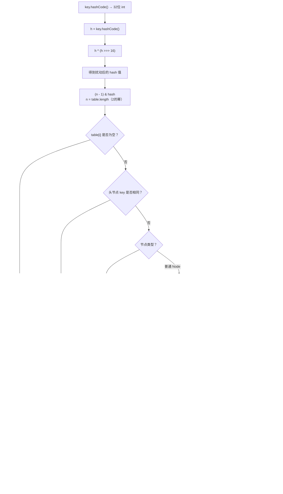
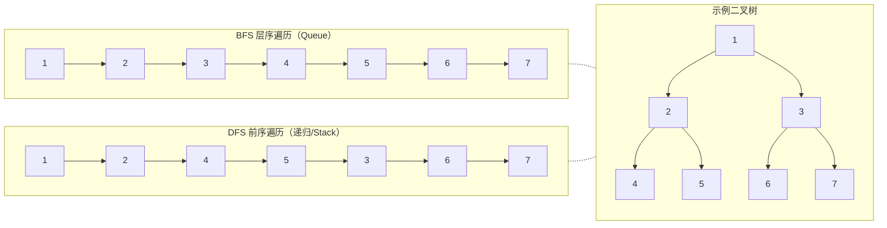
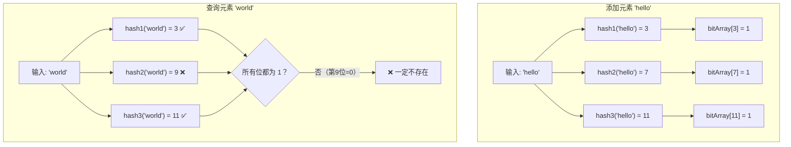
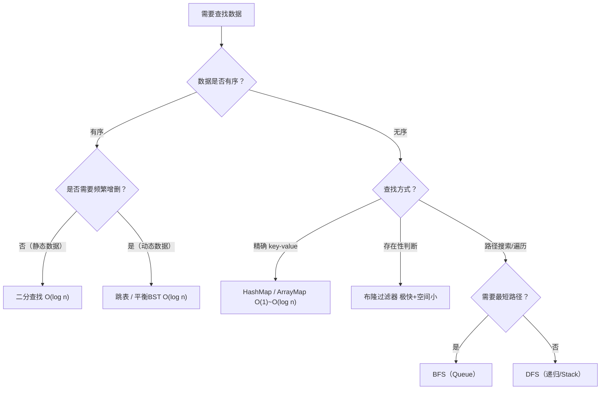

# 查找算法 —— 面试学习完整指南

> **六层递进体系**：面试问题 → 标准答案 → 核心原理 → 流程图 → 源码分析 → 实战场景
> 适用岗位：高级/资深 Android 工程师、基础架构工程师

---

## 目录

1. [常见面试问题（8题）](#1-常见面试问题)
2. [标准答案与要点解析](#2-标准答案与要点解析)
3. [核心原理深度讲解](#3-核心原理深度讲解)
4. [原理流程图与Mermaid图解](#4-原理流程图与mermaid图解)
5. [核心源码分析](#5-核心源码分析)
6. [应用场景举例](#6-应用场景举例)

---

## 1. 常见面试问题

### Q1: 手写二分查找，并说明 `while(left <= right)` 和 `while(left < right)` 的区别？
### Q2: HashMap 的哈希冲突如何解决？JDK 7 → JDK 8 做了什么关键优化？
### Q3: BFS 和 DFS 的区别是什么？请写出代码模板并分析各自适用场景。
### Q4: 布隆过滤器的原理是什么？在 Android 项目中如何用它解决缓存穿透？
### Q5: 二分查找在 Android 开发中有哪些实际应用？
### Q6: HashMap 的扩容机制是什么？为什么容量必须是 2 的幂？
### Q7（进阶）: 如何用二分查找在旋转排序数组中搜索目标值？
### Q8（进阶）: ConcurrentHashMap 在 JDK 7 和 JDK 8 中查找操作的区别？

---

## 2. 标准答案与要点解析

### Q1: 手写二分查找 + 边界条件分析

**标准写法（左闭右闭 `[left, right]`）**：

```java
public int binarySearch(int[] nums, int target) {
    if (nums == null || nums.length == 0) return -1;
    int left = 0, right = nums.length - 1;

    // 左闭右闭：left == right 时区间仍有 1 个元素需要检查
    while (left <= right) {
        // 防溢出写法，等价于 (left + right) / 2
        int mid = left + (right - left) / 2;
        // 更安全的无符号右移写法：
        // int mid = (left + right) >>> 1;

        if (nums[mid] == target) {
            return mid;
        } else if (nums[mid] < target) {
            left = mid + 1;
        } else {
            right = mid - 1;
        }
    }
    return -1;
}
```

**左闭右开写法 `[left, right)`**：

```java
public int binarySearch2(int[] nums, int target) {
    int left = 0, right = nums.length; // 注意：right 初始值不同

    // 左闭右开：left == right 时区间为空，无需检查
    while (left < right) {
        int mid = left + (right - left) / 2;
        if (nums[mid] == target) {
            return mid;
        } else if (nums[mid] < target) {
            left = mid + 1;
        } else {
            right = mid; // 注意：不是 mid - 1
        }
    }
    return -1;
}
```

| 对比维度 | `while(left <= right)` | `while(left < right)` |
|---------|------------------------|----------------------|
| 区间定义 | `[left, right]` — 左右均闭 | `[left, right)` — 左闭右开 |
| `right` 初始值 | `nums.length - 1` | `nums.length` |
| 循环条件 | `left <= right` | `left < right` |
| 更新 `right` | `mid - 1` | `mid` |
| `left==right` 时 | 仍进入循环，检查该元素 | 退出循环，未检查 |
| 适用场景 | **精确查找**（目标必定在数组内或不在） | **查找插入位置**、找上下界 |

**面试加分点**：

- **中值溢出陷阱**：`(left + right) / 2` 在 `left + right` 超过 `Integer.MAX_VALUE` 时会溢出为负数，导致数组越界。安全的写法：`left + (right - left) / 2` 或 `(left + right) >>> 1`（无符号右移）。
- **循环不变式**：每次进入循环时，目标值如果存在，必定在 `[left, right]`（或 `[left, right)`）区间内——这是二分正确性的数学保证。
- **变种题型**：找第一个等于 target 的位置、找最后一个等于 target 的位置、找第一个大于等于 target 的位置（lower_bound）、找第一个大于 target 的位置（upper_bound）——这些变种统一使用 `while(left < right)` 模板更稳妥。

**复杂度分析**：

| 复杂度 | 数值 | 说明 |
|--------|------|------|
| 时间复杂度 | **O(log n)** | 每次迭代搜索空间减半 |
| 空间复杂度 | **O(1)**（迭代版）/ **O(log n)**（递归版） | 迭代版无额外空间 |

---

### Q2: HashMap 哈希冲突解决机制

**JDK 7 → JDK 8 关键变化**：

| 维度 | JDK 7 | JDK 8 |
|------|-------|-------|
| 数据结构 | 数组 + 链表（仅拉链法） | 数组 + 链表 + **红黑树** |
| 链表插入方式 | **头插法**（多线程扩容时可能死循环） | **尾插法**（彻底解决死循环） |
| 链表转树阈值 | 无 | 链表长度 ≥ **8** 且数组长度 ≥ **64** |
| 树退化为链表阈值 | 无 | 红黑树节点数 ≤ **6** 时退化 |
| hash 扰动 | 4次位运算 + 5次异或 | 1次位运算 + 1次异或 `h ^ (h >>> 16)` |

**为什么链表转红黑树的阈值是 8？**

根据泊松分布概率计算：在负载因子 0.75 的情况下，hash 表中同一个 bin 的链表长度达到 8 的概率约为 **0.00000006**（亿分之六），几乎不会发生。一旦发生，说明 hash 函数设计不佳或受到了恶意攻击（哈希碰撞攻击），此时升级为红黑树将查找复杂度从 O(n) 降到 O(log n)，防止 CPU 被恶意拖垮。

**哈希碰撞攻击场景**：攻击者构造大量 hashCode 相同的 Key（如字符串哈希碰撞），使 HashMap 退化成单链表，get/put 操作退化为 O(n)，造成服务 CPU 100%。

---

### Q3: BFS 和 DFS 详解

**BFS（广度优先搜索）代码模板**：

```java
public void bfs(Node root) {
    if (root == null) return;
    Queue<Node> queue = new LinkedList<>();
    Set<Node> visited = new HashSet<>();
    queue.offer(root);
    visited.add(root);

    while (!queue.isEmpty()) {
        int levelSize = queue.size(); // 按层处理（可选）
        for (int i = 0; i < levelSize; i++) {
            Node node = queue.poll();
            // 处理当前节点
            for (Node neighbor : node.neighbors) {
                if (!visited.contains(neighbor)) {
                    visited.add(neighbor);
                    queue.offer(neighbor);
                }
            }
        }
    }
}
```

**DFS（深度优先搜索）代码模板**：

```java
// 递归版（最常用）
public void dfs(Node node, Set<Node> visited) {
    if (node == null || visited.contains(node)) return;
    visited.add(node);
    // 处理当前节点（前序）
    for (Node neighbor : node.neighbors) {
        dfs(neighbor, visited);
    }
    // 后序处理（可选）
}

// 迭代版（用 Stack 模拟递归）
public void dfsIterative(Node root) {
    if (root == null) return;
    Deque<Node> stack = new ArrayDeque<>();
    Set<Node> visited = new HashSet<>();
    stack.push(root);
    
    while (!stack.isEmpty()) {
        Node node = stack.pop();
        if (visited.contains(node)) continue;
        visited.add(node);
        // 处理节点
        for (Node neighbor : node.neighbors) {
            if (!visited.contains(neighbor)) {
                stack.push(neighbor);
            }
        }
    }
}
```

| 对比维度 | BFS | DFS |
|---------|-----|-----|
| 数据结构 | **Queue**（FIFO） | **Stack** 或递归调用栈（LIFO） |
| 空间复杂度 | **O(w)**，w = 树的最大宽度（层中最宽处） | **O(h)**，h = 树/图的最大深度 |
| 遍历顺序 | 逐层展开，横向优先 | 一路到底，纵向优先 |
| 是否找到最短路径 | **是**（无权图首次到达即最短） | 否（找到的不一定是最短） |
| 典型应用 | 最短路径、层序遍历、社交网络度数 | 拓扑排序、连通分量、回溯（全排列/组合） |
| 递归实现 | 不自然（需手动维护队列） | 天然递归 |
| **Android 应用** | View 树的 `findViewById`（层序遍历最接近） | Layout 的 measure/layout（深度优先递归） |

---

### Q4: 布隆过滤器原理与缓存穿透

**布隆过滤器数据结构**：
- 一个长度为 **m** 的**位数组**（Bit Array），初始全为 0
- **k 个**独立的哈希函数，每个函数将元素映射到 `[0, m-1]` 的某个位置

**操作流程**：

1. **添加元素 `x`**：计算 `k` 个哈希值 `h₁(x), h₂(x), ..., hₖ(x)`，将位数组对应位置置为 1。
2. **查询元素 `y`**：计算 `k` 个哈希值，检查位数组对应位置是否**全部**为 1。
   - 若任意位为 0 → 元素**一定不存在**（100% 准确）。
   - 若所有位都为 1 → 元素**可能存在**（存在假阳性）。

**假阳性率（False Positive Rate）公式**：

\[
P_{fp} \approx \left(1 - e^{-kn/m}\right)^k
\]

其中：
- `n` = 已插入的元素数量
- `m` = 位数组长度
- `k` = 哈希函数个数

当 `k = (m/n) · ln 2` 时，假阳性率最小，约为 `(0.6185)^{m/n}`。

**在 Android 中解决缓存穿透**：

```java
public class BloomFilterCache<K, V> {
    private final BloomFilter<K> bloomFilter;
    private final LruCache<K, V> memoryCache;
    private final DataSource<K, V> remoteSource;

    public V get(K key) {
        // 1. 先查内存缓存
        V value = memoryCache.get(key);
        if (value != null) return value;

        // 2. 布隆过滤器快速筛掉不存在的 key
        //    如果 key 一定不存在，直接返回 null，不用查 DB
        if (!bloomFilter.mightContain(key)) {
            return null; // 拦截无效请求，防止缓存穿透
        }

        // 3. 布隆过滤器说 "可能存在" → 查远程数据源
        value = remoteSource.fetch(key);
        if (value != null) {
            memoryCache.put(key, value);
        } else {
            // key 实际不存在 → 缓存空对象，并考虑更新布隆过滤器
        }
        return value;
    }
}
```

**面试加分点**：
- 布隆过滤器**不能删除**（因为置 0 可能影响其他元素），需要删除场景用**计数布隆过滤器**（Counting Bloom Filter）。
- Google Guava 提供了 `BloomFilter<T>` 实现，Redis 4.0+ 提供了布隆过滤器模块。
- 实战参数参考：当预期插入 100 万元素、假阳性率 1% 时，需要约 `m = 9,585,058` 位（≈1.14MB），`k = 7` 个哈希函数。

---

### Q5: 二分查找在 Android 中的实际应用

**场景一：SparseArray / ArrayMap 的二分查找**

Android 中 `SparseArray`、`ArrayMap` 直接使用二分查找定位 key：

```java
// SparseArray.java - Android 源码中的二分查找
static int binarySearch(int[] array, int size, int value) {
    int lo = 0;
    int hi = size - 1;
    while (lo <= hi) {
        final int mid = (lo + hi) >>> 1; // 无符号右移，防溢出
        final int midVal = array[mid];
        if (midVal < value) {
            lo = mid + 1;
        } else if (midVal > value) {
            hi = mid - 1;
        } else {
            return mid; // 精确命中
        }
    }
    return ~lo; // 未命中：返回插入位置的按位取反
}
```

**返回值设计**：`~lo` 是 Android 特色的「未命中返回负插入位置」模式——如果返回负数，说明 key 不存在，取反可得插入位置。调用方用 `if (index < 0) index = ~index` 解析。

**场景二：View 测量中的二分查找**

```java
// BinarySearch 在自定义布局中按尺寸查找 View 的插入位置
// 例如：RecyclerView 的 LayoutManager 查找第一个可见 item
public int findFirstVisibleItemPosition(int scrollOffset, int[] itemOffsets) {
    // itemOffsets 是单调递增的累积偏移数组
    int index = Arrays.binarySearch(itemOffsets, scrollOffset);
    if (index < 0) index = ~index;
    return Math.max(0, index - 1); // 找到覆盖 scrollOffset 的 item
}
```

---

### Q6: HashMap 扩容机制

**扩容触发条件**：

| 触发条件 | 说明 |
|---------|------|
| `size > threshold` | `threshold = capacity × loadFactor`（默认 16 × 0.75 = 12） |
| 链表树化时数组长度 < 64 | 优先扩容而非树化（`MIN_TREEIFY_CAPACITY = 64`） |

**为什么容量必须是 2 的幂？**

计算数组索引时，HashMap 使用 `(n - 1) & hash` 代替 `hash % n`：

```java
// 当 n = 2^k 时，(n - 1) & hash 等价于 hash % n，但位运算快 10 倍+
// n = 16 (2^4)  →  n - 1 = 15 = 0b1111
// hash = 18     →  18 & 15 = 0b10010 & 0b01111 = 0b0010 = 2
// 18 % 16 = 2  ✓
```

当 `n` 是 2 的幂时，`n - 1` 的低位全为 1，`&` 运算等价于取模，且能**充分保留 hash 的低位信息**。若 n 不是 2 的幂，低位不全为 1 会导致某些桶永远不会被使用，加剧哈希冲突。

**resize() 核心流程**：
1. 新容量 = 旧容量 × 2（翻倍）
2. 新阈值 = 新容量 × loadFactor
3. 遍历旧数组，对每个 bin 中的节点重新计算索引
4. JDK 8 优化：节点的新位置只有两种可能——**原位置** 或 **原位置 + 旧容量**

```java
// JDK 8 扩容时的巧妙 rehash
// oldCap = 16 (0b10000), hash & oldCap 判断高位是否为 1
// 若 hash & oldCap == 0 → 留在原索引 j
// 若 hash & oldCap != 0 → 移到 j + oldCap

do {
    next = e.next;
    if ((e.hash & oldCap) == 0) {
        // 低位链表：索引不变
        loTail.next = e; loTail = e;
    } else {
        // 高位链表：索引 = 原索引 + oldCap
        hiTail.next = e; hiTail = e;
    }
} while ((e = next) != null);
```

---

### Q7（进阶）: 搜索旋转排序数组

```java
// LeetCode 33. 搜索旋转排序数组
// 输入: nums = [4,5,6,7,0,1,2], target = 0 → 输出: 4
public int searchRotated(int[] nums, int target) {
    int left = 0, right = nums.length - 1;
    while (left <= right) {
        int mid = left + (right - left) / 2;
        if (nums[mid] == target) return mid;

        // 关键：判断 mid 在左侧有序段还是右侧有序段
        if (nums[left] <= nums[mid]) {          // mid 在左侧有序段
            if (nums[left] <= target && target < nums[mid]) {
                right = mid - 1; // target 在左侧
            } else {
                left = mid + 1;  // target 在右侧
            }
        } else {                                 // mid 在右侧有序段
            if (nums[mid] < target && target <= nums[right]) {
                left = mid + 1;  // target 在右侧
            } else {
                right = mid - 1; // target 在左侧
            }
        }
    }
    return -1;
}
// 时间复杂度 O(log n)，关键在于利用 "至少有一半是有序的" 这个性质
```

---

### Q8（进阶）: ConcurrentHashMap 查找操作演化

| 维度 | JDK 7 | JDK 8 |
|------|-------|-------|
| 数据结构 | Segment 数组 + HashEntry 链表 | Node 数组 + 链表/红黑树（同 HashMap） |
| 锁粒度 | **分段锁**（Segment 继承 ReentrantLock，默认 16 段） | **CAS + synchronized**（锁单个 bin 的头节点） |
| get() 是否需要加锁 | **不需要**（HashEntry 的 value 和 next 用 volatile 保证可见性） | **不需要**（Node.val 和 Node.next 用 volatile） |
| size() 实现 | 先不加锁统计 3 次，不一致则加全锁 | 使用 `CounterCell` 分散计数（类似 LongAdder） |

**JDK 8 ConcurrentHashMap.get() 核心逻辑**：

```java
public V get(Object key) {
    Node<K,V>[] tab; Node<K,V> e, p; int n, eh; K ek;
    int h = spread(key.hashCode()); // 扰动后取正
    if ((tab = table) != null && (n = tab.length) > 0 &&
        (e = tabAt(tab, (n - 1) & h)) != null) {
        if ((eh = e.hash) == h) {              // 头节点 hash 匹配
            if ((ek = e.key) == key || (ek != null && key.equals(ek)))
                return e.val;
        }
        else if (eh < 0)                        // hash < 0 说明是 TreeBin 或 ForwardingNode
            return (p = e.find(h, key)) != null ? p.val : null;
        while ((e = e.next) != null) {          // 链表遍历
            if (e.hash == h &&
                ((ek = e.key) == key || (ek != null && key.equals(ek))))
                return e.val;
        }
    }
    return null;
}
```

**面试要点**：全程无锁读取，依赖 volatile 保证 Node 数组引用和 Node 内部字段的可见性。

---

## 3. 核心原理深度讲解

### 3.1 二分查找的正确姿势

**三项铁律**：

1. **中值计算防溢出**：永远使用 `left + (right - left) / 2` 或 `(left + right) >>> 1`，绝不使用 `(left + right) / 2`。
2. **区间定义前后一致**：选定一种区间定义（`[l, r]` 或 `[l, r)`）后，`left`/`right` 的初始化和更新必须严格对应。
3. **终止条件确保不漏不重**：`while(l <= r)` 配合 `r = mid - 1`，`while(l < r)` 配合 `r = mid`。

**二分查找的数学本质**：不断将搜索空间 `[left, right]` 二分，每次排除一半不可能区域。这要求输入数组必须**单调有序**（严格递增或递减）。

### 3.2 HashMap 的 hash 算法

JDK 8 的 hash 值计算：

```java
static final int hash(Object key) {
    int h;
    // key.hashCode() 返回 int（32位），高低 16 位异或
    // 目的：让高位也参与索引计算，减少低位相同的碰撞
    return (key == null) ? 0 : (h = key.hashCode()) ^ (h >>> 16);
}
```

**为什么要 `h ^ (h >>> 16)`？**

- HashMap 容量通常是 16~65536（`2^4`~`2^16`），索引计算只用到 hash 的低位（`(n-1) & hash`）。
- 如果直接使用原始 hashCode，高位信息完全被忽略，容易造成碰撞。
- 将高 16 位与低 16 位异或，让高位特征"混入"低位，显著降低碰撞概率——**只用了 1 次移位 + 1 次异或**（JDK 7 需要 4 次移位 + 5 次异或，性能更差）。

### 3.3 BFS vs DFS 底层对比

**空间复杂度取舍**：

- 对于**宽而浅**的图（如社交网络的 2 度人脉）：BFS 空间 O(w) 远大于 DFS 空间 O(h)，DFS 更省内存。
- 对于**窄而深**的图（如二叉树遍历）：BFS 和 DFS 空间接近，但 DFS 递归存在栈溢出风险。

**BFS 的「最短路径」证明（无权图）**：
BFS 按层访问，第 k 层节点在第 k 步访问。如果目标节点首次在第 d 层被访问，则从起点到目标的最短距离就是 d（因为任何距离 < d 的路径都必然在第 1~d-1 层被先发现）。

### 3.4 布隆过滤器的数学原理

**为什么存在假阳性？**

布隆过滤器的位数组是多个元素共享的。当插入大量元素后，某元素 `y` 对应的 k 个位可能被其他元素"凑巧"全部置 1（即使 `y` 从未被插入），从而产生假阳性。

**假阳性率的工程意义**：

| 期望假阳性率 | m/n（位/元素） | k（最佳哈希数） |
|:----------:|:------------:|:------------:|
| 1%（0.01） | 9.6 | 7 |
| 0.1%（0.001） | 14.4 | 10 |
| 0.01%（0.0001） | 19.2 | 13 |

**不能删除的原因**：将某位置 0 可能同时抹掉其他元素对该位的标记。解决方案是**计数布隆过滤器**：每个位扩展为一个计数器，插入 +1，删除 -1，查询判断计数器 > 0。

---

## 4. 原理流程图与Mermaid图解

### 4.1 HashMap 的 hash 计算与索引定位流程



### 4.2 BFS 和 DFS 遍历顺序对比

以下以二叉树为例，展示同一棵树在 BFS 和 DFS 下的遍历顺序差异：



### 4.3 布隆过滤器操作流程



### 4.4 查找算法选择决策树



---

## 5. 核心源码分析

### 5.1 HashMap.put() 完整逻辑（JDK 8）

```java
final V putVal(int hash, K key, V value, boolean onlyIfAbsent, boolean evict) {
    Node<K,V>[] tab; Node<K,V> p; int n, i;
    
    // 1. table 为空 → 初始化（延迟初始化，节省内存）
    if ((tab = table) == null || (n = tab.length) == 0)
        n = (tab = resize()).length;
    
    // 2. 定位到桶，桶为空 → 直接放入
    if ((p = tab[i = (n - 1) & hash]) == null)
        tab[i] = newNode(hash, key, value, null);
    else {
        Node<K,V> e; K k;
        // 3. 桶的首节点就是目标 → 记录到 e
        if (p.hash == hash &&
            ((k = p.key) == key || (key != null && key.equals(k))))
            e = p;
        
        // 4. 桶是红黑树 → 调用树插入方法
        else if (p instanceof TreeNode)
            e = ((TreeNode<K,V>)p).putTreeVal(this, tab, hash, key, value);
        
        // 5. 桶是链表 → 遍历链表
        else {
            for (int binCount = 0; ; ++binCount) {
                if ((e = p.next) == null) {
                    // 5a. 遍历到末尾 → 尾插新节点
                    p.next = newNode(hash, key, value, null);
                    // 5b. 链表长度达到 TREEIFY_THRESHOLD（8）
                    //     注意：binCount 从 0 开始，>=7 说明总节点数 >= 8
                    if (binCount >= TREEIFY_THRESHOLD - 1)
                        treeifyBin(tab, hash); // 尝试树化
                    break;
                }
                // 5c. 找到匹配节点 → 跳出
                if (e.hash == hash &&
                    ((k = e.key) == key || (key != null && key.equals(k))))
                    break;
                p = e;
            }
        }
        
        // 6. 存在映射 → 更新 value
        if (e != null) {
            V oldValue = e.value;
            if (!onlyIfAbsent || oldValue == null)
                e.value = value;
            afterNodeAccess(e); // LinkedHashMap 回调
            return oldValue;
        }
    }
    
    // 7. 结构修改计数（fail-fast）
    ++modCount;
    // 8. size 超过阈值 → 扩容
    if (++size > threshold)
        resize();
    afterNodeInsertion(evict); // LinkedHashMap 回调
    return null;
}
```

**关键设计决策解读**：

| 设计点 | 决策 | 原因 |
|-------|------|------|
| table 延迟初始化 | resize() 中分配数组 | 防止构造大量空 Map 浪费内存 |
| 尾插法 | `p.next = newNode(...)` | 解决 JDK 7 头插法多线程死循环问题 |
| 树化条件 | `binCount >= 7` | 节点数 ≥ 8，且 table 长度 ≥ 64 |
| 退化条件 | `untreeify()` 在 `remove` 时检查 ≤ 6 | 在 7 附近留缓冲带，避免频繁转换 |

### 5.2 HashMap.resize() 扩容源码（JDK 8）

```java
final Node<K,V>[] resize() {
    Node<K,V>[] oldTab = table;
    int oldCap = (oldTab == null) ? 0 : oldTab.length;
    int oldThr = threshold;
    int newCap, newThr = 0;
    
    // ===== 计算新容量和新阈值 =====
    if (oldCap > 0) {
        // 容量已达上限（MAXIMUM_CAPACITY = 1 << 30）
        if (oldCap >= MAXIMUM_CAPACITY) {
            threshold = Integer.MAX_VALUE; // 不再扩容
            return oldTab;
        }
        // 正常翻倍：newCap = oldCap << 1
        else if ((newCap = oldCap << 1) < MAXIMUM_CAPACITY &&
                 oldCap >= DEFAULT_INITIAL_CAPACITY)
            newThr = oldThr << 1; // 阈值也翻倍
    }
    else if (oldThr > 0) // 初始容量在构造时指定
        newCap = oldThr;
    else {               // 默认初始化
        newCap = DEFAULT_INITIAL_CAPACITY; // 16
        newThr = (int)(DEFAULT_LOAD_FACTOR * DEFAULT_INITIAL_CAPACITY); // 12
    }
    
    if (newThr == 0) {
        float ft = (float)newCap * loadFactor;
        newThr = (newCap < MAXIMUM_CAPACITY && ft < (float)MAXIMUM_CAPACITY ?
                  (int)ft : Integer.MAX_VALUE);
    }
    threshold = newThr;
    
    // ===== 数据迁移 =====
    @SuppressWarnings({"rawtypes","unchecked"})
    Node<K,V>[] newTab = (Node<K,V>[])new Node[newCap];
    table = newTab;
    
    if (oldTab != null) {
        for (int j = 0; j < oldCap; ++j) {
            Node<K,V> e;
            if ((e = oldTab[j]) != null) {
                oldTab[j] = null; // 释放旧引用，帮助 GC
                
                if (e.next == null)
                    // 情况1：单个节点 → 直接重新计算位置
                    newTab[e.hash & (newCap - 1)] = e;
                    
                else if (e instanceof TreeNode)
                    // 情况2：红黑树 → 拆分成两棵树（或退化为链表）
                    ((TreeNode<K,V>)e).split(this, newTab, j, oldCap);
                    
                else { // 情况3：链表 → 拆分为两条链表
                    // 新增的 1 位（oldCap 对应的位）决定新位置
                    // hash & oldCap == 0 → 原位置
                    // hash & oldCap != 0 → 原位置 + oldCap
                    Node<K,V> loHead = null, loTail = null; // 低位链表
                    Node<K,V> hiHead = null, hiTail = null; // 高位链表
                    Node<K,V> next;
                    
                    do {
                        next = e.next;
                        if ((e.hash & oldCap) == 0) {
                            if (loTail == null) loHead = e;
                            else loTail.next = e;
                            loTail = e;
                        } else {
                            if (hiTail == null) hiHead = e;
                            else hiTail.next = e;
                            hiTail = e;
                        }
                    } while ((e = next) != null);
                    
                    // 低位链表放回原位
                    if (loTail != null) {
                        loTail.next = null;
                        newTab[j] = loHead;
                    }
                    // 高位链表放到 j + oldCap
                    if (hiTail != null) {
                        hiTail.next = null;
                        newTab[j + oldCap] = hiHead;
                    }
                }
            }
        }
    }
    return newTab;
}
```

**扩容性能分析**：

| 阶段 | 时间复杂度 | 说明 |
|------|----------|------|
| 计算新容量 | O(1) | 位运算 Shift |
| 迁移数据 | O(n) | n = 当前元素数量 |
| 整体 | O(n) 均摊 | 插入 n 个元素的总扩容次数是 O(log n) 次，单次 put 均摊 O(1) |

**JDK 8 的「免 rehash」优化**：因为新容量是旧容量的 2 倍，新索引只取决于 `hash` 在新增位上的值是 0 还是 1。不需要对每个 key 重新计算 hash！这比 JDK 7 逐个 `hash % newCap` 高效得多。

---

## 6. 应用场景举例

### 6.1 布隆过滤器防止缓存击穿

**场景描述**：电商 App 的商品详情接口。攻击者或爬虫用大量不存在的商品 ID 请求接口，缓存层全部 miss，请求直接打到数据库造成压力（缓存穿透）。

**Android 端解决方案**：

```java
public class SafeCacheRepository {
    private final BloomFilter<String> bloomFilter;
    private final LruCache<String, Product> memCache;
    private final ProductApi api;

    /**
     * 初始化布隆过滤器：
     * 从服务端同步已有商品 ID 集合，预填充布隆过滤器
     */
    public SafeCacheRepository() {
        // 预期 10 万商品，1% 误判率
        bloomFilter = BloomFilter.create(
            Funnels.stringFunnel(Charsets.UTF_8), 
            100_000, 
            0.01
        );
        memCache = new LruCache<>(50 * 1024 * 1024); // 50MB 内存缓存
        loadAllProductIds(); // 从本地 DB 或服务端同步
    }

    public Product getProduct(String productId) {
        // 第一层：内存缓存
        Product cached = memCache.get(productId);
        if (cached != null) return cached;

        // 第二层：布隆过滤器快速拦截
        if (!bloomFilter.mightContain(productId)) {
            // 确定不存在，直接返回空，不请求网络/数据库
            return null;
        }

        // 第三层：网络请求（布隆过滤器说"可能存在"）
        Product product = api.fetchProduct(productId);
        if (product != null) {
            memCache.put(productId, product);
        } else {
            // 实际也不存在 → 这是布隆过滤器的假阳性
            // 策略：缓存短 TTL 的空值
            memCache.put(productId, Product.EMPTY);
        }
        return product;
    }
}
```

**三层防御纵深**：
```
请求 → 内存缓存(L1) → 布隆过滤器(L2) → 网络/DB(L3)
                        ↑ 拦截 99.9%+ 无效请求
```

**面试加分**：
- 服务端用 **Redis Bloom** 做分布式缓存穿透防护，Android 端用 Guava 本地布隆过滤器做客户端削减。
- 定期从服务端同步布隆过滤器增量（新商品 ID 追加）。
- 假阳性导致的"漏网之鱼"通过缓存空对象兜底（短 TTL）。

### 6.2 BFS 在 View 树遍历中的应用 (findViewById)

**场景**：`findViewById` 本质上是一次 View 树上的查找。

虽然 Android 实际的 `findViewById` 是深度优先搜索（递归遍历子 View），但在某些场景（如查找特定 tag 的最近 View）BFS 更合适。

```java
/**
 * 使用 BFS 层序遍历查找第一个匹配 tag 的 View
 * 场景：查找距离根 View 最近的匹配 View（层级最少）
 */
public View findViewByTagBFS(ViewGroup root, String tag) {
    if (root == null || tag == null) return null;

    Queue<View> queue = new LinkedList<>();
    queue.offer(root);

    while (!queue.isEmpty()) {
        View current = queue.poll();
        
        // 检查当前 View
        if (tag.equals(current.getTag())) {
            return current;
        }

        // 如果是 ViewGroup，子 View 入队
        if (current instanceof ViewGroup) {
            ViewGroup group = (ViewGroup) current;
            for (int i = 0; i < group.getChildCount(); i++) {
                queue.offer(group.getChildAt(i));
            }
        }
    }
    return null;
}
```

**为什么 BFS 查找「最近」View？**
BFS 按层级展开，第一个匹配的 View 必然是距离根 View 层数最少的——即视觉上最近的。DFS 可能先深入到深层子树，返回一个层级很深的匹配 View。

### 6.3 二分查找在 RecyclerView 中的位置计算

```java
/**
 * RecyclerView 查找第一个可见 item 位置
 * 使用二分查找在累积偏移数组中定位
 */
public class FastScrollHelper {
    private int[] accumulatedOffsets;   // 每个 item 的累积 Y 偏移
    private int[] itemHeights;          // 每个 item 的高度

    /**
     * 给定当前滚动偏移量，二分查找第一个可见 item 的 position
     */
    public int findFirstVisiblePosition(int scrollY) {
        // accumulatedOffsets[i] = sum(itemHeights[0..i])
        // 这是单调递增数组，满足二分查找前提
        int index = Arrays.binarySearch(accumulatedOffsets, scrollY);
        if (index < 0) {
            // 未精确命中 → index = -(插入点) - 1
            // 插入点 = -(index + 1)
            return -(index + 1);
        }
        return index;
    }
}
```

### 6.4 SparseArray 的二分查找实战

```java
// SparseArray<E> 是 Android 对 HashMap<Integer, E> 的内存优化版本
// 内部使用两个数组：int[] mKeys + Object[] mValues
// 插入/查找时对 mKeys 进行二分查找

// 源码片段：ContainerHelpers.java
static int binarySearch(int[] array, int size, int value) {
    int lo = 0;
    int hi = size - 1;
    while (lo <= hi) {
        final int mid = (lo + hi) >>> 1;
        final int midVal = array[mid];
        if (midVal < value) {
            lo = mid + 1;
        } else if (midVal > value) {
            hi = mid - 1;
        } else {
            return mid;
        }
    }
    return ~lo; // 取反返回插入位置
}

// 使用示例
SparseArray<String> sparseArray = new SparseArray<>();
sparseArray.put(100, "value1");
sparseArray.put(200, "value2");
// 内部 mKeys = [100, 200]（保持有序）
// get(150) → binarySearch → 未找到，返回 ~1 → get 返回 null（O(log n)）
```

**性能对比**：

| 容器 | get 时间复杂度 | 内存（存储 1000 个 int→Object） | 适用场景 |
|------|:----------:|------|---------|
| HashMap\<Integer, V\> | O(1) | ~48KB（Node对象+数组+自动装箱） | 通用场景，数据量大 |
| SparseArray\<V\> | O(log n) | ~16KB（两个数组，无装箱） | key 为 int，数据量 < 1000 |
| ArrayMap\<K, V\> | O(log n) | ~20KB | key 为任意类型，数据量 < 1000 |

---

## 总结：面试核心要点速查

| 算法/结构 | 核心考点 | 一句话答案 |
|----------|---------|-----------|
| **二分查找** | 边界条件 | `while(l<=r)` 是闭区间，`while(l<r)` 是半开区间；防溢出用 `(l+r)>>>1` |
| **HashMap** | 哈希冲突+扩容 | 拉链法 → 链表长≥8且数组≥64转红黑树；扩容翻倍，用 `hash & oldCap` 免 rehash |
| **BFS** | Queue + 最短路径 | 用队列逐层遍历，无权图首次访问即最短路径 |
| **DFS** | 递归/Stack + 回溯 | 一路到底，空间 O(h)，适合全排列/连通性/拓扑排序 |
| **布隆过滤器** | 缓存穿透 | k 个哈希+位数组，判断不存在 100% 准确，判断存在有假阳性 |
| **SparseArray** | 二分+内存优化 | 用二分查找替代哈希，免装箱，适合 int key + 小数据量 |

---

> **扩展阅读**：JDK 源码 `java/util/HashMap.java`、Android 源码 `android/util/SparseArray.java`、Guava `com.google.common.hash.BloomFilter`
