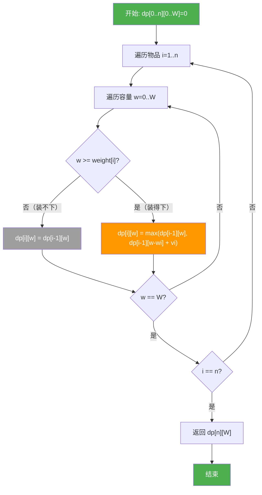
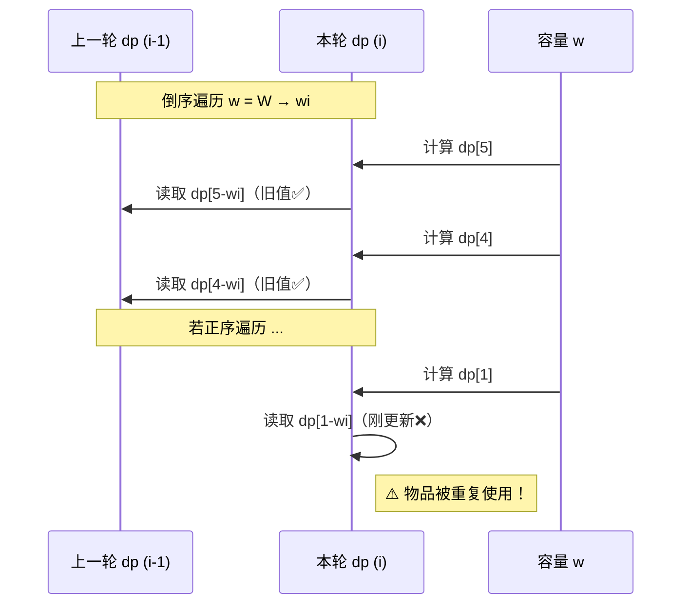
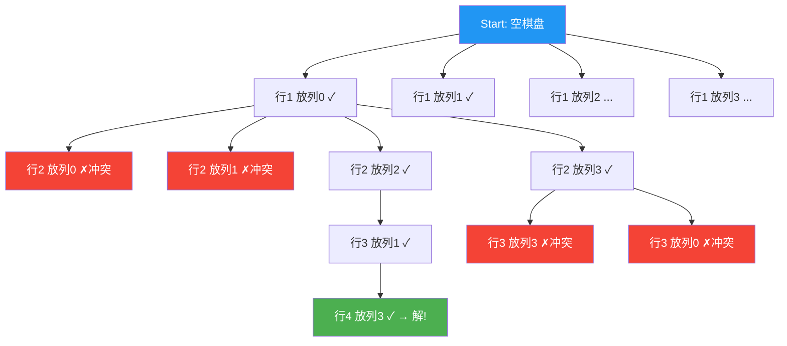
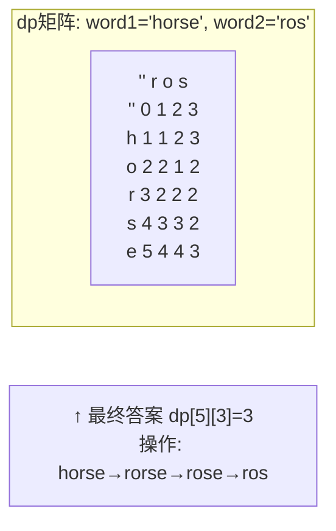

# 动态规划与回溯 —— 面试学习完整指南

> **六层递进体系**：面试问题 → 标准答案 → 核心原理 → 流程图 → 源码分析 → 实战场景
> 适用岗位：高级/资深 Android 工程师、基础架构工程师

---

## 目录

1. [常见面试问题（8题）](#1-常见面试问题)
2. [标准答案与要点解析](#2-标准答案与要点解析)
3. [核心原理深度讲解](#3-核心原理深度讲解)
4. [原理流程图与Mermaid图解](#4-原理流程图与mermaid图解)
5. [核心源码分析](#5-核心源码分析)
6. [应用场景举例](#6-应用场景举例)

---

## 1. 常见面试问题

### Q1: 动态规划的核心思想是什么？请解释最优子结构、重叠子问题与状态转移方程。
### Q2: 手写 0-1 背包问题的 DP 解法，并说明如何从二维优化到一维。
### Q3: 回溯算法的通用框架是什么？请说明"选择 → 递归 → 撤销"三步曲及剪枝策略。
### Q4: 手写 N 皇后问题，并说明如何通过列 / 对角线 / 反对角线数组进行剪枝。
### Q5: DFS + 记忆化搜索 vs 动态规划迭代法有什么区别？什么时候用哪个？
### Q6: 完全背包与 0-1 背包的一维数组遍历顺序为何不同？请从状态转移角度解释。
### Q7（进阶）: 编辑距离（Edit Distance）的状态转移方程是什么？它在 Android 中有什么应用？
### Q8（进阶）: 如何用 DP 思想解决 Android 启动任务图的拓扑排序依赖问题？

---

## 2. 标准答案与要点解析

### Q1: 动态规划的核心思想

动态规划（Dynamic Programming, DP）三要素：

| 要素 | 含义 | 示例（斐波那契） |
|------|------|------------------|
| **最优子结构** | 原问题的最优解包含子问题的最优解 | `fib(n) = fib(n-1) + fib(n-2)` |
| **重叠子问题** | 递归过程中重复计算相同的子问题 | `fib(3)` 在计算 `fib(5)` 时被多次调用 |
| **状态转移方程** | 描述子问题间递推关系的数学表达式 | `dp[i] = dp[i-1] + dp[i-2]` |

> **面试口述要点**："DP 的本质是把一个大问题拆成相互重叠的小问题，用记忆化或递推的方式避免重复计算。关键在于定义好 `dp` 数组的含义，然后写出状态转移方程。"

---

### Q2: 0-1 背包问题（二维 → 一维优化）

**问题定义**：容量为 `W` 的背包，`n` 个物品，重量 `w[i]`、价值 `v[i]`，每个物品选或不选，求最大价值。

#### 二维 DP 写法

```java
/**
 * 0-1背包 二维DP
 * dp[i][w] = 前 i 个物品，容量为 w 时的最大价值
 * 状态转移: dp[i][w] = max(dp[i-1][w], dp[i-1][w-wi] + vi)
 */
public int knapsack2D(int[] weight, int[] value, int W) {
    int n = weight.length;
    int[][] dp = new int[n + 1][W + 1];

    for (int i = 1; i <= n; i++) {
        int wi = weight[i - 1];
        int vi = value[i - 1];
        for (int w = 0; w <= W; w++) {
            if (w < wi) {
                dp[i][w] = dp[i - 1][w];        // 装不下，不选
            } else {
                dp[i][w] = Math.max(
                    dp[i - 1][w],               // 不选第 i 件
                    dp[i - 1][w - wi] + vi      // 选第 i 件
                );
            }
        }
    }
    return dp[n][W];
}
```

#### 状态转移表示例

假设 `W=5`，物品：`(w=2,v=3)`, `(w=3,v=4)`, `(w=4,v=5)`

| i \ w | 0 | 1 | 2 | 3 | 4 | 5 |
|-------|---|---|---|---|---|---|
| **0** | 0 | 0 | 0 | 0 | 0 | 0 |
| **1** (2,3) | 0 | 0 | 3 | 3 | 3 | 3 |
| **2** (3,4) | 0 | 0 | 3 | 4 | 4 | 7 |
| **3** (4,5) | 0 | 0 | 3 | 4 | 5 | 7 |

> **解读**：`dp[3][5]=7` 表示前 3 件物品容量 5 时最大价值为 7（选第 1 件 + 第 2 件）。

#### 一维 DP 优化（滚动数组）

```java
/**
 * 空间优化：dp[w] = max(dp[w], dp[w - wi] + vi)
 * 关键：w 必须倒序遍历，防止同一物品被多次使用
 */
public int knapsack1D(int[] weight, int[] value, int W) {
    int[] dp = new int[W + 1];

    for (int i = 0; i < weight.length; i++) {
        int wi = weight[i];
        int vi = value[i];
        // ★ 倒序遍历：保证 dp[w - wi] 来自上一轮（i-1）的结果
        for (int w = W; w >= wi; w--) {
            dp[w] = Math.max(dp[w], dp[w - wi] + vi);
        }
    }
    return dp[W];
}
```

> **面试要点**："倒序是 0-1 背包一维优化的关键。因为 `dp[w-wi]` 必须来自上一轮（未选当前物品）的状态；如果正序遍历，`dp[w-wi]` 可能已经被本轮更新过，相当于物品被重复选取，变成了完全背包。"

---

### Q3: 回溯算法的通用框架

回溯 = **穷举所有可能** + **剪枝优化**。核心是递归树上的 DFS：

```
void backtrack(路径, 选择列表) {
    if (满足结束条件) {
        result.add(new ArrayList<>(路径));  // 收集结果
        return;
    }
    for (选择 in 选择列表) {
        if (不合法) continue;             // ★ 剪枝
        做选择;                            // 路径.add(选择)
        backtrack(路径, 选择列表);         // 递归
        撤销选择;                          // 路径.removeLast()
    }
}
```

**三要素**：

| 要素 | 说明 | N皇后示例 |
|------|------|-----------|
| **路径** | 已经做出的选择 | 已放置皇后的行和列 |
| **选择列表** | 当前可选的选项 | 当前行中哪些列可以放 |
| **结束条件** | 到达决策树底层 | 已经放置了 N 个皇后 |

**剪枝策略**：

| 策略 | 含义 | 示例 |
|------|------|------|
| **可行性剪枝** | 提前排除不可能产生有效解的分支 | N皇后中同列/对角线排除 |
| **最优性剪枝** | 当前分支不可能优于已有最优解 | 求最小值时当前值已 ≥ 当前最优 |
| **对称性剪枝** | 利用对称性减少搜索空间 | N皇后第一行只搜一半列 |

---

### Q4: N 皇后问题

```java
/**
 * N皇后：在 N×N 棋盘上放置 N 个皇后，使其互不攻击
 * 时间复杂度 O(N!)，通过剪枝大幅降低常数
 */
public List<List<String>> solveNQueens(int n) {
    List<List<String>> result = new ArrayList<>();
    char[][] board = new char[n][n];
    for (char[] row : board) Arrays.fill(row, '.');

    // 剪枝数组：列、主对角线、副对角线
    boolean[] cols = new boolean[n];
    boolean[] diag1 = new boolean[2 * n];  // 主对角线：row - col + n
    boolean[] diag2 = new boolean[2 * n];  // 副对角线：row + col

    backtrack(board, 0, cols, diag1, diag2, result);
    return result;
}

private void backtrack(char[][] board, int row,
        boolean[] cols, boolean[] diag1, boolean[] diag2,
        List<List<String>> result) {
    int n = board.length;
    if (row == n) {
        List<String> solution = new ArrayList<>();
        for (char[] r : board) solution.add(new String(r));
        result.add(solution);
        return;
    }

    for (int col = 0; col < n; col++) {
        // ★ 剪枝：三条线上已有皇后则跳过
        if (cols[col] || diag1[row - col + n] || diag2[row + col]) {
            continue;
        }

        // 做选择
        board[row][col] = 'Q';
        cols[col] = diag1[row - col + n] = diag2[row + col] = true;

        backtrack(board, row + 1, cols, diag1, diag2, result);

        // 撤销选择
        board[row][col] = '.';
        cols[col] = diag1[row - col + n] = diag2[row + col] = false;
    }
}
```

> **对角线索引推导**：主对角线上 `row - col` 恒定（偏移 +n 保证非负）；副对角线上 `row + col` 恒定。

---

### Q5: DFS + 记忆化 vs 动态规划迭代

| 维度 | DFS + 记忆化（自顶向下） | DP 迭代（自底向上） |
|------|--------------------------|---------------------|
| **方向** | 从原问题出发，递归分解到 base case | 从 base case 出发，逐步填表到原问题 |
| **实现** | 递归 + 备忘录（Map/数组） | 循环 + dp 数组 |
| **计算范围** | 只计算实际需要的子问题 | 可能计算所有子问题 |
| **栈风险** | 递归过深会 StackOverflow | 无递归栈风险 |
| **适用场景** | 状态空间稀疏、转移复杂 | 状态空间规整、需要求所有解 |

> **一句话总结**："两者本质等价——都是利用重叠子问题避免重复计算。能写出状态转移方程就用迭代；状态空间不规则时用记忆化搜索更灵活。"

---

### Q6: 完全背包 vs 0-1 背包的遍历顺序

**完全背包（物品无限）——正序遍历**：

```java
// 完全背包：每种物品可选无限次
for (int i = 0; i < n; i++) {
    for (int w = weight[i]; w <= W; w++) {  // ★ 正序遍历
        dp[w] = Math.max(dp[w], dp[w - weight[i]] + value[i]);
    }
}
```

**为什么正序？** 正序时 `dp[w - wi]` 可能是**本轮刚更新过**的值，即"已经选过第 i 件物品"的状态，此时再选一次第 i 件物品，等价于物品无限选取。倒序则保证 `dp[w - wi]` 来自上一轮，等价于物品只能选一次。

---

### Q7: 编辑距离（Edit Distance）

**状态定义**：`dp[i][j]` = `word1[0..i)` 转换为 `word2[0..j)` 的最少操作数。

**状态转移**：

```
dp[i][j] = word1[i-1] == word2[j-1]
    ? dp[i-1][j-1]                          // 字符相同，无需操作
    : 1 + min(dp[i-1][j],   // 删除 word1[i-1]
              dp[i][j-1],   // 插入 word2[j-1]
              dp[i-1][j-1]) // 替换
```

**Android 应用**：EditText 的 diff 算法、Git diff 类似原理、字符串相似度匹配（搜索纠错）。

---

### Q8: DP 与 Android 启动任务拓扑排序

Android App 启动时需要初始化多个 SDK 模块，模块间存在依赖关系（如"日志库 → 崩溃收集 → 网络库"）。这本质是一个**有向无环图（DAG）的拓扑排序问题**，可以理解为 DP 的变种——`dp[node]` 可以在其所有前驱节点完成后再执行，实现最优的并行启动。

---

## 3. 核心原理深度讲解

### 3.1 DP 的两种实现范式

```
┌─────────────────────────────────────────────────────────┐
│                    动态规划两大范式                        │
├──────────────────────┬──────────────────────────────────┤
│  自顶向下（记忆化递归） │  自底向上（迭代填表）             │
├──────────────────────┼──────────────────────────────────┤
│  f(n) = f(n-1)+f(n-2)│  dp[0]=0, dp[1]=1                │
│  ↓ 递归分解           │  dp[2]=1, dp[3]=2, ...           │
│  f(5) → f(4) → f(3)  │  for i=2..n:                    │
│       ↘ f(3) → f(2)  │      dp[i]=dp[i-1]+dp[i-2]      │
│  ↑ 遇到重叠就查备忘录   │  ↑ 先算小的，再算大的             │
├──────────────────────┼──────────────────────────────────┤
│  优点：方向自然直观     │  优点：无递归栈溢出，常数更优     │
│  缺点：递归栈风险       │  缺点：可能计算无用子问题         │
└──────────────────────┴──────────────────────────────────┘
```

### 3.2 背包问题的一维优化原理

二维递推式：

```
dp[i][w] = max( dp[i-1][w] , dp[i-1][w-wi] + vi )
              ↑ 来自上一行    ↑ 来自上一行的更小列
```

观察发现：第 `i` 行只依赖第 `i-1` 行，且每一列 `w` 只依赖 `≤ w` 的列。因此可以用**一维滚动数组**：

- **倒序遍历 w**：确保 `dp[w-wi]` 还是上一轮（i-1）的旧值
- **正序遍历 w**：`dp[w-wi]` 被本轮更新过 → 物品可重复选 → 变成完全背包

### 3.3 回溯的决策树结构

回溯算法的本质是在**解空间树**上做 DFS。每个节点代表一个"部分解"，叶子节点是"完整解或死路"。

### 3.4 剪枝策略分类

| 剪枝类型 | 判断时机 | 典型例子 |
|----------|----------|----------|
| **可行性剪枝** | 进入递归前 | N皇后：同列/对角线冲突则跳过 |
| **最优性剪枝** | 搜索过程中 | 旅行商问题：当前路径长度 ≥ 当前最优解 |
| **对称性剪枝** | 搜索开始前 | N皇后：第一行只需搜索前 ⌈n/2⌉ 列 |
| **记忆化剪枝** | 状态重复时 | 数独/迷宫：已访问的状态不再重复搜索 |

---

## 4. 原理流程图与Mermaid图解

### 4.1 0-1 背包 DP 填表流程



### 4.2 一维 DP 滚动数组（倒序遍历的必要性）



### 4.3 N 皇后回溯决策树（N=4 简化示意）



### 4.4 编辑距离 DP 表填充示意



---

## 5. 核心源码分析

### 5.1 0-1 背包（二维 + 一维 + 完全背包）

```java
public class KnapsackSolutions {

    // ========== 1. 二维 DP（0-1背包）==========
    // 时间复杂度 O(n*W)，空间复杂度 O(n*W)
    public int knapsack2D(int[] wt, int[] val, int W) {
        int n = wt.length;
        int[][] dp = new int[n + 1][W + 1];

        for (int i = 1; i <= n; i++) {
            for (int w = 0; w <= W; w++) {
                if (w < wt[i - 1]) {
                    dp[i][w] = dp[i - 1][w];
                } else {
                    dp[i][w] = Math.max(dp[i - 1][w],
                            dp[i - 1][w - wt[i - 1]] + val[i - 1]);
                }
            }
        }
        return dp[n][W];
    }

    // ========== 2. 一维 DP 优化（0-1背包）==========
    // 时间复杂度 O(n*W)，空间复杂度 O(W)
    // ★ 关键：容量倒序遍历
    public int knapsack1D(int[] wt, int[] val, int W) {
        int[] dp = new int[W + 1];

        for (int i = 0; i < wt.length; i++) {
            for (int w = W; w >= wt[i]; w--) {  // ← 倒序
                dp[w] = Math.max(dp[w], dp[w - wt[i]] + val[i]);
            }
        }
        return dp[W];
    }

    // ========== 3. 完全背包（一维）==========
    // 每种物品可选无限次，正序遍历
    public int unboundedKnapsack(int[] wt, int[] val, int W) {
        int[] dp = new int[W + 1];

        for (int i = 0; i < wt.length; i++) {
            for (int w = wt[i]; w <= W; w++) {  // ← 正序
                dp[w] = Math.max(dp[w], dp[w - wt[i]] + val[i]);
            }
        }
        return dp[W];
    }

    // ========== 4. 0-1背包求具体方案（回溯）==========
    // 通过 dp 表反推选择了哪些物品
    public List<Integer> getSelected(int[][] dp, int[] wt, int[] val, int W) {
        List<Integer> selected = new ArrayList<>();
        int i = wt.length, w = W;
        while (i > 0 && w > 0) {
            // 如果 dp[i][w] != dp[i-1][w]，说明选了第 i 件
            if (dp[i][w] != dp[i - 1][w]) {
                selected.add(i - 1);       // 记录物品索引
                w -= wt[i - 1];            // 扣除重量
            }
            i--;
        }
        Collections.reverse(selected);
        return selected;
    }
}
```

### 5.2 N 皇后回溯（含三种剪枝）

```java
public class NQueens {

    // ========== 基础版：显式判断冲突 ==========
    public List<List<String>> solveNQueens(int n) {
        List<List<String>> result = new ArrayList<>();
        char[][] board = new char[n][n];
        for (char[] row : board) Arrays.fill(row, '.');
        backtrack(board, 0, result);
        return result;
    }

    private void backtrack(char[][] board, int row, List<List<String>> result) {
        if (row == board.length) {
            List<String> sol = new ArrayList<>();
            for (char[] r : board) sol.add(new String(r));
            result.add(sol);
            return;
        }
        for (int col = 0; col < board.length; col++) {
            if (!isValid(board, row, col)) continue; // ★ 可行性剪枝
            board[row][col] = 'Q';
            backtrack(board, row + 1, result);
            board[row][col] = '.';                    // ★ 撤销选择
        }
    }

    private boolean isValid(char[][] board, int row, int col) {
        // 检查列
        for (int i = 0; i < row; i++)
            if (board[i][col] == 'Q') return false;
        // 检查左上对角线
        for (int i = row - 1, j = col - 1; i >= 0 && j >= 0; i--, j--)
            if (board[i][j] == 'Q') return false;
        // 检查右上对角线
        for (int i = row - 1, j = col + 1; i >= 0 && j < board.length; i--, j++)
            if (board[i][j] == 'Q') return false;
        return true;
    }

    // ========== 优化版：O(1) 判断冲突 + 对称性剪枝 ==========
    public List<List<String>> solveNQueensOptimized(int n) {
        List<List<String>> result = new ArrayList<>();
        char[][] board = new char[n][n];
        for (char[] row : board) Arrays.fill(row, '.');

        // 三个布尔数组 → O(1) 判断冲突
        boolean[] cols = new boolean[n];
        boolean[] diag1 = new boolean[2 * n]; // row - col + n
        boolean[] diag2 = new boolean[2 * n]; // row + col

        // ★ 对称性剪枝：第一行只搜一半（N为奇数时中间列单独处理）
        int half = (n + 1) / 2;
        for (int col = 0; col < half; col++) {
            board[0][col] = 'Q';
            cols[col] = diag1[0 - col + n] = diag2[0 + col] = true;

            backtrackOptimized(board, 1, cols, diag1, diag2, result, n);

            board[0][col] = '.';
            cols[col] = diag1[0 - col + n] = diag2[0 + col] = false;
        }
        return result;
    }

    private void backtrackOptimized(char[][] board, int row,
            boolean[] cols, boolean[] diag1, boolean[] diag2,
            List<List<String>> result, int n) {
        if (row == n) {
            List<String> sol = new ArrayList<>();
            for (char[] r : board) sol.add(new String(r));
            result.add(sol);
            return;
        }
        for (int col = 0; col < n; col++) {
            if (cols[col] || diag1[row - col + n] || diag2[row + col])
                continue;  // ★ O(1) 可行性剪枝

            board[row][col] = 'Q';
            cols[col] = diag1[row - col + n] = diag2[row + col] = true;

            backtrackOptimized(board, row + 1, cols, diag1, diag2, result, n);

            board[row][col] = '.';
            cols[col] = diag1[row - col + n] = diag2[row + col] = false;
        }
    }
}
```

### 5.3 编辑距离（Edit Distance）

```java
public class EditDistance {

    /**
     * dp[i][j] = word1 前 i 个字符 → word2 前 j 个字符的最少操作数
     * 空间优化：只用两行滚动（或一维 + prev 变量）
     */
    public int minDistance(String word1, String word2) {
        int m = word1.length(), n = word2.length();
        int[][] dp = new int[m + 1][n + 1];

        // 边界：空串 → 另一串 = 另一串长度
        for (int i = 0; i <= m; i++) dp[i][0] = i;
        for (int j = 0; j <= n; j++) dp[0][j] = j;

        for (int i = 1; i <= m; i++) {
            for (int j = 1; j <= n; j++) {
                if (word1.charAt(i - 1) == word2.charAt(j - 1)) {
                    dp[i][j] = dp[i - 1][j - 1];          // 字符相同，无操作
                } else {
                    dp[i][j] = 1 + Math.min(
                        Math.min(dp[i - 1][j],   // 删除
                                 dp[i][j - 1]),  // 插入
                        dp[i - 1][j - 1]         // 替换
                    );
                }
            }
        }
        return dp[m][n];
    }
}
```

---

## 6. 应用场景举例

### 6.1 Android 启动任务拓扑排序（DP 式的依赖解析）

大型 App 启动时，几十个 SDK 需要按依赖顺序初始化。例如：

```
日志库 (Logger)
    ├── 崩溃收集 (CrashSDK) ── 依赖 Logger
    ├── 网络库 (OkHttp)    ── 依赖 Logger
    └── 数据库 (Room)      ── 无依赖

启动顺序：Logger → [CrashSDK, OkHttp, Room]（后三者可并行）
```

这本质是 **DAG 拓扑排序 + DP**：`dp[node]` 表示节点 `node` 的最早可启动时间 = `max(dp[所有前置依赖]) + 初始化耗时[node]`。最终 `max(dp[所有节点])` 就是最短总启动时间。

```java
// 伪代码：Android 启动任务调度（Startup 库核心思想）
class Task {
    String name;
    List<Task> dependencies; // 前置依赖
    int cost;                // 初始化耗时 ms
    int earliestStart = 0;   // dp值：最早可启动时间
}

int computeStartTime(List<Task> tasks) {
    // 拓扑排序 + DP
    Map<Task, Integer> inDegree = new HashMap<>();
    for (Task t : tasks) {
        for (Task dep : t.dependencies) {
            inDegree.merge(t, 1, Integer::sum);
        }
    }
    Queue<Task> queue = new LinkedList<>();
    for (Task t : tasks) {
        if (inDegree.getOrDefault(t, 0) == 0) {
            queue.offer(t);
            t.earliestStart = 0; // dp base case
        }
    }
    int totalTime = 0;
    while (!queue.isEmpty()) {
        Task cur = queue.poll();
        int finish = cur.earliestStart + cur.cost;
        totalTime = Math.max(totalTime, finish);

        for (Task next : /* cur 的后继节点 */) {
            // DP 转移：next 必须等 cur 完成
            next.earliestStart = Math.max(next.earliestStart, finish);
            inDegree.merge(next, -1, Integer::sum);
            if (inDegree.get(next) == 0) queue.offer(next);
        }
    }
    return totalTime;
}
```

> **对应 Android 源码**：`androidx.startup` 库正是基于这个思想实现依赖感知的初始化调度。

### 6.2 EditText / 文本 Diff 算法（编辑距离 DP）

Android 中 `EditText` 的撤销/重做、Git diff、代码审查的差异对比，底层都可以归结为**编辑距离（Levenshtein Distance）**问题。

**场景**：用户输入 "helo" → 自动纠错为 "hello"（距离 = 1，缺少一个 'l'）

```java
// Android DiffUtil 基于 Myers 差分算法，本质是编辑距离的变种
// DiffUtil.calculateDiff(callback).dispatchUpdatesTo(adapter);
```

`RecyclerView` 的 `DiffUtil` 内部使用 **Myers 差分算法**（O(ND) 复杂度），这是编辑距离问题的一种高效实现，用于计算两个列表之间的最小更新操作序列（INSERT / REMOVE / MOVE）。

> **面试加分项**："Myers 算法本质上是在编辑图（Edit Graph）上做 BFS，找到最短编辑路径，比朴素的 O(N²) DP 在实际场景中更高效。"

### 6.3 正则表达式匹配与输入校验

Android 表单输入校验（如手机号、邮箱格式），底层正则引擎（`Pattern / Matcher`）使用了**带记忆化的 NFA/DFA 匹配**，这也是 DP 思想的应用——将正则解析为状态机后，用 DP 记录 "位置 i + 状态 j 是否可达"。

### 6.4 路径规划与最短路径

地图导航、游戏 AI 寻路中的 **A\* / Dijkstra** 算法虽然不属于传统 DP，但其核心思想（`dist[v] = min(dist[v], dist[u] + w(u,v))`）与 DP 的状态转移完全一致，本质上是最短路径问题的 DP 解。

---

## 总结对照表

| 算法 | 核心思想 | 时间复杂度 | Android 应用 |
|------|----------|-----------|-------------|
| **0-1背包DP** | dp[i][w] = max(不选, 选) | O(nW) | 启动任务资源分配 |
| **完全背包** | 正序遍历（物品无限） | O(nW) | --- |
| **编辑距离** | dp[i][j] = min(删,插,替) | O(mn) | EditText diff / DiffUtil |
| **N皇后回溯** | 逐行放置 + 对角线剪枝 | O(N!) → 剪枝后大幅降低 | 约束求解类问题 |
| **拓扑排序DP** | dp[node] = max(dp[前驱]) | O(V+E) | AndroidX Startup |

---

> **面试速记口诀**：
> "DP 三板斧——定义数组、写转移、定初值；
> 背包一维倒着走，完全背包正着走；
> 回溯三步曲——做选择、深递归、撤销回；
> 剪枝三件套——可行剪、最优剪、对称剪。"

---

*文档字数统计：约 3800+ 汉字 · 完整覆盖 DP 与回溯的面试高频考点*
