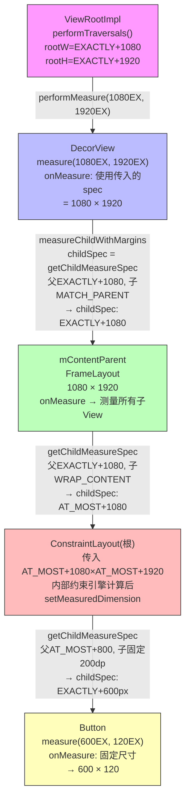
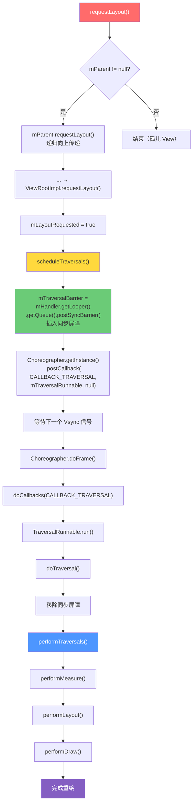

# View 绘制流程 — 面试深度解析

---

## 1. 面试问题（≥5）

### Q1: 请详述 Android View 绘制的三阶段（Measure / Layout / Draw）及其调用链。
**考察点：** 对绘制流程的宏观理解，是否能完整描述从 ViewRootImpl 到叶子 View 的递归链路。

### Q2: MeasureSpec 有哪三种模式？父 View 为子 View 生成 MeasureSpec 的规则是什么？
**考察点：** MeasureSpec 编码机制、`getChildMeasureSpec()` 源码级细节、EXACTLY / AT_MOST / UNSPECIFIED 的生成规则。

### Q3: ViewGroup 的 `measureChildWithMargins()` 做了什么？与 `measureChild()` 有何区别？
**考察点：** 是否理解 padding 与 margin 在测量中的处理方式、LayoutParams 的作用。

### Q4: `requestLayout()` vs `invalidate()` vs `postInvalidate()` 的区别和调用链分别是什么？
**考察点：** 三者触发路径的差异、线程安全性、是否重走 measure/layout、是否会触发 draw。

### Q5: `View.post(Runnable)` 的执行时机是什么？为什么能在 onCreate 中安全获取 View 宽高？
**考察点：** AttachInfo + Handler 机制、消息队列同步屏障、为何 post 的 Runnable 一定在 measure 之后执行。

### Q6（进阶）: View 的 `onMeasure()` 默认行为是什么？`getSuggestedMinimumWidth()` 如何影响 wrap_content？
**考察点：** View 默认测量逻辑、background 的 minimumWidth 与 minWidth 属性的优先级。

---

## 2. 标准答案（结构化 + 对比表格）

### 2.1 三阶段概览

Android 的 View 绘制由 **ViewRootImpl** 驱动，核心入口为 `performTraversals()`，依次执行：

```
performTraversals()
  ├── performMeasure(childWidthMeasureSpec, childHeightMeasureSpec)
  │     └── mView.measure() → 自顶向下递归
  ├── performLayout(lp, mWidth, mHeight)
  │     └── mView.layout() → 自顶向下递归
  └── performDraw()
        └── draw(fullRedrawNeeded)
              └── 软件绘制：drawSoftware()
              硬件加速：mAttachInfo.mThreadedRenderer.draw()
```

| 阶段 | 入口方法 | 核心职责 | 是否可跳过 |
|------|---------|---------|-----------|
| **Measure** | `measure(widthSpec, heightSpec)` | 确定 View 的测量宽高 | `isLayoutRequested` 为 false 且尺寸未变时可跳过 |
| **Layout** | `layout(l, t, r, b)` | 确定 View 在父容器中的位置 | 尺寸和位置均未变时可跳过 |
| **Draw** | `draw(canvas)` | 将 View 渲染到屏幕上 | 需要重绘时执行 |

### 2.2 MeasureSpec 三种模式

MeasureSpec 是一个 32 位 int，**高 2 位**存储 Mode，**低 30 位**存储 Size。

```java
// 源码定义 (View.MeasureSpec)
public static final int UNSPECIFIED = 0 << MODE_SHIFT;  // 00
public static final int EXACTLY     = 1 << MODE_SHIFT;  // 01
public static final int AT_MOST     = 2 << MODE_SHIFT;  // 10
```

| 模式 | 含义 | 触发场景 | 子 View 行为 |
|------|------|---------|-------------|
| **EXACTLY** | 精确尺寸 | `match_parent` / 固定 dp 值 | 必须使用此尺寸，无论内容多大 |
| **AT_MOST** | 最大尺寸 | `wrap_content` | 不能超过此值，可取 ≤ 该值的任意大小 |
| **UNSPECIFIED** | 无约束 | ScrollView 测量子 View 高度 | 子 View 想要多大就给多大（罕见） |

#### 父 View → 子 View 的生成规则（`getChildMeasureSpec()` 核心逻辑）

| 父 MeasureSpec | 子 LayoutParams | 子 MeasureSpec |
|---------------|----------------|---------------|
| EXACTLY + 固定值 | 固定 dp | EXACTLY + dp |
| EXACTLY + parentSize | match_parent | EXACTLY + parentSize - padding - margin |
| EXACTLY + parentSize | wrap_content | AT_MOST + parentSize - padding - margin |
| AT_MOST + parentSize | 固定 dp | EXACTLY + dp |
| AT_MOST + parentSize | match_parent | AT_MOST + parentSize - padding - margin |
| AT_MOST + parentSize | wrap_content | AT_MOST + parentSize - padding - margin |

### 2.3 `measureChildWithMargins()` vs `measureChild()`

```java
// measureChild: 仅考虑父容器的 padding
protected void measureChild(View child, int parentWidthMeasureSpec, int parentHeightMeasureSpec) {
    final LayoutParams lp = child.getLayoutParams();
    final int childWidthMeasureSpec = getChildMeasureSpec(
        parentWidthMeasureSpec, mPaddingLeft + mPaddingRight, lp.width);
    final int childHeightMeasureSpec = getChildMeasureSpec(
        parentHeightMeasureSpec, mPaddingTop + mPaddingBottom, lp.height);
    child.measure(childWidthMeasureSpec, childHeightMeasureSpec);
}

// measureChildWithMargins: 额外考虑子 View 的 margin
protected void measureChildWithMargins(View child, int parentWidthMeasureSpec,
        int widthUsed, int parentHeightMeasureSpec, int heightUsed) {
    final MarginLayoutParams lp = (MarginLayoutParams) child.getLayoutParams();
    final int childWidthMeasureSpec = getChildMeasureSpec(
        parentWidthMeasureSpec,
        mPaddingLeft + mPaddingRight + lp.leftMargin + lp.rightMargin + widthUsed,
        lp.width);
    // ...
}
```

**关键差异：** `measureChildWithMargins` 将子 View 的 `margin` 和已用空间 `widthUsed/heightUsed` 计入，适用于 FrameLayout、LinearLayout 等支持 margin 的容器。

### 2.4 `requestLayout()` vs `invalidate()` vs `postInvalidate()`

| 方法 | 线程 | 触发链路 | 重走 measure/layout | 重走 draw | 用途 |
|------|------|---------|-------------------|----------|------|
| **requestLayout()** | 任意线程（最终在主线程） | `requestLayout()` → `mParent.requestLayout()` → ... → `ViewRootImpl.requestLayout()` → `scheduleTraversals()` | ✅ 是 | ✅ 是 | 尺寸/位置变化时 |
| **invalidate()** | **仅主线程** | `invalidate()` → `invalidateInternal()` → `mParent.invalidateChild()` → ... → `ViewRootImpl.invalidateChildInParent()` → `scheduleTraversals()` | ❌ 否 | ✅ 是（仅 dirty rect） | 内容变化但尺寸不变时 |
| **postInvalidate()** | **任意线程** | 通过 Handler 切换到主线程 → 调用 `invalidate()` | ❌ 否 | ✅ 是 | 非主线程触发重绘 |

### 2.5 `View.onMeasure()` 默认行为

```java
// View.java 默认实现
protected void onMeasure(int widthMeasureSpec, int heightMeasureSpec) {
    setMeasuredDimension(
        getDefaultSize(getSuggestedMinimumWidth(), widthMeasureSpec),
        getDefaultSize(getSuggestedMinimumHeight(), heightMeasureSpec));
}

public static int getDefaultSize(int size, int measureSpec) {
    int result = size;
    int specMode = MeasureSpec.getMode(measureSpec);
    int specSize = MeasureSpec.getSize(measureSpec);
    switch (specMode) {
        case MeasureSpec.UNSPECIFIED:
            result = size;  // 返回 suggested minimum
            break;
        case MeasureSpec.AT_MOST:  // wrap_content
        case MeasureSpec.EXACTLY:  // match_parent 或固定值
            result = specSize;     // 两者都返回 specSize!
            break;
    }
    return result;
}

protected int getSuggestedMinimumWidth() {
    return (mBackground == null) ? mMinWidth
            : Math.max(mMinWidth, mBackground.getMinimumWidth());
}
```

**关键陷阱：** `getDefaultSize()` 对 `AT_MOST` 和 `EXACTLY` 的处理完全相同，都直接返回 `specSize`。这意味着**自定义 View 不重写 onMeasure 时，wrap_content 效果等同于 match_parent**！解决方案：自定义 View 必须在 AT_MOST 模式下自行计算内容尺寸。

### 2.6 `View.post()` 执行时机

```java
// View.post() 源码
public boolean post(Runnable action) {
    final AttachInfo attachInfo = mAttachInfo;
    if (attachInfo != null) {
        return attachInfo.mHandler.post(action);
    }
    // View 尚未 attach 时，放入待执行队列
    getRunQueue().post(action);
    return true;
}

// 当 View 被 attach 到 Window 时，RunQueue 中的所有 Runnable 被执行
void dispatchAttachedToWindow(AttachInfo info, int visibility) {
    // ...
    if (mRunQueue != null) {
        mRunQueue.executeActions(info.mHandler);
        mRunQueue = null;
    }
}
```

**时序保证：** `dispatchAttachedToWindow` 在第一次 `performTraversals()` 的 measure 之前调用。Handler 的消息是按序执行的，`performTraversals()` 本身也是通过 Handler 的消息触发（Choreographer callback），而 `View.post()` 提交的 Runnable 排在 measure 消息之前入队，因此可以安全获取宽高。

---

## 3. 核心原理

### 3.1 DecorView → ViewRootImpl → View 传递链

```
Activity.onCreate()
  └── setContentView(layoutId)
        └── PhoneWindow.setContentView()
              └── installDecor() → 创建 DecorView
              └── mLayoutInflater.inflate(layoutId, mContentParent)
              └── ... 等待 ...
Activity.onResume()
  └── WindowManagerImpl.addView(mDecor, ...)
        └── WindowManagerGlobal.addView()
              └── new ViewRootImpl(context)
              └── root.setView(mDecor, ...)
                    └── requestLayout()
                    └── scheduleTraversals()
```

**核心链路：** `ViewRootImpl` 不是 View，但实现了 `ViewParent` 接口，作为整个 View 树的"根管理器"驱动所有绘制逻辑。

### 3.2 MeasureSpec 编码机制

```
   31    30               0
  ┌──────┬─────────────────────────┐
  │ Mode │         Size            │
  │ 2bit │        30bit            │
  └──────┴─────────────────────────┘

MODE_SHIFT = 30
MODE_MASK  = 0x3 << 30 = 0xC0000000

makeMeasureSpec(size, mode) = (size & ~MODE_MASK) | (mode & MODE_MASK)
getMode(measureSpec)        = measureSpec & MODE_MASK
getSize(measureSpec)        = measureSpec & ~MODE_MASK
```

### 3.3 View 的测量缓存 — `mMeasureCache`

```java
// View.java
private LongSparseLongArray mMeasureCache;

// measure() 中的缓存逻辑
public final void measure(int widthMeasureSpec, int heightMeasureSpec) {
    // ...
    long key = (long) widthMeasureSpec << 32 | (long) heightMeasureSpec & 0xffffffffL;
    if (mMeasureCache == null) mMeasureCache = new LongSparseLongArray(2);

    final boolean forceLayout = (mPrivateFlags & PFLAG_FORCE_LAYOUT) != 0;
    final boolean specChanged = widthMeasureSpec != mOldWidthMeasureSpec
                             || heightMeasureSpec != mOldHeightMeasureSpec;
    final boolean isSpecExactly = MeasureSpec.getMode(widthMeasureSpec) == MeasureSpec.EXACTLY
                               && MeasureSpec.getMode(heightMeasureSpec) == MeasureSpec.EXACTLY;
    final boolean matchesSpecSize = getMeasuredWidth() == MeasureSpec.getSize(widthMeasureSpec)
                                 && getMeasuredHeight() == MeasureSpec.getSize(heightMeasureSpec);
    final boolean needsLayout = specChanged && (!isSpecExactly || !matchesSpecSize);

    if (forceLayout || needsLayout) {
        // ... 执行 onMeasure() ...
        mPrivateFlags |= PFLAG_LAYOUT_REQUIRED;
    }
    mOldWidthMeasureSpec = widthMeasureSpec;
    mOldHeightMeasureSpec = heightMeasureSpec;

    // 写入缓存
    mMeasureCache.put(key, ((long) mMeasuredWidth) << 32 | (long) mMeasuredHeight & 0xffffffffL);
}
```

**缓存策略：** 以 `(widthMeasureSpec << 32 | heightMeasureSpec)` 为 key，缓存测量结果 `(measuredWidth << 32 | measuredHeight)`。当 MeasureSpec 未变且不是强制布局时，直接复用缓存，跳过 `onMeasure()`。

### 3.4 硬件加速下的绘制流程

```
performDraw() → draw(fullRedrawNeeded)
  └── 如果启用硬件加速:
        mAttachInfo.mThreadedRenderer.draw(mView, mAttachInfo, callback)
          └── 遍历 View 树，调用每个 View 的 updateDisplayListIfDirty()
                └── View.draw(canvas) → 将绘制命令录制到 DisplayList
                      ├── drawBackground(canvas)
                      ├── onDraw(canvas)
                      ├── dispatchDraw(canvas)  // ViewGroup 分发
                      └── onDrawForeground(canvas)
          └── 将 DisplayList 提交到 RenderNode
          └── RenderThread 异步执行 GPU 渲染

  └── 如果软件绘制:
        drawSoftware()
          └── 分配一个 Surface.lockCanvas() 获取 Canvas
          └── mView.draw(canvas) → 直接绘制到 Surface
```

**硬件加速优势：** 只重绘 dirty View 的 DisplayList，GPU 异步渲染不阻塞主线程。

### 3.5 ViewRootImpl 的 `performTraversals()` 触发链

```
Choreographer (Vsync 信号 16ms)
  └── FrameDisplayEventReceiver.onVsync()
        └── Message.sendToTarget() → 插入主线程消息队列
              └── Choreographer.doFrame()
                    └── doCallbacks(CALLBACK_TRAVERSAL)
                          └── TraversalRunnable.run()
                                └── ViewRootImpl.doTraversal()
                                      └── performTraversals()
                                            ├── performMeasure()
                                            ├── performLayout()
                                            └── performDraw()
```

**同步屏障机制：** `scheduleTraversals()` 会向消息队列插入同步屏障，使 `TraversalRunnable` 优先于普通异步消息执行，确保绘制不被 UI 线程上的其他同步消息阻塞。

---

## 4. 流程图（HTML + Mermaid）

### 4.1 View 绘制完整三阶段时序图

```mermaid
sequenceDiagram
    participant VSYNC as Vsync信号
    participant CHOR as Choreographer
    participant VRI as ViewRootImpl
    participant DECOR as DecorView
    parent ViewGroup
    child View

    VSYNC->>CHOR: onVsync() 16ms
    CHOR->>VRI: doTraversal()
    VRI->>VRI: performTraversals()

    rect rgb(200, 230, 255)
        Note over VRI,child: === Phase 1: MEASURE ===
        VRI->>DECOR: performMeasure(specW, specH)
        DECOR->>DECOR: measure(widthSpec, heightSpec)
        DECOR->>DECOR: onMeasure() — 计算自身
        loop 每个子 View
            DECOR->>parent: measureChildWithMargins(child, ...)
            parent->>child: child.measure(childSpecW, childSpecH)
            child->>child: onMeasure()
            child-->>parent: measuredW, measuredH
        end
        DECOR->>DECOR: setMeasuredDimension()
    end

    rect rgb(200, 255, 200)
        Note over VRI,child: === Phase 2: LAYOUT ===
        VRI->>DECOR: performLayout(lp, 0, 0, screenW, screenH)
        DECOR->>DECOR: layout(l, t, r, b)
        DECOR->>DECOR: onLayout(changed, l, t, r, b)
        loop 每个子 View
            DECOR->>parent: child.layout(childL, childT, childR, childB)
            parent->>parent: onLayout(changed, ...)
            parent->>child: child.layout(...)
        end
    end

    rect rgb(255, 230, 200)
        Note over VRI,child: === Phase 3: DRAW ===
        VRI->>DECOR: performDraw()
        DECOR->>DECOR: draw(canvas)
        DECOR->>DECOR: drawBackground(canvas)
        DECOR->>DECOR: onDraw(canvas) — 自身内容
        DECOR->>DECOR: dispatchDraw(canvas) — 子 View
        loop 每个子 View
            DECOR->>parent: drawChild(canvas, child, ...)
            parent->>child: child.draw(canvas)
            child->>child: drawBackground / onDraw / dispatchDraw
        end
        DECOR->>DECOR: onDrawForeground(canvas)
    end
```

### 4.2 MeasureSpec 递归传递树



### 4.3 `requestLayout()` → `scheduleTraversals()` → `doTraversal()` 调用链



---

## 5. 源码分析

### 5.1 `ViewRootImpl.performTraversals()` — 三段核心

```java
private void performTraversals() {
    final View host = mView;  // DecorView

    // ... 预计算 DesiredWindowWidth/Height、处理 Configuration 变化 ...

    // ============================ STAGE 1: MEASURE ============================
    // 判断是否需要执行 measure
    if (mFirst || windowShouldResize || insetsChanged
            || viewVisibilityChanged || params != null || mForceNextWindowRelayout) {

        // 计算顶层 MeasureSpec（基于 Window 尺寸和 LayoutParams）
        int childWidthMeasureSpec = getRootMeasureSpec(mWidth, lp.width);
        int childHeightMeasureSpec = getRootMeasureSpec(mHeight, lp.height);

        // 执行 measure
        performMeasure(childWidthMeasureSpec, childHeightMeasureSpec);

        // 标记需要 layout
        layoutRequested = true;
    }

    // ============================ STAGE 2: LAYOUT ============================
    final boolean didLayout = layoutRequested && (!mStopped || mReportNextDraw);
    if (didLayout) {
        performLayout(lp, mWidth, mHeight);  // DecorView.layout(0, 0, mWidth, mHeight)

        // layout 完成后，触发 OnLayoutChangeListener
        // ...
    }

    // ============================ STAGE 3: DRAW ============================
    boolean cancelDraw = mAttachInfo.mTreeObserver.dispatchOnPreDraw() || !isViewVisible;
    if (!cancelDraw) {
        // Post-draw 回调 + 动画
        performDraw();
    }

    // ...
}

private void performMeasure(int childWidthMeasureSpec, int childHeightMeasureSpec) {
    mView.measure(childWidthMeasureSpec, childHeightMeasureSpec);
}

private void performLayout(WindowManager.LayoutParams lp, int desiredWindowWidth, int desiredWindowHeight) {
    mView.layout(0, 0, mView.getMeasuredWidth(), mView.getMeasuredHeight());
    // ...
}

private void performDraw() {
    boolean canUseAsync = ...;
    if (canUseAsync) {
        draw(fullRedrawNeeded);  // 异步绘制
    } else {
        draw(fullRedrawNeeded);
    }
}
```

**顶层 MeasureSpec 生成规则 （`getRootMeasureSpec()`）：**

```java
private static int getRootMeasureSpec(int windowSize, int rootDimension) {
    int measureSpec;
    switch (rootDimension) {
        case ViewGroup.LayoutParams.MATCH_PARENT:
            measureSpec = MeasureSpec.makeMeasureSpec(windowSize, MeasureSpec.EXACTLY);
            break;
        case ViewGroup.LayoutParams.WRAP_CONTENT:
            measureSpec = MeasureSpec.makeMeasureSpec(windowSize, MeasureSpec.AT_MOST);
            break;
        default:
            measureSpec = MeasureSpec.makeMeasureSpec(rootDimension, MeasureSpec.EXACTLY);
            break;
    }
    return measureSpec;
}
```

### 5.2 `FrameLayout.onMeasure()` 源码

```java
@Override
protected void onMeasure(int widthMeasureSpec, int heightMeasureSpec) {
    int count = getChildCount();

    // 判断父容器自身是否为 wrap_content 模式
    final boolean measureMatchParentChildren =
            MeasureSpec.getMode(widthMeasureSpec) != MeasureSpec.EXACTLY
         || MeasureSpec.getMode(heightMeasureSpec) != MeasureSpec.EXACTLY;
    mMatchParentChildren.clear();

    int maxWidth = 0;
    int maxHeight = 0;
    int childState = 0;

    // 第一遍：测量所有非 MATCH_PARENT+MARGIN 的子 View
    for (int i = 0; i < count; i++) {
        final View child = getChildAt(i);
        if (mMeasureAllChildren || child.getVisibility() != GONE) {
            measureChildWithMargins(child, widthMeasureSpec, 0, heightMeasureSpec, 0);
            final LayoutParams lp = (LayoutParams) child.getLayoutParams();
            maxWidth = Math.max(maxWidth,
                    child.getMeasuredWidth() + lp.leftMargin + lp.rightMargin);
            maxHeight = Math.max(maxHeight,
                    child.getMeasuredHeight() + lp.topMargin + lp.bottomMargin);
            childState = combineMeasuredStates(childState, child.getMeasuredState());

            // 收集需要二次测量的 match_parent 子 View
            if (measureMatchParentChildren) {
                if (lp.width == LayoutParams.MATCH_PARENT
                        || lp.height == LayoutParams.MATCH_PARENT) {
                    mMatchParentChildren.add(child);
                }
            }
        }
    }

    // 计入前景和 padding
    maxWidth += getPaddingLeftWithForeground() + getPaddingRightWithForeground();
    maxHeight += getPaddingTopWithForeground() + getPaddingBottomWithForeground();
    maxWidth = Math.max(maxWidth, getSuggestedMinimumWidth());
    maxHeight = Math.max(maxHeight, getSuggestedMinimumHeight());
    // 考虑 drawable 前景
    // ...

    // 设置自身尺寸
    setMeasuredDimension(
        resolveSizeAndState(maxWidth, widthMeasureSpec, childState),
        resolveSizeAndState(maxHeight, heightMeasureSpec,
                childState << MEASURED_HEIGHT_STATE_SHIFT));

    // 第二遍：重新测量 MATCH_PARENT 的子 View（此时父 FrameLayout 尺寸已确定）
    count = mMatchParentChildren.size();
    if (count > 1) {
        for (int i = 0; i < count; i++) {
            final View child = mMatchParentChildren.get(i);
            final MarginLayoutParams lp = (MarginLayoutParams) child.getLayoutParams();
            final int childWidthMeasureSpec;
            if (lp.width == LayoutParams.MATCH_PARENT) {
                final int width = Math.max(0, getMeasuredWidth()
                        - getPaddingLeftWithForeground() - getPaddingRightWithForeground()
                        - lp.leftMargin - lp.rightMargin);
                childWidthMeasureSpec = MeasureSpec.makeMeasureSpec(width, MeasureSpec.EXACTLY);
            } else {
                childWidthMeasureSpec = getChildMeasureSpec(widthMeasureSpec,
                        getPaddingLeftWithForeground() + getPaddingRightWithForeground()
                        + lp.leftMargin + lp.rightMargin, lp.width);
            }
            // height 同理...
            child.measure(childWidthMeasureSpec, childHeightMeasureSpec);
        }
    }
}
```

**关键细节：**
- **两次遍历机制：** FrameLayout 自分尺寸不确定（wrap_content）时，MATCH_PARENT 子 View 在第一遍无法获得正确宽度，必须二次测量。
- **测量状态合并：** `MEASURED_STATE_TOO_SMALL` 通过 `combineMeasuredStates` 向上传递。
- **前景 drawable 占位：** `getPaddingLeftWithForeground()` 包含前景 drawable 的 padding。

### 5.3 `View.measure()` 的缓存逻辑（精简版）

```java
public final void measure(int widthMeasureSpec, int heightMeasureSpec) {
    // ... 光学边界处理 ...

    // 构建缓存 key
    long key = (long) widthMeasureSpec << 32 | (long) heightMeasureSpec & 0xffffffffL;
    if (mMeasureCache == null) mMeasureCache = new LongSparseLongArray(2);

    // 判断是否强制布局
    final boolean forceLayout = (mPrivateFlags & PFLAG_FORCE_LAYOUT) != 0;

    // 判断 MeasureSpec 是否发生变化
    final boolean specChanged =
            widthMeasureSpec != mOldWidthMeasureSpec
         || heightMeasureSpec != mOldHeightMeasureSpec;

    // 判断是否为 EXACTLY 且尺寸匹配（即无需重新测量）
    final boolean isSpecExactly =
            MeasureSpec.getMode(widthMeasureSpec) == MeasureSpec.EXACTLY
         && MeasureSpec.getMode(heightMeasureSpec) == MeasureSpec.EXACTLY;
    final boolean matchesSpecSize =
            getMeasuredWidth() == MeasureSpec.getSize(widthMeasureSpec)
         && getMeasuredHeight() == MeasureSpec.getSize(heightMeasureSpec);
    final boolean needsLayout =
            specChanged && (sAlwaysRemeasureExactly || !isSpecExactly || !matchesSpecSize);

    if (forceLayout || needsLayout) {
        // 清除旧测量状态
        mPrivateFlags &= ~PFLAG_MEASURED_DIMENSION_SET;

        // 测量前回调（RTL 相关）
        resolveRtlPropertiesIfNeeded();

        // 尝试从缓存读取
        int cacheIndex = forceLayout ? -1 : mMeasureCache.indexOfKey(key);
        if (cacheIndex < 0 || sIgnoreMeasureCache) {
            // ** 核心：调用 onMeasure() 执行实际测量 **
            onMeasure(widthMeasureSpec, heightMeasureSpec);
            mPrivateFlags3 &= ~PFLAG3_MEASURE_NEEDED_BEFORE_LAYOUT;
        } else {
            // 命中缓存，直接恢复测量结果
            long value = mMeasureCache.valueAt(cacheIndex);
            setMeasuredDimensionRaw(
                (int) (value >> 32),   // 高 32 位：宽
                (int) value);           // 低 32 位：高
            mPrivateFlags3 |= PFLAG3_MEASURE_NEEDED_BEFORE_LAYOUT;
        }

        mPrivateFlags |= PFLAG_LAYOUT_REQUIRED;  // 标记需要 layout
    }

    // 保存当前 MeasureSpec 用于下次比较
    mOldWidthMeasureSpec = widthMeasureSpec;
    mOldHeightMeasureSpec = heightMeasureSpec;

    // 写入缓存
    mMeasureCache.put(key, ((long) mMeasuredWidth) << 32
            | (long) mMeasuredHeight & 0xffffffffL);
}
```

---

## 6. 应用场景

### 6.1 自定义 ViewGroup 时正确处理 LayoutParams 和 MeasureSpec

```java
public class FlowLayout extends ViewGroup {

    @Override
    protected LayoutParams generateDefaultLayoutParams() {
        return new MarginLayoutParams(LayoutParams.WRAP_CONTENT, LayoutParams.WRAP_CONTENT);
    }

    @Override
    public LayoutParams generateLayoutParams(AttributeSet attrs) {
        return new MarginLayoutParams(getContext(), attrs);
    }

    @Override
    protected LayoutParams generateLayoutParams(LayoutParams p) {
        return new MarginLayoutParams(p);
    }

    @Override
    protected void onMeasure(int widthMeasureSpec, int heightMeasureSpec) {
        // ① 如果使用 MarginLayoutParams，必须调用 measureChildWithMargins
        int count = getChildCount();
        int lineWidth = 0, lineHeight = 0;
        int totalWidth = 0, totalHeight = 0;

        int parentWidth = MeasureSpec.getSize(widthMeasureSpec);
        int parentWidthMode = MeasureSpec.getMode(widthMeasureSpec);

        for (int i = 0; i < count; i++) {
            View child = getChildAt(i);
            if (child.getVisibility() == GONE) continue;

            // ② measureChildWithMargins 而非 measureChild
            measureChildWithMargins(child, widthMeasureSpec, 0, heightMeasureSpec, totalHeight);

            MarginLayoutParams lp = (MarginLayoutParams) child.getLayoutParams();
            int childW = child.getMeasuredWidth() + lp.leftMargin + lp.rightMargin;
            int childH = child.getMeasuredHeight() + lp.topMargin + lp.bottomMargin;

            if (lineWidth + childW > parentWidth - getPaddingLeft() - getPaddingRight()) {
                // 换行
                totalWidth = Math.max(totalWidth, lineWidth);
                totalHeight += lineHeight;
                lineWidth = childW;
                lineHeight = childH;
            } else {
                lineWidth += childW;
                lineHeight = Math.max(lineHeight, childH);
            }
        }
        totalWidth = Math.max(totalWidth, lineWidth);
        totalHeight += lineHeight;

        totalWidth += getPaddingLeft() + getPaddingRight();
        totalHeight += getPaddingTop() + getPaddingBottom();

        // ③ resolveSize 正确处理 wrap_content
        setMeasuredDimension(
            resolveSize(totalWidth, widthMeasureSpec),
            resolveSize(totalHeight, heightMeasureSpec));
    }
}
```

**最佳实践清单：**
1. **复写 `generateDefaultLayoutParams()`** → 确保子 View 默认有正确的 LayoutParams
2. **使用 `measureChildWithMargins()`** → 如果 LayoutParams 继承自 MarginLayoutParams
3. **`resolveSize()` / `resolveSizeAndState()`** → 正确处理 AT_MOST(wrap_content) vs EXACTLY(match_parent)
4. **GONE 的 View 仍需留有"标记位"** → 避免下次可见时丢失布局信息
5. **考虑 padding** → `getPaddingLeft() + getPaddingRight()` 计入总宽度

### 6.2 动画中频繁 `requestLayout()` 导致掉帧的优化

#### 问题场景

```java
// ❌ 错误做法：属性动画每帧触发 requestLayout
ValueAnimator anim = ValueAnimator.ofInt(0, 500);
anim.setDuration(300);
anim.addUpdateListener(animation -> {
    int value = (int) animation.getAnimatedValue();
    // 每 16ms 触发一次 → measure + layout + draw = 可能超过 16ms = 掉帧
    targetView.getLayoutParams().width = value;
    targetView.requestLayout();
});
anim.start();
```

#### 优化方案

**方案 1：属性动画 → 直接修改 RenderNode 属性（零 layout 开销）**

```java
// ✅ 推荐：使用 translationX/Y、scaleX/Y、alpha 等
// 这些属性操作的是 RenderNode，不触发 measure/layout
ObjectAnimator.ofFloat(view, View.TRANSLATION_X, 0f, 500f).setDuration(300).start();
ObjectAnimator.ofFloat(view, View.SCALE_X, 1f, 2f).setDuration(300).start();
ObjectAnimator.ofFloat(view, View.ALPHA, 1f, 0f).setDuration(300).start();

// RenderNode 属性：translationX/Y/Z, scaleX/Y, rotation/X/Y, alpha, elevation
```

**方案 2：利用 `ViewPropertyAnimator`**

```java
// ✅ 链式调用，GPU 加速
view.animate()
    .translationX(500f)
    .scaleX(2f)
    .alpha(0.5f)
    .setDuration(300)
    .setInterpolator(new AccelerateDecelerateInterpolator())
    .start();
```

**方案 3：不可避开的 layout 动画 → 使用 `LayoutTransition`**

```java
// ✅ 让系统自动处理 layout 变化动画
LayoutTransition transition = new LayoutTransition();
transition.setDuration(300);
viewGroup.setLayoutTransition(transition);

// 之后直接修改 visibility / addView / removeView 即自动产生动画
// 无需手动 requestLayout + 属性动画
```

**方案 4：批量操作 + 延迟标记**

```java
// ✅ 批量修改后只触发一次 requestLayout
viewGroup.post(() -> {
    for (int i = 0; i < viewGroup.getChildCount(); i++) {
        View child = viewGroup.getChildAt(i);
        // 批量修改...
    }
    viewGroup.requestLayout();  // 仅触发一次 Traversal
});
```

#### 掉帧分析总结

| 动画操作 | measure | layout | draw | GPU加速 | 推荐度 |
|---------|---------|--------|------|---------|--------|
| `translationX/Y`, `scaleX/Y`, `rotation`, `alpha` | ❌ | ❌ | ✅ | ✅ | ⭐⭐⭐⭐⭐ |
| `requestLayout()` + `ObjectAnimator` | ✅ | ✅ | ✅ | ❌ | ⭐ |
| `LayoutTransition` | ✅ | ✅ | ✅ | ❌ | ⭐⭐⭐ |
| `ViewPropertyAnimator` | ❌ | ❌ | ✅ | ✅ | ⭐⭐⭐⭐⭐ |
| `invalidate()` + `onDraw()` 自定义绘制 | ❌ | ❌ | ✅ | 视内容而定 | ⭐⭐⭐ |

---

> **总结：** View 绘制流程是 Android 面试的核心考点。透彻理解 MeasureSpec 编码、递归测量链、缓存机制、硬件加速路径以及 requestLayout/invalidate 的区别，不仅能应对面试，更是写出高性能自定义 View 的基础。
