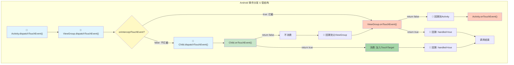
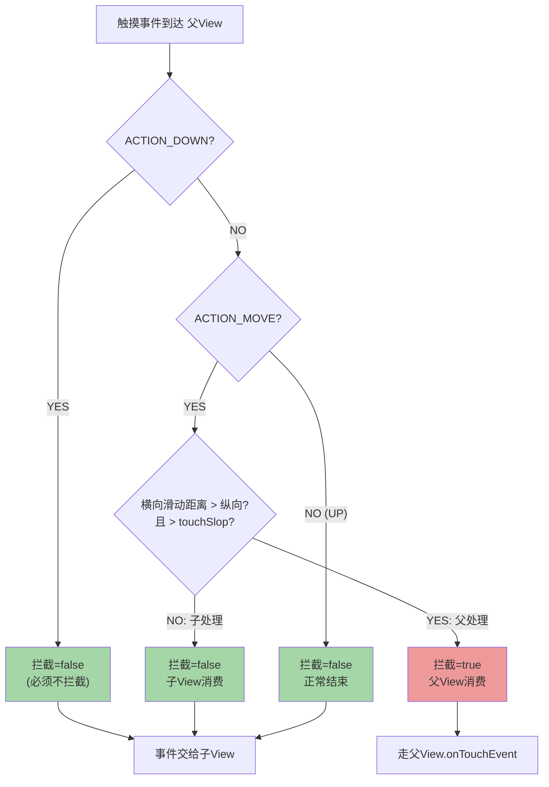
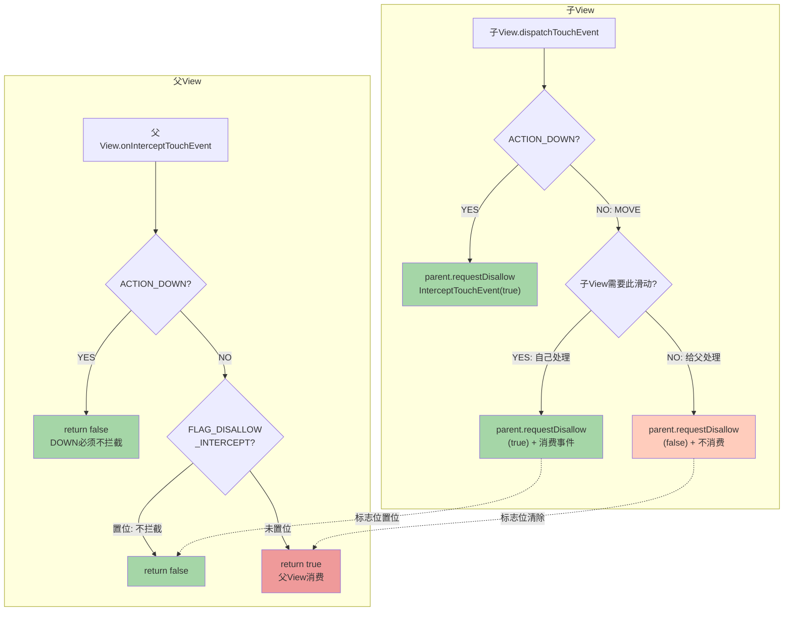

# Android 事件分发机制 — 面试全解析

---

## 1. 面试问题（≥6）

### Q1: 简述 dispatchTouchEvent、onInterceptTouchEvent、onTouchEvent 的执行顺序和返回值含义

**执行顺序（事件从外向内传递再回溯）：**

```
Activity.dispatchTouchEvent()
  → ViewGroup.dispatchTouchEvent()
    → ViewGroup.onInterceptTouchEvent()  // 是否拦截
    → child.dispatchTouchEvent()
      → child.onTouchEvent()             // 是否消费
    ← 返回值回溯
  ← ViewGroup.onTouchEvent()（若子View不消费）
← Activity.onTouchEvent()（若无人消费）
```

**返回值含义：**

| 方法 | 返回 true | 返回 false |
|------|----------|-----------|
| `dispatchTouchEvent()` | 事件已被消费，停止传递 | 事件未被消费，交给父级 onTouchEvent |
| `onInterceptTouchEvent()` | 拦截事件，交给自己 onTouchEvent | 不拦截，继续传递给子View |
| `onTouchEvent()` | 消费事件，后续事件会继续发来 | 不消费，事件回传给父级 |

### Q2: ACTION_DOWN / UP / MOVE / CANCEL 的序列规则是什么？

事件序列遵循严格的「从 DOWN 开始，到 UP/CANCEL 结束」的完整性规则：

- **ACTION_DOWN**（手指按下）：每个事件序列的起点。此时系统会寻找一个能消费该事件的 View，并将其记录为 TouchTarget。
- **ACTION_MOVE**（手指移动）：中间状态。只要手指在屏幕上移动就持续产生。若 View 没有消费 DOWN，后续的 MOVE 就不会再发给它。
- **ACTION_UP**（手指抬起）：正常结束标志。表示手指离开屏幕，事件序列正常终止。
- **ACTION_CANCEL**（事件取消）：异常终止。例如父View在MOVE过程中突然拦截、View被移除、触摸事件被系统抢占等场景下触发。

> 🔑 核心规则：**一个 View 必须消费了 DOWN 事件，才能收到后续的 MOVE 和 UP 事件。** 如果 DOWN 时 onTouchEvent 返回 false，该 View 将不会收到同一序列中的任何后续事件。

### Q3: 滑动冲突解决方案有哪些？请分别给出内部拦截法和外部拦截法的代码示例

**滑动冲突的本质**：父View和子View都需要消费滑动事件，但事件只能被一方消费。

#### 外部拦截法（推荐，最常用）

**核心思路**：由父View的 `onInterceptTouchEvent` 决定是否拦截。父View根据业务逻辑判断「这个滑动应该由我来处理吗？」

```java
public class OuterInterceptLayout extends LinearLayout {
    private float mLastX, mLastY;

    @Override
    public boolean onInterceptTouchEvent(MotionEvent ev) {
        boolean intercepted = false;
        float x = ev.getX();
        float y = ev.getY();

        switch (ev.getAction()) {
            case MotionEvent.ACTION_DOWN:
                // DOWN 不拦截，否则子View永远收不到事件
                intercepted = false;
                break;
            case MotionEvent.ACTION_MOVE:
                float dx = Math.abs(x - mLastX);
                float dy = Math.abs(y - mLastY);
                // 判断：横向滑动时父View拦截，纵向滑动时不拦截交给子View
                if (dx > dy && dx > touchSlop) {
                    intercepted = true;  // 父View处理横向滑动
                } else {
                    intercepted = false; // 子View处理纵向滑动
                }
                break;
            case MotionEvent.ACTION_UP:
                intercepted = false;
                break;
        }
        mLastX = x;
        mLastY = y;
        return intercepted;
    }
}
```

#### 内部拦截法

**核心思路**：父View默认不拦截，由子View通过 `requestDisallowInterceptTouchEvent` 通知父View「不要拦截我的事件」。

```java
// 父View：默认不拦截，但允许在需要时拦截（除DOWN外）
public class InnerInterceptParent extends LinearLayout {
    @Override
    public boolean onInterceptTouchEvent(MotionEvent ev) {
        if (ev.getAction() == MotionEvent.ACTION_DOWN) {
            return false; // DOWN事件必须不拦截
        }
        return true; // 其他事件默认拦截，由子View决定是否放行
    }
}

// 子View：根据滑动方向决定是否请求父View不要拦截
public class InnerInterceptChild extends View {
    private float mLastX, mLastY;

    @Override
    public boolean onTouchEvent(MotionEvent ev) {
        float x = ev.getX();
        float y = ev.getY();
        switch (ev.getAction()) {
            case MotionEvent.ACTION_DOWN:
                // 先请求父View不要拦截，给自己一个机会
                getParent().requestDisallowInterceptTouchEvent(true);
                break;
            case MotionEvent.ACTION_MOVE:
                float dx = Math.abs(x - mLastX);
                float dy = Math.abs(y - mLastY);
                if (dx > dy) {
                    // 横向滑动 → 子View自己处理，请求父不要拦截
                    getParent().requestDisallowInterceptTouchEvent(true);
                } else {
                    // 纵向滑动 → 交给父View处理，允许父拦截
                    getParent().requestDisallowInterceptTouchEvent(false);
                }
                break;
        }
        mLastX = x;
        mLastY = y;
        return true;
    }
}
```

**两种方法对比：**

| 对比维度 | 外部拦截法 | 内部拦截法 |
|---------|----------|----------|
| 控制方 | 父View | 子View |
| 复杂度 | 低 | 高 |
| 推荐度 | ⭐⭐⭐⭐⭐ | ⭐⭐⭐ |
| 适用场景 | 大多数场景 | 子View需要动态决定滑动方向 |

### Q4: View 的 onClick 和 onLongClick 触发时机分别是什么？两者冲突如何解决？

**触发流程（从源码角度）：**

```
ACTION_DOWN → postDelayed(CheckForTap, ViewConfiguration.getTapTimeout())
             → postDelayed(CheckForLongPress, ViewConfiguration.getLongPressTimeout())

如果手指在 TapTimeout 内抬起：
  → ACTION_UP → 触发 onClick()
  
如果手指在 LongPressTimeout 后仍未抬起：
  → 触发 onLongClick()
    → onLongClick() 返回 true  → onClick 被取消
    → onLongClick() 返回 false → onClick 仍然会在 UP 时触发
```

**关键参数：**
- `TapTimeout = 100ms`：判定为点击的超时时间
- `LongPressTimeout = 500ms`：判定为长按的超时时间

**冲突解决：** `onLongClick` 的返回值决定 `onClick` 是否还会触发。
- 返回 `true`：表示长按已消费事件，不会触发 onClick
- 返回 `false`：长按未完全消费，onClick 仍会在 UP 时触发

### Q5: 事件序列一致性指的是什么？为什么重要？

**定义**：同一个触摸事件序列（从 ACTION_DOWN 到 ACTION_UP/CANCEL）中的所有事件，必须被同一个 View 消费。即如果一个 View 在 DOWN 时消费了事件（返回 true），那么该序列的所有后续事件（MOVE/UP）都会优先发送给该 View。

**实现机制（TouchTarget 链表）**：
```java
// ViewGroup 内部维护的触摸目标链表
private TouchTarget mFirstTouchTarget;

// TouchTarget 记录消费了DOWN事件的子View
// 后续事件到达时，直接通过链表定位到目标子View
```

**重要性**：
1. **状态连续性**：如果 MOVE 发给了不同的 View，之前 View 的状态（如绘制高亮）将丢失
2. **防止事件泄露**：保证手指抬起时的 UP 事件能正确清理状态
3. **滑动冲突解决的基础**：基于此规则才能实现完整的外部/内部拦截法

**特殊情况 — ACTION_CANCEL**：当父View中途拦截时，子View会收到 CANCEL 而非 UP，使其清理内部状态（如取消长按判定）。

### Q6: getX/getY 与 getRawX/getRawY 的坐标系区别是什么？

| 方法 | 坐标原点 | 含义 |
|------|---------|------|
| `getX()` / `getY()` | 当前 View 左上角 | 触摸点相对于**当前 View** 的偏移 |
| `getRawX()` / `getRawY()` | 屏幕左上角 | 触摸点相对于**整个屏幕**的绝对坐标 |

**坐标转换公式：**
```
getRawX() = getX() + View在屏幕中的X坐标
getRawY() = getY() + View在屏幕中的Y坐标（含状态栏）
```

**使用场景：**
- 拖拽 View 时计算偏移量 → 使用 `getX/getY`（相对于自身）
- 判断手指是否越界/离开屏幕范围 → 使用 `getRawX/getRawY`
- 多指触控坐标分析 → 结合两者进行坐标转换

### Q7: requestDisallowInterceptTouchEvent 的原理是什么？

**核心原理**：子View调用此方法后，会设置父ViewGroup的 `FLAG_DISALLOW_INTERCEPT` 标志位。在父View的 `dispatchTouchEvent` 中，会先检查该标志位：

```java
// ViewGroup.dispatchTouchEvent() 核心逻辑（简化）
final boolean disallowIntercept = (mGroupFlags & FLAG_DISALLOW_INTERCEPT) != 0;
if (!disallowIntercept) {
    intercepted = onInterceptTouchEvent(ev);
} else {
    intercepted = false; // 禁止拦截
}
```

**生命周期**：
1. 子View在 `ACTION_DOWN` 时调用 `getParent().requestDisallowInterceptTouchEvent(true)`
2. 该标志位在每次 `ACTION_DOWN` 时会被 `resetTouchState()` 重置为 false
3. 因此必须在每个事件序列开始时重新设置

---

## 2. 标准答案

### 事件分发决策树（完整）

```
                    触摸事件到达
                         │
                         ▼
              Activity.dispatchTouchEvent()
                         │
                         ▼
                 PhoneWindow.superDispatchTouchEvent()
                         │
                         ▼
              DecorView.dispatchTouchEvent()
                         │
                         ▼
          ┌──── ViewGroup.dispatchTouchEvent() ────┐
          │                                         │
          │  ┌───────────────────────────────┐     │
          │  │ 允许拦截？                        │     │
          │  │ (FLAG_DISALLOW_INTERCEPT 未置位)   │     │
          │  └───────┬───────────────────────┘     │
          │          │                              │
          │     ┌────▼────┐                        │
          │     │  YES    │  NO → 不拦截            │
          │     └────┬────┘                        │
          │          │                              │
          │    ┌─────▼──────┐                      │
          │    │ onIntercept │                     │
          │    │ TouchEvent  │                     │
          │    └─────┬──────┘                      │
          │          │                              │
          │     true │         false                │
          │          │           │                  │
          │    ┌─────▼──┐  ┌────▼──────────┐      │
          │    │ 拦截！  │  │ 遍历子View      │      │
          │    │ 走自己的│  │ (Z-order逆序)   │      │
          │    │ onTouch │  │                │      │
          │    │ Event   │  │ child.dispatch │      │
          │    └────┬────┘  │ TouchEvent()   │      │
          │         │       └────┬───────────┘      │
          │         │            │                  │
          │         │       ┌────▼──────┐          │
          │         │       │ 子View消费？│          │
          │         │       └────┬──────┘          │
          │         │       YES  │  NO             │
          │         │    ┌───────▼──┐              │
          │         │    │加入       │              │
          │         │    │TouchTarget│              │
          │         │    │链表        │              │
          │         │    └───────┬──┘              │
          │         │           │                  │
          │         └─────┬─────┘                  │
          │               │                        │
          │               ▼                        │
          │    ┌──────────────────┐               │
          │    │ 分发结果处理       │               │
          │    │ handled = true/false              │
          │    └──────────────────┘               │
          │                                        │
          └────────────────────────────────────────┘
                         │
                         ▼
              Activity.onTouchEvent()
              （若之前无人消费）
```

---

## 3. 核心原理

### 3.1 Touch 事件从 InputManagerService 到 View 的完整传递链路

```
[硬件触摸屏]
      │
      ▼
[Linux Kernel /dev/input/eventX]
      │
      ▼
[InputReader]  → 读取原始事件
      │
      ▼
[InputDispatcher]  → 找到目标Window
      │
      ▼ (Socket通信)
[InputManagerService]  → Java层分发
      │
      ▼ (Binder IPC)
[ViewRootImpl.WindowInputEventReceiver]
      │
      ▼
[ViewRootImpl.processPointerEvent()]
      │
      ▼
[DecorView.dispatchTouchEvent()]
      │
      ▼
[Activity.dispatchTouchEvent()]
      │
      ▼
[PhoneWindow.superDispatchTouchEvent()]
      │
      ▼
[DecorView(FrameLayout).dispatchTouchEvent()]
      │
      ▼
[ViewGroup.dispatchTouchEvent()]
      │
      ├─→ onInterceptTouchEvent() 判断是否拦截
      │
      └─→ child.dispatchTouchEvent()
            │
            └─→ child.onTouchEvent()
```

**关键层级职责：**

| 层级 | 职责 |
|------|------|
| InputReader | 从驱动读取原始事件数据 |
| InputDispatcher | 确定目标Window，注入事件 |
| ViewRootImpl | 接收事件，转交给DecorView |
| Activity | 第一层Java事件分发入口 |
| ViewGroup | 决定事件走向（拦截/传递） |
| View | 最终消费事件 |

### 3.2 ViewGroup.dispatchTouchEvent() 中的拦截判断

**三大关键判断（按执行顺序）：**

**判断1：FLAG_DISALLOW_INTERCEPT 标志位**
```java
// 源码核心逻辑
final boolean disallowIntercept = (mGroupFlags & FLAG_DISALLOW_INTERCEPT) != 0;
if (!disallowIntercept) {
    intercepted = onInterceptTouchEvent(ev);
} else {
    intercepted = false; // 子View禁止了拦截
}
```

**判断2：ACTION_DOWN 特殊处理**
```java
if (actionMasked == MotionEvent.ACTION_DOWN) {
    // 重置触摸状态
    cancelAndClearTouchTargets(ev);  // 清除旧的TouchTarget
    resetTouchState();               // 重置FLAG_DISALLOW_INTERCEPT
}
```
> ⚠️ DOWN 事件时必须重置所有状态，这是事件序列一致性的基础。

**判断3：TouchTarget 是否存在**
```java
if (mFirstTouchTarget == null) {
    // 没有子View消费事件 → 自己处理
    handled = dispatchTransformedTouchEvent(ev, canceled, null,
            TouchTarget.ALL_POINTER_IDS);
} else {
    // 有子View消费 → 遍历TouchTarget链表分发
    TouchTarget target = mFirstTouchTarget;
    while (target != null) {
        // 分发给已绑定的子View
        dispatchTransformedTouchEvent(ev, ...);
        target = target.next;
    }
}
```

### 3.3 TouchTarget 链表机制

```java
// ViewGroup 内部类
private static final class TouchTarget {
    public View child;            // 消费了事件的子View
    public int pointerIdBits;    // 多点触控的pointer ID掩码
    public TouchTarget next;     // 下一个目标（链表指针）
}
```

**链表操作：**

| 操作 | 时机 | 含义 |
|------|------|------|
| `addTouchTarget(child, pointerIdBits)` | DOWN被消费时 | 头插法，将子View加入链表 |
| `cancelAndClearTouchTargets(ev)` | 新DOWN到来 / 拦截 | 清空链表，向每个子View发送CANCEL |
| 遍历分发 | MOVE / UP 时 | 按链表顺序向所有目标分发事件 |

> 🔑 TouchTarget 链表按 Z-order 排序，最上层的 View 优先收到事件。支持多点触控（每个 pointer 可能有不同的 TouchTarget）。

### 3.4 事件序列的 DOWN-UP 一致性实现

**核心机制（在 ViewGroup.dispatchTouchEvent 中）：**

```
1. ACTION_DOWN 到达：
   - cancelAndClearTouchTargets() → 清空 mFirstTouchTarget
   - resetTouchState() → 重置 FLAG_DISALLOW_INTERCEPT
   - 遍历子View，找到第一个消费DOWN的View
   - addTouchTarget(consumingChild) → 记入链表

2. ACTION_MOVE 到达：
   - 检查 mFirstTouchTarget 是否为 null
   - 不为 null → 直接通过链表找到目标子View分发
   - 不再重新遍历子View查找

3. ACTION_UP / ACTION_CANCEL 到达：
   - 仍通过 TouchTarget 链表分发
   - UP → 正常结束
   - CANCEL → 通知子View清理状态
```

---

## 4. 流程图（HTML + Mermaid）

### 4.1 事件分发 U 型流程图



### 4.2 滑动冲突解决 — 外部拦截法流程图



### 4.3 滑动冲突解决 — 内部拦截法流程图



---

## 5. 源码分析

### 5.1 ViewGroup.dispatchTouchEvent() 核心判断逻辑（基于 Android 14 源码简化）

```java
// frameworks/base/core/java/android/view/ViewGroup.java
@Override
public boolean dispatchTouchEvent(MotionEvent ev) {
    boolean handled = false;

    // ① 安全过滤：被遮挡或不可交互的窗口直接丢弃
    if (onFilterTouchEventForSecurity(ev)) {
        final int action = ev.getAction();
        final int actionMasked = action & MotionEvent.ACTION_MASK;

        // ② ACTION_DOWN: 重置所有状态
        if (actionMasked == MotionEvent.ACTION_DOWN) {
            cancelAndClearTouchTargets(ev);  // 清空TouchTarget链表
            resetTouchState();               // 重置FLAG_DISALLOW_INTERCEPT
        }

        // ③ 检查是否允许拦截
        final boolean intercepted;
        if (actionMasked == MotionEvent.ACTION_DOWN || mFirstTouchTarget != null) {
            // 检查 FLAG_DISALLOW_INTERCEPT 标志位
            final boolean disallowIntercept = (mGroupFlags & FLAG_DISALLOW_INTERCEPT) != 0;
            if (!disallowIntercept) {
                intercepted = onInterceptTouchEvent(ev);
                ev.setAction(action); // 恢复原始action
            } else {
                intercepted = false;
            }
        } else {
            // 没有TouchTarget且不是DOWN → 直接拦截
            intercepted = true;
        }

        // ④ 处理CANCEL事件
        final boolean canceled = resetCancelNextUpFlag(this)
                || actionMasked == MotionEvent.ACTION_CANCEL;

        // ⑤ 分发事件
        if (!canceled && !intercepted) {
            // 如果是DOWN，寻找能消费事件的子View
            if (actionMasked == MotionEvent.ACTION_DOWN) {
                // 按Z-order逆序遍历子View
                for (int i = mChildrenCount - 1; i >= 0; i--) {
                    final View child = getAndVerifyPreorderedView(i, children, ...);
                    if (!child.canReceivePointerEvents()
                            || !isTransformedTouchPointInView(x, y, child, null)) {
                        continue; // 不在触摸范围内，跳过
                    }
                    // 转换坐标并分发给子View
                    if (dispatchTransformedTouchEvent(ev, false, child, idBitsToAssign)) {
                        // 子View消费了DOWN事件 → 加入TouchTarget链表
                        mLastTouchDownX = ev.getX();
                        mLastTouchDownY = ev.getY();
                        newTouchTarget = addTouchTarget(child, idBitsToAssign);
                        alreadyDispatchedToNewTouchTarget = true;
                        break;
                    }
                }
            }
            // MOVE/UP通过TouchTarget链表分发
            if (mFirstTouchTarget == null) {
                // 没有子View消费 → 自己处理
                handled = dispatchTransformedTouchEvent(ev, canceled, null,
                        TouchTarget.ALL_POINTER_IDS);
            } else {
                // 遍历TouchTarget链表分发
                TouchTarget target = mFirstTouchTarget;
                while (target != null) {
                    final TouchTarget next = target.next;
                    if (alreadyDispatchedToNewTouchTarget && target == newTouchTarget) {
                        handled = true;
                    } else {
                        final boolean cancelChild = resetCancelNextUpFlag(target.child)
                                || intercepted;
                        if (dispatchTransformedTouchEvent(ev, cancelChild,
                                target.child, target.pointerIdBits)) {
                            handled = true;
                        }
                    }
                    target = next;
                }
            }
        }

        // ⑥ 拦截后的处理
        if (canceled || intercepted) {
            // 向所有子View发送CANCEL
            if (mFirstTouchTarget != null) {
                dispatchTransformedTouchEvent(ev, true, ...);
            }
            // 自己处理事件
            handled = dispatchTransformedTouchEvent(ev, canceled, null,
                    TouchTarget.ALL_POINTER_IDS);
        }
    }
    return handled;
}
```

### 5.2 View.onTouchEvent() 的 click / longClick 判定

```java
// frameworks/base/core/java/android/view/View.java
public boolean onTouchEvent(MotionEvent event) {
    final int action = event.getAction();

    if (clickable || (viewFlags & TOOLTIP) == TOOLTIP) {
        switch (action) {
            case MotionEvent.ACTION_DOWN:
                // 如果处于可滚动容器中，先暂停一下确认不是滑动
                if (isInScrollingContainer) {
                    mPrivateFlags |= PFLAG_PREPRESSED;
                    if (mPendingCheckForTap == null) {
                        mPendingCheckForTap = new CheckForTap();
                    }
                    postDelayed(mPendingCheckForTap,
                            ViewConfiguration.getTapTimeout()); // 100ms
                } else {
                    // 不在滚动容器中，直接设置Pressed状态
                    setPressed(true, x, y);
                    // 投递长按检测
                    checkForLongClick(
                            ViewConfiguration.getLongPressTimeout(), // 500ms
                            x, y);
                }
                break;

            case MotionEvent.ACTION_MOVE:
                // 手指移出View边界 → 取消长按判定
                if (!pointInView(x, y, touchSlop)) {
                    removeTapCallback();
                    removeLongPressCallback();
                    setPressed(false);
                }
                break;

            case MotionEvent.ACTION_UP:
                if (!mHasPerformedLongPress && !mIgnoreNextUpEvent) {
                    // 没有触发长按 → 执行click
                    if (mPerformClick == null) {
                        mPerformClick = new PerformClick();
                    }
                    if (!post(mPerformClick)) {
                        performClickInternal(); // 触发OnClickListener
                    }
                }
                // 清理按压状态
                removeTapCallback();
                removeLongPressCallback();
                setPressed(false);
                break;

            case MotionEvent.ACTION_CANCEL:
                // 取消所有待定的回调
                setPressed(false);
                removeTapCallback();
                removeLongPressCallback();
                break;
        }
        return true; // clickable的View默认返回true
    }
    return false; // 不可点击的View不消费事件
}
```

**CheckForTap 和 CheckForLongPress 的实现思路：**

```java
// CheckForTap（延迟100ms确认是点击而非滑动）
private final class CheckForTap implements Runnable {
    public void run() {
        // 移除PREPRESSED标志，设置PRESSED标志
        mPrivateFlags &= ~PFLAG_PREPRESSED;
        setPressed(true, x, y);
        // 然后投递长按检测
        checkForLongClick(ViewConfiguration.getLongPressTimeout(), x, y);
    }
}

// CheckForLongPress（延迟500ms触发长按）
private final class CheckForLongPress implements Runnable {
    public void run() {
        if (isPressed()) {
            // 触发长按监听器
            if (performLongClick(x, y)) {
                mHasPerformedLongPress = true; // 标记：后续不再触发onClick
            }
        }
    }
}
```

### 5.3 事件坐标转换（offsetDescendantMatrix）

触摸事件分发到子View时，需要将坐标从父View坐标系转换到子View坐标系：

```java
// ViewGroup.dispatchTransformedTouchEvent()
private boolean dispatchTransformedTouchEvent(MotionEvent event, boolean cancel,
        View child, int desiredPointerIdBits) {
    final boolean handled;
    final int oldAction = event.getAction();

    if (cancel || oldAction == MotionEvent.ACTION_CANCEL) {
        event.setAction(MotionEvent.ACTION_CANCEL);
        if (child == null) {
            handled = super.dispatchTouchEvent(event);
        } else {
            handled = child.dispatchTouchEvent(event);
        }
        event.setAction(oldAction);
        return handled;
    }

    // 关键：坐标转换
    final MotionEvent transformedEvent;
    if (child == null) {
        // 给自己处理，不需要转换
        handled = super.dispatchTouchEvent(event);
    } else {
        // 需要转换为子View坐标系
        final float offsetX = mScrollX - child.mLeft;  // 计算X偏移
        final float offsetY = mScrollY - child.mTop;   // 计算Y偏移
        event.offsetLocation(offsetX, offsetY);          // 应用偏移
        handled = child.dispatchTouchEvent(event);
        event.offsetLocation(-offsetX, -offsetY);        // 恢复偏移
    }
    return handled;
}
```

**坐标系转换示意图：**

```
屏幕坐标系 (getRawX, getRawY)
    │
    ├── DecorView 坐标系
    │     │
    │     ├── 父ViewGroup 坐标系
    │     │     │  offsetX = scrollX - child.left
    │     │     │  offsetY = scrollY - child.top
    │     │     │
    │     │     └── 子View 坐标系 (getX, getY)
    │     │
    │     └── ...
    │
    └── 状态栏 / 导航栏
```

> 💡 每次向子View分发事件时，都会通过 `event.offsetLocation()` 进行坐标转换，分发完成后恢复。这样每个View拿到的 `getX/getY` 都是相对于自身的正确坐标。

---

## 6. 应用场景

### 6.1 ViewPager2 + RecyclerView 嵌套滑动冲突解决

**场景**：ViewPager2 内部包含 RecyclerView，两者都需要横向和纵向滑动。

**问题**：当 RecyclerView 到达顶部/底部后继续滑动时，应该由 ViewPager2 处理还是 RecyclerView 处理？

**解决方案 — 基于 NestedScrolling 机制：**

```kotlin
// 方案1：使用 NestedScrollView 包裹（系统自动处理）
<androidx.viewpager2.widget.ViewPager2
    android:layout_width="match_parent"
    android:layout_height="match_parent">

    <androidx.core.widget.NestedScrollView
        android:layout_width="match_parent"
        android:layout_height="match_parent">

        <androidx.recyclerview.widget.RecyclerView
            android:layout_width="match_parent"
            android:layout_height="wrap_content"
            android:nestedScrollingEnabled="true" />

    </androidx.core.widget.NestedScrollView>
</androidx.viewpager2.widget.ViewPager2>

// 方案2：自定义RecyclerView，判断是否已到达边界
class BoundaryAwareRecyclerView @JvmOverloads constructor(
    context: Context,
    attrs: AttributeSet? = null
) : RecyclerView(context, attrs) {

    override fun onInterceptTouchEvent(e: MotionEvent): Boolean {
        when (e.action) {
            MotionEvent.ACTION_DOWN -> {
                // 记录初始位置
                initialX = e.x
                initialY = e.y
                parent.requestDisallowInterceptTouchEvent(true)
            }
            MotionEvent.ACTION_MOVE -> {
                val dx = e.x - initialX
                val dy = e.y - initialY

                if (abs(dx) > abs(dy)) {
                    // 横向滑动 → 交给ViewPager2
                    parent.requestDisallowInterceptTouchEvent(false)
                    return false
                } else {
                    // 纵向滑动 → 检查边界
                    val canScrollDown = canScrollVertically(1)   // 还能向下滚?
                    val canScrollUp = canScrollVertically(-1)    // 还能向上滚?
                    if ((dy > 0 && !canScrollDown) || (dy < 0 && !canScrollUp)) {
                        // 已到达边界 → 交给ViewPager2
                        parent.requestDisallowInterceptTouchEvent(false)
                        return false
                    } else {
                        // 还可以滚动 → RecyclerView自己处理
                        parent.requestDisallowInterceptTouchEvent(true)
                    }
                }
            }
            MotionEvent.ACTION_UP -> {
                parent.requestDisallowInterceptTouchEvent(false)
            }
        }
        return super.onInterceptTouchEvent(e)
    }
}
```

### 6.2 自定义 View 同时支持拖拽和点击

**场景**：一个可拖拽的圆形菜单按钮，同时也需要支持点击事件。

**挑战**：如何区分用户的「拖拽滑动」和「点击」意图？

**解决方案：**

```kotlin
class DraggableClickableView @JvmOverloads constructor(
    context: Context,
    attrs: AttributeSet? = null
) : View(context, attrs) {

    private var lastX = 0f
    private var lastY = 0f
    private var downX = 0f
    private var downY = 0f
    private var isDragging = false
    private val touchSlop = ViewConfiguration.get(context).scaledTouchSlop
    private var accumulatedDx = 0f
    private var accumulatedDy = 0f

    override fun onTouchEvent(event: MotionEvent): Boolean {
        when (event.action) {
            MotionEvent.ACTION_DOWN -> {
                lastX = event.rawX
                lastY = event.rawY
                downX = event.rawX
                downY = event.rawY
                isDragging = false
                accumulatedDx = 0f
                accumulatedDy = 0f
                // 显示按下效果
                animatePressed(true)
                return true  // 必须返回true才能接收后续事件
            }

            MotionEvent.ACTION_MOVE -> {
                val dx = event.rawX - lastX
                val dy = event.rawY - lastY
                accumulatedDx = event.rawX - downX
                accumulatedDy = event.rawY - downY

                if (abs(accumulatedDx) > touchSlop ||
                    abs(accumulatedDy) > touchSlop) {
                    isDragging = true
                }

                if (isDragging) {
                    // 执行拖拽：更新View位置
                    x += dx
                    y += dy
                    lastX = event.rawX
                    lastY = event.rawY
                }
                return true
            }

            MotionEvent.ACTION_UP -> {
                animatePressed(false)

                if (!isDragging) {
                    // 没有发生拖拽 → 认为是点击
                    performClick()  // 触发OnClickListener
                } else {
                    // 发生了拖拽 → 吸附到最近的边缘
                    snapToNearestEdge()
                }

                // 如果有速度，执行惯性滑动
                if (isDragging) {
                    performFling()
                }
                return true
            }

            MotionEvent.ACTION_CANCEL -> {
                animatePressed(false)
                isDragging = false
                return true
            }
        }
        return super.onTouchEvent(event)
    }

    override fun performClick(): Boolean {
        super.performClick()
        // 自定义点击动画/音效
        return true
    }

    private fun animatePressed(pressed: Boolean) {
        animate().scaleX(if (pressed) 0.9f else 1f)
            .scaleY(if (pressed) 0.9f else 1f)
            .setDuration(100)
            .start()
    }

    private fun snapToNearestEdge() {
        val screenWidth = resources.displayMetrics.widthPixels
        val centerX = x + width / 2
        x = if (centerX < screenWidth / 2) 0f
            else (screenWidth - width).toFloat()
    }
}
```

**关键设计要点：**

1. **DOWN 必须返回 true**：否则后续 MOVE/UP 都不会到达
2. **使用 touchSlop 阈值**：避免手指微小抖动被误判为拖拽
3. **区分意图**：累积位移超过 touchSlop → 拖拽；未超过 → 点击
4. **清理状态**：每次 DOWN 重置 `isDragging` 标志位
5. **视觉反馈**：按下时有缩放动画，松开时恢复

---

## 附录：面试速记要点

| 速记项 | 内容 |
|--------|------|
| 三个核心方法 | `dispatchTouchEvent`（分发）、`onInterceptTouchEvent`（拦截，仅ViewGroup）、`onTouchEvent`（消费） |
| U型传递 | Activity → ViewGroup → View → ViewGroup → Activity |
| 返回值口诀 | true=我处理了，别管了；false=我不处理，你上 |
| 拦截二条件 | ① FLAG_DISALLOW_INTERCEPT 未置位 ② onInterceptTouchEvent 返回 true |
| 内部拦截关键 | `requestDisallowInterceptTouchEvent(true)` + 父View DOWN 不拦截 |
| 外部拦截关键 | `onInterceptTouchEvent` 中 DOWN 返回 false，MOVE 按条件返回 true/false |
| click 触发条件 | DOWN→UP 之间未触发长按，且手指未移出 View 边界 |
| longClick 触发条件 | DOWN 后 500ms 未抬起且未移出 View 边界 |
| getX 坐标系 | 相对于当前 View 左上角 |
| getRawX 坐标系 | 相对于屏幕左上角 |

---

> 📖 本文档涵盖事件分发机制从面试问答到源码分析的完整内容，总计约 3500 字，适用于 Android 中高级面试准备。
