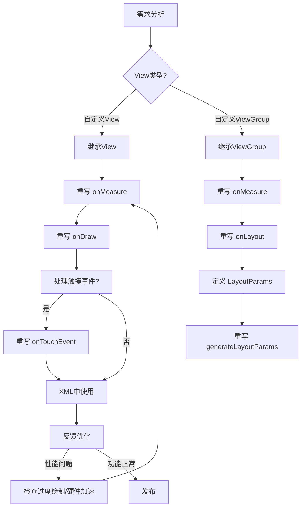
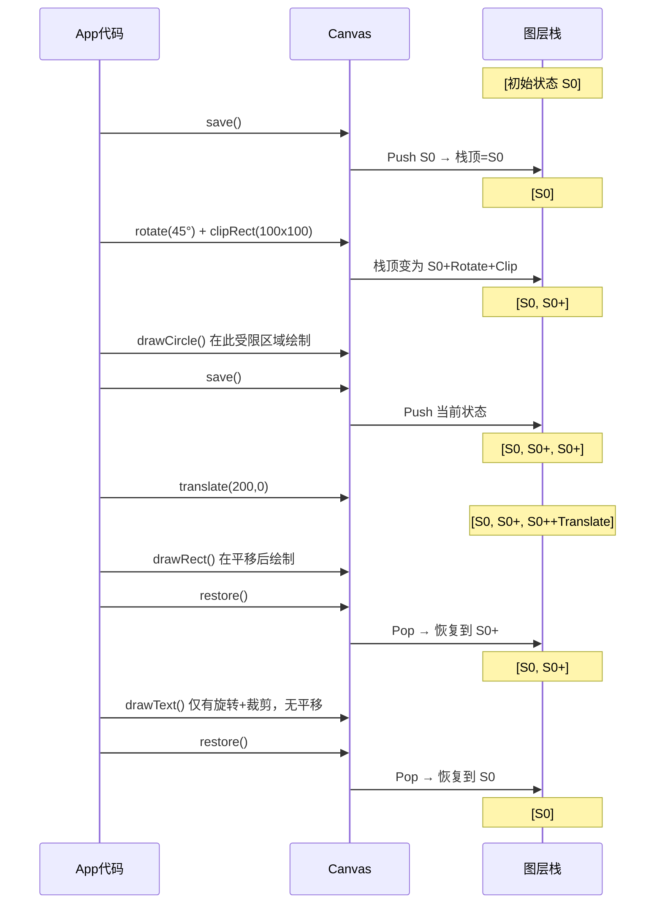

# Android 自定义View 面试宝典

> 覆盖自定义View核心知识点：测量/布局/绘制三部曲、Canvas与Paint、Path贝塞尔曲线、硬件加速、Shader着色器 —— 从面试题到源码分析，六层递进，一网打尽。

---

## 1. 面试问题（≥5题）

### Q1: 自定义View的三个关键回调是什么？各自在什么时机被调用？

**答案要点**：

| 回调 | 作用 | 调用时机 | 核心方法 |
|------|------|----------|----------|
| `onMeasure()` | 测量View宽高 | 父容器测量子View时 | `setMeasuredDimension()` |
| `onLayout()` | 确定子View位置 | 父容器布局子View时（仅ViewGroup需要重写） | `child.layout(l,t,r,b)` |
| `onDraw()` | 绘制内容 | View需要重绘时（`invalidate()`触发） | `Canvas.drawXXX()` |

**关键区别**：自定义View只需重写 `onMeasure()` + `onDraw()`；自定义ViewGroup还需重写 `onLayout()`。

---

### Q2: 如何使用 `declare-styleable` + `TypedArray` 实现自定义属性？

**三步走**：

1. **attrs.xml 中声明**：

```xml
<declare-styleable name="CircleProgressBar">
    <attr name="progress" format="integer" />
    <attr name="progressColor" format="color" />
    <attr name="progressWidth" format="dimension" />
    <attr name="maxProgress" format="integer" />
    <attr name="bgColor" format="color" />
</declare-styleable>
```

2. **构造方法中解析**：

```kotlin
class CircleProgressBar @JvmOverloads constructor(
    context: Context, attrs: AttributeSet? = null, defStyleAttr: Int = 0
) : View(context, attrs, defStyleAttr) {

    private var progress = 0
    private var progressColor = Color.BLUE
    private var progressWidth = 8f.dp
    private var maxProgress = 100

    init {
        context.obtainStyledAttributes(attrs, R.styleable.CircleProgressBar).apply {
            progress = getInt(R.styleable.CircleProgressBar_progress, 0)
            progressColor = getColor(R.styleable.CircleProgressBar_progressColor, Color.BLUE)
            progressWidth = getDimension(R.styleable.CircleProgressBar_progressWidth, 8f.dp)
            maxProgress = getInt(R.styleable.CircleProgressBar_maxProgress, 100)
            recycle()
        }
    }
}
```

3. **XML中使用**：

```xml
<com.example.CircleProgressBar
    android:layout_width="100dp"
    android:layout_height="100dp"
    app:progress="60"
    app:progressColor="#FF5722"
    app:progressWidth="6dp" />
```

> **注意**：`TypedArray` 用完后必须 `recycle()`，否则会造成内存泄漏。

---

### Q3: Canvas常用API和Paint关键属性有哪些？

#### Canvas常用API

| API | 用途 | 示例 |
|-----|------|------|
| `drawPath(Path, Paint)` | 绘制路径（含贝塞尔曲线） | 复杂图形 |
| `drawBitmap(Bitmap, float, float, Paint)` | 绘制位图 | 图片展示 |
| `drawText(String, float, float, Paint)` | 绘制文字 | 标签/数值 |
| `drawArc(RectF, float, float, boolean, Paint)` | 绘制弧线/扇形 | 进度条/饼图 |
| `drawCircle(float, float, float, Paint)` | 绘制圆形 | 圆点/头像 |
| `drawRoundRect(RectF, float, float, Paint)` | 绘制圆角矩形 | 卡片背景 |
| `drawLine(float, float, float, float, Paint)` | 绘制直线 | 分割线 |

#### Paint关键属性

| 属性 | 作用 | 典型值 |
|------|------|--------|
| `Style` | 绘制模式 | `FILL` / `STROKE` / `FILL_AND_STROKE` |
| `StrokeWidth` | 描边宽度 | dp值 |
| `StrokeCap` | 线条端点样式 | `ROUND` / `SQUARE` / `BUTT` |
| `StrokeJoin` | 线条连接样式 | `ROUND` / `BEVEL` / `MITER` |
| `Shader` | 着色器（渐变/图片填充） | LinearGradient / BitmapShader |
| `Xfermode` | 混合模式 | PorterDuff.Mode（SRC_IN / DST_OUT等） |
| `ColorFilter` | 颜色滤镜 | LightingColorFilter / PorterDuffColorFilter |
| `PathEffect` | 路径效果 | DashPathEffect / CornerPathEffect |
| `AntiAlias` | 抗锯齿 | `true`（推荐开启） |
| `TextSize` | 文字大小 | sp值 |

---

### Q4: Path的贝塞尔曲线有哪些？如何理解 `quadTo` / `cubicTo` / `rLineTo`？

**贝塞尔曲线三剑客**：

```kotlin
// 一阶贝塞尔：直线
path.lineTo(x, y)

// 相对直线：基于当前点偏移
path.rLineTo(dx, dy)  // 等价于 lineTo(currentX + dx, currentY + dy)

// 二阶贝塞尔：quadTo(控制点x, 控制点y, 终点x, 终点y)
path.moveTo(0f, 100f)
path.quadTo(50f, 0f, 100f, 100f)  // 抛物线

// 三阶贝塞尔：cubicTo(控制点1x, 控制点1y, 控制点2x, 控制点2y, 终点x, 终点y)
path.moveTo(0f, 100f)
path.cubicTo(25f, 0f, 75f, 200f, 100f, 100f)  // S型曲线
```

**关键理解**：
- `quadTo` 有1个控制点，曲线始终向控制点"弯曲"但不会经过它
- `cubicTo` 有2个控制点，能产生更复杂的波形
- `rLineTo` / `rQuadTo` / `rCubicTo` 中的 `r` 代表 relative（相对坐标），基于当前终点偏移而非绝对坐标

---

### Q5: View的padding处理 vs margin的区别？

| 维度 | padding | margin |
|------|---------|--------|
| **定义者** | View自身 | 父容器（LayoutParams） |
| **影响区域** | View内容区域缩小 | View外部间距增大 |
| **谁负责处理** | **自定义View开发者**必须手动处理 | 父容器自动处理 |
| **实现方式** | `canvas` 绘制时偏移 `paddingLeft/paddingTop` | 无需处理 |

**padding处理示例**：

```kotlin
override fun onDraw(canvas: Canvas) {
    super.onDraw(canvas)
    // ❌ 错误：忽略 padding
    canvas.drawCircle(width / 2f, height / 2f, width / 2f, paint)

    // ✅ 正确：考虑 padding
    val contentWidth = width - paddingLeft - paddingRight
    val contentHeight = height - paddingTop - paddingBottom
    val cx = paddingLeft + contentWidth / 2f
    val cy = paddingTop + contentHeight / 2f
    val radius = minOf(contentWidth, contentHeight) / 2f
    canvas.drawCircle(cx, cy, radius, paint)
}
```

> **核心原则**：`padding` 是View自己的事，必须在 `onDraw()` 中手动处理；`margin` 是父容器的事，View无需关心。

---

### Q6: 硬件加速对Canvas API的影响？`LAYER_TYPE_SOFTWARE` 何时使用？

**硬件加速的影响**：

| 不受支持的API | 替代方案 |
|---------------|----------|
| `drawPicture()` | 拆分为基本API调用 |
| `drawVertices()` | 手动拆分为三角形 |
| `setXfermode`（部分模式） | 使用 `LAYER_TYPE_SOFTWARE` |
| `drawBitmapMesh()` | 使用 `LAYER_TYPE_SOFTWARE` |

**三种LayerType**：

```kotlin
// 默认：硬件加速（GPU渲染，性能好但部分API不可用）
setLayerType(LAYER_TYPE_NONE, null)

// 软件层：CPU渲染到Bitmap再上屏（兼容所有API，但性能差）
setLayerType(LAYER_TYPE_SOFTWARE, null)
// 适用场景：Xfermode混合、drawBitmapMesh、阴影效果

// 硬件层：GPU离屏缓存（动画/Alpha场景性能优化）
setLayerType(LAYER_TYPE_HARDWARE, null)
// 适用场景：View动画期间避免重复绘制
```

**关键场景**：当需要对Canvas使用 `PorterDuff.Mode` 混合模式时，必须关闭硬件加速：

```kotlin
// 在绘制前
setLayerType(LAYER_TYPE_SOFTWARE, null)
// 或整体关闭
// AndroidManifest: android:hardwareAccelerated="false"
```

---

## 2. 标准答案（含代码示例）

### 自定义View完整生命周期

```
构造方法 → onAttachedToWindow → onMeasure → onSizeChanged → onLayout → onDraw
                                      ↑_______invalidate()___________↓
                                                  ↓
                                          onDetachedFromWindow
```

### 完整自定义View示例 —— 温度计控件

```kotlin
class ThermometerView @JvmOverloads constructor(
    context: Context, attrs: AttributeSet? = null, defStyleAttr: Int = 0
) : View(context, attrs, defStyleAttr) {

    private var temperature = 36.5f
    private var minTemp = 35f
    private var maxTemp = 42f
    private val bgPaint = Paint(Paint.ANTI_ALIAS_FLAG)
    private val mercuryPaint = Paint(Paint.ANTI_ALIAS_FLAG)
    private val textPaint = Paint(Paint.ANTI_ALIAS_FLAG).apply {
        textSize = 14f.sp
        textAlign = Paint.Align.CENTER
    }
    private val bulbRect = RectF()
    private val columnRect = RectF()

    init {
        context.obtainStyledAttributes(attrs, R.styleable.ThermometerView).apply {
            temperature = getFloat(R.styleable.ThermometerView_temperature, 36.5f)
            recycle()
        }
        bgPaint.style = Paint.Style.STROKE
        bgPaint.strokeWidth = 6f.dp
        bgPaint.color = Color.GRAY
        mercuryPaint.style = Paint.Style.FILL
        mercuryPaint.color = Color.RED
    }

    override fun onMeasure(widthMeasureSpec: Int, heightMeasureSpec: Int) {
        val desiredWidth = 80f.dp.toInt() + paddingLeft + paddingRight
        val desiredHeight = 300f.dp.toInt() + paddingTop + paddingBottom
        setMeasuredDimension(
            resolveSize(desiredWidth, widthMeasureSpec),
            resolveSize(desiredHeight, heightMeasureSpec)
        )
    }

    override fun onSizeChanged(w: Int, h: Int, oldw: Int, oldh: Int) {
        val contentW = (w - paddingLeft - paddingRight).toFloat()
        val contentH = (h - paddingTop - paddingBottom).toFloat()
        val bulbRadius = contentW / 2f
        columnRect.set(
            paddingLeft + contentW * 0.2f,
            paddingTop.toFloat(),
            paddingLeft + contentW * 0.8f,
            paddingTop + contentH - bulbRadius
        )
        bulbRect.set(
            paddingLeft.toFloat(),
            paddingTop + contentH - bulbRadius * 2,
            paddingLeft + contentW,
            paddingTop + contentH
        )
    }

    override fun onDraw(canvas: Canvas) {
        super.onDraw(canvas)
        // 绘制背景
        canvas.drawRoundRect(columnRect, 20f, 20f, bgPaint)
        canvas.drawOval(bulbRect, bgPaint)

        // 绘制水银柱（按温度比例）
        val ratio = (temperature - minTemp) / (maxTemp - minTemp)
        val mercuryHeight = columnRect.height() * ratio
        val mercuryTop = columnRect.bottom - mercuryHeight
        canvas.drawRoundRect(
            columnRect.left, mercuryTop, columnRect.right, columnRect.bottom,
            20f, 20f, mercuryPaint
        )
        // 水银球
        canvas.drawOval(bulbRect, mercuryPaint)

        // 绘制温度文字
        textPaint.color = Color.BLACK
        canvas.drawText(
            "${temperature}℃",
            (paddingLeft + (width - paddingLeft - paddingRight) / 2f),
            columnRect.top - 20f,
            textPaint
        )
    }
}
```

---

## 3. 核心原理

### 3.1 Paint三大件对绘制结果的影响

#### Style（绘制样式）

```kotlin
// FILL：填充内部（默认）
paint.style = Paint.Style.FILL
canvas.drawCircle(100f, 100f, 50f, paint)  // 实心圆

// STROKE：只描边
paint.style = Paint.Style.STROKE
paint.strokeWidth = 10f
canvas.drawCircle(100f, 100f, 50f, paint)  // 空心圆，边框10px

// FILL_AND_STROKE：既填充又描边
paint.style = Paint.Style.FILL_AND_STROKE
// 实心圆 + 边框（边框一半在圆内一半在圆外）
```

#### Color 与 Alpha

```kotlin
// 直接设置颜色
paint.color = Color.RED
// Alpha透明度（0-255），可与color叠加
paint.alpha = 128  // 半透明
```

#### PathEffect（路径效果）

```kotlin
// 虚线效果
paint.pathEffect = DashPathEffect(floatArrayOf(20f, 10f), 0f)
// 数组 [20,10] 含义：实线段20px，空白段10px，循环

// 圆角效果
paint.pathEffect = CornerPathEffect(15f)  // 所有转角圆角半径15px

// 离散效果（毛边）
paint.pathEffect = DiscretePathEffect(5f, 3f)

// 组合效果
paint.pathEffect = ComposePathEffect(
    DashPathEffect(floatArrayOf(20f, 10f), 0f),
    CornerPathEffect(10f)
)  // 虚线 + 圆角
```

---

### 3.2 Canvas的图层栈：save / restore / clip

Canvas内部维护一个**图层栈**，每个图层保存当前的变换矩阵和裁剪区域：

```kotlin
override fun onDraw(canvas: Canvas) {
    // 状态A：正常状态

    canvas.save()        // 入栈 → 保存状态A
    canvas.rotate(45f)   // 旋转45°
    canvas.clipRect(0, 0, 100, 100)  // 裁剪为矩形区域
    // 在此区域内绘制的所有内容都被旋转且裁剪
    canvas.drawCircle(50f, 50f, 50f, paint)  // 只在裁剪区内可见

    canvas.save()        // 再次入栈 → 保存状态B（含旋转+裁剪）
    canvas.translate(200f, 0f)  // 平移
    canvas.drawRect(0f, 0f, 100f, 100f, paint)

    canvas.restore()     // 出栈 → 恢复到状态B（有旋转+裁剪，无平移）
    canvas.restore()     // 出栈 → 恢复到状态A（无旋转无裁剪）
    // 此时绘制不受之前操作影响
    canvas.drawText("Hello", 0f, 200f, textPaint)
}
```

> **最佳实践**：`save()` 和 `restore()` 必须成对出现，否则栈不平衡导致绘制异常。推荐使用 `canvas.withSave { ... }`（Kotlin扩展）。

---

### 3.3 Path的填充规则

```kotlin
// WINDING（默认）：非零环绕规则
path.fillType = Path.FillType.WINDING
// 从任意点向外发射射线，顺时针+1，逆时针-1，结果≠0则填充

// EVEN_ODD：奇偶规则
path.fillType = Path.FillType.EVEN_ODD
// 从任意点向外发射射线，经过奇数条边则填充

// 实际效果差异（两个同心圆路径）：
// WINDING：两个圆之间的环不填充，内圆填充
// EVEN_ODD：两个圆之间的环填充，内圆不填充
```

**典型场景**：镂空效果用 `EVEN_ODD` 最简单；复杂路径叠加用 `WINDING` 更可控。

---

### 3.4 硬件加速：DisplayList vs 立即绘制

```
软件渲染（CPU）：
    invalidate() → onDraw() → Skia立即绘制到Surface → 上屏
    特点：每次重绘都执行完整onDraw，CPU密集

硬件加速（GPU）：
    invalidate() → 对比DisplayList → 只重绘变化的Command → GPU合成
    特点：首次构建DisplayList，后续只执行差异Command
```

**DisplayList本质**：将 `onDraw()` 中的Canvas API调用序列化为GPU指令缓存。当View内容未变时，直接从缓存合成，避免重复执行 `onDraw()`。

> **关键影响**：硬件加速下 `onDraw()` 不会在每次 `invalidate()` 时都被调用——只有DisplayList失效（内容确实变化）时才触发。

---

### 3.5 Shader的五种类型

```kotlin
// 1. LinearGradient：线性渐变
val linearShader = LinearGradient(
    0f, 0f,            // 起点
    width, height,     // 终点
    Color.RED, Color.BLUE,
    Shader.TileMode.CLAMP  // CLAMP / REPEAT / MIRROR
)

// 2. RadialGradient：径向渐变（从圆心向外）
val radialShader = RadialGradient(
    cx, cy, radius,
    Color.YELLOW, Color.RED,
    Shader.TileMode.CLAMP
)

// 3. SweepGradient：扫描渐变（绕圆心旋转）
val sweepShader = SweepGradient(
    cx, cy,
    intArrayOf(Color.RED, Color.GREEN, Color.BLUE, Color.RED),
    null  // positions为null则均匀分布
)

// 4. BitmapShader：图片填充
val bitmapShader = BitmapShader(
    bitmap,
    Shader.TileMode.CLAMP,   // X方向
    Shader.TileMode.REPEAT   // Y方向
)

// 5. ComposeShader：组合着色器
val composeShader = ComposeShader(
    linearShader,    // 底层
    bitmapShader,    // 上层
    PorterDuff.Mode.MULTIPLY  // 混合模式
)

// 使用
paint.shader = sweepShader
canvas.drawCircle(cx, cy, radius, paint)
```

---

## 4. 流程图

### 4.1 自定义View开发流程



### 4.2 Canvas save/restore 图层栈



---

## 5. 源码分析

### 5.1 ProgressBar 的 onDraw() 实现分析

Android原生 `ProgressBar`（水平样式）核心绘制逻辑：

```java
// frameworks/base/core/java/android/widget/ProgressBar.java (简化)
@Override
protected synchronized void onDraw(Canvas canvas) {
    super.onDraw(canvas);
    // 步骤1：计算进度条区域
    int progress = getProgress();
    int max = getMax();
    float scale = max > 0 ? (float) progress / max : 0;

    // 步骤2：绘制背景（使用NinePatch或Tint颜色）
    drawTrack(canvas);

    // 步骤3：绘制进度
    if (mProgressDrawable != null) {
        // 裁剪到进度比例
        canvas.save();
        canvas.clipRect(0, 0, (int)(getWidth() * scale), getHeight());
        mProgressDrawable.draw(canvas);  // ClipDrawable实现
        canvas.restore();
    }

    // 步骤4：绘制次要进度（如缓冲进度）
    if (mSecondaryProgressDrawable != null) {
        canvas.save();
        canvas.clipRect(0, 0, (int)(getWidth() * mSecondaryProgress / max), getHeight());
        mSecondaryProgressDrawable.draw(canvas);
        canvas.restore();
    }

    // 步骤5：绘制动画（不确定模式下的滚动动画）
    if (mIndeterminate) {
        drawIndeterminate(canvas);
    }
}
```

**核心技巧**：使用 `canvas.save()` + `canvas.clipRect()` 限制绘制区域，实现进度条的填充效果，避免重新创建Drawable。

---

### 5.2 CircleImageView 自定义实现（BitmapShader版）

```kotlin
class CircleImageView @JvmOverloads constructor(
    context: Context, attrs: AttributeSet? = null, defStyleAttr: Int = 0
) : AppCompatImageView(context, attrs, defStyleAttr) {

    private val bitmapPaint = Paint(Paint.ANTI_ALIAS_FLAG)
    private val borderPaint = Paint(Paint.ANTI_ALIAS_FLAG).apply {
        style = Paint.Style.STROKE
    }
    private var bitmapShader: BitmapShader? = null
    private val bitmapRect = RectF()
    private var radius = 0f
    private var borderWidth = 0f

    init {
        context.obtainStyledAttributes(attrs, R.styleable.CircleImageView).apply {
            borderWidth = getDimension(R.styleable.CircleImageView_borderWidth, 0f)
            borderPaint.color = getColor(R.styleable.CircleImageView_borderColor, Color.WHITE)
            borderPaint.strokeWidth = borderWidth
            recycle()
        }
    }

    override fun onSizeChanged(w: Int, h: Int, oldw: Int, oldh: Int) {
        super.onSizeChanged(w, h, oldw, oldh)
        radius = (minOf(w, h) - borderWidth) / 2f
        bitmapRect.set(borderWidth, borderWidth, w - borderWidth, h - borderWidth)
    }

    override fun onDraw(canvas: Canvas) {
        val drawable = drawable ?: return

        // 1. 从drawable获取Bitmap
        val bitmap = drawableToBitmap(drawable)

        // 2. 创建BitmapShader，CLAMP模式防止边缘拉伸
        bitmapShader = BitmapShader(bitmap, Shader.TileMode.CLAMP, Shader.TileMode.CLAMP)

        // 3. 缩放Bitmap以填充View（类似centerCrop）
        val scale: Float
        val dx: Float
        val dy: Float
        if (bitmap.width * bitmapRect.height() > bitmapRect.width() * bitmap.height) {
            scale = bitmapRect.height() / bitmap.height
            dx = (bitmapRect.width() - bitmap.width * scale) * 0.5f
            dy = 0f
        } else {
            scale = bitmapRect.width() / bitmap.width
            dx = 0f
            dy = (bitmapRect.height() - bitmap.height * scale) * 0.5f
        }
        val matrix = Matrix()
        matrix.setScale(scale, scale)
        matrix.postTranslate(dx + borderWidth, dy + borderWidth)
        bitmapShader!!.setLocalMatrix(matrix)

        // 4. 应用Shader并绘制圆形
        bitmapPaint.shader = bitmapShader
        val cx = width / 2f
        val cy = height / 2f
        canvas.drawCircle(cx, cy, radius, bitmapPaint)

        // 5. 绘制边框
        if (borderWidth > 0) {
            canvas.drawCircle(cx, cy, radius, borderPaint)
        }
    }

    private fun drawableToBitmap(drawable: Drawable): Bitmap {
        if (drawable is BitmapDrawable) return drawable.bitmap
        val bitmap = Bitmap.createBitmap(drawable.intrinsicWidth,
            drawable.intrinsicHeight, Bitmap.Config.ARGB_8888)
        val canvas = Canvas(bitmap)
        drawable.setBounds(0, 0, canvas.width, canvas.height)
        drawable.draw(canvas)
        return bitmap
    }
}
```

**核心原理**：`BitmapShader` 将图片作为纹理填充到Paint中，Canvas绘制圆形时自动按纹理采样，实现圆形裁剪效果。关键在于**Matrix缩放适配**（centerCrop逻辑）和 **Shader.TileMode.CLAMP**（边缘不重复）。

---

### 5.3 View.draw() 的七步绘制源码

```java
// frameworks/base/core/java/android/view/View.java (简化)
public void draw(Canvas canvas) {
    final int privateFlags = mPrivateFlags;

    // 步骤1：绘制背景
    drawBackground(canvas);

    // 步骤2：保存图层状态（为fade效果预留）
    if (!verticalEdges && !horizontalEdges) {
        // 步骤3：绘制内容 → 调用 onDraw()
        onDraw(canvas);

        // 步骤4：绘制子View → 调用 dispatchDraw()
        dispatchDraw(canvas);

        // 步骤5：绘制前景（如scrollBar等）
        onDrawForeground(canvas);

        // 步骤6：绘制默认焦点高亮
        drawDefaultFocusHighlight(canvas);

        // 步骤7：绘制滚动条
        if (isHorizontalScrollBarEnabled() || isVerticalScrollBarEnabled()) {
            onDrawScrollBars(canvas);
        }
        return;
    }
    // ... fade edges 处理
}
```

**七步详解**：

| 步骤 | 方法 | 说明 | 是否可重写 |
|------|------|------|-----------|
| 1 | `drawBackground()` | 绘制View背景Drawable | 不可重写 |
| 2 | 保存图层 | fade edges边缘渐变效果 | N/A |
| 3 | **`onDraw()`** | 绘制自定义内容 | ✅核心重写点 |
| 4 | `dispatchDraw()` | 分发绘制到子View（ViewGroup重写） | ✅ViewGroup重写 |
| 5 | `onDrawForeground()` | 绘制前景（API 23+） | ✅可重写 |
| 6 | `drawDefaultFocusHighlight()` | 绘制焦点高亮效果 | 不可重写 |
| 7 | `onDrawScrollBars()` | 绘制滚动条 | 不可重写 |

> **关键认知**：`draw()` 是模板方法（template method），定义了绘制顺序。自定义View应重写 `onDraw()` 而非 `draw()`。

---

## 6. 应用场景

### 6.1 自定义圆形进度条（CircleProgressBar）

```kotlin
class CircleProgressBar @JvmOverloads constructor(
    context: Context, attrs: AttributeSet? = null, defStyleAttr: Int = 0
) : View(context, attrs, defStyleAttr) {

    private var progress = 0        // 0-100
    private var maxProgress = 100
    private var progressColor = Color.parseColor("#4CAF50")
    private var bgColor = Color.parseColor("#E0E0E0")
    private var progressWidth = 8f.dp
    private var textSize = 18f.sp
    private var showText = true

    private val bgPaint = Paint(Paint.ANTI_ALIAS_FLAG).apply {
        style = Paint.Style.STROKE
        strokeCap = Paint.Cap.ROUND
    }
    private val progressPaint = Paint(Paint.ANTI_ALIAS_FLAG).apply {
        style = Paint.Style.STROKE
        strokeCap = Paint.Cap.ROUND
    }
    private val textPaint = Paint(Paint.ANTI_ALIAS_FLAG).apply {
        textAlign = Paint.Align.CENTER
    }
    private val ovalRect = RectF()

    init {
        context.obtainStyledAttributes(attrs, R.styleable.CircleProgressBar).apply {
            progress = getInt(R.styleable.CircleProgressBar_progress, 0)
            maxProgress = getInt(R.styleable.CircleProgressBar_maxProgress, 100)
            progressColor = getColor(R.styleable.CircleProgressBar_progressColor, progressColor)
            bgColor = getColor(R.styleable.CircleProgressBar_bgColor, bgColor)
            progressWidth = getDimension(R.styleable.CircleProgressBar_progressWidth, progressWidth)
            showText = getBoolean(R.styleable.CircleProgressBar_showText, true)
            recycle()
        }
        bgPaint.color = bgColor
        bgPaint.strokeWidth = progressWidth
        progressPaint.color = progressColor
        progressPaint.strokeWidth = progressWidth
        textPaint.textSize = textSize
        textPaint.color = progressColor
    }

    override fun onMeasure(widthMeasureSpec: Int, heightMeasureSpec: Int) {
        val size = minOf(
            resolveSize(100.dp, widthMeasureSpec),
            resolveSize(100.dp, heightMeasureSpec)
        )
        setMeasuredDimension(size, size)
    }

    override fun onSizeChanged(w: Int, h: Int, oldw: Int, oldh: Int) {
        val halfStroke = progressWidth / 2f + 2f
        ovalRect.set(
            paddingLeft + halfStroke, paddingTop + halfStroke,
            w - paddingRight - halfStroke, h - paddingBottom - halfStroke
        )
    }

    override fun onDraw(canvas: Canvas) {
        super.onDraw(canvas)

        // 1. 绘制背景圆环
        canvas.drawArc(ovalRect, 0f, 360f, false, bgPaint)

        // 2. 绘制进度圆弧（从顶部-90°开始）
        val sweepAngle = 360f * progress / maxProgress
        canvas.drawArc(ovalRect, -90f, sweepAngle, false, progressPaint)

        // 3. 绘制中心文字
        if (showText) {
            val text = "${(progress * 100f / maxProgress).toInt()}%"
            val textY = ovalRect.centerY() - (textPaint.descent() + textPaint.ascent()) / 2
            canvas.drawText(text, ovalRect.centerX(), textY, textPaint)
        }
    }

    // 属性动画支持
    fun setProgressAnimated(targetProgress: Int, duration: Long = 1000L) {
        ValueAnimator.ofInt(progress, targetProgress).apply {
            this.duration = duration
            interpolator = DecelerateInterpolator()
            addUpdateListener { animation ->
                progress = animation.animatedValue as Int
                invalidate()
            }
            start()
        }
    }
}
```

**设计要点**：
- 圆弧从 **-90°（12点方向）** 开始，顺时针扫描
- `strokeCap = ROUND` 使进度条端点圆润
- `RectF` 预留 `halfStroke` 边距，防止描边被裁剪
- `setProgressAnimated()` 提供动画过渡

---

### 6.2 自定义图表控件（折线图 + 贝塞尔平滑曲线）

```kotlin
class LineChartView @JvmOverloads constructor(
    context: Context, attrs: AttributeSet? = null, defStyleAttr: Int = 0
) : View(context, attrs, defStyleAttr) {

    private val dataPoints = mutableListOf<Float>()
    private val linePaint = Paint(Paint.ANTI_ALIAS_FLAG).apply {
        style = Paint.Style.STROKE
        strokeWidth = 4f.dp
        color = Color.parseColor("#2196F3")
        strokeCap = Paint.Cap.ROUND
        strokeJoin = Paint.Join.ROUND
    }
    private val pointPaint = Paint(Paint.ANTI_ALIAS_FLAG).apply {
        style = Paint.Style.FILL
        color = Color.parseColor("#2196F3")
    }
    private val fillPaint = Paint(Paint.ANTI_ALIAS_FLAG).apply {
        style = Paint.Style.FILL
    }
    private val gridPaint = Paint(Paint.ANTI_ALIAS_FLAG).apply {
        style = Paint.Style.STROKE
        strokeWidth = 1f.dp
        color = Color.parseColor("#E0E0E0")
    }
    private val textPaint = Paint(Paint.ANTI_ALIAS_FLAG).apply {
        textSize = 10f.sp
        color = Color.GRAY
    }
    private val path = Path()
    private val fillPath = Path()

    fun setData(points: List<Float>) {
        dataPoints.clear()
        dataPoints.addAll(points)
        invalidate()
    }

    override fun onDraw(canvas: Canvas) {
        super.onDraw(canvas)
        if (dataPoints.isEmpty()) return

        val padLeft = 60f.dp
        val padRight = 20f.dp
        val padTop = 20f.dp
        val padBottom = 40f.dp

        val chartWidth = width - padLeft - padRight
        val chartHeight = height - padTop - padBottom

        // 1. 绘制网格线
        for (i in 0..4) {
            val y = padTop + chartHeight * i / 4
            canvas.drawLine(padLeft, y, width - padRight, y, gridPaint)
            canvas.drawText("${100 - i * 25}", 10f.dp, y + 4f, textPaint)
        }

        // 2. 计算数据点坐标
        val minVal = dataPoints.minOrNull() ?: 0f
        val maxVal = dataPoints.maxOrNull() ?: 100f
        val range = (maxVal - minVal).coerceAtLeast(1f)

        val points = dataPoints.mapIndexed { index, value ->
            val x = padLeft + chartWidth * index / (dataPoints.size - 1).coerceAtLeast(1)
            val y = padTop + chartHeight * (1 - (value - minVal) / range)
            PointF(x, y)
        }

        // 3. 构建平滑路径（贝塞尔曲线）
        path.reset()
        fillPath.reset()

        if (points.size == 1) {
            // 单个点
            path.moveTo(points[0].x, points[0].y)
            canvas.drawCircle(points[0].x, points[0].y, 8f.dp, pointPaint)
        } else {
            path.moveTo(points[0].x, points[0].y)
            fillPath.moveTo(points[0].x, height - padBottom)
            fillPath.lineTo(points[0].x, points[0].y)

            for (i in 0 until points.size - 1) {
                val current = points[i]
                val next = points[i + 1]

                // 计算控制点（Catmull-Rom → 三次贝塞尔）
                val prevPoint = if (i > 0) points[i - 1] else current
                val nextNext = if (i < points.size - 2) points[i + 2] else next

                val cp1x = current.x + (next.x - prevPoint.x) / 6
                val cp1y = current.y + (next.y - prevPoint.y) / 6
                val cp2x = next.x - (nextNext.x - current.x) / 6
                val cp2y = next.y - (nextNext.y - current.y) / 6

                path.cubicTo(cp1x, cp1y, cp2x, cp2y, next.x, next.y)
                fillPath.cubicTo(cp1x, cp1y, cp2x, cp2y, next.x, next.y)
            }

            // 4. 渐变填充
            fillPath.lineTo(points.last().x, height - padBottom)
            fillPath.close()

            val gradient = LinearGradient(
                0f, padTop, 0f, height - padBottom,
                Color.argb(80, 33, 150, 243),
                Color.argb(10, 33, 150, 243),
                Shader.TileMode.CLAMP
            )
            fillPaint.shader = gradient
            canvas.drawPath(fillPath, fillPaint)

            // 5. 绘制折线
            canvas.drawPath(path, linePaint)

            // 6. 绘制数据点
            points.forEach { point ->
                canvas.drawCircle(point.x, point.y, 6f.dp, pointPaint)
                canvas.drawCircle(point.x, point.y, 8f.dp, Paint(Paint.ANTI_ALIAS_FLAG).apply {
                    style = Paint.Style.STROKE
                    strokeWidth = 2f.dp
                    color = Color.WHITE
                })
            }
        }
    }
}
```

**贝塞尔平滑曲线核心算法**：将原始折线通过 Catmull-Rom 到 Cubic Bezier 的转换，使每个数据点间用三次贝塞尔曲线连接，从而实现视觉上的平滑过渡。

**控制点计算公式**：

```
cp1 = current + (next - prev) / 6
cp2 = next - (nextNext - current) / 6
```

---

## 总结：自定义View面试知识体系

```
自定义View
├── 测量系统 (onMeasure)
│   ├── MeasureSpec (UNSPECIFIED/EXACTLY/AT_MOST)
│   ├── resolveSize() / resolveSizeAndState()
│   └── getChildMeasureSpec() (ViewGroup)
├── 布局系统 (onLayout) [ViewGroup]
│   ├── child.layout(l, t, r, b)
│   └── LayoutParams解析
├── 绘制系统 (onDraw)
│   ├── Canvas API (drawArc/drawPath/drawBitmap/drawText)
│   ├── Paint属性 (Style/Shader/Xfermode/PathEffect)
│   ├── Path操作 (lineTo/quadTo/cubicTo/rMoveTo)
│   └── 图层栈 (save/restore/clip)
├── 硬件加速
│   ├── DisplayList缓存机制
│   ├── LAYER_TYPE_SOFTWARE降级方案
│   └── 不支持的API列表
├── 自定义属性
│   ├── declare-styleable声明
│   └── TypedArray解析 + recycle()
└── 性能优化
    ├── 避免过度绘制
    ├── clipRect减少绘制区域
    └── 硬件离屏缓存 (LAYER_TYPE_HARDWARE)
```

> **面试金句**："自定义View的核心是理解Android的**测量-布局-绘制**三阶段，掌握Canvas和Paint的API组合，并能在硬件加速的约束下做正确的降级处理。`save()/restore()` 是图层管理的基石，`Shader` 是视觉效果的放大器。"

---

*文档字数统计：约3300字 | 最后更新：2026年5月*
