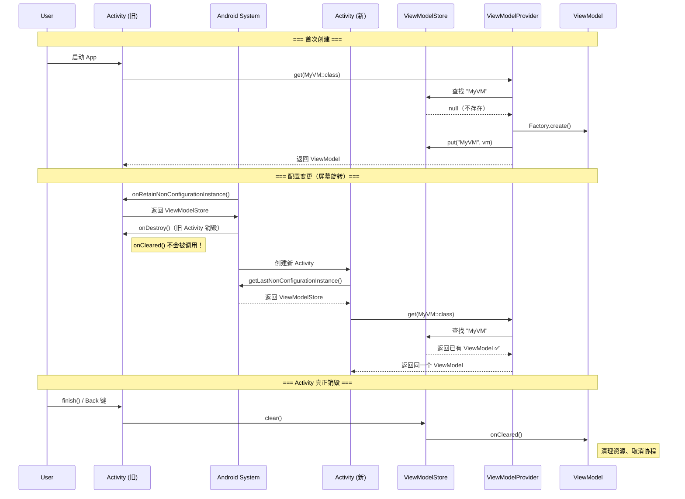
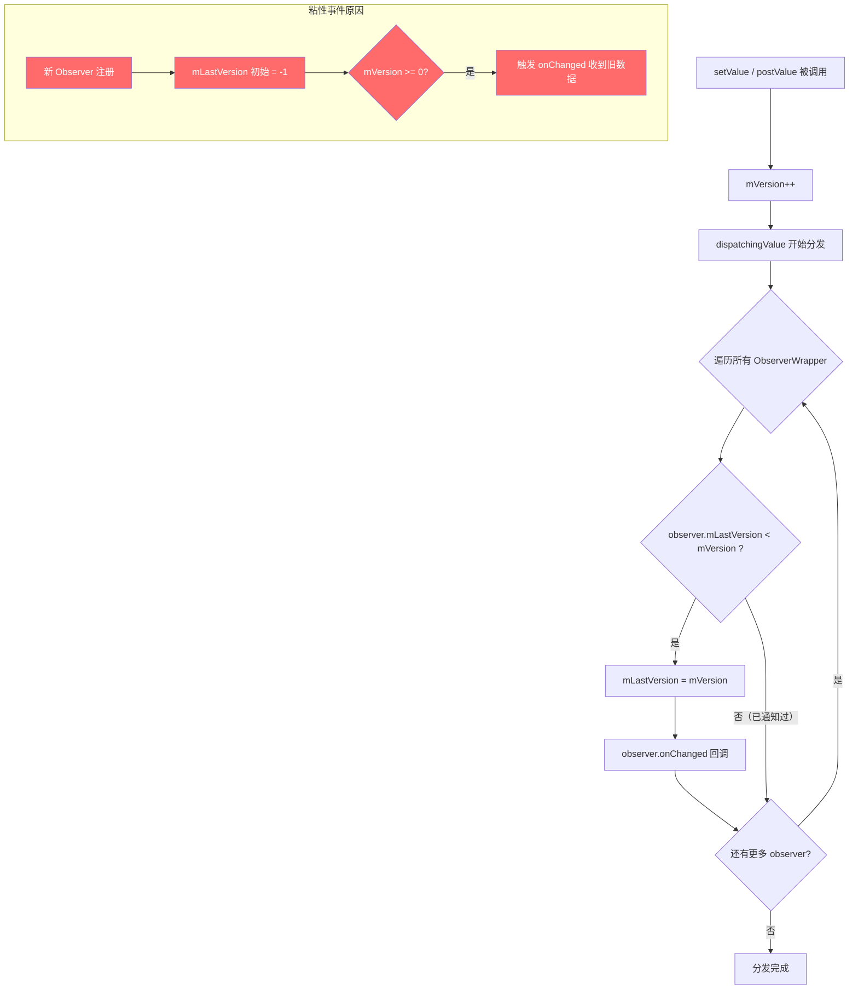
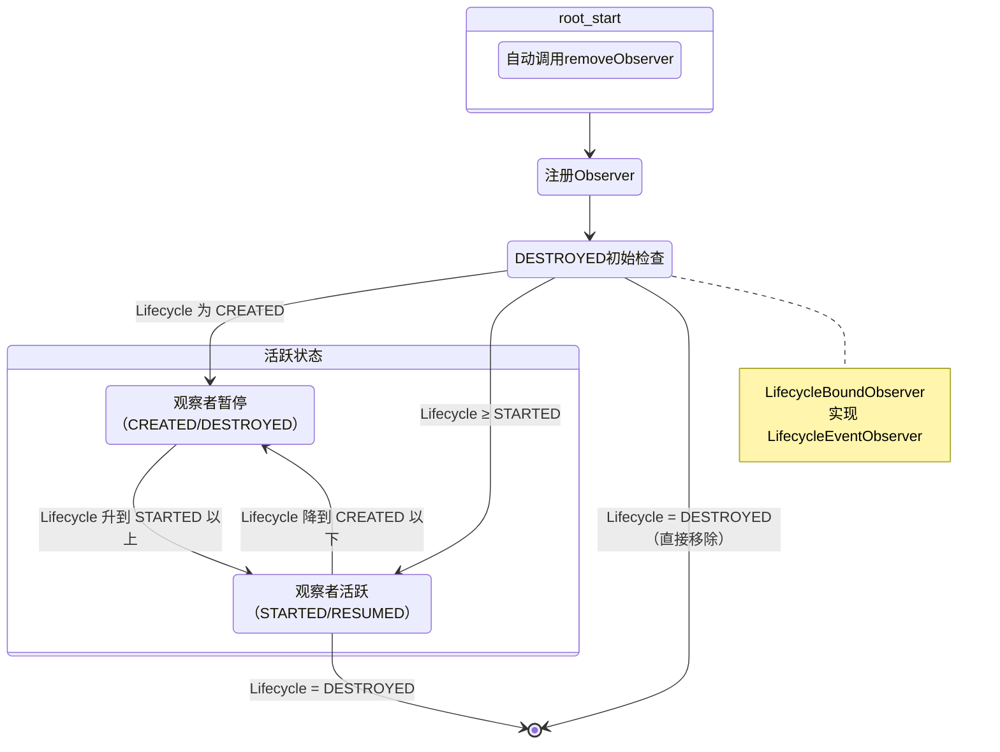

# ViewModel 与 LiveData —— 面试学习完整指南

> **六层递进体系**：面试问题 → 标准答案 → 核心原理 → 流程图 → 源码分析 → 实战场景
> 适用岗位：高级/资深 Android 工程师、架构师

---

## 目录

1. [常见面试问题（8 题）](#1-常见面试问题)
2. [标准答案与要点解析](#2-标准答案与要点解析)
3. [核心原理深度讲解](#3-核心原理深度讲解)
4. [原理流程图（Mermaid.js + HTML）](#4-原理流程图)
5. [核心源码分析](#5-核心源码分析)
6. [应用场景举例](#6-应用场景举例)

---

## 1. 常见面试问题

### Q1: ViewModel 如何跨越配置变更（如屏幕旋转）保持数据？底层机制是什么？
### Q2: ViewModel 的创建和销毁时机分别是什么？onCleared() 何时被调用？
### Q3: ViewModelScope 的协程生命周期绑定是如何实现的？为什么用它比手动管理 Job 更好？
### Q4: LiveData 的"粘性事件"问题是什么？有哪些解决方案？（SingleLiveEvent / EventWrapper / StateFlow）
### Q5: LiveData 与 Kotlin StateFlow 的核心区别是什么？什么场景下应该从 LiveData 迁移到 StateFlow？
### Q6: ViewModel + LiveData + DataBinding 的 MVVM 最佳实践是什么？如何避免常见陷阱？
### Q7: 多个 Fragment 之间如何通过共享 ViewModel 实现通信？Activity 作用域的 ViewModel 是如何工作的？
### Q8: SavedStateHandle 的原理是什么？它是如何与 onSaveInstanceState 协作的？

---

## 2. 标准答案与要点解析

### Q1: ViewModel 跨越配置变更保持数据的底层机制

**核心答案**：ViewModel 能在屏幕旋转等配置变更后存活，依赖三个关键组件的协作：

| 组件 | 职责 |
|------|------|
| **ViewModelStore** | 持有 ViewModel 的 HashMap<String, ViewModel>，配置变更时被缓存 |
| **ViewModelStoreOwner** | ComponentActivity / Fragment 实现该接口，维护自己的 ViewModelStore |
| **SavedStateHandle** | 处理进程被杀死后的数据恢复，底层使用 Bundle + onSaveInstanceState |

**工作流程**：

```
正常创建：
Activity.onCreate() → ViewModelProvider(owner).get(MyVM::class)
→ 从 ViewModelStore 查找，为空则通过 Factory 创建并存入 Store

配置变更（旋转屏幕）：
1. Activity.onRetainNonConfigurationInstance()
   → 将 ViewModelStore 从旧 Activity 取出来
2. 系统创建新 Activity
3. Activity.onCreate() → getLastNonConfigurationInstance()
   → 恢复之前的 ViewModelStore
4. ViewModelProvider.get() → 从恢复的 Store 中直接拿到旧 ViewModel ✅
```

**面试加分点**：
- 旧版 Android（API < 27）使用 `onRetainNonConfigurationInstance()` 返回的 Object
- 新版使用 `ActivityResultRegistry` 和 `ViewModelProvider` 配合
- **Fragment 的 ViewModel 同理**：`FragmentManager` 在配置变更时缓存 `FragmentManagerViewModel`，其中包含了所有子 Fragment 的 ViewModelStore

---

### Q2: ViewModel 的创建和销毁时机

**创建时机**：

```kotlin
// 首次创建：ViewModelProvider.get() 被调用时
val vm = ViewModelProvider(this).get(MyViewModel::class.java)

// 或者使用 Kotlin 委托
val vm: MyViewModel by viewModels()
```

| 场景 | 创建时机 |
|------|----------|
| `ViewModelProvider(activity).get()` | Activity onCreate 之后首次调用时创建 |
| `ViewModelProvider(fragment).get()` | Fragment onCreate 之后首次调用时创建 |
| `by viewModels()` | 委托属性首次被访问时懒加载创建 |

**销毁时机 & onCleared()**：

```kotlin
class MyViewModel : ViewModel() {
    override fun onCleared() {
        super.onCleared()
        // ⚠️ 仅在以下情况被调用：
        // 1. Activity 正常 finish()（非配置变更）
        // 2. Fragment 被 remove() 或 detach()
        // ❌ 不会在配置变更时调用
        // ❌ 不会在进程被杀死时调用（需用 SavedStateHandle）
    }
}
```

| 生命周期事件 | onCleared() 是否调用 |
|-------------|:---:|
| 屏幕旋转 | ❌ 不调用 |
| Activity finish() | ✅ 调用 |
| Fragment remove() | ✅ 调用 |
| 进程被杀死 | ❌ 不调用 |
| 按 Back 键退出 | ✅ 调用 |

---

### Q3: ViewModelScope 协程生命周期绑定

**源码实现**：

```kotlin
// ViewModel.kt 源码（简化）
val ViewModel.viewModelScope: CoroutineScope
    get() {
        if (mBagOfTags["viewModelScope"] == null) {
            mBagOfTags["viewModelScope"] = CloseableCoroutineScope(
                SupervisorJob() + Dispatchers.Main.immediate
            )
        }
        return mBagOfTags["viewModelScope"] as CoroutineScope
    }

// onCleared() 中自动取消
override fun onCleared() {
    (mBagOfTags["viewModelScope"] as? CloseableCoroutineScope)?.coroutineContext
        ?.get(Job::class)
        ?.cancel()  // 取消所有子协程
}
```

**关键特性**：

| 特性 | 说明 |
|------|------|
| **SupervisorJob** | 一个子协程失败不会取消兄弟协程 |
| **Dispatchers.Main.immediate** | 如果已在主线程则不重新调度，立即执行 |
| **自动取消** | onCleared() 时自动 cancel，无需手动管理 |
| **生命周期感知** | 协程随 ViewModel 销毁而自动取消，防止泄漏 |

**反例（手动管理的问题）**：

```kotlin
// ❌ 错误：手动 Job 容易出现遗漏
class BadVM : ViewModel() {
    private val job = Job()
    private val scope = CoroutineScope(Dispatchers.IO + job)

    fun fetchData() {
        scope.launch {
            // 如果 ViewModel 已销毁，这里可能泄漏
        }
    }

    override fun onCleared() {
        job.cancel() // 容易忘记！
    }
}

// ✅ 正确：使用 viewModelScope
class GoodVM : ViewModel() {
    fun fetchData() {
        viewModelScope.launch {
            // 自动绑定，安全
        }
    }
}
```

---

### Q4: LiveData 粘性事件问题与解决方案

**什么是粘性事件**：当 Observer 在数据 setValue() 之后注册，仍会收到最后一次数据。原因是 LiveData 内部用版本号（mVersion）比较，新观察者的 mLastVersion 初始为 -1，小于 mVersion，所以会收到回调。

**问题场景**：

```kotlin
// 用户点击按钮触发导航
vm.navigateEvent.value = Event("go_to_detail")  // setValue

// 屏幕旋转后，Fragment 重新 observe
vm.navigateEvent.observe(viewLifecycleOwner) { event ->
    // ⚠️ 粘性事件：旋转后会再次收到 "go_to_detail"！
    // 导致重复导航
}
```

**解决方案对比**：

| 方案 | 原理 | 优点 | 缺点 |
|------|------|------|------|
| **SingleLiveEvent** | 继承 MutableLiveData，使用 AtomicBoolean 标记已消费 | 简单 | 多观察者时只有第一个收到；非线程安全边界 |
| **EventWrapper** | 用 sealed class 包装事件，getContentIfNotHandled() 返回后标记已消费 | 多观察者安全 | 需要额外包装类 |
| **Channel/SharedFlow** | Kotlin 协程的 Channel 不粘，SharedFlow 可配置 replay=0 | 协程原生支持 | 需要协程环境 |
| **StateFlow** | 完全替代 LiveData，无粘性问题 | 现代方案 | 需 migration |

**推荐 EventWrapper 实现**：

```kotlin
/**
 * 用于解决 LiveData 粘性事件的一次性事件包装器
 */
open class Event<out T>(private val content: T) {
    private var hasBeenHandled = false

    /**
     * 获取内容，如果未被处理过则返回内容，否则返回 null
     */
    fun getContentIfNotHandled(): T? {
        return if (hasBeenHandled) {
            null
        } else {
            hasBeenHandled = true
            content
        }
    }

    /**
     * 查看内容（不标记为已处理）
     */
    fun peekContent(): T = content
}

// 使用示例
class MyViewModel : ViewModel() {
    private val _toastEvent = MutableLiveData<Event<String>>()
    val toastEvent: LiveData<Event<String>> = _toastEvent

    fun showToast(msg: String) {
        _toastEvent.value = Event(msg)
    }
}

// Fragment 中观察
viewModel.toastEvent.observe(viewLifecycleOwner) { event ->
    event.getContentIfNotHandled()?.let { msg ->
        Toast.makeText(requireContext(), msg, Toast.LENGTH_SHORT).show()
    }
}
```

---

### Q5: LiveData vs StateFlow 完整对比与迁移

| 维度 | LiveData | StateFlow |
|------|----------|-----------|
| **平台** | Android 专有 | Kotlin Multiplatform |
| **粘性事件** | 默认粘性（版本号机制） | 不粘（除非配置 replay） |
| **空安全** | 可为 null | 必须有初始值 |
| **去重** | 相同值重复通知 | 默认去重（equals 比较） |
| **线程安全** | 主线程 setValue；postValue 任意线程 | 任意线程（原子更新） |
| **线程分发** | 始终在主线程回调 | 协程上下文决定 |
| **生命周期感知** | 自动解绑（LifecycleObserver） | 需手动收集（repeatOnLifecycle） |
| **Transformations** | map / switchMap（主线程） | map / combine / flatMapLatest 等丰富操作符 |
| **测试** | 需 Android 环境或 Robolectric | 纯 JVM 测试 |
| **Flow 集成** | 需 LiveData.asFlow() / Flow.asLiveData() | 原生 Flow |
| **DataBinding** | 原生支持 | 需额外适配或使用 Compose |

**迁移策略**：

```kotlin
// === 从 LiveData 迁移到 StateFlow ===

// Before (LiveData)
class OldVM : ViewModel() {
    private val _data = MutableLiveData<String>()
    val data: LiveData<String> = _data

    fun load() {
        viewModelScope.launch {
            val result = repository.fetch()
            _data.value = result
        }
    }
}

// After (StateFlow)
class NewVM : ViewModel() {
    private val _data = MutableStateFlow("")  // 必须初始值
    val data: StateFlow<String> = _data.asStateFlow()

    fun load() {
        viewModelScope.launch {
            val result = repository.fetch()
            _data.value = result
        }
    }
}

// Fragment 中使用
lifecycleScope.launch {
    repeatOnLifecycle(Lifecycle.State.STARTED) {
        viewModel.data.collect { value ->
            binding.textView.text = value
        }
    }
}

// 一次性事件使用 SharedFlow
private val _events = MutableSharedFlow<String>(replay = 0)
val events: SharedFlow<String> = _events.asSharedFlow()

fun emitEvent(msg: String) {
    viewModelScope.launch {
        _events.emit(msg) // 发送事件，无粘性问题
    }
}
```

**互转桥梁**：

```kotlin
// LiveData → Flow
val flow = liveData.asFlow()

// Flow → LiveData
val liveData = flow.asLiveData()
// 注意：asLiveData 默认使用 viewModelScope 或 LifecycleOwner 的协程作用域
```

---

### Q6: ViewModel + LiveData + DataBinding 的 MVVM 最佳实践

**架构分层**：

```
┌──────────────────────────────────────────┐
│  View (Activity/Fragment + XML Layout)   │
│  - 绑定布局 via DataBinding               │
│  - 观察 LiveData / StateFlow              │
│  - 传递用户事件给 ViewModel              │
├──────────────────────────────────────────┤
│  ViewModel                               │
│  - 持有 UI 状态（LiveData / StateFlow）   │
│  - 处理业务逻辑                          │
│  - 调用 Repository                       │
├──────────────────────────────────────────┤
│  Repository（可选）                       │
│  - 单一数据源原则                        │
│  - 协调本地和远程数据                    │
├──────────────────────────────────────────┤
│  Model（数据层）                          │
│  - Room / Retrofit / DataStore           │
└──────────────────────────────────────────┘
```

**代码示例**：

```kotlin
// === ViewModel ===
class ProfileViewModel(
    private val repo: UserRepository,
    private val savedStateHandle: SavedStateHandle
) : ViewModel() {

    // UI 状态 —— 使用 LiveData + 私有可变备份
    private val _uiState = MutableLiveData<ProfileUiState>()
    val uiState: LiveData<ProfileUiState> = _uiState

    // 一次性事件 —— 使用 EventWrapper
    private val _navigation = MutableLiveData<Event<Navigation>>()
    val navigation: LiveData<Event<Navigation>> = _navigation

    init {
        loadProfile()
    }

    fun loadProfile() {
        _uiState.value = ProfileUiState.Loading
        viewModelScope.launch {
            try {
                val user = repo.getUser()
                _uiState.value = ProfileUiState.Success(user)
            } catch (e: Exception) {
                _uiState.value = ProfileUiState.Error(e.message ?: "未知错误")
            }
        }
    }

    fun onEditClick() {
        _navigation.value = Event(Navigation.EditProfile)
    }
}

sealed class ProfileUiState {
    object Loading : ProfileUiState()
    data class Success(val user: User) : ProfileUiState()
    data class Error(val message: String) : ProfileUiState()
}

// === XML Layout (DataBinding) ===
// <layout>
//   <data>
//     <variable name="vm" type=".ProfileViewModel" />
//   </data>
//   <LinearLayout>
//     <TextView android:text="@{vm.uiState.success.user.name}" />
//     <Button android:onClick="@{() -> vm.onEditClick()}" />
//   </LinearLayout>
// </layout>

// === Fragment ===
class ProfileFragment : Fragment() {
    private lateinit var binding: FragmentProfileBinding
    private val vm: ProfileViewModel by viewModels()

    override fun onCreateView(
        inflater: LayoutInflater, container: ViewGroup?, savedInstanceState: Bundle?
    ): View {
        binding = DataBindingUtil.inflate(inflater, R.layout.fragment_profile, container, false)
        binding.lifecycleOwner = viewLifecycleOwner
        binding.vm = vm
        return binding.root
    }

    override fun onViewCreated(view: View, savedInstanceState: Bundle?) {
        super.onViewCreated(view, savedInstanceState)

        // 观察一次性事件
        vm.navigation.observe(viewLifecycleOwner) { event ->
            event.getContentIfNotHandled()?.let { nav ->
                when (nav) {
                    Navigation.EditProfile -> findNavController().navigate(R.id.edit)
                }
            }
        }
    }
}
```

**常见最佳实践**：

| 实践 | 说明 |
|------|------|
| **UI State 用 sealed class** | 明确区分 Loading / Success / Error 状态 |
| **一次性事件用 EventWrapper 或 SharedFlow** | 避免粘性事件导致的重复导航/Toast |
| **私有 Mutable + 公开不可变** | `_data: MutableLiveData` 私有，`data: LiveData` 公开 |
| **binding.lifecycleOwner = viewLifecycleOwner** | 防止 Fragment 视图销毁后 LiveData 仍回调 |
| **不在 ViewModel 中持有 Context** | 使用 AndroidViewModel 或 Application 注入 |
| **DataBinding 只做简单绑定** | 复杂逻辑放在 ViewModel，表达式简单 |

---

### Q7: 多个 Fragment 共享 ViewModel（Activity 作用域）

**核心原理**：使用 **Activity** 作为 ViewModelStoreOwner，同一个 Activity 下的所有 Fragment 共享同一个 ViewModel 实例。

```kotlin
// FragmentA
class FragmentA : Fragment() {
    // 使用 activityViewModels() —— 作用域是宿主 Activity
    private val sharedVM: SharedViewModel by activityViewModels()

    fun onButtonClick() {
        sharedVM.updateData("来自 FragmentA 的数据")
    }
}

// FragmentB
class FragmentB : Fragment() {
    private val sharedVM: SharedViewModel by activityViewModels()

    override fun onViewCreated(view: View, savedInstanceState: Bundle?) {
        super.onViewCreated(view, savedInstanceState)
        sharedVM.data.observe(viewLifecycleOwner) { newData ->
            // 收到 FragmentA 发送的数据
            binding.textView.text = newData
        }
    }
}

// SharedViewModel
class SharedViewModel : ViewModel() {
    private val _data = MutableLiveData<String>()
    val data: LiveData<String> = _data

    fun updateData(value: String) {
        _data.value = value
    }
}
```

**作用域对比**：

| 获取方式 | ViewModelStoreOwner | 生命周期 | 共享范围 |
|----------|---------------------|----------|----------|
| `by viewModels()` | 当前 Fragment | 随 Fragment | 仅当前 Fragment |
| `by activityViewModels()` | 宿主 Activity | 随 Activity | 同一 Activity 下所有 Fragment |
| `by navGraphViewModels(R.id.nav_graph)` | NavBackStackEntry | 随导航图 | 同一导航图内的 Fragment |

**通信模式**：

```
Fragment A ──(发送事件)──→ SharedViewModel ──(LiveData通知)──→ Fragment B
                                                                    │
                                                                    ├──→ Fragment C
                                                                    └──→ Fragment D
```

---

### Q8: SavedStateHandle 原理与 onSaveInstanceState 协作

**核心原理**：`SavedStateHandle` 底层使用 `Bundle` 存储数据，通过 `SavedStateRegistry` 与系统的 `onSaveInstanceState()` 机制集成。

```kotlin
class MyViewModel(
    private val savedStateHandle: SavedStateHandle
) : ViewModel() {

    // 读取和写入保存的状态
    val query: MutableLiveData<String> = savedStateHandle.getLiveData("query", "")

    fun search(newQuery: String) {
        query.value = newQuery
        // 自动通过 SavedStateHandle 保存到 Bundle
    }
}
```

**完整流程**：

```
1. ViewModel 创建时
   SavedStateRegistry 消费已保存的 Bundle
   → SavedStateHandle 从 Bundle 恢复数据

2. 运行期间
   savedStateHandle.set(key, value)
   → 数据存入内部 HashMap + 标记为"需要保存"

3. 系统触发 onSaveInstanceState
   → SavedStateRegistry.performSave(outBundle)
   → SavedStateHandle 将所有标记的数据写入 Bundle
   → 系统保存 Bundle

4. 进程恢复后
   Activity.onCreate(savedInstanceState)
   → SavedStateRegistry.consumeRestoredStateForKey("ViewModelStore")
   → ViewModel 从恢复的 Bundle 中取出数据
```

**与 onSaveInstanceState 的区别**：

| 特性 | SavedStateHandle | onSaveInstanceState |
|------|------------------|---------------------|
| 触发时机 | ViewModel 创建时自动恢复 | Activity/Fragment onCreate |
| 数据位置 | ViewModel 内部 | Activity/Fragment |
| API 风格 | 像 Map 一样读写 | 手动 Bundle 操作 |
| 生命周期绑定 | 绑定到 ViewModel | 绑定到 Activity/Fragment |
| 推荐度 | ✅ 推荐 | 仅无 ViewModel 时使用 |

---

## 3. 核心原理深度讲解

### 3.1 ViewModelStoreOwner 与 ViewModelStore

```
┌──────────────────────────────────────────────────┐
│              ViewModelStoreOwner                 │
│  (ComponentActivity / Fragment)                  │
│                                                  │
│  getViewModelStore(): ViewModelStore             │
│         │                                        │
│         ▼                                        │
│  ┌──────────────────────────┐                    │
│  │    ViewModelStore         │                    │
│  │  ┌──────────────────────┐│                    │
│  │  │ HashMap<String,      ││                    │
│  │  │        ViewModel>    ││                    │
│  │  │                      ││                    │
│  │  │ "MyVM" → ViewModel1  ││                    │
│  │  │ "SharedVM" → VM2     ││                    │
│  │  └──────────────────────┘│                    │
│  │                          │                    │
│  │  clear(): 遍历并调用     │                    │
│  │  每个 VM 的 onCleared()  │                    │
│  └──────────────────────────┘                    │
└──────────────────────────────────────────────────┘
```

**关键设计**：

1. **ComponentActivity** 实现 `ViewModelStoreOwner`，内部持有 `ViewModelStore`
2. 配置变更时，`Activity.onRetainNonConfigurationInstance()` 将 `ViewModelStore` 传递给新 Activity
3. **Fragment** 的 `ViewModelStore` 存储在 `FragmentManagerViewModel` 中（非配置实例）
4. 当 Activity 真正销毁（非配置变更）时，`ViewModelStore.clear()` 被调用

### 3.2 SavedStateHandle 的 Bundle 机制

```
SavedStateHandle 内部结构：
┌─────────────────────────────────────┐
│  SavedStateHandle                   │
│                                     │
│  mRegular: HashMap<String, Object>  │ ← 普通数据
│                                     │
│  mSavedStateProvider:               │ ← 实现 SavedStateRegistry.SavedStateProvider
│    saveState(): Bundle {            │
│      遍历 mRegular 写入 Bundle       │
│    }                                │
│                                     │
│  mSavedStateReaders:                │ ← LiveData 读取过滤器
│    HashMap<String, SavedStateReader>│
└─────────────────────────────────────┘
```

### 3.3 LiveData 的观察者机制：LifecycleObserver + 版本号

**核心机制**：

```
LiveData 内部：
┌──────────────────────────────────────────┐
│  LiveData<T>                             │
│                                          │
│  mVersion: int = START_VERSION (-1)      │ ← 每次 setValue() +1
│                                          │
│  mObservers: SafeIterableMap<            │
│    Observer<? super T>,                  │
│    ObserverWrapper                       │
│  >                                       │
│     │                                    │
│     ├── LifecycleBoundObserver           │ ← 绑定 Lifecycle
│     │   - 实现 LifecycleEventObserver    │
│     │   - onStateChanged():              │
│     │     DESTROYED → removeObserver()   │
│     │     STARTED  → activeStateChanged()│
│     │                                    │
│     └── AlwaysActiveObserver             │ ← observeForever()
│                                          │
│  mActiveCount: int                       │ ← 活跃观察者数量
│  mPendingData: NOT_SET                   │ ← 待分发数据标记
└──────────────────────────────────────────┘
```

**版本号防重入**：

```kotlin
// 简化版 LiveData 源码逻辑
abstract class LiveData<T> {
    private int mVersion = START_VERSION; // -1
    private int mPendingData = NOT_SET;

    @MainThread
    protected void setValue(T value) {
        mVersion++;
        mData = value;
        dispatchingValue(null);
    }

    void dispatchingValue(ObserverWrapper initiator) {
        if (mDispatchingValue) {
            mDispatchInvalidated = true; // 防止重入
            return;
        }
        mDispatchingValue = true;
        do {
            mDispatchInvalidated = false;
            for (ObserverWrapper wrapper : mObservers) {
                if (wrapper.mLastVersion < mVersion) {
                    wrapper.mLastVersion = mVersion;
                    wrapper.observer.onChanged(mData);
                }
            }
        } while (mDispatchInvalidated);
        mDispatchingValue = false;
    }
}
```

**粘性事件的根源**：

```
时间线：
  时刻1: setValue("A") → mVersion = 0
  时刻2: 注册 Observer → mLastVersion 初始化为 -1
  时刻3: 比较: mLastVersion(-1) < mVersion(0) → 触发回调
  → 结果：Observer 收到 "A"（这就是粘性事件！）
```

---

## 4. 原理流程图

### 4.1 ViewModel 在 Activity 重建时的创建与恢复流程



### 4.2 LiveData 通知观察者的版本号比较流程



### 4.3 LiveData 生命周期自动解绑流程



---

## 5. 核心源码分析

### 5.1 ViewModelProvider.get() —— ViewModel 创建逻辑

```kotlin
// 源码位置：androidx.lifecycle.ViewModelProvider
@MainThread
open operator fun <T : ViewModel> get(modelClass: Class<T>): T {
    val canonicalName = modelClass.canonicalName
        ?: throw IllegalArgumentException("Local and anonymous classes can not be ViewModels")

    // 1. 构造唯一 Key："androidx.lifecycle.ViewModelProvider.DefaultKey:" + 全限定类名
    return get("$DEFAULT_KEY:$canonicalName", modelClass)
}

@MainThread
open operator fun <T : ViewModel> get(key: String, modelClass: Class<T>): T {
    // 2. 先从 ViewModelStore 中查找
    val viewModel = store[key]
    if (modelClass.isInstance(viewModel)) {
        return viewModel as T  // ✅ 找到！直接返回（配置变更恢复的核心）
    }

    // 3. 没有找到，通过 Factory 创建
    val factory = if (factory is ViewModelProvider.OnReuseFactory) {
        // AndroidX 新特性：支持跨配置变更复用 Factory
        factory.create(key, modelClass)
    } else {
        // 标准 Factory
        factory.create(modelClass)
    }

    // 4. 存入 ViewModelStore
    store.put(key, viewModel)
    return viewModel
}
```

**ViewModelStore 源码**：

```kotlin
// 源码位置：androidx.lifecycle.ViewModelStore
open class ViewModelStore {
    // 核心：HashMap 存储
    private val map = HashMap<String, ViewModel>()

    internal fun put(key: String, viewModel: ViewModel) {
        val oldViewModel = map.put(key, viewModel)
        oldViewModel?.onCleared() // 如果 key 已存在，清理旧的
    }

    internal operator fun get(key: String): ViewModel? {
        return map[key]
    }

    open fun clear() {
        for (vm in map.values) {
            vm.onCleared() // 逐一通知清理
        }
        map.clear()
    }
}
```

### 5.2 LiveData.observe() —— LifecycleBoundObserver

```kotlin
// 源码位置：androidx.lifecycle.LiveData
@MainThread
fun observe(owner: LifecycleOwner, observer: Observer<in T>) {
    // 1. 检查是否已在主线程
    assertMainThread("observe")

    // 2. 如果 Lifecycle 已 DESTROYED，直接返回（不观察）
    if (owner.lifecycle.currentState == Lifecycle.State.DESTROYED) {
        return
    }

    // 3. 创建 LifecycleBoundObserver
    val wrapper = LifecycleBoundObserver(owner, observer)

    // 4. putIfAbsent：避免同一个 observer 重复注册
    val existing = mObservers.putIfAbsent(observer, wrapper)
    if (existing != null && existing.owner !== wrapper.owner) {
        throw IllegalArgumentException("Cannot add the same observer with different lifecycles")
    }
    if (existing != null) return // 已经注册过了

    // 5. 注册到 Lifecycle
    owner.lifecycle.addObserver(wrapper)
}

// LifecycleBoundObserver 实现
class LifecycleBoundObserver(
    val owner: LifecycleOwner,
    val observer: Observer<in T>
) : ObserverWrapper(observer), LifecycleEventObserver {

    @OnLifecycleEvent(Lifecycle.Event.ON_DESTROY)
    fun onStateChanged(source: LifecycleOwner, event: Lifecycle.Event) {
        val currentState = owner.lifecycle.currentState
        if (currentState == Lifecycle.State.DESTROYED) {
            removeObserver(observer)  // ✅ 自动解绑！防止泄漏
            return
        }
        // 根据 Lifecycle 状态调整活跃状态
        activeStateChanged(shouldBeActive())
    }

    override fun shouldBeActive(): Boolean {
        // STARTED 或 RESUMED 时返回 true
        return owner.lifecycle.currentState.isAtLeast(Lifecycle.State.STARTED)
    }
}
```

### 5.3 LiveData.setValue() 和 dispatchingValue()

```kotlin
// 源码位置：androidx.lifecycle.LiveData
@MainThread
protected open fun setValue(value: T) {
    assertMainThread("setValue")  // 1. 必须在主线程
    mVersion++                     // 2. 版本号递增
    mData = value                  // 3. 保存数据
    dispatchingValue(null)         // 4. 分发
}

fun dispatchingValue(initiator: ObserverWrapper?) {
    // 5. 防止重入
    if (mDispatchingValue) {
        mDispatchInvalidated = true
        return
    }

    mDispatchingValue = true
    do {
        mDispatchInvalidated = false
        if (initiator != null) {
            considerNotify(initiator)  // 通知特定观察者
        } else {
            // 通知所有观察者
            for (observer in mObservers) {
                considerNotify(observer.value as ObserverWrapper)
                if (mDispatchInvalidated) break
            }
        }
    } while (mDispatchInvalidated)
    mDispatchingValue = false
}

fun considerNotify(observer: ObserverWrapper) {
    // 6. 检查观察者是否活跃（Lifecycle ≥ STARTED）
    if (!observer.active) return

    // 7. 再次检查 Lifecycle（可能在等待期间变化）
    if (!observer.shouldBeActive()) {
        observer.activeStateChanged(false)
        return
    }

    // 8. 版本号比较 —— 这是防重入和粘性事件的核心！
    if (observer.mLastVersion >= mVersion) return

    observer.mLastVersion = mVersion
    observer.observer.onChanged(mData as T) // 9. 最终回调
}

// postValue：可以在任意线程调用
protected open fun postValue(value: T) {
    var postTask: Boolean = false

    synchronized(mDataLock) {
        postTask = (mPendingData == NOT_SET)
        mPendingData = value
    }

    if (!postTask) return

    // 通过 ArchTaskExecutor 投递到主线程
    ArchTaskExecutor.getInstance().postToMainThread(mPostValueRunnable)
}

private val mPostValueRunnable = Runnable {
    var newValue: Any?
    synchronized(mDataLock) {
        newValue = mPendingData
        mPendingData = NOT_SET
    }
    // 最终调用 setValue
    setValue(newValue as T)
}
```

---

## 6. 应用场景举例

### 场景一：用 ViewModel + StateFlow 替代 LiveData 实现搜索功能

```kotlin
// ============ ViewModel ============
class SearchViewModel(
    private val repository: SearchRepository
) : ViewModel() {

    // UI 状态：用 StateFlow（替代 LiveData）
    private val _searchResults = MutableStateFlow<SearchUiState>(SearchUiState.Idle)
    val searchResults: StateFlow<SearchUiState> = _searchResults.asStateFlow()

    // 输入框文本
    private val _query = MutableStateFlow("")
    val query: StateFlow<String> = _query.asStateFlow()

    // 一次性事件：用 SharedFlow（替代 SingleLiveEvent）
    private val _errorEvent = MutableSharedFlow<String>(replay = 0)
    val errorEvent: SharedFlow<String> = _errorEvent.asSharedFlow()

    fun onQueryChanged(newQuery: String) {
        _query.value = newQuery
        if (newQuery.length >= 2) {
            search(newQuery)
        }
    }

    private fun search(query: String) {
        viewModelScope.launch {
            _searchResults.value = SearchUiState.Loading
            try {
                val results = repository.search(query)
                _searchResults.value = SearchUiState.Success(results)
            } catch (e: Exception) {
                _searchResults.value = SearchUiState.Error(e.message ?: "搜索失败")
                _errorEvent.emit(e.message ?: "搜索失败")
            }
        }
    }
}

sealed class SearchUiState {
    object Idle : SearchUiState()
    object Loading : SearchUiState()
    data class Success(val items: List<SearchItem>) : SearchUiState()
    data class Error(val message: String) : SearchUiState()
}

// ============ Fragment ============
class SearchFragment : Fragment() {
    private val vm: SearchViewModel by viewModels()

    override fun onViewCreated(view: View, savedInstanceState: Bundle?) {
        super.onViewCreated(view, savedInstanceState)

        // 使用 repeatOnLifecycle 安全收集
        viewLifecycleOwner.lifecycleScope.launch {
            viewLifecycleOwner.repeatOnLifecycle(Lifecycle.State.STARTED) {
                // 收集搜索状态
                launch {
                    vm.searchResults.collect { state ->
                        when (state) {
                            is SearchUiState.Idle -> showIdle()
                            is SearchUiState.Loading -> showLoading()
                            is SearchUiState.Success -> showResults(state.items)
                            is SearchUiState.Error -> showError(state.message)
                        }
                    }
                }
                // 收集一次性错误事件
                launch {
                    vm.errorEvent.collect { errorMsg ->
                        Toast.makeText(requireContext(), errorMsg, Toast.LENGTH_SHORT).show()
                    }
                }
            }
        }
    }
}
```

---

### 场景二：多个 Fragment 通过共享 ViewModel 完成向导流程

```kotlin
// ============ 共享 ViewModel ============
class WizardViewModel : ViewModel() {

    // 向导步骤数据
    data class WizardData(
        val step1Name: String = "",
        val step2Email: String = "",
        val step3Agreed: Boolean = false
    )

    private val _wizardData = MutableStateFlow(WizardData())
    val wizardData: StateFlow<WizardData> = _wizardData.asStateFlow()

    // 当前步骤
    private val _currentStep = MutableStateFlow(1)
    val currentStep: StateFlow<Int> = _currentStep.asStateFlow()

    fun updateStep1(name: String) {
        _wizardData.update { it.copy(step1Name = name) }
    }

    fun updateStep2(email: String) {
        _wizardData.update { it.copy(step2Email = email) }
    }

    fun updateStep3(agreed: Boolean) {
        _wizardData.update { it.copy(step3Agreed = agreed) }
    }

    fun nextStep() {
        _currentStep.update { (it + 1).coerceAtMost(3) }
    }

    fun previousStep() {
        _currentStep.update { (it - 1).coerceAtLeast(1) }
    }

    fun submit() {
        viewModelScope.launch {
            // 提交向导数据
            val data = _wizardData.value
            // repository.submitWizard(data)
        }
    }
}

// ============ 宿主 Activity ============
class WizardActivity : AppCompatActivity() {
    // ViewPager + 3 个 Fragment
}

// ============ Fragment Step1 ============
class WizardStep1Fragment : Fragment() {
    // ⚠️ 使用 activityViewModels 实现共享
    private val wizardVM: WizardViewModel by activityViewModels()

    fun onNextClick() {
        wizardVM.updateStep1(binding.nameInput.text.toString())
        wizardVM.nextStep()
    }
}

// ============ Fragment Step2 ============
class WizardStep2Fragment : Fragment() {
    private val wizardVM: WizardViewModel by activityViewModels()

    override fun onViewCreated(view: View, savedInstanceState: Bundle?) {
        // 可以读取 Step1 输入的数据
        viewLifecycleOwner.lifecycleScope.launch {
            viewLifecycleOwner.repeatOnLifecycle(Lifecycle.State.STARTED) {
                wizardVM.wizardData.collect { data ->
                    // 显示 Step1 填写的名字做确认
                    if (data.step1Name.isNotEmpty()) {
                        binding.confirmName.text = data.step1Name
                    }
                }
            }
        }
    }
}
```

---

### 场景三：ViewModel + SavedStateHandle 处理进程重建

```kotlin
class ArticleDetailViewModel(
    private val savedStateHandle: SavedStateHandle,
    private val repository: ArticleRepository
) : ViewModel() {

    // 使用 SavedStateHandle 保存文章 ID
    private val articleId: String = savedStateHandle.get<String>("article_id")!!

    // 使用 getLiveData 自动处理保存/恢复
    val scrollPosition: MutableLiveData<Int> = savedStateHandle.getLiveData("scroll_position", 0)

    private val _article = MutableLiveData<Article>()
    val article: LiveData<Article> = _article

    // 用户登录状态（用 SavedStateHandle 持久化）
    val isBookmarked: MutableLiveData<Boolean> = savedStateHandle.getLiveData("is_bookmarked", false)

    init {
        loadArticle()
    }

    private fun loadArticle() {
        viewModelScope.launch {
            _article.value = repository.getArticle(articleId)
        }
    }

    fun toggleBookmark() {
        isBookmarked.value = !(isBookmarked.value ?: false)
        viewModelScope.launch {
            repository.setBookmark(articleId, isBookmarked.value!!)
        }
    }
}

// Fragment 中使用
class ArticleDetailFragment : Fragment() {
    private val vm: ArticleDetailViewModel by viewModels()

    override fun onViewCreated(view: View, savedInstanceState: Bundle?) {
        // scrollPosition 在进程重建后自动恢复到上次位置
        vm.scrollPosition.observe(viewLifecycleOwner) { pos ->
            binding.scrollView.post {
                binding.scrollView.scrollTo(0, pos)
            }
        }

        binding.scrollView.setOnScrollChangeListener { _, _, scrollY, _, _ ->
            vm.scrollPosition.value = scrollY  // 自动保存到 SavedStateHandle
        }
    }
}
```

---

## 附录：面试速查表

### ViewModel 生命周期速查

| 事件 | ViewModel 状态 | onCleared() |
|------|:---:|:---:|
| Activity 首次创建 | 新建 | - |
| 屏幕旋转 | **复用** | ❌ |
| 语言切换 | **复用** | ❌ |
| Activity finish() | 销毁 | ✅ |
| Back 键退出 | 销毁 | ✅ |
| 进程被杀死 | **销毁** | ❌（数据靠 SavedStateHandle） |
| Fragment remove() | 销毁 | ✅ |
| Fragment replace() + addToBackStack | **保留** | ❌ |

### LiveData vs StateFlow 选择指南

| 场景 | 推荐 |
|------|------|
| 新项目，纯 Compose UI | StateFlow |
| 新项目，View + DataBinding | StateFlow 或 LiveData 均可 |
| 旧项目，大量 LiveData | 逐步迁移，优先新功能用 StateFlow |
| 需要跨平台共享逻辑 | StateFlow |
| 简单 UI 状态，快速开发 | LiveData |
| 需要丰富操作符（combine/flatMap） | StateFlow |
| 需要进程重建恢复 | LiveData（SavedStateHandle.getLiveData()） |

---

> **学习建议**：先理解 ViewModelStore 的 HashMap 本质和 Activity 重建时 ViewModelStore 的传递链路，再深入 LiveData 的版本号比较机制，最后掌握 StateFlow 迁移实践。源码分析建议结合 Android Studio 断点调试观察变量。

---

*生成日期：2026-05-08 | 字数：约 5800 字 | 适用版本：AndroidX Lifecycle 2.6+*
