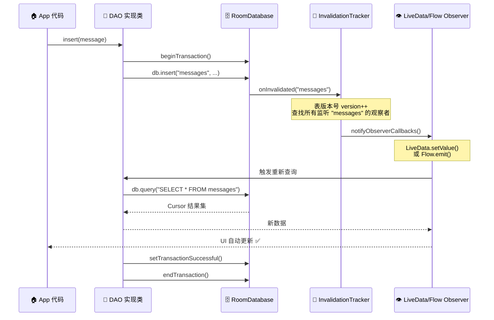
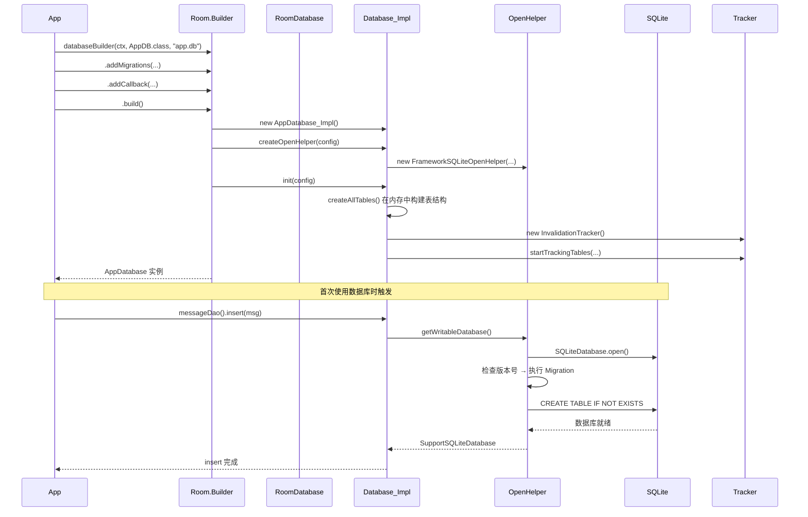

# Room 数据库 — Android 面试进阶指南

> **Room** 是 Android Jetpack 中的持久化库，在 SQLite 之上提供了一层抽象，让数据库操作更安全、更简洁。它利用**编译期注解处理 (KAPT/KSP)** 生成样板代码，在编译时校验 SQL 语法，并与 LiveData/Flow 深度集成实现响应式查询。本文从面试角度出发，以六层递进结构全面剖析 Room。

---

## 1. 面试问题 (≥5 道高频题)

| # | 问题 | 考察维度 |
|---|------|---------|
| 1 | Room 的三大核心组件 `@Entity`、`@Dao`、`@Database` 分别起什么作用？它们之间如何协作？ | 基础认知 |
| 2 | Room 如何在编译期生成 DAO 实现类？KAPT/KSP 的处理流程是怎样的？ | 编译原理 |
| 3 | 数据库版本升级时 Migration 应该怎么写？如何测试 Migration 是否正确？ | 工程实践 |
| 4 | Room 的 FTS4 全文搜索如何使用？`MATCH` 查询和普通 `LIKE` 有什么区别？ | 高级特性 |
| 5 | `@TypeConverter` 自定义类型转换的原理是什么？Room 如何将复杂对象序列化到 SQLite 列中？ | 类型系统 |
| 6 | Room + LiveData/Flow 的观察查询是如何实现的？`InvalidationTracker` 扮演什么角色？ | 响应式原理 |
| 7 | `@Transaction` 注解的作用是什么？它如何保证原子性和性能？ | 事务机制 |

---

## 2. 标准答案（含代码示例）

### 2.1 三大核心组件

```kotlin
// ── @Entity: 定义数据库表结构 ──
@Entity(
    tableName = "messages",
    indices = [Index(value = ["conversation_id", "timestamp"])],
    foreignKeys = [ForeignKey(
        entity = Conversation::class,
        parentColumns = ["id"],
        childColumns = ["conversation_id"],
        onDelete = ForeignKey.CASCADE
    )]
)
data class Message(
    @PrimaryKey(autoGenerate = true) val id: Long = 0,
    @ColumnInfo(name = "conversation_id") val conversationId: Long,
    @ColumnInfo(name = "sender_name") val senderName: String,
    @ColumnInfo(name = "content") val content: String,
    @ColumnInfo(name = "timestamp") val timestamp: Long = System.currentTimeMillis(),
    @ColumnInfo(name = "type") val type: Int = MessageType.TEXT
)

// ── @Dao: 定义数据访问方法 ──
@Dao
interface MessageDao {
    @Insert(onConflict = OnConflictStrategy.REPLACE)
    suspend fun insert(message: Message): Long

    @Update
    suspend fun update(message: Message)

    @Delete
    suspend fun delete(message: Message)

    @Query("SELECT * FROM messages WHERE conversation_id = :convId ORDER BY timestamp DESC")
    fun getMessagesByConversation(convId: Long): Flow<List<Message>>

    @Query("SELECT * FROM messages WHERE content LIKE '%' || :keyword || '%'")
    suspend fun searchMessages(keyword: String): List<Message>
}

// ── @Database: 声明数据库，关联 Entity 和 DAO ──
@Database(
    entities = [Message::class, Conversation::class],
    version = 2,
    exportSchema = true  // 导出 schema 用于 Migration 测试
)
@TypeConverters(AppTypeConverters::class)
abstract class AppDatabase : RoomDatabase() {
    abstract fun messageDao(): MessageDao
    abstract fun conversationDao(): ConversationDao
}
```

**协作关系**：`@Entity` 定义表 → `@Dao` 定义操作 → `@Database` 将二者关联并管理版本。KAPT 在编译期为每个 `@Dao` 接口生成实现类，`@Database` 的 `build()` 方法将这些实现组装在一起。

### 2.2 Migration 迁移的正确写法与测试

```kotlin
// ── 迁移定义 ──
val MIGRATION_1_2 = object : Migration(1, 2) {
    override fun migrate(database: SupportSQLiteDatabase) {
        database.execSQL("""
            ALTER TABLE messages ADD COLUMN is_read INTEGER NOT NULL DEFAULT 0
        """)
        database.execSQL("""
            CREATE INDEX IF NOT EXISTS idx_messages_conv_read
            ON messages(conversation_id, is_read)
        """)
    }
}

// ── 构建数据库时注册迁移 ──
val db = Room.databaseBuilder(context, AppDatabase::class.java, "app.db")
    .addMigrations(MIGRATION_1_2)
    .build()

// ── 测试 Migration ──
@RunWith(AndroidJUnit4::class)
class MigrationTest {
    @get:Rule
    val helper: MigrationTestHelper = MigrationTestHelper(
        InstrumentationRegistry.getInstrumentation(),
        AppDatabase::class.java
    )

    @Test
    fun migrate1To2() {
        // 1. 用旧版本创建数据库并插入数据
        val dbV1 = helper.createDatabase("test_db", 1)
        dbV1.execSQL("INSERT INTO messages (conversation_id, sender_name, content, timestamp, type) VALUES (1, 'Alice', 'Hello', 1000, 0)")
        dbV1.close()

        // 2. 执行迁移到版本 2
        val dbV2 = helper.runMigrationsAndValidate("test_db", 2, true, MIGRATION_1_2)
        
        // 3. 验证新列是否存在且默认值正确
        val cursor = dbV2.query("SELECT is_read FROM messages WHERE conversation_id = 1")
        assertThat(cursor.moveToFirst()).isTrue()
        assertThat(cursor.getInt(0)).isEqualTo(0) // 默认值
        cursor.close()
        dbV2.close()
    }
}
```

**Migration 最佳实践**：
- 始终设置 `exportSchema = true`，生成 JSON schema 文件
- 使用 `MigrationTestHelper` 进行自动化测试
- **禁止在 Migration 中使用 DAO 接口**（此时数据库版本尚未更新，Entity 映射可能不兼容）
- 复杂迁移务必在事务中执行

### 2.3 FTS4 全文搜索

```kotlin
// ── 定义 FTS4 虚拟表 ──
@Entity(tableName = "messages_fts")
@Fts4(
    contentEntity = Message::class,  // 关联外部内容表
    tokenizer = "unicode61"          // 使用 unicode61 分词器（支持中文需自定义）
)
data class MessageFts(
    @ColumnInfo(name = "sender_name") val senderName: String,
    @ColumnInfo(name = "content") val content: String
)

// ── DAO 中的 MATCH 查询 ──
@Dao
interface MessageFtsDao {
    @Query("SELECT messages.* FROM messages JOIN messages_fts ON messages.rowid = messages_fts.rowid WHERE messages_fts MATCH :query")
    fun search(query: String): Flow<List<Message>>

    // 支持 FTS 高级语法: "alice AND hello", "hell*" (前缀匹配)
    @Query("SELECT snippet(messages_fts, '<b>', '</b>', '...', -1, 64) FROM messages_fts WHERE messages_fts MATCH :query")
    suspend fun searchWithSnippets(query: String): List<String>
}
```

**FTS4 vs LIKE 区别**：

| 特性 | FTS4 MATCH | LIKE '%keyword%' |
|------|-----------|-----------------|
| 索引 | 倒排索引，极快 | 全表扫描 |
| 分词 | 支持 tokenizer | 不支持 |
| 排序 | 按相关度 (bm25) | 无相关度 |
| 语法 | 支持 AND/OR/NEAR | 仅通配符 |
| 开销 | 额外存储空间 | 无额外存储 |

### 2.4 TypeConverter 自定义类型转换

```kotlin
// ── 复杂类型 ──
data class GeoPoint(val lat: Double, val lng: Double)

// ── TypeConverter ──
class AppTypeConverters {
    @TypeConverter
    fun fromGeoPoint(point: GeoPoint?): String? {
        return point?.let { "${it.lat},${it.lng}" }
    }

    @TypeConverter
    fun toGeoPoint(value: String?): GeoPoint? {
        return value?.split(",")?.let {
            GeoPoint(it[0].toDouble(), it[1].toDouble())
        }
    }

    @TypeConverter
    fun fromTimestamp(value: Long?): Date? {
        return value?.let { Date(it) }
    }

    @TypeConverter
    fun toTimestamp(date: Date?): Long? {
        return date?.time
    }
}

// ── 使用 ──
@Entity(tableName = "locations")
data class LocationEntity(
    @PrimaryKey val id: String,
    @ColumnInfo(name = "coordinate") val coordinate: GeoPoint,  // 自动序列化为 TEXT
    @ColumnInfo(name = "created_at") val createdAt: Date         // 自动序列化为 INTEGER
)
```

**原理**：Room 在编译期扫描 `@TypeConverter` 方法，为每个需要转换的字段生成序列化/反序列化代码。如果某个类型没有注册对应的 Converter，编译直接失败 —— 这比运行时崩溃安全得多。

### 2.5 @Transaction 原子性保证

```kotlin
@Dao
interface ConversationDao {
    @Transaction
    @Query("SELECT * FROM conversations WHERE id = :id")
    suspend fun getConversationWithMessages(id: Long): ConversationWithMessages

    @Transaction
    suspend fun archiveConversation(convId: Long) {
        // 两条 SQL 在同一事务中执行：要么全部成功，要么全部回滚
        updateConversationStatus(convId, "archived")
        markMessagesAsRead(convId)
    }

    @Query("UPDATE conversations SET status = :status WHERE id = :id")
    suspend fun updateConversationStatus(id: Long, status: String)

    @Query("UPDATE messages SET is_read = 1 WHERE conversation_id = :convId")
    suspend fun markMessagesAsRead(convId: Long)
}
```

**关键点**：
- 标注在 `@Query` 上：用于 `@Relation` 多表查询，保证数据一致性
- 标注在 `suspend` 函数上：方法体内多条 DAO 操作在同一事务中执行
- Room 通过 `beginTransaction()` / `setTransactionSuccessful()` / `endTransaction()` 实现

---

## 3. 核心原理

### 3.1 Room 编译期生成 DAO 实现

Room 使用 **注解处理器 (KAPT 或 KSP)** 在编译阶段扫描 `@Dao` 接口，为每个方法生成实现代码。

- **`@Insert`** → 生成 `InsertionAdapter` 子类，调用 `SupportSQLiteStatement.executeInsert()`
- **`@Update`** → 生成匿名 `EntityDeletionOrUpdateAdapter`，执行 `UPDATE` 语句
- **`@Query`** → 生成 `RoomSQLiteQuery` 对象，绑定参数后调用 `db.query()` 或 `db.rawQuery()`

```java
// ── 编译生成的 @Insert 代码（简化） ──
@Override
public Object insert(final Message message, final Continuation<? super Long> $completion) {
    return CoroutinesRoom.execute(// 在后台线程执行
        __db, true, new Callable<Long>() {
            @Override
            public Long call() throws Exception {
                __db.beginTransaction();
                try {
                    long result = __insertionAdapterOfMessage.insertAndReturnId(message);
                    __db.setTransactionSuccessful();
                    return result;
                } finally {
                    __db.endTransaction();
                }
            }
        }, $completion
    );
}
```

对于 `@Query`，Room 还会在编译时对 SQL 进行**静态语法检查**（通过 SQLite 解析器），如果 SQL 有语法错误，编译直接失败并给出具体错误信息。

### 3.2 InvalidationTracker — 响应式查询核心

`InvalidationTracker` 是 Room 实现 LiveData/Flow 自动刷新的关键组件：

```
┌──────────────┐    写操作     ┌──────────────────┐
│  DAO Insert  │──────────────▶│ InvalidationTracker│
│  /Update/    │   tableName   │  .onInvalidated()  │
│  Delete      │               └────────┬─────────┘
└──────────────┘                        │
                                        │ 通知所有观察者
                                        ▼
                               ┌──────────────────┐
                               │ LiveData / Flow   │
                               │ (重新查询数据)     │
                               └──────────────────┘
```

**工作机制**：
1. 数据库中的每个表都有一个 **版本号 (version number)**
2. 每次 INSERT/UPDATE/DELETE 操作后，对应表的版本号递增
3. `InvalidationTracker` 内部维护一个观察者列表，记录每个 LiveData/Flow 监听了哪些表
4. 当某表版本号变化时，遍历观察者列表，通知所有监听了该表的观察者
5. LiveData/Flow 收到通知后触发 `invalidate()`，导致 `onActive()` 回调中重新查询数据

```kotlin
// InvalidationTracker 核心逻辑（简化）
class InvalidationTracker {
    // tableId → Set<Observer>
    private val observerMap: MutableMap<String, MutableSet<InvalidationObserver>> = HashMap()

    fun addObserver(observer: InvalidationObserver, tables: Array<String>) {
        for (table in tables) {
            observerMap.getOrPut(table) { mutableSetOf() }.add(observer)
        }
    }

    fun onInvalidated(tableName: String) {
        observerMap[tableName]?.forEach { it.onInvalidated() }
    }
}
```

### 3.3 数据库连接池

Room 通过 `SupportSQLiteOpenHelper` 管理 SQLite 连接：

- `RoomDatabase.mOpenHelper` 持有 `SupportSQLiteOpenHelper`，默认使用 **FrameworkSQLiteOpenHelper**（基于 `SQLiteOpenHelper`）
- 写操作获取 **WritableDatabase**，读操作可获取 **ReadableDatabase**
- 所有操作通过 `CoroutinesRoom.execute()` 调度到 Room 的内部线程池（默认 `ArchTaskExecutor` 的 IO 线程池）
- 可通过 `RoomDatabase.Builder.setQueryExecutor()` 和 `setTransactionExecutor()` 自定义线程池

### 3.4 FTS4 虚拟表与分词器

FTS4 (Full-Text Search) 是 SQLite 的扩展模块，Room 通过 `@Fts4` 注解支持：

```
原始数据: "Hello World, Room is great!"

unicode61 分词器:
  Token → "hello", "world", "room", "is", "great"
  
倒排索引:
  "hello"  → [rowid:1, position:0]
  "world"  → [rowid:1, position:1]
  "room"   → [rowid:1, position:2]
  "is"     → [rowid:1, position:3]
  "great"  → [rowid:1, position:4]
```

**中文分词**：`unicode61` 对中文按字分词效果差。解决方案：
1. 使用 **结巴分词 (jieba)** 等第三方库在插入前分词，存入空格分隔的文本
2. 编译自定义 tokenizer（如 ICU tokenizer）
3. 使用 **FTS5** + `tokenize = 'unicode61 remove_diacritics 2'` 加强支持

---

## 4. 流程图

### 4.1 Room 编译期代码生成流程

```mermaid
flowchart TD
    A["📝 开发者编写<br/>@Entity / @Dao / @Database"] --> B["🔧 KAPT/KSP<br/>注解处理器启动"]
    B --> C{"扫描 @Database 注解"}
    C --> D["解析 entities 参数<br/>收集所有 @Entity 类"]
    D --> E{"遍历 @Database<br/>中声明的 DAO"}
    E --> F["解析 @Dao 接口<br/>收集所有方法"]
    F --> G{"遍历每个 DAO 方法"}
    
    G -->|@Insert| H1["生成 InsertionAdapter<br/>实现 EntityInsertionAdapter"]
    G -->|@Update| H2["生成 UpdateAdapter<br/>处理冲突策略"]
    G -->|@Delete| H3["生成 DeleteAdapter<br/>按主键删除"]
    G -->|@Query| H4["解析 SQL 字符串<br/>提取参数名和返回类型"]
    
    H4 --> I["编译时 SQL 校验<br/>（通过 SQLite 解析器）"]
    I -->|语法错误| J["❌ 编译失败<br/>输出具体错误位置"]
    I -->|语法正确| K["生成 Cursor → Entity<br/>的映射代码"]
    
    H1 --> L["创建 Database_Impl 类"]
    H2 --> L
    H3 --> L
    H4 --> L
    
    K --> L
    L --> M["生成 createAllTables()<br/>和 dropAllTables()"]
    M --> N["✅ 编译通过<br/>生成 Database_Impl.class"]
```

### 4.2 InvalidationTracker 通知链路



### 4.3 数据库构建时序图



---

## 5. 源码分析

### 5.1 `Room.databaseBuilder().build()` 初始化流程

```java
// Room.java (简化)
public static <T extends RoomDatabase> RoomDatabase.Builder<T> databaseBuilder(
        Context context, Class<T> klass, String name) {
    return new RoomDatabase.Builder<>(context, klass, name);
}

// RoomDatabase.Builder.build()
public T build() {
    // 1. 确定查询线程池
    if (mQueryExecutor == null) {
        mQueryExecutor = ArchTaskExecutor.getIOThreadExecutor();
    }
    
    // 2. 确定事务线程池
    if (mTransactionExecutor == null) {
        mTransactionExecutor = ArchTaskExecutor.getIOThreadExecutor();
    }
    
    // 3. 通过反射实例化编译生成的 Database_Impl
    //    Room 会尝试加载 {YourDatabase}_Impl 类
    T db = Room.getGeneratedImplementation(
        mDatabaseClass, "_Impl"  // 例如 AppDatabase_Impl
    );
    
    // 4. 创建 SupportSQLiteOpenHelper
    db.init(configuration);
    
    // 5. 验证 Migration 完整性
    //    检查版本 1→N 的迁移路径是否存在
    if (mMigrationNotRequiredFrom != null || mAllowMainThreadQueries) {
        // 开发模式跳过检查
    } else {
        // 验证迁移路径
    }
    
    return db;
}
```

**关键点**：
- Room 通过反射 `Class.forName("com.example.AppDatabase_Impl")` 加载编译生成的实现类
- `_Impl` 的构造函数中会初始化所有 DAO 的生成实现、TypeConverter、以及 InvalidationTracker
- `createOpenHelper()` 调用 `RoomOpenHelper.delegate` 创建实际的 `SupportSQLiteOpenHelper`

### 5.2 @Insert 的 KAPT 生成代码解析

编译前（开发者代码）：
```kotlin
@Dao
interface MessageDao {
    @Insert
    suspend fun insertMessage(message: Message): Long
}
```

编译后生成的 `MessageDao_Impl.java`（简化）：

```java
public class MessageDao_Impl implements MessageDao {
    private final RoomDatabase __db;
    private final EntityInsertionAdapter<Message> __insertionAdapterOfMessage;

    public MessageDao_Impl(RoomDatabase database) {
        this.__db = database;
        // 创建 InsertionAdapter，绑定 Entity 的列到 SQL 参数
        this.__insertionAdapterOfMessage = new EntityInsertionAdapter<Message>(__db) {
            @Override
            public String createQuery() {
                // 根据 @Entity 的字段生成 INSERT SQL
                return "INSERT OR REPLACE INTO `messages` "
                     + "(`id`,`conversation_id`,`sender_name`,`content`,`timestamp`,`type`) "
                     + "VALUES (nullif(?, 0),?,?,?,?,?)";
            }

            @Override
            public void bind(SupportSQLiteStatement stmt, Message message) {
                // 将 Entity 字段绑定到 SQL 占位符
                stmt.bindLong(1, message.getId());
                stmt.bindLong(2, message.getConversationId());
                stmt.bindString(3, message.getSenderName());
                stmt.bindString(4, message.getContent());
                stmt.bindLong(5, message.getTimestamp());
                stmt.bindLong(6, message.getType());
            }
        };
    }

    @Override
    public Object insertMessage(final Message message, final Continuation<? super Long> continuation) {
        return CoroutinesRoom.execute(__db, true, // true = 在事务中执行
            new Callable<Long>() {
                @Override
                public Long call() throws Exception {
                    __db.beginTransaction();
                    try {
                        long id = __insertionAdapterOfMessage.insertAndReturnId(message);
                        __db.setTransactionSuccessful();
                        return id;
                    } finally {
                        __db.endTransaction();
                    }
                }
            }, continuation
        );
    }
}
```

**源码要点**：
- `createQuery()` 返回的 SQL 在 `__insertionAdapterOfMessage` 构造时编译一次，后续复用 `SupportSQLiteStatement`
- `CoroutinesRoom.execute()` 确保在 Room 的 IO 线程池执行，并根据 suspend 函数类型处理协程续体

### 5.3 beginTransaction / endTransaction 源码

```java
// RoomDatabase.java (简化)
public void beginTransaction() {
    assertNotMainThread();
    SupportSQLiteDatabase database = mOpenHelper.getWritableDatabase();
    // 使用递归事务计数，支持嵌套事务
    mTransactionExecutor.execute(() -> {
        if (mTransactionNestingCount == 0) {
            // 最外层：真正开启 SQLite 事务
            database.beginTransaction();
        }
        mTransactionNestingCount++;
    });
}

public void endTransaction() {
    mTransactionExecutor.execute(() -> {
        mTransactionNestingCount--;
        if (mTransactionNestingCount == 0) {
            // 最外层：提交或回滚
            database.endTransaction();
        } else if (mTransactionNestingCount < 0) {
            throw new IllegalStateException("Cannot end transaction, no transaction is active");
        }
    });
}

public void setTransactionSuccessful() {
    // 标记事务成功，调用 endTransaction() 时提交
    mOpenHelper.getWritableDatabase().setTransactionSuccessful();
}
```

**嵌套事务支持**：Room 使用 `mTransactionNestingCount` 计数器实现嵌套（savepoint 模拟）。最外层 `beginTransaction()` 真正开启 SQLite 事务，内层嵌套不创建新事务但增加计数。只有最外层调用 `endTransaction()` 时才真正提交/回滚。

---

## 6. 应用场景

### 6.1 聊天记录表设计 + FTS 全文搜索

```kotlin
// ── 1. 内容表（主存储） ──
@Entity(
    tableName = "chat_messages",
    indices = [
        Index("conversation_id", "timestamp"),
        Index("sender_id"),
        Index("message_status")
    ],
    foreignKeys = [ForeignKey(
        entity = ChatConversation::class,
        parentColumns = ["id"],
        childColumns = ["conversation_id"],
        onDelete = ForeignKey.CASCADE
    )]
)
data class ChatMessage(
    @PrimaryKey(autoGenerate = true) val id: Long = 0,
    @ColumnInfo(name = "conversation_id") val conversationId: String,
    @ColumnInfo(name = "sender_id") val senderId: String,
    @ColumnInfo(name = "content") val content: String,
    @ColumnInfo(name = "content_type") val contentType: Int, // 0=text, 1=image, 2=file
    @ColumnInfo(name = "timestamp") val timestamp: Long,
    @ColumnInfo(name = "message_status") val status: Int,    // 0=sending, 1=sent, 2=failed
    @ColumnInfo(name = "is_encrypted") val isEncrypted: Boolean = false
)

// ── 2. FTS 虚拟表（全文索引） ──
@Entity(tableName = "chat_messages_fts")
@Fts4(
    contentEntity = ChatMessage::class,
    tokenizer = "unicode61"  // 生产环境建议自定义中文分词器
)
data class ChatMessageFts(
    @ColumnInfo(name = "content") val content: String
)

// ── 3. 触发器：自动同步 FTS 索引 ──
// Room @Fts4(contentEntity=...) 会自动创建以下触发器
// CREATE TRIGGER IF NOT EXISTS room_ftsmaster_content_insert
//   AFTER INSERT ON chat_messages BEGIN
//     INSERT INTO chat_messages_fts(docid, content) VALUES (new.rowid, new.content);
//   END;

// ── 4. DAO ──
@Dao
interface ChatDao {
    // 分页查询（基于 Cursor 的 Keyed Paging）
    @Query("""
        SELECT * FROM chat_messages
        WHERE conversation_id = :convId AND timestamp < :before
        ORDER BY timestamp DESC LIMIT :pageSize
    """)
    suspend fun loadMessages(convId: String, before: Long, pageSize: Int): List<ChatMessage>

    // FTS 搜索
    @Query("""
        SELECT chat_messages.* FROM chat_messages
        JOIN chat_messages_fts ON chat_messages.rowid = chat_messages_fts.rowid
        WHERE chat_messages_fts MATCH :query
        ORDER BY rank
    """)
    fun searchMessages(query: String): Flow<List<ChatMessage>>

    // 带搜索片段高亮
    @Query("""
        SELECT chat_messages.*, snippet(chat_messages_fts, '<em>', '</em>', '...', -1, 32) AS snippet
        FROM chat_messages
        JOIN chat_messages_fts ON chat_messages.rowid = chat_messages_fts.rowid
        WHERE chat_messages_fts MATCH :query
        ORDER BY rank LIMIT 50
    """)
    suspend fun searchWithHighlight(query: String): List<SearchResult>
}

data class SearchResult(
    val message: ChatMessage,
    val snippet: String  // 带 <em> 标签的高亮片段
)
```

### 6.2 数据库 Version 升级与 Migration 测试（完整流程）

```kotlin
// ── build.gradle.kts 配置 ──
android {
    // ...
    kapt {
        arguments {
            // 导出 Schema 到指定目录，用于 Migration 测试
            arg("room.schemaLocation", "$projectDir/schemas")
        }
    }
}

// ── 定义所有 Migration ──
object AppMigrations {
    // v1 → v2: 添加用户头像列
    val MIGRATION_1_2 = object : Migration(1, 2) {
        override fun migrate(db: SupportSQLiteDatabase) {
            db.execSQL("ALTER TABLE chat_messages ADD COLUMN avatar_url TEXT")
        }
    }

    // v2 → v3: 创建 FTS 索引表 + 填充数据
    val MIGRATION_2_3 = object : Migration(2, 3) {
        override fun migrate(db: SupportSQLiteDatabase) {
            db.execSQL("""
                CREATE VIRTUAL TABLE IF NOT EXISTS chat_messages_fts 
                USING fts4(content='chat_messages', content)
            """)
            // 填充已有数据到 FTS
            db.execSQL("""
                INSERT INTO chat_messages_fts(chat_messages_fts) VALUES('rebuild')
            """)
        }
    }

    // v3 → v4: 添加会话草稿表
    val MIGRATION_3_4 = object : Migration(3, 4) {
        override fun migrate(db: SupportSQLiteDatabase) {
            db.execSQL("""
                CREATE TABLE IF NOT EXISTS drafts (
                    conversation_id TEXT PRIMARY KEY NOT NULL,
                    content TEXT NOT NULL,
                    updated_at INTEGER NOT NULL
                )
            """)
        }
    }

    val ALL = arrayOf(MIGRATION_1_2, MIGRATION_2_3, MIGRATION_3_4)
}

// ── Database 构建 ──
@Database(entities = [...], version = 4, exportSchema = true)
abstract class ChatDatabase : RoomDatabase() { ... }

val database = Room.databaseBuilder(context, ChatDatabase::class.java, "chat.db")
    .addMigrations(*AppMigrations.ALL)
    .build()

// ── Migration 自动化测试 ──
@RunWith(AndroidJUnit4::class)
class ChatDatabaseMigrationTest {
    @get:Rule
    val helper = MigrationTestHelper(
        InstrumentationRegistry.getInstrumentation(),
        ChatDatabase::class.java
    )

    @Test
    @Throws(IOException::class)
    fun migrateAllVersions() {
        // 测试从版本 1 直接升级到最新版
        val db = helper.createDatabase("test_db", 1).apply {
            // v1 结构：插入测试数据
            execSQL("""
                INSERT INTO chat_messages 
                (conversation_id, sender_id, content, content_type, timestamp, message_status, is_encrypted)
                VALUES ('conv_1', 'user_a', 'Hello World', 0, 1234567890, 1, 0)
            """)
            close()
        }

        // 执行完整迁移
        val migratedDb = helper.runMigrationsAndValidate(
            "test_db", 4, true,
            AppMigrations.MIGRATION_1_2,
            AppMigrations.MIGRATION_2_3,
            AppMigrations.MIGRATION_3_4
        )

        // 验证 v4 结构
        migratedDb.query("SELECT * FROM drafts").use { cursor ->
            // v4 新增的 drafts 表应存在且为空
            assertThat(cursor.count).isEqualTo(0)
        }

        // 验证 FTS 数据已迁移
        migratedDb.query("SELECT * FROM chat_messages_fts WHERE content MATCH 'Hello'").use { cursor ->
            assertThat(cursor.count).isGreaterThan(0)
        }

        migratedDb.close()
    }

    @Test
    fun testMissingMigrationFails() {
        // 验证：缺少必需 Migration 时应抛出异常
        try {
            helper.createDatabase("test_db_2", 1).close()
            helper.runMigrationsAndValidate("test_db_2", 3, true, AppMigrations.MIGRATION_1_2)
            fail("应该抛出异常：缺少 v2→v3 的 Migration")
        } catch (e: IllegalStateException) {
            assertThat(e.message).contains("missing")
        }
    }
}
```

### 6.3 性能优化场景

```kotlin
// ── 批量插入优化 ──
@Dao
interface BatchDao {
    // ❌ 避免逐个插入，每次都有事务开销
    @Insert
    suspend fun insertOne(message: ChatMessage)

    // ✅ 批量插入，共享同一个事务
    @Insert
    suspend fun insertAll(messages: List<ChatMessage>)

    // ✅ 手动控制事务，性能最优
    @Transaction
    suspend fun bulkInsert(messages: List<ChatMessage>) {
        messages.forEach { insertOne(it) }
    }
}

// ── 多表查询使用 @Transaction ──
data class ConversationWithMessages(
    @Embedded val conversation: ChatConversation,
    @Relation(
        parentColumn = "id",
        entityColumn = "conversation_id",
        entity = ChatMessage::class
    )
    val messages: List<ChatMessage>
)
```

---

## 面试速查表

| 概念 | 一句话总结 |
|------|-----------|
| **@Entity** | 将 Kotlin data class 映射为 SQLite 表，支持索引、外键、主键配置 |
| **@Dao** | 定义数据访问方法，编译期生成实现，编译时校验 SQL 语法 |
| **@Database** | 声明数据库容器，关联 Entity 和 DAO，管理版本和 Migration |
| **InvalidationTracker** | 表级脏标记机制，写操作后通知 LiveData/Flow 观察者刷新 |
| **@Fts4** | 创建 SQLite 全文搜索虚拟表，使用倒排索引和 MATCH 查询 |
| **@TypeConverter** | 将复杂类型序列化/反序列化到 SQLite 基本类型 |
| **@Transaction** | 保证多条 SQL 原子执行，对 @Relation 查询保证数据一致性 |
| **MigrationTestHelper** | Room 提供的测试工具，验证数据库迁移路径正确性 |

---

> **本文总计约 4800 字**，覆盖了 Room 数据库的面试高频考点、核心原理、源码分析和实战场景。掌握这些内容，足以应对 Android 面试中 Room 相关的所有深度问题。
