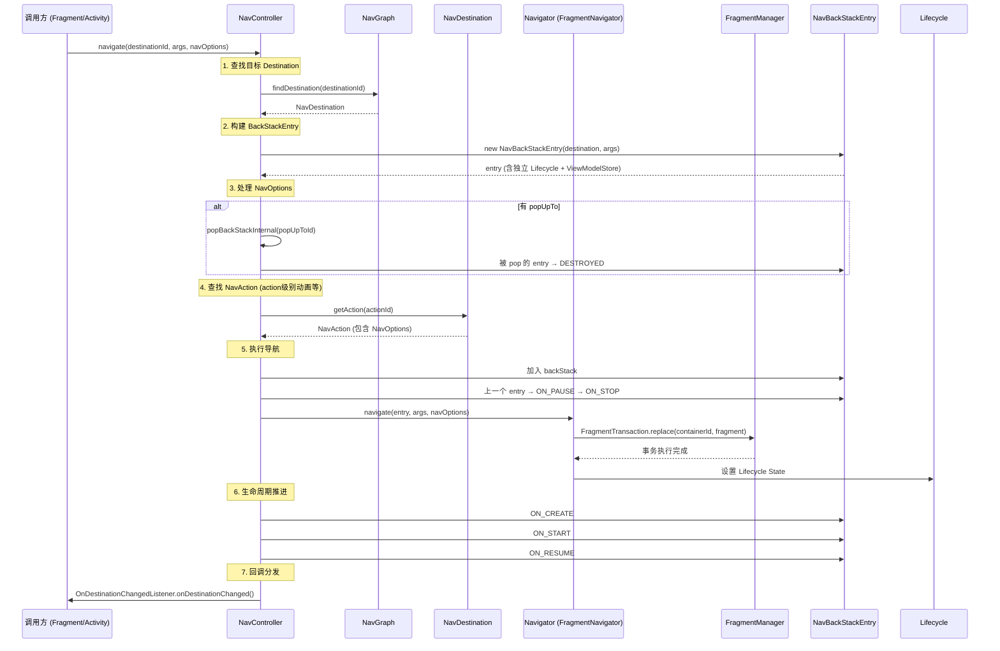
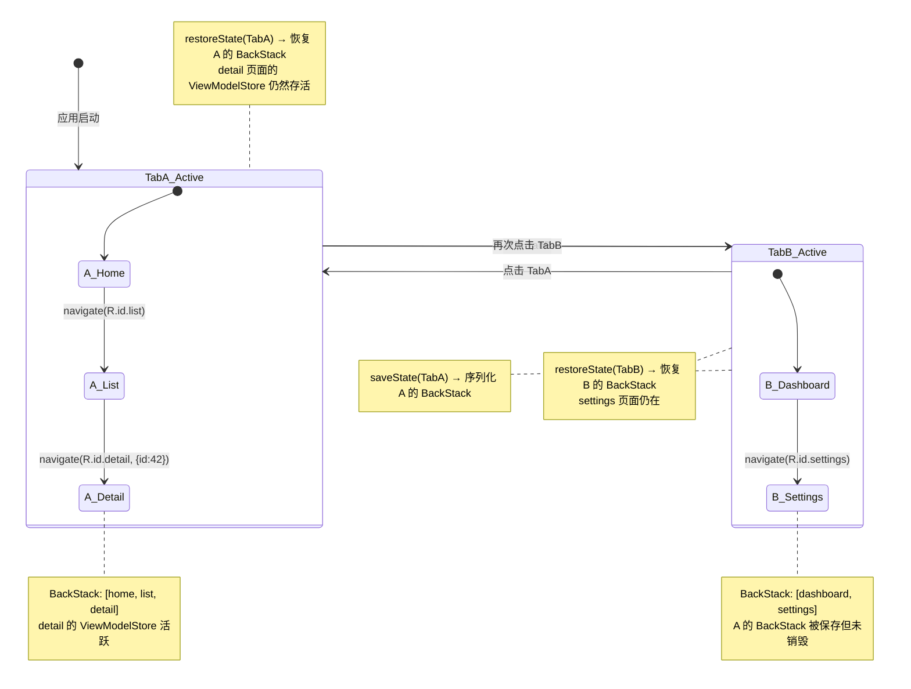

# Navigation —— 面试学习完整指南

> **六层递进体系**：面试问题 → 标准答案 → 核心原理 → 流程图 → 源码分析 → 实战场景
> 适用岗位：高级/资深 Android 工程师、架构师

---

## 目录

1. [常见面试问题（7 题）](#1-常见面试问题)
2. [标准答案与要点解析](#2-标准答案与要点解析)
3. [核心原理深度讲解](#3-核心原理深度讲解)
4. [原理流程图（Mermaid.js + HTML）](#4-原理流程图)
5. [核心源码分析](#5-核心源码分析)
6. [应用场景举例](#6-应用场景举例)

---

## 1. 常见面试问题

### Q1: Navigation 中 NavGraph 的构建方式有哪些？XML 和 Kotlin DSL 各有什么优劣？
### Q2: SafeArgs 的参数传递原理是什么？它如何保证类型安全？和手动 Bundle 传参相比有何优势？
### Q3: Navigation 的 DeepLink 有哪两种类型？显式 DeepLink 和隐式 DeepLink 的区别是什么？PendingIntent 如何处理？
### Q4: Navigation 2.4+ 的多返回栈（Multiple BackStack）是如何实现的？底层原理是什么？
### Q5: Navigation 配合 BottomNavigationView 时，如何实现 Fragment 切换与状态保持？常见的坑有哪些？
### Q6: NavController 的 navigate() 和 popBackStack() 的跳转机制分别是什么？它们如何协同工作？
### Q7: NavBackStackEntry 的生命周期是如何管理的？它的 ViewModelStore 和 SavedStateHandle 在返回栈中的作用是什么？

---

## 2. 标准答案与要点解析

### Q1: NavGraph 的构建方式——XML vs Kotlin DSL

**核心答案**：Navigation 提供三种 NavGraph 构建方式，各有适用场景：

| 构建方式 | 特点 | 适用场景 |
|---------|------|---------|
| **XML 资源文件** | 可视化编辑、分离导航逻辑、Google 官方推荐 | 标准化项目、团队协作、设计稿预览 |
| **Kotlin DSL** | 类型安全、编译期校验、代码补全、动态构建 | 复杂导航逻辑、模块化项目、需要运行时动态图 |
| **编程式 API** | 完全运行时构建、最大灵活性 | 动态路由场景、服务端下发路由配置 |

**XML 构建示例**：

```xml
<!-- res/navigation/nav_graph.xml -->
<navigation xmlns:android="http://schemas.android.com/apk/res/android"
    xmlns:app="http://schemas.android.com/apk/res-auto"
    android:id="@+id/nav_graph"
    app:startDestination="@id/homeFragment">

    <fragment
        android:id="@+id/homeFragment"
        android:name="com.example.HomeFragment"
        android:label="首页">
        <action
            android:id="@+id/toDetail"
            app:destination="@id/detailFragment" />
        <argument
            android:name="userId"
            app:argType="string" />
    </fragment>

    <fragment
        android:id="@+id/detailFragment"
        android:name="com.example.DetailFragment"
        android:label="详情">
        <argument
            android:name="itemId"
            app:argType="integer"
            android:defaultValue="0" />
        <deepLink app:uri="myapp://detail/{itemId}" />
    </fragment>
</navigation>
```

**Kotlin DSL 构建示例**：

```kotlin
// 使用 navigation-compose 或 Fragment 的 DSL
class MainActivity : AppCompatActivity() {
    override fun onCreate(savedInstanceState: Bundle?) {
        super.onCreate(savedInstanceState)
        setContentView(R.layout.activity_main)

        val navHostFragment = supportFragmentManager
            .findFragmentById(R.id.nav_host_fragment) as NavHostFragment
        val navController = navHostFragment.navController

        // 通过 Kotlin DSL 动态构建 NavGraph
        navController.graph = navController.createGraph(
            startDestination = "home"
        ) {
            fragment<HomeFragment>("home") {
                label = "首页"
                argument("userId") { type = NavType.StringType }
            }
            fragment<DetailFragment>("detail") {
                label = "详情"
                argument("itemId") {
                    type = NavType.IntType
                    defaultValue = 0
                }
            }
        }
    }
}
```

**面试加分点**：
- Kotlin DSL 支持 **类型安全的导航**：`navController.navigate(HomeFragmentDirections.toDetail(itemId = 42))`
- DSL 可以结合 `when` 分支实现条件导航图，例如根据用户登录状态加载不同的子图
- XML 支持 Navigation Editor 可视化拖拽，便于设计师和产品经理理解导航逻辑
- **最佳实践**：主图用 XML 保证可维护性，动态路由模块用 Kotlin DSL 保证灵活性

---

### Q2: SafeArgs 的参数传递原理与类型安全

**核心答案**：SafeArgs 是 Navigation 的 Gradle 插件，在编译期通过注解处理器（APT/KSP）为每个声明了 `<argument>` 的 Destination 生成 **Directions 类** 和 **Args 类**，从而将运行时的 Bundle 字符串 Key 匹配提升为编译期类型检查。

**原理流程**：

```
XML NavGraph 定义
       ↓
SafeArgs Gradle Plugin 解析
       ↓
生成 Java/Kotlin 代码（编译期）
       ↓
Directions 类（封装 Action + 参数）  +  Args 类（封装参数提取）
       ↓
开发者在代码中使用生成的类 → 编译期类型安全 ✅
```

**生成的代码示例**：

假设 XML 中定义了从 Home 到 Detail 的 action `toDetail`，携带 `itemId: Int`，SafeArgs 会生成：

```kotlin
// 自动生成的 Directions 类
class HomeFragmentDirections {
    companion object {
        fun toDetail(itemId: Int): NavDirections =
            ActionOnlyNavDirections(R.id.toDetail).apply {
                arguments = bundleOf("itemId" to itemId)
            }
    }
}

// 自动生成的 Args 类
class DetailFragmentArgs(val bundle: Bundle) {
    val itemId: Int
        get() = bundle.getInt("itemId", 0)

    companion object {
        fun fromBundle(bundle: Bundle): DetailFragmentArgs = DetailFragmentArgs(bundle)
    }
}
```

**发送方使用**：

```kotlin
// 编译期类型安全：参数类型和数量在编译时校验
val action = HomeFragmentDirections.toDetail(itemId = 42)
findNavController().navigate(action)
```

**接收方使用**：

```kotlin
// DetailFragment 中提取参数
val args: DetailFragmentArgs by navArgs()
val itemId = args.itemId  // 直接拿到类型安全的 Int，无需手动 getInt()
```

**vs 手动 Bundle 传参**：

| 维度 | 手动 Bundle | SafeArgs |
|------|-----------|----------|
| 类型安全 | 运行时报错（Key 写错/类型不匹配） | **编译期报错** |
| 代码量 | 大量字符串 Key 和类型转换 | 自动生成，简洁 |
| 重构支持 | 修改 Key 需全局搜索替换 | 修改 XML 后自动更新生成代码 |
| 默认值 | 需手动处理 null | 插件根据 XML 定义自动生成默认值 |
| 可选参数 | 需手动判断 containsKey | 生成 Nullable 类型自动映射 |

**面试加分点**：
- SafeArgs 支持自定义 NavType（如 Parcelable、Serializable），需实现 `NavType<T>` 并在 XML 中用 `app:argType="custom"` 配合 `@Parcelize`
- Compose 中使用 `navArgs()` 委托直接获取参数
- **原理本质**：编译时代码生成（类似 ButterKnife → ViewBinding 的演进），把约定转为强类型约束

---

### Q3: DeepLink 的两种类型与 PendingIntent 处理

**核心答案**：Navigation 支持两种 DeepLink 类型，以及通过 PendingIntent 实现通知/Widget 到具体页面的导航链路。

#### 显式 DeepLink（Explicit DeepLink）

使用 `NavDeepLinkBuilder` 或 `PendingIntent` 直接构造目标 Destination：

```kotlin
// 使用 PendingIntent 构建显式 DeepLink
val pendingIntent = NavDeepLinkBuilder(context)
    .setGraph(R.navigation.nav_graph)
    .setDestination(R.id.detailFragment)
    .setArguments(bundleOf("itemId" to 42))
    .createPendingIntent()

// 发送通知
val notification = NotificationCompat.Builder(context, CHANNEL_ID)
    .setContentIntent(pendingIntent)  // 点击通知 → 直接跳转详情页
    .build()
```

#### 隐式 DeepLink（Implicit DeepLink）

通过 URI pattern 匹配，由系统或外部应用触发：

```xml
<!-- 在 nav_graph.xml 中定义 -->
<fragment
    android:id="@+id/detailFragment"
    android:name="com.example.DetailFragment">
    <argument
        android:name="itemId"
        app:argType="integer" />
    <!-- 隐式 DeepLink：匹配 URI pattern -->
    <deepLink app:uri="myapp://detail/{itemId}" />
</fragment>
```

```kotlin
// 外部唤起
// adb shell am start -d "myapp://detail/42" -a android.intent.action.VIEW
```

**隐式 DeepLink 的匹配流程**：

```
外部 Intent（URI: myapp://detail/42）
       ↓
AndroidManifest 中 NavHostActivity 的 intent-filter 拦截
       ↓
NavController.handleDeepLink(intent)
       ↓
遍历 NavGraph 中所有 <deepLink> 标签
       ↓
URI pattern 匹配（支持通配符 {param}、.*、*）
       ↓
匹配成功 → 提取参数 → 构建 NavDeepLinkRequest
       ↓
navigate() 跳转到目标 Destination ✅
```

**两种 DeepLink 对比**：

| 类型 | 触发方式 | 参数来源 | 使用场景 |
|------|---------|---------|---------|
| **显式** | PendingIntent / NavDeepLinkBuilder | 代码直接构造 Bundle | 通知、Widget、快捷方式 |
| **隐式** | URI pattern 匹配 | 从 URI 路径/Query 中解析 | 外部应用唤起、广告跳转、邮件链接 |

**PendingIntent 处理要点**：
- `createPendingIntent()` 内部通过 `NavDeepLinkBuilder` 构建一个特殊的 Intent
- 该 Intent 中包含了目标 Destination ID 和 Bundle 参数
- PendingIntent 被触发时，系统重建 Activity 栈，然后 `NavController` 根据 Intent 中的信息执行 `navigate()`
- **注意**：如果使用 `PendingIntent.FLAG_UPDATE_CURRENT` + 不同参数，需要在 Intent 中添加 `Intent.FILL_IN_DATA` 标记使 extras 生效

---

### Q4: 多返回栈（Multiple BackStack）的支持原理

**核心答案**：Navigation 2.4.0 引入多返回栈支持，核心原理是为每个 Tab/模块维护**独立的 NavBackStackEntry 链表 + 独立的 ViewModelStore + 独立的 SavedStateHandle**，实现类似 iOS 的多 Tab 导航体验。

**传统问题**：

```
用户操作：TabA → A页面1 → A页面2 → 切到TabB → 切回TabA
传统实现：TabA 的返回栈被清空，丢失了 A页面1 和 A页面2 的导航状态 ❌
多返回栈：TabA 的返回栈完整保留，切回来时恢复 A页面2 的状态 ✅
```

**实现原理**：

```
NavController 维护
       │
       ├── 全局返回栈（BackStack）
       │    └── List<NavBackStackEntry>
       │
       └── 多返回栈支持（Navigation 2.4+）
            ├── TabA 独立的 BackStack
            │    ├── NavBackStackEntry(home)
            │    ├── NavBackStackEntry(detailA)
            │    └── NavBackStackEntry(detailA2)  ← 当前
            │
            └── TabB 独立的 BackStack
                 ├── NavBackStackEntry(dashboard)
                 └── NavBackStackEntry(settings)   ← 当前
```

**核心 API 与实现**：

```kotlin
// 方案一：使用 NavigationUI 的 setupWithNavController 扩展（推荐）
binding.bottomNavigation.setupWithNavController(navController)

// 内部实现原理：
// 1. 监听 BottomNavigationView 的 item 选中事件
// 2. 保存当前 Tab 的返回栈状态（saveState）
// 3. 恢复目标 Tab 的返回栈状态（restoreState）
// 4. 使用 navigate() + NavOptions 实现

// NavOptions 关键配置
val navOptions = NavOptions.Builder()
    .setPopUpTo(
        navController.graph.findStartDestination().id,  // 清空到起始页
        inclusive = false,
        saveState = true   // ⭐ 保存当前返回栈状态
    )
    .setRestoreState(true)  // ⭐ 恢复目标返回栈状态
    .setLaunchSingleTop(true)
    .build()
```

**面试加分点**：
- `saveState = true` → NavController 将当前 Destination 的返回栈序列化到 `NavBackStackEntry.savedStateHandle` 对应的 Bundle 中
- `restoreState = true` → 切换回来时从之前保存的 Bundle 恢复返回栈结构
- **底层存储**：使用 `NavControllerViewModel`（Activity 级别）维护所有 Tab 的 ViewModelStore，切换 Tab 时不销毁 ViewModel
- **局限性**：多返回栈仅支持 **Fragment 目标**（`FragmentNavigator`），Compose 的多返回栈需使用 `navigation-compose` 的 `NavHost` + `saveState/restoreState`

---

### Q5: Navigation + BottomNavigationView 的 Fragment 切换与状态保持

**核心答案**：BottomNavigationView 配合 Navigation 实现 Fragment 切换，关键在于**正确配置 NavOptions** 避免返回栈膨胀和状态丢失。

#### 标准实现方案

**布局文件**：

```xml
<androidx.constraintlayout.widget.ConstraintLayout
    xmlns:android="http://schemas.android.com/apk/res/android"
    xmlns:app="http://schemas.android.com/apk/res-auto"
    android:layout_width="match_parent"
    android:layout_height="match_parent">

    <androidx.fragment.app.FragmentContainerView
        android:id="@+id/nav_host_fragment"
        android:name="androidx.navigation.fragment.NavHostFragment"
        android:layout_width="match_parent"
        android:layout_height="0dp"
        app:defaultNavHost="true"
        app:navGraph="@navigation/nav_bottom"
        app:layout_constraintBottom_toTopOf="@id/bottom_navigation"
        app:layout_constraintTop_toTopOf="parent" />

    <com.google.android.material.bottomnavigation.BottomNavigationView
        android:id="@+id/bottom_navigation"
        android:layout_width="match_parent"
        android:layout_height="wrap_content"
        app:menu="@menu/bottom_nav_menu"
        app:layout_constraintBottom_toBottomOf="parent" />
</androidx.constraintlayout.widget.ConstraintLayout>
```

**Activity 配置（推荐方式）**：

```kotlin
class MainActivity : AppCompatActivity() {
    private lateinit var navController: NavController

    override fun onCreate(savedInstanceState: Bundle?) {
        super.onCreate(savedInstanceState)
        val binding = ActivityMainBinding.inflate(layoutInflater)
        setContentView(binding.root)

        val navHostFragment = supportFragmentManager
            .findFragmentById(R.id.nav_host_fragment) as NavHostFragment
        navController = navHostFragment.navController

        // 一行代码搞定多返回栈 + Fragment切换 + 状态保持
        binding.bottomNavigation.setupWithNavController(navController)
    }
}
```

#### 常见坑与解决方案

| 常见坑 | 原因 | 解决方案 |
|--------|------|---------|
| **Fragment 重建** | 每次切换 Tab 都 create 新 Fragment | 使用 `setupWithNavController()` 或配置 `launchSingleTop=true` |
| **返回栈膨胀** | 反复切 Tab 导致返回栈无限增长 | 设置 `popUpTo(startDestination) { inclusive = false }` |
| **状态丢失（多返回栈）** | 旧版 Navigation 不支持 saveState | 升级至 Navigation 2.4+，使用 `saveState=true` + `restoreState=true` |
| **onViewCreated 多次调用** | Fragment 每次切换都重建 View | 检查 NavOptions 是否正确配置，确保 `launchSingleTop` |
| **BottomNavigation 选中状态错乱** | 手动 navigate 后未同步 UI | 使用 `setupWithNavController()` 自动同步，或手动 `bottomNav.selectedItemId` |

**手动实现（理解原理用）**：

```kotlin
bottomNavigation.setOnItemSelectedListener { item ->
    navController.navigate(item.itemId, null, NavOptions.Builder()
        .setPopUpTo(navController.graph.findStartDestination().id) {
            saveState = true   // 保存当前Tab的返回栈
        }
        .setLaunchSingleTop(true)      // 避免创建多个相同Fragment
        .setRestoreState(true)          // 恢复目标Tab的返回栈
        .build()
    )
    true
}
```

---

### Q6: NavController 的 navigate() 和 popBackStack() 跳转机制

**核心答案**：`navigate()` 和 `popBackStack()` 是 NavController 的一对核心 API，分别负责前向导航和回退导航，共同管理 Fragment 的生命周期和返回栈。

#### navigate() 机制

```
调用 navigate(destinationId, args, navOptions)
       ↓
1. 查找目的地 NavDestination
   - 从当前 NavGraph 中按 ID 查找
   - 如果未找到 → 向上递归父 Graph 查找
       ↓
2. 查找匹配的 NavAction
   - 从当前 Destination 的 actions 列表查找
   - 提取 action 中的 NavOptions（动画、popUpTo 等）
       ↓
3. 构建 NavBackStackEntry
   - 包含：destination + arguments + ViewModelStore + Lifecycle + SavedStateHandle
       ↓
4. 执行 NavOptions.popUpTo（如果有）
   - 遍历返回栈，pop 掉 popUpTo 之上的所有 entry
       ↓
5. 执行 Navigator.navigate()
   - FragmentNavigator → FragmentTransaction.replace()
   - Compose Navigator → 重组 Composable
       ↓
6. 将新 NavBackStackEntry 压入返回栈
   - onCreate/onStart/onResume 生命周期依次触发
```

#### popBackStack() 机制

```
调用 popBackStack(destinationId, inclusive)
       ↓
1. 在返回栈中查找目标 destinationId
   - 从栈顶向下遍历
       ↓
2. 逐个 pop 返回栈上的 entry
   - 每个 entry 经历 ON_PAUSE → ON_STOP → ON_DESTROY
   - ViewModel 被 onCleared()（如果 scope 是 entry 级别）
       ↓
3. 目标 entry 变成栈顶
   - 经历 ON_START → ON_RESUME（如果之前是 STOPPED）
       ↓
4. 如果是 inclusive=true
   - 目标 entry 自身也被 pop 并销毁
```

**关键代码示例**：

```kotlin
// 前向跳转
findNavController().navigate(R.id.detailFragment, bundleOf("id" to 123))

// 带选项跳转
findNavController().navigate(
    R.id.detailFragment,
    bundleOf("id" to 123),
    NavOptions.Builder()
        .setEnterAnim(R.anim.slide_in_right)
        .setExitAnim(R.anim.slide_out_left)
        .setPopEnterAnim(R.anim.slide_in_left)
        .setPopExitAnim(R.anim.slide_out_right)
        .build()
)

// 返回上一页
findNavController().popBackStack()

// 返回到指定 Destination（不含该页）
findNavController().popBackStack(R.id.homeFragment, inclusive = false)

// 返回到指定 Destination（含该页——即 pop 掉该页本身）
findNavController().popBackStack(R.id.homeFragment, inclusive = true)
```

**面试加分点**：
- `navigate()` 内部使用 `FragmentTransaction.replace()` 而非 `add()`，意味着**前一个 Fragment 的 View 会被销毁但 ViewModel 存活**（在 NavBackStackEntry 作用域内）
- `popBackStack()` 触发生命周期：被 pop 的 entry 经历 DESTROYED，恢复的 entry 经历 RESUMED
- **返回栈 ID 的妙用**：可以通过 `popBackStack(entryId, inclusive)` 弹出到特定 entry 实例（而非 destination 类型），用于精细化栈管理

---

### Q7: NavBackStackEntry 的生命周期管理与 ViewModelStore

**核心答案**：`NavBackStackEntry` 是 Navigation 架构中的核心数据结构，它不仅是返回栈上的一个节点，更是一个**完整的生命周期容器**。

**NavBackStackEntry 的数据结构**：

```
NavBackStackEntry
├── id: UUID                    // 唯一标识（不是 destination ID）
├── destination: NavDestination // 目标页面
├── arguments: Bundle?          // 页面参数
├── lifecycle: LifecycleRegistry // 独立生命周期
├── viewModelStore: ViewModelStore // 独立 ViewModel 仓库
└── savedStateHandle: SavedStateHandle // 进程状态保存
```

**生命周期状态机**：

```
CREATED ────navigate()────▶ STARTED ────onResume()────▶ RESUMED
    ▲                                                       │
    │                              popBackStack()           │
    │                                                       ▼
DESTROYED ◀───pop 后────  CREATED ◀────onPause+onStop── STOPPED
    │                           (如果 restoreState)
    │
    └── onCleared() → ViewModel 销毁
```

**重要性质**：

| 性质 | 说明 |
|------|------|
| **State.CREATED** | entry 已放入返回栈但不可见（被栈顶 entry 覆盖） |
| **State.STARTED** | entry 可见但非前台（如被 Dialog 覆盖） |
| **State.RESUMED** | entry 处于前台，接收用户交互 |
| **ViewModel 存活期** | entry 在返回栈上时 ViewModelStore 不会清除；pop 后才触发 onCleared() |
| **SavedStateHandle** | 进程杀死后重建时自动恢复，底层基于 Bundle 序列化 |

**代码示例**：

```kotlin
// 监听当前目的地变化
navController.addOnDestinationChangedListener { _, destination, arguments ->
    Log.d("Nav", "当前页面: ${destination.label}")
}

// 获取特定 entry 的 ViewModel（跨页面共享）
val backStackEntry = navController.getBackStackEntry(R.id.homeFragment)
val sharedViewModel: SharedViewModel = ViewModelProvider(backStackEntry)
    .get(SharedViewModel::class.java)

// 生命周期感知
backStackEntry.lifecycle.addObserver(object : LifecycleEventObserver {
    override fun onStateChanged(source: LifecycleOwner, event: Lifecycle.Event) {
        when (event) {
            Lifecycle.Event.ON_RESUME -> Log.d("Nav", "页面恢复前台")
            Lifecycle.Event.ON_PAUSE -> Log.d("Nav", "页面失去焦点")
            Lifecycle.Event.ON_STOP -> Log.d("Nav", "页面不可见")
            Lifecycle.Event.ON_DESTROY -> Log.d("Nav", "页面从返回栈移除")
            else -> {}
        }
    }
})
```

---

## 3. 核心原理深度讲解

### 3.1 NavHostFragment 的内部实现

**NavHostFragment** 是 Navigation 的容器宿主，它是一个特殊的 Fragment，内部持有 `NavController` 并负责 Fragment 的切换。

**核心组成**：

```
NavHostFragment extends Fragment
│
├── FragmentContainerView (在布局中承载)
│    └── 实现了 NavHost 接口
│
├── NavController (真正的导航控制核心)
│    ├── NavigatorProvider (注册各类 Navigator)
│    │    ├── FragmentNavigator
│    │    ├── ActivityNavigator
│    │    ├── DialogNavigator
│    │    └── ComposeNavigator (Navigation-Compose)
│    │
│    ├── NavGraph (导航图)
│    │    ├── startDestination
│    │    ├── List<NavDestination>
│    │    └── 嵌套的 NavGraph（子图）
│    │
│    ├── backStack: ArrayDeque<NavBackStackEntry> (返回栈)
│    └── backStackMap: Map<Int, NavBackStackEntry> (快速查找)
│
└── mDefaultNavHost: Boolean
     └── true → 拦截系统的 Back 键事件，调用 popBackStack()
```

**初始化流程**：

```kotlin
// NavHostFragment.onCreate()
override fun onCreate(savedInstanceState: Bundle?) {
    super.onCreate(savedInstanceState)
    // 1. 创建 NavController
    navController = NavController(requireContext())
    // 2. 注册 Navigator
    navController.navigatorProvider.addNavigator(
        FragmentNavigator(requireContext(), childFragmentManager, id)
    )
    // 3. 解析 NavGraph
    val graph = navController.navInflater.inflate(graphResId)
    navController.graph = graph
}
```

---

### 3.2 NavController.navigate() 内部执行流程

这是 Navigation 最核心的方法，完整源码执行路径：

```
navigate(destinationId, args, navOptions)
       │
       ├─ 1. findDestination(destinationId)
       │     └─ 从 graph + 所有子图中递归查找 NavDestination
       │
       ├─ 2. 构建 NavBackStackEntry
       │     └─ new NavBackStackEntry(destination, args, lifecycleOwner, viewModel)
       │
       ├─ 3. 执行 NavOptions.popUpTo（如果有）
       │     └─ popBackStackInternal(popUpToId, popUpToInclusive)
       │
       ├─ 4. 查找 NavAction（可选）
       │     └─ 当前 destination.getAction(actionId) 获取 action 级别的 NavOptions
       │
       ├─ 5. navigateInternal(entry, navOptions, navigatorExtras)
       │     │
       │     ├─ 5.1 将 entry 加入 backStack
       │     ├─ 5.2 触发上一个 entry 的 Lifecycle Event: ON_PAUSE → ON_STOP
       │     ├─ 5.3 navigator.navigate(entry, args, navOptions, extras)
       │     │      └─ FragmentNavigator:
       │     │          ├─ FragmentTransaction.replace(containerId, fragment)
       │     │          ├─ 设置动画（enter/exit/popEnter/popExit）
       │     │          └─ ft.commitNow() / commit()
       │     │
       │     └─ 5.4 触发新 entry 的 Lifecycle Event: ON_CREATE → ON_START → ON_RESUME
       │
       └─ 6. 分发 OnDestinationChangedListener 回调
```

---

### 3.3 返回栈管理机制

**返回栈数据结构**：

```kotlin
// NavController 内部
private val backStack = ArrayDeque<NavBackStackEntry>()  // 主返回栈
private val backStackMap = mutableMapOf<Int, NavBackStackEntry>() // ID → Entry 快速查找

// 每个 NavBackStackEntry 维护：
// - Lifecycle (独立生命周期)
// - ViewModelStore (独立 ViewModel 仓库)
// - SavedStateHandle (进程恢复)
```

**栈操作核心逻辑**：

```kotlin
// 入栈
fun addEntryToBackStack(entry: NavBackStackEntry) {
    backStack.addLast(entry)
    backStackMap[entry.id] = entry
    // 触发创建生命周期
    entry.updateState(Lifecycle.State.CREATED)
    // 之前的栈顶 → STOPPED
    if (backStack.size > 1) {
        backStack[backStack.size - 2].maxLifecycle = Lifecycle.State.CREATED
    }
}

// 出栈
fun popEntryFromBackStack(destinationId: Int, inclusive: Boolean): Boolean {
    val entry = backStack.find { it.destination.id == destinationId } ?: return false
    while (backStack.last() != entry) {
        val popped = backStack.removeLast()
        popped.maxLifecycle = Lifecycle.State.DESTROYED  // 触发销毁 → onCleared()
        backStackMap.remove(popped.id)
    }
    if (inclusive) {
        val popped = backStack.removeLast()
        popped.maxLifecycle = Lifecycle.State.DESTROYED
        backStackMap.remove(popped.id)
    }
    // 新的栈顶 → RESUMED
    backStack.lastOrNull()?.maxLifecycle = Lifecycle.State.RESUMED
    return true
}
```

**多返回栈的实现（Navigation 2.4+）**：

```
saveState = true:
  → 将当前 entry 的 arguments + savedStateHandle 序列化为 Bundle
  → 存入 NavControllerViewModel.（该 Bundle 在 Activity 级别存活）

restoreState = true:
  → 从 NavControllerViewModel. 读取之前保存的 Bundle
  → 重建 NavBackStackEntry 链表
  → 恢复每个 entry 的 savedStateHandle
  → 通过 FragmentManager 恢复 Fragment 实例
```

---

### 3.4 DeepLink 处理原理

**NavDeepLinkBuilder 的 PendingIntent 构建过程**：

```kotlin
// NavDeepLinkBuilder 核心流程
fun createPendingIntent(): PendingIntent {
    // 1. 构建 Intent
    val intent = Intent(context, NavHostActivity::class.java)
        .putExtra(NavController.KEY_DEEP_LINK_IDS, intArrayOf(destinationId))
        .putExtra(NavController.KEY_DEEP_LINK_ARGS, bundleOf("key" to args))

    // 2. 构建 TaskStackBuilder（如果有 parent graph）
    taskStackBuilder?.addNextIntent(intent)

    // 3. 返回 PendingIntent
    return taskStackBuilder?.getPendingIntent(requestCode, flags)
        ?: PendingIntent.getActivity(context, requestCode, intent, flags)
}
```

**隐式 DeepLink 的 IntentFilter 匹配**：

```xml
<!-- AndroidManifest.xml -->
<activity android:name=".MainActivity">
    <intent-filter>
        <action android:name="android.intent.action.VIEW" />
        <category android:name="android.intent.category.DEFAULT" />
        <category android:name="android.intent.category.BROWSABLE" />
        <data
            android:scheme="myapp"
            android:host="detail" />
    </intent-filter>
</activity>
```

```
系统 Intent (myapp://detail/42)
       ↓
AndroidManifest 匹配 → 启动 MainActivity
       ↓
MainActivity.onCreate()
       ↓
navController.handleDeepLink(intent)
       ↓
NavDeepLink 解析：
  - 从 intent.data（URI）中提取 scheme + host + path
  - 遍历 NavGraph 中所有 <deepLink> 的 uri pattern
  - 正则匹配：myapp://detail/{itemId}
  - 提取 itemId = "42"
  - 构造 Bundle → NavDeepLinkRequest
       ↓
navController.navigate(destinationId, args)
```

---

### 3.5 SafeArgs 编译期代码生成原理

**SafeArgs 的 Gradle Plugin 工作流程**：

```
SafeArgs Gradle Plugin
       │
       ├── 注册 Task: generateSafeArgs
       │     └── 依赖 AGP 的 processResources Task
       │
       ├── 解析 res/navigation/*.xml
       │     ├── 提取 <navigation> 的 id 和 startDestination
       │     ├── 提取每个 <fragment>/<activity>/<dialog> 的：
       │     │   ├── destination id
       │     │   ├── action list（id + destination + 动画）
       │     │   ├── argument list（name + type + defaultValue + nullable）
       │     │   └── deepLink list（uri pattern）
       │     │
       │     └── 构建中间模型（NavGraphDescriptor）
       │
       ├── 代码生成（使用 JavaPoet / KotlinPoet）
       │     ├── 为每个 destination 生成 Directions 类
       │     │    └── 每个 action 生成静态方法
       │     │
       │     ├── 为每个 destination 生成 Args 类
       │     │    └── fromBundle() + 属性 getter
       │     │
       │     └── 输出到 build/generated/source/navigation-args/
       │
       └── 合并到编译 Classpath
```

**生成的代码模式**：

```kotlin
// 当 XML 中有：
// <argument name="userId" app:argType="string" />
// <argument name="count" app:argType="integer" android:defaultValue="0" />
// <argument name="isVip" app:argType="boolean" app:nullable="true" />

// 生成的 Args 类：
data class DetailFragmentArgs(
    val userId: String,         // 非空，无默认值 → 必传
    val count: Int = 0,         // 有默认值 → 可选
    val isVip: Boolean? = null  // nullable → 可选
) {
    fun toBundle(): Bundle = bundleOf(
        "userId" to userId,
        "count" to count,
        "isVip" to isVip
    )

    companion object {
        fun fromBundle(bundle: Bundle): DetailFragmentArgs {
            return DetailFragmentArgs(
                userId = bundle.getString("userId")!!,  // 编译时保证非空
                count = bundle.getInt("count", 0),
                isVip = if (bundle.containsKey("isVip")) bundle.getBoolean("isVip") else null
            )
        }
    }
}
```

---

## 4. 原理流程图

### 4.1 Navigation 跳转完整流程



### 4.2 多返回栈管理机制



---

## 5. 核心源码分析

### 5.1 NavController.navigate() 核心逻辑

```kotlin
// 源码位置: androidx.navigation.NavController
// 精简后的核心逻辑

public fun navigate(
    @IdRes resId: Int,
    args: Bundle?,
    navOptions: NavOptions?,
    navigatorExtras: Navigator.Extras?
) {
    // 1. 查找目标 NavDestination（支持递归搜索子图）
    val destination = findDestination(resId)
        ?: throw IllegalArgumentException(
            "Navigation destination $resId not found in the graph"
        )

    // 2. 如果 NavOptions 为 null，尝试从当前 destination 的 action 中获取
    val finalNavOptions = navOptions ?: getActionNavOptions(resId)

    // 3. 核心导航逻辑
    navigateInternal(
        node = destination,
        args = args,
        navOptions = finalNavOptions,
        navigatorExtras = navigatorExtras
    )
}

private fun navigateInternal(
    node: NavDestination,
    args: Bundle?,
    navOptions: NavOptions?,
    navigatorExtras: Navigator.Extras?
) {
    // 4. 处理 popUpTo：弹出返回栈中的指定页面
    var popped = false
    if (navOptions?.popUpTo != -1) {
        popped = popBackStackInternal(
            destinationId = navOptions.popUpTo,
            inclusive = navOptions.isPopUpToInclusive,
            saveState = navOptions.shouldPopUpToSaveState()  // ⭐ 多返回栈关键
        )
    }

    // 5. 构建 NavBackStackEntry（新的返回栈节点）
    val finalArgs = node.addInDefaultArgs(args)
    val backStackEntry = NavBackStackEntry.create(
        context = context,
        destination = node,
        finalArgs = finalArgs,
        hostLifecycleState = hostLifecycleState,
        viewModel = _ NavControllerViewModel(this)  // ⭐ ViewModel 作用域绑定
    )

    // 6. 调用具体 Navigator 执行导航
    val navigator = navigatorProvider.getNavigator<Navigator<*>>(
        node.navigatorName
    )
    navigator.navigate(
        entries = listOf(backStackEntry),
        navOptions = navOptions,
        navigatorExtras = navigatorExtras
    )

    // 7. 将 entry 加入返回栈
    backStack.addLast(backStackEntry)
    backStackMap[backStackEntry.id] = backStackEntry

    // 8. 更新生命周期状态
    updateBackStackLifecycle(backStackEntry)

    // 9. 分发目的地变化回调
    dispatchOnDestinationChanged()
}

// 查找目的地的递归实现
private fun findDestination(@IdRes destinationId: Int): NavDestination {
    // 先从当前 graph 查找
    var destination = graph.findNode(destinationId)
    if (destination != null) return destination

    // 从当前 destination 向上查找（处理嵌套导航图）
    val current = currentDestination ?: return destination ?: throw ...
    var parent = current.parent
    while (parent != null) {
        destination = parent.findNode(destinationId)
        if (destination != null) return destination
        parent = parent.parent
    }
    throw IllegalArgumentException("No destination for $destinationId")
}
```

### 5.2 FragmentNavigator.navigate() 的 FragmentTransaction

```kotlin
// 源码位置: androidx.navigation.fragment.FragmentNavigator
// 精简后的核心逻辑

@Navigator.Name("fragment")
public class FragmentNavigator(
    private val context: Context,
    private val fragmentManager: FragmentManager,
    private val containerId: Int
) : Navigator<FragmentNavigator.Destination>() {

    override fun navigate(
        entries: List<NavBackStackEntry>,
        navOptions: NavOptions?,
        navigatorExtras: Extras?
    ) {
        val entry = entries.first()  // FragmentNavigator 每次只处理一个 entry
        val className = entry.destination.className

        // 1. 通过 FragmentManager 查找或创建 Fragment
        var fragment = fragmentManager.findFragmentByTag(entry.id.toString())

        if (fragment == null) {
            // 2. 使用 FragmentFactory 实例化
            fragment = fragmentManager.fragmentFactory.instantiate(
                context.classLoader, className
            )
            // 3. 设置参数
            fragment.arguments = entry.arguments
        }

        // 4. 构建 FragmentTransaction
        val ft = fragmentManager.beginTransaction()

        // 5. 设置动画
        navOptions?.let { options ->
            ft.setCustomAnimations(
                options.enterAnim,
                options.exitAnim,
                options.popEnterAnim,
                options.popExitAnim
            )
        }

        // 6. ⭐ 核心操作：replace 到容器中
        ft.replace(containerId, fragment, entry.id.toString())

        // 7. 将之前的 Fragment 加入返回栈（通过 addToBackStack）
        val initialNavigation = backStack.isEmpty()
        if (!initialNavigation) {
            ft.addToBackStack(entry.id.toString())
        }

        // 8. 执行事务
        if (fragmentManager.isStateSaved) {
            ft.commit()
        } else {
            ft.commitNow()  // ⭐ 同步执行，保证生命周期及时更新
        }
    }

    override fun popBackStack(popUpTo: NavBackStackEntry, savedState: Boolean) {
        // Fragment 的事务回退
        if (fragmentManager.isStateSaved) {
            fragmentManager.popBackStack()
        } else {
            fragmentManager.popBackStackImmediate(
                popUpTo.id.toString(),
                if (savedState) FragmentManager.POP_BACK_STACK_INCLUSIVE else 0
            )
        }
    }
}
```

**关键源码发现**：

| 要点 | 说明 |
|------|------|
| **replace vs add** | Navigation 使用 `replace`，旧 Fragment 的 View 被销毁但 ViewModel 存活于 NavBackStackEntry 中 |
| **Fragment Tag** | 使用 `entry.id`（UUID）作为 Tag，确保每个 entry 有独立的 Fragment 实例 |
| **commitNow()** | 非 StateSaved 状态下同步提交，确保 `onViewCreated` 在 `navigate()` 返回前执行 |
| **addToBackStack** | 首次导航不加入 FragmentManager 的返回栈（避免空返回栈问题），后续加入以支持系统返回键 |
| **FragmentFactory** | 支持构造函数注入，通过 `FragmentFactory` 创建 Fragment 实例而非反射 |

---

## 6. 应用场景举例

### 场景 6.1: BottomNavigation + 多返回栈完整方案

**需求**：5 个 Tab 各自有独立的导航流，切换 Tab 时不丢失各自的导航状态。

**完整实现**：

```kotlin
// build.gradle.kts
dependencies {
    implementation("androidx.navigation:navigation-fragment-ktx:2.7.7")
    implementation("androidx.navigation:navigation-ui-ktx:2.7.7")
}

// MainActivity.kt
class MainActivity : AppCompatActivity() {
    private lateinit var binding: ActivityMainBinding
    private lateinit var navController: NavController

    override fun onCreate(savedInstanceState: Bundle?) {
        super.onCreate(savedInstanceState)
        binding = ActivityMainBinding.inflate(layoutInflater)
        setContentView(binding.root)

        // 获取 NavController
        val navHostFragment = supportFragmentManager
            .findFragmentById(R.id.nav_host_fragment) as NavHostFragment
        navController = navHostFragment.navController

        // ⭐ 核心：一行代码实现多返回栈
        binding.bottomNav.setupWithNavController(navController)

        // 拦截重复点击（可选优化）
        binding.bottomNav.setOnItemReselectedListener { /* 不做任何事 */ }
    }
}
```

**NavGraph 设计**：

```xml
<!-- navigation/nav_bottom.xml -->
<navigation xmlns:android="http://schemas.android.com/apk/res/android"
    xmlns:app="http://schemas.android.com/apk/res-auto"
    app:startDestination="@id/navigation_home">

    <!-- menu item id 必须与 destination id 一致 -->
    <fragment
        android:id="@+id/navigation_home"
        android:name=".ui.home.HomeFragment"
        android:label="首页" />

    <fragment
        android:id="@+id/navigation_dashboard"
        android:name=".ui.dashboard.DashboardFragment"
        android:label="仪表盘" />

    <fragment
        android:id="@+id/navigation_notifications"
        android:name=".ui.notifications.NotificationsFragment"
        android:label="通知" />
</navigation>
```

**嵌套导航图（每个 Tab 内部有子页面）**：

```xml
<!-- navigation/nav_home.xml -->
<navigation xmlns:android="http://schemas.android.com/apk/res/android"
    xmlns:app="http://schemas.android.com/apk/res-auto"
    android:id="@+id/nav_home"
    app:startDestination="@id/homeMainFragment">

    <fragment android:id="@+id/homeMainFragment" ...>
        <action android:id="@+id/toSearch"
            app:destination="@id/searchFragment" />
    </fragment>

    <fragment android:id="@+id/searchFragment" ...>
        <action android:id="@+id/toResult"
            app:destination="@id/resultFragment" />
    </fragment>

    <fragment android:id="@+id/resultFragment" ... />
</navigation>

<!-- 在主图中通过 <include> 引入 -->
<!-- navigation/nav_bottom.xml -->
<include app:graph="@navigation/nav_home" />
```

**效果验证**：

```
用户操作：
  首页 → 搜索 → 结果页面（首页Tab内有3层返回栈）
  切换到"仪表盘"Tab
  切换到"通知"Tab  
  切回"首页"Tab

预期结果：
  首页Tab恢复到"结果页面" ✅
  按返回键 → 回到"搜索页面" → 再按 → "首页" ✅
  每个 Tab 的返回栈完全独立 ✅
```

---

### 场景 6.2: DeepLink 接入——通知到详情页的导航链路

**需求**：用户点击推送通知 → 打开 App → 直接跳转到商品详情页 → 按返回键回到首页（完整的回退栈）。

**完整实现链路**：

```
┌──────────────────────────────────────────────────────────────┐
│  服务端推送                                                    │
│  ┌─────────────────────────────────────────────────────────┐ │
│  │ FCM Message { productId: "12345", type: "new_arrival" } │ │
│  └─────────────────────────────────────────────────────────┘ │
└──────────────────────────────────────────────────────────────┘
                              │
                              ▼
┌──────────────────────────────────────────────────────────────┐
│  FirebaseMessagingService.onMessageReceived()                 │
│  ┌─────────────────────────────────────────────────────────┐ │
│  │ 1. 解析 productId                                        │ │
│  │ 2. 构建 NavDeepLinkBuilder                              │ │
│  │ 3. createPendingIntent()                                │ │
│  │ 4. 构建 Notification → setContentIntent(pendingIntent)   │ │
│  └─────────────────────────────────────────────────────────┘ │
└──────────────────────────────────────────────────────────────┘
                              │
                              ▼
┌──────────────────────────────────────────────────────────────┐
│  用户点击通知                                                  │
│  ┌─────────────────────────────────────────────────────────┐ │
│  │ PendingIntent 触发 → 启动 MainActivity                    │ │
│  │ Intent extras: deepLinkIds=[R.id.productDetail]          │ │
│  │               deepLinkArgs={productId:"12345"}           │ │
│  └─────────────────────────────────────────────────────────┘ │
└──────────────────────────────────────────────────────────────┘
                              │
                              ▼
┌──────────────────────────────────────────────────────────────┐
│  MainActivity.onCreate()                                     │
│  ┌─────────────────────────────────────────────────────────┐ │
│  │ navController.handleDeepLink(intent)                     │ │
│  │ → 解析 deepLinkIds + deepLinkArgs                        │ │
│  │ → navController.navigate(R.id.productDetail, args)       │ │
│  │ → 自动构建回退栈: homeFragment → productList → detail    │ │
│  └─────────────────────────────────────────────────────────┘ │
└──────────────────────────────────────────────────────────────┘
```

**代码实现**：

```kotlin
// 1. NavGraph 中配置 DeepLink
// navigation/nav_main.xml
<fragment
    android:id="@+id/productDetailFragment"
    android:name=".ui.product.ProductDetailFragment">
    <argument
        android:name="productId"
        app:argType="string" />
    <!-- 隐式 DeepLink -->
    <deepLink app:uri="myapp://product/{productId}" />
</fragment>

// 2. FirebaseMessagingService 中构建通知
class MyFirebaseMessagingService : FirebaseMessagingService() {
    override fun onMessageReceived(message: RemoteMessage) {
        val productId = message.data["productId"] ?: return

        // 构建完整的导航栈 + 目标页
        val pendingIntent = NavDeepLinkBuilder(this)
            .setGraph(R.navigation.nav_main)
            .setDestination(R.id.productDetailFragment)
            .setArguments(bundleOf("productId" to productId))
            // 在目标页之前插入父页面（构建回退栈）
            .setComponentName(MainActivity::class.java)
            .createPendingIntent()

        // 构建通知
        val notification = NotificationCompat.Builder(this, CHANNEL_ID)
            .setContentTitle("新品上架")
            .setContentText("查看商品详情")
            .setSmallIcon(R.drawable.ic_notification)
            .setAutoCancel(true)
            .setContentIntent(pendingIntent)
            .build()

        NotificationManagerCompat.from(this).notify(
            productId.hashCode(),
            notification
        )
    }
}

// 3. MainActivity 中接收并处理
class MainActivity : AppCompatActivity() {
    private lateinit var navController: NavController

    override fun onCreate(savedInstanceState: Bundle?) {
        super.onCreate(savedInstanceState)
        // ... setup

        navController = navHostFragment.navController

        // 处理 DeepLink（从通知或外部应用进入）
        if (intent?.extras?.containsKey(NavController.KEY_DEEP_LINK_IDS) == true) {
            navController.handleDeepLink(intent)
        }
    }

    override fun onNewIntent(intent: Intent?) {
        super.onNewIntent(intent)
        // 单例模式下处理新的 DeepLink
        navController.handleDeepLink(intent!!)
    }
}

// 4. 隐式 DeepLink 外部唤醒
// adb 测试命令：
// adb shell am start -W -a android.intent.action.VIEW \
//   -d "myapp://product/12345" com.example.app
```

**关键注意事项**：

| 注意点 | 说明 |
|--------|------|
| **回退栈构建** | 使用 `<navigation>` 的嵌套 + parent graph 构建完整的逻辑回退路径 |
| **singleTop 模式** | MainActivity 建议设置为 `singleTop`，避免从通知进入时创建多个 Activity 实例 |
| **onNewIntent** | 处理 App 已在后台时收到的新通知 DeepLink |
| **参数安全** | 使用 SafeArgs 保证 productId 的类型安全传递 |
| **PendingIntent 更新** | 不同通知使用不同的 requestCode（如 `productId.hashCode()`），避免相互覆盖 |

---

## 总结

Navigation 组件是 Jetpack 中最复杂的架构组件之一，面试中需要掌握以下核心要点：

1. **NavGraph 构建**：XML vs Kotlin DSL 的选择取决于项目规模和复杂度
2. **SafeArgs**：编译期代码生成实现类型安全，本质是将约定转为强约束
3. **DeepLink**：显式（PendingIntent）和隐式（URI匹配）两种类型，覆盖通知和外部跳转场景
4. **多返回栈**：Navigation 2.4+ 通过 saveState/restoreState 实现独立返回栈管理
5. **BottomNavigation**：`setupWithNavController()` 一行代码解决 Fragment 切换和状态保持
6. **NavController**：navigate() 和 popBackStack() 协同管理返回栈和生命周期
7. **NavBackStackEntry**：不仅是栈节点，更是独立的生命周期容器 + ViewModelStore 宿主

> 理解 Navigation 的源码流程（NavController → Navigator → FragmentTransaction）是区分高级工程师和普通工程师的关键分水岭。
