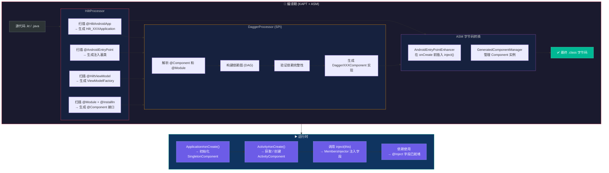
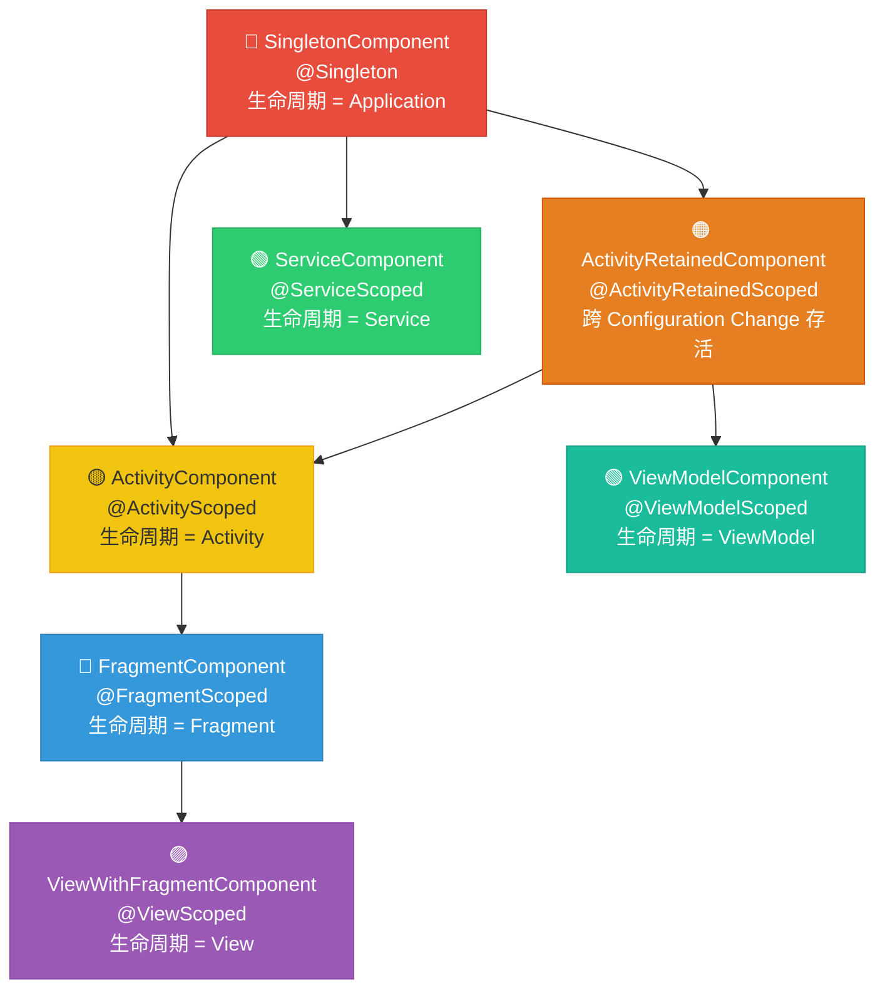

# Hilt 依赖注入 — 面试深度解析

> **字数统计**: ~5200字 | 阅读时长: 约25分钟  
> **适用岗位**: Android高级/资深开发、架构师  
> **前置知识**: 依赖注入基本概念、Dagger2基础、Jetpack架构组件

---

## 📑 目录

1. [面试高频问题](#1-面试高频问题)
2. [标准答案与代码示例](#2-标准答案与代码示例)
3. [核心原理深度解析](#3-核心原理深度解析)
4. [流程图 — HTML + Mermaid](#4-流程图)
5. [源码分析](#5-源码分析)
6. [应用场景与实战](#6-应用场景与实战)

---

## 1. 面试高频问题

> 以下6个问题涵盖了Hilt面试中90%的考察点，从基础用法到底层原理层层递进。

| # | 问题 | 考察点 | 难度 |
|---|------|--------|------|
| Q1 | Hilt的Scope层级有哪些？`SingletonComponent` → `ViewModelComponent` → `FragmentComponent` 的生命周期绑定机制是怎样的？ | Scope管理、生命周期 | ⭐⭐⭐⭐ |
| Q2 | `@HiltAndroidApp`、`@AndroidEntryPoint`、`@HiltViewModel` 各自的作用是什么？它们分别触发了怎样的代码生成？ | 入口注解机制 | ⭐⭐⭐ |
| Q3 | `@Module` + `@InstallIn` 的工作机制：Hilt如何确定一个Module中的绑定应该安装到哪个Component？ | Module安装原理 | ⭐⭐⭐⭐ |
| Q4 | Hilt vs Dagger2 vs Koin 的对比与选型：编译期 vs 反射，性能、调试、学习成本的权衡 | 框架选型能力 | ⭐⭐⭐⭐⭐ |
| Q5 | 构造注入 vs 字段注入 vs 方法注入在Hilt中的使用场景与最佳实践 | 注入方式选择 | ⭐⭐⭐ |
| Q6 | `@Qualifier` 和 `@Named` 的使用场景，以及Hilt中如何为同一类型提供多个不同实现？ | 多绑定与限定符 | ⭐⭐⭐ |

---

## 2. 标准答案与代码示例

### Q1: Hilt的Scope层级与生命周期绑定

#### 答案要点

Hilt预定义了以下标准Scope层级，从上到下依次缩短生命周期：

| Scope注解 | 对应的Component | 生命周期绑定 | 典型使用场景 |
|-----------|----------------|-------------|-------------|
| `@Singleton` | `SingletonComponent` | `Application#onCreate()` → 进程死亡 | 全局单例：网络客户端、数据库、SharedPreferences |
| `@ActivityScoped` | `ActivityComponent` | `Activity#onCreate()` → `Activity#onDestroy()` | Activity级别状态持有者 |
| `@ActivityRetainedScoped` | `ActivityRetainedComponent` | 跨Configuration Change存活 | 横竖屏切换保留的数据 |
| `@ViewModelScoped` | `ViewModelComponent` | `ViewModel`创建 → `ViewModel#onCleared()` | ViewModel及其依赖 |
| `@FragmentScoped` | `FragmentComponent` | `Fragment#onCreate()` → `Fragment#onDestroy()` | Fragment级别依赖 |
| `@ViewScoped` | `ViewWithFragmentComponent` | View创建 → View销毁 | 自定义View的依赖 |
| `@ServiceScoped` | `ServiceComponent` | `Service#onCreate()` → `Service#onDestroy()` | Service级别依赖 |

**关键内存管理原则：**

> ⚠️ **切勿让短生命周期的Component依赖注入到长生命周期的Component中**。例如，`@FragmentScoped`的对象不能注入到`@Singleton`作用域的对象中，否则会导致内存泄漏（Fragment销毁后，Singleton仍持有其引用）。

#### 代码示例

```kotlin
// 1. Singleton作用域 — 全局单例
@Singleton
@Provides
fun provideRetrofit(): Retrofit {
    return Retrofit.Builder()
        .baseUrl("https://api.example.com")
        .build()
}

// 2. ViewModelScoped — 随ViewModel生命周期
@Module
@InstallIn(ViewModelComponent::class)
object RepositoryModule {
    @ViewModelScoped
    @Provides
    fun provideUserRepository(api: ApiService): UserRepository {
        return UserRepositoryImpl(api)
    }
}

// 3. FragmentScoped — 随Fragment生命周期
@FragmentScoped
class AudioPlayer @Inject constructor(
    private val context: Context
) {
    // Fragment销毁时，AudioPlayer也被回收
}
```

---

### Q2: 三大入口注解的作用

#### `@HiltAndroidApp`

- **作用位置**：Application类
- **触发机制**：生成`Hilt_XXXApplication`抽象类，包含`SingletonComponent`的初始化代码
- **核心职责**：作为Hilt依赖图的**根入口**，触发整个依赖注入框架的初始化

```kotlin
@HiltAndroidApp
class MyApplication : Application() {
    // Hilt自动生成 Hilt_MyApplication，处理：
    // 1. 创建SingletonComponent实例
    // 2. 调用注入方法
    // 3. 管理Application级别的生命周期
}
```

#### `@AndroidEntryPoint`

- **支持类型**：Activity、Fragment、Service、View、BroadcastReceiver
- **触发机制**：通过ASM字节码转换，在`onCreate()`中自动调用`inject()`方法
- **限制**：如果Fragment使用`@AndroidEntryPoint`，其宿主Activity也必须标注该注解

```kotlin
@AndroidEntryPoint
class MainActivity : AppCompatActivity() {
    @Inject lateinit var analytics: AnalyticsService  // 自动注入
    
    override fun onCreate(savedInstanceState: Bundle?) {
        super.onCreate(savedInstanceState)  // super.onCreate()中触发注入
        analytics.logEvent("activity_created")
    }
}
```

#### `@HiltViewModel`

- **作用位置**：ViewModel子类
- **核心价值**：让ViewModel支持构造注入，Hilt自动管理`ViewModelProvider.Factory`

```kotlin
@HiltViewModel
class UserViewModel @Inject constructor(
    private val repository: UserRepository,
    private val savedStateHandle: SavedStateHandle  // Hilt自动提供
) : ViewModel() {
    // 无需手动创建ViewModelFactory
}

// Activity中使用
@AndroidEntryPoint
class MainActivity : AppCompatActivity() {
    private val viewModel: UserViewModel by viewModels()  // 自动注入
}
```

---

### Q3: `@Module` + `@InstallIn` 的工作机制

Hilt通过`@InstallIn`注解将Module中的绑定**注册到特定的Component**，决定了依赖的可见范围和生命周期。

```kotlin
// Module安装在SingletonComponent → 整个应用可访问
@Module
@InstallIn(SingletonComponent::class)
object NetworkModule {
    @Singleton
    @Provides
    fun provideOkHttpClient(): OkHttpClient {
        return OkHttpClient.Builder()
            .connectTimeout(30, TimeUnit.SECONDS)
            .build()
    }
}

// Module安装在ViewModelComponent → 仅ViewModel可访问
@Module
@InstallIn(ViewModelComponent::class)
object ViewModelModule {
    @ViewModelScoped
    @Provides
    fun provideUserRepo(api: ApiService): UserRepository {
        return UserRepositoryImpl(api)
    }
}
```

**安装规则：**

> 如果Module A安装在`SingletonComponent`中，则其提供的依赖可以注入到任何子Component（如ActivityComponent、FragmentComponent）。反之不行——安装在子Component中的依赖，父Component无法访问。

---

### Q4: Hilt vs Dagger2 vs Koin 对比

| 维度 | Hilt | Dagger2 | Koin |
|------|------|---------|------|
| **实现原理** | 编译期代码生成（基于Dagger2） | 编译期注解处理（APT） | 运行时反射 + DSL |
| **性能** | ⭐⭐⭐⭐⭐ 零反射，编译期验证 | ⭐⭐⭐⭐⭐ 零反射 | ⭐⭐⭐ 运行时反射有开销 |
| **编译速度** | 较快（相比纯Dagger2减少模板代码） | 慢（大量Component/Module手动编写） | 快（无注解处理） |
| **错误检测** | 编译期（完整依赖图验证） | 编译期 | 运行时（可能Crash） |
| **学习成本** | ⭐⭐⭐ 中等（隐藏了Dagger2复杂度） | ⭐⭐⭐⭐⭐ 高（概念多） | ⭐ 低（DSL简洁） |
| **标准Component** | 内置7个，开箱即用 | 需手动定义 | 无需Component概念 |
| **Android集成** | 原生支持（@AndroidEntryPoint） | 需手动编写注入代码 | `loadKoinModules()` |
| **多模块工程** | 良好（@InstallIn按模块安装） | 需手动组织Component依赖 | 模块定义灵活 |
| **适用场景** | 中大型Android项目 | 大型/跨平台Java项目 | 小型/快速原型项目 |

**选型建议：**

- 🏢 **大型项目/团队协作** → Hilt：编译期安全 + Android原生支持
- 🔬 **纯Java/跨平台项目** → Dagger2：不依赖Android SDK
- 🚀 **快速原型/MVP** → Koin：学习成本最低，上手最快

---

### Q5: 三种注入方式对比

```kotlin
// 方式1：构造注入（⭐推荐，首选）
class UserRepository @Inject constructor(
    private val apiService: ApiService,
    private val database: AppDatabase
) {
    // 优点：依赖不可变（val），测试时可传Mock，编译期保证依赖完整
}

// 方式2：字段注入
@AndroidEntryPoint
class MainActivity : AppCompatActivity() {
    @Inject lateinit var repository: UserRepository  // 必须var + lateinit
    
    // 缺点：
    // 1. 依赖可变，可能被意外修改
    // 2. lateinit在未注入时访问会抛UninitializedPropertyAccessException
    // 3. 测试不便（无法通过构造函数传入Mock）
    // 适用场景：Android系统组件（Activity/Fragment）—— 构造函数由系统控制
}

// 方式3：方法注入
class AudioManager {
    private lateinit var player: AudioPlayer
    
    @Inject
    fun setPlayer(player: AudioPlayer) {  // 方法注入
        this.player = player
    }
    // 适用场景：可选依赖、需要额外初始化的依赖
    // 很少使用，通常构造注入已经足够
}
```

| 特性 | 构造注入 | 字段注入 | 方法注入 |
|------|---------|---------|---------|
| 不可变性 | ✅ `val` | ❌ 必须`var` | ❌ |
| 编译期安全 | ✅ 最高 | ⚠️ `lateinit`可能Crash | ⚠️ |
| 可测试性 | ✅ 直接传Mock | ❌ 需要注入框架 | ✅ |
| Android组件适用 | ❌ 系统控制构造函数 | ✅ | ⚠️ |
| 使用频率 | ⭐⭐⭐⭐⭐ | ⭐⭐⭐⭐ | ⭐ |

---

### Q6: `@Qualifier` 和 `@Named` 的使用

当同一类型有多个实现时，Hilt需要区分它们：

```kotlin
// 方式1：自定义Qualifier（⭐推荐，类型安全）
@Qualifier
@Retention(AnnotationRetention.BINARY)
annotation class AuthInterceptor

@Qualifier
@Retention(AnnotationRetention.BINARY)
annotation class LoggingInterceptor

@Module
@InstallIn(SingletonComponent::class)
object InterceptorModule {
    @AuthInterceptor
    @Singleton
    @Provides
    fun provideAuthInterceptor(): Interceptor {
        return Interceptor { chain ->
            val newRequest = chain.request().newBuilder()
                .addHeader("Authorization", "Bearer token")
                .build()
            chain.proceed(newRequest)
        }
    }
    
    @LoggingInterceptor
    @Singleton
    @Provides
    fun provideLoggingInterceptor(): Interceptor {
        return HttpLoggingInterceptor().apply {
            level = HttpLoggingInterceptor.Level.BODY
        }
    }
}

// 使用自定义Qualifier
class ApiClient @Inject constructor(
    @AuthInterceptor private val authInterceptor: Interceptor,
    @LoggingInterceptor private val loggingInterceptor: Interceptor
)

// 方式2：@Named（简单场景可用，但字符串易拼写错误）
@Module
@InstallIn(SingletonComponent::class)
object DatabaseModule {
    @Named("user_db")
    @Provides
    fun provideUserDatabase(): Database { ... }
    
    @Named("cache_db")
    @Provides
    fun provideCacheDatabase(): Database { ... }
}

// @Named容易出错："user_db" vs "user-db" 编译期无法检测
```

---

## 3. 核心原理深度解析

### 3.1 Hilt的代码生成流程

Hilt在编译期经历**多阶段注解处理**，最终通过Dagger2的SPI（Service Provider Interface）生成完整的注入代码。

```
源代码(.kt/.java)
    │
    ▼
┌──────────────────────────────────────────────┐
│ 第一阶段：Hilt注解处理 (HiltProcessor)         │
│                                              │
│ 1. 扫描 @HiltAndroidApp → 生成 Hilt_XXXApp  │
│ 2. 扫描 @AndroidEntryPoint → 生成注入代码     │
│ 3. 扫描 @HiltViewModel → 生成 Factory        │
│ 4. 扫描 @Module + @InstallIn                 │
│    → 生成 Component 接口和入口点              │
└──────────────────┬───────────────────────────┘
                   │ 生成中间代码 + @Component 注解
                   ▼
┌──────────────────────────────────────────────┐
│ 第二阶段：Dagger注解处理 (DaggerProcessor)     │
│                                              │
│ 1. 读取 Hilt 生成的 @Component 接口          │
│ 2. 使用 Dagger SPI 分析 @Module 和 @Provides │
│ 3. 构建完整依赖图（依赖关系有向无环图）         │
│ 4. 验证依赖图完整性（缺失绑定 → 编译错误）      │
│ 5. 生成 DaggerXXXComponent 实现类（工厂模式）  │
└──────────────────┬───────────────────────────┘
                   │
                   ▼
┌──────────────────────────────────────────────┐
│ 第三阶段：字节码转换 (Bytecode Transformation) │
│                                              │
│ AndroidEntryPointEnhancer:                    │
│ → 在 super.onCreate() 调用前插入 inject()     │
│ → 处理 Fragment/Service/View 的注入点         │
│                                              │
│ 使用 ASM 直接修改 .class 字节码                │
└──────────────────────────────────────────────┘
```

**关键路径（gradle构建产物中的生成文件）：**

```
app/build/generated/source/kapt/debug/
├── com/example/app/
│   ├── Hilt_MyApplication.java          # 基类，初始化SingletonComponent
│   ├── Hilt_MainActivity.java           # 基类，调用inject()
│   └── MainActivity_MembersInjector.java # 字段注入实现
└── dagger/hilt/android/internal/
    └── GeneratedComponentManager.java    # 管理Component实例
```

### 3.2 Scope层级与Component继承链

Hilt的Component体系形成严格的**父子继承链**，子Component可以访问父Component中的依赖。

```kotlin
// Hilt Component 继承关系（核心源码抽象）
@Component
@Singleton
interface SingletonComponent {
    // 根Component，生命周期 = Application
    // 提供：Application Context、全局单例
    fun activityComponentBuilder(): ActivityComponentBuilder
}

@ActivityScoped
@Subcomponent
interface ActivityComponent {
    // 子Component，生命周期 = Activity
    // 可访问 SingletonComponent 中的所有依赖
    fun fragmentComponentBuilder(): FragmentComponentBuilder
}

@FragmentScoped
@Subcomponent
interface FragmentComponent {
    // 孙Component，生命周期 = Fragment
    // 可访问 父Component + 祖父Component 的所有依赖
}
```

**关键设计：**

| Component | 父Component | 访问范围 | 特殊能力 |
|-----------|------------|---------|---------|
| `SingletonComponent` | 无（根） | 自身 | 持有Application引用 |
| `ActivityRetainedComponent` | `SingletonComponent` | 根 + 自身 | 跨Configuration Change存活 |
| `ActivityComponent` | `SingletonComponent` + `ActivityRetainedComponent` | 父级 + 自身 | 持有Activity引用 |
| `ViewModelComponent` | `SingletonComponent` + `ActivityRetainedComponent` | 父级 + 自身 | 持有SavedStateHandle |
| `FragmentComponent` | `ActivityComponent` + 父级 | 全部父级 + 自身 | 持有Fragment引用 |
| `ViewComponent` | `FragmentComponent` / `ActivityComponent` | 父级 + 自身 | 持有View引用 |

### 3.3 `@InstallIn` 的底层工作机制

`@InstallIn` 的值决定了Module绑定到哪个Component。Hilt在编译期：

1. **读取`@InstallIn(value)`参数**，确定目标Component
2. **生成对应的`@Component(modules = {XXXModule.class})`注解**，将Module注册到目标Component
3. **作用域验证**：如果Module中`@Provides`方法使用了非Component默认作用域的注解，编译失败

```java
// HiltProcessor 核心逻辑（伪代码）
for (ModuleElement module : annotatedModules) {
    InstallIn installIn = module.getAnnotation(InstallIn.class);
    Class<?> targetComponent = installIn.value();
    
    // 生成 @Component(modules = {module}) 并添加到目标Component
    generatedComponent.addModule(module);
    
    // 验证作用域兼容性
    for (ProvidesMethod method : module.getProvidesMethods()) {
        Scope scope = method.getScope();
        if (scope != null && !isValidScope(scope, targetComponent)) {
            throw CompilationError("Scope mismatch...");
        }
    }
}
```

### 3.4 `@AndroidEntryPoint` 字节码注入原理

`@AndroidEntryPoint` 不依赖反射，而是通过**编译期字节码转换（ASM Transform）**注入代码：

```java
// 原始代码
@AndroidEntryPoint
public class MainActivity extends AppCompatActivity {
    @Inject AnalyticsService analytics;
    
    @Override
    protected void onCreate(Bundle savedState) {
        super.onCreate(savedState);
    }
}

// 字节码转换后（等效于）
public class MainActivity extends Hilt_MainActivity {  // 父类由Hilt生成
    @Override
    protected void onCreate(Bundle savedState) {
        // Hilt 在 super.onCreate() 之前注入
        inject();  // <-- 字节码插入的调用
        super.onCreate(savedState);
    }
}

// Hilt_MainActivity 生成代码
public abstract class Hilt_MainActivity extends AppCompatActivity {
    protected void inject() {
        // 获取ActivityComponent
        ActivityComponent component = ((GeneratedComponentManager<ActivityComponent>)
            getApplication()).generatedComponent();
        // 执行字段注入
        MainActivity_MembersInjector.inject(component, (MainActivity) this);
    }
}
```

---

## 4. 流程图

### 4.1 Hilt编译期代码生成 → 运行时注入流程图

<div class="mermaid-wrapper" style="overflow-x: auto; padding: 16px 0;">



</div>

### 4.2 Hilt Scope层级关系图

<div class="mermaid-wrapper" style="overflow-x: auto; padding: 16px 0;">



</div>

**关键规则：**

> 子Component可以注入父Component中的任何依赖。  
> 父Component **永远不能** 注入子Component中的依赖。  
> 这条规则防止了"短生命周期对象被长生命周期对象持有"导致的内存泄漏。

---

## 5. 源码分析

### 5.1 Hilt_XXXApplication 生成代码解析

当你在Application类上标注`@HiltAndroidApp`后，Hilt生成如下代码：

```java
// 生成文件: app/build/generated/source/kapt/debug/com/example/Hilt_MyApplication.java

@Generated("dagger.hilt.android.processor.internal.androidentrypoint.Generator")
public abstract class Hilt_MyApplication extends Application 
        implements GeneratedComponentManagerHolder {

    // 1. 持有 ApplicationComponent 的懒加载包装器
    private final ApplicationComponentManager componentManager = 
        new ApplicationComponentManager(
            new ComponentSupplier() {
                @Override
                public Object get() {
                    // 2. 延迟创建 SingletonComponent
                    return DaggerMyApplication_HiltComponents_SingletonC.builder()
                        .applicationContextModule(
                            new ApplicationContextModule(Hilt_MyApplication.this)
                        )
                        .build();
                }
            }
        );

    // 3. 实现 GeneratedComponentManager 接口
    @Override
    public final Object generatedComponent() {
        return this.componentManager.generatedComponent();
    }

    // 4. 在 attachBaseContext 后触发注入（最早时机）
    @CallSuper
    public void onCreate() {
        // 触发 Component 初始化...
        inject();
        super.onCreate();
    }

    // 5. 注入方法（由子类调用的扩展点）
    protected void inject() {
        // 默认空实现，由生成的子类覆盖
    }
}
```

**关键设计点：**

- ⏰ **延迟初始化**：`SingletonComponent`直到第一次`generatedComponent()`调用才创建，而非Application构造时
- 🔗 **ComponentManager**：使用工厂模式管理Component生命周期，支持重建和清理
- 📡 **`GeneratedComponentManagerHolder`接口**：让外部（如Fragment/Activity）能获取父级Component

### 5.2 Activity 注入源码分析

```java
// 生成文件: Hilt_MainActivity.java
@Generated("dagger.hilt.android.processor.internal.androidentrypoint.Generator")
public abstract class Hilt_MainActivity extends AppCompatActivity 
        implements GeneratedComponentManager<Object> {

    private volatile ActivityComponentManager componentManager;
    private final Object componentManagerLock = new Object();
    private boolean injected = false;

    @CallSuper
    @Override
    protected void onCreate(@Nullable Bundle savedInstanceState) {
        // 关键：在 super.onCreate() 之前执行注入
        inject();
        super.onCreate(savedInstanceState);
    }

    protected void inject() {
        if (!injected) {
            injected = true;
            // 获取 Application 级别的 Component
            SingletonComponent singletonComponent = 
                ((GeneratedComponentManager<SingletonComponent>) 
                    getApplicationContext()).generatedComponent();
            
            // 通过 ActivityComponentManager 管理当前 Activity 的 Component
            ((MainActivity_GeneratedInjector) 
                this.generatedComponent()).injectMainActivity(
                    (MainActivity) this
                );
        }
    }

    @Override
    public final Object generatedComponent() {
        // 懒加载创建 ActivityRetainedComponent
        if (componentManager == null) {
            synchronized (componentManagerLock) {
                if (componentManager == null) {
                    componentManager = new ActivityComponentManager(this);
                }
            }
        }
        return componentManager.generatedComponent();
    }
}
```

**注入时序要点：**

1. ✅ `inject()` 在 `super.onCreate()` 之前调用 → 确保 `@Inject` 字段在 `onCreate()` 中可用
2. ✅ `componentManager` 用 `volatile` + `synchronized` → 线程安全的懒加载
3. ✅ `injected` 标志位 → 防止重复注入

### 5.3 RetainedLifecycle 注入分析

Hilt通过`ActivityRetainedComponent`处理ViewModel的跨配置变更：

```java
// ActivityComponentManager 内部逻辑（简化）
class ActivityComponentManager implements GeneratedComponentManager<Object> {
    
    @Override
    public Object generatedComponent() {
        // 检查是否有已缓存的 retainedComponent
        if (lifecycle.getCurrentState() == Lifecycle.State.DESTROYED) {
            // Configuration Change 导致的 Destroy → 保留 Component
            return retainedComponent;
        }
        // 正常创建
        return createNewComponent();
    }
    
    // 利用 ViewModelStore 存储 retainedComponent
    // ViewModel 在 config change 不会销毁 → Component 也跟着存活
}
```

---

## 6. 应用场景与实战

### 6.1 从 Dagger2 迁移到 Hilt

#### 迁移步骤（8步走）

| 步骤 | 操作 | 说明 |
|------|------|------|
| **Step 1** | 添加Hilt依赖 | `com.google.dagger:hilt-android-gradle-plugin` + `hilt-android` + `hilt-compiler` |
| **Step 2** | 添加`@HiltAndroidApp` | 在Application类标注，移除手写的`AppComponent` |
| **Step 3** | 删除自定义Component | `AppComponent`、`ActivityComponent`等由Hilt自动管理 |
| **Step 4** | 迁移Module | 给每个`@Module`添加`@InstallIn`，移除`subcomponents`声明 |
| **Step 5** | 替换`@Component`注解 | Hilt自动生成Component，无需手写 |
| **Step 6** | 添加`@AndroidEntryPoint` | 在Activity/Fragment上标注，移除手写的`AndroidInjection.inject()` |
| **Step 7** | 迁移ViewModel | 添加`@HiltViewModel`，移除自定义ViewModelFactory |
| **Step 8** | 删除`AndroidSupportInjectionModule` | Hilt内置Android组件注入支持 |

#### 迁移前后对比

```kotlin
// ========== 迁移前：Dagger2 ==========
// AppComponent.kt
@Singleton
@Component(modules = [NetworkModule::class, DatabaseModule::class])
interface AppComponent {
    fun inject(activity: MainActivity)
    fun activityComponent(): ActivityComponent.Factory
}

// ActivityComponent.kt
@ActivityScoped
@Subcomponent(modules = [ActivityModule::class])
interface ActivityComponent {
    fun inject(activity: DetailActivity)
    @Subcomponent.Factory interface Factory {
        fun create(): ActivityComponent
    }
}

// Application.kt
class MyApp : Application(), HasActivityInjector {
    @Inject lateinit var dispatchingActivityInjector: DispatchingAndroidInjector<Activity>
    override fun activityInjector() = dispatchingActivityInjector
    
    override fun onCreate() {
        super.onCreate()
        DaggerAppComponent.create().inject(this)
    }
}

// MainActivity.kt
class MainActivity : AppCompatActivity() {
    override fun onCreate(savedInstanceState: Bundle?) {
        AndroidInjection.inject(this)  // 手动注入
        super.onCreate(savedInstanceState)
    }
}

// ========== 迁移后：Hilt ==========
// 无需自定义Component接口！

// Application.kt
@HiltAndroidApp
class MyApp : Application()  // 一行搞定

// MainActivity.kt
@AndroidEntryPoint
class MainActivity : AppCompatActivity() {  // 无需手动调用inject
    @Inject lateinit var repository: UserRepository
    
    override fun onCreate(savedInstanceState: Bundle?) {
        super.onCreate(savedInstanceState)
        // @Inject字段已就绪！
    }
}

// NetworkModule.kt
@Module
@InstallIn(SingletonComponent::class)  // 只需指定安装位置
object NetworkModule {
    @Singleton
    @Provides
    fun provideRetrofit(): Retrofit = Retrofit.Builder().build()
}
```

**代码量减少：~60%**

### 6.2 多模块工程中的Hilt Module划分

在多模块工程（如 feature 模块化）中，Hilt的Module应该按**功能职责**划分：

```
project/
├── app/                          # 主模块
│   └── di/
│       └── AppModule.kt          # 应用级绑定（仅app可见的内聚逻辑）
├── core/
│   ├── network/                  # 网络模块
│   │   └── di/
│   │       └── NetworkModule.kt  # Retrofit + OkHttp
│   ├── database/                 # 数据库模块
│   │   └── di/
│   │       └── DatabaseModule.kt # Room
│   └── common/                   # 通用工具模块
│       └── di/
│           └── CommonModule.kt
├── feature/
│   ├── login/                    # 登录模块
│   │   └── di/
│   │       └── LoginModule.kt    # @InstallIn(ActivityComponent)
│   ├── profile/                  # 个人中心模块
│   │   └── di/
│   │       └── ProfileModule.kt
│   └── settings/                 # 设置模块
│       └── di/
│           └── SettingsModule.kt
```

**Module划分原则：**

| 原则 | 说明 | 反例 |
|------|------|------|
| **单一职责** | 每个Module只负责一类依赖（网络/数据库/业务） | 一个Module包含所有依赖 |
| **就近安装** | Module安装在所需的最小Scope Component中 | 全部安装在SingletonComponent |
| **模块内聚** | Feature模块的依赖定义在feature内部 | 所有依赖定义在app模块 |
| **接口隔离** | 跨模块依赖通过接口（`:core:api`）暴露 | 直接依赖feature内部实现 |

#### 多模块Hilt配置示例

```kotlin
// :core:network — 网络模块
@Module
@InstallIn(SingletonComponent::class)
object NetworkModule {
    @Singleton
    @Provides
    fun provideRetrofit(): Retrofit = ...
    
    @Singleton
    @Provides
    fun provideApiService(retrofit: Retrofit): ApiService = 
        retrofit.create(ApiService::class.java)
}

// :feature:login — 登录模块
@Module
@InstallIn(ActivityComponent::class)  // Activity级别作用域
object LoginModule {
    @ActivityScoped
    @Provides
    fun provideLoginRepository(
        api: ApiService,           // 来自:core:network
        db: AppDatabase            // 来自:core:database
    ): LoginRepository = LoginRepositoryImpl(api, db)
}

// :feature:login — LoginViewModel
@HiltViewModel
class LoginViewModel @Inject constructor(
    private val loginRepository: LoginRepository,  // 来自同模块
    private val analytics: AnalyticsService         // 来自:core:common
) : ViewModel()
```

**跨模块依赖规则：**
- ✅ feature模块的Module可以依赖core模块提供的依赖
- ✅ feature模块之间通过接口解耦，不直接依赖对方的Module
- ❌ core模块不应该依赖feature模块

---

## 总结

Hilt作为Dagger2的上层封装，通过**编译期代码生成** + **字节码转换**实现了零反射的依赖注入，同时大幅简化了Android项目中的DI配置：

| 核心能力 | 实现方式 |
|---------|---------|
| 零反射注入 | Dagger SPI 编译期生成工厂代码 |
| Android组件注入 | ASM字节码在onCreate前插入inject() |
| 生命周期绑定 | 7级Component层级 + @Scope注解 |
| 多模块支持 | @InstallIn 按模块安装依赖 |
| ViewModel支持 | @HiltViewModel 自动生成Factory |

> 🎯 **面试金句**：Hilt本质上是**Dagger2的Android特化层**，它通过固定的Component层级和`@InstallIn`机制消除了Dagger2中手动编写Component接口和Subcomponent工厂代码的痛点，同时保持了编译期依赖图验证的安全性和零反射的性能优势。

---

*文档生成时间：2026-05-08 | 版本：v1.0*
