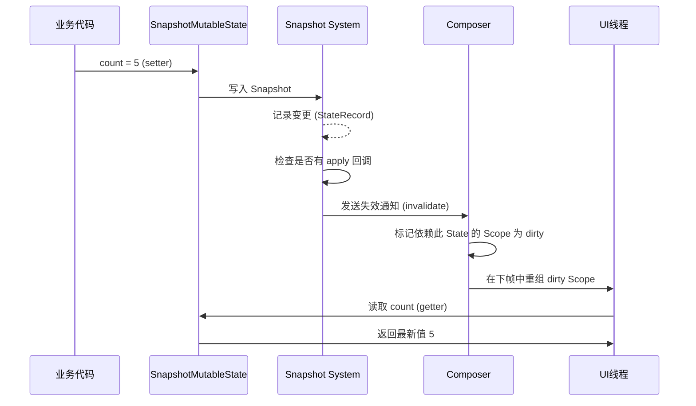
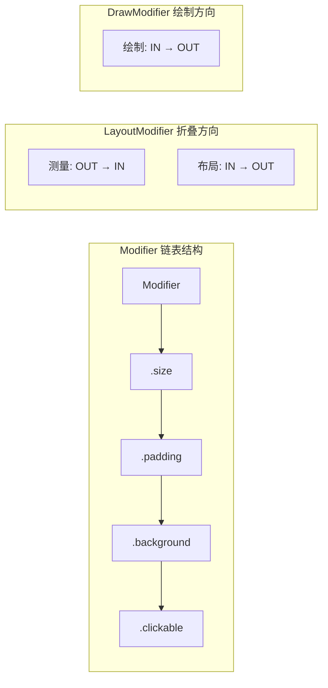
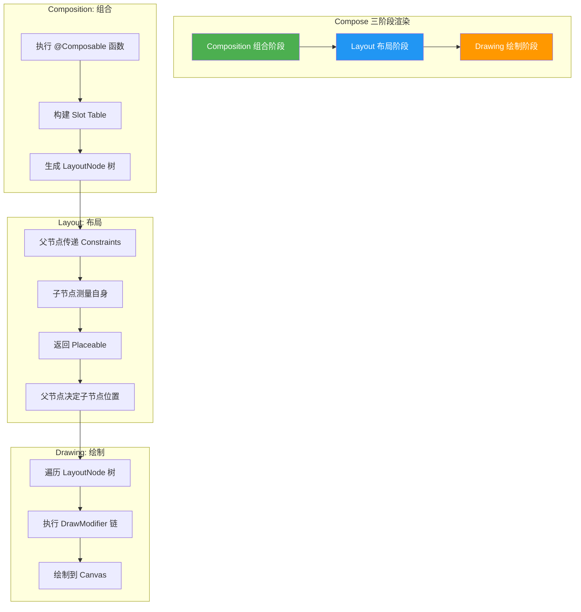
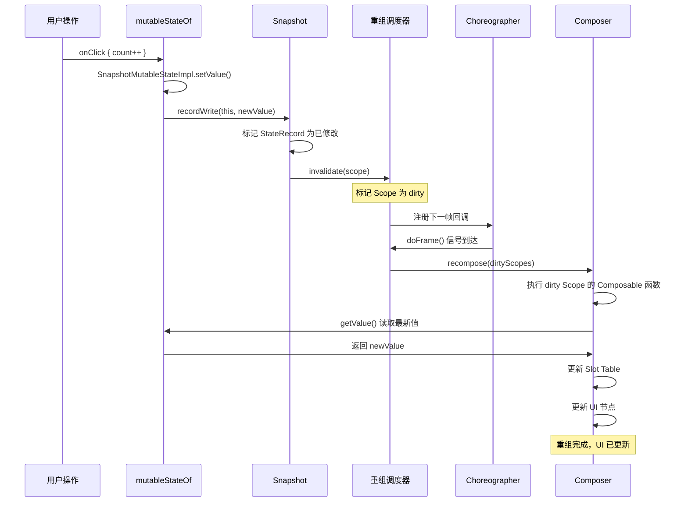

# Compose 声明式 UI —— 面试深度指南

> **适用岗位**: Android 高级开发 / 架构师  
> **涵盖范围**: Compose 重组机制、Snapshot 状态系统、Modifier 链、副作用 API、性能优化、源码分析  
> **字数**: 约 8000+ 字

---

## 📋 目录

1. [面试问题清单](#1-面试问题清单)
2. [标准答案（含代码示例）](#2-标准答案)
3. [核心原理深度剖析](#3-核心原理深度剖析)
4. [流程图（Mermaid + HTML）](#4-流程图)
5. [源码分析](#5-源码分析)
6. [应用场景与最佳实践](#6-应用场景与最佳实践)

---

## 1. 面试问题清单

> 以下问题覆盖 Compose 面试核心考点，建议逐一掌握。

| # | 问题 | 难度 | 考察点 |
|---|------|------|--------|
| 1 | Compose 的**重组 (Recomposition)** 机制是什么？触发条件有哪些？ | ⭐⭐⭐ | 声明式 UI 核心概念 |
| 2 | `remember` 和 `mutableStateOf` 的工作原理是什么？什么是 **SnapshotState**？ | ⭐⭐⭐⭐ | Snapshot 状态管理 |
| 3 | Compose 的 **Modifier 链式调用** 是如何执行的？顺序是怎样的？ | ⭐⭐⭐ | Modifier 链机制 |
| 4 | 副作用 API：`LaunchedEffect` / `SideEffect` / `DisposableEffect` / `rememberCoroutineScope` 分别适用什么场景？ | ⭐⭐⭐⭐ | 副作用管理 |
| 5 | Compose vs View 的性能对比如何？如何在项目中**混合使用**（`ComposeView` / `AndroidView`）？ | ⭐⭐⭐ | 混合开发策略 |
| 6 | 什么是 **状态提升 (State Hoisting)**？如何设计无状态 Composable？ | ⭐⭐⭐ | 架构设计模式 |
| 7 | `derivedStateOf` 和 `remember` 的区别是什么？各自适用什么场景？ | ⭐⭐⭐⭐ | 派生状态优化 |
| 8 | Compose 的测量 → 布局 → 绘制流程与传统 View 系统有何异同？ | ⭐⭐⭐⭐⭐ | 渲染机制对比 |
| 9 | `LazyColumn` 如何优化列表性能？`key` 参数的作用是什么？ | ⭐⭐⭐ | 列表优化 |
| 10 | Compose 编译器插件对 `@Composable` 做了什么转换？ | ⭐⭐⭐⭐⭐ | 编译期黑魔法 |

---

## 2. 标准答案（含代码示例）

### 2.1 Compose 的重组 (Recomposition) 机制

**重组** 是 Compose 的核心机制：当可观察状态发生变化时，Compose 框架会**智能地重新执行**那些读取了该状态的 `@Composable` 函数，以更新 UI。

**触发条件**：
1. **State 对象的值发生变化** — 被 `mutableStateOf` 包装的状态被重新赋值
2. **可观察的数据流变化** — `LiveData`、`Flow`、`RxJava` 等通过 `observeAsState()` / `collectAsState()` 触发
3. **Composable 参数变化** — 父级 Composable 传入的参数发生 `equals` 不等的变化

**关键特性**：
- ✅ **最小化重组范围** — 只有读取了变化的 State 的 Composable 才会重组
- ✅ **可跳过 (Skippable)** — 编译器会为参数未变化的 Composable 标记可跳过
- ✅ **乐观重组** — 可能被取消和重新启动

```kotlin
// ✅ 示例：精准的重组范围
@Composable
fun UserProfile(viewModel: UserViewModel) {
    val user by viewModel.user.collectAsState()  // State 读取

    Column {
        // 只有 Name 组件会在 user.name 变化时重组
        Name(user.name)

        // Avatar 组件接收稳定的 user.avatarUrl，不会因其他状态变化而重组
        Avatar(user.avatarUrl)

        // 这个 lambda 中读取了 user.bio，只有 bio 变化时此处才重组
        BioSection(user.bio)
    }
}

@Composable
fun Name(name: String) {
    // 编译器标记为 skippable（当 name 未变化时跳过）
    Text(text = name, style = MaterialTheme.typography.headlineMedium)
}
```

---

### 2.2 `remember` + `mutableStateOf` 与 SnapshotState

```kotlin
@Composable
fun Counter() {
    // remember: 在 Composition 中保留值，重组时不会重新初始化
    // mutableStateOf: 创建 SnapShotMutableState 对象
    // by 委托: 自动 get/set，读取时自动订阅重组
    var count by remember { mutableStateOf(0) }

    Button(onClick = { count++ }) {
        Text("Clicked $count times")
    }
}
```

**工作原理**：
1. `mutableStateOf(0)` 返回 `SnapshotMutableStateImpl` 对象
2. 当 Composable 读取 `count` 时（通过 `by` 委托的 getter），Compose 记录"此 Composable 依赖该 State"
3. 当 `count` 值被修改时（setter），Snapshot 系统通知所有依赖此 State 的 Composable 进行重组
4. `remember` 确保 State 对象在重组后仍然是**同一个实例**（否则每次重组都创建新 State，UI 无法响应变化）

```kotlin
// ⚠️ 常见错误：忘记 remember
@Composable
fun BrokenCounter() {
    var count by mutableStateOf(0)  // ❌ 每次重组都创建新的 State！
    Button(onClick = { count++ }) {
        Text("Clicked $count times")  // count 始终为 0
    }
}

// ✅ 正确写法
@Composable
fun CorrectCounter() {
    var count by remember { mutableStateOf(0) }  // ✅ 跨重组保持实例
    Button(onClick = { count++ }) {
        Text("Clicked $count times")
    }
}
```

---

### 2.3 Modifier 链式调用与执行顺序

Modifier 链遵循 **"从外到内 (outside-in)"** 的构建顺序，但绘制顺序则为 **"从内到外"**：

```kotlin
@Composable
fun ModifierOrderDemo() {
    Box(
        modifier = Modifier
            // 1️⃣ 最先包裹（最外层）
            .size(100.dp)
            // 2️⃣ 包裹在 size 内部
            .padding(16.dp)
            // 3️⃣ 最内层
            .background(Color.Red)
            // 4️⃣ 在背景之上
            .clickable { /* click */ }
    )
}
```

**Modifier 链结构**（链表形式）：
```
size → padding → background → clickable
(尾)  ←  ←  ←  ←  ←  ←  ←  ←  (头)
```

**三种 Modifier 类型**的执行层级：

| 类型 | 接口 | 典型实例 | 执行阶段 |
|------|------|---------|---------|
| `LayoutModifier` | 影响测量和布局 | `size()` `padding()` `fillMaxWidth()` | 测量/布局阶段 |
| `DrawModifier` | 影响绘制 | `background()` `border()` `clip()` | 绘制阶段 |
| `SemanticsModifier` | 无障碍和测试 | `semantics{}` `clickable()` `testTag()` | 辅助功能 |

```kotlin
// 执行顺序示例
Modifier
    .padding(8.dp)          // LayoutModifier: 先处理（外面）
    .clip(CircleShape)       // DrawModifier:   后绘制（里层会被裁剪）
    .background(Color.Blue)  // DrawModifier:   更早绘制（被 clip 裁剪）

// 结果：padding → clip(裁剪区域) → background(在被裁剪区域内绘制)
```

---

### 2.4 副作用 API 详解

Compose 的 **副作用 (Side Effect)** 是指那些需要在 Composable 函数之外执行的操作（如网络请求、数据库读写、注册监听器等）。

| API | 生命周期 | 适用场景 |
|-----|---------|---------|
| `LaunchedEffect(key)` | 进入 Composition → key 变化重启 → 离开 Composition 取消 | 异步操作（网络请求、动画） |
| `SideEffect` | **每次重组后**执行 | 同步非 Compose 状态更新（如设置 Toolbar title） |
| `DisposableEffect(key)` | 进入 Composition → onDispose 清理 | 注册/注销监听器（广播、传感器） |
| `rememberCoroutineScope()` | 与 Composable **同生命周期** | 点击事件中启动协程 |
| `rememberUpdatedState(newValue)` | 保持引用最新 | 副作用中引用最新闭包值 |

```kotlin
// 1. LaunchedEffect：启动协程，自动取消
@Composable
fun UserDetail(userId: String) {
    var user by remember { mutableStateOf<User?>(null) }

    LaunchedEffect(userId) {  // userId 变化时重启
        user = api.fetchUser(userId)  // 离开屏幕自动取消
    }

    user?.let { UserCard(it) } ?: CircularProgressIndicator()
}

// 2. DisposableEffect：注册/注销监听
@Composable
fun LocationListener(onLocation: (LatLng) -> Unit) {
    val context = LocalContext.current

    DisposableEffect(Unit) {
        val listener = LocationListener { location ->
            onLocation(LatLng(location.latitude, location.longitude))
        }
        locationManager.requestLocationUpdates(listener)

        onDispose {
            locationManager.removeUpdates(listener)  // 🔑 清理资源
        }
    }
}

// 3. rememberCoroutineScope：事件驱动的协程
@Composable
fun SaveButton(onSave: suspend () -> Unit) {
    val scope = rememberCoroutineScope()  // 绑定 Composable 生命周期
    var saving by remember { mutableStateOf(false) }

    Button(
        onClick = {
            scope.launch {
                saving = true
                onSave()
                saving = false
            }
        },
        enabled = !saving
    ) { Text(if (saving) "Saving..." else "Save") }
}

// 4. SideEffect：同步更新非 Compose 状态
@Composable
fun ScreenWithToolbar(title: String) {
    val toolbar = LocalContext.current.findViewBy...  // 假设获取 Toolbar

    SideEffect {
        toolbar.title = title  // 每次重组后同步更新 Toolbar
    }
}
```

---

### 2.5 Compose vs View 性能对比 & 混合使用

**性能对比**：

| 维度 | View 系统 | Compose |
|------|----------|---------|
| 测量 | 两次遍历（Measure + Layout） | 单次遍历（约束传递） |
| 状态更新 | `invalidate()` → 全局重绘 | 精准重组（仅受影响节点） |
| 布局嵌套 | 深层嵌套影响性能 | 扁平化，无 XML 解析开销 |
| 启动速度 | 较快（成熟优化） | 首次 Composition 有开销 |
| 内存 | View 对象较多 | 组合节点更轻量 |

```kotlin
// 混合使用 1：在 View 中使用 Compose
class MyActivity : AppCompatActivity() {
    override fun onCreate(savedInstanceState: Bundle?) {
        super.onCreate(savedInstanceState)

        setContentView(
            ComposeView(this).apply {
                setContent {
                    MyComposeApp()
                }
            }
        )
    }
}

// 混合使用 2：在 Compose 中使用传统 View
@Composable
fun MapScreen(latLng: LatLng) {
    AndroidView(
        factory = { context ->
            MapView(context).apply {
                // 初始化 MapView
            }
        },
        update = { mapView ->
            // 当 latLng 变化时更新 MapView
            mapView.animateCamera(CameraUpdateFactory.newLatLng(latLng))
        },
        modifier = Modifier.fillMaxSize()
    )
}

// 混合使用 3：XML 布局中嵌入 Compose
// activity_main.xml
// <androidx.compose.ui.platform.ComposeView
//     android:id="@+id/compose_view"
//     android:layout_width="match_parent"
//     android:layout_height="wrap_content" />
```

**混合开发注意事项**：
- `ComposeView` 和 `AndroidView` 的创建/销毁有额外开销，避免高频切换
- 状态同步：使用 `StateFlow` 或 `LiveData` 作为 View 和 Compose 的桥梁
- 主题一致性：使用 `MaterialTheme` 和 `AppCompat` 主题保持统一

---

### 2.6 状态提升 (State Hoisting)

**状态提升** 是将状态从子 Composable 移到父级，让子 Composable 变成**无状态**组件的设计模式。

```kotlin
// ❌ 有状态组件（难以复用和测试）
@Composable
fun StatefulTextField() {
    var text by remember { mutableStateOf("") }  // 内部持有状态
    TextField(value = text, onValueChange = { text = it })
}

// ✅ 状态提升 → 无状态组件
@Composable
fun StatelessTextField(
    value: String,                    // 状态由外部传入
    onValueChange: (String) -> Unit,  // 事件回调给外部
    modifier: Modifier = Modifier
) {
    TextField(
        value = value,
        onValueChange = onValueChange,
        modifier = modifier
    )
}

// ✅ 父级管理状态
@Composable
fun ParentScreen() {
    var name by remember { mutableStateOf("") }
    var email by remember { mutableStateOf("") }

    Column {
        StatelessTextField(
            value = name,
            onValueChange = { name = it },
            modifier = Modifier.fillMaxWidth()
        )
        StatelessTextField(
            value = email,
            onValueChange = { email = it },
            modifier = Modifier.fillMaxWidth()
        )
        Button(onClick = { submit(name, email) }) {
            Text("Submit")
        }
    }
}
```

**状态提升的好处**：
- ✅ 单一数据源（SSOT）
- ✅ 易于测试（无状态组件可纯函数测试）
- ✅ 易于复用
- ✅ 便于 Preview 预览

---

### 2.7 `derivedStateOf` vs `remember`

```kotlin
// derivedStateOf：从其他状态计算派生，仅在计算结果变化时触发重组
@Composable
fun UserList(users: List<User>, filterKeyword: String) {
    // ✅ derivedStateOf: 仅当过滤结果变化时才触发读取此值的 Composable 重组
    val filteredUsers by remember {
        derivedStateOf {
            users.filter { it.name.contains(filterKeyword, ignoreCase = true) }
        }
    }

    LazyColumn {
        items(filteredUsers) { user ->
            UserItem(user)
        }
    }
}

// ❌ 错误用法：直接用 remember 包裹计算逻辑
@Composable
fun UserListBad(users: List<User>, filterKeyword: String) {
    val filteredUsers = remember(users, filterKeyword) {
        users.filter { it.name.contains(filterKeyword, ignoreCase = true) }
    }  // 每次 users 或 filterKeyword 变化都重新计算（正确），但 remember 不会避免重组

    // 其实这里用 remember 没问题，但 derivedStateOf 的威力在于：
    // 当 filterKeyword 频繁变化但过滤结果不变时，不会触发重组
}
```

**核心区别**：

| | `remember` | `derivedStateOf` |
|--|-----------|-----------------|
| 用途 | 跨重组**保持对象实例** | 从多个 State **计算派生值** |
| 重组触发 | 仅防止重新创建对象 | 仅在计算结果变化时通知依赖者 |
| 典型场景 | 保存 `mutableStateOf` 实例 | 过滤列表、判断条件、复合状态 |
| 依赖追踪 | 依赖 key 变化重新计算 | 自动追踪内部读取的 State |

---

## 3. 核心原理深度剖析

### 3.1 Snapshot 系统：Compose 的状态管理基石



**Snapshot 三层架构**：

```
应用层：mutableStateOf / mutableStateListOf / collectAsState
    ↓
Snapshot 层：全局 Snapshot → 读写分离 → apply 提交
    ↓
通知层：StateRecord → invalidate Scope → 调度重组帧
```

**关键概念**：
- **Global Snapshot**：所有 State 的当前有效值
- **读写分离**：状态修改写入当前 Snapshot，apply 后才全局可见
- **乐观并发**：Compose 的 Snapshot 是非阻塞的，不使用锁
- **中断和重试**：重组过程中如果状态被外部修改，正在进行的重组会被中断并重新调度

```kotlin
// Snapshot 的使用示例（内部原理简化演示）
val state = mutableStateOf(0)

// 创建 Snapshot 用于批量修改
val snapshot = Snapshot.takeMutableSnapshot()
snapshot.enter {
    state.value = 1
    state.value = 2
    // 此时外部读到的仍是 0（读写隔离）
}
snapshot.apply()  // 提交后外部才看到 2
```

---

### 3.2 Slot Table：Composable 的树形存储

**Slot Table** 是 Compose Runtime 中存储 Composable 节点信息的核心数据结构。

```
Composable Tree          Slot Table (扁平化存储)
─────────────────       ─────────────────────────
Root                      [0] Root Group
├── Column               [1]   Column Group
│   ├── Text("Hi")       [2]     Text Group  [3] "Hi"
│   └── Text("Bye")      [4]     Text Group  [5] "Bye"
└── Button               [6]   Button Group [7] "Click"
```

**Slot Table 的特点**：
- 使用**数组**实现（类似扁平化的线性存储）
- 通过 `Group` 标记层级关系
- `remember` 的值通过 Slot Index 跨重组保持
- 重组时通过比对 Slot Table 的差异（Diffing）决定更新范围
- **Gap Buffer** 数据结构：在当前编辑点预留空间，支持高效的插入/删除

```kotlin
// Compose Runtime 内部对 Slot Table 的使用（伪代码）
class Composer {
    private val slots = ArrayList<Any?>()  // Slot Table

    fun <T> remember(calculation: () -> T): T {
        // 在 Slot Table 中查找或创建 remember 值
        val slotIndex = currentSlotIndex++
        if (recomposing && slotIndex < slots.size) {
            return slots[slotIndex] as T  // 复用已有值
        }
        val value = calculation()
        slots.add(slotIndex, value)
        return value
    }
}
```

---

### 3.3 Compose 编译器的 `@Composable` 转换

Compose 编译器插件对 `@Composable` 函数做了以下关键转换：

```kotlin
// 源码
@Composable
fun Greeting(name: String) {
    Text("Hello $name!")
}

// ↓ 编译器转换后（伪代码）
fun Greeting(name: String, $composer: Composer, $changed: Int) {
    $composer.startRestartGroup(0x1a2b3c4d)  // 生成唯一 key
    // ... 函数体 ...
    Text("Hello $name!", $composer, 0)
    $composer.endRestartGroup()?.let { restartScope ->
        restartScope.updateScope { composer, changed ->
            Greeting(name, composer, changed)  // 重新调用自身
        }
    }
}
```

**关键转换点**：

| 转换 | 说明 |
|------|------|
| 添加 `$composer` 参数 | 上下文注入，Composer 携带 Slot Table 和重组信息 |
| 添加 `$changed` 参数 | 位掩码标记参数是否变化 |
| `startRestartGroup` / `endRestartGroup` | 划定可重组范围 |
| `RestartScope` | 包装函数引用，用于状态变化时重新调用 |
| 自动 `remember` 优化 | 编译器为稳定参数生成跳过逻辑 |

---

### 3.4 重组范围：最小化重组

```kotlin
@Composable
fun ProfileScreen(user: User) {
    // Scope A: 当 user 引用变化时整个函数重组
    Column {
        // Scope B: 仅当 user.name 变化时重组
        NameDisplay(user.name)

        // Scope C: 仅当 user.bio 变化时重组
        BioDisplay(user.bio)

        // Scope D: lambda 内部读取 state → 仅在 count 变化时重组此 lambda
        var count by remember { mutableStateOf(0) }
        Button(onClick = { count++ }) {
            Text("Count: $count")  // 仅重组 Text，不重组 Column
        }
    }
}
```

Compose 编译器会自动将 Composable 函数拆分为更小的重组 Scope，以 **lambda 中读取的 State 为边界** 进行精准重组。

---

### 3.5 Modifier 链机制



**Modifier 链的执行流程（源码级别）**：

```kotlin
// 简化版 Modifier 测量流程
fun Modifier.measure(constraints: Constraints): MeasureResult {
    // 1. 遍历链表，找到所有 LayoutModifier
    val layoutModifiers = this.foldOut(emptyList()) { mod, acc ->
        if (mod is LayoutModifier) acc + mod else acc
    }

    // 2. 从最外层 LayoutModifier 开始测量（约束向内传递）
    var currentConstraints = constraints
    for (modifier in layoutModifiers.reversed()) {
        currentConstraints = modifier.modifyConstraints(currentConstraints)
    }

    // 3. 测量实际内容
    val placeable = content.measure(currentConstraints)

    // 4. 从最内层 LayoutModifier 向外包装布局结果
    var result = placeable
    for (modifier in layoutModifiers) {
        result = modifier.wrap(result)
    }

    return result
}
```

---

## 4. 流程图

### 4.1 Compose 测量 → 布局 → 绘制流程



**与 View 系统三阶段对比**：

| 阶段 | View 系统 | Compose |
|------|----------|---------|
| 测量 | `measure()` 递归（两次遍历） | `LayoutModifier` 链，单次约束传递 |
| 布局 | `layout()` 确定位置 | `placeAt()` 放置 Placeable |
| 绘制 | `draw()` 按树顺序绘制 | `DrawModifier` 链，Canvas API |

---

### 4.2 Snapshot 状态更新 → 重组调度时序图



---

## 5. 源码分析

### 5.1 `mutableStateOf()` 源码追踪

```kotlin
// 1. 入口函数（Compose Runtime）
// compose/runtime/SnapshotState.kt
fun <T> mutableStateOf(
    value: T,
    policy: SnapshotMutationPolicy<T> = structuralEqualityPolicy()
): MutableState<T> {
    return SnapshotMutableStateImpl(value, policy)
}

// 2. 核心实现
internal class SnapshotMutableStateImpl<T>(
    value: T,
    override val policy: SnapshotMutationPolicy<T>
) : StateObject, SnapshotMutableState<T> {

    // StateStateRecord 是 Snapshot 系统的 StateRecord 子类
    private var next: StateStateRecord<T> = StateStateRecord(value)

    override var value: T
        get() = next.readable(this).value  // 从 Snapshot 读取
        set(value) = next.withCurrent {
            if (!policy.equivalent(it.value, value)) {
                next.overwritable(this, it) { this.value = value }
            }
        }
}

// 3. SnapshotMutationPolicy：判断值是否"真正变化"
@JvmField
val structuralEqualityPolicy: SnapshotMutationPolicy<Any?> =
    object : SnapshotMutationPolicy<Any?> {
        override fun equivalent(a: Any?, b: Any?): Boolean = a == b
    }

@JvmField
val referentialEqualityPolicy: SnapshotMutationPolicy<Any?> =
    object : SnapshotMutationPolicy<Any?> {
        override fun equivalent(a: Any?, b: Any?): Boolean = a === b
    }
```

**关键设计**：
- `structuralEqualityPolicy`（默认）：使用 `equals()` 判断，避免无效重组
- `referentialEqualityPolicy`：使用引用相等，适用于 Data Class 等
- `StateRecord` 的链表结构支持 Snapshot 系统的多版本并发

---

### 5.2 `LaunchedEffect` 源码分析

```kotlin
// compose/runtime/Effects.kt
@Composable
@NonRestartableComposable
fun LaunchedEffect(
    key: Any?,
    block: suspend CoroutineScope.() -> Unit
) {
    val applyContext = currentComposer.applyCoroutineContext

    // remember：根据 key 保持 Job 实例
    remember(key) { LaunchedEffectImpl(applyContext, block) }
}

internal class LaunchedEffectImpl(
    parentCoroutineContext: CoroutineContext,
    private val task: suspend CoroutineScope.() -> Unit
) : RememberObserver {

    private var job: Job? = null
    private var scope: CoroutineScope? = null

    // ===== 进入 Composition =====
    override fun onRemembered() {
        // 创建协程作用域并启动
        val scope = CoroutineScope(parentCoroutineContext + SupervisorJob())
        this.scope = scope
        job = scope.launch(block = task)
    }

    // ===== key 变化 → 重启 =====
    override fun onForgotten() {
        // 取消旧协程
        job?.cancel()
        job = null
        scope = null
    }

    // ===== 离开 Composition =====
    override fun onAbandoned() {
        job?.cancel()
        job = null
        scope = null
    }
}
```

**生命周期对应关系**：

| RememberObserver 回调 | LaunchedEffect 行为 |
|----------------------|-------------------|
| `onRemembered()` | 启动协程 |
| `onForgotten()` | key 变化，取消旧协程 |
| `onAbandoned()` | 离开 Composition，清理资源 |

---

### 5.3 `Modifier.composed` 实现

```kotlin
// compose/ui/Modifier.kt
fun Modifier.composed(
    inspectorInfo: InspectorInfo.() -> Unit = NoInspectorInfo,
    factory: @Composable Modifier.() -> Modifier
): Modifier = this.then(ComposedModifier(inspectorInfo, factory))

// ComposedModifier 内部
private class ComposedModifier(
    val inspectorInfo: InspectorInfo.() -> Unit,
    val factory: @Composable Modifier.() -> Modifier
) : Modifier.Element {

    override fun <R> foldIn(initial: R, operation: (R, Element) -> R): R =
        operation(initial, this)

    override fun <R> foldOut(initial: R, operation: (Element, R) -> R): R =
        operation(this, initial)
}

// 使用 .composed 的典型场景：在 Modifier 中读取 Composable 作用域的值
fun Modifier.customModifier(): Modifier = composed {
    // 在 Composable 作用域中读取值
    val density = LocalDensity.current
    val color = MaterialTheme.colors.primary

    this
        .size(with(density) { 48.dp.toPx().toDp() })
        .background(color)
}
```

---

## 6. 应用场景与最佳实践

### 6.1 LazyColumn 列表优化

```kotlin
@Composable
fun OptimizedUserList(users: List<User>) {
    LazyColumn(
        modifier = Modifier.fillMaxSize(),
        contentPadding = PaddingValues(16.dp),
        verticalArrangement = Arrangement.spacedBy(8.dp)
    ) {
        // ✅ 使用 key 参数：Compose 能精确追踪每个 item
        items(
            items = users,
            key = { user -> user.id }  // 🔑 稳定的 key
        ) { user ->
            UserCard(
                user = user,
                modifier = Modifier.animateItem()  // ✅ 添加动画
            )
        }

        // ✅ stickyHeader：固定头部
        stickyHeader {
            Text("Active Users", style = MaterialTheme.typography.titleMedium)
        }

        // ✅ 预取优化
        item {
            // 使用 contentType 帮助 Compose 确定 item 类型
        }
    }
}

// ❌ 常见错误：不稳定的 key
@Composable
fun BadUserList(users: List<User>) {
    LazyColumn {
        items(
            items = users,
            // ❌ 使用 index 作为 key → item 位置变化时状态丢失
            key = { index -> index }
        ) { user ->
            UserCard(user)
        }
    }
}
```

**LazyColumn 优化要点**：

| 技巧 | 说明 |
|------|------|
| 稳定的 `key` | 使用数据 ID，避免 index |
| `contentType` | 区分不同 item 类型，复用更高效 |
| `animateItem()` | 平滑的增删动画 |
| `remember` 缓存 | 在 item 内部对耗时计算结果做缓存 |
| `stickyHeader` | 固定分组标题 |

---

### 6.2 Compose + ViewModel + Flow 的 MVVM 实现

```kotlin
// ============ ViewModel ============
class UserListViewModel(
    private val repository: UserRepository
) : ViewModel() {

    // UI State：单一数据源
    data class UiState(
        val users: List<User> = emptyList(),
        val isLoading: Boolean = false,
        val error: String? = null
    )

    private val _uiState = MutableStateFlow(UiState())
    val uiState: StateFlow<UiState> = _uiState.asStateFlow()

    // 使用 StateFlow 暴露派生状态（比 derivedStateOf 更稳定）
    val activeUsers: StateFlow<List<User>> = _uiState
        .map { state -> state.users.filter { it.isActive } }
        .stateIn(
            viewModelScope,
            SharingStarted.WhileSubscribed(5000),
            emptyList()
        )

    init {
        loadUsers()
    }

    fun loadUsers() {
        viewModelScope.launch {
            _uiState.update { it.copy(isLoading = true, error = null) }
            try {
                val users = repository.getUsers()
                _uiState.update { it.copy(users = users, isLoading = false) }
            } catch (e: Exception) {
                _uiState.update { it.copy(isLoading = false, error = e.message) }
            }
        }
    }

    fun deleteUser(userId: String) {
        viewModelScope.launch {
            repository.deleteUser(userId)
            loadUsers()  // 刷新列表
        }
    }
}

// ============ Compose Screen ============
@Composable
fun UserListScreen(
    viewModel: UserListViewModel = hiltViewModel(),
    onUserClick: (User) -> Unit
) {
    val uiState by viewModel.uiState.collectAsStateWithLifecycle()

    UserListContent(
        uiState = uiState,
        onRefresh = viewModel::loadUsers,
        onDeleteUser = viewModel::deleteUser,
        onUserClick = onUserClick
    )
}

@Composable
private fun UserListContent(
    uiState: UserListViewModel.UiState,
    onRefresh: () -> Unit,
    onDeleteUser: (String) -> Unit,
    onUserClick: (User) -> Unit
) {
    // ✅ Pull-to-Refresh
    val pullRefreshState = rememberPullToRefreshState()

    Box(modifier = Modifier.fillMaxSize()) {
        when {
            uiState.isLoading && uiState.users.isEmpty() -> {
                CircularProgressIndicator(modifier = Modifier.align(Alignment.Center))
            }
            uiState.error != null -> {
                ErrorView(
                    message = uiState.error!!,
                    onRetry = onRefresh,
                    modifier = Modifier.align(Alignment.Center)
                )
            }
            else -> {
                LazyColumn {
                    items(uiState.users, key = { it.id }) { user ->
                        UserCard(
                            user = user,
                            onClick = { onUserClick(user) },
                            onDelete = { onDeleteUser(user.id) }
                        )
                    }
                }
            }
        }
    }
}
```

**最佳实践总结**：

| 实践 | 说明 |
|------|------|
| `StateFlow` + `collectAsStateWithLifecycle()` | 生命周期感知的状态收集 |
| `UiState` Data Class | 单一状态对象，便于调试和恢复 |
| 状态提升 | Screen 持有 ViewModel，Content 是无状态组件 |
| `key` 参数 | LazyColumn 中稳定追踪 item |
| Hilt 注入 | `hiltViewModel()` 自动管理 ViewModel 生命周期 |

---

### 6.3 其他关键优化技巧

```kotlin
// 1️⃣ 使用 @Stable 注解优化重组跳过
@Stable
data class User(
    val id: String,
    val name: String,
    val avatarUrl: String
)

// 2️⃣ 避免在 Composable 中直接读取可变集合
@Composable
fun UserListGood(users: SnapshotStateList<User>) {  // ✅ Compose 可追踪
    // SnapshotStateList 内置变更通知
    LazyColumn {
        items(users, key = { it.id }) { user ->
            Text(user.name)
        }
    }
}

// 3️⃣ 使用 remember 缓存 lambda
@Composable
fun ParentWithCallback(onEvent: (Event) -> Unit) {
    val stableCallback = remember(onEvent) { onEvent }
    // stableCallback 在 onEvent 变化时更新，避免子组件不必要重组
}

// 4️⃣ CompositionLocal 的使用
val LocalUserPreferences = compositionLocalOf { UserPreferences() }

@Composable
fun ThemedApp(content: @Composable () -> Unit) {
    CompositionLocalProvider(
        LocalUserPreferences provides UserPreferences(theme = "dark")
    ) {
        content()
    }
}
```

---

## 📚 附录：延伸阅读

| 主题 | 推荐资源 |
|------|---------|
| Compose 内部原理 | [Android 开发者文档 - Compose 原理](https://developer.android.com/jetpack/compose/phases) |
| Snapshot 系统 | [Compose Runtime 源码](https://cs.android.com/androidx/platform/frameworks/support/+/androidx-main:compose/runtime/runtime/) |
| Modifier 深度 | [Compose Modifiers 文档](https://developer.android.com/jetpack/compose/modifiers) |
| 性能优化 | [Compose 性能最佳实践](https://developer.android.com/jetpack/compose/performance) |

---

> **面试技巧**: 回答 Compose 问题时，始终围绕 **声明式编程范式** 的核心——"UI = f(State)"，强调 Compose 如何通过 Snapshot 系统、Slot Table 和编译器插件实现这一范式，比单纯背 API 更能体现你的深度理解。
