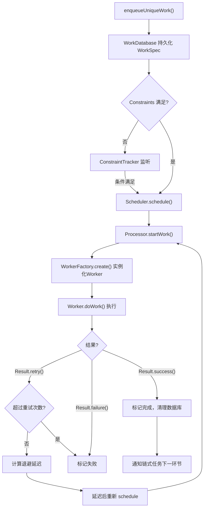
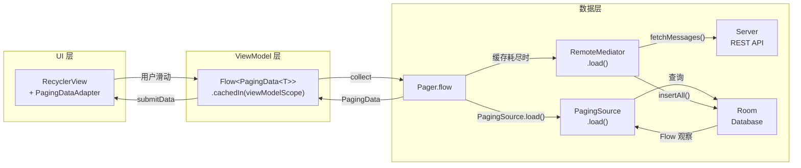

# WorkManager / DataStore / Paging / Startup — 面试深度解析

> **字数统计**: ~6200字 | 阅读时长: 约30分钟  
> **适用岗位**: Android高级/资深开发、架构师  
> **前置知识**: Jetpack基础组件、Kotlin协程与Flow、Android存储机制

---

## 📑 目录

1. [面试高频问题](#1-面试高频问题)
2. [标准答案与代码示例](#2-标准答案与代码示例)
3. [核心原理深度解析](#3-核心原理深度解析)
4. [流程图 — Mermaid](#4-流程图)
5. [源码分析](#5-源码分析)
6. [应用场景与实战](#6-应用场景与实战)

---

## 1. 面试高频问题

> 以下7个问题覆盖WorkManager、DataStore、Paging3、Startup四大组件的核心考察点。

| # | 问题 | 考察维度 | 难度 |
|---|------|---------|------|
| Q1 | WorkManager的任务调度机制是怎样的？idempotent(幂等)、Constraints(约束)、Retry(重试)分别如何实现？ | WorkManager核心机制 | ⭐⭐⭐⭐ |
| Q2 | WorkManager vs JobScheduler vs AlarmManager 的区别与选型策略？何时该用哪个？ | 调度框架对比 | ⭐⭐⭐⭐⭐ |
| Q3 | SharedPreferences vs DataStore：同步/异步、apply的ANR风险、Proto DataStore vs Preferences DataStore如何选？ | 存储方案对比 | ⭐⭐⭐⭐ |
| Q4 | Paging3的三层架构 — PagingSource + PagingData + RemoteMediator 各自职责是什么？数据如何流转？ | Paging3架构 | ⭐⭐⭐⭐ |
| Q5 | Paging2 vs Paging3 的核心差异？为什么Google要重写整个分页库？ | Paging演进对比 | ⭐⭐⭐ |
| Q6 | App Startup 如何替代 ContentProvider 实现初始化？Initializer 的依赖拓扑排序是如何工作的？ | Startup机制 | ⭐⭐⭐⭐ |
| Q7 | WorkManager的链式任务(beginWith/then)如何编排？失败传播与恢复机制是什么？ | 链式任务编排 | ⭐⭐⭐ |

---

## 2. 标准答案与代码示例

### Q1: WorkManager任务调度机制

#### 答案要点

WorkManager 的三层调度机制：

- **幂等性 (Idempotent)**：通过 `enqueueUniqueWork()` + `ExistingWorkPolicy` 保证同一逻辑任务只入队一次。底层使用 `WorkDatabase` 中 `name` 字段的唯一约束。
- **约束 (Constraints)**：通过 `Constraints.Builder` 设置网络类型、电量、存储空间等前置条件。内部委托给 `ConstraintTracker` 监听系统状态。
- **重试 (Retry)**：通过 `setBackoffCriteria()` 设置退避策略（LINEAR/EXPONENTIAL），默认30秒初始延迟 + 指数退避，由 `WorkManagerImpl` 内部的 `Processor` 负责重调度。

#### 代码示例

```kotlin
// ── 幂等任务 + 约束 + 重试 ──
val constraints = Constraints.Builder()
    .setRequiredNetworkType(NetworkType.CONNECTED)       // 需要网络
    .setRequiresBatteryNotLow(true)                       // 非低电量
    .setRequiresStorageNotLow(true)                       // 存储充足
    .build()

val uploadRequest = OneTimeWorkRequestBuilder<UploadWorker>()
    .setConstraints(constraints)
    .setBackoffCriteria(
        BackoffPolicy.EXPONENTIAL,    // 指数退避：30s → 60s → 120s → ...
        WorkRequest.MIN_BACKOFF_MILLIS,  // 初始延迟30s
        TimeUnit.MILLISECONDS
    )
    .setInputData(
        workDataOf("image_uri" to imageUri.toString())
    )
    .build()

// 幂等：同一名称只存在一个任务
WorkManager.getInstance(context)
    .enqueueUniqueWork(
        "upload_${imageId}",          // 唯一名称
        ExistingWorkPolicy.KEEP,       // 已有同名任务则保持原任务
        uploadRequest
    )

// ── Worker 实现 ──
class UploadWorker(context: Context, params: WorkerParameters) : CoroutineWorker(context, params) {
    override suspend fun doWork(): Result {
        val uri = inputData.getString("image_uri") ?: return Result.failure()
        return try {
            uploadImage(uri)
            Result.success(workDataOf("uploaded_url" to "https://cdn.example.com/img/123"))
        } catch (e: NetworkException) {
            Result.retry()  // 网络异常触发重试
        } catch (e: Exception) {
            Result.failure() // 不可恢复的错误，不再重试
        }
    }
}
```

**ExistingWorkPolicy 三种策略对比：**

| 策略 | 行为 | 使用场景 |
|------|------|---------|
| `KEEP` | 已有任务则忽略新请求 | 防止重复上传 |
| `REPLACE` | 取消旧任务，入队新任务 | 用户发起新操作覆盖旧操作 |
| `APPEND` | 将新任务串接到旧任务之后 | 消息队列依次处理 |
| `APPEND_OR_REPLACE` | 旧任务小于某个状态则追加，否则替换 | 灵活策略 |

---

### Q2: WorkManager vs JobScheduler vs AlarmManager

#### 答案要点

| 维度 | WorkManager | JobScheduler | AlarmManager |
|------|-------------|-------------|--------------|
| **API要求** | 全平台（内部适配） | API 21+ | 全平台 |
| **精确执行** | 不保证精确时间 | 不保证精确时间 | `setExact()`支持精确 |
| **约束支持** | ✅ 丰富（网络/电量/存储/空闲） | ✅ 原生支持 | ❌ 需自行实现 |
| **链式任务** | ✅ `beginWith/then` | ❌ 需手动编排 | ❌ 需手动编排 |
| **存活保证** | ✅ 进程死亡后恢复 | ⚠️ 取决于ROM | ✅ Alarm持久化 |
| **低版本策略** | 自动降级（BroadcastReceiver+AlarmManager） | 仅API 21+ | 原生支持 |

**选型策略：**

```
可推迟的后台任务 ──► WorkManager（首选）
    ├── 需要约束条件（网络、电量等）
    ├── 需要保证执行（即使进程死亡）
    └── 需要链式编排

精确时间任务 ──► AlarmManager
    └── 闹钟、日历提醒等必须在确定时间点触发

短期精确任务 ──► Handler / Kotlin协程
    └── 进程存活期间的精确执行

即发即弃 ──► 协程 + Dispatchers.IO
    └── 不需要存活保证的轻量任务
```

---

### Q3: SharedPreferences vs DataStore

#### 答案要点

**SharedPreferences 的两大陷阱：**

1. **`apply()` 的ANR风险**：`apply()`虽然是异步写入磁盘，但它会在 `Activity.onStop()` 期间被阻塞直到写入完成（`QueuedWork.waitToFinish()`），IO竞争时直接触发ANR。
2. **主线程读取**：`getXxx()` 方法同步读文件，主线程调用会卡顿。

**DataStore 的设计优势：**

- 完全异步：基于 `Flow` + `Dispatchers.IO`，永不阻塞主线程
- 原子写入：使用事务性文件写入，写失败不会损坏数据
- 类型安全：Preferences DataStore使用Kotlin `Preferences.Key<T>`；Proto DataStore使用Protocol Buffers

| 维度 | SharedPreferences | Preferences DataStore | Proto DataStore |
|------|-------------------|----------------------|-----------------|
| 线程安全 | `apply()` 异步但有陷阱 | ✅ 完全异步 | ✅ 完全异步 |
| 类型安全 | ❌ 运行时强转 | ✅ 编译期类型 | ✅ Schema约束 |
| 错误处理 | ❌ 解析异常直接崩溃 | ✅ 返回空/默认值 | ✅ Schema保证 |
| 数据一致性 | ❌ 无事务保证 | ✅ 原子写入 | ✅ 原子写入 |
| 复杂对象 | ❌ 需手动序列化 | ⚠️ 有限支持 | ✅ Proto原生 |
| 性能 | 中 | 高（全异步） | 高+高效序列化 |

#### 代码示例

```kotlin
// ── Preferences DataStore ──
val Context.dataStore: DataStore<Preferences> by preferencesDataStore(name = "settings")

// 读取：Flow驱动，永不阻塞主线程
val nightModeFlow: Flow<Boolean> = context.dataStore.data
    .map { preferences ->
        preferences[PreferencesKeys.NIGHT_MODE] ?: false
    }
    .catch { e ->
        if (e is IOException) emit(emptyPreferences())  // 读取失败优雅降级
        else throw e
    }

// 写入：suspend函数，全异步
suspend fun setNightMode(enabled: Boolean) {
    context.dataStore.edit { preferences ->
        preferences[PreferencesKeys.NIGHT_MODE] = enabled
    }
}

// ── Proto DataStore ──
object UserSettingsSerializer : Serializer<UserSettings> {
    override val defaultValue: UserSettings = UserSettings.getDefaultInstance()
    override suspend fun readFrom(input: InputStream): UserSettings {
        return try {
            UserSettings.parseFrom(input)
        } catch (e: InvalidProtocolBufferException) {
            throw CorruptionException("Cannot read proto", e)
        }
    }
    override suspend fun writeTo(t: UserSettings, output: OutputStream) = t.writeTo(output)
}

val Context.protoDataStore: DataStore<UserSettings> by dataStore(
    fileName = "user_settings.pb",
    serializer = UserSettingsSerializer
)
```

> ⚠️ **迁移建议**：新项目无脑DataStore；旧项目如果已用SP + Hilt且无ANR，逐步迁移。切勿SP和DataStore同时操作同一文件。

---

### Q4: Paging3 三层架构

#### 答案要点

Paging3 的分层职责：

1. **PagingSource**（数据层）：定义如何从单一数据源（网络或本地DB）加载分页数据。核心方法 `load()` 返回 `LoadResult.Page`。
2. **PagingData**（数据层→UI层桥梁）：不可变的数据容器，由 `Pager` 生成，通过 `Flow<PagingData<T>>` 从Repository传递到ViewModel。
3. **RemoteMediator**（协调层）：当本地缓存耗尽时，从网络加载数据并存入本地DB（Database→Network→Database模式），即"单一数据源"架构的核心。

#### 代码示例

```kotlin
// ── 第一层：PagingSource（从Room加载分页数据）──
class MessagePagingSource(
    private val dao: MessageDao,
    private val conversationId: Long
) : PagingSource<Int, Message>() {
    
    override suspend fun load(params: LoadParams<Int>): LoadResult<Int, Message> {
        val page = params.key ?: 0  // 初始key
        return try {
            val messages = dao.getMessagesPaged(conversationId, page, params.loadSize)
            LoadResult.Page(
                data = messages,
                prevKey = if (page == 0) null else page - 1,
                nextKey = if (messages.isEmpty()) null else page + 1
            )
        } catch (e: Exception) {
            LoadResult.Error(e)
        }
    }

    override fun getRefreshKey(state: PagingState<Int, Message>): Int? {
        // 失效后重新加载的锚点
        return state.anchorPosition?.let { anchorPosition ->
            state.closestPageToPosition(anchorPosition)?.prevKey?.plus(1)
                ?: state.closestPageToPosition(anchorPosition)?.nextKey?.minus(1)
        }
    }
}

// ── 第二层：RemoteMediator（网络→Database）──
@OptIn(ExperimentalPagingApi::class)
class MessageRemoteMediator(
    private val api: MessageApi,
    private val db: AppDatabase,
    private val conversationId: Long
) : RemoteMediator<Int, Message>() {
    
    override suspend fun load(
        loadType: LoadType,
        state: PagingState<Int, Message>
    ): MediatorResult {
        val page = when (loadType) {
            LoadType.REFRESH -> null  // 刷新：从0开始
            LoadType.PREPEND -> return MediatorResult.Success(endOfPaginationReached = true)
            LoadType.APPEND -> {
                val lastItem = state.lastItemOrNull()
                    ?: return MediatorResult.Success(endOfPaginationReached = true)
                lastItem.id  // 以最后一条消息id为游标
            }
        }
        
        return try {
            val response = api.fetchMessages(conversationId, cursor = page)
            db.withTransaction {
                if (loadType == LoadType.REFRESH) {
                    db.messageDao().clearMessages(conversationId)
                }
                db.messageDao().insertAll(response.messages.map { it.toEntity() })
            }
            MediatorResult.Success(endOfPaginationReached = response.messages.isEmpty())
        } catch (e: Exception) {
            MediatorResult.Error(e)
        }
    }
}

// ── 第三层：Pager 组装 → Flow<PagingData> ──
@OptIn(ExperimentalPagingApi::class)
fun observeMessages(conversationId: Long): Flow<PagingData<Message>> {
    return Pager(
        config = PagingConfig(
            pageSize = 20,
            prefetchDistance = 10,   // 距离底部10条时触发预加载
            enablePlaceholders = false
        ),
        remoteMediator = MessageRemoteMediator(api, db, conversationId),
        pagingSourceFactory = { db.messageDao().getMessagesPagedSource(conversationId) }
    ).flow
}

// ── ViewModel → UI ──
@HiltViewModel
class ChatViewModel @Inject constructor(
    private val repo: MessageRepository
) : ViewModel() {
    fun messages(conversationId: Long): Flow<PagingData<Message>> =
        repo.observeMessages(conversationId).cachedIn(viewModelScope)
}
```

---

### Q5: Paging2 vs Paging3

| 维度 | Paging2 | Paging3 |
|------|---------|---------|
| **数据源** | `DataSource<Key, Value>` 三子类(ItemKeyed/PageKeyed/Positional) | 统一 `PagingSource<Key, Value>` 单一抽象 |
| **传输方式** | `LiveData<PagedList>` | `Flow<PagingData>`，全面拥抱协程 |
| **错误处理** | ❌ 需手动管理 | ✅ `LoadResult.Error` + `retry()` |
| **数据转换** | ❌ 复杂，需自定义 | ✅ `map/filter/insertSeparators` |
| **中介层** | ❌ 无，需手写网络→DB同步 | ✅ `RemoteMediator` 原生支持 |
| **预取**(prefetch) | 固定 `prefetchDistance` | ✅ 可配置 |
| **Header/Footer** | ❌ 需自定义Adapter | ✅ `insertSeparators` 原生支持 |
| **组合流** | ❌ 不支持 | ✅ `combine/flatMap` 组合多个PagingData |

> **为什么重写？** Paging2诞生于RxJava/LiveData时代，Paging3全面拥抱Kotlin协程+Flow；统一PagingSource消除三子类的混乱；RemoteMediator解决了"网络+本地"双数据源的终极架构难题。

---

### Q6: App Startup vs ContentProvider

#### 答案要点

**ContentProvider 初始化的痛点：**

1. **启动性能杀手**：每个`ContentProvider.onCreate()`在`Application.onCreate()`之前串行执行，大量库注册Provider导致冷启动严重变慢。
2. **隐式耦合**：无法显式声明库之间的初始化依赖顺序。
3. **无懒加载**：即使该初始化永远用不到，Provider也会在启动时执行。

**App Startup 的解决方案：**

- 编译期生成单一 `InitializationProvider`（本身是ContentProvider），内部按拓扑排序串行调用所有 `Initializer.create()`
- 通过 `Initializer.dependencies()` 声明依赖，框架自动排序
- 支持延迟初始化：调用 `AppInitializer.getInstance().initializeComponent()` 手动触发

#### 代码示例

```kotlin
// ── 定义Initializer ──
class WorkManagerInitializer : Initializer<WorkManager> {
    override fun create(context: Context): WorkManager {
        val configuration = Configuration.Builder()
            .setMinimumLoggingLevel(Log.DEBUG)
            .build()
        WorkManager.initialize(context, configuration)
        return WorkManager.getInstance(context)
    }
    
    // 依赖：必须等某个初始化完成再执行
    override fun dependencies(): List<Class<out Initializer<*>>> = emptyList()
}

// ── Timber日志库初始化（依赖WorkManager先初始化）──
class TimberInitializer : Initializer<Unit> {
    override fun create(context: Context) {
        if (BuildConfig.DEBUG) Timber.plant(Timber.DebugTree())
    }
    // 声明依赖：必须先初始化WorkManager
    override fun dependencies(): List<Class<out Initializer<*>>> = 
        listOf(WorkManagerInitializer::class)
}

// ── Manifest 自动发现（替代手动注册多个Provider）──
// <provider
//     android:name="androidx.startup.InitializationProvider"
//     android:authorities="${applicationId}.androidx-startup"
//     android:exported="false"
//     tools:node="merge">
//     <meta-data
//         android:name="com.example.TimberInitializer"
//         android:value="androidx.startup" />
// </provider>
```

**依赖拓扑排序原理：**

```
WorkManagerInitializer  ←─  TimberInitializer  ←─  AnalyticsInitializer
        ←───────────────────────────────────────┘

拓扑排序结果：[WorkManagerInitializer] → [TimberInitializer] → [AnalyticsInitializer]
如果存在循环依赖，编译期直接报错。
```

---

### Q7: WorkManager链式任务编排

```kotlin
// ── 链式任务：先去水印 → 再压缩 → 最后上传 ──
WorkManager.getInstance(context)
    .beginWith(watermarkWork)      // 加入水印
    .then(listOf(compressWork1, compressWork2))  // 并行压缩多张图（压缩1、2同时执行）
    .then(uploadWork)              // 等所有压缩完成后上传
    .enqueue()
```

**失败传播规则：**

- 一个Worker返回 `Result.failure()` → 其后所有 `then` 链均被取消
- 可通过 `WorkContinuation.combine()` 合并多个并行链
- 使用 `Result.success()` + outputData 在链间传递数据

---

## 3. 核心原理深度解析

### 3.1 WorkManager: WorkerFactory + WorkDatabase + 强制执行策略

```
┌────────────────────────────────────────────────────────┐
│                    WorkManager 内部架构                   │
├────────────────────────────────────────────────────────┤
│  应用层: CoroutineWorker / ListenableWorker              │
│  ─────────────────────────────────────────────────────  │
│  调度层: WorkManagerImpl                                 │
│    ├── Processor         ← 任务执行引擎                   │
│    ├── Schedulers         ← 约束监听与调度决策              │
│    ├── ConstraintTracker  ← 系统状态监听（网络/电量/存储）   │
│    └── WorkDatabase       ← 任务持久化（Room数据库）        │
│  ─────────────────────────────────────────────────────  │
│  系统层: GreedyScheduler  ← 进程内执行器                   │
│          AlarmManager     ← API<23降级方案                 │
│          JobScheduler     ← API 23+首选                   │
└────────────────────────────────────────────────────────┘
```

**WorkerFactory**：通过 `DelegatingWorkerFactory` 支持自定义Worker创建逻辑。Hilt通过 `HiltWorkerFactory` 注入 Worker 的依赖。

**WorkDatabase**：基于Room的数据库，存储WorkSpec（任务定义）、SystemIdInfo（系统ID映射）、WorkProgress（进度）。即使进程死亡，下次启动时 `Schedulers.schedule()` 从数据库恢复未完成的任务。

**强制执行策略**：`WorkManager` 使用多种调度器的组合（`Schedulers`）：

- API 23+：`JobScheduler` 作为主力调度器
- API < 23：降级到 `AlarmManager` + `BroadcastReceiver`
- 进程内：`GreedyScheduler` 处理不受约束的即时任务

### 3.2 DataStore: Flow-based异步IO与原子写入

**DataStore 的数据流：**

```kotlin
// DataStore 的核心抽象（简化版）
interface DataStore<T> {
    val data: Flow<T>   // 响应式数据流
    suspend fun updateData(transform: suspend (t: T) -> T): T  // 原子更新
}
```

**原子写入实现（SingleProcessDataStore）：**

1. `edit()` 方法接收 transform lambda
2. 操作被串行化（同一Dispatchers.IO线程，actor模式）
3. 先写入 `file.tmp`，然后原子重命名为 `file`
4. 如果重命名前进程崩溃，`.tmp` 文件在下一次启动时被忽略
5. 更新成功后，`data: Flow` 发射新值通知所有订阅者

> ⚠️ `edit()` 的 `transform` 必须是幂等的，因为可能在冲突时重试。

### 3.3 Paging3: Flow分页 + prefetchDistance预取

**Pager 内部的核心数据流：**

```kotlin
// Pager.flow 的内部实现简析
val flow: Flow<PagingData<T>> = flow {
    // 1. 初始化 PagingSource
    val pagingSource = pagingSourceFactory()
    
    // 2. 发出初始 PagingData（触发首次加载）
    emit(PagingData.empty())
    
    // 3. 监听收集端的加载请求
    collectFromUi { loadType: LoadType ->
        // 4. 调用 PagingSource.load() 或 RemoteMediator.load()
        val result = when {
            needRemoteMediation -> remoteMediator.load(loadType, state)
            else -> pagingSource.load(params)
        }
        // 5. 转换为 PageEvent（Insert/Refresh/Prepend/Append/Drop）
        // 6. 合并到 PagingData，发射更新
    }
}.flowOn(Dispatchers.Default)
```

**prefetchDistance 工作原理：**

```
┌────────────────────────────────────────┐
│  可见区域 (viewport)                     │
│  ┌───┬───┬───┬───┐                      │
│  │   │   │   │   │  ← 用户可见的item     │
│  └───┴───┴───┴───┘                      │
│  ┌───┬───┬───┬───┐                      │
│  │ P │ P │ P │ P │  ← prefetchDistance=5 │
│  └───┴───┴───┴───┘    这些item已预加载    │
│  ┌───┬───┬───┬───┐                      │
│  │ ? │ ? │ ? │ ? │  ← 未加载区域          │
│  └───┴───┴───┴───┘                      │
└────────────────────────────────────────┘
```

当 `(lastVisibleItem + prefetchDistance) >= loadedCount` 时，触发 `LoadType.APPEND` 加载下一页。

### 3.4 Startup: 编译期InitializationProvider + 拓扑排序

**代码生成原理：**

APT（注解处理器）扫描所有带 `@androidx.startup.Initializer` 的类 → 生成 `StartupInitializer_*` 注册类 → `InitializationProvider` 启动时反射调用。

**初始化执行流程：**

```
Application.attachBaseContext()
  └─► InitializationProvider.onCreate()
        └─► AppInitializer.discoverAndInitialize()
              ├─ 解析 Manifest 中的 <meta-data>
              ├─ 构建依赖图（有向无环图 DAG）
              ├─ 拓扑排序
              └─ 按序调用 Initializer.create()
```

**懒加载免除启动代价：**

```kotlin
// 从 Manifest 中移除 <meta-data>，改为手动调用
AppInitializer.getInstance(context)
    .initializeComponent(AnalyticsInitializer::class.java)
```

---

## 4. 流程图

### 4.1 WorkManager 任务调度完整流程



### 4.2 Paging3 数据流（RemoteMediator 模式）



---

## 5. 源码分析

### 5.1 WorkManager: `enqueueUniqueWork()` 核心源码

```kotlin
// WorkManagerImpl.java（简化并添加注释）
public Operation enqueueUniqueWork(
        @NonNull String uniqueWorkName,
        @NonNull ExistingWorkPolicy existingWorkPolicy,
        @NonNull List<OneTimeWorkRequest> work) {
    
    return createWorkContinuation(uniqueWorkName, existingWorkPolicy, work).enqueue();
}

// 关键：WorkContinuationImpl.enqueue()
// Step 1: 检查幂等性
private boolean hasExistingWork(String name) {
    // SELECT id FROM WorkSpec WHERE id = :name
    return workDatabase.workSpecDao().getWorkSpec(name) != null;
}

// Step 2: 根据 ExistingWorkPolicy 决策
private void applyExistingWorkPolicy(String name, ExistingWorkPolicy policy) {
    switch (policy) {
        case KEEP:
            if (hasExistingWork(name)) throw new IllegalStateException("...");
            break;
        case REPLACE:
            workDatabase.workSpecDao().delete(name);  // 删除旧任务
            break;
        // ...
    }
}

// Step 3: 持久化并调度
private void enqueueWork() {
    workDatabase.workSpecDao().insertWorkSpec(spec);     // 写入WorkSpec
    workDatabase.workSpecDao().markWorkEnqueued(name);    // 标记入队
    schedulers.schedule(spec);                            // 触发调度
}
```

**关键设计点：**

1. `name` 作为 WorkSpec 的主键，天然保证唯一性
2. `ExistingWorkPolicy.KEEP` 直接抛异常，阻止重复入队
3. 持久化 → 调度的顺序保证：即使 `schedule()` 后进程被杀，重启后 `Schedulers` 会扫描 `WorkDatabase` 重建调度

### 5.2 DataStore: `writeData()` 原子写入源码

```kotlin
// SingleProcessDataStore.kt（简化核心逻辑）
suspend fun writeData(newData: T) {
    // 1. 串行化所有写操作（Actor模式）
    actor.offer(Transform(newData))
}

// Actor内部处理
private suspend fun transformAndWrite(transform: Transform<T>): T {
    return runInTransaction(path) { file ->
        val currentData = readFromFile(file)       // Step 1: 读取当前数据
        val newData = transform(currentData)        // Step 2: 应用transform
        val tmpFile = File(file.absolutePath + ".tmp")
        
        try {
            writeToFile(tmpFile, newData)           // Step 3: 写入临时文件
            tmpFile.renameTo(file)                  // Step 4: 原子重命名
            newData
        } catch (e: Exception) {
            tmpFile.delete()                        // 清理临时文件
            throw e
        }
    }
}

// 文件损坏检测
private fun readFromFile(file: File): T {
    return try {
        // 如果存在 .tmp 文件，说明上次写入中断
        val tmpFile = File(file.absolutePath + ".tmp")
        if (tmpFile.exists()) {
            tmpFile.delete()  // 丢弃半成品
        }
        // 正常读取
        serializer.readFrom(file.inputStream())
    } catch (e: CorruptionException) {
        // 文件损坏 → 返回默认值
        serializer.defaultValue
    }
}
```

**关键安全保证：**

1. **原子重命名**：`rename()` 在 Linux/Android 上是原子操作，不会出现半个文件
2. **崩溃恢复**：`.tmp` 文件残留 → 下次启动自动清理
3. **损坏降级**：文件不可解析 → 返回 `defaultValue` 而不是崩溃

---

## 6. 应用场景与实战

### 6.1 后台同步用 WorkManager

**典型场景：日志批量上传**

```kotlin
class LogSyncWorker(context: Context, params: WorkerParameters) : CoroutineWorker(context, params) {
    override suspend fun doWork(): Result {
        val syncDao = (applicationContext as MyApp).database.logSyncDao()
        val pendingLogs = syncDao.getPendingLogs(MAX_BATCH_SIZE)
        
        if (pendingLogs.isEmpty()) return Result.success()
        
        return try {
            apiService.uploadLogs(pendingLogs)
            syncDao.markSynced(pendingLogs.map { it.id })
            Result.success()
        } catch (e: ServerException) {
            Result.retry()
        }
    }
}

// 定期同步 + 网络约束
val syncRequest = PeriodicWorkRequestBuilder<LogSyncWorker>(
    15, TimeUnit.MINUTES  // 每15分钟同步一次
).setConstraints(
    Constraints.Builder()
        .setRequiredNetworkType(NetworkType.CONNECTED)  // WiFi或蜂窝均可
        .build()
).setBackoffCriteria(BackoffPolicy.EXPONENTIAL, 1, TimeUnit.MINUTES)
 .build()

WorkManager.getInstance(context).enqueueUniquePeriodicWork(
    "log_sync",
    ExistingPeriodicWorkPolicy.KEEP,  // 幂等，避免重复注册
    syncRequest
)
```

### 6.2 用户偏好用 DataStore

**场景：主题偏好 + 用户协议状态**

```kotlin
// 在 SettingsRepository 中统一管理
class SettingsRepository @Inject constructor(
    @PreferencesDataStore private val dataStore: DataStore<Preferences>
) {
    val themeMode: Flow<ThemeMode> = dataStore.data.map { prefs ->
        val modeStr = prefs[THEME_MODE_KEY] ?: "system"
        ThemeMode.valueOf(modeStr.uppercase())
    }

    suspend fun setThemeMode(mode: ThemeMode) {
        dataStore.edit { it[THEME_MODE_KEY] = mode.name.lowercase() }
    }
    
    // 一次性读取（如判断是否首次启动）
    suspend fun isFirstLaunch(): Boolean {
        return dataStore.data.first()[FIRST_LAUNCH_KEY] ?: true
    }
}
```

### 6.3 分页列表用 Paging3

**最佳实践总结：**

- **单数据源**：仅 Room → 只用 PagingSource
- **网络单数据源**：仅 REST API（无缓存）→ PagingSource 直接调 API
- **网络+本地双数据源**：→ PagingSource(Room) + RemoteMediator(API) 终极方案
- **数据转换**：用 `.map{}` 在 Flow 层转换，不要污染 PagingSource
- **Header/Footer/Separator**：用 `insertSeparators()` 插入

### 6.4 启动初始化用 App Startup

**实际集成模式：**

```kotlin
// 依赖初始化链
WorkManagerInit ──► TimberInit ──► AnalyticsInit
                              └─► CrashlyticsInit

// Manifest 中只注册一个 InitializationProvider
// 各库通过 @Initializer + dependencies() 声明关系
```

---

## 🎯 面试速查表

| 组件 | 最常见面试陷阱 | 一句话避坑 |
|------|-------------|-----------|
| WorkManager | `enqueue()` vs `enqueueUniqueWork()` 的区别 | 需要幂等就用 `enqueueUniqueWork` |
| WorkManager | 认为 WorkManager 保证精确时间执行 | 明确告知面试官：WorkManager 是**可推迟**任务 |
| DataStore | `apply()` 不会 ANR | `apply()` 在 `onStop()` 被阻塞，DataStore 完全异步 |
| DataStore | Proto DataStore 比 Preferences 总是快 | 小数据量差异不大，复杂对象才选 Proto |
| Paging3 | PagingSource 不要返回可变集合 | 返回不可变集合，否则 DiffUtil 失效 |
| Paging3 | RemoteMediator 忘记清旧数据 | REFRESH 时先清本地缓存再写入 |
| Startup | 多个 ContentProvider 拖慢启动 | 合并到 `InitializationProvider` + 拓扑排序 |
| Startup | 所有初始化都放 Startup | 真正需要时才初始化，其余懒加载 |

---

> **延伸阅读**：WorkManager官方文档 — WorkManager是Android架构组件中唯一一个不在 `androidx.lifecycle:*` 分组的库，它本质是"后台任务调度"和"生命周期管理"的结合体。理解它的设计哲学有助于在面试中展现架构视野。
