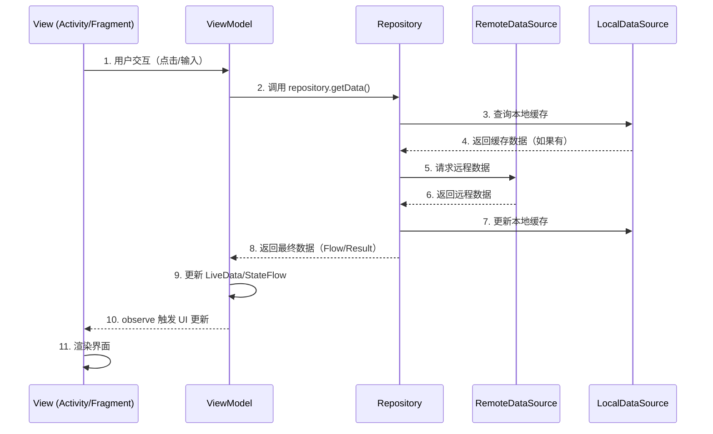
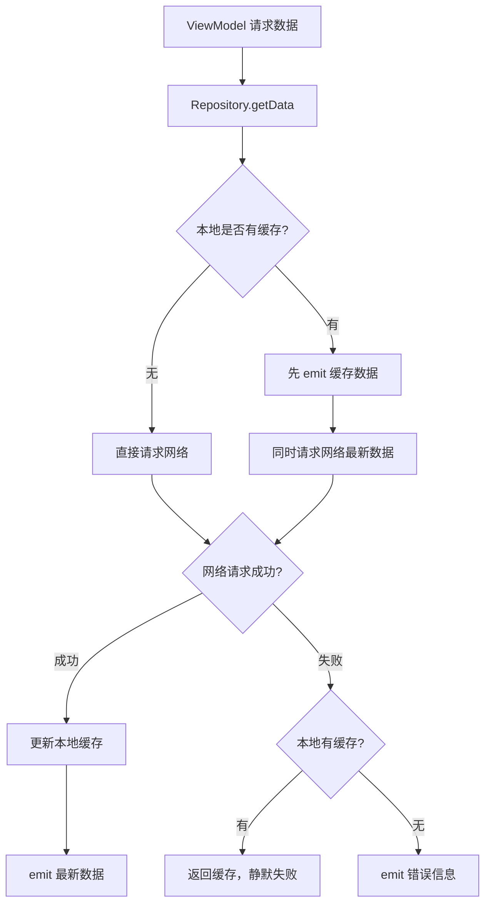

# MVVM 架构面试深度解析

> 本文档涵盖 MVVM 架构面试中的六个递进层次：面试问题、标准答案、核心原理、流程图、源码分析、应用场景。适用于 Android 中高级开发岗位的架构面试准备。

---

## 一、面试问题（≥6 个核心问题）

### Q1: MVVM 的核心分层是什么？各层的职责边界在哪？

**考点**：考察候选人对 MVVM 三层架构的理解深度，是否能清晰界定每层的职责。

**参考答案要点**：

| 层次 | 核心职责 | 持有内容 | 不应做的事 |
|------|---------|---------|-----------|
| **Model** | 数据获取与存储、业务逻辑处理 | Repository、DataSource、Database | 不应持有 UI 引用、不应持有 Context（除 ApplicationContext 外） |
| **View** | UI 渲染、用户交互事件传递 | Activity/Fragment、XML 布局、Adapter | **不应持有业务数据**、不应直接调用网络请求、不应包含业务判断逻辑 |
| **ViewModel** | 持有 UI 状态、处理 UI 逻辑、连接 Model | LiveData/StateFlow、临时 UI 状态 | 不应持有 View 引用、不应持有 Activity/Context（会导致内存泄漏） |

---

### Q2: View 和 ViewModel 的数据绑定方式有哪些？各自的优缺点？

**考点**：考察对 DataBinding、LiveData、Flow 三种主流绑定方式的实战理解。

| 绑定方式 | 原理 | 优点 | 缺点 |
|---------|------|------|------|
| **DataBinding** | XML 中直接绑定表达式，编译时生成 Binding 类 | 减少样板代码，支持双向绑定 `@={}` | XML 逻辑不易调试，编译慢 |
| **LiveData** | `viewModel.liveData.observe(viewLifecycleOwner) {}` | 生命周期感知，自动解绑防泄漏 | 粘性事件问题（新观察者收到旧数据） |
| **Kotlin Flow** | `lifecycleScope.launch { viewModel.stateFlow.collect {} }` 或 `repeatOnLifecycle` | 支持运算符链式处理，冷流/热流灵活切换 | 需要手动管理协程生命周期 |

---

### Q3: MVVM vs MVP vs MVC 的对比？

**考点**：考察架构演进的理解，为什么 Google 推荐 MVVM。

| 维度 | MVC | MVP | MVVM |
|------|-----|-----|------|
| **控制层** | Controller | Presenter | ViewModel |
| **View 感知** | Model 可感知 View | Presenter 持有 View 接口 | ViewModel **完全不感知** View |
| **数据流向** | View ↔ Controller ↔ Model | View ↔ Presenter ↔ Model | View → ViewModel → Model（单向依赖） |
| **单元测试** | 困难（View 耦合） | 中等（Mock View 接口） | **容易**（ViewModel 纯逻辑） |
| **Android 适配** | Activity 既是 View 又是 Controller，臃肿 | 需要定义大量 Contract 接口 | Jetpack 原生支持，配置变更存活 |

---

### Q4: ViewModel 如何与 Model 通信？Repository 模式的设计？

**考点**：考察分层解耦的实际设计能力。

```kotlin
// ============ Repository 作为唯一数据源 ============
class UserRepository(
    private val remoteDataSource: UserRemoteDataSource,  // Retrofit
    private val localDataSource: UserLocalDataSource     // Room
) {
    // 单一数据源策略：先返回缓存，再网络更新
    fun getUser(userId: String): Flow<Result<User>> = flow {
        // 1. 先发射本地缓存（如果有）
        localDataSource.getUser(userId)?.let { emit(Result.success(it)) }
        // 2. 从网络获取最新数据
        try {
            val remoteUser = remoteDataSource.fetchUser(userId)
            localDataSource.saveUser(remoteUser)  // 缓存到本地
            emit(Result.success(remoteUser))
        } catch (e: Exception) {
            if (localDataSource.getUser(userId) == null) {
                emit(Result.failure(e))  // 无缓存时才报错
            }
        }
    }
}

// ============ ViewModel 通过 Repository 获取数据 ============
class UserViewModel(
    private val userRepository: UserRepository
) : ViewModel() {
    private val _uiState = MutableStateFlow<UserUiState>(UserUiState.Loading)
    val uiState: StateFlow<UserUiState> = _uiState.asStateFlow()

    fun loadUser(userId: String) {
        viewModelScope.launch {
            userRepository.getUser(userId).collect { result ->
                _uiState.value = when {
                    result.isSuccess -> UserUiState.Success(result.getOrThrow())
                    result.isFailure -> UserUiState.Error(result.exceptionOrNull()!!.message)
                    else -> UserUiState.Loading
                }
            }
        }
    }
}
```

---

### Q5: MVVM 中 View 层应该有多"薄"？

**考点**：考察对 View 层边界的理解，避免 View 越权。

**核心原则**：View 层只做三件事：

1. **声明式绑定**：XML 或 `observe()` 中只做 UI 属性赋值
2. **事件传递**：点击、滑动等事件直接转发给 ViewModel，不做判断
3. **平台适配**：`Context` 操作（资源获取、跳转等）保留在 View

```kotlin
// ❌ 错误：View 层包含业务判断
button.setOnClickListener {
    if (viewModel.age > 18) {  // View 不应做业务判断
        startAdultActivity()
    }
}

// ✅ 正确：View 层只转发事件，ViewModel 判断好了再通知
button.setOnClickListener { viewModel.onSubmitClick() }
viewModel.navigateToAdult.observe(this) { startAdultActivity() }
```

---

### Q6: MVVM 的单元测试策略是什么？

**考点**：考察可测试性的架构设计。

```kotlin
// ViewModel 单元测试：不依赖 Android 框架
class LoginViewModelTest {
    private val mockRepo = mock<AuthRepository>()
    private val viewModel = LoginViewModel(mockRepo)

    @Test
    fun `login success should emit Success state`() = runTest {
        // Given
        whenever(mockRepo.login("user", "pass")).thenReturn(flowOf(Result.success(User())))
        // When
        viewModel.login("user", "pass")
        // Then
        assertEquals(UiState.Success, viewModel.uiState.first())
    }

    @Test
    fun `ViewModel survives screen rotation`() {
        // ViewModel 本身不依赖 Activity 实例，天然存活配置变更
    }
}

// Repository 单元测试：Mock DataSource
class UserRepositoryTest {
    @Test
    fun `should return cached data when network fails`() = runTest {
        val mockRemote = mock<RemoteDataSource> { on { fetchUser("1") } doThrow IOException() }
        val mockLocal = mock<LocalDataSource> { on { getUser("1") } doReturn User("cached") }
        val repo = UserRepository(mockRemote, mockLocal)
        val result = repo.getUser("1").first()
        assertTrue(result.isSuccess)
        assertEquals("cached", result.getOrThrow().name)
    }
}
```

---

### Q7: MVVM 在复杂页面（多状态/多数据源）中的实践？

**考点**：考察复杂业务场景下 MVVM 的驾驭能力。

**策略：使用 sealed class 管理多状态**

```kotlin
sealed class ComplexUiState {
    object Loading : ComplexUiState()
    data class Success(
        val userInfo: UserInfo,
        val orderList: List<Order>,
        val notificationCount: Int
    ) : ComplexUiState()
    data class Error(val message: String, val retry: () -> Unit) : ComplexUiState()
    object Empty : ComplexUiState()
}

class ComplexViewModel(
    private val userRepo: UserRepository,
    private val orderRepo: OrderRepository
) : ViewModel() {
    // 多数据源并行加载
    fun loadDashboard() {
        viewModelScope.launch {
            _uiState.value = ComplexUiState.Loading
            try {
                val userInfo = async { userRepo.getUser() }
                val orders = async { orderRepo.getOrders() }
                _uiState.value = ComplexUiState.Success(
                    userInfo = userInfo.await(),
                    orderList = orders.await(),
                    notificationCount = 5
                )
            } catch (e: Exception) {
                _uiState.value = ComplexUiState.Error(e.message!!) { loadDashboard() }
            }
        }
    }
}
```

---

## 二、标准答案（架构图 + 代码示例）

### 2.1 MVVM 整体架构图

```
┌──────────────────────────────────────────────────────────┐
│                        VIEW 层                           │
│  ┌─────────────┐   ┌─────────────┐   ┌───────────────┐  │
│  │ Activity    │   │ Fragment    │   │ XML + Data    │  │
│  │ (Lifecycle  │   │ (Lifecycle  │   │ Binding       │  │
│  │  Owner)     │   │  Owner)     │   │               │  │
│  └──────┬──────┘   └──────┬──────┘   └───────┬───────┘  │
│         │                 │                   │          │
│         └────────┬────────┴───────────────────┘          │
│                  │ observe / collect                     │
│                  ▼                                       │
├──────────────────────────────────────────────────────────┤
│                     VIEWMODEL 层                         │
│  ┌──────────────────────────────────────────────────┐   │
│  │  LiveData<T> / StateFlow<T>  ── UI 状态持有者     │   │
│  │  viewModelScope.launch {}    ── 异步任务管理      │   │
│  │  fun onEvent()               ── UI 事件入口       │   │
│  └──────────────────────┬───────────────────────────┘   │
│                         │ 调用                          │
├─────────────────────────┼──────────────────────────────┤
│                         ▼              MODEL 层          │
│  ┌──────────────────────────────────────────────────┐   │
│  │              Repository (单一数据源)               │   │
│  │  ┌──────────────┐   ┌──────────────┐             │   │
│  │  │ Remote       │   │ Local        │             │   │
│  │  │ DataSource   │   │ DataSource   │             │   │
│  │  │ (Retrofit)   │   │ (Room/SP)    │             │   │
│  │  └──────────────┘   └──────────────┘             │   │
│  └──────────────────────────────────────────────────┘   │
└──────────────────────────────────────────────────────────┘

依赖方向：View → ViewModel → Repository → DataSource
         （单向依赖，上层持有下层引用，下层不感知上层）
```

### 2.2 完整登录页面 MVVM 代码示例

```kotlin
// ==================== Model 层 ====================
data class LoginRequest(val username: String, val password: String)
data class LoginResponse(val token: String, val user: User)
data class User(val id: Long, val name: String)

interface AuthApi {
    @POST("api/login")
    suspend fun login(@Body request: LoginRequest): LoginResponse
}

class AuthRepository(private val api: AuthApi) {
    suspend fun login(username: String, password: String): Result<LoginResponse> {
        return try {
            val response = api.login(LoginRequest(username, password))
            Result.success(response)
        } catch (e: Exception) {
            Result.failure(e)
        }
    }
}

// ==================== ViewModel 层 ====================
sealed class LoginUiState {
    object Idle : LoginUiState()
    object Loading : LoginUiState()
    data class Success(val user: User) : LoginUiState()
    data class Error(val message: String) : LoginUiState()
}

class LoginViewModel(private val authRepository: AuthRepository) : ViewModel() {

    // 表单状态
    private val _username = MutableLiveData<String>()
    val username: LiveData<String> = _username

    private val _password = MutableLiveData<String>()
    val password: LiveData<String> = _password

    // UI 状态
    private val _loginState = MutableLiveData<LoginUiState>(LoginUiState.Idle)
    val loginState: LiveData<LoginUiState> = _loginState

    // 表单校验
    private val _isFormValid = MediatorLiveData<Boolean>().apply {
        addSource(_username) { value = validate() }
        addSource(_password) { value = validate() }
    }
    val isFormValid: LiveData<Boolean> = _isFormValid

    private fun validate(): Boolean {
        return !_username.value.isNullOrBlank() && !_password.value.isNullOrBlank()
    }

    fun onUsernameChanged(username: String) { _username.value = username }
    fun onPasswordChanged(password: String) { _password.value = password }

    fun login() {
        val u = _username.value ?: return
        val p = _password.value ?: return
        viewModelScope.launch {
            _loginState.value = LoginUiState.Loading
            authRepository.login(u, p)
                .onSuccess { _loginState.value = LoginUiState.Success(it.user) }
                .onFailure { _loginState.value = LoginUiState.Error(it.message ?: "登录失败") }
        }
    }
}

// ==================== View 层（Activity） ====================
class LoginActivity : AppCompatActivity() {
    private lateinit var binding: ActivityLoginBinding
    // 使用 Koin/Hilt 注入
    private val viewModel: LoginViewModel by viewModels()

    override fun onCreate(savedInstanceState: Bundle?) {
        super.onCreate(savedInstanceState)
        binding = DataBindingUtil.setContentView(this, R.layout.activity_login)
        binding.lifecycleOwner = this
        binding.viewModel = viewModel

        observeUiState()
    }

    private fun observeUiState() {
        viewModel.loginState.observe(viewLifecycleOwner) { state ->
            when (state) {
                is LoginUiState.Loading -> showLoading()
                is LoginUiState.Success  -> navigateToHome()
                is LoginUiState.Error    -> showError(state.message)
                is LoginUiState.Idle     -> { /* 初始状态 */ }
            }
        }
    }
}
```

```xml
<!-- activity_login.xml（DataBinding 布局） -->
<layout xmlns:android="http://schemas.android.com/apk/res/android">
    <data>
        <variable name="viewModel" type="com.example.LoginViewModel" />
    </data>
    <LinearLayout ...>
        <EditText
            android:text="@={viewModel.username}"
            android:hint="用户名" />
        <EditText
            android:text="@={viewModel.password}"
            android:hint="密码"
            android:inputType="textPassword" />
        <Button
            android:enabled="@{viewModel.isFormValid}"
            android:onClick="@{() -> viewModel.login()}"
            android:text="登录" />
    </LinearLayout>
</layout>
```

---

## 三、核心原理

### 3.1 数据驱动 UI：LiveData → observe → UI 更新

MVVM 的核心思想是 **"数据驱动 UI"**，而非"命令式更新 UI"。

**传统命令式（MVC/MVP）**：
```kotlin
// 命令式：ViewController 主动调用 UI 更新
fun onLoginSuccess(user: User) {
    textView.text = "欢迎 ${user.name}"
    progressBar.visibility = View.GONE
}
```

**MVVM 数据驱动**：
```kotlin
// 声明式：UI 观察数据变化，自动更新
viewModel.loginState.observe(this) { state ->
    when (state) {
        Loading -> { progressBar.show(); loginButton.hide() }
        Success(user) -> { progressBar.hide(); showWelcome(user) }
    }
}
```

**关键原理**：

1. **LiveData 生命周期感知**：`observe(LifecycleOwner)` 在 `STARTED`/`RESUMED` 状态时通知观察者，在 `DESTROYED` 时**自动移除观察者**，杜绝内存泄漏。
2. **数据持有方转移**：View 不再持有业务数据，数据统一由 ViewModel 持有。View 只是"数据的投影"。
3. **可观察性**：数据变更自动触发 UI 更新，无需手动调用刷新。

### 3.2 Repository 作为单一数据源（Single Source of Truth）

```
┌──────────┐      ┌──────────────┐      ┌──────────────┐
│ViewModel │─────▶│ Repository   │─────▶│ RemoteSource │
│          │      │              │      │ (Retrofit)   │
│  只从    │      │ 决定数据策略  │      └──────────────┘
│Repository│      │              │      ┌──────────────┐
│ 获取数据  │      │ 缓存策略     │─────▶│ LocalSource  │
└──────────┘      │ 兜底策略     │      │ (Room/SP)    │
                  └──────────────┘      └──────────────┘
```

**核心原则**：ViewModel **永远只从 Repository 获取数据**，Repository 内部决定数据来自网络还是本地缓存。ViewModel 不关心数据来源。

**Google 官方推荐架构**中，Repository 是唯一真实数据源，ViewModel 通过 Repository 获取数据，Repository 协调不同 DataSource。

### 3.3 DataBinding 的双向绑定（`@={}`）

```xml
<!-- 单向绑定：ViewModel → View -->
<TextView android:text="@{viewModel.username}" />

<!-- 双向绑定：View ↔ ViewModel -->
<EditText android:text="@={viewModel.username}" />
```

**原理**：
- `@={}` 生成 `InverseBindingListener`，当用户输入文本时，自动回写 ViewModel 的 LiveData/ObservableField
- 编译时通过注解处理器生成 `BindingAdapter` 和 `InverseBindingAdapter`
- 避免死循环：如果新值等于旧值，不触发再次更新

### 3.4 View 层不持有数据，只做展示

这是 MVVM 区别于 MVP 的核心特征：

```kotlin
// ❌ MVP 中 View 可能持有数据
class LoginFragment : LoginView {
    private var user: User? = null  // View 持有数据
    override fun showUser(user: User) { this.user = user; updateUI() }
}

// ✅ MVVM 中 View 只关注"如何展示"
class LoginFragment {
    viewModel.user.observe(this) { user ->
        // View 没有 user 成员变量，拿到数据直接渲染
        binding.nameText.text = user.name
    }
}
```

**Memory 角度**：View（Activity/Fragment）可能因配置变更被销毁重建，如果持有数据，数据就丢失了。ViewModel 不受配置变更影响，是数据的最佳持有者。

---

## 四、流程图（HTML + Mermaid）

### 4.1 MVVM 完整数据流



### 4.2 MVVM 三层依赖关系

```mermaid
graph TD
    subgraph VIEW["View 层（UI）"]
        ACT[Activity]
        FRG[Fragment]
        XML[XML + DataBinding]
    end

    subgraph VIEWMODEL["ViewModel 层（状态管理）"]
        VM[ViewModel]
        LD[LiveData / StateFlow]
    end

    subgraph MODEL["Model 层（数据）"]
        REPO[Repository]
        REMOTE[RemoteDataSource - Retrofit]
        LOCAL[LocalDataSource - Room / SharedPreferences]
    end

    ACT -->|observe| VM
    FRG -->|observe| VM
    XML -->|@{} 单向绑定| VM
    XML -->|@={} 双向绑定| VM

    VM -->|依赖| REPO
    REPO -->|协调| REMOTE
    REPO -->|协调| LOCAL

    style VIEW fill:#e1f5fe
    style VIEWMODEL fill:#fff3e0
    style MODEL fill:#e8f5e9
```

### 4.3 Repository 缓存策略流程图



---

## 五、源码分析

### 5.1 DataBinding 的 `@BindingAdapter` 原理

`@BindingAdapter` 是 DataBinding 库提供的扩展机制，允许开发者为 XML 属性绑定自定义逻辑。

**源码级原理**：

```kotlin
// 1. 定义 BindingAdapter
@BindingAdapter("imageUrl", "placeholder")
fun loadImage(view: ImageView, url: String?, placeholder: Drawable?) {
    Glide.with(view.context)
        .load(url)
        .placeholder(placeholder)
        .into(view)
}
```

```xml
<!-- 2. XML 中使用 -->
<ImageView
    app:imageUrl="@{viewModel.avatarUrl}"
    app:placeholder="@{@drawable/ic_avatar_placeholder}" />
```

**编译时发生了什么**：

1. DataBinding 的**注解处理器（APT）**在编译期扫描所有 `@BindingAdapter` 方法
2. 为每个 Adapter 生成对应的 `BindingAdapterMapper`，记录属性名到方法引用的映射
3. 当 XML 中绑定表达式变化时，生成的 `BindingImpl` 类调用映射的方法：

```java
// 自动生成的代码（简化）
public class ActivityLoginBindingImpl extends ActivityLoginBinding {
    @Override
    protected void executeBindings() {
        // 当 viewModel.avatarUrl 变化时自动调用
        ImageViewBindingAdapter.loadImage(
            this.imageView,
            mViewModelAvatarUrl,   // 表达式计算后的值
            mPlaceholderDrawable   // 静态资源
        );
    }
}
```

4. 运行时**无需反射**，直接调用编译期确定的方法，性能损耗极小。

### 5.2 ViewModel + LiveData 的 observe 绑定原理

```kotlin
viewModel.loginState.observe(viewLifecycleOwner) { state ->
    // 当 loginState 变化且 Lifecycle 处于活跃状态时回调
}
```

**源码追踪**（关键路径）：

```java
// LiveData.java (androidx.lifecycle)
@MainThread
public void observe(@NonNull LifecycleOwner owner, @NonNull Observer<? super T> observer) {
    // 1. 包装 Observer，绑定 Lifecycle
    LifecycleBoundObserver wrapper = new LifecycleBoundObserver(owner, observer);
    // 2. 存入观察者 Map（避免重复注册）
    ObserverWrapper existing = mObservers.putIfAbsent(observer, wrapper);
    if (existing != null && !existing.isAttachedTo(owner)) {
        throw new IllegalArgumentException("Cannot add the same observer...");
    }
    // 3. 将 wrapper 添加到 Lifecycle 的观察者列表
    owner.getLifecycle().addObserver(wrapper);
}

// LifecycleBoundObserver 内部
class LifecycleBoundObserver extends ObserverWrapper implements LifecycleEventObserver {
    @Override
    public void onStateChanged(@NonNull LifecycleOwner source, @NonNull Lifecycle.Event event) {
        Lifecycle.State currentState = mOwner.getLifecycle().getCurrentState();
        if (currentState == DESTROYED) {
            // 4. Lifecycle DESTROYED 时自动移除观察者——防止内存泄漏
            removeObserver(mObserver);
            return;
        }
        // 5. 非 DESTROYED 时，根据 Lifecycle 状态决定是否通知
        activeStateChanged(shouldBeActive());
    }

    @Override
    boolean shouldBeActive() {
        // STARTED 或 RESUMED 才算活跃
        return mOwner.getLifecycle().getCurrentState().isAtLeast(STARTED);
    }
}

// 6. setValue 时遍历所有活跃观察者
@MainThread
protected void setValue(T value) {
    mVersion++;
    mData = value;
    dispatchingValue(null);  // 通知所有活跃观察者
}
```

**关键设计点**：

- **自动解绑**：Lifecycle DESTROYED 时 `removeObserver()`，完全无内存泄漏风险
- **粘性事件**：新观察者注册后，如果 LiveData 已有值，会**立刻收到最新值**（这是特性也是坑）
- **主线程安全**：`setValue` 必须主线程调用，`postValue` 可子线程调用（内部通过 Handler 切换到主线程）

---

## 六、应用场景

### 6.1 完整登录页面 MVVM 实现

见 [第二节 2.2](#22-完整登录页面-mvvm-代码示例)，完整代码已包含：
- `LoginRequest` / `LoginResponse` / `User` 数据模型
- `AuthApi` Retrofit 接口
- `AuthRepository` 业务层
- `LoginViewModel` 状态管理（表单校验 + 登录状态）
- `LoginActivity` 纯 View 层（observe + 事件转发）
- `activity_login.xml` DataBinding 布局（双向绑定）

**核心要点回顾**：

1. **View 不判断**：按钮点击直接 `viewModel.login()`，不做校验
2. **ViewModel 不持有 Context**：通过 Repository 获取数据，不直接发起网络请求
3. **状态驱动 UI**：`LoginUiState` sealed class 穷举所有 UI 状态
4. **表单双向绑定**：`@={}` 实现输入框与 ViewModel 的同步

### 6.2 MVVM + Room + Retrofit 的 Repository 设计

```kotlin
// ==================== DataSource 层 ====================

// Room DAO
@Dao
interface ArticleDao {
    @Query("SELECT * FROM articles ORDER BY publishTime DESC")
    fun getAllArticles(): Flow<List<ArticleEntity>>

    @Insert(onConflict = OnConflictStrategy.REPLACE)
    suspend fun insertAll(articles: List<ArticleEntity>)
}

// Retrofit API
interface ArticleApi {
    @GET("api/articles")
    suspend fun getArticles(): List<ArticleDto>
}

// ==================== Repository（单一数据源核心） ====================

class ArticleRepository(
    private val api: ArticleApi,
    private val dao: ArticleDao
) {
    /**
     * 策略：Room 作为 SSOT（Single Source of Truth）
     * 1. 始终从 Room 返回数据（Flow 监听数据库变化）
     * 2. 后台从网络拉取，写入 Room，Flow 自动发射新数据
     */
    fun getArticles(): Flow<List<Article>> {
        return dao.getAllArticles()
            .map { entities -> entities.map { it.toDomain() } }
            .onStart {
                // 初次订阅时触发网络刷新
                refreshArticles()
            }
    }

    suspend fun refreshArticles() {
        try {
            val remoteArticles = api.getArticles()
            dao.insertAll(remoteArticles.map { it.toEntity() })
            // 注意：无需手动通知，Room Flow 自动发射
        } catch (e: Exception) {
            // 静默失败：UI 层仍展示缓存数据
            Log.w("ArticleRepo", "刷新失败，使用缓存", e)
        }
    }
}

// ==================== ViewModel ====================

class ArticleListViewModel(
    private val repository: ArticleRepository
) : ViewModel() {
    private val _uiState = MutableStateFlow<ArticleUiState>(ArticleUiState.Loading)
    val uiState: StateFlow<ArticleUiState> = _uiState.asStateFlow()

    init {
        loadArticles()
    }

    private fun loadArticles() {
        viewModelScope.launch {
            repository.getArticles().collect { articles ->
                _uiState.value = when {
                    articles.isEmpty() -> ArticleUiState.Empty
                    else -> ArticleUiState.Success(articles)
                }
            }
        }
    }

    fun refresh() {
        viewModelScope.launch {
            _uiState.value = ArticleUiState.Refreshing
            repository.refreshArticles()
            // Flow 自动推送更新，无需手动处理
        }
    }
}

// ==================== View（Fragment） ====================

class ArticleListFragment : Fragment() {
    private val viewModel: ArticleListViewModel by viewModels()

    override fun onViewCreated(view: View, savedInstanceState: Bundle?) {
        lifecycleScope.launch {
            viewLifecycleOwner.repeatOnLifecycle(Lifecycle.State.STARTED) {
                viewModel.uiState.collect { state ->
                    when (state) {
                        is ArticleUiState.Loading -> showLoading()
                        is ArticleUiState.Success -> adapter.submitList(state.articles)
                        is ArticleUiState.Empty -> showEmpty()
                        is ArticleUiState.Refreshing -> swipeRefresh.isRefreshing = true
                    }
                }
            }
        }
        swipeRefresh.setOnRefreshListener { viewModel.refresh() }
    }
}
```

**设计亮点**：

| 设计决策 | 理由 |
|---------|------|
| **Room 作为 SSOT** | 数据库是唯一真实数据源，网络数据写入 Room 后 Flow 自动更新 UI |
| **Flow 而非 LiveData** | Room 原生支持 Flow，支持 `map`/`onStart` 等操作符 |
| **静默失败** | 网络失败时不影响 UI，用户仍可看缓存 |
| **`repeatOnLifecycle`** | 避免 `Flow` 在后台继续收集造成资源浪费 |
| **ViewModel 不感知网络/数据库** | 全部委托 Repository，ViewModel 仅管理 UI 状态 |

---

## 总结：MVVM 面试核心要点

| 维度 | 一句话总结 |
|------|-----------|
| **核心思想** | 数据驱动 UI，View 是状态的投影 |
| **依赖方向** | View → ViewModel → Repository → DataSource（单向） |
| **View 边界** | 只做 UI 渲染 + 事件转发，不持有数据、不做业务判断 |
| **ViewModel 边界** | 持有 UI 状态，不持有 View/Context 引用 |
| **Repository** | 单一数据源，协调远程与本地数据，屏蔽数据来源 |
| **绑定方式** | LiveData（生命周期感知自动解绑）、DataBinding（编译期绑定）、Flow（协程原生支持） |
| **可测试性** | ViewModel 可纯 JVM 测试（Mock Repository），Repository 可 Mock DataSource |
| **配置变更** | ViewModel 存活于 Activity 重建之上，数据不丢失 |

---

*本文档涵盖 MVVM 架构面试的核心六层内容：面试问题、标准答案、核心原理、流程图、源码分析、应用场景。建议结合 Android 官方架构指南和 Jetpack 源码深入理解。*
