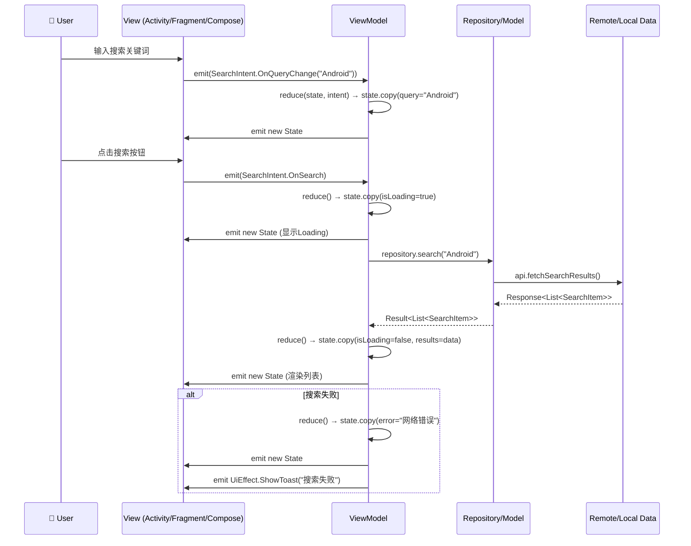
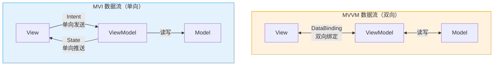
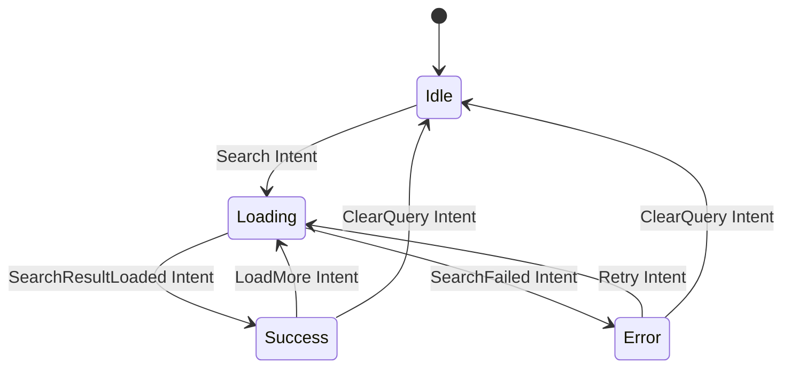

# MVI 架构 —— 面试学习完整指南

> **六层递进体系**：面试问题 → 标准答案 → 核心原理 → 流程图 → 源码分析 → 实战场景
> 适用岗位：高级/资深 Android 工程师、架构师

---

## 目录

1. [常见面试问题（8 题）](#1-常见面试问题)
2. [标准答案与要点解析](#2-标准答案与要点解析)
3. [核心原理深度讲解](#3-核心原理深度讲解)
4. [原理流程图](#4-原理流程图)
5. [核心源码分析](#5-核心源码分析)
6. [应用场景举例](#6-应用场景举例)

---

## 1. 常见面试问题

### Q1: 什么是 MVI 架构？请解释 Intent、State、Effect 三个核心概念以及单向数据流（UDF）的完整流程
### Q2: MVI 与 MVVM 的核心区别是什么？分别在什么场景下更有优势？
### Q3: MVI 中如何处理副作用（Side Effect）？Effect 与 Event 的区别以及各自的处理方式？
### Q4: MVI 中的状态不可变性（Immutable State）是什么意思？State Reducer 的设计原则和纯函数要求？
### Q5: 如何在 MVI 中处理多个异步操作的并发 State 更新问题？如何保证 State 的一致性？
### Q6: MVI 架构在调试方面有哪些独特优势？（状态可追溯、时间旅行调试、状态快照回放）
### Q7: MVI 中的 Intent 设计有哪些最佳实践？如何组织 Intent 类的层次结构？
### Q8: MVI 与 Jetpack Compose 的关系？Compose 天然适合 MVI 的原因是什么？

---

## 2. 标准答案与要点解析

### Q1: MVI 三大核心概念与单向数据流

**核心答案**：MVI（Model-View-Intent）是受前端框架 Cycle.js 和 Redux 启发诞生的响应式架构模式，核心理念是**将应用的状态管理建模为一个有限状态机**。

#### 三大核心概念

| 概念 | 定义 | Kotlin 中的典型实现 |
|------|------|---------------------|
| **Intent** | 用户操作意图的抽象，描述"用户想做什么"，不是 Android 的 Intent 类 | `sealed class UiIntent` — 如 `LoadData`、`OnSearch(query)`、`OnItemClick(id)` |
| **State** | 页面在某时刻的完整快照，UI 渲染的唯一数据源（Single Source of Truth） | `data class UiState` — 如 `UiState(isLoading, data, error)` |
| **Effect** | 需要执行一次就消费的副作用（Toast、导航跳转、弹窗关闭），不应被持久化或重复消费 | `sealed class UiEffect` — 如 `ShowToast(msg)`、`NavigateTo(route)` |

#### 单向数据流（UDF）完整链路

```
用户操作 → Intent → ViewModel → Model/Repository → 新State → View 渲染
```

**详细步骤**：
1. **User 产生操作**：用户在屏幕上点击按钮、输入文字、下拉刷新等
2. **View 发射 Intent**：View 不直接修改数据，而是将用户操作封装为 Intent 对象发送给 ViewModel
3. **ViewModel 处理 Intent**：ViewModel 接收到 Intent 后，调用业务逻辑（Repository/UseCase），将结果通过 **State Reducer** 转换为新的 State
4. **State 推送 View**：ViewModel 将新的 State 通过 `StateFlow`（或 `LiveData`）推送给 View
5. **View 渲染 State**：View 观察到 State 变化后，根据新 State 重新渲染 UI

**面试加分点**：
- MVI 保证**数据流向单一且可预测**，任何 State 变化都可以追溯到某个 Intent
- 与 Redux 的相似性：`Intent ≈ Action`、`State ≈ Store`、`Reducer ≈ (State, Action) -> State`
- 强调 **View 是被动的**，只是 State 的渲染函数：`UI = f(State)`

---

### Q2: MVI vs MVVM 核心区别与适用场景

**核心答案**：MVVM 侧重"数据绑定 + 双向通信"，MVI 侧重"单向数据流 + 状态不可变"。

#### 架构对比表

| 维度 | MVVM | MVI |
|------|------|-----|
| **数据流方向** | 双向（View ↔ ViewModel，通过 DataBinding / LiveData） | 严格单向（View → Intent → ViewModel → State → View） |
| **状态管理** | 多个独立的 LiveData / ObservableField，状态分散 | 单一不可变 State 对象，集中管理 |
| **状态可变性** | 可变（`_liveData.value = xxx` 直接修改） | 不可变（`state.copy(...)` 生成新对象） |
| **副作用处理** | 无明确机制，通常写在 View 层或混杂在 ViewModel | 显式的 Effect/Event 通道，通过 Channel 实现 |
| **调试难度** | 中等 — 多个 LiveData 交叉更新时难以跟踪 | 低 — 单一 State 对象，状态变化可记录、可回放 |
| **模板代码量** | 较少 | 较多（需定义 Intent、State、Effect 三个密封类） |
| **学习曲线** | 平缓 | 较陡峭 |

#### 场景选择建议

| 场景 | 推荐架构 | 原因 |
|------|----------|------|
| 简单 CRUD 页面（设置页、关于页） | MVVM | 状态简单，MVI 模板代码不划算 |
| 复杂表单（多步骤注册、航班查询） | **MVI** | 单一 State 可避免字段间不一致 |
| 实时数据流（股票行情、聊天室） | **MVI** | 状态快照可回溯、便于调试 |
| 多用户协作页面 | **MVI** | State Reducer 可序列化，支持服务端同步 |
| 搜索结果页、列表筛选 | **MVI** | Intent → 防抖 → API → State 链路清晰 |
| 已有 Jetpack Compose 项目 | **MVI** | Compose 声明式 UI 天然匹配 MVI 思想 |

**面试加分点**：
- MVVM 中 ViewModel 向 View 暴露多个 LiveData，容易导致"状态不一致"（例如 `isLoading` 和 `error` 不同步）
- MVI 把所有 UI 状态封装在一个 data class 中，通过 `copy()` 原子更新，杜绝了不一致
- 但 MVI 的小缺点：即使只改一个布尔值，也要 `copy()` 整个 State 对象

---

### Q3: 副作用处理 — Effect vs Event

**核心答案**：在 MVI 中，"副作用"是指不需要持久化的、消费一次即失效的 UI 事件。通过 `Channel`（而非 `StateFlow`）分发 Effect，确保事件不会被重复消费。

#### Effect vs Event vs State 的区别

| 类型 | 特性 | 典型例子 | 实现方式 |
|------|------|----------|----------|
| **State** | 持久化、可观察、有当前值 | `isLoading`、`dataList`、`errorMessage` | `StateFlow` / `MutableStateFlow` |
| **Effect** | 一次性、消费即销毁、不可重复 | `ShowToast`、`NavigateTo`、`FinishActivity` | `Channel`（`BUFFERED` 或 `CONFLATED`） |
| **Event** | 一次性但可能被缓存（如 LiveData 粘性事件）| 同上，但有粘性风险 | `SingleLiveEvent` / `EventWrapper` |

#### Effect 的 Channel 实现

```kotlin
// ViewModel 中
class MyViewModel : ViewModel() {
    // StateFlow 用于持久状态 — 有初始值、可重放
    private val _state = MutableStateFlow(UiState())
    val state: StateFlow<UiState> = _state.asStateFlow()

    // Channel 用于一次性副作用 — 无初始值、消费即消失
    private val _effect = Channel<UiEffect>(Channel.BUFFERED)
    val effect: Flow<UiEffect> = _effect.receiveAsFlow()

    fun onIntent(intent: UiIntent) {
        when (intent) {
            is UiIntent.OnSubmit -> {
                // 更新状态
                _state.update { it.copy(isLoading = true) }
                viewModelScope.launch {
                    try {
                        val result = repository.submit(intent.data)
                        _state.update { it.copy(isLoading = false, success = result) }
                        // 发送一次性副作用
                        _effect.send(UiEffect.ShowToast("提交成功"))
                        _effect.send(UiEffect.NavigateBack)
                    } catch (e: Exception) {
                        _state.update { it.copy(isLoading = false, error = e.message) }
                        _effect.send(UiEffect.ShowToast("提交失败"))
                    }
                }
            }
        }
    }
}
```

**面试加分点**：
- 为什么用 `Channel` 而不是 `SharedFlow`？— `SharedFlow` 在没有订阅者时会缓存事件（replay），配置变更时可能重复消费
- `Channel.BUFFERED` vs `Channel.CONFLATED`：前者保留所有事件，后者只保留最新事件（适合导航场景，避免多次跳转）
- Effect 的消费通常用 `LaunchedEffect` 或 `lifecycleScope` 在 UI 层收集

---

### Q4: 状态不可变性与 State Reducer

**核心答案**：MVI 中的 State 必须是不可变的（Immutable），任何状态变更都通过 `data class + copy()` 生成全新对象。State Reducer 是纯函数 `(State, Intent) → State`，负责所有状态转换逻辑。

#### 不可变 State 的设计

```kotlin
data class SearchUiState(
    val query: String = "",
    val results: List<SearchItem> = emptyList(),
    val isLoading: Boolean = false,
    val error: String? = null,
    val hasMore: Boolean = true,
    val page: Int = 0
) {
    // 可选：便捷判断方法
    val isEmpty: Boolean get() = results.isEmpty() && !isLoading
    val showError: Boolean get() = error != null && !isLoading
}
```

#### State Reducer 纯函数设计

```kotlin
// Reducer: 纯函数，给定相同的输入永远返回相同的输出
fun reduce(state: SearchUiState, result: SearchResult): SearchUiState {
    return state.copy(
        results = state.results + result.items,
        page = state.page + 1,
        hasMore = result.hasMore,
        isLoading = false,
        error = null
    )
}

// ✅ 纯函数特征：
// 1. 不修改输入参数
// 2. 不产生副作用（无网络请求、无数据库写入、无日志）
// 3. 相同输入 → 相同输出（可测试、可预测、可序列化）
```

**面试加分点**：
- `copy()` 底层是浅拷贝 — 但如果 data class 持有集合类型，内部元素引用不变。这不是问题，因为 MVI 中 State 是每帧全新对象
- 可以结合 `kotlinx.collections.immutable` 库使用 `PersistentList` 实现真正的不可变集合
- Reducer 可以拆分为多个子 Reducer 然后合并（类似 Redux 的 `combineReducers`）

---

### Q5: 并发异步操作的 State 更新

**核心答案**：多个异步操作并发更新 State 时，必须保证 State 的原子性和一致性。使用 `MutableStateFlow.update{}` 的原子操作或 `Mutex` 锁。

#### 问题场景

```kotlin
// ❌ 竞态条件（Race Condition）
viewModelScope.launch {
    val user = fetchUser()        // 异步操作1
    _state.value = _state.value.copy(user = user)   // 基于当前 state
}
viewModelScope.launch {
    val config = fetchConfig()    // 异步操作2（可能同时完成）
    _state.value = _state.value.copy(config = config) // 丢失 user 更新！
}
```

#### 解决方案

**方案一：`update{}` 原子操作（推荐）**

```kotlin
viewModelScope.launch {
    val user = fetchUser()
    _state.update { currentState -> currentState.copy(user = user) }
}
viewModelScope.launch {
    val config = fetchConfig()
    _state.update { currentState -> currentState.copy(config = config) }
}
// ✅ update{} 是原子的，内部使用 synchronized 和 CAS 循环
```

**方案二：Mutex 串行化**

```kotlin
private val mutex = Mutex()

suspend fun updateState(transform: (UiState) -> UiState) {
    mutex.withLock {
        _state.value = transform(_state.value)
    }
}
```

**方案三：合并 Intent 处理（最优）**

```kotlin
// 所有异步结果通过统一的 Intent 通道，在 onIntent 中串行处理
fun onIntent(intent: UiIntent) {
    when (intent) {
        is UiIntent.UserLoaded -> _state.update { it.copy(user = intent.user) }
        is UiIntent.ConfigLoaded -> _state.update { it.copy(config = intent.config) }
        // 单一入口，天然串行，无需额外同步
    }
}
```

**面试加分点**：
- `MutableStateFlow.update{}` 底层是 `while(true)` CAS 循环，保证原子性
- 避免在协程中直接 `_state.value = _state.value.copy(...)` — 这是经典的 read-modify-write 竞态
- MVI 的单一 State 模型比 MVVM 的多个 LiveData 更容易保证一致性

---

### Q6: MVI 的调试优势 — 状态可追溯与时间旅行

**核心答案**：因为 MVI 中 State 是不可变的且通过 Reducer 生成，可以记录每一次状态变更历史，实现"时间旅行调试"。

#### 状态快照记录

```kotlin
class DebugViewModel : ViewModel() {
    private val _state = MutableStateFlow(UiState())
    val state: StateFlow<UiState> = _state.asStateFlow()

    // 调试用状态历史
    private val stateHistory = mutableListOf<Pair<UiIntent, UiState>>()

    fun onIntent(intent: UiIntent) {
        val oldState = _state.value
        val newState = reduce(oldState, intent)
        _state.value = newState
        stateHistory.add(intent to newState)
        Log.d("MVI_DEBUG", "Intent: $intent\nOld: $oldState\nNew: $newState")
    }

    fun replayStates(): List<Pair<UiIntent, UiState>> = stateHistory.toList()
    fun restoreState(index: Int) {
        if (index in stateHistory.indices) {
            _state.value = stateHistory[index].second
        }
    }
}
```

#### 调试优势总结

| 能力 | MVVM | MVI |
|------|------|-----|
| 当前状态可视化 | 需逐个查看 LiveData | 打印一个 State 对象即可 |
| 状态变更追溯 | 困难 — 多处直接修改 LiveData | 简单 — Reducer 是唯一状态入口 |
| 时间旅行 | 几乎不可能 | 记录 State 历史即可回放 |
| 状态序列化 | 需额外工作 | State data class 天然可序列化 |
| Crash 现场恢复 | 需要日志埋点 | 保存最后一个 State 快照即可 |
| 单元测试 | 需 Mock 多个 LiveData | 纯函数 Reducer 测试极简单 |

**面试加分点**：
- 在生产环境中可以结合 Bugly/Crashlytics，在崩溃时将 `stateHistory.last()` 序列化上报
- Compose 的 `Snapshot` 系统与 MVI 的不可变 State 理念高度吻合
- 类似 Redux DevTools 的调试体验在 Android 中可以借助 MVI 实现

---

### Q7: Intent 类层次结构设计

**核心答案**：使用 Kotlin `sealed class` 或 `sealed interface` 设计 Intent 层次结构，确保类型安全和穷尽性检查。

```kotlin
// 顶级 Intent 密封接口
sealed interface SearchIntent {
    // 用户输入类
    data class OnQueryChange(val query: String) : SearchIntent
    data object OnClearQuery : SearchIntent

    // 用户操作类
    data object OnSearch : SearchIntent
    data object OnLoadMore : SearchIntent
    data class OnItemClick(val itemId: String) : SearchIntent

    // 系统事件类（可选，也可作为内部 Intent）
    data class SearchResultLoaded(val items: List<SearchItem>) : SearchIntent
    data class SearchFailed(val error: String) : SearchIntent
}
```

**设计原则**：
- Intent 应该是"动词"或"过去式"描述用户意图或事件结果
- 区分"用户 Intent"（由 View 发起）和"结果 Intent"（由 ViewModel 内部产生）
- 使用 `data object` 替代无参数的 `class`，减少内存分配

---

### Q8: MVI 与 Jetpack Compose 的关系

**核心答案**：Compose 是声明式 UI 框架，MVI 是声明式状态管理架构，二者天然互补。

| Compose 特性 | MVI 对应概念 |
|-------------|-------------|
| `remember { mutableStateOf() }` — 本地状态 | 页面级 `UiState` |
| `LaunchedEffect(key)` — 副作用处理 | `Channel<UiEffect>` |
| 单向数据流（State hoisting） | Intent → State → UI |
| `derivedStateOf` — 派生状态 | State 中的计算属性 |
| Snapshot 系统 | 不可变 State 的快照语义 |

---

## 3. 核心原理深度讲解

### 3.1 单向数据流（Unidirectional Data Flow）

MVI 的单向数据流是其区别于 MVVM 最根本的特征。在 MVVM 中，数据可以在 View 和 ViewModel 之间双向流动（通过 DataBinding），而 MVI 强制数据只沿一个方向循环：

```
┌─────────────────────────────────────────────────────────┐
│                    单向数据流循环                          │
│                                                         │
│   User ──(操作)──▶ View ──(Intent)──▶ ViewModel          │
│     ▲                                  │                │
│     │                                  ▼                │
│     │                            Model/Repository        │
│     │                                  │                │
│     │                                  ▼                │
│     └─────────── View ──(State)─── ViewModel ◀──────────┘
│               (重新渲染)             (Reducer)            │
└─────────────────────────────────────────────────────────┘
```

**为什么单向？**
1. **可预测性**：State 变更只有一个入口（Reducer），容易推理
2. **可测试性**：State 和 Reducer 都是纯函数，单元测试极其简单
3. **可追溯性**：记录 Intent 序列 = 记录所有状态变更原因

### 3.2 State Reducer 纯函数原理

Reducer 是 MVI 的心脏，它定义了"状态如何从一个意图转换到下一个状态"。

```kotlin
// 纯函数的三大法则：
// 1. 确定性（Deterministic）：相同输入必定相同输出
// 2. 无副作用（No Side Effects）：不修改外部变量、不调网络、不写磁盘
// 3. 引用透明（Referential Transparency）：函数调用可用其返回值替换

// ✅ 纯的 Reducer
fun reduce(state: UiState, intent: SearchIntent): UiState = when (intent) {
    is SearchIntent.OnQueryChange -> state.copy(query = intent.query)
    is SearchIntent.OnSearch -> state.copy(isLoading = true, error = null)
    is SearchIntent.SearchResultLoaded -> state.copy(
        isLoading = false,
        results = intent.items,
        error = null
    )
    is SearchIntent.SearchFailed -> state.copy(
        isLoading = false,
        error = intent.error
    )
    else -> state
}

// ❌ 不纯的 Reducer（不能这么做！）
fun reduceBad(state: UiState, intent: Intent): UiState {
    // 调用了网络请求 — 副作用！
    val data = api.fetchData()
    // 记录了日志 — 副作用！
    log.info("state changed")
    return state.copy(data = data)
}
```

### 3.3 Effect（副作用）处理机制

副作用是 MVI 中最容易出错的部分。核心原则：**State 用于持久 UI 状态，Effect 用于一次性 UI 事件**。

```kotlin
// Effect 的三种实现方案对比

// 方案1: Channel（推荐 — 确保一次性消费）
private val _effect = Channel<UiEffect>(Channel.BUFFERED)
val effect: Flow<UiEffect> = _effect.receiveAsFlow()

// 方案2: SharedFlow（需设置 replay=0，但配置变更后可能丢事件）
private val _effect = MutableSharedFlow<UiEffect>(replay = 0, extraBufferCapacity = 1)

// 方案3: SingleLiveEvent（不推荐 — 不是 Flow，与协程体系割裂）
private val _effect = SingleLiveEvent<UiEffect>()
```

**Effect 在 View 层的消费**：

```kotlin
// Compose 中
@Composable
fun SearchScreen(viewModel: SearchViewModel) {
    val state by viewModel.state.collectAsStateWithLifecycle()

    LaunchedEffect(Unit) {
        viewModel.effect.collect { effect ->
            when (effect) {
                is UiEffect.ShowToast -> { /* Toast.show() */ }
                is UiEffect.NavigateTo -> { navController.navigate(effect.route) }
                is UiEffect.FinishScreen -> { activity.finish() }
            }
        }
    }
}

// View 系统中
lifecycleScope.launch {
    lifecycle.repeatOnLifecycle(Lifecycle.State.STARTED) {
        viewModel.effect.collect { effect -> handleEffect(effect) }
    }
}
```

### 3.4 不可变 State 与 `copy()` 原理

```kotlin
// Kotlin data class 的 copy() 是浅拷贝
data class UiState(
    val name: String = "",
    val items: List<String> = emptyList(),  // 引用类型 — 浅拷贝共享底层引用
    val user: User? = null                   // 引用类型
)

val state1 = UiState(name = "A", items = listOf("1", "2"))
val state2 = state1.copy(name = "B")  // name 变了，items 引用不变

// state1.items === state2.items  → true（同一引用）
// 但在 MVI 中这不是问题，因为：
// 1. State 被视为"快照"，上一个 State 不再被引用
// 2. data class 的 equals() 比较的是值而不是引用
// 3. Compose 的 Snapshot 系统也基于值相等判断是否需要重组
```

---

## 4. 原理流程图

### 4.1 MVI 单向数据流完整时序图



### 4.2 MVVM vs MVI 数据流对比图



### 4.3 MVI 状态机视图



---

## 5. 核心源码分析

### 5.1 基于 StateFlow 的 MVI 完整实现

```kotlin
// ==================== 1. 定义三方契约 ====================

// Intent — 用户意图
sealed interface MviIntent {
    data class OnQueryChanged(val query: String) : MviIntent
    data object OnSearch : MviIntent
    data object OnLoadMore : MviIntent
    data class OnItemClicked(val itemId: String) : MviIntent
    data object OnRetry : MviIntent
}

// State — 页面状态
data class MviState(
    val query: String = "",
    val items: List<Item> = emptyList(),
    val isLoading: Boolean = false,
    val isLoadMore: Boolean = false,
    val error: String? = null,
    val page: Int = 0,
    val hasMore: Boolean = true
)

// Effect — 副作用
sealed interface MviEffect {
    data class ShowToast(val message: String) : MviEffect
    data class NavigateToDetail(val itemId: String) : MviEffect
    data object NavigateBack : MviEffect
}

// ==================== 2. ViewModel 核心实现 ====================

class SearchViewModel(
    private val repository: SearchRepository
) : ViewModel() {

    // State: 使用 MutableStateFlow 存储可变状态
    private val _state = MutableStateFlow(MviState())
    val state: StateFlow<MviState> = _state.asStateFlow()

    // Effect: 使用 Channel 保证一次性消费
    private val _effect = Channel<MviEffect>(Channel.BUFFERED)
    val effect: Flow<MviEffect> = _effect.receiveAsFlow()

    /**
     * 单一 Intent 入口 — 所有 Intent 的处理在此串行化
     * 这是 MVI 保证状态一致性的关键设计
     */
    fun onIntent(intent: MviIntent) {
        when (intent) {
            is MviIntent.OnQueryChanged -> handleQueryChanged(intent.query)
            is MviIntent.OnSearch -> handleSearch()
            is MviIntent.OnLoadMore -> handleLoadMore()
            is MviIntent.OnItemClicked -> handleItemClick(intent.itemId)
            is MviIntent.OnRetry -> handleSearch()
        }
    }

    private fun handleQueryChanged(query: String) {
        _state.update { it.copy(query = query) }
    }

    private fun handleSearch() {
        val currentState = _state.value
        if (currentState.query.isBlank()) {
            viewModelScope.launch {
                _effect.send(MviEffect.ShowToast("请输入搜索关键词"))
            }
            return
        }

        // 使用 update{} 保证原子性
        _state.update { it.copy(isLoading = true, error = null, page = 0) }

        viewModelScope.launch {
            repository.search(_state.value.query, page = 0)
                .onSuccess { result ->
                    _state.update {
                        it.copy(
                            isLoading = false,
                            items = result.items,
                            hasMore = result.hasMore,
                            page = 1
                        )
                    }
                }
                .onFailure { e ->
                    _state.update { it.copy(isLoading = false, error = e.message) }
                    _effect.send(MviEffect.ShowToast("搜索失败，请重试"))
                }
        }
    }

    private fun handleLoadMore() {
        val current = _state.value
        if (current.isLoadMore || !current.hasMore) return

        _state.update { it.copy(isLoadMore = true) }

        viewModelScope.launch {
            repository.search(current.query, page = current.page)
                .onSuccess { result ->
                    _state.update {
                        it.copy(
                            isLoadMore = false,
                            items = it.items + result.items,  // 追加
                            hasMore = result.hasMore,
                            page = it.page + 1
                        )
                    }
                }
                .onFailure { e ->
                    _state.update { it.copy(isLoadMore = false) }
                    _effect.send(MviEffect.ShowToast("加载更多失败"))
                }
        }
    }

    private fun handleItemClick(itemId: String) {
        viewModelScope.launch {
            _effect.send(MviEffect.NavigateToDetail(itemId))
        }
    }
}
```

### 5.2 Channel 处理 Effect 的源码级解析

```kotlin
/**
 * 为什么用 Channel 而不是 SharedFlow 处理 Effect？
 *
 * Channel 特性：
 * - 生产者-消费者模型：send() 是挂起函数，消费者必须消费才能继续
 * - 无初始值：不会在订阅时重放旧事件
 * - 消费即销毁：receive() 取走后不可再次消费
 *
 * SharedFlow 的问题：
 * - 即使 replay=0，配置变更后的重新订阅仍可能丢失事件
 * - 需要额外的缓存策略（extraBufferCapacity）
 */

// Channel 的容量策略选择
Channel<MviEffect>(Channel.BUFFERED)    // 默认容量64，满时挂起send()
Channel<MviEffect>(Channel.CONFLATED)   // 容量为0，新事件替换旧事件
Channel<MviEffect>(Channel.UNLIMITED)   // 无限制，可能导致OOM
Channel<MviEffect>(Channel.RENDEZVOUS)  // 容量为0，send必须等待receive

// 推荐：导航类 Effect 用 CONFLATED（只关心最新），Toast 类用 BUFFERED
```

### 5.3 StateFlow 的原子更新机制

```kotlin
// MutableStateFlow.update{} 源码简析（Kotlin 协程库）
public inline fun <T> MutableStateFlow<T>.update(function: (T) -> T) {
    while (true) {
        val prevValue = value           // 1. 读取当前值
        val nextValue = function(prevValue)  // 2. 应用转换
        if (compareAndSet(prevValue, nextValue)) {  // 3. CAS 原子写入
            return  // 成功
        }
        // 4. 失败 → 说明其他协程已经修改了 value，重试
    }
}

// CAS (Compare-And-Swap) 保证：
// - 如果 value 在读取后被其他协程修改，CAS 会失败并重试
// - 这保证了"读取→转换→写入"三步操作的原子性
// - 避免了 MVVM 中常见的 lost update 问题
```

---

## 6. 应用场景举例

### 6.1 搜索页面 MVI 完整实现

> **场景描述**：实现一个带防抖、分页加载、错误重试的商品搜索页面

#### 6.1.1 定义三方契约

```kotlin
// ============ Intent ============
sealed interface SearchIntent {
    data class OnQueryChanged(val query: String) : SearchIntent
    data object OnSearch : SearchIntent
    data object OnLoadMore : SearchIntent
    data class OnItemClicked(val productId: String) : SearchIntent
    data object OnRetry : SearchIntent
    data object OnDismissError : SearchIntent
}

// ============ State ============
data class SearchState(
    val query: String = "",
    val products: List<Product> = emptyList(),
    val isLoading: Boolean = false,
    val isLoadMoreLoading: Boolean = false,
    val error: String? = null,
    val currentPage: Int = 0,
    val hasMore: Boolean = true,
    val searchHistory: List<String> = emptyList()
)

// ============ Effect ============
sealed interface SearchEffect {
    data class ShowError(val message: String) : SearchEffect
    data class NavigateToProduct(val productId: String) : SearchEffect
}

// ============ ViewModel ============
@HiltViewModel
class SearchViewModel @Inject constructor(
    private val searchRepository: SearchRepository
) : ViewModel() {

    private val _state = MutableStateFlow(SearchState())
    val state: StateFlow<SearchState> = _state.asStateFlow()

    private val _effect = Channel<SearchEffect>(Channel.BUFFERED)
    val effect: Flow<SearchEffect> = _effect.receiveAsFlow()

    // 防抖：用户输入 300ms 后才触发搜索
    private val queryFlow = MutableSharedFlow<String>(extraBufferCapacity = 1)

    init {
        // 输入防抖 → 触发搜索
        viewModelScope.launch {
            queryFlow
                .debounce(300)                    // 300ms 防抖
                .filter { it.isNotBlank() }        // 过滤空白
                .distinctUntilChanged()            // 相同查询不重复
                .collect { query ->
                    executeSearch(query)
                }
        }
    }

    fun onIntent(intent: SearchIntent) {
        when (intent) {
            is SearchIntent.OnQueryChanged -> {
                _state.update { it.copy(query = intent.query) }
                queryFlow.tryEmit(intent.query)  // 发射到防抖流
            }
            is SearchIntent.OnSearch -> {
                val query = _state.value.query
                if (query.isBlank()) return
                executeSearch(query)
            }
            is SearchIntent.OnLoadMore -> loadMore()
            is SearchIntent.OnItemClicked -> onItemClick(intent.productId)
            is SearchIntent.OnRetry -> executeSearch(_state.value.query)
            is SearchIntent.OnDismissError -> _state.update { it.copy(error = null) }
        }
    }

    private fun executeSearch(query: String) {
        _state.update { it.copy(isLoading = true, error = null, currentPage = 0) }

        viewModelScope.launch {
            searchRepository.searchProducts(query, page = 0)
                .onSuccess { result ->
                    _state.update {
                        it.copy(
                            isLoading = false,
                            products = result.items,
                            hasMore = result.hasMore,
                            currentPage = 1
                        )
                    }
                }
                .onFailure { e ->
                    _state.update { it.copy(isLoading = false, error = e.message) }
                }
        }
    }

    private fun loadMore() {
        val current = _state.value
        if (current.isLoadMoreLoading || !current.hasMore) return

        _state.update { it.copy(isLoadMoreLoading = true) }

        viewModelScope.launch {
            searchRepository.searchProducts(current.query, page = current.currentPage)
                .onSuccess { result ->
                    _state.update {
                        it.copy(
                            isLoadMoreLoading = false,
                            products = it.products + result.items,
                            hasMore = result.hasMore,
                            currentPage = it.currentPage + 1
                        )
                    }
                }
                .onFailure { e ->
                    _state.update { it.copy(isLoadMoreLoading = false) }
                    _effect.send(SearchEffect.ShowError("加载失败: ${e.message}"))
                }
        }
    }

    private fun onItemClick(productId: String) {
        viewModelScope.launch {
            _effect.send(SearchEffect.NavigateToProduct(productId))
        }
    }
}
```

#### 6.1.2 Compose UI 层实现

```kotlin
@Composable
fun SearchScreen(
    viewModel: SearchViewModel = hiltViewModel(),
    onNavigateToProduct: (String) -> Unit
) {
    val state by viewModel.state.collectAsStateWithLifecycle()

    // 消费一次性副作用
    LaunchedEffect(Unit) {
        viewModel.effect.collect { effect ->
            when (effect) {
                is SearchEffect.NavigateToProduct -> onNavigateToProduct(effect.productId)
                is SearchEffect.ShowError -> { /* Snackbar或Toast */ }
            }
        }
    }

    Column {
        // 搜索栏
        SearchBar(
            query = state.query,
            onQueryChanged = { viewModel.onIntent(SearchIntent.OnQueryChanged(it)) },
            onSearch = { viewModel.onIntent(SearchIntent.OnSearch) }
        )

        // 内容区域
        when {
            state.isLoading -> LoadingIndicator()
            state.error != null -> ErrorView(
                message = state.error!!,
                onRetry = { viewModel.onIntent(SearchIntent.OnRetry) },
                onDismiss = { viewModel.onIntent(SearchIntent.OnDismissError) }
            )
            state.products.isEmpty() && !state.isLoading -> EmptyView()
            else -> ProductList(
                products = state.products,
                isLoadMore = state.isLoadMoreLoading,
                hasMore = state.hasMore,
                onItemClick = { viewModel.onIntent(SearchIntent.OnItemClicked(it)) },
                onLoadMore = { viewModel.onIntent(SearchIntent.OnLoadMore) }
            )
        }
    }
}
```

#### 6.1.3 View 系统（XML + Fragment）实现

```kotlin
class SearchFragment : Fragment() {
    private val viewModel: SearchViewModel by viewModels()
    private var _binding: FragmentSearchBinding? = null
    private val binding get() = _binding!!

    override fun onCreateView(/* ... */): View {
        _binding = FragmentSearchBinding.inflate(inflater, container, false)
        setupUI()
        observeState()
        observeEffects()
        return binding.root
    }

    private fun setupUI() {
        binding.searchEditText.doAfterTextChanged { text ->
            viewModel.onIntent(SearchIntent.OnQueryChanged(text.toString()))
        }
        binding.searchButton.setOnClickListener {
            viewModel.onIntent(SearchIntent.OnSearch)
        }
        binding.retryButton.setOnClickListener {
            viewModel.onIntent(SearchIntent.OnRetry)
        }
    }

    private fun observeState() {
        lifecycleScope.launch {
            viewLifecycleOwner.repeatOnLifecycle(Lifecycle.State.STARTED) {
                viewModel.state.collect { state ->
                    render(state)
                }
            }
        }
    }

    private fun render(state: SearchState) {
        binding.progressBar.isVisible = state.isLoading
        binding.errorGroup.isVisible = state.error != null
        binding.errorText.text = state.error
        binding.recyclerView.isVisible = !state.isLoading && state.error == null
        // RecyclerView adapter 更新...
        state.products.let { adapter.submitList(it) }
    }

    private fun observeEffects() {
        lifecycleScope.launch {
            viewLifecycleOwner.repeatOnLifecycle(Lifecycle.State.STARTED) {
                viewModel.effect.collect { effect ->
                    when (effect) {
                        is SearchEffect.NavigateToProduct -> {
                            findNavController().navigate(
                                SearchFragmentDirections.toDetail(effect.productId)
                            )
                        }
                        is SearchEffect.ShowError -> {
                            Toast.makeText(requireContext(), effect.message, Toast.LENGTH_SHORT).show()
                        }
                    }
                }
            }
        }
    }
}
```

---

## 附录：MVI 面试速查卡

### 核心概念三件套

| 概念 | 一句话定义 | 实现 |
|------|-----------|------|
| Intent | 用户想做什么（意图/动作） | `sealed class` |
| State | 页面此刻的完整快照 | `data class` + `StateFlow` |
| Effect | 一次性副作用事件 | `sealed class` + `Channel` |

### MVI 黄金法则

1. **State 是唯一真相源**（Single Source of Truth）— UI 只从 State 渲染
2. **State 不可变** — 永远用 `copy()` 生成新对象
3. **Reducer 是纯函数** — 无副作用、确定性、可测试
4. **Effect 一次性消费** — 用 `Channel` 不要用 `StateFlow`
5. **Intent 是唯一入口** — 所有状态变更都通过 `onIntent()` 串行化

### 常见陷阱

| 陷阱 | 后果 | 解决方案 |
|------|------|----------|
| 用 `SharedFlow` 代替 `Channel` 发 Effect | 配置变更后 Effect 重放 | 使用 `Channel` |
| 直接 `_state.value = _state.value.copy(...)` | 并发时状态丢失 | 使用 `_state.update{}` |
| State 中包含 Mutable 集合 | 不可变性被破坏 | 使用 `ImmutableList` 或 `toList()` |
| Reducer 中包含网络请求 | 不可预测、难测试 | 网络请求放在 `onIntent` 中 |
| 一个页面多个 State | 状态不一致 | 合并为单一 State 对象 |

---

> **参考资源**
> - [Cycle.js 官方文档](https://cycle.js.org/) — MVI 的思想起源
> - [Kotlin StateFlow 官方文档](https://kotlinlang.org/api/kotlinx.coroutines/kotlinx-coroutines-core/kotlinx.coroutines.flow/-state-flow/)
> - [Android 架构指南 — UDF](https://developer.android.com/topic/architecture/ui-layer#udf)
> - Hannes Dorfmann — "[MVI on Android](https://hannesdorfmann.com/android/mosby3-mvi-1/)"
