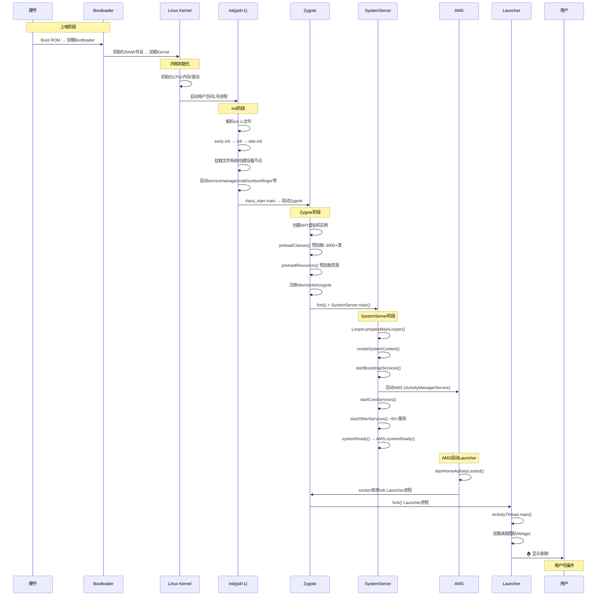

# 01 安卓系统架构全景 — 面试深度解析

---

## 一、面试高频问题（5+ 精选）

| 序号 | 面试问题 | 考察层级 |
|------|----------|----------|
| 1 | 请画出Android四层架构，并说明每层的职责和代表性组件 | 基础架构 |
| 2 | SystemServer启动过程是怎样的？startBootstrapServices / startCoreServices / startOtherServices 分别启动哪些关键服务？ | Framework核心 |
| 3 | Zygote进程的fork机制和COW（Copy-On-Write）原理是什么？为什么Android要采用Zygote预孵化模型？ | 系统原理 |
| 4 | ART和Dalvik的区别是什么？AOT编译、JIT编译、混合编译模式分别如何工作？ | 虚拟机 |
| 5 | init进程如何解析rc文件？Action/Service/Trigger的触发机制是怎样的？ | 启动流程 |
| 6 | 从开机到Launcher显示桌面的完整链路是怎样的？ | 综合链路 |
| 7 | 如果SystemServer中某个服务启动失败，如何排查？ | 实战排错 |

---

## 二、标准答案 — Android四层架构全景

### 2.1 四层架构图

```
┌──────────────────────────────────────────────────────────────┐
│                     📱 Application Layer                     │
│  System Apps (Dialer/Contacts/Settings/Launcher)             │
│  Third-party Apps (WeChat/TikTok/...)                        │
│  组件: Activity / Service / BroadcastReceiver / ContentProvider│
├──────────────────────────────────────────────────────────────┤
│                  🧩 Application Framework Layer               │
│  ActivityManagerService (AMS)    WindowManagerService (WMS)  │
│  PackageManagerService (PMS)     NotificationManagerService  │
│  ContentProviders                View System                 │
│  TelephonyManager / LocationManager / ResourceManager        │
├──────────────────────────────────────────────────────────────┤
│                     📚 Native Libraries + ART                │
│  ┌─────────────────┐  ┌──────────────────────────────────┐  │
│  │   Android Runtime│  │  Native C/C++ Libraries          │  │
│  │   (ART)          │  │  libc / Bionic                   │  │
│  │   Core Libraries │  │  SurfaceFlinger / SurfaceManager │  │
│  │   JIT + AOT      │  │  Media Framework / OpenGL ES     │  │
│  │   GC (Concurrent)│  │  SQLite / WebKit / SSL           │  │
│  └─────────────────┘  └──────────────────────────────────┘  │
├──────────────────────────────────────────────────────────────┤
│                     🐧 Linux Kernel Layer                    │
│  ┌─────────────────────────────────────────────────────────┐ │
│  │ Binder Driver  │ Ashmem    │ WakeLock │ Logger │ LowMem │ │
│  │ Power Mgmt     │ Display   │ Camera   │ Audio  │ WiFi   │ │
│  │ USB / BT       │ Keypad    │ Flash Mem│ Process Mgmt    │ │
│  └─────────────────────────────────────────────────────────┘ │
│  Linux Kernel (基于主线 + Android专用补丁/驱动)               │
└──────────────────────────────────────────────────────────────┘
```

### 2.2 各层职责详解

| 层级 | 职责 | 关键组件 | 面试要点 |
|------|------|----------|----------|
| **应用层** | 用户直接交互的APP，包括系统和第三方应用 | Launcher、Dialer、Settings | 组件生命周期、跨进程通信 |
| **Framework层** | 提供API给应用，管理四大组件和系统服务 | AMS、WMS、PMS、ViewSystem | **面试核心**，Binder IPC通信 |
| **Native层** | 为Framework提供底层能力，包含ART虚拟机和C/C++库 | ART、SurfaceFlinger、Libc | ART的JIT/AOT、图形渲染管线 |
| **Kernel层** | 硬件抽象、进程管理、驱动模型 | Binder、Ashmem、WakeLock | Android对Linux内核的定制 |

---

## 三、核心原理深度剖析

### 3.1 Android系统启动完整链路

```
Boot ROM → Bootloader → Linux Kernel → init(pid=1) → Zygote → SystemServer → Launcher
```

**逐步解析：**

#### 阶段1：Boot ROM & Bootloader
- 设备上电，执行固化在ROM中的Boot ROM代码
- Boot ROM加载Bootloader到内存并执行
- Bootloader初始化RAM、外设，加载Linux Kernel到内存
- 将控制权移交给Kernel

#### 阶段2：Linux Kernel启动
- Kernel初始化CPU、内存、设备驱动
- 挂载根文件系统（ramdisk或system分区）
- 启动用户空间的第一个进程 **init（pid=1）**

#### 阶段3：init 进程
- 解析 `/system/etc/init/hw/init.rc` 及导入的其他rc文件
- 执行 **early-init → init → late-init** 等Action序列
- 在 `late-init` 阶段触发 `class_start main` 和 `class_start late_start`
- 启动守护进程：**ueventd、logd、servicemanager、vold、surfaceflinger** 等
- 通过 `class_start main` 启动 **Zygote**

#### 阶段4：Zygote 进程
Zygote是Android系统最重要的进程之一，它是所有应用进程的父进程：

1. **初始化ART虚拟机**：加载核心Java类库（java.lang.*、android.*等）
2. **预加载系统资源**：preloadClasses()、preloadResources()、preloadOpenGL()
3. **注册Socket**：创建 `/dev/socket/zygote` Unix Domain Socket
4. **进入监听循环**：`runSelectLoop()` 等待AMS发来的fork请求

#### 阶段5：SystemServer
Zygote fork出SystemServer进程后，执行 `SystemServer.main()`：

```
SystemServer.main()
  └── new SystemServer().run()
        ├── Looper.prepareMainLooper()        // 准备主线程消息循环
        ├── createSystemContext()              // 创建系统Context
        ├── startBootstrapServices()           // 启动引导服务
        │     ├── Installer                    // 安装服务
        │     ├── ActivityManagerService (AMS) // 四大组件管理
        │     ├── PowerManagerService          // 电源管理
        │     ├── PackageManagerService (PMS)  // 包管理
        │     └── UserManagerService           // 多用户管理
        ├── startCoreServices()                // 启动核心服务
        │     ├── BatteryService               // 电池
        │     ├── UsageStatsService            // 应用使用统计
        │     └── WebViewUpdateService         // WebView更新
        ├── startOtherServices()               // 启动其他服务（~60+）
        │     ├── WindowManagerService (WMS)   // 窗口管理
        │     ├── InputManagerService          // 输入管理
        │     ├── NotificationManagerService   // 通知
        │     ├── LocationManagerService       // 定位
        │     ├── AudioService                // 音频
        │     └── ... (大量其他服务)
        └── Looper.loop()                      // 进入消息循环
```

#### 阶段6：Launcher 启动
- AMS启动完成后，通过 `startHomeActivityLocked()` 发送Intent
- PMS根据 `CATEGORY_HOME` 找到Launcher应用
- Zygote fork出Launcher进程
- Launcher显示桌面图标

### 3.2 Zygote的fork机制与COW原理

#### 为什么需要Zygote？

| 问题 | 没有Zygote | 有Zygote |
|------|-----------|----------|
| 应用启动速度 | 每个进程独立加载VM+类库，耗时~2-3s | fork共享内存页，仅~100ms |
| 内存占用 | 每个进程独立占用VM/类库内存（~50MB+） | COW共享只读页，实际仅新增~2-5MB |
| 系统稳定性 | 各进程独立初始化，可能不一致 | 统一孵化，状态一致 |

#### COW（Copy-On-Write）原理

```
fork()前:
  Zygote 虚拟内存: [ART Heap][预加载类][系统资源][libc.so][libandroid_runtime.so]
                     ↑ 物理页: A  B  C  D  E  F  G  H  I  J  K  L

fork()后 (App进程):
  父子共享同一组物理页，页表标记为"只读"

App写入时 (如创建Activity):
  触发Page Fault → Kernel复制被修改的物理页 → 仅新页产生内存开销
  ✅ 只读页(代码段、预加载类): 永久共享，0额外内存
  ✅ 可写页(堆栈、BSS): 按需复制，实际开销极小
```

**关键数据**：Zygote预加载约3000+个类、数百个资源文件，通过COW机制，每个App进程实际额外内存开销仅2-5MB。

### 3.3 ART vs Dalvik 深度对比

#### 架构对比

```
Dalvik时代 (Android 4.4及以前):
  .java → .class → .dex → 运行时JIT编译 → 机器码
                              ↑
                         每次运行都要编译热点代码

ART时代 (Android 5.0+):
  .java → .class → .dex → 安装时AOT → .oat (ELF格式机器码)
                              ↓
                         运行时直接执行

ART混合模式 (Android 7.0+):
  .java → .class → .dex → 安装时快速AOT (部分编译)
                              ↓
                         运行时: Profile-Guided JIT + 后台AOT
                              ↓
                         空闲时编译热点代码 → .oat
```

#### ART JIT + AOT混合编译工作流程

```
┌─────────────────────────────────────────────────────────────┐
│  1. APK安装阶段                                              │
│     dex2oat 快速编译（不进行全量AOT）                         │
│     → 只做verify + 基础优化，安装速度快                       │
├─────────────────────────────────────────────────────────────┤
│  2. 首次运行阶段                                             │
│     ART解释器执行 → Profile记录热点方法                       │
│     JIT编译器实时编译热点代码 → JIT Code Cache                │
├─────────────────────────────────────────────────────────────┤
│  3. 后台空闲阶段（充电+灭屏）                                 │
│     dex2oat daemon读取Profile → 全量AOT编译热点方法           │
│     → 生成 .vdex / .odex 文件，下次启动直接使用               │
└─────────────────────────────────────────────────────────────┘
```

| 特性 | Dalvik JIT | ART AOT (5.0) | ART 混合 (7.0+) |
|------|-----------|---------------|-----------------|
| 编译时机 | 运行时 | 安装时 | 安装(快)+运行时(JIT)+后台(AOT) |
| 安装速度 | 快 | 慢（全量编译） | 快 |
| 首次启动 | 慢（JIT编译） | 快 | 中（解释执行+JIT） |
| 后续启动 | 每次JIT | 快（已编译） | 快（Profile引导AOT） |
| 内存占用 | 中等 | 高（全量AOT产物） | 中等 |
| ROM占用 | 小 | 大 | 中等 |
| GC | 并发Mark-Sweep | 并发+Compacting | 并发+Compacting |

### 3.4 init进程与rc文件解析

#### init进程职责
1. **挂载文件系统**：tmpfs、devpts、proc、sysfs
2. **属性服务**（Property Service）：管理系统属性（`getprop`/`setprop`）
3. **uevent处理**：内核设备事件监听，动态创建 `/dev` 节点
4. **解析rc文件**：执行Action序列，管理Service生命周期
5. **信号处理**：子进程退出回收（SIGCHLD）

#### rc文件语法（Android Init Language）

```rc
# Action: 触发器 + 命令序列
on early-init
    # 设置init进程及其子进程的优先级
    write /proc/1/oom_score_adj -1000
    # 挂载系统分区
    mount ext4 /dev/block/by-name/system /system ro

# Service: 守护进程定义
service zygote /system/bin/app_process64 -Xzygote /system/bin --zygote --start-system-server
    class main                    # 所属类别
    priority -20                  # 优先级(nice值)
    user root                     # 运行用户
    group root readproc reserved_disk
    socket zygote stream 660 root system  # 创建Unix Domain Socket
    onrestart restart audioserver
    onrestart restart media
    writepid /dev/cpuset/foreground/tasks

# Import: 引入其他rc文件
import /system/etc/init/hw/init.${ro.hardware}.rc
```

#### Action触发阶段（简化）

```
on early-init          → 初始化文件系统、设置oom_adj
on init                → 创建目录、符号链接、设置权限
on late-init           → 触发 late-init
  trigger early-fs     → 挂载早期文件系统
  trigger fs           → 挂载所有文件系统
  trigger post-fs      → 文件系统后处理
  trigger post-fs-data → 数据分区后处理
  trigger zygote-start → 启动Zygote (Android 12+)
  trigger early-boot   → 早期启动
  trigger boot         → class_start main (启动Zygote等核心服务)
on property:sys.boot_completed=1 → 启动完成后的Action
```

### 3.5 Linux内核层的Android定制

| 内核组件 | 作用 | 面试要点 |
|----------|------|----------|
| **Binder** | 进程间通信（IPC），Android特色 | 为什么不用Unix Domain Socket？Binder只需一次拷贝（mmap） |
| **Ashmem** | 匿名共享内存 | 比System V共享内存更适合移动设备，可被OOM Killer回收 |
| **WakeLock** | 防止系统休眠 | 应用通过PowerManager获取，内核/sys/power/wake_lock实现 |
| **Logger** | 系统日志驱动（已废弃，改用logd） | 曾经的 `/dev/log/main`、`/dev/log/system`、`/dev/log/events` |
| **LowMemoryKiller** | 低内存时杀进程 | 基于oom_score_adj，释放内存，Android特色OOM策略 |
| **pmem** | 物理连续内存分配 | 用于Camera/GPU等DMA设备 |

**Binder一次拷贝原理**：
```
传统IPC (如管道/Socket):
  发送方用户空间 → 内核缓冲区(拷贝1) → 接收方用户空间(拷贝2)

Binder IPC:
  发送方用户空间 → Binder驱动mmap映射区(拷贝1)
  接收方读取同一mmap映射区 → 0额外拷贝
  ✅ 仅1次拷贝，效率极高
```

---

## 四、流程图：Android系统启动完整序列



---

## 五、源码分析

### 5.1 ZygoteInit.main() — 源码骨架

ZygoteInit位于 `frameworks/base/core/java/com/android/internal/os/ZygoteInit.java`：

```java
public static void main(String[] argv) {
    ZygoteServer zygoteServer = null;
    Runnable caller = null;
    try {
        // 1. 标记Zygote已启动
        ZygoteHooks.startZygoteNoThreadCreation();

        // 2. 创建Zygote Socket Server
        zygoteServer = new ZygoteServer(isPrimaryZygote);

        // 3. 预加载系统类和资源（关键步骤，耗时最长）
        preload(bootTimingsTraceLog);
        //    ├── preloadClasses()      // 预加载 ~3000+ Java类
        //    ├── preloadResources()    // 预加载主题/图片等
        //    ├── preloadOpenGL()       // 预加载OpenGL
        //    └── preloadSharedLibraries() // 预加载共享库

        // 4. 如果是SystemServer模式，fork SystemServer
        if (startSystemServer) {
            // fork SystemServer进程
            Runnable r = forkSystemServer(abiList, zygoteSocketName, zygoteServer);
            if (r != null) {
                // 子进程(SystemServer)直接返回Runnable
                r.run();  // → 执行SystemServer.main()逻辑
                return;
            }
            // 父进程(Zygote)继续往下执行
        }

        // 5. 进入Socket监听循环（等待AMS的fork请求）
        caller = zygoteServer.runSelectLoop(abiList);
    } catch (Throwable ex) {
        Log.e(TAG, "System zygote died with exception", ex);
        throw ex;
    } finally {
        if (zygoteServer != null) {
            zygoteServer.closeServerSocket();
        }
    }

    // 6. 子进程(App进程)返回后执行
    if (caller != null) {
        caller.run();  // → RuntimeInit → ActivityThread.main()
    }
}
```

**关键设计点**：
- Zygote.main() 通过 `fork()` 后根据返回值判断父子进程
- fork返回0 = 子进程，fork返回pid > 0 = 父进程
- 父进程继续监听Socket，子进程执行SystemServer或App的入口

### 5.2 SystemServer.main() — 源码骨架

SystemServer位于 `frameworks/base/services/java/com/android/server/SystemServer.java`：

```java
public static void main(String[] args) {
    new SystemServer().run();
}

private void run() {
    try {
        // 1. 设置进程属性
        BinderInternal.disableBackgroundScheduling(true);
        BinderInternal.setMaxThreads(sMaxBinderThreads);
        // 设置进程优先级为前台
        Process.setThreadPriority(Process.THREAD_PRIORITY_FOREGROUND);
        Process.setCanSelfBackground(false);

        // 2. 准备主线程Looper
        Looper.prepareMainLooper();
        Looper.getMainLooper().setSlowLogThresholdMs(100);

        // 3. 加载libandroid_servers.so
        System.loadLibrary("android_servers");

        // 4. 创建系统Context
        createSystemContext();

        // 5. 启动三大类服务
        // 5a. 引导服务 (Bootstrap Services)
        startBootstrapServices(t);
        // 5b. 核心服务 (Core Services)
        startCoreServices(t);
        // 5c. 其他服务 (Other Services) - 数量最多
        startOtherServices(t);

    } catch (Throwable ex) {
        throw ex;
    } finally {
        t.traceEnd();
    }

    // 6. 进入消息循环（永不返回）
    Looper.loop();
    throw new RuntimeException("Main thread loop unexpectedly exited");
}
```

**startBootstrapServices() 关键服务**：
```java
private void startBootstrapServices(@NonNull TimingsTraceAndSlog t) {
    // Installer — 安装服务（与installd守护进程通信）
    Installer installer = mSystemServiceManager.startService(Installer.class);

    // AMS — 四大组件管理层
    mActivityManagerService = new ActivityManagerService(mSystemContext,
            mActivityTaskManagerService, mAppProfiler, ...);
    mActivityManagerService.setSystemServiceManager(mSystemServiceManager);
    mActivityManagerService.setInstaller(installer);
    mActivityManagerService.start();

    // PowerManagerService — 电源管理
    mPowerManagerService = mSystemServiceManager.startService(PowerManagerService.class);

    // PMS — 包管理
    mPackageManagerService = PackageManagerService.main(mSystemContext, installer, ...);

    // UserManagerService — 多用户
    mSystemServiceManager.startService(UserManagerService.class);
}
```

### 5.3 APP进程创建 — fork + ActivityThread.main()

当AMS决定启动一个新Activity且目标进程不存在时：

```java
// 1. AMS通过Socket向Zygote发送fork请求
// frameworks/base/services/core/java/com/android/server/am/ProcessList.java
static Process.ProcessStartResult startProcess(...) {
    // 通过ZygoteProcess向Zygote发送fork指令
    return zygoteProcess.start(processClass, niceName, uid, gid, gids,
            runtimeFlags, mountExternal, targetSdkVersion, seInfo, abi,
            instructionSet, appDataDir, invokeWith, packageName, ...);
}

// 2. Zygote收到请求后fork子进程
// frameworks/base/core/java/com/android/internal/os/ZygoteServer.java
Runnable processOneCommand(ZygoteArguments parsedArgs) {
    // fork子进程
    pid = Zygote.forkAndSpecialize(
            parsedArgs.mUid, parsedArgs.mGid, parsedArgs.mGids,
            parsedArgs.mRuntimeFlags, rlimits, ...);

    if (pid == 0) {
        // 子进程中执行
        return handleChildProc(parsedArgs, childPipeFd, ...);
    } else {
        // 父进程(Zygote)中：返回pid
        handleParentProc(pid, serverPipeFd);
        return null;
    }
}

// 3. 子进程最终执行ActivityThread.main()
// frameworks/base/core/java/android/app/ActivityThread.java
public static void main(String[] args) {
    Looper.prepareMainLooper();

    ActivityThread thread = new ActivityThread();
    thread.attach(false, startSeq);

    if (sMainThreadHandler == null) {
        sMainThreadHandler = thread.getHandler();
    }

    Looper.loop();  // 进入消息循环，等待AMS调度
}
```

---

## 六、应用场景实战

### 6.1 场景一：从开机到桌面显示的完整链路

> **面试官**：用户按下电源键到看到桌面，期间发生了什么？

**完整链路（可背诵版）**：

```
按下电源键
  │
  ▼
① Boot ROM固化代码执行 → 加载Bootloader
② Bootloader初始化内存/外设 → 加载Linux Kernel
③ Kernel初始化硬件 → 启动init(pid=1)
④ init解析rc文件:
    - 创建文件系统节点
    - 启动servicemanager (Binder服务管家)
    - 启动vold (存储管理)
    - 启动surfaceflinger (显示合成)
    - 启动Zygote (孵化器)
⑤ Zygote:
    - 启动ART虚拟机 → 预加载3000+类库
    - 注册Socket → fork出SystemServer
⑥ SystemServer:
    - 启动AMS(组件管理) → PMS(包管理) → WMS(窗口管理)
    - 启动60+系统服务
    - AMS.systemReady()
⑦ AMS.startHomeActivityLocked():
    - 通过PMS找到CATEGORY_HOME的Launcher
    - 通过Socket请求Zygote fork Launcher进程
⑧ Launcher进程:
    - ActivityThread.main() → 加载Launcher Activity
    - 查询PMS获取已安装应用列表 → 绘制图标
    - 显示桌面 → 用户可操作
```

**关键耗时节点**（面试加分项）：
- Bootloader → Kernel：~1-2s
- Kernel → init：~0.5s
- init → Zygote：~1s（含文件系统挂载）
- Zygote预加载：~2-3s（最耗时）
- SystemServer启动所有服务：~3-5s
- Launcher显示：~1s
- **总计**：冷启动约8-12s（因设备而异）

### 6.2 场景二：系统服务启动异常排查

> **面试官**：SystemServer启动时某个服务crash了，如何排查？

**排查思路**：

```
1. 查看logcat日志，搜索SystemServer启动流程
   adb logcat -b events -b system -b main | grep -E "SystemServer|BootSequence"

2. 关键日志标记点：
   - "StartBootstrapServices"    → 引导服务阶段
   - "StartCoreServices"         → 核心服务阶段
   - "StartOtherServices"        → 其他服务阶段
   - "Making services ready"     → 服务就绪阶段
   - "Boot is finished"          → BOOT_COMPLETED广播

3. 典型问题定位：

   | 症状 | 可能原因 | 排查方法 |
   |------|---------|---------|
   | 卡在Android动画不动 | SystemServer某服务启动超时 | logcat看"Service xxx reports being alive" |
   | 反复重启 | 核心服务(AMS/PMS)crash | 看tombstone文件 /data/tombstones/ |
   | BOOT_COMPLETED未发送 | WMS或PMS初始化失败 | dumpsys window / dumpsys package |
   | Launcher无法显示 | PMS扫描APK失败 | adb shell dumpsys package packages |

4. 高级调试技巧：
   // 查看启动时序
   adb shell dumpsys activity activities | grep -A5 "mLastBootTime"
   
   // 查看系统服务列表及状态
   adb shell dumpsys -l
   adb shell dumpsys activity service SystemServer
   
   // 强制重启Zygote（开发阶段）
   adb shell setprop ctl.restart zygote
```

**实战修复案例**：

```java
// 问题：WMS启动失败导致SystemServer卡住

// 排查：在SystemServer.run()中添加try-catch包裹
private void startOtherServices() {
    try {
        // 原有启动逻辑
        mWindowManagerService = WindowManagerService.main(context, ...);
    } catch (Throwable e) {
        // 打印详细异常栈
        Slog.e(TAG, "Failed to start WMS", e);
        // 如果有关键缺失，可以降级处理
        // 如果不可恢复，抛出RuntimeException触发重启
        throw new RuntimeException("WMS start failed", e);
    }
}

// 通常异常原因：
// 1. SurfaceFlinger未正常启动 → 检查surfaceflinger进程
// 2. 显示驱动异常 → 检查dmesg
// 3. SELinux权限不足 → 检查avc日志
```

---

## 七、面试速查卡

### 必背关键词

| 概念 | 一句话解释 |
|------|-----------|
| **init进程** | Linux用户空间第一个进程(pid=1)，解析rc文件启动所有守护进程 |
| **Zygote** | Android应用孵化器，预加载VM和类库后通过fork+COW快速创建进程 |
| **SystemServer** | 系统服务容器，启动AMS/PMS/WMS等60+核心服务 |
| **AMS** | 四大组件生命周期管理者，App进程的调度中心 |
| **PMS** | 包管理器，负责APK安装/卸载/权限管理 |
| **WMS** | 窗口管理器，负责Surface分配、窗口Z-Order |
| **Binder** | Android IPC核心，一次拷贝(mmap)，C/S通信基础 |
| **ART** | Android Runtime，JIT+AOT混合编译，替代Dalvik |
| **COW** | Copy-On-Write，fork后父子共享内存页，写入时才复制 |
| **init.rc** | Android Init Language编写的启动配置文件 |

### 必背数字

| 数据 | 值 |
|------|-----|
| Zygote预加载类数量 | ~3000-4000个 |
| SystemServer启动服务数量 | ~60-80个 |
| Zygote fork一个App进程耗时 | ~100ms |
| 冷启动总耗时 | 8-12秒 |
| Binder线程池默认大小 | 15（SystemServer） |
| ART混合编译后dex2oat产物 | .vdex + .odex |

### 面试应答策略

```
问题: "讲一下Android系统的架构"
回答结构:
  1. 先画四层架构图(从上到下)
  2. 重点讲Framework层和Native Runtime层
  3. 用"开机流程"串联所有知识点
  4. 适当提Binder/Zygote/COW体现深度
  5. 如果面试官追问细节，进入源码级别讨论
```

---

> **本文档持续更新**，建议配合AOSP源码阅读（重点目录：`frameworks/base/services/`、`frameworks/base/core/java/android/app/`、`system/core/init/`）
