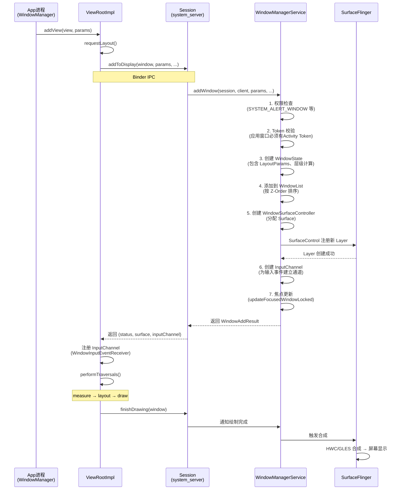

# 04-WMS详解 — WindowManagerService 面试全攻略

---

## 目录

1. [面试高频问题](#1-面试高频问题)
2. [标准答案与架构对比](#2-标准答案与架构对比)
3. [核心原理深度剖析](#3-核心原理深度剖析)
4. [窗口添加全流程（流程图）](#4-窗口添加全流程图)
5. [源码分析：WindowManagerGlobal.addView() → WMS.addWindow()](#5-源码分析windowmanagerglobaladdview--wmsaddwindow)
6. [应用场景：Dialog的BadTokenException](#6-应用场景dialog的badtokenexception)

---

## 1. 面试高频问题

以下是WMS模块面试中最常被问到的7个核心问题：

### Q1: Window、WindowManager、WindowManagerService 三者是什么关系？

这是WMS面试的"开门题"。面试官考察你对Android窗口体系的分层架构理解。三个概念处于不同层级：**Window** 是抽象概念（一个矩形显示区域），**WindowManager** 是应用进程的客户端代理（通过Binder与WMS通信），**WindowManagerService** 是系统服务端（运行在system_server进程，管理所有窗口的全局状态）。

### Q2: Android 窗口的层级（Z-Order）和窗口类型（应用窗口/子窗口/系统窗口）是怎样的？

考察你对窗口分类体系和层叠顺序的理解。应用窗口（TYPE_APPLICATION，1~99）、子窗口（TYPE_APPLICATION_PANEL，1000~1999，如PopupWindow）、系统窗口（TYPE_SYSTEM_*，2000~2999，如Toast、输入法、状态栏）。Z-Order决定绘制和触摸事件的先后顺序，类型值越大越在上层。

### Q3: ViewRootImpl 和 WMS 的通信机制是怎样的？

考察你对窗口管理IPC链路的理解。ViewRootImpl 不直接与 WMS 通信，而是通过 **IWindowSession**（Session的Binder代理）中转。Session运行在system_server进程，是WMS对外暴露的会话接口。每个应用进程持有一个Session，所有窗口操作（add/remove/relayout）都经过Session→WMS。

### Q4: SurfaceFlinger 的图层合成原理是什么？与WMS如何协作？

考察你对显示子系统的理解。SurfaceFlinger 是Android的"Composer"（合成器），接收来自WMS的Layer配置信息，将所有窗口的BufferQueue中的GraphicBuffer合成到最终屏幕上。WMS管理"谁显示在哪里"，SurfaceFlinger负责"怎么显示"。

### Q5: Window 的添加流程是怎样的？（addView → WMS.addWindow 全链路）

这是WMS面试最核心的流程题。从 `WindowManager.addView()` 开始，经过 ViewRootImpl.setView() → Session.addToDisplay() → WMS.addWindow()，涉及Token校验、窗口状态创建、Surface申请、SurfaceFlinger注册等关键步骤。面试官期望你画出完整流程图。

### Q6: Dialog、Toast、PopupWindow 的窗口实现有什么差异？

考察你对不同窗口机制的理解深度。三者虽都是"弹窗"，但实现完全不同：Dialog 创建新的 Window 和 ViewRootImpl（需要Activity Token），Toast 使用 TYPE_TOAST 系统窗口由 NotificationManagerService 管理，PopupWindow 作为子窗口依附于宿主 DecorView（无需独立Token但有Z-Order限制）。

### Q7: WindowManager.LayoutParams 的 type 和 flag 分别控制什么？token 的作用是什么？

考察你对窗口属性的理解。type决定窗口类别和层级（与Z-Order直接相关），flag控制窗口行为（FLAG_NOT_FOCUSABLE不获取焦点、FLAG_NOT_TOUCH_MODAL不拦截外部触摸、FLAG_SECURE禁止截屏）。token是窗口的"身份标识"——应用窗口的token来自Activity的IBinder，WMS通过token校验窗口的合法性和归属关系。

---

## 2. 标准答案与架构对比

### 2.1 Window → WindowManager → WMS 的完整调用链路

#### 分层架构全景

```
┌─────────────────────────────────────────────────────┐
│                   应用进程 (App)                      │
│  ┌──────────┐   ┌──────────────┐   ┌─────────────┐ │
│  │  Window  │──▶│ WindowManager│──▶│ViewRootImpl  │ │
│  │ (抽象)   │   │ (客户端代理)  │   │ (窗口根节点) │ │
│  └──────────┘   └──────┬───────┘   └──────┬──────┘ │
│                        │                   │         │
│                        │   WindowManagerGlobal       │
│                        │   .addView()                │
│                        │                   │         │
│                        ▼                   ▼         │
│               IWindowSession (Binder代理)            │
│               └──── Session.addToDisplay()           │
└───────────────────────────┬─────────────────────────┘
                            │ Binder IPC
                            ▼
┌─────────────────────────────────────────────────────┐
│              system_server 进程                      │
│  ┌──────────┐   ┌──────────────────────────────┐    │
│  │ Session  │──▶│   WindowManagerService (WMS)  │    │
│  │ (Binder) │   │  ┌─────────────────────────┐ │    │
│  └──────────┘   │  │  WindowState 列表       │ │    │
│                 │  │  WindowToken 映射        │ │    │
│                 │  │  DisplayContent 管理     │ │    │
│                 │  └───────────┬─────────────┘ │    │
│                 └──────────────┼────────────────┘    │
│                                │                     │
│                                ▼                     │
│                      SurfaceFlinger                  │
│                      (图层合成)                       │
└─────────────────────────────────────────────────────┘
```

**关键对比表**：

| 组件 | 进程 | 职责 | 关键数据结构 |
|------|------|------|-------------|
| **Window** | App | 抽象行为定义（setContentView、回调） | DecorView |
| **WindowManager** | App | LayoutParams配置、addView/removeView | WindowManagerImpl |
| **ViewRootImpl** | App | 与WMS通信桥梁、View绘制入口 | Surface、Choreographer |
| **IWindowSession** | App→System | Binder接口代理 | Session (client proxy) |
| **Session** | system_server | Binder服务端、权限校验 | mClient (IWindow) |
| **WMS** | system_server | 全局窗口管理、焦点分配 | WindowState、WindowToken |
| **SurfaceFlinger** | surfaceflinger | 图层合成、HWC硬件合成 | Layer、BufferQueue |

### 2.2 窗口类型与Z-Order详解

#### 窗口类型分类（以 type 值域划分）

```
type 范围         类别             示例                   特性
─────────────────────────────────────────────────────────────────
1 ~ 99           应用窗口         TYPE_APPLICATION      需Activity Token
                                    TYPE_BASE_APPLICATION  正常Activity窗口

1000 ~ 1999      子窗口           TYPE_APPLICATION_PANEL PopupWindow（依附父窗口）
                                    TYPE_APPLICATION_MEDIA  视频悬浮窗
                                    TYPE_APPLICATION_SUB_PANEL

2000 ~ 2999      系统窗口         TYPE_SYSTEM_OVERLAY   Toast（已废弃,现用TYPE_TOAST）
                                    TYPE_SYSTEM_ALERT      系统Alert弹窗
                                    TYPE_TOAST (2005)      Toast通知
                                    TYPE_INPUT_METHOD      输入法窗口
                                    TYPE_STATUS_BAR        状态栏
                                    TYPE_NAVIGATION_BAR    导航栏
                                    TYPE_KEYGUARD_DIALOG   锁屏对话框
```

**Z-Order 规则**：

- 同一 WindowLayer 内，后添加的窗口在上层
- 系统窗口 > 子窗口 > 应用窗口（整体type值越大越在上）
- WMS 通过 `WindowState.mBaseLayer` 和 `mSubLayer` 精确控制Z序
- SurfaceFlinger 的 `setLayer()` 最终决定GPU/硬件合成的绘制顺序

### 2.3 Dialog vs Toast vs PopupWindow 差异对比

| 维度 | Dialog | Toast | PopupWindow |
|------|--------|-------|-------------|
| **窗口类型** | TYPE_APPLICATION | TYPE_TOAST (2005) | TYPE_APPLICATION_PANEL |
| **独立Window** | ✅ 是（新建PhoneWindow） | ✅ 是 | ❌ 否（依附DecorView） |
| **需要Token** | ✅ 必须（Activity Token） | ❌ 否 | ❌ 否（使用父窗口Token） |
| **获取焦点** | ✅ 默认获取 | ❌ 不获取（NOT_FOCUSABLE） | ⚙️ 可配置 |
| **触摸外部** | ⚙️ 可配置 | ❌ 不拦截 | ⚙️ 可配置 |
| **生命周期** | 需手动dismiss | 自动消失（短/长） | 需手动dismiss |
| **View体系** | setContentView | setView（Android 11+受限） | setContentView |
| **系统管理** | WMS直接管理 | NotificationManagerService→WMS | WMS作为子窗口管理 |
| **典型场景** | AlertDialog、自定义弹窗 | 短暂提示信息 | 下拉菜单、气泡提示 |

---

## 3. 核心原理深度剖析

### 3.1 WMS 管理所有窗口的核心数据结构

WMS 的窗口管理基于以下核心数据结构构成完整的窗口树：

#### WindowState — 窗口的"档案"

```java
// frameworks/base/services/core/java/com/android/server/wm/WindowState.java
class WindowState {
    final WindowToken mToken;          // 窗口归属Token
    final Session mSession;            // 客户端会话
    final IWindow mClient;            // 对应ViewRootImpl的Binder回调
    WindowContainer mParent;          // 父容器
    int mBaseLayer;                   // 基础层级
    int mSubLayer;                    // 子层级偏移
    boolean mHasSurface;              // 是否已分配Surface
    boolean mObscured;                // 是否被遮挡
    InputChannel mInputChannel;       // 输入事件通道
    // ...
}
```

**WindowState 列表**：WMS 内部维护 `WindowList`（继承自 `ArrayList<WindowState>`），按Z-Order排序。所有窗口操作（添加、移除、层级调整）都围绕此列表展开。

#### WindowToken — 窗口的"身份证"

```java
// 每个"窗口组"共享一个 WindowToken
class WindowToken {
    final IBinder token;               // Binder标识（Activity持有/系统服务持有）
    final int windowType;              // 窗口类型
    final boolean mRoundedCornerOverlay;
    // 此Token下属的所有 WindowState
    // 如一个Activity的所有窗口（DecorView + Dialog1 + Dialog2）共享一个Token
}
```

**Token 的关键作用**：
1. **身份验证**：WMS 通过 token 校验窗口的合法性
2. **生命周期绑定**：当 Activity 销毁时，其 Token 失效，下属所有窗口自动移除
3. **输入焦点管理**：同一 Token 的窗口共享焦点策略

#### DisplayContent — 屏幕抽象

```java
// Android 10+ 支持多屏，每个屏幕有一个 DisplayContent
class DisplayContent extends WindowContainer<DisplayContent.DisplayChildWindowContainer> {
    int mDisplayId;
    DisplayInfo mDisplayInfo;              // 屏幕尺寸、密度
    DisplayPolicy mDisplayPolicy;          // 显示策略（状态栏、导航栏位置）
    TaskStackContainers mTaskStackContainers;
}
```

### 3.2 窗口焦点切换与输入事件分发

#### 焦点窗口的选择流程

```
WMS.updateFocusedWindowLocked()
  │
  ├─ 1. 遍历所有 DisplayContent
  │
  ├─ 2. 对每个屏幕，从 WindowList 顶部向底部查找
  │     └─ findFocusedWindowIfNeeded()
  │         ├─ 条件1: WindowState.mAttrs.type 不是 NOT_FOCUSABLE 类型
  │         ├─ 条件2: 窗口可见 (mViewVisibility == VISIBLE)
  │         ├─ 条件3: 窗口所属进程存活
  │         └─ 条件4: 窗口未被移除 (mRemoveOnExit == false)
  │
  ├─ 3. 找到目标窗口后
  │     └─ 旧焦点窗口: IWindow.windowFocusChanged(false)
  │     └─ 新焦点窗口: IWindow.windowFocusChanged(true)
  │
  └─ 4. 通知 InputManagerService 更新输入目标
        └─ InputMonitor.updateInputWindowsLw()
```

#### 输入事件分发路径

```
用户触摸屏幕
    │
    ▼
InputReader (读取触摸硬件事件)
    │
    ▼
InputDispatcher (通过 InputChannel 分发)
    │
    ├─ 根据 InputWindowHandle 列表确定目标窗口
    │   └─ 这个列表由 WMS 通过 InputMonitor.setInputWindows() 同步
    │   └─ 列表按 Z-Order 排序，顶部窗口优先接收事件
    │
    └─ 通过 InputChannel (socket pair) 发送到应用进程
        │
        ▼
    ViewRootImpl.WindowInputEventReceiver
        │
        ▼
    ViewRootImpl.processPointerEvent()
        │
        ▼
    DecorView.dispatchTouchEvent()
        │
        ▼
    ViewGroup.dispatchTouchEvent()
        (事件分发、拦截、处理)
```

### 3.3 WindowManager.LayoutParams 的 type 和 flag 详解

#### 关键 type 常量

```java
// 应用窗口
public static final int TYPE_APPLICATION        = 2;
public static final int TYPE_BASE_APPLICATION   = 1;
public static final int TYPE_APPLICATION_STARTING = 3;  // 启动窗口（白屏/闪屏）

// 子窗口（必须指定 parentWindow）
public static final int TYPE_APPLICATION_PANEL  = 1000;
public static final int TYPE_APPLICATION_MEDIA  = 1001;

// 系统窗口（需 SYSTEM_ALERT_WINDOW 权限）
public static final int TYPE_TOAST              = 2005;
public static final int TYPE_SYSTEM_ALERT      = 2003;
public static final int TYPE_SYSTEM_OVERLAY    = 2006;
public static final int TYPE_INPUT_METHOD      = 2011;
public static final int TYPE_STATUS_BAR        = 2000;
```

#### 关键 flag 常量

| Flag | 值 | 作用 |
|------|----|----|
| FLAG_NOT_FOCUSABLE | 0x08 | 不获取焦点，触摸事件透传下层 |
| FLAG_NOT_TOUCHABLE | 0x10 | 不接收触摸事件 |
| FLAG_NOT_TOUCH_MODAL | 0x20 | 窗口外触摸事件传递给下层 |
| FLAG_LAYOUT_NO_LIMITS | 0x200 | 允许布局超出屏幕边界 |
| FLAG_SECURE | 0x2000 | 禁止截屏和录屏 |
| FLAG_DISMISS_KEYGUARD | 0x400000 | 解锁键盘锁 |
| FLAG_TURN_SCREEN_ON | 0x200000 | 点亮屏幕 |
| FLAG_KEEP_SCREEN_ON | 0x80 | 保持屏幕常亮 |
| FLAG_FULLSCREEN | 0x400 | 隐藏状态栏，全屏显示 |

#### flag 组合判断规则（WMS 内部）

```java
// WMS 判断窗口是否能接收外部触摸
boolean touchModal = (attrs.flags & FLAG_NOT_TOUCH_MODAL) == 0;
boolean notFocusable = (attrs.flags & FLAG_NOT_FOCUSABLE) != 0;
boolean notTouchable = (attrs.flags & FLAG_NOT_TOUCHABLE) != 0;

// Type 判断系统窗口
boolean isSystemWindow = attrs.type >= FIRST_SYSTEM_WINDOW 
                      && attrs.type <= LAST_SYSTEM_WINDOW;
```

### 3.4 SurfaceFlinger 图層合成原理

#### 核心机制

SurfaceFlinger 作为 Android 的 Composer，通过以下步骤合成所有图层：

```
应用层 (App)                      SurfaceFlinger                  Hardware Composer
    │                                  │                               │
    │ dequeueBuffer → 绘制 → queueBuffer│                               │
    │─────────────────────────────────▶│                               │
    │                                  │ 收集所有Layer的Buffer          │
    │                                  │                               │
    │                                  │ 判断合成策略                    │
    │                                  │ ├─ GLES合成 (GPU)             │
    │                                  │ └─ HWC合成 (硬件Overlay)       │
    │                                  │                               │
    │                                  │ 提交到HWC ──────────────────▶│
    │                                  │                               │ 硬件合成
    │                                  │                               │ 输出到屏幕
```

#### 关键概念

1. **BufferQueue**：生产者-消费者模型。App 端（生产者）dequeue+queue GraphicBuffer，SurfaceFlinger 端（消费者）acquire+release。每个 Layer 对应一个 BufferQueue。

2. **Layer**：SurfaceFlinger 中的基本单元，对应 WMS 中的一个 WindowState。每个 Layer 有自己的位置、大小、透明度、Z-Order。

3. **HWC (Hardware Composer)**：硬件抽象层，决定哪些 Layer 可以用硬件 Overlay 直接合成（零拷贝），哪些需要 GPU 渲染。硬件 Overlay 可大幅降低功耗。

4. **VSYNC 同步**：SurfaceFlinger 依赖 VSYNC 信号（硬件垂直同步，通常 60Hz/120Hz）驱动合成节奏，与 Choreographer 配合保证流畅度。

#### WMS 与 SurfaceFlinger 的协作

```
WMS.relayoutWindow()                         SurfaceFlinger
      │                                            │
      ├─ 创建/更新 SurfaceControl                  │
      │  └─ SurfaceControl.setPosition()          │
      │  └─ SurfaceControl.setLayer()              │
      │  └─ SurfaceControl.setSize()               │
      │                                            │
      └──────── Binder IPC ───────────────────────▶│
                                                   │
                                           更新 Layer 属性
                                           (位置、尺寸、层级)
```

WMS 通过 `SurfaceControl`（SurfaceFlinger 的客户端句柄）控制每个窗口的图层属性。当一个新窗口被添加到 WMS 时，WMS 会利用 `WindowSurfaceController` 创建一个新的 SurfaceControl 并在 SurfaceFlinger 中注册对应的 Layer。

---

## 4. 窗口添加全流程（流程图）

### 4.1 文字流程图

```
App进程                                     system_server进程                  surfaceflinger进程
  │                                               │                                │
  │ WindowManagerImpl.addView()                   │                                │
  │        │                                      │                                │
  │        ▼                                      │                                │
  │ WindowManagerGlobal.addView()                 │                                │
  │   ├─ 创建 ViewRootImpl                        │                                │
  │   ├─ view.assignParent(this)                  │                                │
  │   └─ root.setView(view, params, panelParent) ─┤                                │
  │                                               │                                │
  │        ViewRootImpl.setView()                 │                                │
  │           ├─ requestLayout()                  │                                │
  │           ├─ mWindowSession.addToDisplay() ───▶│                                │
  │           │         (Binder IPC)              │                                │
  │           │                                   │  Session.addToDisplay()        │
  │           │                                   │      │                         │
  │           │                                   │      ▼                         │
  │           │                                   │  WMS.addWindow()               │
  │           │                                   │    ├─ 权限检查                 │
  │           │                                   │    ├─ Token校验                │
  │           │                                   │    ├─ 创建 WindowState         │
  │           │                                   │    ├─ 添加到 WindowList        │
  │           │                                   │    ├─ 计算Z-Order             │
  │           │                                   │    ├─ 创建 WindowSurface      │
  │           │                                   │    │   └─ SurfaceControl ─────▶│
  │           │                                   │    │                          │ 创建Layer
  │           │                                   │    ├─ 创建 InputChannel       │
  │           │                                   │    ├─ updateFocusedWindow()   │
  │           │                                   │    └─ 返回结果 ───────────────▶│
  │           │                                   │                                │
  │           │  ◀─── result (status, surface) ───│                                │
  │           │                                   │                                │
  │           ├─ 处理返回的 Surface               │                                │
  │           ├─ 注册 InputChannel                 │                                │
  │           └─ performTraversals()              │                                │
  │               ├─ measure                      │                                │
  │               ├─ layout                       │                                │
  │               ├─ draw → Canvas → Surface      │                                │
  │               └─ Binder: IWindowSession.finishDrawing() ──▶│                    │
```

### 4.2 Mermaid 流程图



---

## 5. 源码分析：WindowManagerGlobal.addView() → WMS.addWindow()

### 5.1 WindowManagerGlobal.addView() — 应用端入口

**源码位置**：`frameworks/base/core/java/android/view/WindowManagerGlobal.java`

```java
public void addView(View view, ViewGroup.LayoutParams params,
        Display display, Window parentWindow, int userId) {
    
    // 1. 参数校验
    if (view == null) throw new IllegalArgumentException("view must not be null");
    if (display == null) throw new IllegalArgumentException("display must not be null");
    
    final WindowManager.LayoutParams wparams = (WindowManager.LayoutParams) params;
    
    // 2. 处理子窗口：继承父窗口的 LayoutParams 属性
    if (parentWindow != null) {
        parentWindow.adjustLayoutParamsForSubWindow(wparams);
    }

    // 3. 创建 ViewRootImpl — 窗口与WMS通信的核心桥梁
    ViewRootImpl root;
    View panelParentView = null;
    
    synchronized (mLock) {
        // ...
        root = new ViewRootImpl(view.getContext(), display);
        view.setLayoutParams(wparams);
        
        // 4. 保存到全局列表中（用于后续批量操作）
        mViews.add(view);          // ArrayList<View>
        mRoots.add(root);          // ArrayList<ViewRootImpl>
        mParams.add(wparams);      // ArrayList<WindowManager.LayoutParams>
        
        try {
            // 5. 核心调用：将View设置到ViewRootImpl
            root.setView(view, wparams, panelParentView, userId);
            //     │
            //     ├─ 这里会触发:
            //     │  ① requestLayout() — 请求首次布局
            //     │  ② IWindowSession.addToDisplay() — Binder IPC到WMS
            //     │  ③ 注册 InputChannel 接收输入事件
            //     └─ ③ performTraversals() — measure → layout → draw
        } catch (RuntimeException e) {
            // 失败时回滚：从列表移除
            mViews.remove(view);
            mRoots.remove(root);
            throw e;
        }
    }
}
```

**关键设计点**：

- **WindowManagerGlobal 是单例**：一个进程只有一个实例，管理该进程内所有窗口
- **三步存储**：mViews/mRoots/mParams 三个列表通过 index 一一对应，方便 removeView 时同步清理
- **parentWindow 不等于 null 时**：说明是子窗口（如 PopupWindow），需要调整 type 和 token（继承父窗口）

### 5.2 ViewRootImpl.setView() — 跨进程通信触发点

**源码位置**：`frameworks/base/core/java/android/view/ViewRootImpl.java`

```java
public void setView(View view, WindowManager.LayoutParams attrs, 
        View panelParentView, int userId) {
    synchronized (this) {
        if (mView == null) {
            mView = view;
            // ...
            
            // 1. 请求首次布局（异步）
            requestLayout();
            
            // 2. Binder IPC：向WMS注册窗口
            try {
                mOrigWindowType = mWindowAttributes.type;
                // ...
                res = mWindowSession.addToDisplay(mWindow, mWindowAttributes,
                        getHostVisibility(), mDisplay.getDisplayId(), userId,
                        mInsetsController.getRequestedVisibilities(), 
                        inputChannel, mTempInsets, mTempControls);
                //    │
                //    │ mWindowSession = WindowManagerGlobal.getWindowSession()
                //    │ mWindow = new W(this)  // IWindow.Stub的Binder实现
                //    │    这个mWindow是WMS回调应用进程的Binder接口
                //    └─ mWindowSession 是 IWindowSession 的代理对象
            } catch (RemoteException e) {
                // ...
            }
            
            // 3. 处理返回结果
            // ...
        }
    }
}
```

**关键点**：

1. `mWindow`（IWindow.Stub）是 WMS 回调应用进程的 Binder 接口，用于通知窗口状态变化（焦点变化、大小变化等）
2. `mWindowSession` 是 IWindowSession 的代理，由 WindowManagerGlobal.getWindowSession() 获取
3. `requestLayout()` 通过 Choreographer 在下一帧执行 performTraversals()

### 5.3 Session.addToDisplay() — Binder 服务端

**源码位置**：`frameworks/base/services/core/java/com/android/server/wm/Session.java`

```java
class Session extends IWindowSession.Stub {
    final WindowManagerService mService;
    
    @Override
    public int addToDisplay(IWindow window, WindowManager.LayoutParams attrs,
            int viewVisibility, int displayId, int userId, 
            InsetsVisibilities requestedVisibilities,
            InputChannel outInputChannel, InsetsState outInsetsState,
            InsetsSourceControl.Array outActiveControls) {
        
        // 权限检查：系统窗口需要 SYSTEM_ALERT_WINDOW 等权限
        int res = mService.addWindow(this, window, attrs, viewVisibility, 
                displayId, userId, requestedVisibilities, 
                outInputChannel, outInsetsState, outActiveControls);
        return res;
    }
}
```

Session 的本质是"代理层"——负责权限校验（通过 `mService.checkPermission()` 和 `mService.mContext.enforceCallingPermission()`），然后直接转发给 WMS。

### 5.4 WMS.addWindow() — 核心窗口注册逻辑

**源码位置**：`frameworks/base/services/core/java/com/android/server/wm/WindowManagerService.java`

```java
public int addWindow(Session session, IWindow client, 
        WindowManager.LayoutParams attrs, int viewVisibility,
        int displayId, int userId, ...) {
    
    int res = WindowManagerGlobal.ADD_OKAY;
    
    // ============ 阶段1: 权限与合法性检查 ============
    
    // 1.1 检查调用者是否持有对应权限
    int type = attrs.type;
    if (type >= FIRST_SYSTEM_WINDOW && type <= LAST_SYSTEM_WINDOW) {
        // 系统窗口需要 SYSTEM_ALERT_WINDOW 或 INTERNAL_SYSTEM_WINDOW 权限
        if (!mContext.checkCallingPermission(INTERNAL_SYSTEM_WINDOW)
                == PERMISSION_GRANTED) {
            res = checkSystemAlertWindowPermission(type, session.mUid, 
                                                     session.mPid, attrs.packageName);
        }
    }
    
    // 1.2 TYPE_APPLICATION_OVERLAY 需要特殊权限
    if (type == TYPE_APPLICATION_OVERLAY && ...) { /* ... */ }
    
    // ============ 阶段2: Token 校验 ============
    
    WindowToken token = null;
    if (type >= FIRST_APPLICATION_WINDOW && type <= LAST_APPLICATION_WINDOW) {
        // 应用窗口必须有 Token
        token = mRoot.getWindowToken(attrs.token);
        if (token == null) {
            return WindowManagerGlobal.ADD_BAD_APP_TOKEN;  // 著名的 BadTokenException
        }
        // Dialog 等也需要 Activity Token
        if (type == TYPE_APPLICATION) {
            ActivityRecord activity = token.asActivityRecord();
            if (activity == null) {
                return WindowManagerGlobal.ADD_BAD_APP_TOKEN;
            }
        }
    } else if (type == TYPE_INPUT_METHOD) {
        // 输入法窗口需要特殊的 IME Token
        token = mRoot.getWindowToken(attrs.token);
    }
    
    // ============ 阶段3: 创建 WindowState ============
    
    // 3.1 创建 WindowState 对象
    final WindowState win = new WindowState(this, session, client, token,
            parentWindow, appOp[0], attrs, viewVisibility, session.mUid,
            session.mCanAddInternalSystemWindow);
    
    // 3.2 检查是否已有同名窗口（同一 client 不能添加多个相同窗口）
    if (mWindowMap.containsKey(client.asBinder())) {
        WindowState existing = mWindowMap.get(client.asBinder());
        if (existing.mAttrs.type == attrs.type && ...) {
            return WindowManagerGlobal.ADD_DUPLICATE_ADD;
        }
    }
    
    // ============ 阶段4: 分配 Surface 和 InputChannel ============
    
    // 4.1 创建 Surface（通过 WindowSurfaceController）
    win.attach();
    //    └─ WindowSurfaceController 构造函数
    //        └─ new SurfaceControl.Builder()
    //            .setName(...)
    //            .setFormat(...)
    //            .setParent(rootSurface)  // 建立SurfaceFlinger层级关系
    //            .build()
    
    // 4.2 创建 InputChannel（用于输入事件传递）
    InputChannel inputChannel = win.openInputChannel(outInputChannel);
    //    └─ InputChannel.openInputChannelPair(name)
    //        └─ 返回一对已连接的 InputChannel (服务端/客户端)
    
    // ============ 阶段5: 添加到窗口列表 ============
    
    // 5.1 将 WindowState 加入 DisplayContent 的 WindowList
    win.mToken.addWindow(win);
    displayContent.addWindow(win);
    
    // 5.2 按 Z-Order 排序
    win.getParent().assignChildLayers();
    
    // ============ 阶段6: 焦点更新 ============
    
    // 6.1 如果新窗口应该获取焦点
    if (win.canReceiveKeys()) {
        focusChanged = updateFocusedWindowLocked(
                UPDATE_FOCUS_WILL_ASSIGN_LAYERS, false);
        // 通知旧焦点窗口失去焦点（通过 IWindow.windowFocusChanged）
    }
    
    // ============ 阶段7: 返回结果 ============
    
    if (focusChanged) {
        displayContent.getInputMonitor().updateInputWindowsLw(true);
        // 通知 InputDispatcher 更新输入窗口列表
    }
    
    return res;  // ADD_OKAY 或错误码
}
```

### 5.5 错误码对照表

| 错误码 | 常量名 | 触发场景 |
|--------|--------|---------|
| 0 | ADD_OKAY | 成功 |
| -1 | ADD_BAD_APP_TOKEN | Token 无效/过期（最常见） |
| -2 | ADD_BAD_SUBWINDOW_TOKEN | 子窗口 Token 无效 |
| -3 | ADD_NOT_APP_TOKEN | 应用窗口的 Token 不是Activity Token |
| -4 | ADD_APP_EXITING | Activity 正在销毁过程中 |
| -5 | ADD_DUPLICATE_ADD | 重复添加同一窗口 |
| -6 | ADD_STARTING_NOT_NEEDED | 不需要启动窗口 |
| -7 | ADD_MULTIPLE_SINGLETON | 多个单例窗口 |
| -8 | ADD_PERMISSION_DENIED | 权限不足（系统窗口等） |
| -9 | ADD_INVALID_DISPLAY | 无效的 Display ID |
| -10 | ADD_INVALID_TYPE | 无效的窗口类型 |

---

## 6. 应用场景：Dialog的BadTokenException

### 6.1 问题现象

```
android.view.WindowManager$BadTokenException: 
    Unable to add window -- token android.os.BinderProxy@xxx is not valid; 
    is your activity running?
```

这是 Android 开发中最常见的 WMS 相关崩溃之一，通常发生在以下场景：

### 6.2 根因分析

**根本原因**：Dialog 创建时需要一个有效的 **Activity Token**，但当 Dialog 尝试 `show()` 时，该 Token 已经失效（对应的 Activity 已被销毁）。

#### 源码层面的触发链路

```
Dialog.show()
  └─ WindowManager.addView(mDecor, params)
       └─ WindowManagerGlobal.addView()
            └─ ViewRootImpl.setView()
                 └─ mWindowSession.addToDisplay()  // Binder IPC
                      └─ Session.addToDisplay()
                           └─ WMS.addWindow()
                                └─ token = mRoot.getWindowToken(attrs.token)
                                   // token 为 null！
                                   └─ return ADD_BAD_APP_TOKEN
                                      // ViewRootImpl 收到后抛出 BadTokenException
```

#### WMS 中 Token 失效的判断逻辑

```java
// WMS.addWindow() 中的 Token 校验
WindowToken token = mRoot.getWindowToken(attrs.token);

// ActivityRecord 在以下情况会将 Token 从 mTokenMap 中移除：
// 1. Activity.onDestroy() 完成
// 2. ActivityStackSupervisor.handleAppDiedLocked()
// 3. removeActivityFromHistoryLocked()
```

### 6.3 触发场景与解决方案

#### 场景1：在 Activity.onDestroy() 之后弹 Dialog

```java
// ❌ 错误：异步任务回到主线程时 Activity 可能已销毁
class MyActivity extends Activity {
    void loadData() {
        new Thread(() -> {
            // 网络请求...
            runOnUiThread(() -> {
                new AlertDialog.Builder(MyActivity.this)
                    .setMessage("完成")
                    .show();  // 如果 Activity 已 finish，崩溃！
            });
        }).start();
    }
}

// ✅ 正确：检查 Activity 生命周期
class MyActivity extends Activity {
    private volatile boolean mDestroyed = false;
    
    @Override
    protected void onDestroy() {
        super.onDestroy();
        mDestroyed = true;
    }
    
    void loadData() {
        new Thread(() -> {
            // 网络请求...
            runOnUiThread(() -> {
                if (!mDestroyed && !isFinishing()) {
                    new AlertDialog.Builder(MyActivity.this)
                        .setMessage("完成")
                        .show();
                }
            });
        }).start();
    }
}
```

#### 场景2：使用 Application Context 创建 Dialog

```java
// ❌ 错误：Application 没有 Activity Token
AlertDialog dialog = new AlertDialog.Builder(getApplicationContext())
    .setMessage("Hello")
    .create();
dialog.show();  // BadTokenException！

// ✅ 方案A：使用 Activity Context
AlertDialog dialog = new AlertDialog.Builder(MyActivity.this)
    .setMessage("Hello")
    .create();

// ✅ 方案B：使用 TYPE_APPLICATION_OVERLAY（需 SYSTEM_ALERT_WINDOW 权限）
AlertDialog dialog = new AlertDialog.Builder(getApplicationContext())
    .setMessage("Hello")
    .create();
dialog.getWindow().setType(WindowManager.LayoutParams.TYPE_APPLICATION_OVERLAY);
dialog.show();
```

#### 场景3：Service 中弹 Dialog（Android 10+ 受限）

```java
// ❌ 错误：Service 没有 Activity Token
// 即使在 Service 中弹带有 TYPE_APPLICATION_OVERLAY 的窗口，
// Android 10+ 也限制了后台启动 Activity / 弹窗

// ✅ 推荐：使用 Notification 或前台 Service + 系统弹窗权限
```

#### 场景4：横竖屏切换导致 Activity 重建

```java
// ❌ 错误：异步操作未正确处理配置变更
class MyActivity extends Activity {
    @Override
    protected void onCreate(Bundle savedInstanceState) {
        super.onCreate(savedInstanceState);
        // 假设网络请求需要2秒
        fetchData(result -> {
            new AlertDialog.Builder(MyActivity.this)  // this 可能指向旧的 Activity
                .setMessage(result)
                .show();  // 可能崩溃！
        });
    }
}

// ✅ 方案A：使用 LiveData + observe lifecycle
// ✅ 方案B：在 show() 前检查 isDestroyed()
// ✅ 方案C：在 manifest 中声明 configChanges 避免重建
```

### 6.4 防御性编程最佳实践

```java
/**
 * 安全的 Dialog 显示工具类
 */
public class SafeDialogUtil {
    
    /**
     * 安全显示 Dialog，自动检查 Activity 状态
     */
    public static void showDialogSafely(Activity activity, Dialog dialog) {
        if (activity == null || activity.isFinishing() || activity.isDestroyed()) {
            return;
        }
        try {
            dialog.show();
        } catch (BadTokenException e) {
            // 极少数竞态情况下仍可能发生，递归修复
            Log.w("SafeDialog", "BadTokenException caught, activity may be destroyed");
        } catch (WindowManager.InvalidDisplayException e) {
            Log.w("SafeDialog", "Invalid display", e);
        }
    }
    
    /**
     * 安全显示 DialogFragment
     */
    public static void showDialogFragmentSafely(FragmentManager fm, 
            DialogFragment dialog, String tag) {
        if (fm == null || fm.isDestroyed() || fm.isStateSaved()) {
            return;
        }
        try {
            dialog.show(fm, tag);
        } catch (IllegalStateException e) {
            Log.w("SafeDialog", "FragmentManager state issue", e);
        }
    }
}
```

### 6.5 BadTokenException 决策树

```
需要显示弹窗
    │
    ├─ 是 Activity Context？
    │   ├─ 是 → Activity 还存活（!isFinishing && !isDestroyed）？
    │   │   ├─ 是 → ✅ 正常 show()
    │   │   └─ 否 → ❌ 不显示或降级为 Toast
    │   └─ 否 → 进入下一判断
    │
    ├─ 是 Service 场景？
    │   ├─ Android 10+ → ❌ 不建议弹窗，使用 Notification
    │   └─ Android 9- → 使用 TYPE_APPLICATION_OVERLAY + 权限
    │
    └─ 纯后台（无 UI 上下文）
        └─ ❌ 使用 Notification 或 Toast
```

---

## 附录：关键源码文件索引

| 源码文件 | 路径 |
|---------|------|
| WindowManagerImpl | frameworks/base/core/java/android/view/WindowManagerImpl.java |
| WindowManagerGlobal | frameworks/base/core/java/android/view/WindowManagerGlobal.java |
| ViewRootImpl | frameworks/base/core/java/android/view/ViewRootImpl.java |
| Session | frameworks/base/services/core/java/com/android/server/wm/Session.java |
| WindowManagerService | frameworks/base/services/core/java/com/android/server/wm/WindowManagerService.java |
| WindowState | frameworks/base/services/core/java/com/android/server/wm/WindowState.java |
| WindowToken | frameworks/base/services/core/java/com/android/server/wm/WindowToken.java |
| DisplayContent | frameworks/base/services/core/java/com/android/server/wm/DisplayContent.java |
| SurfaceFlinger | frameworks/native/services/surfaceflinger/SurfaceFlinger.cpp |
| BufferQueue | frameworks/native/libs/gui/BufferQueue.cpp |

---

> **面试提示**：WMS 面试的核心在于理解窗口的"全生命周期管理"——从应用进程创建窗口到系统服务注册、Surface分配、焦点分配、输入事件分发，再到图层合成显示。掌握 `addView → WMS.addWindow → SurfaceFlinger创建Layer → VSYNC驱动绘制` 这一完整链路，是回答所有 WMS 深水区问题的基础。
