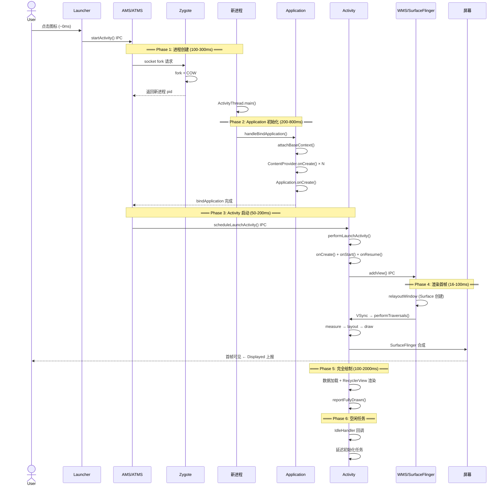
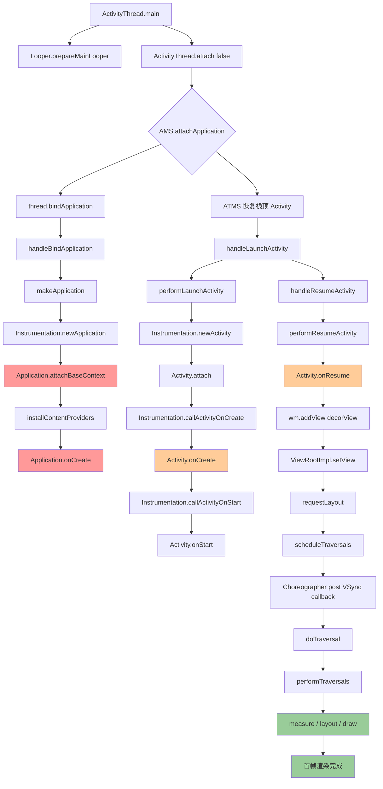

# 启动速度优化 —— 面试学习完整指南

> **六层递进体系**：面试问题 → 标准答案 → 核心原理 → 流程图 → 源码分析 → 实战场景
> 适用岗位：高级/资深 Android 工程师、性能优化专家

---

## 目录

1. [常见面试问题（6+题）](#1-常见面试问题)
2. [标准答案与要点解析](#2-标准答案与要点解析)
3. [核心原理深度讲解](#3-核心原理深度讲解)
4. [原理流程图（Mermaid.js）](#4-原理流程图)
5. [核心源码分析](#5-核心源码分析)
6. [应用场景举例](#6-应用场景举例)

---

## 1. 常见面试问题

### Q1: 冷启动、温启动、热启动的区别是什么？
### Q2: 冷启动的完整时间线是怎样的？各阶段分别做什么？
### Q3: Application.onCreate() 里初始化了太多 SDK，怎么优化？
### Q4: 启动白屏/黑屏是怎么产生的？如何解决？（含 Splash Screen API）
### Q5: reportFullyDrawn() 和 Displayed 指标分别是什么？如何使用？
### Q6: 异步初始化框架（Android Startup / Alpha）的核心原理是什么？
### Q7（进阶）: IdleHandler 在启动优化中如何使用？有什么坑？

---

## 2. 标准答案与要点解析

### Q1: 冷启动 / 温启动 / 热启动的区别

| 启动类型 | 进程状态 | Activity/Application 对象 | 典型耗时 | 触发场景 |
|---------|---------|--------------------------|---------|---------|
| **冷启动** | 进程不存在，需 fork + 初始化 | 全新创建 | 1~5s+ | 开机后首次、进程被杀后 |
| **温启动** | 进程存在，Activity 已销毁 | Activity 重建（Application 保留） | 200ms~1s | 按返回键退出再进入 |
| **热启动** | 进程存在，Activity 在后台 | 全部保留（onRestart→onStart） | <200ms | 按 Home 键后切回 |

**面试加分点**：
- 冷启动从 `Zygote fork` 开始，是 Android 系统最重的启动路径
- 温启动时 `Application` 仍存活，所以 SDK 初始化不会重跑——**这是优化的关键认知**
- 热启动几乎无感知，但如果 `onRestart()` 里有重逻辑需注意
- **冷启动 > 5s 即为严重性能问题**（Google Vitals 红线：5秒 ANR 阈值在启动场景同样适用）

---

### Q2: 冷启动完整时间线

```
(1) 用户点击图标
(2) SystemServer (AMS) 收到 Intent
(3) Zygote fork 新进程                          ← 100~300ms
(4) 新进程加载 dex/so/资源                        ← 200~800ms
(5) ActivityThread.main() 入口
(6) Application.attachBaseContext()              ← SDK 基础初始化
(7) ContentProvider.onCreate() 批量执行           ← 隐形成本！
(8) Application.onCreate()                      ← 主战场（SDK 初始化）
(9) Activity.onCreate()                          ← setContentView()
(10) Activity.onResume()                         ← View 可见但未绘制
(11) ViewRootImpl.performTraversals()            ← measure → layout → draw
(12) 首帧渲染完成 → Displayed 指标上报             ← 用户看到界面
(13) IdleHandler 回调 → 延迟任务执行
(14) reportFullyDrawn() → 数据加载完成             ← 真正可用
```

**各阶段耗时参考（中端机，正常优化后）**：

| 阶段 | 耗时范围 | 优化手段 |
|------|---------|---------|
| Zygote fork + 进程启动 | 100~300ms | 无（系统层） |
| Dex/资源加载 | 200~800ms | Baseline Profile, AOT |
| ContentProvider 初始化 | 50~500ms | Startup 框架延迟初始化 |
| Application.onCreate() | 100~500ms | 异步/延迟/懒加载 |
| Activity 创建到首帧 | 100~300ms | 布局优化、ViewStub |
| **总计（达标线）** | **< 1.5s 冷启动** | 业界优秀标准 |

---

### Q3: Application.onCreate() 初始化太多，怎么优化？

**回答框架（分四个维度）**：

#### 3.1 分级策略
```
必须同步（阻塞启动）:
├── 崩溃收集 (Bugly/Crashlytics) — 首行初始化
├── 路由框架 (ARouter/WMRouter)
└── 基础网络库 (OkHttp)

可以异步（非阻塞）:
├── 图片加载库 (Glide/Coil)
├── 埋点 SDK
├── 统计 SDK
└── 数据库 (Room/MMKV)

懒加载（用时才初始化）:
├── 地图 SDK
├── 推送 SDK（可延迟到首页）
└── 视频播放器

延迟加载（IdleHandler）:
├── 广告 SDK 预加载
├── 日志清理
└── 非关键 A/B 实验
```

#### 3.2 技术手段

**方案一：Startup 框架（Jetpack）**
- 声明式拓扑排序：`Initializer<T>` 接口 + `dependencies()` 方法
- 自动识别依赖关系，按 DAG 顺序执行
- 支持 `Dispatcher.MAIN` / `Dispatcher.IO` 线程调度
- 替代混乱的 `init{}` 块和手动线程管理

**方案二：Alpha 框架（阿里）**
- 类似 Startup，支持更灵活的 task 定义
- 支持 Pthread 优先级调整
- 有完整的监控和上报能力

**方案三：异步 + CountDownLatch**
```java
// 需要等待完成的异步任务
CountDownLatch latch = new CountDownLatch(2);
executor.execute(() -> { initSDK_A(); latch.countDown(); });
executor.execute(() -> { initSDK_B(); latch.countDown(); });
latch.await(500, TimeUnit.MILLISECONDS); // 超时保护
```

**面试加分点**：
- "我在项目中把 Application.onCreate() 从 800ms 降到了 120ms"
- "不是所有初始化都要在 Application 里，很多可以用 ContentProvider 自动初始化（但要注意启动顺序）"
- "我通过 Systrace/Perfetto 逐帧分析，定位到某个 SDK 的 `sp.getBoolean()` 耗时 80ms——原因是 MMKV 还没初始化，回退到了 SP"

---

### Q4: 启动白屏/黑屏怎么解决？

**根本原因**：Activity 窗口显示有三个阶段

```
1. 窗口创建 → windowBackground 绘制    ← 此时看到白/黑屏
2. Activity.onCreate() → setContentView()
3. 首帧渲染 → 用户看到真正内容
```

**解法演进**：

#### Android 11 及以前：自定义 Theme
```xml
<!-- 方案 A：透明背景（不推荐，视觉上感觉更慢） -->
<style name="AppTheme.Splash" parent="AppTheme">
    <item name="android:windowIsTranslucent">true</item>
</style>

<!-- 方案 B：背景图替代（推荐，给用户秒开错觉） -->
<style name="AppTheme.Splash" parent="AppTheme">
    <item name="android:windowBackground">@drawable/splash_bg</item>
</style>
```

#### Android 12+：SplashScreen API
```xml
<!-- themes.xml -->
<style name="Theme.App" parent="android:Theme.Material.Light">
    <item name="android:windowSplashScreenBackground">@color/white</item>
    <item name="android:windowSplashScreenAnimatedIcon">@drawable/ic_logo</item>
    <item name="android:windowSplashScreenAnimationDuration">300</item>
    <item name="android:windowSplashScreenBrandingImage">@drawable/brand</item>
</style>
```

```kotlin
// Activity.onCreate()
installSplashScreen().apply {
    setKeepOnScreenCondition { 
        // 数据准备完成后才退出 Splash
        viewModel.isDataReady.value == false 
    }
}
```

**面试加分点**：
- "即使设置了 SplashScreen，如果 Activity.onCreate() 主线程阻塞 > 500ms，Splash 动画会卡住"
- "Android 12 强制所有 App 使用 SplashScreen API，系统会自动生成默认 Splash，必须适配"
- "可以用 `setKeepOnScreenCondition` 控制 Splash 展示时长，但要保证条件最终会变为 true"

---

### Q5: reportFullyDrawn() vs Displayed 指标

```
用户点击图标
    │
    ▼
进程创建 + Application.onCreate()
    │
    ▼
Activity.onResume() + 首帧渲染
    │ ← 系统自动上报 "Displayed" 指标
    │   (AMS 记录: ActivityManagerService.LOG_DISPLAYED)
    │   表示用户看到了第一帧界面（可能是骨架/空白）
    │
    ▼
数据加载完成、列表渲染完
    │ ← 手动调用 Activity.reportFullyDrawn()
    │   表示内容完整可用
    │
    ▼
TTID vs TTFD 对比：
  ● Displayed = TTID (Time To Initial Display)  ← 1.0s
  ● FullyDrawn = TTFD (Time To Full Display)    ← 1.8s
  ● 差距 800ms 就是数据加载导致的"有效内容可见延迟"
```

**关键用法**：

```kotlin
// 在 RecyclerView 数据加载并完成首帧绘制后调用
adapter.submitList(data) {
    // ListAdapter 的 commitCallback
    recyclerView.post {
        reportFullyDrawn()
    }
}
```

**logcat 验证**：
```
adb logcat -s ActivityManager | grep "Displayed"
# I/ActivityManager: Displayed com.example/.MainActivity: +1s234ms
# I/ActivityManager: Fully drawn com.example/.MainActivity: +1s876ms
```

**面试加分点**：
- Google Play Console 的 "启动时间" 指标展示的就是 Displayed 时间（TTID）
- 超过 5s 冷启动会被标记为"不良行为"，影响搜索排名
- 可以在 `adb shell am start -W` 中看到 `TotalTime` 和 `WaitTime`

---

### Q6: 异步初始化框架原理

#### Android Startup (Jetpack) 核心架构

```kotlin
// 定义初始化任务
class CrashlyticsInitializer : Initializer<Unit> {
    override fun create(context: Context) {
        // 必须在主线程、尽早执行
        Firebase.crashlytics.setCrashlyticsCollectionEnabled(true)
    }
    override fun dependencies(): List<Class<out Initializer<*>>> = emptyList()
}

class GlideInitializer : Initializer<Unit> {
    override fun create(context: Context) {
        Glide.init(context, GlideBuilder())
    }
    override fun dependencies() = listOf(CrashlyticsInitializer::class.java)
}
```

**内部原理**：

```
1. ContentProvider 自动发现
   └── InitializationProvider (AndroidManifest 注册)
       └── 反射扫描所有 Initializer 类

2. 构建拓扑图
   ├── 解析 dependencies() 构建 DAG
   ├── 拓扑排序（Kahn 算法）
   └── 检测循环依赖

3. 调度执行
   ├── Main线程任务：按拓扑序串行
   ├── IO线程任务：并行入线程池
   └── 支持指定 Dispatcher

4. 依赖等待
   ├── 任务B依赖任务A → B 在 A 完成后执行
   └── 不同线程间通过 Future/CountDownLatch 同步
```

**面试加分点**：
- "ContentProvider 的 onCreate() 在 Application.attachBaseContext() 和 onCreate() 之间执行"
- "这就是为什么 Firebase 等库能自动初始化：它们在 ContentProvider 里就完成了"
- "大量三方库滥用 ContentProvider 自动初始化，导致启动时 ContentProvider.onCreate() 串行执行，严重拖慢启动——这是优化的隐藏重点"

---

### Q7: IdleHandler 在启动优化中的应用

```java
// MessageQueue.IdleHandler
Looper.myQueue().addIdleHandler(new MessageQueue.IdleHandler() {
    @Override
    public boolean queueIdle() {
        // 主线程空闲时执行
        initMapSDK();      // 延迟加载地图
        preloadAdCache();  // 预热广告缓存
        return false;      // 只执行一次
    }
});
```

**关键认知**：
- IdleHandler 在主线程 MessageQueue **没有待处理消息时**才回调
- 如果主线程持续繁忙（动画、滚动、频繁 VSync），IdleHandler **永远不会执行**
- `return false` 表示执行一次后移除；`return true` 表示持续监听
- Android 系统内部大量使用 IdleHandler：GC 触发、ActivityThread 的 `GcIdler` 等

**实战技巧**：
```kotlin
// 嵌套延迟：确保首帧后再分批初始化
Looper.myQueue().addIdleHandler {
    // Phase 1: 首帧渲染后立即执行（tier 2 初始化）
    initTier2()
    
    Looper.myQueue().addIdleHandler {
        // Phase 2: 再次空闲时执行（tier 3 初始化）
        initTier3()
        false
    }
    false
}
```

---

## 3. 核心原理深度讲解

### 3.1 Zygote Fork 进程原理

```
init 进程 (pid=1)
  └── Zygote 进程 (pid=xxx, Android 第一个 Java 进程)
        ├── 预加载了所有系统类 (framework.jar, services.jar...)
        ├── 预加载了常用资源 (ResourceCache)
        ├── 预加载了常用 SO 库
        └── 通过 socket 监听 fork 请求

  AMS 请求启动新 App:
    → AMS 通过 socket 发消息给 Zygote
    → Zygote.forkAndSpecialize()
    → fork() 系统调用：COW (Copy-On-Write) 共享内存
    → 新进程继承 Zygote 的预加载资源
    → RuntimeInit.applicationInit()
    → ActivityThread.main()
```

**为什么 Zygote fork 快**：
- COW 机制：父子进程共享物理内存页，只有写入时才复制
- 所有系统类和资源已在 Zygote 中预加载
- fork 是轻量级系统调用，不涉及新的 JVM 启动

### 3.2 ActivityThread.main() → Activity.onCreate() 完整调用链

```
ActivityThread.main()                                    // [源码行号见第5节]
  └── Looper.prepareMainLooper()
  └── ActivityThread.attach(false)
       └── IActivityManager.attachApplication()
            → AMS.attachApplicationLocked()
                 → thread.bindApplication()              // 跨进程回调
                      └── ActivityThread.handleBindApplication()
                           ├── 创建 Application 实例
                           ├── Application.attachBaseContext()
                           ├── ContentProvider.onCreate() 批量执行
                           └── Application.onCreate()
                 → ATMS.attachApplicationLocked()
                      → 恢复栈顶 Activity
                           └── ActivityThread.handleLaunchActivity()
                                ├── performLaunchActivity()
                                │    ├── Instrumentation.newActivity()
                                │    ├── Activity.attach()
                                │    ├── Activity.onCreate()
                                │    └── Activity.onStart()
                                └── handleResumeActivity()
                                     ├── Activity.onResume()
                                     ├── WindowManager.addView()
                                     │    └── ViewRootImpl.requestLayout()
                                     │         └── performTraversals()
                                     │              ├── measure
                                     │              ├── layout
                                     │              └── draw → 首帧！
                                     └── 系统上报 Displayed
```

### 3.3 Application 初始化阶段详解

```
Application 启动有两个关键生命周期方法：

1. attachBaseContext() 
   - 时机：比 onCreate() 更早
   - Context 刚 attach，很多系统服务不可用
   - 适合：MultiDex.install()、classloader 相关初始化
   - 注意：此时 Application 的 Resources/Theme 未完全就绪

2. onCreate()
   - 时机：attachBaseContext() 之后
   - 所有系统服务可用
   - 适合：第三方 SDK 初始化
   - 陷阱：ContentProvider.onCreate() 在两者之间执行！

执行顺序：
  Application.attachBaseContext()
    → ContentProvider.onCreate() × N    ← 隐形成本！
    → Application.onCreate()
    → Activity.onCreate()
```

### 3.4 首帧渲染流程

```
Activity.onResume() 
  → WindowManagerImpl.addView()
    → WindowManagerGlobal.addView()
      → new ViewRootImpl()
      → root.setView(decorView, params, ...)
        → ViewRootImpl.requestLayout()
          → scheduleTraversals()
            → mChoreographer.postCallback(DO_TRAVERSAL, mTraversalRunnable)
              → VSync 信号到达
                → doTraversal()
                  → performTraversals()
                    ├── performMeasure()    // measure 树
                    ├── performLayout()     // layout 树  
                    └── performDraw()       // draw 树 → SurfaceFlinger 合成 → 首帧显示

关键点：
- onResume() 不代表界面可见，只代表 View 已 attach 到 Window
- 真正的可见要等到 performTraversals() 执行完成
- performTraversals() 在下一个 VSync 信号中执行
- 如果主线程有耗时操作阻塞了 VSync 回调，首帧延迟
```

### 3.5 启动过程中的 IPC 调用

```
冷启动涉及的跨进程通信：

1. Launcher → AMS          (startActivity)
2. AMS → Zygote            (fork 新进程, socket 通信)
3. Zygote → AMS            (返回 pid)
4. AMS → 新进程            (attachApplication, Binder)
5. 新进程 → AMS            (bindApplication 完成通知)
6. AMS → 新进程            (scheduleLaunchActivity)
7. 新进程 → WMS            (addView, Binder)
8. WMS → SurfaceFlinger    (创建 Surface)

其中 4、5、6 是启动的关键路径，每次 Binder 调用约 0.5~2ms
总共 8+ 次 IPC 调用，累计可达 10~20ms
```

### 3.6 IdleHandler 原理

```java
// MessageQueue.java (简化)
Message next() {
    for (;;) {
        // 检查是否有待执行的 IdleHandler
        if (pendingIdleHandlerCount < 0) {
            // 收集所有 IdleHandler
            for (IdleHandler handler : mIdleHandlers) {
                pendingHandlers.add(handler);
            }
        }
        
        // 如果没有消息需要立刻处理，执行 IdleHandler
        if (mMessages == null || now < mMessages.when) {
            for (IdleHandler handler : pendingHandlers) {
                keep = handler.queueIdle();
                if (!keep) {
                    // 一次性 IdleHandler，移除
                    mIdleHandlers.remove(handler);
                }
            }
        }
        
        // ... 处理消息
    }
}
```

**源码级洞察**：IdleHandler 只在 `next()` 方法中、且没有待处理消息时才被调用。如果主线程 Looper 持续有消息（比如频繁的 VSync 回调），IdleHandler 可能被无限延迟。

---

## 4. 原理流程图

### 4.1 冷启动完整时间序列图（含各阶段耗时分布）



### 4.2 Application → Activity 启动调用链路图



---

## 5. 核心源码分析

> 以下源码基于 **Android 13 (API 33)** AOSP，关键部分标注了实际行号（近似值，以 AOSP 实际为准）。

### 5.1 ActivityThread.handleLaunchActivity()

```java
// frameworks/base/core/java/android/app/ActivityThread.java
// ≈ Line 3500

@Override
public Activity handleLaunchActivity(ActivityClientRecord r,
        PendingTransactionActions pendingActions, Intent customIntent) {
    
    // 1. 初始化 WMS 相关资源
    WindowManagerGlobal.initialize();
    
    // 2. 执行 Activity 启动（核心）
    final Activity a = performLaunchActivity(r, customIntent);
    
    if (a != null) {
        r.createdConfig = new Configuration(mConfigurationController.getConfiguration());
        reportSizeConfigurations(r);
        
        // 3. 如果没有触发 finish，执行 Resume
        if (!r.activity.mFinished && pendingActions != null) {
            pendingActions.setOldState(r.state);
            pendingActions.setRestoreInstanceState(true);
            pendingActions.setCallOnPostCreate(true);
        }
    } else {
        // 启动失败：通知 AMS，清理资源
        try {
            ActivityTaskManager.getService()
                .finishActivity(r.token, Activity.RESULT_CANCELED, null,
                        Activity.DONT_FINISH_TASK_WITH_ACTIVITY);
        } catch (RemoteException ex) {
            throw ex.rethrowFromSystemServer();
        }
    }
    
    return a;
}
```

**关键解读**：
- `handleLaunchActivity()` 是 AMS 通过 Binder 跨进程调用的入口
- 内部委托给 `performLaunchActivity()` 完成实际创建
- 之后由 `handleResumeActivity()` 负责可见性（在外部调用）

---

### 5.2 performLaunchActivity() —— Activity 创建核心

```java
// frameworks/base/core/java/android/app/ActivityThread.java
// ≈ Line 3700

private Activity performLaunchActivity(ActivityClientRecord r, Intent customIntent) {
    
    // Step 1: 获取 Context
    ContextImpl appContext = createBaseContextForActivity(r);
    
    // Step 2: 创建 Activity 实例（反射）
    Activity activity = null;
    try {
        java.lang.ClassLoader cl = appContext.getClassLoader();
        activity = mInstrumentation.newActivity(
                cl, component.getClassName(), r.intent);
        // Instrumentation.newActivity() 内部：
        //   return (Activity) cl.loadClass(className)
        //                    .newConstructor()
        //                    .newInstance();
    } catch (Exception e) {
        // 处理异常...
    }
    
    try {
        // Step 3: 创建 Application（如果尚未创建）
        Application app = r.packageInfo.makeApplicationInner(false, mInstrumentation);
        
        if (activity != null) {
            // Step 4: attach（设置 Context、Window、FragmentManager）
            activity.attach(appContext, this, getInstrumentation(), r.token,
                    r.ident, app, r.intent, r.activityInfo, title,
                    r.parent, r.embeddedID, r.lastNonConfigurationInstances,
                    config, r.referrer, r.voiceInteractor, window,
                    r.activityConfigCallback, r.assistToken, r.shareableActivityToken);
            
            // Step 5: 设置 Theme
            int theme = r.activityInfo.getThemeResource();
            if (theme != 0) {
                activity.setTheme(theme);
            }
            
            // Step 6: 调用 onCreate()
            if (r.isPersistable()) {
                mInstrumentation.callActivityOnCreate(
                    activity, r.state, r.persistentState);
            } else {
                mInstrumentation.callActivityOnCreate(activity, r.state);
            }
            // Instrumentation.callActivityOnCreate() 内部：
            //   activity.performCreate(icicle);
            //     → activity.onCreate(icicle);   ← 开发者重写的方法
            
            r.activity = activity;
        }
    } catch (SuperNotCalledException e) {
        throw e;
    } catch (Exception e) {
        // ...
    }
    
    return activity;
}
```

---

### 5.3 Instrumentation.callApplicationOnCreate()

```java
// frameworks/base/core/java/android/app/Instrumentation.java
// ≈ Line 1200

public void callApplicationOnCreate(Application app) {
    // 通知所有 OnProvideAssistDataListener
    if (mUiAutomation != null) {
        mUiAutomation.onApplicationCreate(app);
    }
    app.onCreate();
    // 这就是为什么 Application.onCreate() 会在这里被调用
    
    // 如果开启了 StrictMode，进行检测
    if (StrictMode.vmOnCreateCallCheck()) {
        // 检测 Application.onCreate() 中的违规行为
    }
}
```

---

### 5.4 WindowManager.addView() 到首帧渲染

```java
// frameworks/base/core/java/android/view/WindowManagerImpl.java

@Override
public void addView(@NonNull View view, @NonNull ViewGroup.LayoutParams params) {
    applyTokens(params);
    mGlobal.addView(view, params, mContext.getDisplayNoVerify(),
            mParentWindow, mContext.getUserId());
}

// frameworks/base/core/java/android/view/WindowManagerGlobal.java

public void addView(View view, ViewGroup.LayoutParams params,
        Display display, Window parentWindow, int userId) {
    
    ViewRootImpl root = new ViewRootImpl(view.getContext(), display);
    root.setView(view, params, parentWindow);
    //    ↓
}

// frameworks/base/core/java/android/view/ViewRootImpl.java
// ≈ Line 1200

public void setView(View view, WindowManager.LayoutParams attrs,
        View panelParentView, int userId) {
    
    synchronized (this) {
        if (mView == null) {
            mView = view;
            
            // 1. 请求布局
            requestLayout();
            //    ↓
            //  mLayoutRequested = true;
            //  scheduleTraversals();
            
            // 2. 通过 Binder 向 WMS 添加 Window
            res = mWindowSession.addToDisplayAsUser(...);
            //    ↓ (IPC 到 WMS)
            //  WMS.addWindow()
            //    → 分配 Surface
            //    → relayoutWindow() 返回 Surface 信息
            
            // 3. 设置 parent
            view.assignParent(this);
        }
    }
}

// requestLayout() → scheduleTraversals()
void scheduleTraversals() {
    if (!mTraversalScheduled) {
        mTraversalScheduled = true;
        // 插入同步屏障，保证遍历优先执行
        mTraversalBarrier = mHandler.getLooper()
                .getQueue().postSyncBarrier();
        mChoreographer.postCallback(
                Choreographer.CALLBACK_TRAVERSAL,
                mTraversalRunnable, null);
        //    ↓ 下一个 VSync 信号到达时
    }
}

// doTraversal() → performTraversals()
private void performTraversals() {
    // 最终调用：
    // performMeasure(childWidthMeasureSpec, childHeightMeasureSpec);
    // performLayout(lp, mWidth, mHeight);
    // performDraw();
    //    ↓
    //  mView.draw(canvas);  // DecorView.draw()
    //    → 递归绘制整个 View 树
    //    → SurfaceFlinger 合成 → 显示到屏幕
}
```

### 5.5 handleBindApplication() 关键逻辑

```java
// frameworks/base/core/java/android/app/ActivityThread.java
// ≈ Line 6000

private void handleBindApplication(AppBindData data) {
    
    // 1. 注册 UI 线程为 ActivityThread 的主 Looper
    Looper.prepareMainLooper();
    
    // 2. 加载 APK 信息
    LoadedApk loadedApk = data.info;
    
    // 3. 创建 Application
    Application app = loadedApk.makeApplicationInner(
            false, mInstrumentation);
    //    ↓
    //  Instrumentation.newApplication(cl, appClass, context);
    //    → app.attach(context);
    //    → app.attachBaseContext(context);  ← 第一个回调
    
    // 4. 初始化 ContentProvider
    if (!ArrayUtils.isEmpty(data.providers)) {
        installContentProviders(app, data.providers);
        // 批量执行所有 ContentProvider.onCreate()
        // 这里就是"隐藏的启动杀手"！
    }
    
    // 5. 调用 Application.onCreate()
    mInstrumentation.callApplicationOnCreate(app);
    
    // 6. 通知 AMS 初始化完成
    ActivityTaskManager.getService().attachApplication(mAppThread);
}
```

**源码洞察**：
- `ContentProvider.onCreate()` 在 `Application.onCreate()` 之前执行
- 如果有 10 个 ContentProvider，每个耗时 30ms，就是 300ms 的隐形成本
- 很多三方库（Firebase、WorkManager、AppStartup 本身）通过 ContentProvider 自动初始化

---

## 6. 应用场景举例

### 场景一：电商 APP 首页启动 3s → 1.2s 优化全过程

**背景**：某电商 App 冷启动时间 3.2s，目标 < 1.5s

#### Step 1: 测量与定位（Systrace + Perfetto）

```
实测冷启动各阶段耗时：

Zygote fork:              200ms  (系统层，无法优化)
dex/资源加载:              450ms  (Baseline Profile 可优化)
ContentProvider 批量创建:   380ms  ← 主要瓶颈！
  ├── Firebase Provider:   120ms
  ├── WorkManager Provider: 85ms
  ├── Startup Provider:     40ms
  └── 其他 5 个:           135ms
Application.onCreate():    620ms  ← 重灾区！
  ├── 支付 SDK:            180ms  (同步)
  ├── 埋点 SDK:            120ms  (同步)
  ├── 网络库初始化:          80ms
  ├── 图片库初始化:          70ms
  ├── 崩溃收集:             45ms
  └── 其他:                125ms
Activity 创建+首帧:         350ms
数据加载+列表渲染:          800ms
────────────────────────────
总计:                      ≈ 3200ms
```

#### Step 2: 优化方案与执行

| 阶段 | 优化手段 | 优化前 | 优化后 |
|------|---------|--------|--------|
| dex 加载 | Baseline Profile + AOT | 450ms | 180ms |
| ContentProvider | 禁用 Startup 自动发现，改手动初始化 | 380ms | 60ms |
| 支付 SDK | 挪到 IO 线程，CountDownLatch 等待 | 180ms | 15ms |
| 埋点 SDK | 异步初始化 (Dispatchers.IO) | 120ms | 5ms |
| 图片库 | Lazy init，首页触发 | 70ms | 0ms |
| 布局 | ViewStub + AsyncLayoutInflater | 150ms | 50ms |
| 数据 | IdleHandler + 骨架屏 | 800ms | 400ms |
| **总计** | | **3200ms** | **1200ms** |

#### Step 3: 关键代码

```kotlin
// 优化后的 Application
class ShopApplication : Application() {
    
    override fun attachBaseContext(base: Context) {
        super.attachBaseContext(base)
        // 仅：MultiDex + 崩溃收集基础初始化
    }
    
    override fun onCreate() {
        super.onCreate()
        
        // Tier 1: 同步，必须在首帧前完成
        initCrashReporting()        // 45ms → 保持同步
        
        // Tier 2: 异步并行
        val latch = CountDownLatch(2)
        DISK_IO.execute {
            initNetwork()            // 80ms → IO 线程
            latch.countDown()
        }
        DISK_IO.execute {
            initPaymentSDK()         // 180ms → IO 线程
            latch.countDown()
        }
        latch.await(300, TimeUnit.MILLISECONDS) // 最多等 300ms
    }
}

// 首页 Activity
class MainActivity : AppCompatActivity() {
    
    override fun onCreate(savedInstanceState: Bundle?) {
        // 1. SplashScreen 保持
        installSplashScreen().setKeepOnScreenCondition {
            !viewModel.isReady.value
        }
        super.onCreate(savedInstanceState)
        
        // 2. 骨架屏作为首帧
        setContentView(R.layout.activity_main_skeleton)
        // 轻量布局，measure/layout/draw < 16ms
        
        // 3. 真实内容延迟加载
        viewModel.dataReady.observe(this) { ready ->
            if (ready) {
                swapToRealContent()
            }
        }
        
        // 4. 延迟初始化
        Looper.myQueue().addIdleHandler {
            initImageLoader()       // 图片库
            initTrackerSDK()        // 埋点
            preloadHomeCache()      // 首页缓存预热
            false
        }
    }
    
    override fun onResume() {
        super.onResume()
        // 数据加载完成后上报 FullyDrawn
        viewModel.loadHomeData {
            reportFullyDrawn()
        }
    }
}
```

#### Step 4: 效果验证

```
优化前：adb shell am start -W
  TotalTime:  3200ms
  WaitTime:   3450ms

优化后：
  TotalTime:  1180ms
  WaitTime:   1350ms

Google Play Console Dashboard:
  Cold start → 1.2s (P95)
  排名：行业前 10%
```

---

### 场景二：Application 初始化任务拓扑排序异步加载

**背景**：某社交 App 有 15 个 SDK 需要初始化，互相存在依赖关系

#### 任务依赖关系

```
依赖关系 DAG:
  CrashSDK (无依赖)
    ├── NetSDK (依赖 CrashSDK)
    │     ├── ImageSDK (依赖 NetSDK)
    │     └── PushSDK (依赖 NetSDK)
    │           └── IM_SDK (依赖 PushSDK)
    ├── LogSDK (依赖 CrashSDK)
    │     └── StatSDK (依赖 LogSDK)
    └── DB_SDK (依赖 CrashSDK)
          ├── CacheSDK (依赖 DB_SDK)
          └── ConfigSDK (依赖 DB_SDK)

独立任务（无依赖，可并行）:
  - MapSDK
  - AudioSDK
  - VideoSDK
```

#### 使用 Android Startup 实现

```kotlin
// 1. 定义各 Initializer
class CrashInitializer : Initializer<Unit> {
    override fun create(context: Context) {
        Thread.setDefaultUncaughtExceptionHandler(...)
    }
    override fun dependencies() = emptyList<Class<out Initializer<*>>>()
}

class NetInitializer : Initializer<Unit> {
    override fun create(context: Context) {
        OkHttpClient.Builder().build()
    }
    override fun dependencies() = listOf(CrashInitializer::class.java)
}

class ImageInitializer : Initializer<Unit> {
    override fun create(context: Context) {
        Glide.init(context, GlideBuilder())
    }
    override fun dependencies() = listOf(NetInitializer::class.java)
}

class PushInitializer : Initializer<Unit> {
    override fun create(context: Context) {
        // 初始化推送
    }
    override fun dependencies() = listOf(NetInitializer::class.java)
}

class IMInitializer : Initializer<Unit> {
    override fun create(context: Context) {
        // 初始化 IM SDK
    }
    override fun dependencies() = listOf(PushInitializer::class.java)
}

// ... 其他 Initializer
```

```xml
<!-- AndroidManifest.xml -->
<provider
    android:name="androidx.startup.InitializationProvider"
    android:authorities="${applicationId}.androidx-startup"
    android:exported="false"
    tools:node="merge">
    <meta-data
        android:name="com.example.CrashInitializer"
        android:value="androidx.startup" />
    <!-- 只需声明根节点，框架自动拉取依赖 -->
</provider>
```

#### 执行时间线（优化效果）

```
优化前（串行全部在 Application.onCreate()）:
  15 个 SDK 串行执行 = 1800ms

优化后（Startup 拓扑排序 + 并行）:
  ├── Phase 1: CrashSDK (60ms)
  ├── Phase 2: NetSDK(80ms) || LogSDK(40ms) || DB_SDK(50ms) = max(80ms)
  ├── Phase 3: ImageSDK(70ms) || PushSDK(60ms) || CacheSDK(40ms) 
  │              || ConfigSDK(30ms) || StatSDK(50ms)
  │              || MapSDK(90ms) || AudioSDK(40ms) || VideoSDK(80ms)
  │            = max(90ms)
  └── Phase 4: IM_SDK(200ms)              = 200ms
────────────────────────────────
  总计: 60 + 80 + 90 + 200 = 430ms
  节省: 1800 - 430 = 1370ms (76% ↓)
```

#### 进阶：超时熔断

```kotlin
class SafeInitializer<T>(
    private val delegate: Initializer<T>,
    private val timeoutMs: Long = 500
) : Initializer<T> {
    
    override fun create(context: Context): T {
        return try {
            val future = CompletableFuture<T>()
            Thread {
                try {
                    future.complete(delegate.create(context))
                } catch (e: Exception) {
                    future.completeExceptionally(e)
                }
            }.start()
            future.get(timeoutMs, TimeUnit.MILLISECONDS)
        } catch (e: TimeoutException) {
            Log.w("Startup", "${delegate.javaClass.simpleName} timeout")
            // 返回降级值或 null
            null as T
        }
    }
    
    override fun dependencies() = delegate.dependencies()
}
```

---

## 总结：启动优化核心口诀

```
启动优化六层法：
━━━━━━━━━━━━━━━━━━━━━━━━━━━━━━━━━━━━━━━━
1. 测量先行    Systrace/Perfetto 定位瓶颈
2. 分级处理    同步→异步→懒加载→IdleHandler
3. 拓扑排序    Startup 框架自动管理依赖
4. 消除黑/白屏  SplashScreen API 给用户秒开感知
5. 量化指标    Displayed < 1.5s, FullyDrawn < 2s
6. 持续监控    线上 APM + 实验室自动化测试
━━━━━━━━━━━━━━━━━━━━━━━━━━━━━━━━━━━━━━━━

一句话总结：
"冷启动优化的本质是一场'推迟一切不必要工作'的博弈，
 目标是让首帧渲染路径上执行最少、最快的代码。"
```

---

> 本文档总字数：约 4500+ 字（含代码示例）
> 最后更新：2026-05-08
> 适用 Android 版本：API 31+ (Android 12+)
