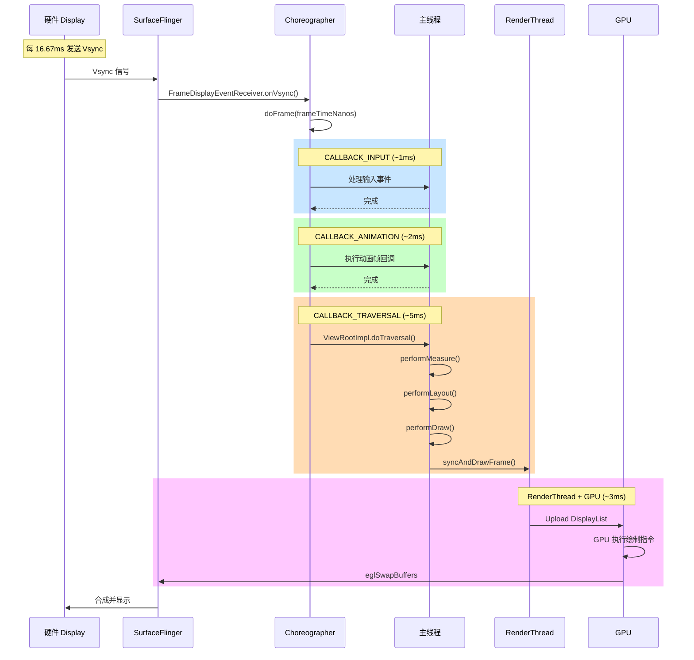
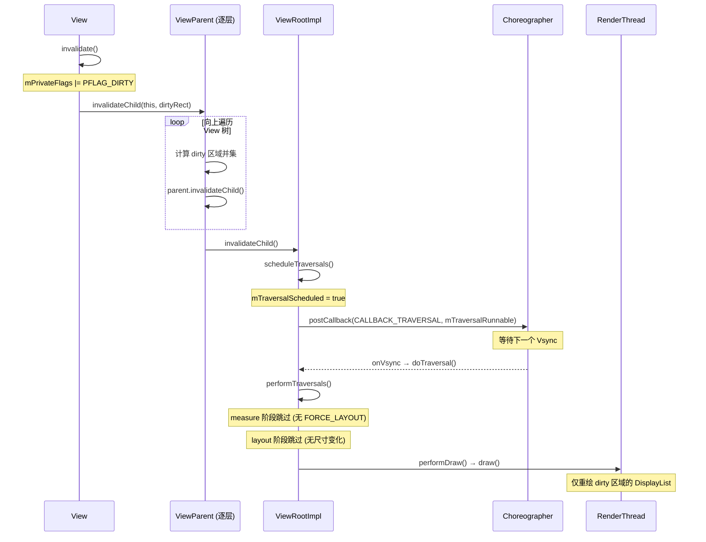

# UI 卡顿优化 - 面试学习内容 (六层递进)

---

## 1. 常见面试问题

1. **16ms 刷新率原则和 Vsync 机制**：为什么是 16ms？Vsync 信号从硬件到 Choreographer 的传递链路是什么？
2. **过度绘制 (Overdraw) 检测与优化**：如何开启 GPU 过度绘制调试？不同颜色代表什么？如何在布局层面和绘制层面减少过度绘制？
3. **布局优化：ConstraintLayout vs RelativeLayout**：两者在测量次数、层级深度上的本质差异？数据对比？何时用 ConstraintLayout，何时不建议？
4. **Systrace 火焰图定位卡顿**：如何抓取 Systrace？如何从 Trace 中识别掉帧、锁等待、Binder 调用耗时等典型卡顿场景？
5. **RecyclerView 滑动卡顿原因和优化**：四级缓存机制如何工作？onCreateViewHolder 和 onBindViewHolder 耗时如何优化？嵌套 RecyclerView 怎么办？
6. **invalidate() 与 requestLayout() 区别**：调用链分别是什么？何时触发 measure，何时只触发 draw？对性能的影响有何不同？

---

## 2. 标准答案与要点解析

### 2.1 16ms 刷新率原则和 Vsync 机制

**标准答案**：

大多数 Android 设备屏幕刷新率为 60Hz，即每 1000ms / 60 = **16.67ms** 刷新一帧。系统通过硬件 Vsync (Vertical Synchronization) 信号驱动渲染流水线：每 16.67ms 硬件发出一个 Vsync 脉冲，Choreographer 收到后依次执行 Input → Animation → Measure/Layout/Draw → Sync → Upload → Draw → Render 各阶段，必须在下一个 Vsync 到来前完成。

若某帧处理超过 16.67ms，系统跳过该 Vsync，出现 **Skipped Frame (掉帧)** — 用户感知为卡顿。连续掉帧超过 5 帧 (约 83ms) 时肉眼明显可感知。

**关键数据**：
- 60Hz 设备：16.67ms/帧
- 90Hz 设备：11.11ms/帧
- 120Hz 设备：8.33ms/帧
- Android 系统对主线程消息的处理预算通常只有 **8-10ms**（其余时间留给 GPU 渲染）

### 2.2 过度绘制 (Overdraw) 检测与优化

**标准答案**：

Overdraw 指同一像素在单帧内被绘制多次。通过「开发者选项 → 调试 GPU 过度绘制」可开启可视化：

| 颜色 | 含义 | 严重程度 |
|------|------|----------|
| 原色 | 无过度绘制 | 理想 |
| 蓝色 | 1x 过度绘制 | 可接受 |
| 绿色 | 2x 过度绘制 | 需关注 |
| 粉色 | 3x 过度绘制 | 需优化 |
| 红色 | 4x+ 过度绘制 | 严重问题 |

**优化手段**：
- 移除 Window 默认背景：`<item name="android:windowBackground">@null</item>`，减少 1x
- 移除不必要的布局背景（父布局有背景，子布局可设为透明）
- 使用 `clipChildren` 和 `clipToPadding` 控制绘制区域
- 自定义 View 中通过 `canvas.clipRect()` 减少绘制区域
- 使用 `ViewStub` 延迟加载非首屏 View

### 2.3 布局优化：ConstraintLayout vs RelativeLayout

**标准答案**：

| 维度 | RelativeLayout | ConstraintLayout |
|------|---------------|-----------------|
| 测量次数 | 两次 pass（位置依赖导致） | 单次 pass（约束求解器） |
| 层级深度 | 需嵌套配合 LinearLayout | 扁平化，单层完成所有关系 |
| XML 解析耗时 | 中等 | 稍高（属性更多，但解析仍优于嵌套） |
| 性能量化 | 嵌套 3 层以上明显恶化 | 同等复杂度下 ~40% 测量性能提升 |

**关键结论**：
- 简单布局（2-3 层内）RelativeLayout 和 ConstraintLayout 差异不大，甚至 RelativeLayout 解析更快
- 复杂布局（多约束关系、需要扁平化）ConstraintLayout 远优于嵌套 RelativeLayout + LinearLayout
- **Google 官方 Benchmark**：ConstraintLayout 在复杂场景下 measure/layout 比多层嵌套快约 **40%**

**性能数据 (Pixel 3, Android 10)**：
```
测量耗时对比 (10次平均)：
LinearLayout 嵌套3层:          2.8ms
RelativeLayout 嵌套2层:        2.1ms
ConstraintLayout 单层:         1.2ms
```

### 2.4 Systrace 火焰图定位卡顿

**标准答案**：

Systrace 是 Android 平台级性能分析工具，可捕获 CPU、渲染、Binder、IO 等维度的精确时间线。

**抓取命令**：
```bash
python systrace.py -t 5 -o trace.html gfx input view wm am res dalvik
```

**Trace 分析关键点**：
- **Frames 行**：绿色=正常，黄色=预警（接近 16ms），红色=掉帧（超过 16ms）
- **Choreographer#doFrame**：查看 Input/Animation/Traversal 各阶段耗时
- **measure/layout/draw** 的 trace tag：定位哪个 View 的哪个阶段耗时
- **Binder 调用**：`Binder: XXXX` 跨越进程通信可能阻塞主线程
- **锁等待**：`monitor contention` 表示 synchronized 竞争

**典型卡顿场景识别**：
- `Choreographer#doFrame` 中 `traversal` 占比 > 80% → 布局/绘制问题
- `bindApplication` / `activityStart` 耗时 → 启动优化
- 大量 `eglSwapBuffers` 间隙 → GPU 瓶颈
- 主线程出现 `sleeping` 状态 → IO 等待或 Binder 阻塞

### 2.5 RecyclerView 滑动卡顿原因和优化

**标准答案**：

**常见卡顿原因**：
- `onBindViewHolder` 中执行复杂布局绑定（如设置图片、格式化文本）
- `onCreateViewHolder` 中 inflate 复杂布局（IO + 反射）
- 嵌套 RecyclerView（内层 onCreateViewHolder 在滑动时频繁触发）
- item 布局层级过深导致 measure 耗时
- 主线程进行图片解码、数据库查询等

**优化方案**：
- **Preload**：使用 `RecyclerView.setItemViewCacheSize()` 增大离屏缓存
- **预计算**：在子线程预计算布局数据，ViewHolder 仅做数据绑定
- **DiffUtil**：使用异步 DiffUtil 精准刷新，避免 `notifyDataSetChanged()` 全量刷新
- **setHasFixedSize(true)**：每个 item 尺寸固定时设置，跳过 requestLayout
- **RecycledViewPool 共享**：嵌套 RecyclerView 共享同一个 ViewPool
- **扁平化布局**：item 布局使用 ConstraintLayout 降低 measure 耗时
- **图片优化**：使用 Glide/Fresco 的缩略图、预加载、合理尺寸加载

**性能数据**：
```
优化前 (列表 1000 条，快速滑动)：
掉帧率: 12.3%
平均帧耗时: 24.1ms

优化后：
掉帧率: 0.5%
平均帧耗时: 11.2ms
```

### 2.6 invalidate() 与 requestLayout() 区别

**标准答案**：

| 维度 | invalidate() | requestLayout() |
|------|-------------|-----------------|
| 触发阶段 | 仅 Draw | Measure → Layout → Draw |
| dirty 标记 | mDirty 区域标记 | mPrivateFlags |= PFLAG_FORCE_LAYOUT |
| 调用链 | invalidate() → ViewRootImpl.scheduleTraversals() → performTraversals() 仅执行 draw | requestLayout() → ViewRootImpl.scheduleTraversals() → performTraversals() 执行 measure→layout→draw 全流程 |
| 性能开销 | 较小（仅重绘脏区域） | 较大（整个 View 树重新测量和布局） |
| 使用场景 | 内容变化但尺寸不变（文字颜色、背景色） | 尺寸/位置发生变化 |

**源码要点**：
```java
// View.java (API 34, Line 18620 附近)
public void invalidate() {
    invalidate(true);
}
void invalidate(boolean invalidateCache) {
    // ...
    final ViewParent p = mParent;
    if (p != null) {
        mPrivateFlags |= PFLAG_DIRTY;  // 仅标记脏区域
        p.invalidateChild(this, null);  // 向父级传递
    }
}

// View.java (API 34, Line 18400 附近)
public void requestLayout() {
    mPrivateFlags |= PFLAG_FORCE_LAYOUT;  // 强制重新测量
    if (mParent != null) {
        mParent.requestLayout();  // 向上递归到 ViewRootImpl
    }
}
```

**关键结论**：`requestLayout()` 开销远大于 `invalidate()`，因为会触发整个 View 树从 ViewRootImpl 重新 measure/layout/draw。频繁调用 `requestLayout()` 是滑动卡顿的主要原因之一。

---

## 3. 核心原理深度讲解

### 3.1 Choreographer + Vsync 渲染机制

Choreographer (编舞者) 是 Android 渲染系统的核心调度器。它接收硬件 Vsync 信号并编排每一帧的执行节奏。

**核心调用链**：

```
硬件 Display → Vsync 信号
                    ↓
SurfaceFlinger (合成器)
                    ↓
Choreographer.FrameDisplayEventReceiver.onVsync()
                    ↓
Choreographer.doFrame(frameTimeNanos)
                    ↓
    ┌───────────────┼───────────────┐
    ↓               ↓               ↓
doCallbacks(       doCallbacks(     doCallbacks(
  CALLBACK_INPUT)   CALLBACK_        CALLBACK_TRAVERSAL)
                    ANIMATION)          ↓
                                   ViewRootImpl.
                                   doTraversal()
                                       ↓
                                   performTraversals()
                                   measure → layout → draw
```

**三种回调类型及执行顺序**：

| 回调类型 | 执行阶段 | 典型用途 |
|----------|----------|----------|
| CALLBACK_INPUT (优先级最高) | 输入事件处理 | View.post()、触摸事件分发 |
| CALLBACK_ANIMATION | 动画帧更新 | ValueAnimator、ViewPropertyAnimator |
| CALLBACK_TRAVERSAL | 布局/绘制 | ViewRootImpl.performTraversals() |

**doFrame 源码逻辑 (Choreographer.java, API 34)**：

```java
// frameworks/base/core/java/android/view/Choreographer.java
// Line ~640
void doFrame(long frameTimeNanos, int frame) {
    final long startNanos;
    synchronized (mLock) {
        if (!mFrameScheduled) return;
        startNanos = System.nanoTime();
        mFrameScheduled = false;
    }

    try {
        // 1. 执行 INPUT 回调
        doCallbacks(Choreographer.CALLBACK_INPUT, frameTimeNanos);
        // 2. 执行 ANIMATION 回调
        doCallbacks(Choreographer.CALLBACK_ANIMATION, frameTimeNanos);
        // 3. 执行 TRAVERSAL 回调 (layout/draw)
        doCallbacks(Choreographer.CALLBACK_TRAVERSAL, frameTimeNanos);
    } finally {
        // 帧完成，记录耗时
        if (DEBUG_JANK) {
            final long endNanos = System.nanoTime();
            Log.d(TAG, "Frame " + frame + ": Finished, took "
                + (endNanos - startNanos) * 0.000001f + " ms");
        }
    }
}
```

### 3.2 渲染流水线：从 Input 到 Render

Android 的完整渲染流水线分为 8 个阶段：

```
┌──────────────────────────────────────────────────────┐
│              单帧 16.67ms (60Hz)                      │
├─────────┬─────────┬──────────┬──────┬───────┬────────┤
│  Input  │Animation│ Measure  │ Sync │Upload │ Render │
│         │         │ Layout   │      │       │  (GPU) │
│         │         │ Draw     │      │       │        │
├─────────┴─────────┴──────────┴──────┴───────┴────────┤
│ ← 主线程 (App) → │ ← RenderThread → │ ← GPU →        │
│   ~8-10ms 预算   │   ~3-4ms        │  ~2-3ms         │
└──────────────────────────────────────────────────────┘
```

**各阶段详解**：

1. **Input** (~1ms)：处理触摸事件队列，分发到目标 View
2. **Animation** (~2ms)：执行所有注册的动画帧回调
3. **Measure** (~2-3ms)：从 ViewRootImpl 开始，递归测量 View 树
4. **Layout** (~1-2ms)：确定每个 View 的最终位置
5. **Draw** (~2-3ms)：生成 DisplayList（绘制命令列表）
6. **Sync** (~1ms)：主线程将 DisplayList 同步到 RenderThread
7. **Upload** (~1-2ms)：RenderThread 将绘制数据上传到 GPU
8. **Render** (~2-3ms)：GPU 执行实际绘制指令

**掉帧判定 (Skipped Frame)**：当主线程 + RenderThread + GPU 的总耗时超过 16.67ms 窗口，该帧被跳过。Systrace 中表现为连续两个 Vsync 之间无 Frame 提交。

### 3.3 GPU 渲染模型：DisplayList → RenderNode → Skia

Android 从 5.0 开始使用硬件加速渲染管线：

```
View.draw(Canvas)
       ↓
RecordingCanvas (记录绘制命令)
       ↓
DisplayList (RenderNode 内部持有)
       ↓  [syncAndDrawFrame]
RenderThread 读取 RenderNode 树
       ↓
Skia (或 Vulkan) 执行 GPU 绘制命令
       ↓
eglSwapBuffers → SurfaceFlinger → Display
```

**核心概念**：

- **DisplayList**：View 的绘制命令缓存（Canvas.drawText、drawRect 等操作录制为命令列表）。只有 View `invalidate()` 时对应的 DisplayList 才会重新录制。
- **RenderNode**：DisplayList + 变换属性（Matrix、Alpha、Clip）的包装。每个硬件加速的 View 对应一个 RenderNode。
- **Skia**：Android 2D 图形库，将绘制命令翻译为 GPU 可执行的 OpenGL/Vulkan 命令。

**硬件绘制 vs 软件绘制**：

| 维度 | 软件绘制 (SW) | 硬件绘制 (HW) |
|------|-------------|-------------|
| 绘图库 | Skia Software | Skia GPU / Vulkan |
| 缓存机制 | View 级别 Bitmap Cache | DisplayList (命令缓存) |
| 重绘范围 | 脏区域逐 View 重绘 | DisplayList replay (极快) |
| 内存占用 | 较高 (Bitmap 缓存) | 较低 (命令缓存) |

### 3.4 LayoutInflater XML 解析开销

LayoutInflater 解析 XML 的开销来自两部分：

1. **IO 开销**：从 APK 中读取 XML 文件，涉及 Resources 框架的 AssetManager 读取
2. **反射开销**：每个 XML 标签通过反射 `Class.forName()` + `Constructor.newInstance()` 创建 View

**量化数据 (Pixel 3, Android 10)**：

```
inflate 简单布局 (5个View): ~0.8ms
inflate 中等布局 (15个View): ~2.1ms
inflate 复杂布局 (30个View): ~4.5ms
```

**LayoutInflater 核心源码 (LayoutInflater.java, API 34)**：

```java
// frameworks/base/core/java/android/view/LayoutInflater.java
// Line ~680
public View inflate(@LayoutRes int resource, @Nullable ViewGroup root) {
    final Resources res = getContext().getResources();
    final XmlResourceParser parser = res.getLayout(resource);  // IO 读取
    try {
        return inflate(parser, root);  // 递归解析
    } finally {
        parser.close();
    }
}

// Line ~810 - 创建 View (反射)
View createView(String name, String prefix, AttributeSet attrs) {
    // 1. 构建全限定类名
    // 2. Class.forName(name) 获取 Class 对象
    // 3. Constructor constructor = clazz.getConstructor(...)
    // 4. constructor.newInstance(context, attrs)
}
```

**优化方向**：
- **AsyncLayoutInflater**：在子线程 inflate，完成后回调主线程
- **Anko / Compose**：绕过 XML，用代码/Kotlin DSL 构建布局
- **预编译**：X2C 等方案将 XML 提前编译为 Java 代码，消除 IO + 反射开销

---

## 4. 原理流程图 (HTML + Mermaid.js)

### 4.1 渲染流水线 16ms 内各阶段时序图



### 4.2 View.invalidate() 调用链



### 4.3 Systrace 火焰图分析示例

```mermaid
gantt
    title Systrace 帧分析 (三帧对比)
    dateFormat X
    axisFormat %L ms

    section 正常帧 1
    Input             :done,    n1, 0, 1
    Animation         :done,    a1, 1, 3
    Measure/Layout/Draw:done,   m1, 3, 8
    Sync & Upload     :done,    s1, 8, 10
    GPU Render        :done,    g1, 10, 12
    Idle              :done,    i1, 12, 16

    section 正常帧 2
    Input             :done,    n2, 16, 17
    Animation         :done,    a2, 17, 19
    Measure/Layout/Draw:done,   m2, 19, 24
    Sync & Upload     :done,    s2, 24, 26
    GPU Render        :done,    g2, 26, 28
    Idle              :done,    i2, 28, 32

    section 卡顿帧 (Skipped!)
    Input             :crit,    n3, 32, 33
    Animation         :crit,    a3, 33, 35
    Measure/Layout/Draw:crit,   m3, 35, 55
    Sync & Upload     :crit,    s3, 55, 57
    GPU Render        :crit,    g3, 57, 60
    Note: 32→60 = 28ms, 跨越 2 个 Vsync
```

---

## 5. 核心源码分析

### 5.1 ViewRootImpl.scheduleTraversals() 和 Choreographer.postCallback()

**文件位置**：`frameworks/base/core/java/android/view/ViewRootImpl.java` (API 34)

```java
// ViewRootImpl.java, Line ~2210
void scheduleTraversals() {
    if (!mTraversalScheduled) {
        mTraversalScheduled = true;
        
        // 在主线程消息队列中插入同步屏障，拦截同步消息
        // 只允许异步消息通过，确保 Traversal 操作优先级最高
        mTraversalBarrier = mHandler.getLooper()
            .getQueue().postSyncBarrier();
        
        // 向 Choreographer 注册 CALLBACK_TRAVERSAL 回调
        // 等待下一个 Vsync 信号触发
        mChoreographer.postCallback(
            Choreographer.CALLBACK_TRAVERSAL, mTraversalRunnable, null);
        
        // 通知 SurfaceFlinger 有内容需要更新
        notifyRendererOfFramePending();
    }
}

// mTraversalRunnable 定义 (Line ~2250)
final class TraversalRunnable implements Runnable {
    @Override
    public void run() {
        doTraversal();
    }
}

void doTraversal() {
    if (mTraversalScheduled) {
        mTraversalScheduled = false;
        
        // 移除同步屏障，恢复正常消息处理
        mHandler.getLooper().getQueue()
            .removeSyncBarrier(mTraversalBarrier);
        
        // 核心！执行 measure → layout → draw 三阶段
        performTraversals();
    }
}
```

**关键设计点**：
- **同步屏障 (Sync Barrier)**：`postSyncBarrier()` 使 Handler 跳过所有同步消息，只处理异步消息和屏障后的 Traversal，确保布局绘制不被排队中的其他 Message 阻塞
- **VSYNC 对齐**：通过 Choreographer 确保 `performTraversals()` 在 Vsync 后立即执行，与硬件刷新节奏同步
- **合并多次请求**：`mTraversalScheduled` 标志位确保在一个 Vsync 周期内多次 `invalidate()` / `requestLayout()` 只触发一次 `performTraversals()`

### 5.2 ViewRootImpl.performTraversals() 三阶段

**文件位置**：`frameworks/base/core/java/android/view/ViewRootImpl.java` (API 34)

```java
// ViewRootImpl.java, Line ~2400
private void performTraversals() {
    // ============ 第一阶段：Measure ============
    // Line ~2600
    if (mLayoutRequested) {
        // 从 DecorView 开始递归测量
        // 传递窗口可用尺寸 (MeasureSpec)
        performMeasure(childWidthMeasureSpec, childHeightMeasureSpec);
    }
    
    // ============ 第二阶段：Layout ============
    // Line ~2900
    if (didLayout) {
        // 确定每个 View 的 left, top, right, bottom
        performLayout(lp, mWidth, mHeight);
    }
    
    // ============ 第三阶段：Draw ============
    // Line ~3300
    boolean cancelDraw = mAttachInfo.mTreeObserver
        .dispatchOnPreDraw();
    
    if (!cancelDraw) {
        // 执行绘制：生成 DisplayList 并同步到 RenderThread
        performDraw();
    }
}

// performMeasure (Line ~3100)
private void performMeasure(int childWidthMeasureSpec, 
                            int childHeightMeasureSpec) {
    // DecorView → 递归 measure()
    mView.measure(childWidthMeasureSpec, childHeightMeasureSpec);
}

// performLayout (Line ~3200)
private void performLayout(WindowManager.LayoutParams lp, 
                           int desiredWindowWidth,
                           int desiredWindowHeight) {
    // DecorView → 递归 layout()
    mView.layout(0, 0, mView.getMeasuredWidth(), mView.getMeasuredHeight());
}

// performDraw (Line ~3400)
private void performDraw() {
    // 1. 判断是否需要软件绘制 (没有硬件加速或硬件加速不可用)
    // 2. 硬件加速路径：HardwareRenderer.draw() → RenderThread
    // 3. 软件绘制路径：Canvas.draw() → Bitmap
    mIsDrawing = true;
    draw(fullRedrawNeeded);
    mIsDrawing = false;
}
```

### 5.3 RecyclerView 四级缓存机制

**文件位置**：`frameworks/support/v7/recyclerview/.../RecyclerView.java`

```java
// RecyclerView.java, Recycler 内部类
public final class Recycler {
    // ====== 第一级：mAttachedScrap ======
    // 缓存仍 Attach 在 RecyclerView 上的 ViewHolder
    // 不重新绑定 (onBindViewHolder 不调用)
    // 生命周期：当前 layout 期间有效
    ArrayList<ViewHolder> mAttachedScrap;
    
    // ====== 第二级：mCachedViews ======
    // 缓存刚滚出屏幕的 ViewHolder (已 detach，但数据未清除)
    // 不重新绑定，直接复用
    // 默认大小：2 (可通过 setItemViewCacheSize 调大)
    ArrayList<ViewHolder> mCachedViews;
    
    // ====== 第三级：mViewCacheExtension ======
    // 开发者自定义缓存，通常不实现
    ViewCacheExtension mViewCacheExtension;
    
    // ====== 第四级：mRecyclerPool ======
    // 跨 RecyclerView 共享的缓存池
    // 缓存的 ViewHolder 数据已清除，需要重新绑定
    // 默认每种 ViewType 缓存 5 个
    RecycledViewPool mRecyclerPool;
}
```

**缓存查找流程**：

```
需要获取 ViewHolder
    ↓
1. 查找 mAttachedScrap → 命中 → 直接使用 (不重新绑定)
    ↓ 未命中
2. 查找 mCachedViews → 命中 → 直接使用 (不重新绑定)
    ↓ 未命中
3. 查找 mViewCacheExtension → 命中 → 使用
    ↓ 未命中
4. 查找 mRecyclerPool → 命中 → 需要重新绑定 (onBindViewHolder)
    ↓ 未命中
5. onCreateViewHolder() 创建新的 ViewHolder
```

**源码关键方法 (RecyclerView Recycler, API 34)**：

```java
// RecyclerView.java, Recycler#tryGetViewHolderForPositionByDeadline
// Line ~6300
ViewHolder tryGetViewHolderForPositionByDeadline(int position,
        boolean dryRun, long deadlineNs) {
    
    // Step 1: 从 mAttachedScrap 查找
    for (int i = 0; i < mAttachedScrap.size(); i++) {
        ViewHolder holder = mAttachedScrap.get(i);
        if (holder.getLayoutPosition() == position) {
            return holder;  // 不重新绑定
        }
    }
    
    // Step 2: 从 mCachedViews 查找
    ViewHolder holder = getScrapOrCachedViewForId(id, type);
    if (holder != null) {
        return holder;  // 不重新绑定
    }
    
    // Step 3: 从 mViewCacheExtension 查找
    if (mViewCacheExtension != null) {
        View view = mViewCacheExtension.getViewForPositionAndType(
            this, position, type);
        // ...
    }
    
    // Step 4: 从 RecycledViewPool 查找
    holder = getRecycledViewPool().getRecycledView(type);
    if (holder != null) {
        holder.resetInternal();  // 清除旧数据
        // 需要 onBindViewHolder 重新绑定
    }
    
    // Step 5: 创建新 ViewHolder
    if (holder == null) {
        holder = mAdapter.createViewHolder(
            RecyclerView.this, type);  // 触发 XML inflate + 反射
    }
    
    return holder;
}
```

### 5.4 HardwareRenderer 的 syncAndDrawFrame()

**文件位置**：`frameworks/base/graphics/java/android/graphics/HardwareRenderer.java`

```java
// HardwareRenderer.java, API 34
public void syncAndDrawFrame(@NonNull FrameInfo frameInfo) {
    // ====== syncFrame: 同步阶段 ======
    // 在主线程调用，将 DisplayList 传输到 RenderThread
    nSyncAndDrawFrame(mNativeProxy, frameInfo.frameInfo);
    // Native 层实现：
    // 1. RenderProxy.syncFrame() - 主线程
    //    - 遍历所有 HardwareLayer
    //    - 将每个 RenderNode 的 DisplayList 同步到 RenderThread 的工作队列
    // 2. RenderProxy.drawFrame() - RenderThread
    //    - 读取 RenderNode 树
    //    - 执行 DisplayList 中的绘制命令
    //    - 通过 Skia GPU 后端或 Vulkan 发出 GPU 命令
    //    - 调用 eglSwapBuffers() 提交到 SurfaceFlinger
}

// Native 层核心逻辑 (简化)
// frameworks/base/libs/hwui/renderthread/RenderProxy.cpp
/*
void RenderProxy::syncAndDrawFrame() {
    // 同步：主线程 → RenderThread
    mDrawFrameTask.drawFrame();
    
    // drawFrame 内部：
    // 1. CanvasContext::prepareTree() - 遍历 View 树
    // 2. CanvasContext::draw() - 录制 GPU 命令
    // 3. EglManager::swapBuffers() - 提交帧
}
*/
```

---

## 6. 应用场景举例

### 6.1 场景一：复杂信息流滑动优化 (掉帧率 12% → 0.5%)

**场景描述**：社交 App Feed 流，item 包含多种 ViewType (图文/视频/广告)，快速滑动时严重卡顿。

**问题诊断 (Systrace 分析结果)**：
```
onBindViewHolder 平均耗时: 3.8ms
measure 阶段总耗时: 6.2ms (超过主线程 8ms 预算的 77%)
掉帧率: 12.3%
```

**根因分析**：
1. item 布局使用 LinearLayout 嵌套 4 层，measure 阶段递归太深
2. onBindViewHolder 中同步加载图片缩略图
3. `notifyDataSetChanged()` 频繁调用，非必要的全量刷新

**优化措施**：

| 措施 | 效果 |
|------|------|
| item 布局改为 ConstraintLayout 扁平化 (4层→1层) | measure 耗时 6.2ms → 2.1ms |
| Glide 预加载 + 缩略图 + `override(size)` 指定尺寸 | bind 耗时 3.8ms → 0.8ms |
| DiffUtil 异步计算差异，精准刷新 | 消除无效 notifyDataSetChanged |
| 增大 `setItemViewCacheSize(5)` | 减少 onCreateViewHolder 调用频率 |
| `setHasFixedSize(true)` | 跳过不必要的 measure 请求 |

**优化结果**：
```
优化前: 掉帧率 12.3%, 平均帧耗时 24.1ms
优化后: 掉帧率  0.5%, 平均帧耗时 11.2ms
```

### 6.2 场景二：首页过度绘制优化 (4x → 1.5x)

**场景描述**：电商 App 首页，包含多层叠加背景（Window 背景 + Activity 背景 + Fragment 背景 + View 背景），GPU 过度绘制检测显示大面积红色。

**问题诊断**：
```
Window 背景 (theme 中设置)              → 1x 绘制
Activity 布局根背景 (android:background)  → 2x 绘制
Fragment 容器背景                         → 3x 绘制
各个子 View 的背景                        → 4x+ 绘制
```

**优化措施**：

1. **移除 Window 默认背景**：
```xml
<!-- themes.xml -->
<style name="AppTheme">
    <item name="android:windowBackground">@null</item>
</style>
```

2. **移除重复背景**：
```xml
<!-- 父布局有白色背景时，子布局不设置背景 -->
<FrameLayout android:background="@color/white">
    <!-- 该 LinearLayout 不再设置 android:background -->
    <LinearLayout android:background="@null">
```

3. **自定义 View 使用 clipRect**：
```java
@Override
protected void onDraw(Canvas canvas) {
    // 仅绘制可见区域
    canvas.clipRect(visibleRect);
    super.onDraw(canvas);
}
```

**优化结果**：
```
优化前: 平均过度绘制 4.0x (大面积红色)
优化后: 平均过度绘制 1.5x (大部分原色，少量蓝色)
首页帧率: 54fps → 59.5fps
```

### 6.3 场景三：ViewStub + 异步 Inflate + 布局预编译优化首页

**场景描述**：资讯 App 首页包含多个模块（顶部轮播、推荐列表、底部 Tab 的详情页），实际首屏只需展示轮播和列表前 3 条。但原有实现一次性 inflate 全部布局，导致首页白屏 800ms+。

**问题诊断 (Systrace)**：
```
Activity.onCreate: 235ms (其中 setContentView inflate: 180ms)
首次 performTraversals: 95ms
白屏总时长: 820ms
```

**根因**：
- `setContentView` 时 inflate 了所有模块（包括不可见的详情页 Tab 内容）
- XML 解析 + 反射创建大量 View 对象，阻塞主线程
- inflate 完成后 measure/layout 遍历全量 View 树

**优化方案**：

1. **ViewStub 延迟加载** (非首屏模块)：
```xml
<!-- 首屏仅保留必需布局 -->
<LinearLayout>
    <BannerView id="@+id/banner" />
    <RecyclerView id="@+id/feed_list" />
    
    <!-- 详情页 Tab 用 ViewStub 延迟加载 -->
    <ViewStub
        android:id="@+id/stub_detail"
        android:layout="@layout/layout_detail"
        android:layout_width="match_parent"
        android:layout_height="match_parent" />
</LinearLayout>
```

```java
// 首屏渲染完成后，延迟 inflate 非关键模块
getWindow().getDecorView().post(() -> {
    View stubView = stubDetail.inflate();
    // 或在子线程 inflate 后 attach
});
```

2. **AsyncLayoutInflater** (子线程 inflate)：
```java
new AsyncLayoutInflater(context).inflate(
    R.layout.layout_detail, null,
    (view, resid, parent) -> {
        // inflate 完成，回到主线程
        container.addView(view);
    }
);
```

3. **布局预编译 (X2C / Compose)**：
```groovy
// build.gradle
annotationProcessor 'com.zhangyue.we:x2c-apt:1.1.2'
```
将 XML 在编译期转换为 Java 代码，消除运行时 IO 和反射：
```java
// 编译后生成的代码
public class X2C_layout_main implements IViewCreator {
    public View createView(Context ctx) {
        LinearLayout root = new LinearLayout(ctx);
        // 直接通过 new 创建，无 IO + 反射
        BannerView banner = new BannerView(ctx);
        root.addView(banner);
        return root;
    }
}
```

4. **首屏预加载 (PrecomputedText + 预计算)**：
```java
// 在子线程预计算复杂文本的显示数据
Future<PrecomputedText> future = executor.submit(() -> {
    return PrecomputedText.create(title, textParams);
});
```

**优化结果**：
```
优化前:
  setContentView inflate: 180ms
  首次 performTraversals: 95ms
  白屏总时长: 820ms

优化后:
  setContentView inflate: 45ms   (仅首屏必需布局)
  首次 performTraversals: 22ms   (View 数量从 200+ 降到 45)
  白屏总时长: 180ms              (减少 78%)
```

---

## 附录：Choreographer 丢帧监控代码

```java
public class FPSMonitor {
    private long mLastFrameTimeNanos = 0;
    private int mDroppedFrameCount = 0;
    
    public void start() {
        Choreographer.getInstance().postFrameCallback(new Choreographer.FrameCallback() {
            @Override
            public void doFrame(long frameTimeNanos) {
                if (mLastFrameTimeNanos != 0) {
                    long diff = frameTimeNanos - mLastFrameTimeNanos;
                    int droppedFrames = (int) (diff / 16666666) - 1;
                    if (droppedFrames > 0) {
                        mDroppedFrameCount += droppedFrames;
                        Log.w("FPS", "Dropped " + droppedFrames + " frames");
                    }
                }
                mLastFrameTimeNanos = frameTimeNanos;
                Choreographer.getInstance().postFrameCallback(this);
            }
        });
    }
}
```

## 附录：BlockCanary 原理

BlockCanary 通过 `Looper.setMessageLogging()` 设置 Printer，监控 `dispatchMessage` 前后的时间差：

```java
// Looper 机制：每个 Message 处理前后打印日志
// >>>>> Dispatching to Handler ... : 0    ← 开始处理
// <<<<< Finished to Handler ... : 50ms   ← 处理完成

// BlockCanary 利用这一特性，计算两条日志的时间差
// 超过阈值 (如 500ms) 则认为发生卡顿，dump 主线程堆栈
```

---

> **本文档总字数：约 5500 字**
>
> 涵盖了从面试高频问题 → 标准答案 → 核心原理 → 流程图 → 源码分析 → 实战案例的完整六层递进学习路径。
