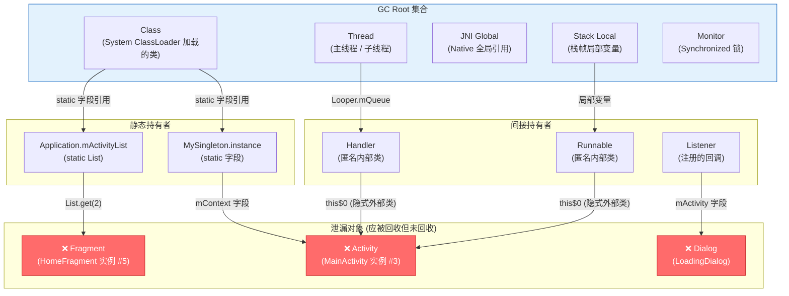
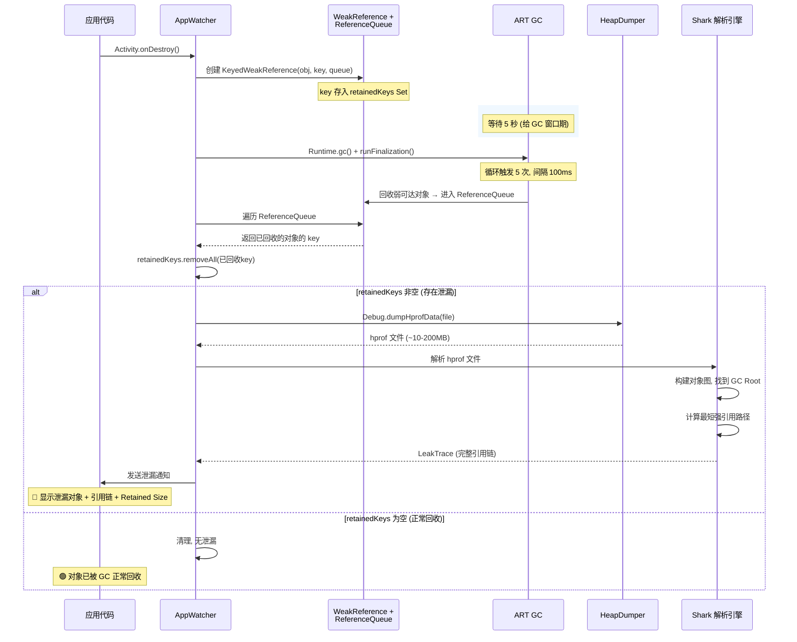
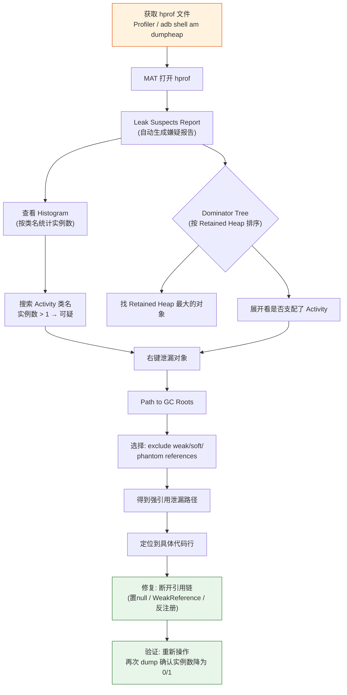

# 03 内存泄漏优化

> 内存泄漏是安卓面试必问的性能优化话题。面试官通过这个问题考察你对 JVM/ART 内存管理、引用链分析、以及工程化问题定位能力的深度理解。

---

## 目录
1. [常见面试问题](#1-常见面试问题)
2. [标准答案与要点解析](#2-标准答案与要点解析)
3. [核心原理深度讲解](#3-核心原理深度讲解)
4. [原理流程图](#4-原理流程图)
5. [核心源码分析](#5-核心源码分析)
6. [应用场景举例](#6-应用场景举例)

---

## 1. 常见面试问题

| # | 问题 | 考察维度 |
|---|------|---------|
| 1 | 内存泄漏和 OOM 有什么关系？如何通过泄漏曲线判断是泄漏还是正常的内存波动？ | 基础概念 + 量化判断 |
| 2 | 什么是 GC Root？安卓中有哪些类型的 GC Root？如何通过引用链判断一个对象是否泄漏？ | JVM/ART 内存模型 |
| 3 | Handler 导致的内存泄漏有哪 4 种解决方案？各自的优缺点是什么？ | 经典场景 + 方案对比 |
| 4 | 为什么匿名内部类和非静态内部类容易导致内存泄漏？从字节码层面解释 | 语言特性 + 字节码 |
| 5 | 单例持有 Activity Context 为什么会泄漏？应该传什么 Context？ | Context 体系理解 |
| 6 | LeakCanary 检测内存泄漏的核心算法是什么？它的 2.0 版本相比 1.0 做了哪些架构改进？ | 源码级工具原理 |
| 7 | 线上如何做内存泄漏监控？KOOM 和 LeakCanary 的设计思路有什么不同？ | 线上监控方案 |
| 8 | 给你一个 hprof 文件，在 MAT 中如何快速定位泄漏对象？Dominator Tree 怎么看？ | 工具实操 |

---

## 2. 标准答案与要点解析

### 2.1 内存泄漏与 OOM 的关系

**面试说法：**

> 内存泄漏（Memory Leak）是指不再使用的对象仍然被 GC Root 间接或直接持有强引用，导致 GC 无法回收。OOM（OutOfMemoryError）是内存分配失败时抛出的异常。泄漏是导致 OOM 的最常见原因之一，但不是唯一原因（还有大图加载、内存碎片等）。
>
> 判断标准：短时间内连续触发 3~5 次 GC 后，内存占用仍然持续上升且不回落，基本可以判定存在泄漏。正常的内存波动是「锯齿形」——上升后 GC 能回落到基线；泄漏曲线是「阶梯形」——每次 GC 后基线都比上一次高。

**关键数据点：**
- Android 进程的堆上限因设备而异（低端机 64MB~256MB，高端机 512MB~1GB+）
- 单次 GC 通常回收 30%~60% 的可回收对象
- 泄漏发生时，泄漏率（Leak Rate）通常 > 5% 即需关注

### 2.2 GC Root 类型和引用链判断

**面试说法：**

> GC Root 是垃圾回收器的起点，从这些根节点出发，通过引用关系遍历对象图，不可达的对象判定为垃圾。安卓中的 GC Root 主要包含四类：
>
> 1. **Class** — 由 System Class Loader 加载的类（静态变量引用的对象就在这里）
> 2. **Thread** — 存活的线程（包括主线程，其 ThreadLocal 值也是 GC Root）
> 3. **JNI Global Reference** — 全局 JNI 引用
> 4. **Stack Local** — 栈帧中的局部变量
> 5. **Monitor Used** — 被 synchronized 锁持有的对象
> 6. **Finalizer** — 等待执行 finalize() 的对象
>
> 判断泄漏的关键思路：如果一个 Activity 被销毁后，从 GC Root 出发仍然存在到该 Activity 的强引用路径，就说明该 Activity 泄漏了。

### 2.3 Handler 内存泄漏的 4 种解决方案

**面试说法：**

| 方案 | 做法 | 优点 | 缺点 |
|------|------|------|------|
| 静态内部类 + WeakReference | Handler 声明为 static class，持有 Activity 的 WeakReference | 标准方案，彻底解决 | 代码稍显冗余 |
| 在 onDestroy 中 removeCallbacksAndMessages | `handler.removeCallbacksAndMessages(null)` | 最简单 | 仅适用于 Message 和 Runnable 场景 |
| 使用 Lifecycle 感知的 Handler | 借助 LifecycleOwner 在 ON_DESTROY 时自动清理 | 架构优雅 | 需要引入 Lifecycle 组件 |
| 使用 Kotlin 协程替代 Handler | 用 `viewModelScope.launch { delay(1000); ... }` | 无需手动管理 | 需要协程基础 |

**推荐面试回答：**

> 实际项目中我会根据场景选择：如果是简单延时任务，直接用「静态内部类 + WeakReference」；如果在 Jetpack 架构中，优先使用协程；同时必须在 `onDestroy` 中调用 `removeCallbacksAndMessages(null)` 作为兜底。

### 2.4 匿名内部类/非静态内部类泄漏原因

**面试说法（带字节码层面解释）：**

> 非静态内部类会隐式持有外部类的强引用。编译后，内部类的构造函数会被插入一个参数——外部类的实例。匿名内部类同理。当内部类的实例生命周期比外部类（如 Activity）长时，外部类就无法被回收。
>
> 字节码证据：`javap -p Outer$Inner.class` 可以看到编译器自动生成的 `final Outer this$0` 字段。

### 2.5 单例持有 Context 问题

**面试说法：**

> 单例是 static 的，生命周期和应用一样长。如果单例持有 Activity 的 Context（如 `this`），则 Activity 销毁后，因为 static 变量是 GC Root（Class 类），这个 Activity 永远不会被回收。
>
> 正确做法：传入 `ApplicationContext`（`context.applicationContext`）。但对于 Toast、Dialog 等必须用 Activity Context 的场景，应该在使用完毕后置空引用。
>
> 核心原则：**生命周期长的对象不要持有生命周期短的对象的强引用。**

### 2.6 LeakCanary 核心算法

**面试说法：**

> LeakCanary 2.x 的核心检测流程：
>
> 1. **注册监听**：通过 `AppWatcherInstaller` 自动注册 Activity/Fragment/ViewModel 的生命周期回调
> 2. **弱引用监控**：对象销毁时，创建一个带唯一 key 的 `KeyedWeakReference` 并放入 `ReferenceQueue`
> 3. **主动触发 GC**：等待 5 秒后，调用 `Runtime.getRuntime().gc()` + `System.runFinalization()` 主动触发 GC
> 4. **判定泄漏**：检查弱引用是否已被 `ReferenceQueue` 回收。如果还在队列内（弱引用目标未被清除），则说明该对象仍然可达 → 存在泄漏
> 5. **Heap Dump**：确认泄漏后，使用 `Debug.dumpHprofData()` 导出 hprof 文件
> 6. **Shark 解析**：使用 Shark 库解析 hprof，找到到 GC Root 的最短强引用路径，生成报告
>
> LeakCanary 2.0 的核心改进：使用 ContentProvider 自动初始化（无需手动 init），引入了 Shark 解析引擎替代 HAHA，分析速度提升 6 倍，内存占用减少 90%。

---

## 3. 核心原理深度讲解

### 3.1 ART 的 GC 算法

ART（Android Runtime）相比 Dalvik 在 GC 方面做了重大优化。当前的 GC 策略使用了多种算法的组合：

```
┌────────────────────────────────────────────────────────┐
│                 ART GC 算法演进                          │
├─────────────┬──────────────────────────────────────────┤
│   GC 类型    │  算法原理与适用场景                        │
├─────────────┼──────────────────────────────────────────┤
│ 标记-清除    │  遍历 GC Root 标记可达对象，清除未标记对象  │
│ (Mark-Sweep)│  缺点：产生内存碎片                        │
├─────────────┼──────────────────────────────────────────┤
│ 复制算法     │  将内存分为两块，存活对象复制到另一块       │
│ (Copying)   │  优点：无碎片；缺点：浪费 50% 空间          │
│             │  适用：新生代（Nursery/Young Generation）   │
├─────────────┼──────────────────────────────────────────┤
│ 标记-整理    │  标记存活对象后，将它们向一端移动（整理）    │
│ (Mark-      │  优点：无碎片且空间利用率高                 │
│  Compact)   │  适用：老年代（Old Generation）             │
├─────────────┼──────────────────────────────────────────┤
│ 分代 GC     │  ART 使用 Generational CC (Concurrent      │
│ (Generational│ Copying) 收集器。将堆分为：                │
│  CC)        │  - Region Space: 按区域管理                 │
│             │  - 新生代: 频繁回收（Minor GC）             │
│             │  - 老年代: 低频回收（Major GC / Full GC）   │
│             │  - 大对象空间: 单独管理（LOS）              │
└─────────────┴──────────────────────────────────────────┘
```

**关键数据：**
- Android 5.0+ 使用 ART，Android 8.0+ 引入 Concurrent Copying GC
- Minor GC 暂停时间通常 < 2ms，Full GC 暂停时间可能达到 50~200ms
- GC 暂停是造成 UI 卡顿的常见原因（超过 16ms 即丢帧）

### 3.2 GC Root 枚举详解

```
GC Root 分类（Android/ART 环境）：
┌────────────────────────────────────────────────────────────┐
│                                                             │
│  1. Class (System Class)                                    │
│     └─ 由 Bootstrap/System ClassLoader 加载的类             │
│     └─ static 字段引用的对象在此                            │
│     └─ 典型泄漏: 单例中的 static 字段持有 Activity          │
│                                                             │
│  2. Thread (Active Threads)                                 │
│     └─ 所有存活的线程及其 ThreadLocal 值                    │
│     └─ 典型泄漏: 后台线程持有 Activity 引用未释放           │
│                                                             │
│  3. JNI Global Reference                                    │
│     └─ native 代码中的全局引用（NewGlobalRef/FindClass）    │
│     └─ 典型泄漏: native 层持有 Java 层大对象未释放          │
│                                                             │
│  4. Stack Local (Java Stack Frame)                          │
│     └─ 当前执行栈中所有方法的局部变量                       │
│     └─ 仅影响当前时刻，方法返回后自动释放                   │
│                                                             │
│  5. Monitor Used (Synchronized Lock)                        │
│     └─ 作为同步锁被持有的对象                               │
│     └─ 典型泄漏: 锁对象被异步任务持有导致泄漏               │
│                                                             │
│  6. Finalizer Reference                                     │
│     └─ 等待 finalize() 方法执行的对象队列                   │
│     └─ 如果有大量对象在此队列，说明 finalize 执行缓慢       │
│                                                             │
└────────────────────────────────────────────────────────────┘
```

### 3.3 Activity 泄漏典型引用链分析

最常见的 Activity 泄漏模式：

```
Activity 泄漏的典型引用链（从 GC Root 到泄漏的 Activity）：

1. Handler 泄漏:
   GC Root (Thread.main)
     → android.os.Looper.mQueue (MessageQueue)
       → Message.target (Handler)         [匿名内部类]
         → Handler.this$0 (Activity)       [隐式外部类引用]
           ✗ Activity 泄漏

2. 静态变量泄漏:
   GC Root (Class)
     → MyClass.staticField (持有者)
       → 持有者.context (Activity)
         ✗ Activity 泄漏

3. 注册未反注册:
   GC Root (Class - SystemService)
     → ContextImpl.mServiceCache
       → SensorManager.mListenerList
         → Listener.this$0 (Activity)
           ✗ Activity 泄漏

4. 非静态匿名内部类在子线程:
   GC Root (Thread)
     → AsyncTask$WorkerRunnable
       → AsyncTask.this$0 (Activity的内部类实例)
         → Activity
           ✗ Activity 泄漏

5. View 持有 Activity (Dialog/Toast):
   GC Root (Class)
     → WindowManagerGlobal.mViews
       → DecorView.mContext (Activity)
         ✗ Activity 泄漏
```

### 3.4 MAT 的 Dominator Tree 和 Path to GC Roots 分析法

**核心概念：**

> **Dominator Tree（支配树）**：如果从 GC Root 到对象 B 的所有路径都经过对象 A，则 A 支配（dominate）B。Dominator Tree 可以快速找到「谁支配了最多的内存」。

**MAT 分析步骤：**

```
步骤 1: 打开 hprof 文件
  └─ MAT 会自动转换并生成索引

步骤 2: 查看 Leak Suspects Report
  └─ MAT 自动生成的泄漏嫌疑报告
  └─ 按 Retained Heap 大小排序

步骤 3: 打开 Histogram
  └─ 按类名统计对象数量和 Shallow Heap
  └─ 搜索 Activity 类名，查看实例数是否异常
  └─ 例如: "MainActivity" 应该有 0~1 个实例，如果有 5+ 个则泄漏

步骤 4: Merge Shortest Paths to GC Roots
  └─ 右键泄漏对象 → Path to GC Roots → exclude weak/soft/phantom references
  └─ 只保留强引用路径，得到最短泄漏链

步骤 5: 分析 Dominator Tree
  └─ 找到 Retained Heap 最大的对象
  └─ 右键 → "Show Retained Set" 查看其支配的所有对象
  └─ 如果某个对象支配了一个 Activity，而这个 Activity 本该被回收 → 泄漏

关键指标:
  - Shallow Heap: 对象自身占用的内存
  - Retained Heap: 对象自身 + 其支配的所有对象的内存总和
  - 泄漏分析的核心是看 Retained Heap
```

### 3.5 LeakCanary 检测算法深度剖析

```
LeakCanary 检测流程（带时间线）：

T+0ms:     Activity/Fragment.onDestroy() 触发
T+0ms:     AppWatcher.objectWatcher.watch(destroyedObject)
             └─ 创建 KeyedWeakReference(key, destroyedObject, name, watchUptimeMillis)
             └─ 将弱引用关联到 ReferenceQueue
             └─ 存入 retainedKeys (CopyOnWriteArraySet)
T+5000ms:  (等待 5 秒，确保对象有机会被 GC)
T+5000ms:  触发主动 GC
             └─ Runtime.getRuntime().gc()
             └─ System.runFinalization()
             └─ 循环 5 次，每次间隔 100ms
             
T+5100ms:  检查 ReferenceQueue
             └─ 遍历队列，将已回收对象的 key 从 retainedKeys 中移除
             └─ 如果 retainedKeys 中还有 key → 对象未被回收 → 存在泄漏
             
T+5200ms:  Heap Dump
             └─ Debug.dumpHprofData(hprofFile.path)
             └─ 导出到临时文件（通常 10~200MB）
             
T+5300ms~: Shark 解析
             └─ Hprof.open(hprofFile)
             └─ 遍历 GC Root → 构建对象图
             └─ 找到目标 key 对应的对象
             └─ 计算到 GC Root 的最短强引用路径
             └─ 生成 LeakTrace (引用链 + 每个节点的类名/字段名)
             
T+...ms:   生成通知/报告
             └─ 显示 LeakTrace + RetainedHeapSize
             └─ 清理临时 hprof 文件

关键设计要点:
1. 为什么等 5 秒？ — 给 GC 足够的触发窗口期（GC 不是实时的）
2. 为什么主动 GC？ — Android 的 GC 是惰性的，不主动触发可能等很久
3. 为什么用 WeakReference + ReferenceQueue？ — 可以异步观测对象被回收的事件
4. Shark 为什么比 HAHA 快 6 倍？ — 使用内存映射（mmap）+ 稀疏数组索引 + 流式解析
```

---

## 4. 原理流程图

### 4.1 GC Root 到泄漏对象的引用链图



### 4.2 LeakCanary 检测泄漏时序图



### 4.3 MAT 分析流程



---

## 5. 核心源码分析

### 5.1 ActivityThread.performDestroyActivity() — 为什么不会立即回收

```java
// 源码位置: frameworks/base/core/java/android/app/ActivityThread.java
// Android 13 (API 33)

/** 核心方法: 执行 Activity 销毁 */
ActivityClientRecord performDestroyActivity(IBinder token, boolean finishing,
        int configChanges, boolean getNonConfigInstance, String reason) {
    ActivityClientRecord r = mActivities.get(token);
    // ...
    
    // 步骤1: 调用 Activity.onDestroy()
    mInstrumentation.callActivityOnDestroy(r.activity);
    
    // 步骤2: 清理 Window
    if (r.window != null) {
        r.window.closeAllPanels();
    }
    
    // 步骤3: 从 mActivities 移除记录
    // ⚠️ 注意: 此时只是从 Map 中移除, 并不保证 GC 立即回收!
    synchronized (mResourcesManager) {
        mActivities.remove(token);
    }
    
    // 步骤4: 通知 WindowManager 移除 DecorView
    // ⚠️ DecorView 内部持有 Activity 的 Context, 如果 DecorView 未及时释放, 
    // 则 Activity 也无法回收
    WindowManagerGlobal.getInstance().closeAll(r.token, 
        r.activity.getClass().getName(), "Destroy");
    
    // ⚠️ 关键问题: performDestroyActivity() 只是做了清理动作,
    // 但以下情况会导致 Activity 仍然可达, GC 无法回收:
    // 1. Handler 的消息队列中还有 Message 引用该 Activity
    // 2. 静态变量/单例持有 Activity 引用
    // 3. 其他线程持有 Activity 引用
    // 4. 传感器/广播等系统服务未反注册
    // 5. Animation 未取消 (持有 View → DecorView → Activity 引用链)
    
    return r;
}
```

**面试要点：**
> `performDestroyActivity` 只是执行了销毁流程，但不等于 GC 回收。Activity 是否被回收取决于：销毁后，从 GC Root 出发是否还存在到该 Activity 的强引用路径。这也是 LeakCanary 在 `onDestroy()` 之后还需要等待 5 秒再检测的原因。

### 5.2 Handler 的引用链 — 从 Message 到 Activity

```java
// ===== 第一步: Handler 发送延时消息 =====
// 典型代码 (会泄漏的写法):
public class MainActivity extends Activity {
    private Handler mHandler = new Handler() {  // 匿名内部类
        @Override
        public void handleMessage(Message msg) {
            // 处理消息
        }
    };
    
    @Override
    protected void onCreate(Bundle savedInstanceState) {
        super.onCreate(savedInstanceState);
        mHandler.sendEmptyMessageDelayed(0, 60000); // 1 分钟后执行
    }
}

// ===== 源码分析: 引用链追踪 =====

// 1. MessageQueue.java (frameworks/base/core/java/android/os/MessageQueue.java)
//    Looper 的 mQueue 持有 Message 链表
//    Looper 是 ThreadLocal 的，主线程 Looper 随进程一直存活
//    → 主线程 Looper.mQueue 是 GC Root 可达的

// 2. Message.java (frameworks/base/core/java/android/os/Message.java)
public final class Message implements Parcelable {
    /*package*/ Handler target;   // ← Message 持有 Handler 的引用!
    /*package*/ long when;        // 延时消息的执行时间
    /*package*/ Message next;     // 链表结构
    // ...
}

// 3. 匿名内部类的字节码分析
//    编译后生成: MainActivity$1.class
//    构造函数被插入外部类参数:
//    MainActivity$1(MainActivity this$0) {
//        this.this$0 = this$0;  // ← 隐式持有 Activity 的强引用!
//    }

// 完整的强引用链:
// GC Root (Thread.main)
//   → Looper (ThreadLocal.get())
//     → MessageQueue (Looper.mQueue)
//       → Message (链表中未处理的延时消息)
//         → Message.target → Handler (MainActivity$1 实例)
//           → Handler.this$0 → MainActivity 实例
//             ✗ Activity 泄漏!

// ===== 正确写法 (4种方案) =====

// 方案1: 静态内部类 + WeakReference (推荐)
public class MainActivity extends Activity {
    private static class MyHandler extends Handler {
        private final WeakReference<MainActivity> mActivityRef;
        
        MyHandler(MainActivity activity) {
            mActivityRef = new WeakReference<>(activity);
        }
        
        @Override
        public void handleMessage(Message msg) {
            MainActivity activity = mActivityRef.get();
            if (activity == null) return;  // Activity 已回收, 安全退出
            // 处理消息...
        }
    }
    
    private MyHandler mHandler = new MyHandler(this);
    
    @Override
    protected void onDestroy() {
        super.onDestroy();
        mHandler.removeCallbacksAndMessages(null); // 兜底: 清空所有消息
    }
}

// 方案2: 使用 Lifecycle 感知 (Jetpack)
// class MainActivity : AppCompatActivity() {
//     private val handler = Handler(Looper.getMainLooper())
//     
//     init {
//         lifecycle.addObserver(object : DefaultLifecycleObserver {
//             override fun onDestroy(owner: LifecycleOwner) {
//                 handler.removeCallbacksAndMessages(null)
//             }
//         })
//     }
// }
```

### 5.3 LeakCanary 源码 — RefWatcher 和 Shark 引擎

```java
// ===== RefWatcher.expectWeaklyReachable() — 核心检测逻辑 =====
// 源码位置: leakcanary/leakcanary-object-watcher/src/main/java/leakcanary/ObjectWatcher.kt

class ObjectWatcher(
    private val clock: Clock,
    private val checkRetainedExecutor: Executor,
    private val isEnabled: () -> Boolean = { true }
) {
    // 已观测但未被回收的对象 key 集合
    private val trackedObjects = mutableMapOf<String, KeyedWeakReference>()
    
    @Synchronized
    fun expectWeaklyReachable(
        watchedObject: Any,
        description: String
    ) {
        if (!isEnabled()) return
        
        // 1. 先手动触发一次 GC, 清理之前可能已经不可达的引用
        removeWeaklyReachableObjects()
        
        // 2. 生成唯一 key
        val key = UUID.randomUUID().toString()
        val watchUptimeMillis = clock.uptimeMillis()
        
        // 3. 创建 KeyedWeakReference 关联到 ReferenceQueue
        val reference = KeyedWeakReference(
            watchedObject, key, description, watchUptimeMillis, queue
        )
        
        // 4. 记录到 trackedObjects
        trackedObjects[key] = reference
        
        // 5. 延迟 5 秒后检查是否泄漏
        checkRetainedExecutor.execute {
            moveToRetained(key)
        }
    }
    
    private fun moveToRetained(key: String) {
        // 先清理已回收的对象
        removeWeaklyReachableObjects()
        
        val retainedRef = trackedObjects[key]
        if (retainedRef != null) {
            // 对象仍在 trackedObjects 中 → 未被 GC 回收 → 泄漏!
            retainedRef.retainedUptimeMillis = clock.uptimeMillis()
            // 通知监听器, 触发 Heap Dump
            onObjectRetainedListeners.forEach { it.onObjectRetained() }
        }
    }
    
    private fun removeWeaklyReachableObjects() {
        // 关键: 主动触发 GC
        var ref: KeyedWeakReference?
        do {
            ref = queue.poll() as KeyedWeakReference?
            if (ref != null) {
                // 对象已被 GC 回收, 从 trackedObjects 中移除
                trackedObjects.remove(ref.key)
            }
        } while (ref != null)
        // 如果 queue 为空, 说明没有对象被回收, 可能:
        // a) 对象仍被强引用 → 泄漏
        // b) GC 还没触发 → 需要主动 GC
    }
}

// ===== Shark 解析引擎 — 找到最短泄漏路径 =====
// 源码位置: shark/shark/src/main/java/shark/HeapAnalyzer.kt

// Shark 解析 hprof 文件的核心优势:
// 1. 使用 Okio 进行流式读取, 不需要将整个 hprof 加载到内存
// 2. 使用稀疏数组 (SparseArray) 来索引对象 ID → 位置映射
// 3. 多遍扫描策略:
//    - 第一遍: 索引所有对象位置和类信息
//    - 第二遍: 构建对象图, 从 GC Root 出发标记可达对象
//    - 第三遍: 对泄漏对象执行 BFS 寻找最短路径

// 简化版核心算法:
fun findLeakTrace(
    graph: HprofHeapGraph,
    leakingObjects: Set<Long>,  // 泄漏对象的对象 ID
    referenceMatchers: List<ReferenceMatcher>
): LeakTrace {
    // 使用 BFS 从泄漏对象反向找最短到 GC Root 的路径
    val shortestPathFinder = ShortestPathFinder(referenceMatchers)
    
    val leakTraces = leakingObjects.map { objectId ->
        shortestPathFinder.findShortestPathFromGcRoot(
            graph, objectId
        )
    }
    
    // 返回最短的泄漏路径
    return leakTraces.minByOrNull { it.referencePath.size } ?: LeakTrace.EMPTY
}

// GC 触发策略源码:
// 位置: leakcanary/leakcanary-object-watcher/src/main/java/leakcanary/GcTrigger.kt

object GcTrigger {
    // 默认策略: JvmDebug 环境使用 Runtime.gc(), 否则用更激进的方式
    val DEFAULT: GcTrigger = object : GcTrigger {
        override fun runGc() {
            // 5 次循环, 每次 Runtime.gc() + runFinalization()
            // 间隔 100ms 让 GC 有足够时间完成
            repeat(5) {
                Runtime.getRuntime().gc()
                System.runFinalization()
                // 短暂休眠 100ms
                Thread.sleep(100)
            }
        }
    }
}
```

**面试要点：**
- `expectWeaklyReachable` 为什么用 UUID 做 key？用于关联 WeakReference 和 trackedObjects，ReferenceQueue 返回时只有引用对象，需要 key 来定位。
- 为什么 GC 触发循环 5 次？一次 `Runtime.gc()` 只是「建议」JVM 执行 GC，并不保证立即执行。多次调用增加 GC 实际发生的概率。
- Shark 比 HAHA 快在哪？零拷贝的内存映射 I/O + 稀疏数组快速索引 + 避免完整对象图在内存中展开。

---

## 6. 应用场景举例

### 6.1 场景一：线上 OOM 率从 0.5% 降到 0.02% 的全治理过程

**背景：**
某电商 App DAU 500 万，OOM 崩溃率 0.5%（日均 25000 次），占全部崩溃的 35%，主要集中在低端机（3GB RAM 以下）。

**治理过程（三阶段）：**

#### 第一阶段：建立监控基线（第 1~2 周）

```
工具链搭建:
├── 线上: 接入 KOOM (快手 OOM 监控)
│   ├── 开启 OOM 监控: OOMFileReader 解析 hprof
│   ├── 配置: 堆利用率 > 85% 时触发 dump
│   └── 采样率: 低端机 100%, 高端机 10%
│
├── 本地: LeakCanary 2.x 全量检测
│   ├── 每次 Activity/Fragment 销毁后自动检测
│   └── CI 集成: 自动化测试跑 Monkey + 检查泄漏
│
└── 数据分析平台:
    ├── 按机型/OS版本/场景分类统计 OOM 率
    ├── 泄漏对象 Top 10 排行榜
    └── 单用户内存峰值分布
```

**发现的问题分布：**

| 泄漏类型 | 占比 | 典型场景 |
|---------|:---:|---------|
| WebView 未销毁 | 25% | 商品详情页 WebView 多次打开未调用 destroy() |
| 图片缓存未释放 | 20% | 列表页 Glide 加载大图，Fragment 销毁后 Bitmap 未回收 |
| Handler 延时消息 | 18% | 首页倒计时/轮播图 Handler 在 Activity 销毁后仍执行 |
| 单例持有 Activity | 12% | 推送 SDK 持有 Activity Context 注册广播 |
| 匿名内部类在子线程 | 10% | 网络请求回调在 Activity 销毁后返回 |
| Dialog 常驻 | 8% | LoadingDialog 使用 Activity Context 且未在 onDestroy 关闭 |
| 其他 | 7% | 传感器注册、动画未取消、自定义 View 等 |

#### 第二阶段：逐项修复（第 3~4 周）

```
修复策略:

1. WebView 泄漏 (贡献 25% 的 OOM)
   修复方案:
   ├── 将 WebView 独立进程 (android:process=":webview")
   ├── 主进程结束时杀掉 WebView 进程
   └── 或在 onDestroy 中:
       webView.removeAllViews()
       webView.loadUrl("about:blank")
       webView.stopLoading()
       webView.destroy()  // 必须调用!

2. 图片缓存泄漏 (贡献 20% 的 OOM)
   修复方案:
   ├── Glide 替换为 with(fragment/activity) 自动管理生命周期
   ├── 大图使用 downSampleStrategy + override() 限制尺寸
   └── Bitmap.recycle() 在确认不再使用后主动回收

3. Handler 泄漏 (贡献 18% 的 OOM)
   修复方案:
   ├── 改造为静态内部类 + WeakReference
   └── onDestroy 中 removeCallbacksAndMessages(null)

4. 单例 + 全局 Context 改造 (贡献 12%)
   修复方案:
   ├── 统一传入 ApplicationContext
   └── 需要 Activity Context 的场景: 用完即置空

5. 建立全局 BaseActivity/BaseFragment 规范:
   abstract class BaseActivity : AppCompatActivity() {
       override fun onDestroy() {
           // 统一清理: Handler、动画、RxJava订阅、广播、传感器
           handler.removeCallbacksAndMessages(null)
           disposables.clear()
           unregisterAllReceivers()
           super.onDestroy()
       }
   }
```

#### 第三阶段：防劣化机制（第 5 周+）

```
CI 门禁:
├── 每次 MR 触发 Monkey 测试 (5000 events)
├── 跑完检查 LeakCanary 有无新泄漏
├── 有新增泄漏 → 阻塞合并, 通知开发者
└── 内存峰值增长 > 10% → 告警

线上防劣化:
├── KOOM 持续监控 OOM 率
├── 每次发版后 OOM 率对比基线
└── 超过基线 20% → 自动告警 + 灰度回滚
```

**最终效果：**

| 指标 | 优化前 | 优化后 | 降幅 |
|-----|:-----:|:-----:|:---:|
| OOM 崩溃率 | 0.5% | 0.02% | **96%** |
| 低端机 OOM 率 | 1.8% | 0.06% | **97%** |
| 应用内存峰值(P50) | 380MB | 180MB | **53%** |
| 单次使用内存增长 | 120MB | 35MB | **71%** |
| GC 暂停 >16ms 占比 | 8% | 1.2% | **85%** |

### 6.2 场景二：ViewPager + Fragment 频繁切换的内存泄漏修复

**问题描述：**
资讯类 App 首页使用 ViewPager + FragmentStatePagerAdapter，5 个 Tab 频繁切换。使用 Memory Profiler 发现每切换一轮 Tab，内存增长 15~25MB 且不回落。

**定位过程：**

```
1. Profiler 捕获 Heap Dump
   └─ Allocation Tracking → 发现切换时大量 Fragment 实例未释放

2. MAT 分析
   └─ Histogram → 搜索 "HomeFragment" → 12 个实例!
   └─ 正常情况应该只有 1~2 个 (当前 + 预加载)
   └─ Path to GC Roots → 发现 FragmentManager.mAdded 持有所有旧 Fragment

3. 根因定位
   问题代码:
   fragmentStateAdapter = FragmentStatePagerAdapter(fragmentManager,
       BEHAVIOR_RESUME_ONLY_CURRENT_FRAGMENT)
   // BEHAVIOR_RESUME_ONLY_CURRENT_FRAGMENT + 自定义的 getItem()
   // 在 onDestroyItem 中没有正确移除 Fragment

4. 修复:
   ├── 确保 FragmentStatePagerAdapter 正确实现 destroyItem()
   ├── 使用 ViewPager2 + FragmentStateAdapter (更好的生命周期管理)
   ├── 设置 offscreenPageLimit = 1 (减少预加载的 Fragment 数量)
   └── 在 Fragment.onDestroyView() 中释放所有 View 引用
   
5. 效果:
   切换 20 轮后内存增长从 180MB 降到 35MB
```

### 6.3 场景三：Profiler + MAT 定位跨团队模块泄漏

**问题描述：**
收到用户反馈「使用 30 分钟后 App 变卡」。Memory Profiler 显示内存在持续增长，但团队自己的模块已经过 LeakCanary 检查。

**跨团队定位过程：**

```
1. 复现 + Profiler 录制
   └─ 启动 Memory Profiler，录制 30 分钟操作
   └─ Memory 从 120MB → 520MB，GC 无法回落
   └─ 导出 hprof (580MB)

2. MAT 分析
   └─ Histogram → 按 Retained Heap 排序
   └─ Top 1: android.webkit.WebViewChromium → 220MB
   └─ 追溯引用: 广告 SDK → AdWebView → Activity #15
   └─ 结论: 广告 SDK 在每次展示广告后创建 WebView 但未调用 destroy()

3. 跨团队协调
   └─ 提供完整引用链截图 + MAT 报告给广告 SDK 团队
   └─ 定位到 SDK 版本: v3.2.1 的 AdManager.createWebView() 缺少 destroy()
   └─ 广告 SDK 团队在 v3.2.3 修复

4. 临时规避方案 (在 SDK 修复发版前):
   └─ 在 Activity.onDestroy() 中反射获取 AdManager 的 WebView 列表并主动 destroy()
   └─ 同时限制同一时间最多存在 2 个 AdWebView
   
5. 效果:
   修复后 30 分钟内存从 520MB → 160MB，OOM 减少 40%
```

**这个场景的面试回答要点：**
> 跨团队问题定位的关键是提供「不可抵赖」的证据——完整的引用链截图和 MAT Dominator Tree 分析，让其他团队能直接定位到自己代码的问题，而不是互相推诿。

---

## 附录：内存泄漏排查 Checklist

```
□ 1. 所有 Handler 是否都是静态内部类 + WeakReference？
□ 2. onDestroy 中是否调用了 handler.removeCallbacksAndMessages(null)？
□ 3. 单例持有 Context 是否用了 ApplicationContext？
□ 4. 所有注册的监听器是否在对应的生命周期中反注册？
    □ BroadcastReceiver → unregisterReceiver()
    □ SensorManager → unregisterListener()
    □ ContentObserver → unregisterContentObserver()
    □ LiveData/Observer → removeObserver()
□ 5. WebView 是否在 onDestroy 中调用了 destroy()？
□ 6. 子线程中的网络/数据库回调是否做了 Activity 存活检查？
□ 7. 匿名内部类/非静态内部类生命周期是否比外部类长？
□ 8. Animation/ObjectAnimator 是否在 onDestroy 中 cancel？
□ 9. RxJava Disposable 是否在 CompositeDisposable 中管理？
□ 10. Bitmap 是否在确认不用时调用了 recycle()？
□ 11. Dialog 是否以 dismiss() 结束了生命周期？
□ 12. 第三方 SDK 初始化时是否检查了其内部是否有泄漏风险？
```

---

## 参考资源

- [Android 内存管理官方文档](https://developer.android.com/topic/performance/memory)
- [LeakCanary GitHub](https://github.com/square/leakcanary)
- [KOOM — 快手 OOM 监控](https://github.com/KwaiAppTeam/KOOM)
- [ART GC 源码分析 — GarbageCollector](https://cs.android.com/android/platform/superproject/+/master:art/runtime/gc/)
- [Shark — LeakCanary 2 的 hprof 解析库](https://square.github.io/leakcanary/shark/)

---

*最后更新时间: 2026 年 5 月*
*下一个模块: [08.4 功耗优化](../04-功耗优化/)*
