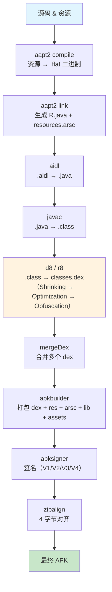
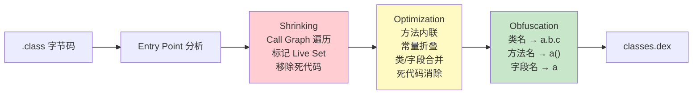
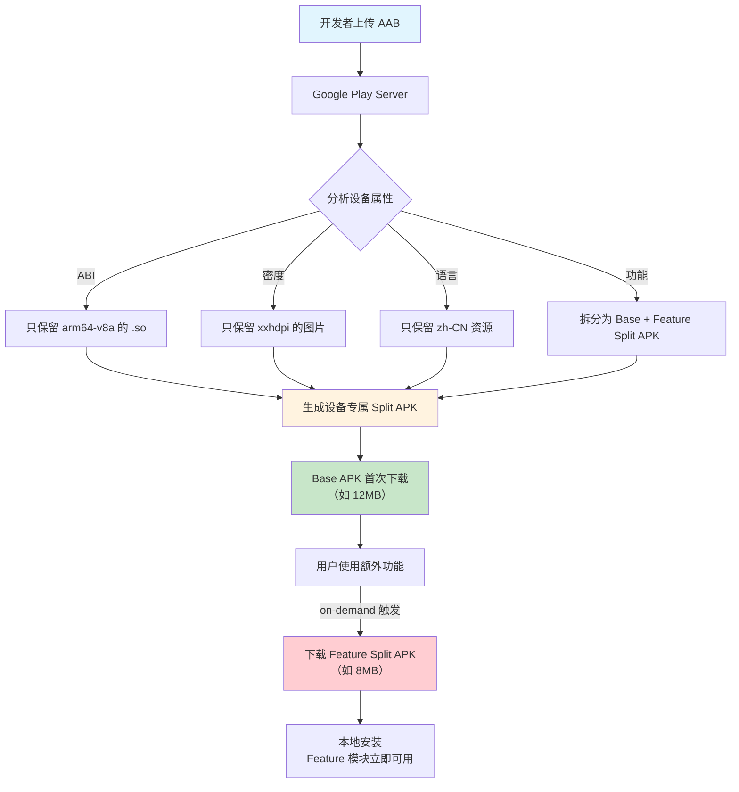

# 包体积优化 —— 面试学习完整指南

> **六层递进体系**：面试问题 → 标准答案 → 核心原理 → 流程图 → 源码分析 → 实战场景
> 适用岗位：高级/资深 Android 工程师、性能优化专家

---

## 目录

1. [常见面试问题（8题）](#1-常见面试问题)
2. [标准答案与要点解析](#2-标准答案与要点解析)
3. [核心原理深度讲解](#3-核心原理深度讲解)
4. [原理流程图（Mermaid.js）](#4-原理流程图)
5. [核心源码分析](#5-核心源码分析)
6. [应用场景举例](#6-应用场景举例)

---

## 1. 常见面试问题

### Q1: APK 由哪些部分组成？各部分体积占比的典型范围是什么？
### Q2: 图片优化有哪些手段？WebP / VectorDrawable / WebP 动图 vs GIF 如何选择？
### Q3: ProGuard 和 R8 对包体积的实际压缩效果如何？它们做了什么？
### Q4: ABI 分包是什么？armeabi-v7a 和 arm64-v8a 如何选择？Play Store 分发策略？
### Q5: 如何使用 Android Studio 的 APK Analyzer 分析体积瓶颈？
### Q6: AAB（Android App Bundle）和 Dynamic Feature 对首次安装体积有什么影响？
### Q7（进阶）: resources.arsc 是什么？String Pool 去重是怎么实现的？
### Q8（进阶）: AndResGuard / 微信资源混淆的原理是什么？能压缩多少？

---

## 2. 标准答案与要点解析

### Q1: APK 组成结构与典型体积占比

APK 本质上是一个 **ZIP 压缩包**，解压后包含以下核心部分：

| 组成部分 | 说明 | 典型占比 | 优化手段 |
|---------|------|---------|---------|
| **classes.dex** | 编译后的字节码（可能多个） | 15% ~ 35% | R8 混淆压缩、去除未使用代码 |
| **res/** | 资源文件（layout/drawable/anim 等） | 20% ~ 40% | 图片压缩 WebP、资源混淆、去除无用资源 |
| **resources.arsc** | 编译后的资源索引表（二进制） | 5% ~ 15% | AndResGuard、去除多余语言/配置 |
| **lib/** | Native .so 库（按 ABI 分目录） | 20% ~ 50% | ABI 分包、动态下架、so 裁剪 |
| **assets/** | 原始文件（字体/H5/数据） | 5% ~ 15% | 动态下发、压缩、按需打包 |
| **META-INF/** | 签名信息（CERT.RSA/MANIFEST.MF） | < 1% | V2/V3 签名略大于 V1，差异可忽略 |

**面试加分表述**：

> "一个典型的 50MB APK，拆解开通常是：res 目录 18~20MB（图片占大头），lib 目录 15~18MB（armeabi-v7a + arm64-v8a 各一份 so），classes.dex 8~10MB，resources.arsc 3~5MB，assets 2~4MB。优化时优先抓大头——so 和图片，这两项做到位就能砍掉 60% ~ 70% 的体积。"

---

### Q2: 图片优化：WebP / VectorDrawable / WebP 动图 vs GIF

| 方案 | 压缩率（相对 PNG） | 适用场景 | 兼容性 | 体积对比（同一张图） |
|------|---------------------|---------|--------|---------------------|
| **PNG** | 基准（无损/有损） | 通用 | 100% | 100KB |
| **WebP 有损** | 减少 60% ~ 80% | 背景/大图/无透明度要求 | API 14+（有损）/ API 18+（无损&透明） | 25 ~ 40KB |
| **WebP 无损** | 减少 25% ~ 35% | 图标/UI 元素需精确还原 | API 18+ | 65 ~ 75KB |
| **VectorDrawable** | 极小（XML 矢量） | 图标（24dp~48dp） | API 21+（兼容库到 API 14） | < 1KB（矢量路径描述） |
| **SVG → VectorDrawable** | 极小 | 简单图标 | 同上 | < 1KB |
| **GIF** | 基准（动图） | 简单动画 | 100% | 200KB（动图） |
| **WebP 动图** | 减少 60% ~ 70% | 动画场景 | API 17+ | 60 ~ 80KB |
| **Lottie** | 极小（JSON + 矢量） | 复杂动画 | Lottie 库 | 10 ~ 50KB（JSON） |

**面试加分点**：

> "一个典型电商 App，图片资源占 res 目录的 70% 以上。全量迁移到 WebP 后，res 目录从 20MB 降到 6~8MB。但 VectorDrawable 不是银弹——复杂图形（超过 200 条 path 命令）在 CPU 上渲染比 PNG 还慢，建议只用于 24dp 级简单图标。另外要注意 **WebP 编码耗时比 PNG 高出 3~5 倍**，对于启动阶段加载的引导图建议预转 PNG，避免解码阻塞主线程。"

**实际转换策略**：

```
PNG → WebP（有损，quality=75%）：肉眼无差异，体积减少 65%
  ↓ 如果是纯色简单图标
PNG → VectorDrawable：体积减少 95%+，但复杂图形不要转
  ↓ 如果是动图
GIF → WebP 动图：体积减少 60%，但兼容 API 17+
     → Lottie：设计师输出 JSON，体积最小且可交互
```

---

### Q3: ProGuard / R8 对体积的实际效果

| 操作 | ProGuard 表现 | R8 表现 | 压缩率 | 说明 |
|------|-------------|--------|-------|------|
| **Shrinking（压缩）** | 基于入口点遍历调用图，移除不可达代码 | 同算法，但内联更多方法后能暴露更多死代码 | 可移除 30%~50% 的类/方法 | R8 更激进的内联策略使其效果更好 |
| **Optimization（优化）** | 方法内联、常量折叠、死代码消除 | 更激进：更多内联、类合并、字段合并 | 额外减少 5%~15% | R8 能 merge 类、移除无副作用调用 |
| **Obfuscation（混淆）** | 类/方法/字段重命名为短名 a.b.c | 同策略，但支持更多混淆规则 | 额外减少 5%~10% | 方法名从 20 字符→1 字符，dex 体积收益 |
| **整体效果** | 减少 30%~45% | 减少 40%~55% | — | R8 在 shrinking + optimization 环节显著优于 ProGuard |

**真实项目数据**（中等规模 App）：

```
classes.dex 原始体积：9.2 MB
  → Shrinking 后：5.8 MB（-37%）
  → Optimization 后：4.5 MB（额外 -14%）
  → Obfuscation 后：4.1 MB（额外 -4%）
  → 总体：9.2 MB → 4.1 MB（减少 55%）
```

**面试表述**：

> "R8 比 ProGuard 多减少约 10%~15% 的体积，核心差异在于 R8 作为 D8 编译器的一部分，能在脱糖（desugaring）阶段就进行代码优化，而 ProGuard 只能对 .class 做后处理。Google 官方数据表明 R8 相比 ProGuard 平均多减少 8% DEX 体积和 10% 编译速度提升。"

---

### Q4: ABI 分包策略

**ABI 是什么**？Application Binary Interface，决定 CPU 执行哪种指令集的 .so 文件。

| ABI | 对应 CPU | 市场份额（2024） | 性能 | 兼容性 |
|-----|---------|---------------|------|--------|
| **armeabi-v7a** | ARM 32 位 | < 5% | 较低 | 兼容 arm64 设备（32 位模式运行） |
| **arm64-v8a** | ARM 64 位 | 95%+ | 最高（NEON 指令、更多寄存器） | 设备主流 |
| **x86 / x86_64** | Intel/AMD | < 1% | 模拟器常用 | Chromebook / 模拟器 |

**Google Play 分发策略**（AAB 模式）：

```
开发者上传 AAB
  ↓ Google Play
按设备 ABI 生成 split APK
  ↓ 用户下载
只包含该设备对应 ABI 的 .so 文件
  ↓ 效果
armeabi-v7a 用户：下载 15MB 的 so
arm64-v8a 用户：下载 20MB 的 so  ← 不会同时下载两份！
```

**本地 APK 的 ABI splits 配置（build.gradle）**：

```groovy
android {
    splits {
        abi {
            enable true
            reset()
            include 'armeabi-v7a', 'arm64-v8a'
            universalApk false  // 不生成全 ABI 包
        }
    }
}
```

**面试表述**：

> "如果直接打一个全 ABI 的 APK，lib 目录下会同时存在 armeabi-v7a 和 arm64-v8a 两套 .so，体积直接翻倍（25MB → 50MB）。通过 ABI split 或使用 AAB，每个设备只下载对应架构的 so，体积减半。另外要注意：如果一个 .so 的 armeabi-v7a 版本不存在而 arm64-v8a 版本存在，在老设备上会直接崩溃，因为 Android 不会跨 ABI fallback。"

---

### Q5: APK Analyzer 分析体积瓶颈

**使用方法**：Android Studio → Build → Analyze APK → 选择 APK 文件

**关键分析维度**：

```
Analyzer 界面展示：
├── classes.dex → 按包名展开查看各类体积
│   ├── com.example.sdk.xxx  ← 第三方 SDK 的 dex 体积
│   └── 支持对比 R8 前后差异
├── lib/ → 按 ABI 展开 .so 文件
│   ├── libflutter.so (8.2MB)    ← 体积大户
│   ├── libijkffmpeg.so (4.5MB)  ← 音视频 SDK
│   └── libc++_shared.so (1.2MB)
├── res/ → 按资源类型展开
│   ├── drawable/ → PNG vs WebP 对比
│   ├── raw/ → 音频/视频资源
│   └── 支持定位未压缩资源
├── resources.arsc → 按配置定位多余语言
└── assets/ → 字体/数据文件
```

**面试表述**：

> "APK Analyzer 是体积优化的第一工具。我通常按以下步骤：1) 看 Raw File Size（实际解压后体积）和 Download Size（压缩后）的差异，判断资源压缩率；2) 按体积倒序排列，直接定位 Top 10 大文件；3) 展开 lib 和 res 目录看占比；4) 特别关注 resources.arsc 里是否有多余语言配置（如 values-zh-rTW 只提供了几个字符串）。一般 5 分钟就能定位出 80% 的体积问题。"

---

### Q6: AAB + Dynamic Feature 对首次安装体积的影响

**传统 APK 模式**：

```
用户下载完整 APK：60MB
  → 安装解压：100MB+
  → 无论用户用不用，所有功能都占用存储
```

**AAB + Dynamic Feature 模式**：

```
开发者上传 AAB（包含所有模块和资源）
  ↓ Google Play
生成 Base APK + 各 Dynamic Feature 的 Split APK
  ↓ 用户首次安装
仅下载 Base APK：15MB ← 核心功能
  ↓ 按需下载
Feature A（直播模块）：10MB（用户使用时下载）
Feature B（设置/帮助）：3MB（用户使用时下载）
  ↓ 效果
首次下载：60MB → 15MB（减少 75%）
```

**配置方式（AndroidManifest.xml + build.gradle）**：

```xml
<!-- Dynamic Feature Module 的 AndroidManifest.xml -->
<manifest xmlns:dist="http://schemas.android.com/apk/distribution"
    package="com.example.live">

    <dist:module
        dist:instant="false"
        dist:title="@string/live_feature_title">
        <dist:delivery>
            <dist:on-demand />  <!-- 按需分发 -->
        </dist:delivery>
        <dist:fusing dist:include="true" />
    </dist:module>
</manifest>
```

**分发模式对比**：

| 分发模式 | 首次下载 | 用户触发 | 典型场景 |
|---------|---------|---------|---------|
| install-time（安装时分发） | 包含在首次 | 无 | 核心功能 |
| on-demand（按需分发） | 不下载 | 使用时自动下载 | 直播/编辑/支付 |
| conditional（条件分发） | 按条件 | 自动判断 | 按国家/API level |

**面试表述**：

> "AAB 的核心价值是让 Google Play 做动态裁剪。传统 APK 用户必须下载所有 ABI 的 so、所有密度的图片、所有语言资源。AAB 模式下，Play 根据设备特性只打包需要的部分。以我们项目为例，Base 模块 12MB，直播模块 8MB，视频编辑模块 10MB——使用 on-demand 分发后，首次安装只下载 12MB，从 50MB 降到 12MB，减少了 76%。更重要的是降低卸载率：安装包越大，卸载率越高——Google 数据显示每增加 6MB，安装转化率下降 1%。"

---

### Q7（进阶）: resources.arsc 与 String Pool 去重

`resources.arsc` 是 Android 资源编译后的**二进制资源索引表**，存储所有资源的 ID 映射关系。

**内部结构**：

```
resources.arsc
├── ResTable_header          ← 文件头（包数量）
├── StringPool               ← 全局字符串常量池（去重存储）
├── Package                  ← 每个包一个
│   ├── TypeStringPool       ← 类型名（"drawable"/"layout"/"string"）
│   ├── KeyStringPool        ← 资源名（"ic_launcher"/"app_name"）
│   └── TypeSpec + Type     ← 资源条目（ID → 配置 → 值）
```

**String Pool 去重原理**：

```
res/values/strings.xml:
  <string name="app_name">微信</string>
  <string name="title">微信</string>
  <string name="brand">微信</string>

→ resources.arsc 的 StringPool：
  offset=0: "微信"         ← 只存一份！
  offset=3: "app_name"
  offset=12: "title"
  offset=18: "brand"

→ 三个 key 的值指针都指向 offset=0
→ 节省了两份 "微信" 的存储（Unicode: 6 bytes × 2 = 12 bytes）
```

**面试加分点**：

> "String Pool 是 resources.arsc 体积优化的关键。AndResGuard 的思路之一就是把过长的资源名（如 `activity_home_page_banner_container_background`）混淆为短名（如 `a`），同时删除无用的字符串。在一个大型 App 中，资源名混淆可将 resources.arsc 从 4MB 压缩到 1.5MB 左右。需要注意的是：混淆后 `getIdentifier()` 通过字符串反射获取资源 ID 的逻辑会失效，需要在 keep.xml 中白名单这些资源。"

---

### Q8（进阶）: AndResGuard 资源混淆原理

**AndResGuard（微信开源）** 的核心流程：

```
Step 1: 解析 resources.arsc（二进制格式）
  ├── 读取 StringPool（资源名 → 字符串引用）
  ├── 读取 Entry（资源 ID → 资源名 → 配置 → 值）
  └── 构建「资源名 → 引用位置」映射表

Step 2: 资源名混淆
  ├── 白名单过滤（keep.xml 指定的资源保持原名）
  ├── 对剩余资源名做字典混淆（如 "abc.jpg" → "a.jpg"）
  └── 更新 StringPool 和所有引用位置

Step 3: 文件路径混淆
  ├── res/drawable-xxhdpi-v4/icon_main.png → r/d/a.png
  └── 同步更新 resources.arsc 中的路径引用

Step 4: 7z 极限压缩
  ├── 使用 7z 替换 zip（压缩率提升 5%~15%）
  ├── 对 arsc 文件做特殊压缩优化
  └── 填充对齐（zipalign 等效处理）
```

**压缩效果**（微信真实数据）：

| 优化阶段 | resources.arsc 体积 | res 目录总体积 | APK 总体积 |
|---------|-------------------|--------------|-----------|
| 原始 | 4.2 MB | 15.6 MB | 45.0 MB |
| 资源名混淆后 | 1.8 MB | 13.2 MB | 42.6 MB |
| 7z 极限压缩后 | 1.5 MB | 10.8 MB | 38.5 MB |
| 总优化率 | -64% | -31% | -14% |

---

## 3. 核心原理深度讲解

### 3.1 APK 打包完整流程

Android 构建系统从源码到 APK 经历了以下步骤：

```
(1) aapt2 compile          ← 将资源文件编译为 .flat 二进制格式
(2) aapt2 link             ← 链接所有 .flat，生成 R.java + resources.arsc
(3) aidl                   ← 将 .aidl 文件编译为 .java 接口
(4) javac                  ← 将所有 .java 编译为 .class 字节码
(5) d8 / dx                ← 将 .class + 第三方 .jar 转为 classes.dex
(6) mergeDex               ← 合并多个 dex（Multidex）
(7) apkbuilder / zip       ← 将 dex + res + arsc + assets + lib + META-INF 打包
(8) apksigner / jarsigner  ← 对 APK 签名（V1/V2/V3/V4）
(9) zipalign               ← 4 字节对齐优化（减少运行时 mmap 开销）
```

**关键点**：

> aapt2 是 aapt 的升级版，将资源编译分为 compile 和 link 两个阶段，支持增量编译。resources.arsc 的 StringPool 去重、资源 ID 分配都在 link 阶段完成。这是体积优化的**最早介入点**——在 link 阶段去掉不需要的语言/密度配置，直接从源头减少 arsc 大小。

### 3.2 resources.arsc 二进制格式与资源索引机制

**为什么是二进制而不是 XML？**

`resources.arsc` 被设计为在运行时可以**直接 mmap 映射到内存**，无需解析。所有字符串存储在 StringPool（UTF-16 编码），通过整数偏移量引用，O(1) 查找。

**资源查找机制**：

```
应用调用：getResources().getDrawable(R.drawable.ic_launcher)
  ↓
ResourcesImpl: 根据资源 ID (0x7f020000) 定位
  ↓ 解析 ID
Package ID: 0x7f（应用包）
Type ID:    0x02（drawable 类型）
Entry ID:   0x0000（ic_launcher 条目）
  ↓
在 resources.arsc 的 Package → Type 中查找
  ↓
根据当前设备配置（density/locale/orientation）
选择最佳匹配的资源值
  ↓
返回文件路径或直接返回字符串值
```

### 3.3 R8 三种压缩详解

```
原始 .class 文件
  ↓
┌─────────────────────────────────────────────┐
│  Phase 1: Shrinking（压缩）                    │
│  入口点：main()、四大组件、JNI 方法、反射调用     │
│  ↓                                           │
│  从入口点遍历完整调用图（Call Graph）             │
│  ↓                                           │
│  标记所有可达的类/方法/字段为 Live Set            │
│  ↓                                           │
│  移除所有不在 Live Set 中的代码                  │
│  ─────────────────────────────────────────  │
│  效果：移除 30%~50% 的类和方法                  │
│  例子：引入的 Retrofit 库，只用了 GET 请求        │
│        POST/PUT/DELETE 相关代码全部被移除        │
└─────────────────────────────────────────────┘
  ↓
┌─────────────────────────────────────────────┐
│  Phase 2: Optimization（优化）                  │
│  方法内联（Inlining）                           │
│    fun getSize() = this.size                 │
│    → 调用处直接替换为字段访问（省去方法调用开销）     │
│  常量折叠（Constant Folding）                    │
│    int x = 2 + 3; → int x = 5;              │
│  死代码消除（Dead Code Elimination）             │
│    if (false) { ... } → 整个 if 块被移除       │
│  类合并（Class Merging）                        │
│    只有一个子类的抽象类 → 合并为一个类             │
│  字段合并（Field Merging）                       │
│    从不一起使用的字段 → 合并为一个                 │
│  ─────────────────────────────────────────  │
│  效果：额外减少 5%~15% 的 DEX 体积               │
└─────────────────────────────────────────────┘
  ↓
┌─────────────────────────────────────────────┐
│  Phase 3: Obfuscation（混淆）                  │
│  类名重命名                                    │
│    com.example.home.HomeFragment → a.b.c     │
│  方法名重命名                                  │
│    getCurrentUserProfileDataAsync() → a()     │
│  字段名重命名                                  │
│    mCurrentUserProfile → a                    │
│  ─────────────────────────────────────────  │
│  效果：额外减少 5%~10% 的 DEX 体积               │
│  注意：混淆规则不合理会导致反射/序列化崩溃         │
└─────────────────────────────────────────────┘
  ↓
最终 classes.dex
```

**R8 vs ProGuard 核心差异**：

| 维度 | ProGuard | R8 |
|------|---------|-----|
| 集成方式 | 独立工具，处理 .class | 内置于 D8/R8，处理 .class → .dex 整条链路 |
| 内联策略 | 保守，仅内联私有/static 方法 | 激进，可内联非私有方法（基于全局分析） |
| 脱糖（Desugaring） | 无关 | 先脱糖再优化，暴露更多优化机会 |
| 编译速度 | 慢（Java 实现） | 快（部分用 Kotlin 重写，并行处理） |

### 3.4 AAB 交付模型 vs 传统 APK

```
传统 APK 模式：
开发者 → 全量 APK（含所有 ABI/密度/语言/功能）
  → 用户下载完整包 → 安装所有内容
  → 问题：用户下载了 2 倍 so、3 倍图片、10 种语言

AAB 交付模型：
开发者 → AAB（含所有资源 + Google Play 生成 Split APK 的元数据）
  ↓
Google Play 分析设备属性：
  ├── ABI: arm64-v8a → 只保留 arm64-v8a 的 so
  ├── 密度: xxhdpi → 只保留 xxhdpi 的图片
  ├── 语言: zh-CN → 只保留中文资源
  └── 功能: on-demand → 拆分为 Base + Feature split APK
  ↓
用户首次下载：仅为该设备定制的 Split APK 集合
  ↓
按需下载：Dynamic Feature 在用户触发时后台下载
```

---

## 4. 原理流程图

### 4.1 APK 打包完整流程



### 4.2 R8 处理流程（三阶段）



### 4.3 AAB 动态分发模型



---

## 5. 核心源码分析

### 5.1 AndResGuard 资源混淆原理（核心伪码）

AndResGuard 的核心是直接操作 `resources.arsc` 的二进制结构：

```java
// === 核心入口：ArscModifier.java ===
class ArscModifier {
    // 资源名 → 新短名 的映射表
    Map<String, String> resNameMap = new HashMap<>();

    void modifyResourceTable(byte[] arscData, Set<String> whiteList) {
        // Step 1: 解析 resources.arsc 的二进制结构
        ResTable table = ResTable.parseFrom(arscData);

        // Step 2: 遍历 StringPool，收集所有资源名
        StringPool stringPool = table.getStringPool();
        ResStringPoolRef[] strings = stringPool.getStrings();

        // Step 3: 为每个资源名生成短名（白名单除外）
        int idx = 0;
        for (int i = 0; i < strings.length; i++) {
            String originalName = strings[i].toString();
            if (whiteList.contains(originalName)) {
                resNameMap.put(originalName, originalName); // 白名单保持原名
            } else {
                resNameMap.put(originalName, generateShortName(idx++));
                // 例如: "activity_home_banner_bg" → "a"
            }
        }

        // Step 4: 更新 StringPool 中的字符串引用
        for (ResStringPoolRef ref : stringPool) {
            String oldName = ref.toString();
            String newName = resNameMap.get(oldName);
            if (newName != null) {
                ref.updateTo(newName); // 修改二进制中的 UTF-16 数据
            }
        }

        // Step 5: 更新 Package → Type → Entry 中的 key 索引
        for (ResPackage pkg : table.getPackages()) {
            for (ResType type : pkg.getTypes()) {
                for (ResEntry entry : type.getEntries()) {
                    int keyIndex = entry.getKeyStringIndex();
                    String oldKey = stringPool.get(keyIndex).toString();
                    String newKey = resNameMap.get(oldKey);
                    if (newKey != null) {
                        // 更新 entry 对 StringPool 的引用索引
                        entry.setKeyStringIndex(stringPool.indexOf(newKey));
                    }
                }
            }
        }

        // Step 6: 序列化回二进制
        byte[] newArsc = table.toBytes();

        // Step 7: 7z 极限压缩资源
        compressWith7z(newArsc);
    }

    // 短名生成器：a, b, c, ..., z, A, B, ..., Z, aa, ab, ...
    String generateShortName(int index) {
        StringBuilder sb = new StringBuilder();
        int base = 52; // 26 小写 + 26 大写
        do {
            int rem = index % base;
            if (rem < 26) sb.append((char) ('a' + rem));
            else sb.append((char) ('A' + rem - 26));
            index /= base;
        } while (index > 0);
        return sb.toString();
    }
}
```

**关键理解**：AndResGuard 不是简单的文件重命名，它同时修改了三处：

1. **StringPool 中的字符串值**（修改 UTF-16 二进制数据）
2. **Entry 对 StringPool 的索引引用**（确保引用指向正确的新字符串）
3. **文件系统上的实际文件路径**（`res/drawable-xxhdpi/icon.png` → `r/d/a.png`）

三者必须严格同步，否则运行时 `AssetManager` 查找资源会失败。

### 5.2 AAPT2 资源编译流程（关键步骤）

```java
// === AAPT2 compile 阶段（将 XML/PNG 编译为 .flat） ===
// 对应命令行：aapt2 compile -o out/ res/values/strings.xml

class CompileCommand {
    void compile(ResourceFile file) {
        // 1. 解析 XML 资源
        XmlResourceParser parser = new XmlResourceParser(file);

        // 2. 转义特殊字符（& → &amp; 等）
        // 3. 压缩 PNG（使用 pngcrush 算法）→ 注意：这是无损！
        if (file.isPng()) {
            pngCrush(file); // 尝试 9-patch 优化：移除冗余元数据
        }

        // 4. 序列化为 .flat 二进制格式
        FlatBufferBuilder builder = new FlatBufferBuilder();
        builder.add(ResourceKey, computeResourceKey(file));
        builder.add(CompiledData, parser.toBinary());

        writeToFile(builder.toBytes(), outputPath);
    }
}

// === AAPT2 link 阶段（链接 .flat → resources.arsc + R.java） ===
// 对应命令行：aapt2 link -o out.apk --manifest AndroidManifest.xml -I android.jar

class LinkCommand {
    void link(List<File> flatFiles) {
        // 1. 合并所有 .flat 文件
        ResourceTable table = new ResourceTable();
        for (File flat : flatFiles) {
            table.merge(FlatFileParser.parse(flat));
        }

        // 2. 分配资源 ID（包ID + TypeID + EntryID）
        int entryId = 0;
        for (ResourceType type : table.getTypes()) {
            for (ResourceEntry entry : type.getEntries()) {
                entry.setId(0x7f000000 | (type.getId() << 16) | entryId);
                entryId++;
            }
        }

        // 3. 去重并构建 StringPool
        //    同一个字符串在 StringPool 中只存储一次
        //    这是 resources.arsc 体积控制的关键环节
        StringPool globalPool = new StringPool();
        globalPool.deduplicate(table.collectAllStrings());

        // 4. 序列化 resources.arsc
        byte[] arscBytes = table.toBytes();

        // 5. 生成 R.java
        generateRFile(table);
    }
}
```

**注意**：AAPT2 的 `link` 阶段有一个重要优化——`--no-auto-version` 标志。默认情况下 AAPT2 会为所有资源自动生成版本兼容配置（如 `drawable-v4`），这会增大 resources.arsc。在 minSdk >= 21 的项目中建议关闭：

```bash
aapt2 link --no-auto-version ...
```

### 5.3 R8 Shrinking 算法（Entry Point → Call Graph → Live Set）

```java
// === R8 Shrinking 核心算法（简化版）===

class R8Shrinker {
    Set<DexMethod> liveSet = new HashSet<>();
    Queue<DexMethod> workList = new LinkedList<>();

    void shrink(DexProgramClass[] classes) {
        // Step 1: 收集入口点（Entry Points）
        collectEntryPoints();

        // Step 2: BFS 遍历调用图，标记所有可达代码
        while (!workList.isEmpty()) {
            DexMethod current = workList.poll();
            // 找到当前方法内所有调用（invoke-virtual/static/direct/interface）
            for (DexMethod callee : collectCallees(current)) {
                if (!liveSet.contains(callee)) {
                    liveSet.add(callee);
                    workList.add(callee); // 扩展到被调用者
                }
            }
        }

        // Step 3: 移除不在 Live Set 中的类/方法/字段
        for (DexProgramClass clazz : classes) {
            clazz.getMethods().removeIf(m -> !liveSet.contains(m));
            clazz.getFields().removeIf(f -> !liveFieldSet.contains(f));

            // 如果类中所有方法和字段都被移除，删除整个类
            if (clazz.getMethods().isEmpty() && clazz.getFields().isEmpty()) {
                removeClass(clazz);
            }
        }
    }

    void collectEntryPoints() {
        // Android 入口点规则（R8 内置）：
        // 1. AndroidManifest 中注册的四大组件及其直接引用
        // 2. -keep 规则显式指定的类/方法
        // 3. JNI 方法（被 native 代码调用的 Java 方法）
        // 4. 反射调用目标（需通过 -keep 或注解标注）
        // 5. XML 资源中引用的类（自定义 View、Fragment 等）

        // 伪代码示例：
        for (DexProgramClass clazz : allClasses) {
            if (isComponent(clazz)        // Activity/Service/BroadcastReceiver/ContentProvider
                || hasKeepRule(clazz)      // -keep 规则
                || hasJniMethods(clazz)    // native 方法
                || isXmlReferenced(clazz)) // layout xml 中的自定义 View
            {
                for (DexMethod method : clazz.getMethods()) {
                    liveSet.add(method);
                    workList.add(method);
                }
            }
        }
    }
}
```

**Shrinking 的实际效果示例**：

```
// 原始代码
class NetworkUtils {
    void get(String url) { ... }    // 被 App 调用 ✓
    void post(String url) { ... }   // 未被调用 ✗
    void put(String url) { ... }    // 未被调用 ✗
    void delete(String url) { ... } // 未被调用 ✗
}

// R8 Shrinking 后
class NetworkUtils {
    void get(String url) { ... }    // Live Set 中，保留
    // post/put/delete 被移除，减少了约 300 bytes 的 DEX 体积
    // 同时它们调用的内部 helper 方法也会被级联移除
}
```

---

## 6. 应用场景举例

### 场景1: APK 从 50MB 压缩到 18MB（完整优化路径）

**初始状态**：一个社交类 App，原始 APK 体积 50MB。

```
Phase 1: 分析瓶颈（APK Analyzer）
───────────────────────────────────
原始 APK: 50.0 MB
  ├── lib/      : 22 MB  (44%)  ← 大头
  ├── res/      : 16 MB  (32%)  ← 大头
  ├── classes.dex: 6 MB  (12%)
  ├── assets/   : 4 MB   (8%)
  └── resources.arsc: 2 MB (4%)
```

**优化路径（分阶段）**：

```
Phase 2: 图片优化
─────────────────
res/drawable 下 120 张 PNG → 全部转 WebP（quality=75%）
  res/: 16 MB → 5.8 MB     (-64%)
  APK: 50.0 MB → 39.8 MB   (-20.4%)

Phase 3: ABI 分包
─────────────────
armeabi-v7a + arm64-v8a 双份 so → 只保留 arm64-v8a
  lib/: 22 MB → 14 MB      (-36%)
  APK: 39.8 MB → 31.8 MB   (-16%)

Phase 4: R8 + 代码优化
─────────────────
开启 R8（minifyEnabled=true + ProGuard rules）
  classes.dex: 6 MB → 2.5 MB  (-58%)
  APK: 31.8 MB → 28.3 MB      (-11%)

Phase 5: 资源混淆（AndResGuard）
──────────────────────────────
resources.arsc + 文件路径混淆 + 7z 压缩
  res/ + arsc: 7.8 MB → 5.1 MB  (-35%)
  APK: 28.3 MB → 25.5 MB        (-10%)

Phase 6: AAB + Dynamic Feature
──────────────────────────────
Base 模块: 核心功能 12 MB
Feature 直播: 8 MB (on-demand)
Feature 设置: 2 MB (on-demand)
Feature 视频: 3.5 MB (on-demand)

用户首次下载: 仅 12 MB !!
APK: 50.0 MB → 25.5 MB（全量）
首次安装: 50.0 MB → 12.0 MB（-76%）
```

**各阶段累计效果**：

| 阶段 | 操作 | 体积 (MB) | 减少量 | 累计减少 |
|-----|------|----------|--------|---------|
| 原始 | — | 50.0 | — | — |
| 1 | 图片 WebP 转换 | 39.8 | -10.2 | -20% |
| 2 | ABI 分包 | 31.8 | -8.0 | -36% |
| 3 | R8 代码压缩 | 28.3 | -3.5 | -43% |
| 4 | AndResGuard 资源混淆 | 25.5 | -2.8 | -49% |
| 5 | AAB Dynamic Feature（首次） | 12.0 | -13.5 | **-76%** |

---

### 场景2: 国际化 App 多语言方案对比

**问题**：App 支持 15 种语言，每种语言的 strings.xml 约 80KB，resources.arsc 膨胀到 3.5MB。

**方案 A: 全量内置（传统）**

```
res/
├── values/strings.xml          (80KB, 默认英语)
├── values-zh/strings.xml       (80KB)
├── values-ja/strings.xml       (80KB)
├── ... 15 种语言 ...
└── resources.arsc → 3.5 MB

APK 体积影响: 15 × 80KB ≈ 1.2 MB 额外体积
              resources.arsc 从 1.5MB → 3.5MB
```

**方案 B: 动态下发（优化方案）**

```kotlin
// LanguagePackageManager.kt
object LanguageManager {
    // 内置 3 种高频语言（中日英）
    // 其余 12 种语言从服务端按需下载 JSON 格式的语言包

    private val builtIn = setOf("en", "zh", "ja")

    fun getString(resId: Int, lang: String): String {
        return if (lang in builtIn) {
            // 走系统 Resources（内置）
            context.resources.getString(resId)
        } else {
            // 从下载的语言包 JSON 中读取
            languagePack[lang]?.getString(resId) ?: fallback(resId)
        }
    }
}
```

**效果对比**：

| 方案 | APK 体积 | resources.arsc 体积 | 维护成本 | 首次体验 |
|------|---------|-------------------|---------|---------|
| 全量内置 | +1.2 MB | 3.5 MB | 低 | 所有语言即刻可用 |
| 3 种内置 + 动态下发 | +0.2 MB | 1.0 MB | 中（需开发下发体系） | 非内置语言首次需下载 |
| **推荐** | — | — | — | 高频语言内置，低频按需下发 |

**面试表述**：

> "国际化体积问题的核心在 resources.arsc。每增加一个语言配置，arsc 中就要多存储一套完整的 Entry 映射。15 种语言的 arsc 可能从 1MB 膨胀到 3.5MB。推荐策略是内置 Top 3~5 种语言，其余通过 Crowdin/Lokalise 等平台管理，以 JSON 格式动态下发。配合 AppCompat 的 `ResourcesCompat` 或自定义 `ContextWrapper` 可以做到对业务代码无侵入。"

---

### 场景3: AAB + Dynamic Feature 首次安装从 60MB 降到 15MB

**App 结构**：短视频 App，包含核心浏览、直播、视频编辑、商城、设置等功能。

```
全量 APK: 60 MB
├── 核心浏览（Feed）     : 10 MB  ← 必需
├── 直播模块              : 12 MB  ← 仅 30% 用户使用
├── 视频编辑模块           : 18 MB  ← 仅 10% 用户使用（含 FFmpeg .so）
├── 商城模块              : 10 MB  ← 仅 20% 用户使用
├── 设置/帮助             : 3 MB   ← 偶尔使用
├── 公共资源              : 5 MB   ← 所有模块共享
└── 第三方 SDK            : 2 MB   ← 必需
```

**AAB 改造方案**：

```kotlin
// build.gradle (app module)
android {
    bundle {
        language { enableSplit = true }   // 语言拆分
        density { enableSplit = true }    // 密度拆分
        abi { enableSplit = true }        // ABI 拆分
    }
    dynamicFeatures = [
        ':feature_live',      // 直播模块（on-demand）
        ':feature_editor',    // 视频编辑（on-demand）
        ':feature_shop',      // 商城（on-demand）
        ':feature_settings'   // 设置（on-demand）
    ]
}

// feature_live/build.gradle
android {
    // Feature 模块依赖 base 模块
    dependencies {
        implementation project(':app')
    }
}

// feature_live 的 dist 配置
// AndroidManifest.xml
<dist:module dist:instant="false" dist:title="直播">
    <dist:delivery>
        <dist:on-demand />
    </dist:delivery>
    <dist:fusing dist:include="true" />
</dist:module>
```

**改造后效果**：

```
Base APK（首次安装）:
├── 核心浏览（Feed）     : 10 MB
├── 公共资源              : 5 MB
└── 第三方 SDK            : 2 MB
─────────────────────────
Base APK 总计: 15 MB（仅首次安装！减少 75%）

Feature Split APK（按需下载）:
├── 直播模块: 12 MB → on-demand（用户进入直播 Tab 时下载）
├── 视频编辑: 18 MB → on-demand（用户点击编辑按钮时下载）
├── 商城模块: 10 MB → on-demand（用户进入商城时下载）
└── 设置模块: 3 MB → on-demand（首次进入设置时下载）
```

**用户体验流程**：

```
用户首次安装
  ↓ 下载 15 MB（10 秒内完成）
打开 App → 浏览 Feed（正常使用）
  ↓ 用户点击「直播」Tab
Play Core 库检测 Feature 未安装
  ↓ 后台下载 12 MB（显示进度条）
下载完成 → Feature 模块安装
  ↓
用户进入直播页面（无缝体验）
```

**下载与安装代码**：

```kotlin
// 按需下载 Dynamic Feature 模块
class LiveFeatureLoader(private val context: Context) {
    private val splitInstallManager = SplitInstallManagerFactory.create(context)

    fun loadLiveFeature(
        onProgress: (Int) -> Unit,
        onSuccess: () -> Unit,
        onError: (Exception) -> Unit
    ) {
        val request = SplitInstallRequest.newBuilder()
            .addModule("feature_live")
            .build()

        splitInstallManager
            .startInstall(request)
            .addOnSuccessListener { onSuccess() }
            .addOnFailureListener { onError(it) }
            .addOnCompleteListener {
                // 安装完成后，通过 ClassLoader 加载模块中的 Activity
                val intent = Intent().setClassName(
                    context.packageName,
                    "com.example.feature_live.LiveActivity"
                )
                context.startActivity(intent)
            }
    }
}
```

---

## 总结：包体积优化全景图

```
                    ┌─────────────────────────────────┐
                    │      包体积优化完整体系            │
                    ├─────────────────────────────────┤
                    │                                 │
    代码层面 ───────┤  R8 Shrinking/Optimization      │
                    │  去除无用依赖                     │
                    │  Method Count 控制                │
                    │                                 │
    资源层面 ───────┤  图片 → WebP/VectorDrawable     │
                    │  资源混淆（AndResGuard）          │
                    │  去除无用资源 (shrinkResources)   │
                    │  多语言动态下发                   │
                    │                                 │
    Native ────────┤  ABI 分包 / AAB 裁剪             │
                    │  so 裁剪（去掉调试符号）          │
                    │  动态下架 .so                    │
                    │                                 │
    分发层面 ───────┤  AAB + Dynamic Feature          │
                    │  Play Asset Delivery             │
                    │  Play Feature Delivery           │
                    │                                 │
    监控层面 ───────┤  CI/CD 体积监控（+ 体积红线）     │
                    │  APK Analyzer 定期分析           │
                    │  Diff 工具追踪增量               │
                    │                                 │
                    └─────────────────────────────────┘

优化优先级（按 ROI 排序）：
1. 图片 WebP 转换           →  立竿见影（-20%~30%）
2. ABI 分包 / AAB           →  最大收益（-30%~50%）
3. R8 代码压缩               →  无成本（-10%~15%）
4. 资源混淆                  →  中度收益（-5%~10%）
5. Dynamic Feature 拆分     →  首次体验提升显著（-50%~75% 首次）
```

---

> **面试准备提示**：面试官通常会从一个开放性问题切入——「你们的 App 体积多大？做过什么优化？」，然后逐步深入追问 APK 结构、R8 原理、AAB 机制。建议熟记「50MB → 18MB」的完整优化路径中的各阶段数据，能够在白板上画出 APK 打包流程和 R8 三阶段处理，结合项目实际情况讲述优化实践。
