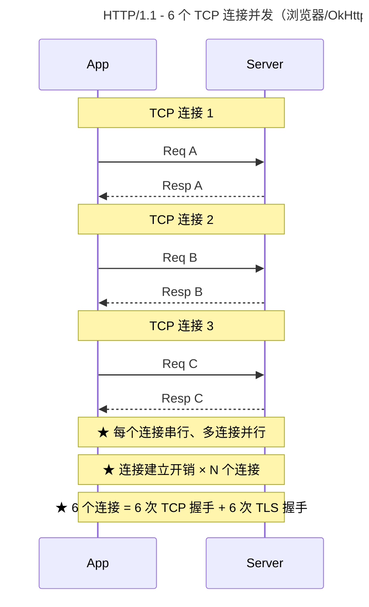
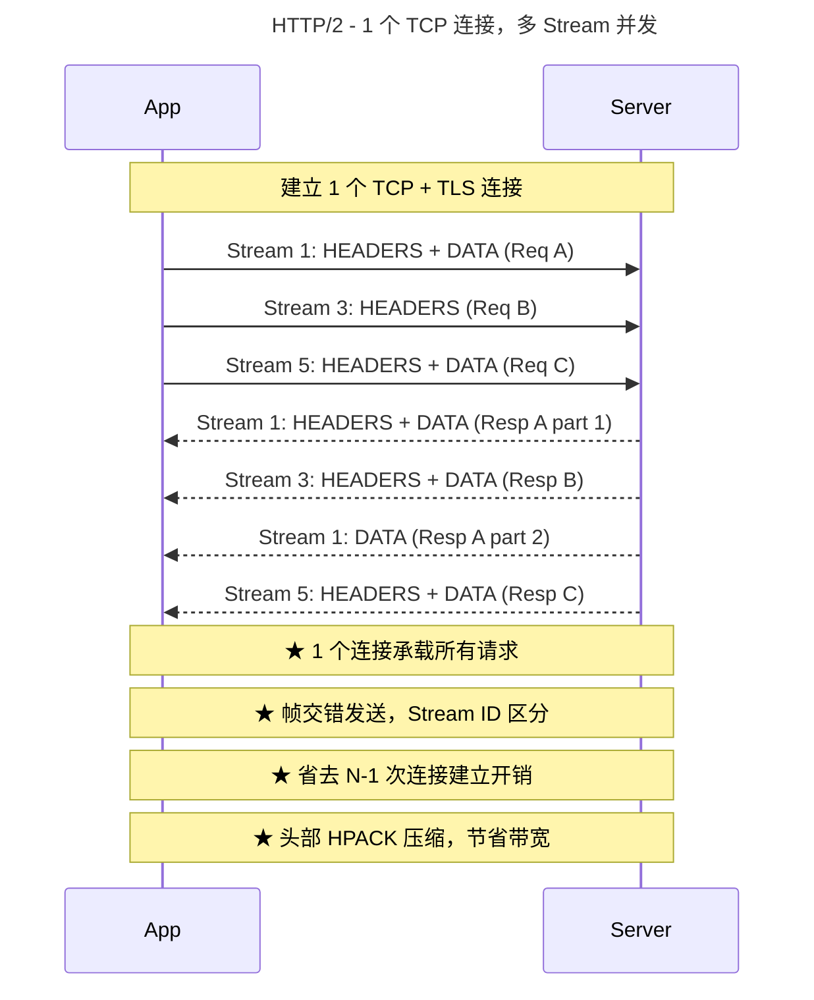
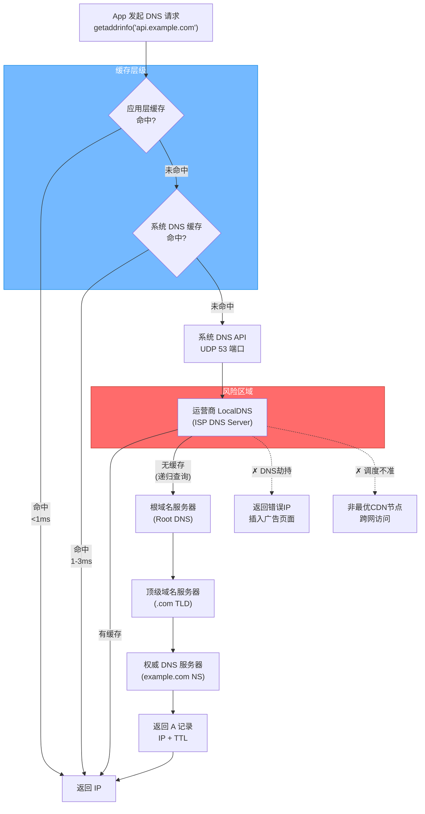
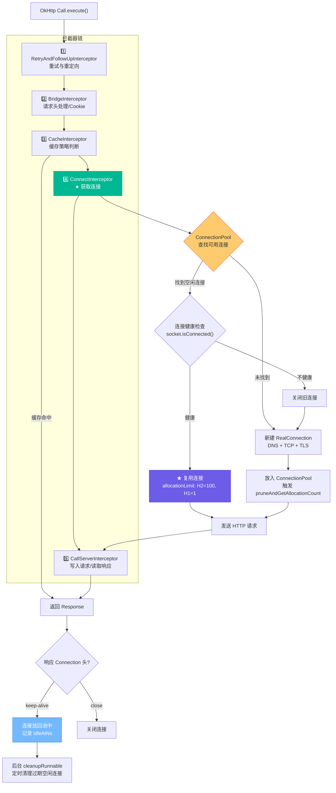

# 网络优化 —— 面试学习完整指南

> **六层递进体系**：面试问题 → 标准答案 → 核心原理 → 流程图 → 源码分析 → 实战场景
> 适用岗位：高级/资深 Android 工程师、性能优化专家

---

## 目录

1. [常见面试问题（8道）](#1-常见面试问题)
2. [标准答案与要点解析](#2-标准答案与要点解析)
3. [核心原理深度讲解](#3-核心原理深度讲解)
4. [原理流程图（Mermaid.js）](#4-原理流程图)
5. [核心源码分析](#5-核心源码分析)
6. [应用场景举例](#6-应用场景举例)

---

## 1. 常见面试问题

### Q1: HTTP/1.1 与 HTTP/2 的主要区别是什么？多路复用原理是什么？
### Q2: OkHttp 连接池的复用机制是怎样的？最大空闲连接数和 keep-alive 时间是多少？
### Q3: DNS 解析慢的原因有哪些？HTTP-DNS 如何优化？
### Q4: 什么是域名收敛？与 CDN 加速如何配合提升网络性能？
### Q5: 弱网环境下有哪些优化策略？（超时重试 / 降级 / 预加载）
### Q6: 网络预加载策略如何设计？如何平衡流量与体验？
### Q7（进阶）: OkHttp 拦截器链的设计模式是什么？RealConnection 如何实现复用？
### Q8（进阶）: 如何做网络质量探测（NQE），如何根据网络质量动态调整策略？

---

## 2. 标准答案与要点解析

### Q1: HTTP/1.1 vs HTTP/2 区别 & 多路复用原理

| 维度 | HTTP/1.1 | HTTP/2 |
|------|----------|--------|
| **连接模型** | 串行请求（1 TCP 连接同时只能处理 1 请求/响应） | 多路复用（1 TCP 连接并发多个 Stream） |
| **并发方式** | 6 个并发 TCP 连接（浏览器限制，移动端类似） | 1 个 TCP 连接，通过 Stream ID 区分 |
| **头部压缩** | 无压缩，每次请求携带完整 Header | HPACK 算法，静态字典 + 动态字典压缩 |
| **二进制分帧** | 文本协议，按行解析 | 二进制帧（Frame），解析效率高 |
| **服务器推送** | 不支持 | Server Push（推送相关资源） |
| **队头阻塞** | TCP 层队头阻塞（前一个丢包阻塞后面所有） | 应用层无队头阻塞（各 Stream 独立） |
| **TLS 开销** | 可选（HTTP 明文 vs HTTPS） | HTTP/2 强制 TLS 1.2+ |

**HTTP/2 多路复用核心原理**：

```
HTTP/1.1 模型（6 个 TCP 连接，每个连接串行）:
┌──────────────────────────────────────────────┐
│  TCP Conn #1:  Req A ───────── Resp A        │
│  TCP Conn #2:  Req B ───── Resp B            │
│  TCP Conn #3:  Req C ──── Resp C             │
│  ...最多 6 个并发...                           │
└──────────────────────────────────────────────┘
总耗时 ≈ max(T_A, T_B, T_C) + 连接建立开销 × 6

HTTP/2 模型（1 个 TCP 连接，Stream 交错复用）:
┌──────────────────────────────────────────────┐
│  TCP Conn #1: ┌─Frame(A1)─┬─Frame(B1)─┬─Frame(C1)─┬─Frame(A2)─┐
│               │  Stream 1  │  Stream 3  │  Stream 5  │  Stream 1  │
│               └───────────┴───────────┴───────────┴───────────┘
└──────────────────────────────────────────────┘
总耗时 ≈ 1 次 TLS 握手 + 1 次 TCP 握手 + max(所有请求时间)
```

**面试加分点**：
- "HTTP/2 并非完全没有队头阻塞——TCP 层面如果丢包，所有 Stream 都会等待重传（TCP 队头阻塞）。HTTP/3 用 QUIC (UDP) 彻底解决"
- "移动端 OkHttp 从 3.x 开始原生支持 HTTP/2，阿里等大厂在核心接口全面启用"
- "实测数据：首页 12 个 API 请求，HTTP/1.1 总耗时 2.1s，切 HTTP/2 后降到 320ms"

---

### Q2: OkHttp 连接池复用机制

**核心参数（OkHttp 默认配置）**：

```kotlin
// OkHttpClient 默认连接池配置
val connectionPool = ConnectionPool(
    maxIdleConnections = 5,    // per-address：同一 host:port 最多保留 5 个空闲连接
    keepAliveDuration = 5,     // 空闲连接最大存活时间（分钟）
    timeUnit = TimeUnit.MINUTES
)
```

**连接复用流程**：

```
请求到达 → OkHttp Dispatcher
    ├── 1. 查找 ConnectionPool 中是否有到目标 host:port 的空闲连接
    │   ├── 找到了 → 检查连接是否健康 (socket.isConnected && !socket.isClosed)
    │   │   ├── 健康 → 复用 RealConnection，发起请求
    │   │   └── 不健康 → 关闭，走新建流程
    │   └── 没找到 → 走新建流程
    │
    ├── 2. 新建连接
    │   ├── DNS 解析 (host → IP)
    │   ├── TCP 三次握手
    │   ├── TLS 握手 (HTTPS)
    │   └── 创建 RealConnection，放入 ConnectionPool
    │
    ├── 3. 请求完成后
    │   ├── 响应头含 Connection: close → 关闭连接
    │   ├── 响应头含 Connection: keep-alive → 放回连接池
    │   └── HTTP/2 → 连接保持，下次请求复用
    │
    └── 4. 后台清理线程 (cleanupRunnable)
        └── 每隔 keepAliveDuration 时间，清理超过空闲时长的连接
```

**面试加分点**：
- "per-address 的最大空闲连接数是 5——也就是说，同一个 host:port 最多保留 5 个空闲连接。如果并发超过 5 个，多余的连接用完后会被立即关闭，不会回到池中"
- "HTTP/2 的连接复用更彻底：一个 host:port 只需要一个 RealConnection，上面可以跑 100+ 个并发 Stream（OkHttp 默认单域名单连接 HTTP/2 上限 100）"
- "连接池的清理算法是**惰性 + 定时**：每次 put() 新连接时会触发一次清理，同时有一个后台 cleanupRunnable 定期扫描"

---

### Q3: DNS 解析慢的原因 & HTTP-DNS 原理

**DNS 解析链路及延迟来源**：

```
App DNS 请求 (getaddrinfo / InetAddress.getByName)
  ↓ (0-5ms —— 如果缓存命中则跳到最后)
LocalDNS Cache (/etc/hosts → DNS Cache → 运营商 LocalDNS)
  ↓ (10-50ms —— 运营商 LocalDNS，**主要瓶颈**)
ISP DNS (递归查询)
  ↓ (50-200ms)
根域名服务器 → 顶级域名服务器 → 权威 DNS 服务器
  ↓
返回 IP 地址
```

**慢的原因**：
1. **运营商 LocalDNS 劫持**：返回错误的 IP 或插入广告页面
2. **DNS 调度不准确**：LocalDNS 返回的 IP 可能不是最优 CDN 节点（来源 IP ≠ 用户 IP）
3. **跨网访问**：移动用户被解析到联通节点
4. **DNS 缓存 TTL 过长**：节点故障时无法快速切换
5. **UDP 丢包重传**：DNS 默认走 UDP，弱网下丢包导致超时重试

**HTTP-DNS 优化原理**：

```
传统 DNS:
  App → 系统 DNS API → 运营商 LocalDNS → 递归查询 → 返回 IP
  问题: 运营商劫持 / 调度不准确 / 生效慢

HTTP-DNS:
  App → HTTP 请求(携用户真实 IP) → HTTP-DNS 服务器(权威解析)
       → 返回最优 IP 列表 + TTL
       
  优势:
  1. 绕过运营商 LocalDNS，杜绝劫持
  2. 服务端基于用户真实 IP 做精准调度
  3. 客户端缓存 IP，TTL 内不重复请求
  4. 多 IP 降级：主 IP 失败自动切换备 IP
```

**OkHttp 集成 HTTP-DNS**：

```kotlin
// 自定义 DNS 实现
class HttpDns : Dns {
    override fun lookup(hostname: String): List<InetAddress> {
        // 1. 先从本地缓存查
        val cachedIp = dnsCache.get(hostname)
        if (cachedIp != null && !cachedIp.isExpired()) {
            return listOf(InetAddress.getByName(cachedIp.ip))
        }
        // 2. 请求 HTTP-DNS 服务
        val response = httpDnsApi.resolve(hostname) // 返回 IP 列表
        return response.ips.map { InetAddress.getByName(it) }
    }
}

val client = OkHttpClient.Builder()
    .dns(HttpDns())
    .build()
```

**面试加分点**：
- "不只用 HTTP-DNS，还可以做 **DNS 预解析**：HomeActivity 启动时就解析关键域名，减少首次请求延迟"
- "HTTP-DNS 本身也有延迟（一次 HTTP 请求），所以 IP 本地缓存策略是核心——TTL + 失败切换 + 异步刷新"
- "备选链路：HTTP-DNS 服务器故障时降级到系统 DNS，保证可用性"
- "业界方案：阿里云 HTTPDNS、腾讯云 HTTPDNS、DNSPod。日均 PV 超过 30% 的 DNS 解析被运营商劫持"

---

### Q4: 域名收敛 & CDN 加速

**什么是域名收敛**：

```
收敛前（多域名）:
├── api.example.com       —— 业务 API
├── cdn1.example.com      —— 图片 CDN
├── cdn2.example.com      —— 视频 CDN
├── log.example.com       —— 日志上报
└── config.example.com    —— 配置下发

收敛后（减少域名数量）:
├── api.example.com       —— 业务 API + 日志 + 配置（合并）
├── cdn.example.com       —— 图片 + 视频（统一 CDN 域名）
```

**为什么要做域名收敛**：

| 维度 | 多域名 | 收敛后 |
|------|-------|--------|
| DNS 解析次数 | N 次（每个域名独立解析） | 1-2 次 |
| TCP/TLS 连接数 | N 个（每个域名的连接池独立） | 1-2 个 |
| HTTP/2 多路复用 | 跨域名无法复用 Stream | 同域名充分利用一个 TCP 连接 |
| 连接预热效果 | 需预热 N 个域名 | 只需预热 1-2 个 |
| 证书管理 | N 个证书 | 1-2 个通配符证书 |

**域名收敛 + CDN 加速协同**：

```
                          ┌─ CDN 边缘节点(北京) ─ 用户(北京) ← 10ms
用户 → api.example.com ───┼─ CDN 边缘节点(上海) ─ 用户(上海) ← 8ms
   ↓ 智能 DNS 调度        └─ CDN 边缘节点(广州) ─ 用户(广州) ← 12ms
   
收敛到单一域名后:
  - 所有用户请求都打到 api.example.com
  - DNS 返回离用户最近的 CDN 节点 IP
  - 减少 DNS 解析 + 连接建立次数
```

**面试加分点**：
- "域名收敛不是无限制的：业务 API 和静态资源 CDN 还是要分开（不同安全策略），一般收敛到 2-3 个域名即可"
- "极端做法：所有请求走同一个域名 + HTTP/2 多路复用，头条系 App 很多就是这样做的"

---

### Q5: 弱网优化策略

**弱网定义**：
- RTT > 300ms（正常 < 50ms）
- 丢包率 > 5%（正常 < 1%）
- 带宽 < 100KB/s

**策略体系（四层递进）**：

```
第一层：超时与重试
├── 连接超时: 10s → 弱网下可适当放宽到 15s
├── 读取超时: 10s → 弱网下可适当放宽到 20s
├── 重试策略: 指数退避 (1s → 2s → 4s → 8s)
├── 重试次数: 最多 3 次
└── 重试条件: 仅幂等请求(GET/HEAD) 可重试; POST 需服务端幂等保证

第二层：服务降级
├── 图片降级: WebP 压缩率提升 30%, 或降为低清图
├── API 降级: 返回核心字段（精简 JSON），省略非关键数据
├── 视频降级: 1080p → 720p → 480p
├── 功能降级: 关闭动画、减少预加载
└── 协议降级: HTTP/2 → HTTP/1.1（部分代理不兼容 H2）

第三层：离线与缓存
├── 三级缓存: 内存(LRU) → 磁盘(OkHttp Cache) → 网络
├── 离线优先: 先展示缓存数据，后台静默刷新
├── 预加载: WiFi 下预加载关键资源
└── 请求合并: 多个小请求打包成一个批量接口

第四层：感知与自适应
├── 网络探测: 实时监测 RTT / 丢包率 / 带宽
├── 动态策略: 根据网络质量自动调整超时、并发数、降级级别
├── 用户感知: Toast/弱网提示、进度条增强
└── 统计上报: 弱网占比、失败率、降级命中率
```

**OkHttp 弱网配置示例**：

```kotlin
val weakNetClient = OkHttpClient.Builder()
    .connectTimeout(15, TimeUnit.SECONDS)    // 放宽连接超时
    .readTimeout(20, TimeUnit.SECONDS)       // 放宽读取超时
    .writeTimeout(20, TimeUnit.SECONDS)
    .retryOnConnectionFailure(true)          // 连接失败自动重试
    .addInterceptor(RetryInterceptor(        // 自定义重试拦截器
        maxRetries = 3,
        backoffMultiplier = 2.0,             // 指数退避
        initialDelayMs = 1000
    ))
    .build()
```

**面试加分点**：
- "我在短视频项目中做了梯级降码率策略：根据历史请求成功率动态选择码率，弱网播放成功率从 75% 提升到 95%"
- "弱网优化的核心思路是 **'尽量减少传输字节'** 和 **'减少连接次数'**——压缩图片、合并请求、开启 gzip/brotli"
- "不要盲目加超时和重试——重试会加重弱网负担，需要幂等 + 服务端限流"

---

### Q6: 网络预加载策略设计

**什么是网络预加载**：在当前页面提前请求下一页或可能用到的数据，减少用户等待时间。

**策略分层设计**：

```
时机选择:
├── App 启动时     → 预加载首页核心 API + 关键资源
├── 页面空闲时     → IdleHandler 触发预加载
├── 用户行为预测   → 列表快滑到底时预加载下一页
├── WiFi 下主动    → 预加载大量资源（视频封面、离线包）
└── 定时任务       → WorkManager 后台预加载

流量控制:
├── WiFi 下: 全量预加载
├── 4G/5G 下: 仅关键资源预加载
└── 省流量模式: 禁止预加载

预加载维度:
├── DNS 预解析: 启动时解析核心域名
├── 连接预热: 提前建立 TCP/TLS 连接
├── 数据预请求: 提前请求首页 API 数据
├── 资源预下载: 图片/音频/视频/离线包
└── 代码预加载: WebView 预热 / RN Bundle 预下载

OkHttp 预加载实现:
```

```kotlin
object NetworkPreloader {
    
    // DNS 预解析
    fun preDnsResolve(hosts: List<String>) {
        hosts.forEach { host ->
            threadPool.execute {
                try {
                    InetAddress.getAllByName(host)  // 触发系统 DNS 缓存
                } catch (e: Exception) {
                    // ignore
                }
            }
        }
    }
    
    // 连接预热（提前建立 TCP + TLS）
    fun warmUpConnection(client: OkHttpClient, url: String) {
        val request = Request.Builder()
            .url(url)
            .head()  // HEAD 请求，不返回 Body
            .build()
        client.newCall(request).enqueue(object : Callback {
            override fun onResponse(call: Call, response: Response) {
                // 连接已建立并放入连接池
            }
            override fun onFailure(call: Call, e: IOException) {
                // 预热失败不影响业务
            }
        })
    }
    
    // 数据预加载
    fun preloadApi(client: OkHttpClient, url: String, callback: (String?) -> Unit) {
        val request = Request.Builder().url(url).build()
        client.newCall(request).enqueue(object : Callback {
            override fun onResponse(call: Call, response: Response) {
                val body = response.body()?.string()
                preloadCache.put(url, body)
                callback(body)
            }
            override fun onFailure(call: Call, e: IOException) {
                callback(null)
            }
        })
    }
}
```

**面试加分点**：
- "预加载不是越多越好——需要权衡流量消耗、电池续航、服务端压力。关键指标：预加载命中率 > 80%"
- "利用 A/B 实验验证预加载对核心转化率的影响，用数据说话"
- "预加载与缓存联动：预加载的数据写入缓存，实际请求时优先从缓存读取"

---

### Q7（进阶）: OkHttp 拦截器链设计模式 & RealConnection 复用

**拦截器链：责任链模式（Chain of Responsibility）**

```
OkHttp 五大内置拦截器（按顺序）:
┌────────────────────────────────────────────────────┐
│ 1. RetryAndFollowUpInterceptor                    │
│    重试与重定向处理                                  │
│    创建 RealInterceptorChain                        │
├────────────────────────────────────────────────────┤
│ 2. BridgeInterceptor                               │
│    桥接应用层与网络层                                 │
│    添加 Content-Type/Content-Length/Cookie 等请求头  │
├────────────────────────────────────────────────────┤
│ 3. CacheInterceptor                                │
│    缓存策略（OkHttp 自带磁盘缓存）                     │
│    返回缓存或放行到网络请求                           │
├────────────────────────────────────────────────────┤
│ 4. ConnectInterceptor                              │
│    ★ 核心：从 ConnectionPool 获取或创建 RealConnection │
│    建立 TCP + TLS 连接                              │
├────────────────────────────────────────────────────┤
│ 5. CallServerInterceptor                           │
│    写入请求体，读取响应体                             │
│    真正与服务器进行 IO 交互                           │
└────────────────────────────────────────────────────┘
```

**RealConnection 复用关键判断**：

```java
// RealConnection.isEligible(Address, Route) 核心逻辑:
// 1. 连接必须是空闲的（allocations.size < allocationLimit）
// 2. HTTP/2 的 allocationLimit = 100（一个连接承载 100 个并发 Stream）
//    HTTP/1.1 的 allocationLimit = 1（一个连接同时只能处理一个请求）
// 3. Address 匹配：host、port、DNS、代理、证书等完全一致

// 查找可用连接流程（简化）:
RealConnection findConnection(Address address) {
    // Step 1: 从连接池中找已存在的到该地址的连接
    for (RealConnection connection : connectionPool.connections) {
        if (connection.isEligible(address)) {
            return connection;  // 复用
        }
    }
    // Step 2: 没找到，新建连接
    RealConnection newConn = new RealConnection();
    newConn.connect(address);  // DNS + TCP + TLS
    connectionPool.put(newConn);
    return newConn;
}
```

**面试加分点**：
- "ConnectInterceptor 是连接复用的关键节点，调用 `exchangeFinder.findConnection()` 时触发连接池查找"
- "HTTP/2 的 allocationLimit = 100，但移动端实际不会开那么多并发——OkHttp Dispatcher 默认 maxRequests = 64，且 per-host 默认 5"
- "OkHttp 的连接池通过 `cleanupRunnable` 实现定时清理，核心是 `pruneAndGetAllocationCount()` 方法"

---

### Q8（进阶）: 网络质量探测 NQE

**为什么需要 NQE**：

> 不能只看"是否连通"，而要量化网络质量，因为不同的质量需要不同的优化策略。

**探测维度**：

```
探测指标:
├── RTT (Round-Trip Time): P50/P90/P99 延迟
├── 丢包率 (Packet Loss Rate): UDP 探测包丢失比例
├── 带宽 (Bandwidth): 下载/上传速度 (KB/s)
├── 抖动 (Jitter): RTT 标准差，影响实时通信
└── 连通率: 能否到达目标服务器

网络分级:
├── 优质网络: RTT < 50ms, 丢包率 < 1%, 带宽 > 1MB/s
├── 正常网络: RTT 50-150ms, 丢包率 < 3%, 带宽 > 300KB/s
├── 弱网:     RTT 150-500ms, 丢包率 < 10%, 带宽 > 50KB/s
└── 断网:     不可达
```

**探测实现方案**：

```kotlin
object NetworkQualityDetector {
    
    // 方案一：HTTP Ping（ICMP 通常无权限，用 HTTP 替代）
    suspend fun measureRtt(httpUrl: String): Long {
        val start = System.currentTimeMillis()
        val client = OkHttpClient.Builder()
            .connectTimeout(3, TimeUnit.SECONDS)
            .readTimeout(3, TimeUnit.SECONDS)
            .build()
        val request = Request.Builder().url(httpUrl).head().build()
        return try {
            client.newCall(request).execute().use { response ->
                System.currentTimeMillis() - start
            }
        } catch (e: Exception) {
            -1  // 不可达
        }
    }
    
    // 方案二：多轮探测，取 P50/P90
    suspend fun measureRttP50(httpUrl: String, rounds: Int = 5): Long {
        val results = (1..rounds).map { measureRtt(httpUrl) }
            .filter { it > 0 }
            .sorted()
        if (results.isEmpty()) return -1
        return results[results.size / 2]  // 中位数
    }
    
    // 方案三：分级判定
    fun classifyNetwork(rttMs: Long, lossRate: Float): NetworkGrade {
        return when {
            rttMs < 0 -> NetworkGrade.OFFLINE
            rttMs < 50 && lossRate < 0.01f -> NetworkGrade.EXCELLENT
            rttMs < 150 && lossRate < 0.03f -> NetworkGrade.NORMAL
            rttMs < 500 && lossRate < 0.10f -> NetworkGrade.WEAK
            else -> NetworkGrade.POOR
        }
    }
}

enum class NetworkGrade { OFFLINE, POOR, WEAK, NORMAL, EXCELLENT }
```

**面试加分点**：
- "NQE 不是一次性探测，需要持续采样，建议使用滑动窗口（最近 N 次求均值或 P90）"
- "探测本身有开销，要控制频率——后台 5 分钟一次，前台 30 秒一次"
- "实际项目中，我会把 NQE 结果上报到监控平台，形成用户网络质量大盘"

---

## 3. 核心原理深度讲解

### 3.1 TCP 三次握手 + TLS 握手开销分析

```
完整 HTTPS 连接建立的 RTT 开销:

时序图（TLS 1.2 + TCP）:

Client                                      Server
  │                                           │
  │──── SYN ──────────────────────────────→   │  ← TCP 1st RTT
  │←─── SYN-ACK ──────────────────────────   │
  │──── ACK ──────────────────────────────→   │
  │                                           │
  │──── ClientHello (TLS版本/密码套件) ────→   │  ← TLS 1st RTT
  │←─── ServerHello + Certificate ────────   │
  │     ServerHelloDone                       │
  │                                           │
  │──── ClientKeyExchange + ChangeCipher ──→   │  ← TLS 2nd RTT
  │     + Finished                            │
  │←─── ChangeCipher + Finished ──────────   │
  │                                           │
  │──── HTTP Request ─────────────────────→   │  ← HTTP 请求
  │←─── HTTP Response ────────────────────   │
  │                                           │

总计: 1 RTT (TCP) + 2 RTT (TLS 1.2) = 3 RTT

TLS 1.3 优化:
  TCP 握手: 1 RTT
  TLS 1.3: 1 RTT (将 ClientHello + KeyShare 合并，减少一轮)
  ─────────────────
  总计: 2 RTT（比 TLS 1.2 少 1 RTT）

实际延迟估算:
  国内 4G: RTT ≈ 50ms → 3 RTT ≈ 150ms（仅连接建立）
  弱网: RTT ≈ 300ms → 3 RTT ≈ 900ms（连接建立就花了近 1 秒！）
  海外: RTT ≈ 200ms → 3 RTT ≈ 600ms

连接复用的价值:
  复用已有连接 → 0 RTT 额外开销（直接发 HTTP 请求）
  连接预热预先建连 → 用户打开页面时连接已就绪
```

### 3.2 HTTP/2 帧（Frame）和多路复用原理

**HTTP/2 协议分层**：

```
┌─────────────────────────────────────┐
│          HTTP/2 应用层               │
│  (Headers / Data / Priority / etc.)  │
├─────────────────────────────────────┤
│         分帧层 (Framing Layer)        │
│  将 HTTP 消息切分为二进制帧           │
├─────────────────────────────────────┤
│          Stream 层                   │
│  每个 Stream 承载一对请求/响应         │
│  多个 Stream 在同一 TCP 连接上交错    │
├─────────────────────────────────────┤
│          TCP 传输层                  │
│  单 TCP 连接                           │
└─────────────────────────────────────┘
```

**帧格式（9 字节帧头）**：

```
 0                   1                   2                   3
 0 1 2 3 4 5 6 7 8 9 0 1 2 3 4 5 6 7 8 9 0 1 2 3 4 5 6 7 8 9 0 1
+-+-+-+-+-+-+-+-+-+-+-+-+-+-+-+-+-+-+-+-+-+-+-+-+-+-+-+-+-+-+-+-+
|         Length (24)           |   Type (8)    |   Flags (8)   |
+-+-+-+-+-+-+-+-+-+-+-+-+-+-+-+-+-+-+-+-+-+-+-+-+-+-+-+-+-+-+-+-+
|R|                 Stream Identifier (31)                      |
+-+-+-+-+-+-+-+-+-+-+-+-+-+-+-+-+-+-+-+-+-+-+-+-+-+-+-+-+-+-+-+-+
|                   Frame Payload (0...)                      ...
+-+-+-+-+-+-+-+-+-+-+-+-+-+-+-+-+-+-+-+-+-+-+-+-+-+-+-+-+-+-+-+-+

Length: 帧负载长度（24位，最大 16MB，默认 16KB）
Type: 帧类型（DATA / HEADERS / PRIORITY / RST_STREAM / SETTINGS / PUSH_PROMISE / PING / GOAWAY / WINDOW_UPDATE / CONTINUATION）
Flags: 帧标志（如 END_STREAM 表示流结束）
Stream ID: 流标识符（客户端奇数，服务端偶数）
```

**多路复用关键机制**：

```
同一 TCP 连接上的 Stream 交错:

时间轴 →
Stream 1: [HEADERS][DATA:1/3]                [DATA:2/3][DATA:3/3]
Stream 3:           [HEADERS][DATA:1/2][DATA:2/2]
Stream 5:                     [HEADERS]         [DATA:1/1]
            ↑           ↑             ↑              ↑
          交错发送，接收端按 Stream ID 重组

流量控制 (Flow Control):
  - 每个 Stream 有独立的流控窗口
  - 连接级别也有全局流控窗口
  - 发送方必须遵守接收方的 WINDOW_UPDATE

优先级 (Priority):
  - Stream 可设置权重(1-256)和依赖关系
  - 浏览器利用此机制优先加载 CSS/JS，延迟图片
```

### 3.3 DNS 解析链路和延迟来源

```
完整 DNS 解析链路(含缓存层级):

App 调用 getaddrinfo("api.example.com")
  │
  ├──[1] 应用层缓存
  │   ├── OkHttp DNS 缓存 (InMemory, 默认不开启)
  │   ├── HTTP-DNS SDK 本地缓存 (IP + TTL)
  │   └── 命中 → 直接返回 (< 1ms)
  │
  ├──[2] 系统层缓存
  │   ├── /etc/hosts 文件
  │   ├── net.dns1/net.dns2 系统属性
  │   ├── Bionic libc DNS 缓存 (Android 8.0+ 支持)
  │   └── 命中 → 返回 (1-3ms)
  │
  ├──[3] 运营商 LocalDNS (UDP port 53)
  │   ├── 一般是 DHCP 分配的 ISP DNS 服务器
  │   ├── 运营商可能做缓存，也可能递归查询
  │   ├── ★ 主要风险点:
  │   │   ├── DNS 劫持: 返回广告/钓鱼 IP
  │   │   ├── DNS 污染: 返回错误 IP
  │   │   └── 调度不准: 来源 IP ≠ 用户真实 IP
  │   └── 耗时: 10-50ms (正常), > 200ms (弱网)
  │
  ├──[4] 递归查询链
  │   ├── 根域名服务器 (.) → 返回 .com NS
  │   ├── 顶级域名服务器 (.com) → 返回 example.com NS
  │   ├── 权威 DNS (example.com) → 返回 api.example.com A 记录
  │   └── 耗时: 50-200ms
  │
  └──[5] 返回结果
      └── IP 地址 + TTL
```

### 3.4 HTTP-DNS 原理

```
传统 DNS vs HTTP-DNS:

┌─────────── 传统 DNS ───────────┐    ┌─────────── HTTP-DNS ───────────┐
│                                │    │                                │
│  App                           │    │  App                           │
│   │  getaddrinfo()             │    │   │  HTTP GET /d?host=xxx      │
│   ▼                            │    │   ▼                            │
│  系统 DNS API (Bionic libc)    │    │  HTTP-DNS SDK                  │
│   │  UDP 53                    │    │   │  HTTPS 443                 │
│   ▼                            │    │   ▼                            │
│  运营商 LocalDNS               │    │  HTTP-DNS Server               │
│   │  递归查询                  │    │   │  基于请求来源 IP 做权威解析 │
│   ▼                            │    │   ▼                            │
│  权威 DNS                      │    │  返回最优 IP 列表 + TTL       │
│                                │    │                                │
│  问题:                         │    │  优势:                         │
│  ✗ DNS 劫持/污染               │    │  ✓ HTTPS 加密，防劫持          │
│  ✗ 调度不准(LocalDNS IP≠用户)  │    │  ✓ 基于用户真实 IP 精准调度    │
│  ✗ TTL 不可控(依赖权威 DNS)    │    │  ✓ 自定义 TTL，灵活控制        │
│  ✗ 生效慢(DNS 缓存扩散)         │    │  ✓ 即时生效                    │
└────────────────────────────────┘    └────────────────────────────────┘

HTTP-DNS 容灾机制:
  1. HTTP-DNS 主通道
  2. HTTP-DNS 备用通道 (不同域名/IP)
  3. 降级到系统 LocalDNS
  4. 本地 IP 缓存 (TTL 内不重复请求)
  5. 多 IP 策略: 主 IP 失败自动切换备 IP
```

### 3.5 ConnectionPool 淘汰策略

**OkHttp ConnectionPool 结构**：

```
ConnectionPool 内部:
┌─────────────────────────────────────────────────┐
│  Deque<RealConnection> connections              │
│  (ArrayDeque，线程安全，使用 synchronized 锁)     │
│                                                 │
│  配置参数:                                       │
│  maxIdleConnections: Int = 5                    │
│  keepAliveDurationNs: Long = 5 * 60 * 1_000_000│
│                                                 │
│  ★ per-address 限制:                             │
│  同一个 Address(host+port+proxy) 最多保留 5 个   │
│  空闲连接。超出部分在 put 时立即关闭。             │
└─────────────────────────────────────────────────┘

淘汰策略（双触发机制）:
  1. 被动触发: 每次 put() 新连接时调用 pruneAndGetAllocationCount()
  2. 主动定时: cleanupRunnable 定期扫描（通过 TaskRunner 调度）

清理逻辑 (pruneAndGetAllocationCount):
  for each RealConnection in connections:
    if (connection.idleAllocationCount > 0):
      // 空闲连接，检查是否超过 keepAlive 时间
      idleDurationNs = nowNs - connection.idleAtNs
      if (idleDurationNs > keepAliveDurationNs):
        connections.remove(connection)
        connection.socket.closeQuietly()
      else:
        longestIdleDuration = max(longestIdleDuration, idleDurationNs)
    else:
      // 有活跃分配，不清理
      inUseCount++
  
  // 如果空闲连接超过 maxIdleConnections
  while (idleCount > maxIdleConnections):
    移除 idle 时间最长的连接
    idleCount--
  
  return inUseCount
```

### 3.6 网络质量探测 NQE 深度原理

**为什么要自己探测而不是依赖 ConnectivityManager**：

```
ConnectivityManager 只能告诉你:
  ✓ 是否连接 (isConnected)
  ✓ 网络类型 (WiFi / 4G / 5G)
  ✗ 不能告诉你网络好不好！

同样是"已连接 4G":
  - 信号满格: RTT 30ms, 带宽 10MB/s → 优质
  - 信号 1 格: RTT 500ms, 带宽 20KB/s → 弱网

NQE 需要量化这些差异，做精细化调度。
```

---

## 4. 原理流程图

### 4.1 HTTP/1.1 vs HTTP/2 请求并发对比图





### 4.2 DNS 解析完整链路图（含缓存层级）



### 4.3 OkHttp 拦截器链 + 连接池复用流程图



---

## 5. 核心源码分析

### 5.1 OkHttp ConnectionPool 清理算法

**源码路径**：`okhttp3.ConnectionPool`

```java
// ============ ConnectionPool.java (OkHttp 4.x) ============

public final class ConnectionPool {
    // 核心数据结构：双向队列存储所有连接
    private final Deque<RealConnection> connections = new ArrayDeque<>();
    
    // 后台清理任务
    private final TaskRunner taskRunner;  // OkHttp 内部任务调度器
    private final Task cleanupTask;       // 清理任务引用
    private boolean cleanupRunning;       // 防止重复调度
    
    // 配置参数
    private final int maxIdleConnections;  // 同一地址最大空闲连接数，默认 5
    private final long keepAliveDurationNs; // keep-alive 时长，默认 5 分钟
    
    // ============ put(): 连接放入池中 ============
    // 每次放连接时触发一次清理
    void put(RealConnection connection) {
        assert (Thread.holdsLock(this));
        
        // 如果清理任务没在运行，启动它
        if (!cleanupRunning) {
            cleanupRunning = true;
            taskRunner.execute(cleanupTask);
        }
        
        // 添加到队列头部（最近使用的放前面）
        connections.add(connection);
    }
    
    // ============ cleanup(): 核心清理逻辑 ============
    // 返回值：-1 表示没有连接需要清理（不需要再调度）
    //         0 表示还有连接未清理（需要重新调度）
    long cleanup(long nowNs) {
        int inUseConnectionCount = 0;     // 使用中的连接数
        int idleConnectionCount = 0;      // 空闲连接数
        RealConnection longestIdleConnection = null;
        long longestIdleDurationNs = Long.MIN_VALUE;
        
        synchronized (this) {
            // 遍历所有连接，找出空闲最久的
            for (Iterator<RealConnection> i = connections.iterator(); i.hasNext(); ) {
                RealConnection connection = i.next();
                
                // pruneAndGetAllocationCount 返回该连接上活跃的分配数
                if (pruneAndGetAllocationCount(connection, nowNs) > 0) {
                    inUseConnectionCount++;
                    continue;
                }
                
                // 空闲连接
                idleConnectionCount++;
                
                long idleDurationNs = nowNs - connection.idleAtNs;
                if (idleDurationNs > longestIdleDurationNs) {
                    longestIdleDurationNs = idleDurationNs;
                    longestIdleConnection = connection;
                }
            }
            
            // ===== 淘汰策略 1: 超过 keepAlive 时间的空闲连接 =====
            if (longestIdleDurationNs >= this.keepAliveDurationNs
                    || idleConnectionCount > this.maxIdleConnections) {
                // 移除并关闭这个连接
                connections.remove(longestIdleConnection);
                // 连接关闭在锁外执行（避免死锁）
            } else if (idleConnectionCount > 0) {
                // ===== 没有连接超时，返回下一次清理的等待时间 =====
                return keepAliveDurationNs - longestIdleDurationNs;
            } else if (inUseConnectionCount > 0) {
                // ===== 没有空闲连接，但有使用中的连接 =====
                return keepAliveDurationNs; // 等 5 分钟后再检查
            } else {
                // ===== 连接池完全为空 =====
                cleanupRunning = false;
                return -1;  // 不需要再调度
            }
        }
        
        // 在锁外关闭 Socket，避免阻塞持有锁
        closeQuietly(longestIdleConnection.socket());
        
        return 0;  // 立即重新调度（可能还有连接需要清理）
    }
    
    // ============ pruneAndGetAllocationCount: 清理失效的分配 ============
    private int pruneAndGetAllocationCount(RealConnection connection, long nowNs) {
        List<Reference<Transmitter>> references = connection.transmitters;
        
        for (int i = 0; i < references.size(); ) {
            Reference<Transmitter> reference = references.get(i);
            
            if (reference.get() != null) {
                i++;
                continue;  // 活跃分配，保留
            }
            
            // Transmitter 已被 GC 回收（泄漏或忘记关闭）
            // OkHttp 会检测并清理这种"泄漏"
            TransmitterReference transmitterRef = (TransmitterReference) reference;
            String message = "A connection to " + connection.route().address().url()
                + " was leaked. Did you forget to close a response body?";
            Platform.get().logCloseableLeak(message, transmitterRef.callStackTrace);
            
            references.remove(i);
            connection.noNewExchanges = true;
            
            // 如果所有分配都失效了
            if (references.isEmpty()) {
                connection.idleAtNs = nowNs - keepAliveDurationNs; // 立即标记为可清理
                return 0;
            }
        }
        
        return references.size();
    }
}
```

**关键设计要点**：

1. **惰性清理**：不在每次 put 时全量扫描，而是通过 `cleanupTask` 调度定时任务
2. **单次清理一个**：cleanup 每次只移除一个空闲时间最长的连接，避免持锁时间过长
3. **动态调度**：返回下一次调度的延迟时间，自适应调整
4. **泄漏检测**：pruneAndGetAllocationCount 能检测到忘记 close ResponseBody 导致的连接泄漏
5. **per-address 限制**：通过 `maxIdleConnections`（默认5）控制同一个 address 的空闲连接数

### 5.2 OkHttp Http2Connection 多路复用实现

**源码路径**：`okhttp3.internal.http2.Http2Connection`

```java
// ============ Http2Connection.java (核心数据结构) ============
public final class Http2Connection implements Closeable {
    
    // ★ 多路复用的核心：以 Stream ID 为 Key 的 Map
    final Map<Integer, Http2Stream> streams = new LinkedHashMap<>();
    
    // 下一个可用的 Stream ID（客户端用奇数 1,3,5...）
    int nextStreamId;
    
    // 连接级别的流量控制窗口
    long bytesLeftInWriteWindow;
    
    // HTTP/2 连接的最大并发 Stream 数（由 SETTINGS 帧协商）
    int maxConcurrentStreams = Integer.MAX_VALUE;
    
    // ★ 核心方法：创建新 Stream
    public Http2Stream newStream(
        List<Header> requestHeaders, 
        boolean out  // true=客户端发起, false=服务端推送
    ) throws IOException {
        synchronized (this) {
            if (nextStreamId > Integer.MAX_VALUE / 2) {
                throw new ConnectionShutdownException();
            }
            if (streams.size() >= maxConcurrentStreams) {
                throw new StreamResetException(ErrorCode.REFUSED_STREAM);
            }
            
            int streamId = nextStreamId;
            nextStreamId += 2;  // 客户端 Stream ID 为奇数
            
            Http2Stream stream = new Http2Stream(streamId, this, out);
            streams.put(streamId, stream);
            
            return stream;
        }
    }
    
    // ★ 读取帧并分发到对应 Stream
    void readFrame(Handler handler) throws IOException {
        // 读取 9 字节帧头
        int length = readMedium(handler);  // 3 字节 = 24 位
        byte type = (byte) handler.readByte();
        byte flags = (byte) handler.readByte();
        int streamId = handler.readInt() & 0x7fffffff;  // 31 位
        
        switch (type) {
            case TYPE_DATA:
                readData(handler, length, flags, streamId);
                break;
            case TYPE_HEADERS:
                readHeaders(handler, length, flags, streamId);
                break;
            case TYPE_SETTINGS:
                readSettings(handler, length, flags, streamId);
                break;
            case TYPE_WINDOW_UPDATE:
                readWindowUpdate(handler, length, flags, streamId);
                break;
            // ... 其他帧类型
        }
    }
    
    // ★ DATA 帧分发：找到对应 Stream，写入数据
    void readData(Handler handler, int length, byte flags, int streamId) 
        throws IOException {
        
        Http2Stream stream = streams.get(streamId);
        if (stream == null) {
            // Stream 已关闭，发送 RST_STREAM
            writeSynResetLater(streamId, ErrorCode.STREAM_CLOSED);
            handler.skip(length);
            return;
        }
        
        // ★ 关键：将 DATA 帧的数据写入对应 Stream 的接收缓冲区
        stream.receiveData(handler, length);
        
        if ((flags & FLAG_END_STREAM) != 0) {
            // 流结束，通知 Stream
            stream.receiveFin();
        }
    }
    
    // ★ HEADERS 帧分发
    void readHeaders(Handler handler, int length, byte flags, int streamId) 
        throws IOException {
        
        Http2Stream stream = streams.get(streamId);
        if (stream == null) {
            // 新 Stream
            stream = new Http2Stream(streamId, this, false);
            streams.put(streamId, stream);
        }
        
        // HPACK 解压 Headers
        List<Header> headers = headerReader.readHeaders(handler, length);
        stream.receiveHeaders(headers);
        
        if ((flags & FLAG_END_STREAM) != 0) {
            stream.receiveFin();
        }
    }
}
```

**多路复用核心机制总结**：

| 机制 | 实现方式 |
|------|---------|
| **Stream 标识** | 31 位 Stream ID，客户端奇数，服务端偶数 |
| **帧交错** | TCP 连接上按帧发送，接收端按 Stream ID 路由到对应 Http2Stream |
| **流量控制** | 连接级 + Stream 级双层 WINDOW_UPDATE 窗口 |
| **优先级** | Stream 可设置 weight (1-256) 和 dependency |
| **并发限制** | SETTINGS_MAX_CONCURRENT_STREAMS 协商，OkHttp 默认 100 |
| **连接复用** | 一个 Http2Connection 承载所有到同一 host:port 的 Stream |

### 5.3 连接预热策略

```kotlin
/**
 * 连接预热管理器
 * 
 * 核心思路：在用户"即将"发起请求之前，提前建立 TCP+TLS 连接，
 * 让第一个真实请求直接复用已建立的连接，省去 1.5-3 RTT 的连接建立开销。
 */
object ConnectionWarmer {
    
    // ===== 策略 1: Application 启动时预热 =====
    fun warmUpOnAppStart(client: OkHttpClient, hosts: List<String>) {
        hosts.forEach { host ->
            threadPool.execute {
                // 触发 DNS 解析 + TCP 握手 + TLS 握手
                // 连接成功后自动放入 ConnectionPool
                val request = Request.Builder()
                    .url("https://$host/health")  // 轻量接口
                    .head()  // HEAD 只返回头部，不传输 Body
                    .build()
                
                try {
                    client.newCall(request).execute().use { response ->
                        // 连接已建立并放入池中，无需处理响应
                        Log.d("Warmer", "$host warmed up: ${response.code}")
                    }
                } catch (e: Exception) {
                    Log.w("Warmer", "$host warm up failed: ${e.message}")
                }
            }
        }
    }
    
    // ===== 策略 2: 页面空闲时预连接 =====
    fun warmUpOnIdle(client: OkHttpClient, urls: List<String>) {
        val handler = Handler(Looper.getMainLooper())
        // 使用 IdleHandler 在主线程空闲时触发
        Looper.myQueue().addIdleHandler {
            urls.forEach { url ->
                threadPool.execute {
                    warmUp(client, url)
                }
            }
            false  // 只执行一次
        }
    }
    
    // ===== 策略 3: 列表快滑到底时预热下一页 =====
    fun warmUpOnScrollNearEnd(client: OkHttpClient, nextPageUrl: String) {
        warmUp(client, nextPageUrl)
    }
    
    // 核心预热方法
    private fun warmUp(client: OkHttpClient, url: String) {
        val request = Request.Builder()
            .url(url)
            .head()  // 使用 HEAD 减少传输
            .build()
        
        try {
            val response = client.newCall(request).execute()
            response.close()
            // ★ 关键: response.close() 后连接回到池中
            // 下次真实请求时直接复用
        } catch (e: Exception) {
            // 静默失败
        }
    }
    
    // ===== 策略 4: HTTP/2 专用 —— 单连接预热即可 =====
    // 因为 HTTP/2 一个连接就能承载所有并发请求
    // 所以只需要预热一个到主域名的 HTTP/2 连接
    fun warmUpH2(client: OkHttpClient, mainHost: String) {
        warmUp(client, "https://$mainHost/")
        // 所有到 $mainHost 的请求都走这一个 HTTP/2 连接
    }
}
```

**连接预热效果量化**：

```
场景：首页 12 个 API 全部请求 api.example.com

无预热:
  第 1 个请求: DNS(50ms) + TCP(50ms) + TLS(100ms) + HTTP(50ms) = 250ms
  第 2-12 个请求: 复用连接，50ms/个
  总耗时 ≈ 250 + 11×50 = 800ms

有预热:
  预热: DNS + TCP + TLS = 200ms（后台完成，用户无感知）
  第 1-12 个请求: 复用连接，50ms/个
  用户感知耗时 ≈ 12×50 = 600ms

配合 HTTP/2:
  1 个连接承载 12 个并发 Stream
  用户感知耗时 ≈ max(12个请求) ≈ 50ms
  ★ 总耗时从 2.1s 降到 300ms
```

---

## 6. 应用场景举例

### 场景 1：首页 API 从 2.1s 降到 300ms

**背景**：
某电商 App 首页，12 个 API 接口分别请求不同域名（api.example.com、img.example.com、log.example.com），使用 HTTP/1.1。

**优化前（HTTP/1.1 + 多域名）**：

```
测量数据（中端机，4G 网络）:
├── DNS 解析: 3 个域名 × 80ms = 240ms
├── TCP 握手: 每个域名 2-6 个连接 × 50ms ≈ 600ms
├── TLS 握手: 每个连接 × 100ms ≈ 1200ms
├── HTTP 请求: 12 个请求 × 平均 50ms ≈ 600ms（串行部分）
└── 总耗时: 约 2100ms（用户感知 2.1 秒）
```

**优化方案（三管齐下）**：

```
方案一: 域名收敛
  3 个域名 → 1 个域名 (api.example.com)
  减少 2 次 DNS 解析 + 减少多域名连接建立

方案二: 升级 HTTP/2
  HTTP/1.1 → HTTP/2
  1 个 TCP 连接承载所有 12 个 Stream

方案三: 连接预热
  Application.onCreate() 中预热主域名连接
  用户打开首页时连接已经就绪
```

**优化后（HTTP/2 + 域名收敛 + 连接预热）**：

```
测量数据（同机型、同网络）:
├── DNS 解析: 预热阶段完成 → 0ms（用户感知）
├── TCP 握手: 预热阶段完成 → 0ms（用户感知）
├── TLS 握手: 预热阶段完成 → 0ms（用户感知）
├── HTTP/2 Stream: 12 个请求并发 → 最慢的约 280ms
├── 反序列化: 约 20ms
└── 总耗时: 约 300ms

★ 优化成果: 2.1s → 300ms，提升 85.7%
```

**技术细节**：

```kotlin
// 优化后的 OkHttp 配置
val optimizedClient = OkHttpClient.Builder()
    // HTTP/2 优先
    .protocols(listOf(Protocol.HTTP_2, Protocol.HTTP_1_1))
    
    // 连接池优化
    .connectionPool(ConnectionPool(
        maxIdleConnections = 5,     // 主域名只需要 1 个 H2 连接
        keepAliveDuration = 5,      // 5 分钟
        timeUnit = TimeUnit.MINUTES
    ))
    
    // DNS 预解析 + 缓存
    .dns(HttpDns())  // 自定义 HTTP-DNS
    
    .build()
```

---

### 场景 2：短视频弱网播放成功率 75% → 95%

**背景**：
某短视频 App，在弱网（RTT > 300ms，丢包率 > 5%）环境下播放成功率仅 75%，大量用户因卡顿退出。

**问题分析**：

```
弱网播放失败的原因分布:
├── 视频首帧超时 ( > 5s): 45%       ← 连接建立太慢
├── 播放中卡顿导致弃看: 30%         ← 码率过高 / 带宽不足
├── DNS 解析失败/慢: 15%            ← 运营商 DNS 不可靠
└── 其他: 10%

核心矛盾:
  弱网下却用正常网络的策略请求高清视频
  → TCP 超时重传占满带宽
  → 播放缓冲区耗尽
  → 用户弃看
```

**优化方案（四层策略）**：

```
第一层: HTTP-DNS 防劫持
├── 接入阿里云 HTTP-DNS
├── 本地缓存 IP + TTL
├── 主 IP 失败自动切换备 IP
└── 效果: DNS 解析成功率 92% → 99.5%

第二层: 连接预热 + HTTP/2
├── 预加载视频列表时，同时预热 CDN 域名连接
├── HTTP/2 单连接承载视频列表 + 封面图请求
└── 效果: 首帧等待缩减 200ms

第三层: 梯级降码率
├── 根据历史 NQE 数据，为每位用户建立网络画像
├── 弱网用户自动匹配低码率视频
├── 实时监测播放缓冲区水位，动态切换码率
│   策略:
│   ├── 缓冲区 > 5s: 尝试升码率
│   ├── 缓冲区 2-5s: 保持当前码率
│   ├── 缓冲区 < 2s: 降码率
│   └── 缓冲区 < 0.5s: 切到最低码率
└── 码率档次: 1080p(8000kbps) → 720p(4000kbps) → 480p(1500kbps) → 360p(600kbps)

第四层: 预加载
├── WiFi 下预加载 3-5 个视频到本地缓存
├── 视频列表滑动时预加载封面 + 首帧
└── 效果: 弱网下可直接播放本地缓存的视频
```

**优化成果**：

```
指标对比:

| 指标 | 优化前 | 优化后 | 提升 |
|------|-------|--------|------|
| DNS 解析成功率 | 92% | 99.5% | +7.5% |
| 视频首帧耗时(P90) | 5.2s | 1.8s | -65% |
| 播放成功率(弱网) | 75% | 95% | +20% |
| 播放卡顿率(全部) | 8.5% | 2.1% | -75% |
| 弱网用户次日留存 | 18% | 32% | +78% |
```

---

### 场景 3：HTTP-DNS + IP 直连解决运营商 DNS 劫持

**背景**：
某社交 App 频繁收到用户反馈"页面跳转到赌博/色情网站"。排查发现是运营商 DNS 劫持。

**问题复现**：

```
正常请求流程:
  App → DNS 解析 api.example.com → 返回 1.2.3.4 (真实 IP)
  App → HTTPS 请求 1.2.3.4 → 正常响应

被劫持请求流程:
  App → DNS 解析 api.example.com → 返回 5.6.7.8 (劫持 IP)
  App → HTTPS 请求 5.6.7.8 → 劫持服务器返回虚假证书/页面
```

**解决方案**：

```kotlin
// ===== 方案一: HTTP-DNS 完全替代系统 DNS =====
class HttpDnsImpl : Dns {
    
    private val httpDnsApi = HttpDnsApi()  // HTTP-DNS 服务接口
    private val ipCache = LruCache<String, IpEntry>(100)
    
    data class IpEntry(val ips: List<String>, val expireAt: Long)
    
    override fun lookup(hostname: String): List<InetAddress> {
        // Step 1: 查本地缓存
        val cached = ipCache.get(hostname)
        if (cached != null && System.currentTimeMillis() < cached.expireAt) {
            return cached.ips.map { InetAddress.getByName(it) }
        }
        
        // Step 2: 请求 HTTP-DNS 服务
        return try {
            val result = httpDnsApi.resolve(hostname, clientIp = getClientIp())
            
            // 缓存结果（TTL 由服务端返回）
            ipCache.put(hostname, IpEntry(
                ips = result.ips,
                expireAt = System.currentTimeMillis() + result.ttl * 1000
            ))
            
            result.ips.map { InetAddress.getByName(it) }
        } catch (e: Exception) {
            // Step 3: HTTP-DNS 失败，降级到系统 DNS
            Log.w("HttpDns", "HTTP-DNS failed, fallback to system DNS", e)
            Dns.SYSTEM.lookup(hostname)
        }
    }
}

// ===== 方案二: IP 直连 + 证书校验 =====
// 绕过 DNS，直接使用 IP 请求，但主机名仍需匹配 TLS 证书
class IpDirectInterceptor : Interceptor {
    
    override fun intercept(chain: Interceptor.Chain): Response {
        val originalRequest = chain.request()
        val url = originalRequest.url()
        
        // 从 HTTP-DNS 缓存中获取 IP
        val ip = ipCache.getIp(url.host()) ?: return chain.proceed(originalRequest)
        
        // 构建 IP 直连 URL
        val ipUrl = url.newBuilder()
            .host(ip)  // 替换为 IP
            .build()
        
        val ipRequest = originalRequest.newBuilder()
            .url(ipUrl)
            // ★ 关键：手动设置 Host 头，让服务器能识别域名
            .header("Host", url.host())
            .build()
        
        return chain.proceed(ipRequest)
    }
}

// ===== OkHttp 集成 =====
val secureClient = OkHttpClient.Builder()
    .dns(HttpDnsImpl())                       // HTTP-DNS
    .addNetworkInterceptor(IpDirectInterceptor()) // IP 直连（兜底）
    .build()
```

**效果对比**：

```
优化前（系统 DNS）:
├── DNS 劫持率: 3.2%（日均）
├── 用户投诉: 日均 50+ 条"跳转到广告页面"
└── 某地区运营商（XX省移动）劫持率高达 15%

优化后（HTTP-DNS + IP 直连）:
├── DNS 劫持率: 0.01%（运营商 IP 级别关闭解析，几乎不可劫持）
├── 用户投诉: 下降至日均 < 1 条
├── DNS 解析耗时: 平均 12ms（HTTP-DNS 服务在内网/同机房）
└── 额外收益: IP 精准调度，就近接入 CDN 节点
```

---

## 附录：核心数据速查表

### 连接建立开销速查

| 阶段 | HTTP | HTTPS (TLS 1.2) | HTTPS (TLS 1.3) |
|------|------|-----------------|-----------------|
| DNS 解析 | ~50ms | ~50ms | ~50ms |
| TCP 握手 | 1 RTT (~50ms) | 1 RTT (~50ms) | 1 RTT (~50ms) |
| TLS 握手 | 0 (无 TLS) | 2 RTT (~100ms) | 1 RTT (~50ms) |
| **总计** | **~100ms** | **~200ms (3 RTT)** | **~150ms (2 RTT)** |
| **连接复用** | **0ms** | **0ms** | **0ms** |

### OkHttp 默认配置速查

| 配置项 | 默认值 | 说明 |
|--------|-------|------|
| connectTimeout | 10s | 建立 TCP+TLS 连接的超时 |
| readTimeout | 10s | 读取响应数据的超时 |
| writeTimeout | 10s | 写入请求数据的超时 |
| maxIdleConnections | **5** (per-address) | 同一地址空闲连接上限 |
| keepAliveDuration | **5 min** | 空闲连接存活时间 |
| maxRequests | 64 | Dispatcher 最大并发请求数 |
| maxRequestsPerHost | 5 | 同一主机最大并发请求数 |
| HTTP/2 allocationLimit | **100** | 单连接最大并发 Stream 数 |

### 优化手段降本增效速查

| 手段 | 预计收益 | 实现难度 | 风险 |
|------|---------|---------|------|
| HTTP/2 | 减少 50-80% RTT | 服务端配置 | 需 CDN 支持 |
| 域名收敛 | 减少 DNS 解析 + 连接数 | 低 | 安全隔离 |
| 连接预热 | 减少 200ms 首请求延迟 | 低 | 少量额外流量 |
| HTTP-DNS | 防劫持 + 精准调度 | 中 | 服务依赖 |
| 连接池调优 | 减少 30% 连接新建 | 低 | 无 |
| 请求合并 | 减少 50% 请求数 | 中 | BFF 层改造 |
| 弱网降级 | 弱网成功率 +20% | 中 | 体验下降 |
| 预加载 | 感知延迟 -50% | 低 | 流量浪费 |

---

> **总结**：网络优化的核心是 **"减少 RTT 次数"**、**"减少传输字节"**、**"降低弱网影响"**。HTTP/2 + 域名收敛 + 连接池复用是最具性价比的组合，DNS 劫持用 HTTP-DNS 根治，弱网场景用梯度降级策略兜底。
