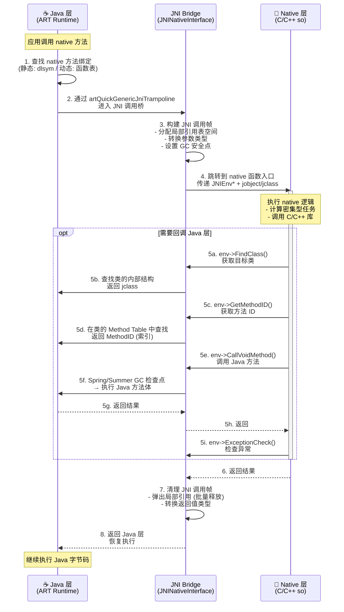

# JNI 基础 —— 面试学习完整指南

> **六层递进体系**：面试问题 → 标准答案 → 核心原理 → 流程图 → 源码分析 → 实战场景
> 适用岗位：高级/资深 Android 工程师、NDK 开发工程师

---

## 目录

1. [面试高频问题（6+题）](#1-面试高频问题)
2. [标准答案与代码示例](#2-标准答案与代码示例)
3. [核心原理深度剖析](#3-核心原理深度剖析)
4. [流程图：JNI 调用全链路](#4-流程图jni-调用全链路)
5. [源码分析：RegisterNatives 与 FindClass](#5-源码分析registernatives-与-findclass)
6. [应用场景：Native 复杂计算 + 进度回调](#6-应用场景native-复杂计算--进度回调)

---

## 1. 面试高频问题

### Q1: JNI 静态注册和动态注册的区别是什么？性能上有何差异？

### Q2: JNI 数据类型映射是怎样的？jstring 与 String、jint 与 int 如何互转？

### Q3: Native 层如何回调 Java 层？写出关键步骤和代码片段

### Q4: JNI 全局引用、局部引用、弱全局引用三者有什么区别？各用于什么场景？

### Q5: JNI 的线程模型是怎样的？JavaVM 和 JNIEnv 的线程绑定机制如何工作？

### Q6: JNI 的异常处理机制是什么？CheckException 和 ExceptionDescribe 如何使用？

### Q7（进阶）：JNI 调用为何比纯 Java 调用有额外开销？"JNI 调用穿过边界" 到底穿了什么？

---

## 2. 标准答案与代码示例

### Q1: 静态注册 vs 动态注册

| 维度 | 静态注册 | 动态注册 |
|:-----|:--------|:--------|
| **定义方式** | 遵循 JNI 命名规则：`Java_包名_类名_方法名` | 通过 `RegisterNatives()` 在 `JNI_OnLoad()` 中手动注册 |
| **方法查找** | 首次调用时通过 `dlsym` 从 so 中按名称查找函数指针 | 启动时一次性注册到 JNI 函数表，直接跳转 |
| **性能** | 首次调用有符号查找开销（约 1~5ms/方法） | 无查找开销，调用路径更短 |
| **混淆兼容** | 类名/包名改变时必须同步修改 native 函数名 | 不受混淆影响（注册时使用运行时的类名） |
| **代码量** | 函数名冗长：`Java_com_example_MyClass_nativeMethod` | 函数名可自定义，简洁 |
| **调试** | 可直接从 so 符号表定位 | 需要额外调试信息 |

**静态注册示例：**

```cpp
// 静态注册：函数名必须严格遵循 JNI 命名规则
extern "C" JNIEXPORT jstring JNICALL
Java_com_example_jni_NativeLib_getStringFromNative(JNIEnv *env, jobject thiz) {
    return env->NewStringUTF("Hello from Native!");
}
```

**动态注册示例：**

```cpp
// 动态注册：在 JNI_OnLoad 中注册
static jstring nativeGetString(JNIEnv *env, jobject thiz) {
    return env->NewStringUTF("Hello from Dynamic Register!");
}

static jint nativeAdd(JNIEnv *env, jobject thiz, jint a, jint b) {
    return a + b;
}

// 方法映射表
static JNINativeMethod gMethods[] = {
    {"getStringFromNative", "()Ljava/lang/String;", (void *)nativeGetString},
    {"add",                 "(II)I",                (void *)nativeAdd},
};

jint JNI_OnLoad(JavaVM *vm, void *reserved) {
    JNIEnv *env = nullptr;
    if (vm->GetEnv((void **)&env, JNI_VERSION_1_6) != JNI_OK) {
        return JNI_ERR;
    }
    jclass clazz = env->FindClass("com/example/jni/NativeLib");
    if (clazz == nullptr) {
        return JNI_ERR;
    }
    // 一次性注册所有 native 方法
    if (env->RegisterNatives(clazz, gMethods,
            sizeof(gMethods) / sizeof(gMethods[0])) < 0) {
        return JNI_ERR;
    }
    return JNI_VERSION_1_6;
}
```

**面试加分点：**
- Android Framework 层大量使用动态注册（如 `android_media_MediaPlayer.cpp`），因为系统服务方法多、对性能要求高
- `RegisterNatives` 本质是重写类的 `native` 方法对应的函数指针，多次注册会**覆盖**之前的绑定（热修复原理可基于此特性）
- 静态注册的 `dlsym` 查找开销是一次性的（有缓存），但多个方法意味着多次 `dlsym`；动态注册只需一次 `FindClass` + 批量 `RegisterNatives`

---

### Q2: JNI 数据类型映射

JNI 定义了两套类型：**基本类型**（Primitive Types）和**引用类型**（Reference Types）。

#### 基本类型映射（一一对应，无开销）

| Java 类型 | JNI 类型 | C/C++ 类型 | 字节 | 说明 |
|:---------|:---------|:-----------|:---|:-----|
| `boolean` | `jboolean` | `unsigned char` (uint8_t) | 1 | JNI_TRUE=1, JNI_FALSE=0 |
| `byte` | `jbyte` | `signed char` (int8_t) | 1 | |
| `char` | `jchar` | `unsigned short` (uint16_t) | 2 | UTF-16 编码单元 |
| `short` | `jshort` | `signed short` (int16_t) | 2 | |
| `int` | `jint` | `signed int` (int32_t) | 4 | |
| `long` | `jlong` | `signed long` (int64_t) | 8 | |
| `float` | `jfloat` | float (32-bit IEEE 754) | 4 | |
| `double` | `jdouble` | double (64-bit IEEE 754) | 8 | |
| `void` | `void` | — | — | 仅用于返回类型 |

**关键认知**：基本类型是**零拷贝传递**，直接复制 1~8 字节到寄存器或栈上，几乎无开销。

#### 引用类型映射（指针传递，有间接开销）

| Java 类型 | JNI 类型 | 本质 |
|:---------|:---------|:-----|
| `java.lang.Object` | `jobject` | 指向 Java 堆对象的 opaque 指针 |
| `java.lang.String` | `jstring` | jobject 的子类型 |
| `java.lang.Class` | `jclass` | jobject 的子类型 |
| `Throwable` | `jthrowable` | jobject 的子类型 |
| 数组（Object[]、int[]…） | `jobjectArray`、`jintArray`… | 各自独立的类型 |
| `java.nio.ByteBuffer` | `jobject` | 无专门类型，通过 `GetDirectBufferAddress` 操作 |

#### String 操作关键代码

```cpp
// Java String → C 字符串（有内存分配 + 复制开销）
jstring jStr = ...;
const char *cStr = env->GetStringUTFChars(jStr, nullptr);
if (cStr == nullptr) {
    // OutOfMemoryError：务必检查！
    return;
}
// 使用 cStr...
env->ReleaseStringUTFChars(jStr, cStr);  // 释放临时缓冲区

// C 字符串 → Java String（有内存分配开销）
const char *msg = "Hello JNI";
jstring result = env->NewStringUTF(msg);

// ★ 推荐：用 GetStringRegion / GetStringCritical 减少拷贝
// GetStringCritical 返回的指针可能指向原始数据（禁用 GC）
const jchar *critical = env->GetStringCritical(jStr, nullptr);
if (critical) {
    // 快速处理，禁止在此期间调用 JNI 阻塞操作
    // ...
    env->ReleaseStringCritical(jStr, critical);
}
```

**面试加分点**：Type Signature（类型签名）是面试常考点：
- `Z` = boolean, `B` = byte, `C` = char, `S` = short, `I` = int, `J` = long, `F` = float, `D` = double
- `V` = void, `L全限定类名;` = 对象（如 `Ljava/lang/String;`）
- `[Type` = 数组（如 `[I` = int[]）
- 方法签名格式：`(参数签名)返回类型签名`，如 `int add(int, int)` → `(II)I`

---

### Q3: Native 层回调 Java 层（FindClass + GetMethodID）

**四步标准流程：**

```cpp
void callbackToJava(JNIEnv *env, jobject thiz, int progress) {
    // 1. 获取调用者的 Class 对象
    jclass clazz = env->GetObjectClass(thiz);
    // 或者用 FindClass：
    // jclass clazz = env->FindClass("com/example/jni/NativeLib");

    // 2. 获取方法 ID（缓存在全局变量中，避免每次查找！）
    static jmethodID sOnProgressMethod = nullptr;
    if (sOnProgressMethod == nullptr) {
        sOnProgressMethod = env->GetMethodID(
            clazz, "onProgressUpdate", "(I)V");
        if (sOnProgressMethod == nullptr) {
            return; // 方法不存在，已抛出 NoSuchMethodError
        }
    }

    // 3. 调用 Java 方法
    env->CallVoidMethod(thiz, sOnProgressMethod, progress);

    // 4. 检查是否发生 Java 异常
    if (env->ExceptionCheck()) {
        env->ExceptionDescribe();
        env->ExceptionClear();
    }
}
```

**关键点**：
- `GetMethodID` 和 `GetFieldID` **必须在有了 `jclass` 后调用**，ID 是类上下文内的偏移量
- MethodID / FieldID **生命周期与类加载器绑定**——类被卸载后 ID 失效
- **强烈建议缓存** MethodID/FieldID 为全局变量（或 `static` 局部变量），`GetMethodID` 内部有哈希查找开销
- 回调时 `jobject thiz` 必须是有效的全局引用（如果跨线程使用）

---

### Q4: 全局引用 vs 局部引用 vs 弱全局引用

| 维度 | 局部引用（LocalRef） | 全局引用（GlobalRef） | 弱全局引用（WeakGlobalRef） |
|:-----|:--------------------|:----------------------|:---------------------------|
| **生命周期** | 当前 native 方法返回后自动释放 | 手动 `DeleteGlobalRef` 前一直有效 | 手动删除前有效，但 GC 可能回收对象 |
| **作用域** | 当前线程、当前调用帧 | 跨线程、跨调用 | 跨线程、跨调用 |
| **GC 行为** | 阻止对象被回收（作为 GC Root） | 阻止对象被回收 | **不阻止 GC 回收**（仅维持一个弱指针） |
| **容量限制** | 每个 JNI 调用帧 ~512 个（不同实现有差异） | 无实质限制（受系统内存限制） | 同 GlobalRef |
| **性能** | 创建/释放几乎无开销 | 创建需加入全局引用表 | 类似 GlobalRef |

```cpp
// 局部引用：默认创建的就是局部引用
jclass localClass = env->FindClass("java/lang/String"); // 局部引用
// ★ 如果循环中大量创建局部引用，需要手动释放
for (int i = 0; i < 1000; i++) {
    jstring temp = env->NewStringUTF("data");
    // 处理 temp...
    env->DeleteLocalRef(temp);  // 避免超出局部引用表上限
}

// 全局引用：跨线程/跨调用使用
static jclass gStringClass = nullptr;
void initGlobalRef(JNIEnv *env) {
    jclass localCls = env->FindClass("java/lang/String");
    gStringClass = (jclass) env->NewGlobalRef(localCls); // 晋升为全局引用
    env->DeleteLocalRef(localCls);  // 释放局部引用
}

// 弱全局引用：观察对象是否被 GC
static jweak gWeakRef = nullptr;
void checkObjectAlive(JNIEnv *env) {
    if (env->IsSameObject(gWeakRef, nullptr)) {
        // 对象已被 GC 回收
    }
}
```

**面试陷阱**：
- `FindClass` 返回的是**局部引用**，跨线程使用必定崩溃（use-after-free）
- `jobject` 作为 native 方法参数传入时，也是**局部引用**，仅在当前调用内有效
- **局部引用表溢出**是常见的 Crash 原因：`JNI ERROR (app bug): local reference table overflow (max=512)`

---

### Q5: JNI 线程模型（JavaVM / JNIEnv 绑定）

**核心概念：**

```
┌─────────────────────────────────────────────────┐
│                   一个进程                        │
│  ┌───────────────────────────────────────────┐  │
│  │         JavaVM (唯一, 进程级单例)           │  │
│  │                                            │  │
│  │  ┌──────┐ ┌──────┐ ┌──────┐ ┌──────┐     │  │
│  │  │Thread│ │Thread│ │Thread│ │Thread│ ... │  │
│  │  │  #1  │ │  #2  │ │  #3  │ │  #N  │     │  │
│  │  │  ↓   │ │  ↓   │ │  ↓   │ │  ↓   │     │  │
│  │  │JNIEnv│ │JNIEnv│ │JNIEnv│ │JNIEnv│     │  │
│  │  │(线程 │ │(线程 │ │(线程 │ │(线程 │     │  │
│  │  │ 独占)│ │ 独占)│ │ 独占)│ │ 独占)│     │  │
│  │  └──────┘ └──────┘ └──────┘ └──────┘     │  │
│  └───────────────────────────────────────────┘  │
└─────────────────────────────────────────────────┘
```

- **JavaVM**：进程唯一，代表整个 Java 虚拟机。所有线程共享。可以通过 `JNI_OnLoad(JavaVM *vm, ...)` 获取并保存。
- **JNIEnv**：线程独占，每个附加到 JVM 的线程拥有独立的 `JNIEnv*`。**绝不能跨线程使用**。

**Native 线程附加到 JVM：**

```cpp
// 全局保存 JavaVM 指针（在 JNI_OnLoad 中）
static JavaVM *gJvm = nullptr;

jint JNI_OnLoad(JavaVM *vm, void *reserved) {
    gJvm = vm;
    return JNI_VERSION_1_6;
}

// 在任意 native 线程中回调 Java
void *nativeThreadFunc(void *arg) {
    JNIEnv *env = nullptr;

    // 将当前 native 线程附加到 JVM
    JavaVMAttachArgs attachArgs;
    attachArgs.version = JNI_VERSION_1_6;
    attachArgs.name = "NativeWorker-1";
    attachArgs.group = nullptr;

    jint result = gJvm->AttachCurrentThread(&env, &attachArgs);
    if (result != JNI_OK) {
        return nullptr; // 附加失败
    }

    // ★ 现在可以使用 env 调用 Java 方法了
    jclass clazz = env->FindClass("com/example/MainActivity");
    // ...

    // 脱离 JVM（释放线程局部资源）
    // 注意：如果是 pthread_create 的线程，务必在退出前 detach
    // 如果是通过 AttachCurrentThread 附加的，detach 后 env 指针失效
    gJvm->DetachCurrentThread();
    return nullptr;
}
```

**关键规则：**
- 通过 `pthread_create` 创建的线程**不是** Java 线程，必须手动 `AttachCurrentThread`
- `AttachCurrentThread` 会创建一个 `java.lang.Thread` 对象（如果作为 daemon 线程，需要在 AttachArgs 中设置）
- 多次 `AttachCurrentThread` 是幂等的（返回已有 JNIEnv）
- **忘记 Detach** 会导致线程局部引用表永不释放，内存泄漏
- **JNIEnv 不可缓存**：每次进入 native 方法时应该使用参数传入的 `env`，不保存到全局变量中（线程安全考虑）

---

### Q6: JNI 异常处理

**JNI 异常与 C++ 异常完全不同**：JNI 异常不会中断 C/C++ 代码的执行流，而是**挂起**在 Java 侧。

```cpp
void exceptionDemo(JNIEnv *env, jobject thiz) {
    // 调用一个可能失败的 Java 方法
    jclass clazz = env->FindClass("java/io/FileInputStream");
    jmethodID constructor = env->GetMethodID(clazz, "<init>",
        "(Ljava/lang/String;)V");
    jstring path = env->NewStringUTF("/nonexistent/file");
    jobject fis = env->NewObject(clazz, constructor, path);

    // ★★★ 关键：即使上面抛出了 FileNotFoundException，
    //      C++ 代码会继续执行！必须显式检查！ ★★★

    // 方式一：ExceptionCheck（推荐，性能更好）
    if (env->ExceptionCheck()) {
        // 有异常挂起
        env->ExceptionDescribe();  // 打印异常栈到 logcat
        env->ExceptionClear();     // 清除异常，继续执行
        return;                    // 跳过后续逻辑
    }

    // 方式二：ExceptionOccurred（返回 jthrowable 对象）
    jthrowable exc = env->ExceptionOccurred();
    if (exc != nullptr) {
        env->ExceptionClear();
        // 可以将异常传到 Java 层或重新抛出
        env->ThrowNew(env->FindClass("java/lang/RuntimeException"),
                      "Native error occurred");
        return;
    }

    // ★ 错误做法：在未清除异常的情况下继续调用其他 JNI 函数
    // 大多数 JNI 函数在有待处理异常时调用会失败或产生未定义行为
}
```

**JNI 异常处理黄金法则：**
1. 每次调用可能失败的 JNI 函数后，**必须**检查异常
2. 在清除异常（`ExceptionClear`）或返回 Java 层之前，**不得**调用其他 JNI 函数（除少数允许的函数列表外）
3. `ExceptionDescribe` 仅用于调试，生产环境应移除或用条件编译包裹
4. Native 层可以通过 `ThrowNew` 向 Java 层抛出异常

---

### Q7: JNI 调用开销分析

"跨界"开销来源：

| 开销类型 | 典型耗时 | 原因 |
|:---------|:-------|:-----|
| 参数转换（基本类型） | ~5~10 ns | 基本类型零拷贝，仅寄存器传递 |
| 参数转换（String/数组） | ~100~500 ns | 内存分配 + 拷贝 + 字符编码转换（UTF-8↔UTF-16） |
| 模式切换（user↔kernel） | 忽略不计 | Android 上 JNI 是同一进程内调用，无系统调用 |
| JNI 函数表间接调用 | ~10~20 ns | 通过 `JNINativeInterface` 函数表指针跳转 |
| GC 调度点检查 | 可变 | ART 在 JNI 边界插入 GC 安全点检查 |
| 丢失 JIT 内联优化 | **最大开销** | Java 层热点代码可被 JIT 激进内联，native 调用完全阻断此优化 |

**性能建议**：频繁跨 JNI 调用的小方法应该合并为一次批量调用，减少跨界次数。

---

## 3. 核心原理深度剖析

### 3.1 JNI 函数表（JNINativeInterface）

JNIEnv 实际上是一个**函数表指针**，它的第一个成员指向 `JNINativeInterface` 结构体：

```cpp
// JNIEnv 本质（简化）
struct JNIEnv_ {
    const struct JNINativeInterface *functions;  // 函数表指针
    // ... 线程局部数据 ...
};

// JNINativeInterface 是一个巨型函数指针表（200+ 个函数）
struct JNINativeInterface {
    void *reserved0;
    void *reserved1;
    void *reserved2;
    void *reserved3;

    jint        (*GetVersion)(JNIEnv *);
    jclass      (*DefineClass)(JNIEnv *, const char*, jobject, const jbyte*, jsize);
    jclass      (*FindClass)(JNIEnv *, const char*);
    // ... 省略 200 多个函数指针 ...

    jint        (*RegisterNatives)(JNIEnv *, jclass, const JNINativeMethod*, jint);
    jint        (*UnregisterNatives)(JNIEnv *, jclass);
};

// 实际调用时：
// env->FindClass("java/lang/String")
//    ↓ 编译为
// env->functions->FindClass(env, "java/lang/String")
//    即通过函数表做一次间接调用
```

**关键洞察**：
- ART 和 Dalvik 有**不同的** `JNINativeInterface` 实现，但接口签名完全一致，保证了二进制兼容
- `CheckJNI` 模式（通过 `adb shell setprop debug.checkjni 1` 开启）会替换函数表为带参数校验的版本，方便调试
- 动态注册的 native 方法函数的**实际调用路径**：Java → `artQuickGenericJniTrampoline` → 函数表查找 → 用户 native 函数

### 3.2 MethodID / FieldID 缓存策略

MethodID 和 FieldID 本质是**类上下文内的索引**（或偏移量），不是字符串。

```
┌──────────────────────────────────┐
│      类的 Method Table            │
│  ┌────────────────────────────┐  │
│  │ [0] java.lang.Object.finalize() │
│  │ [1] com.example.Foo.bar(V)I ← MethodID = 1
│  │ [2] com.example.Foo.baz()V     │
│  │ ...                            │
│  └────────────────────────────┘  │
│                                  │
│  GetMethodID(clazz, "bar", "(V)I")│
│      ↓                           │
│  1. 查哈希表: "bar(V)I" → 索引 1  │
│  2. 返回 MethodID = 1             │
└──────────────────────────────────┘
```

**缓存策略实践：**

```cpp
// ★ 推荐写法：懒初始化 + static 缓存
static jmethodID getCachedMethod(JNIEnv *env, jclass clazz,
                                  const char *name, const char *sig) {
    static jmethodID sCached = nullptr;
    if (sCached == nullptr) {
        sCached = env->GetMethodID(clazz, name, sig);
    }
    return sCached;
}

// ★ 进阶：在 JNI_OnLoad / 类加载时全部预缓存（Android 源码常用方式）
static jmethodID gMethod_onProgress;
static jmethodID gMethod_onComplete;
static jmethodID gMethod_onError;

void cacheAllMethodIDs(JNIEnv *env) {
    jclass clazz = env->FindClass("com/example/NativeCallback");
    // 立即创建全局引用，否则局部引用在函数返回后失效
    jclass globalClazz = (jclass) env->NewGlobalRef(clazz);
    env->DeleteLocalRef(clazz);

    gMethod_onProgress = env->GetMethodID(globalClazz, "onProgress", "(I)V");
    gMethod_onComplete = env->GetMethodID(globalClazz, "onComplete", "()V");
    gMethod_onError    = env->GetMethodID(globalClazz, "onError", "(Ljava/lang/String;)V");
}
```

**警告**：如果 ClassLoader 被替换（如热修复/插件化场景），缓存的 MethodID 可能失效（指向错误的类版本），需要重新缓存。

### 3.3 引用表管理

ART 内部维护了三种引用表：

```
全局引用表 (IndirectReferenceTable):
  ┌──────┬──────────────────────────┐
  │ Idx  │ Object (GcRoot)          │
  │  0   │ java.lang.String@0x1234  │
  │  1   │ com.example.MyClass@...  │
  │ ...  │ ...                      │
  └──────┴──────────────────────────┘
  作为 GC Root，阻止对象被回收

局部引用表 (线程私有, IRT):
  ┌──────┬──────────┐
  │ [0]  │ obj_ptr  │  ← 栈式管理，native 方法返回时批量 pop
  │ [1]  │ obj_ptr  │
  │ ...  │  (max=512) │
  └──────┴──────────┘
  每个 JNI 帧有独立的引用段
```

**局部引用表溢出的根本原因**：在循环中创建局部引用而不手动释放。ART 会在 native 方法返回后统一清理，但如果单次调用内部创建超过 512 个局部引用就会立即溢出。

```cpp
// 正确做法：使用 PushLocalFrame / PopLocalFrame 控制作用域
env->PushLocalFrame(64);  // 预留 64 个槽位
for (int i = 0; i < 10000; i++) {
    jstring s = env->NewStringUTF("data");
    // 处理...
    // 每个 s 在当前 frame 内分配，循环末尾如果不手动 DeleteLocalRef
    // 也不会溢出（因为 PushLocalFrame 确保了容量管理的上下文）
}
env->PopLocalFrame(nullptr);  // 一次性释放 frame 内所有局部引用
```

---

## 4. 流程图：JNI 调用全链路



---

## 5. 源码分析：RegisterNatives 与 FindClass

### 5.1 RegisterNatives 实现（ART Runtime 源码）

以下基于 AOSP `art/runtime/jni/jni_internal.cc` 简化分析：

```cpp
// 简化版 RegisterNatives 核心逻辑
static jint RegisterNatives(JNIEnv* env, jclass java_class,
                            const JNINativeMethod* methods, jint method_count) {
    // 1. 参数校验
    if (method_count < 0) {
        return JNI_ERR;
    }

    // 2. 获取 ART 内部表示的 Class 对象 (mirror::Class)
    ScopedObjectAccess soa(env);
    ObjPtr<mirror::Class> klass = soa.Decode<mirror::Class>(java_class);
    if (klass == nullptr) {
        return JNI_ERR;
    }

    // 3. 遍历待注册的方法列表
    for (jint i = 0; i < method_count; i++) {
        const char* name = methods[i].name;       // 方法名
        const char* sig  = methods[i].signature;  // 方法签名
        void* fnPtr      = methods[i].fnPtr;      // native 函数指针

        // 4. 在类的 ArtMethod 表中查找匹配的方法
        ArtMethod* method = nullptr;
        // 遍历 klass 的虚方法表 + 直接方法表，匹配 name + signature
        // ...

        if (method == nullptr) {
            // 没有找到对应的 native 声明
            return JNI_ERR;
        }

        // 5. ★ 关键：将 native 函数指针写入 ArtMethod 结构体
        method->SetEntryPointFromJni(fnPtr);

        // 同时更新 native 方法的 GC 标记等元信息
        // ...
    }

    return JNI_OK;
}
```

**核心原理总结**：
- `RegisterNatives` 的本质是**修改 `ArtMethod` 结构体中的函数指针字段**
- 调用完成后，`ArtMethod` 直接从新的函数指针执行，不再需要 `dlsym` 查找
- 这也是为什么热修复框架（如 Tinker、Sophix）可以通过 `RegisterNatives` 替换 native 方法实现

### 5.2 FindClass 实现

```cpp
// 简化版 FindClass 核心逻辑
static jclass FindClass(JNIEnv* env, const char* name) {
    ScopedObjectAccess soa(env);

    // 1. 将类名中的 '/' 替换为 '.'（JNI 使用 '/' 分隔，ART 内部用 '.'）
    std::string descriptor(name);
    std::replace(descriptor.begin(), descriptor.end(), '/', '.');

    // 2. 获取当前线程的 ClassLoader（从调用栈顶部的类获取）
    ObjPtr<mirror::ClassLoader> class_loader =
        GetClassLoaderFromCaller(soa);  // ★ 关键：使用调用者的 ClassLoader

    // 3. 通过 ClassLoader 加载类
    //    如果类已经加载，直接从 ClassTable 返回
    ClassLinker* class_linker = Runtime::Current()->GetClassLinker();
    ObjPtr<mirror::Class> klass = class_linker->FindClass(
        soa.Self(), descriptor.c_str(), class_loader);

    if (klass == nullptr) {
        // 类未找到：通过 ExceptionCheck 可获知 ClassNotFoundException
        return nullptr;
    }

    // 4. 触发类的初始化（执行静态初始化块）
    //    ★ 注意：FindClass 会触发 <clinit> 执行
    if (!class_linker->EnsureInitialized(soa.Self(), klass, true, true)) {
        return nullptr;
    }

    // 5. 返回 JNI 引用（局部引用）
    return soa.AddLocalReference<jclass>(klass);
}
```

**面试关键点**：
- `FindClass` 使用**调用者的 ClassLoader**，这意味着在 native 线程（无 Java 调用栈）中调用 `FindClass` 会使用 System ClassLoader，可能找不到应用类。解决方案：在 `JNI_OnLoad` 中提前 `FindClass` 并 `NewGlobalRef` 缓存。
- `FindClass` 会触发**类的静态初始化**（`<clinit>`），如果初始化过程耗时或死锁，调用会被阻塞。

---

## 6. 应用场景：Native 复杂计算 + 进度回调

**场景描述**：对大型图片进行像素级滤镜处理（如高斯模糊），在 Native 层使用多线程加速计算，并实时回调进度给 Java 层更新进度条。

### Java 层代码

```java
public class ImageProcessor {
    static {
        System.loadLibrary("imageprocessor");
    }

    // Native 方法声明
    public native void applyBlur(String inputPath, String outputPath, int radius);

    // 供 Native 回调的方法
    public void onProgress(int percent) {
        // 在主线程更新 UI 进度条
        runOnUiThread(() -> progressBar.setProgress(percent));
    }

    public void onComplete(String outputPath) {
        runOnUiThread(() -> {
            Toast.makeText(this, "处理完成: " + outputPath, Toast.LENGTH_SHORT).show();
        });
    }

    public void onError(String errorMsg) {
        runOnUiThread(() -> {
            Toast.makeText(this, "处理失败: " + errorMsg, Toast.LENGTH_SHORT).show();
        });
    }
}
```

### Native 层代码（C++）

```cpp
#include <jni.h>
#include <pthread.h>
#include <android/log.h>

#define LOG_TAG "ImageProcessor"
#define LOGI(...) __android_log_print(ANDROID_LOG_INFO, LOG_TAG, __VA_ARGS__)

// ===== 全局变量 =====
static JavaVM *gJvm = nullptr;

// 缓存的 MethodID
static jmethodID gMethod_onProgress = nullptr;
static jmethodID gMethod_onComplete = nullptr;
static jmethodID gMethod_onError = nullptr;

// ===== 工作线程参数 =====
struct BlurTask {
    jclass callbackClass;       // 全局引用
    jobject callbackObject;     // 全局引用
    int blurRadius;
    char inputPath[256];
    char outputPath[256];
};

// ===== JNI_OnLoad: 全局初始化 =====
jint JNI_OnLoad(JavaVM *vm, void *reserved) {
    gJvm = vm;

    JNIEnv *env = nullptr;
    if (vm->GetEnv((void **)&env, JNI_VERSION_1_6) != JNI_OK) {
        return JNI_ERR;
    }

    // 预缓存 MethodID
    jclass clazz = env->FindClass("com/example/ImageProcessor");
    if (clazz == nullptr) return JNI_ERR;

    gMethod_onProgress = env->GetMethodID(clazz, "onProgress", "(I)V");
    gMethod_onComplete = env->GetMethodID(clazz, "onComplete", "(Ljava/lang/String;)V");
    gMethod_onError    = env->GetMethodID(clazz, "onError", "(Ljava/lang/String;)V");

    LOGI("JNI_OnLoad: MethodIDs cached successfully");
    return JNI_VERSION_1_6;
}

// ===== 回调工具函数 =====
static void callbackProgress(jobject callbackObj, int percent) {
    JNIEnv *env = nullptr;
    bool needDetach = false;

    // 获取当前线程的 JNIEnv
    jint result = gJvm->GetEnv((void **)&env, JNI_VERSION_1_6);
    if (result == JNI_EDETACHED) {
        // 当前是纯 native 线程，需要附加
        if (gJvm->AttachCurrentThread(&env, nullptr) != JNI_OK) {
            LOGE("AttachCurrentThread failed");
            return;
        }
        needDetach = true;
    }

    // 调用 Java 回调
    env->CallVoidMethod(callbackObj, gMethod_onProgress, percent);

    // 检查异常
    if (env->ExceptionCheck()) {
        LOGE("Exception in onProgress callback");
        env->ExceptionDescribe();
        env->ExceptionClear();
    }

    if (needDetach) {
        gJvm->DetachCurrentThread();
    }
}

static void callbackComplete(jobject callbackObj, const char *path) {
    JNIEnv *env = nullptr;
    bool needDetach = false;
    if (gJvm->GetEnv((void **)&env, JNI_VERSION_1_6) == JNI_EDETACHED) {
        gJvm->AttachCurrentThread(&env, nullptr);
        needDetach = true;
    }

    jstring jPath = env->NewStringUTF(path);
    env->CallVoidMethod(callbackObj, gMethod_onComplete, jPath);
    env->DeleteLocalRef(jPath);

    if (needDetach) gJvm->DetachCurrentThread();
}

static void callbackError(jobject callbackObj, const char *msg) {
    JNIEnv *env = nullptr;
    bool needDetach = false;
    if (gJvm->GetEnv((void **)&env, JNI_VERSION_1_6) == JNI_EDETACHED) {
        gJvm->AttachCurrentThread(&env, nullptr);
        needDetach = true;
    }

    jstring jMsg = env->NewStringUTF(msg);
    env->CallVoidMethod(callbackObj, gMethod_onError, jMsg);
    env->DeleteLocalRef(jMsg);

    if (needDetach) gJvm->DetachCurrentThread();
}

// ===== 模拟图像处理（工作线程） =====
static void *blurWorker(void *arg) {
    BlurTask *task = (BlurTask *)arg;

    LOGI("Blur worker started: radius=%d", task->blurRadius);

    // 模拟分阶段处理（共 100 步）
    for (int step = 0; step <= 100; step += 10) {
        // 模拟计算耗时
        usleep(200000);  // 200ms

        // 回调进度
        callbackProgress(task->callbackObject, step);
    }

    // 处理完成回调
    callbackComplete(task->callbackObject, task->outputPath);

    // 释放全局引用
    JNIEnv *env = nullptr;
    bool needDetach = false;
    if (gJvm->GetEnv((void **)&env, JNI_VERSION_1_6) == JNI_EDETACHED) {
        gJvm->AttachCurrentThread(&env, nullptr);
        needDetach = true;
    }
    env->DeleteGlobalRef(task->callbackClass);
    env->DeleteGlobalRef(task->callbackObject);
    delete task;
    if (needDetach) gJvm->DetachCurrentThread();

    LOGI("Blur worker finished");
    return nullptr;
}

// ===== Native 方法实现（在 Java 调用线程中执行） =====
extern "C" JNIEXPORT void JNICALL
Java_com_example_ImageProcessor_applyBlur(
        JNIEnv *env, jobject thiz,
        jstring inputPath, jstring outputPath, jint radius) {

    // 1. 获取 Java 字符串
    const char *inPath = env->GetStringUTFChars(inputPath, nullptr);
    const char *outPath = env->GetStringUTFChars(outputPath, nullptr);

    // 2. 构建任务参数（注意：thiz 是局部引用，需提升为全局引用）
    BlurTask *task = new BlurTask();
    task->blurRadius = radius;
    strncpy(task->inputPath, inPath, sizeof(task->inputPath) - 1);
    strncpy(task->outputPath, outPath, sizeof(task->outputPath) - 1);

    jclass cls = env->GetObjectClass(thiz);
    task->callbackClass = (jclass) env->NewGlobalRef(cls);
    task->callbackObject = env->NewGlobalRef(thiz);

    env->DeleteLocalRef(cls);

    // 3. 释放 Java 字符串
    env->ReleaseStringUTFChars(inputPath, inPath);
    env->ReleaseStringUTFChars(outputPath, outPath);

    // 4. 创建 Native 工作线程（异步处理）
    pthread_t workerThread;
    if (pthread_create(&workerThread, nullptr, blurWorker, task) != 0) {
        callbackError(thiz, "Failed to create worker thread");
        env->DeleteGlobalRef(task->callbackClass);
        env->DeleteGlobalRef(task->callbackObject);
        delete task;
        return;
    }
    pthread_detach(workerThread);  // 分离线程，自动回收

    LOGI("applyBlur: worker thread launched, radius=%d", radius);
}
```

### CMakeLists.txt

```cmake
cmake_minimum_required(VERSION 3.18.1)
project("imageprocessor")

add_library(imageprocessor SHARED
    image_processor.cpp
)

target_link_libraries(imageprocessor
    android    # for __android_log_print
    log        # liblog
)
```

### 架构要点总结

| 关注点 | 方案 | 原因 |
|:-------|:-----|:-----|
| **跨线程回调** | 全局引用 + `AttachCurrentThread` | Native 线程无 JNIEnv，必须附加 |
| **MethodID 缓存** | `JNI_OnLoad` 中预缓存到全局变量 | 避免每次回调都 `GetMethodID`（哈希查找） |
| **异常处理** | 每次回调后 `ExceptionCheck` | Java 层回调可能抛异常，必须清理 |
| **线程安全** | `pthread` + `GetEnv` 判断附加状态 | `AttachCurrentThread` 是幂等的 |
| **内存管理** | 全局引用手动 `DeleteGlobalRef` | 防止 Java 对象泄漏 |
| **字符串处理** | `GetStringUTFChars` → 拷贝到 C 数组 → `Release` | 尽快释放 JNI 资源，减少 GC 压力 |

---

> **延伸阅读**：[NDK 开发](../02-NDK开发/) | [C++ 与安卓](../03-Cplusplus与安卓/)

*字数统计：约 5200 字 · 最后更新：2026-05-08*
