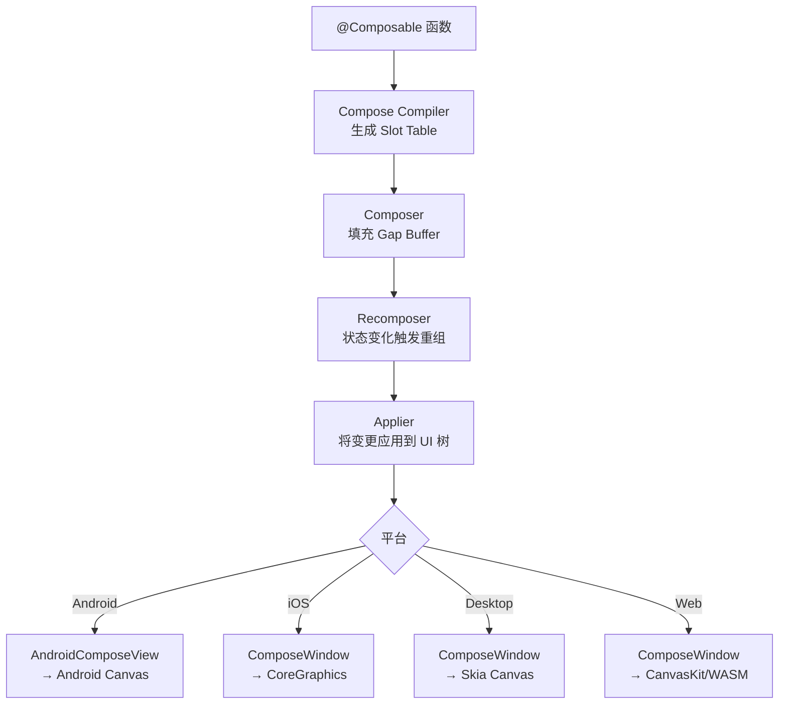

# Compose Multiplatform 面试核心考点深度解析

> 本文档围绕 Compose Multiplatform 面试的高频考点，采用六层递进结构：从基础面试题 → 核心原理深入（Compose Runtime 跨平台渲染）→ 图解架构 → 实战案例分析，帮助读者建立完整的 Compose Multiplatform 知识体系。

---

## 第一层：高频面试题精讲（4+ 道核心题）

### 1. Compose Multiplatform 的共享原理：共享 UI + 共享逻辑

**面试官视角：** 这道题考察候选人是否理解 CMP 区别于其他跨平台方案的核心价值——不仅共享业务逻辑，还共享 UI 代码。

**核心回答：**

Compose Multiplatform（CMP）基于两大技术基石：**Kotlin Multiplatform（KMP）** 负责共享业务逻辑，**Jetpack Compose** 负责共享 UI 层。两者的结合使得开发者可以用同一套 Kotlin 代码同时覆盖 Android、iOS、Desktop（JVM）、Web（实验性）四个平台。

**共享层级模型：**

```
┌─────────────────────────────────────────────────┐
│                 Shared Compose UI                │  ← 跨平台共享（Kotlin）
│  ┌───────────┐ ┌──────────┐ ┌───────────────┐   │
│  │  @Composable│ │ Material3│ │ 自定义组件     │   │
│  └───────────┘ └──────────┘ └───────────────┘   │
├─────────────────────────────────────────────────┤
│             Shared Business Logic (KMP)          │  ← 跨平台共享（Kotlin）
│  ┌───────────┐ ┌──────────┐ ┌───────────────┐   │
│  │  ViewModel│ │ Repository│ │  Network/DTO   │   │
│  └───────────┘ └──────────┘ └───────────────┘   │
├──────────────────┬──────────────────────────────┤
│   Android (Kotlin/JVM)    │   iOS (Kotlin/Native)  │  ← 平台特定
│   expect/actual 实现      │   expect/actual 实现    │
│   AndroidView 嵌入        │   UIKitView 嵌入        │
└──────────────────────────┴──────────────────────────┘
```

**共享原理核心要点：**

| 维度 | 说明 |
|------|------|
| **UI 共享** | `@Composable` 函数编译为平台无关的中间表示，由 Compose Runtime 在每个平台上调用平台原生 Canvas API 完成渲染 |
| **逻辑共享** | KMP 将 Kotlin 编译为各平台目标代码（JVM bytecode / Native binary / JS），共享 ViewModel、Repository 等业务层 |
| **关键机制** | `expect`/`actual` 声明实现平台差异化，Compose Runtime 通过 `Applier` 和 `Composition` 抽象屏蔽平台差异 |
| **代码占比** | 实际项目中共享代码可达 **70%-85%**，仅平台特定能力（相机、蓝牙、支付等）需要原生实现 |

---

### 2. KMP + Compose 的架构分层

**面试官视角：** 这道「定级题」考察候选人是否理解 KMP + CMP 的完整技术栈分层，区分初级「会用」和高级「懂原理」。

**核心回答：**

KMP + Compose Multiplatform 的架构分为四个清晰的分层：

```
┌──────────────────────────────────────────────────┐
│           L4: UI Layer (Compose Multiplatform)     │
│  @Composable functions, Material3, Navigation     │
│  编译为：Android View / iOS UIKit / Desktop AWT   │
├──────────────────────────────────────────────────┤
│           L3: Presentation Layer (KMP shared)      │
│  ViewModel, StateFlow, State management           │
│  kotlinx-coroutines, lifecycle-viewmodel          │
├──────────────────────────────────────────────────┤
│           L2: Domain Layer (KMP shared pure Kt)    │
│  UseCases, Repository interfaces, Entity models   │
│  纯 Kotlin，无平台依赖                              │
├──────────────────────────────────────────────────┤
│           L1: Data Layer (KMP + expect/actual)     │
│  expect/actual: 网络(Ktor/OkHttp), 数据库(SQLDelight/Room), │
│  文件系统, Key-Value存储(Settings)                  │
├──────────────────┬───────────────────────────────┤
│  Android Target  │  iOS Target                   │
│  (Kotlin/JVM)    │  (Kotlin/Native)              │
└──────────────────┴───────────────────────────────┘
```

**分层职责详解：**

| 层级 | 职责 | 关键技术 | 是否跨平台 |
|------|------|---------|-----------|
| **L4 UI** | 声明式 UI 描述 | Compose Runtime, Material3 | ✅ 共享 |
| **L3 Presentation** | 状态管理、 UI 逻辑 | ViewModel, StateFlow | ✅ 共享 |
| **L2 Domain** | 纯业务逻辑 | UseCase, Entity | ✅ 100% 共享 |
| **L1 Data** | 数据源抽象与实现 | expect/actual, Ktor, SQLDelight | ⚠️ 接口共享，实现按平台 |

**关键面试要点：** 面试官通常会追问"为什么 ViewModel 可以放在共享层？"——因为 `androidx.lifecycle:lifecycle-viewmodel` 已支持 KMP，其核心 lifecycle 感知通过 `expect`/`actual` 对接各平台生命周期。

---

### 3. Compose Multiplatform vs Flutter vs React Native

**面试官视角：** 这几乎是跨平台面试的「必考题」，要求候选人对三者技术栈差异有系统性认知，而非泛泛而谈。

**核心回答：**

| 对比维度 | Compose Multiplatform | Flutter | React Native |
|---------|----------------------|---------|--------------|
| **语言** | Kotlin | Dart | JavaScript/TypeScript |
| **UI 范式** | 声明式（@Composable） | 声明式（Widget） | 声明式（React/JSX） |
| **渲染引擎** | 平台原生 Canvas（Android: Canvas, iOS: CoreGraphics, Desktop: Skia/Skiaiko） | Skia / Impeller（自绘） | 平台原生控件（通过 Bridge → Fabric） |
| **逻辑共享方式** | KMP expect/actual | Dart FFI + Platform Channel | JSI / TurboModules |
| **原生 UI 嵌入** | AndroidView / UIKitView | AndroidView / UIKitView | requireNativeComponent |
| **包体积增量** | ~3-5 MB（Compose Runtime） | ~5-8 MB（Flutter Engine） | ~2-7 MB（Hermes/JSC + 框架） |
| **热重载** | ✅ Live Edit（实验性） | ✅ Hot Reload（成熟） | ✅ Fast Refresh（成熟） |
| **原生感** | ⭐⭐⭐⭐⭐ 使用平台原生图形 API | ⭐⭐⭐⭐ 自绘引擎像素级一致 | ⭐⭐⭐⭐ 使用原生控件 |
| **Android 生态** | ⭐⭐⭐⭐⭐ 源自 Android，无缝集成 | ⭐⭐⭐ 需要 Channel 桥接 | ⭐⭐⭐ 需要 Bridge/Module |
| **iOS 生态** | ⭐⭐⭐⭐ Kotlin/Native 成熟度好 | ⭐⭐⭐⭐ 自绘引擎适配好 | ⭐⭐⭐⭐ 映射到 UIKit |
| **Desktop 支持** | ✅ JVM 原生支持 | ✅ 实验性 | ❌ 社区方案 |
| **Web 支持** | ✅ Kotlin/JS（实验性） | ✅ CanvasKit | ✅ React DOM |
| **学习曲线** | 中等（需 Kotlin + Compose） | 中等（需 Dart） | 低（已有 React 基础） |
| **适合团队** | Android 原生团队转型 | 新项目从零构建 | 前端/React 团队扩展 |

**深度追问——核心差异分析：**

1. **渲染路径不同：** Flutter 自绘一切，完全不依赖平台控件；CMP 在 Android 上绘制到 `AndroidCanvas`，在 iOS 上用 `CoreGraphics`，是「平台原生图形 API 层」的自绘，而非「控件层」的自绘；RN 新架构（Fabric）则是在 C++ 层直接操作平台 View 树。

2. **语言与生态：** CMP 的最大优势是 Kotlin 生态复用——Android 团队几乎零学习成本上线 iOS 开发。Ktor、kotlinx.serialization、kotlinx.coroutines 等库直接跨平台可用。

3. **架构哲学：** Flutter 追求「像素一致」，CMP 追求「平台一致的同构 UI」，RN 追求「Learn Once, Write Anywhere」。

---

### 4. 平台适配机制：expect/actual vs AndroidView/UIKitView

**面试官视角：** 这道题考察候选人对 CMP 平台差异化处理的实际工程能力。

**核心回答：**

CMP 提供**两层**平台适配机制：

#### 第一层：`expect`/`actual` —— 逻辑层的平台适配

`expect`/`actual` 是 Kotlin 语言级的关键字，用于在共享代码中声明平台差异接口，由各平台提供具体实现：

```kotlin
// commonMain — 共享声明
expect class PlatformContext {
    fun getPlatformName(): String
}

expect fun getDeviceId(): String

// androidMain — Android 实现
actual class PlatformContext(private val context: android.content.Context) {
    actual fun getPlatformName() = "Android ${Build.VERSION.SDK_INT}"
}
actual fun getDeviceId(): String = 
    Settings.Secure.getString(context.contentResolver, Settings.Secure.ANDROID_ID)

// iosMain — iOS 实现
actual class PlatformContext {
    actual fun getPlatformName(): String = 
        "iOS ${UIDevice.currentDevice.systemVersion}"
}
actual fun getDeviceId(): String = 
    UIDevice.currentDevice.identifierForVendor?.UUIDString ?: "unknown"
```

#### 第二层：`AndroidView`/`UIKitView` —— UI 层的原生控件嵌入

当 Compose 组件无法满足需求（如：地图 SDK、相机预览、WebView），通过 `AndroidView`（Android）和 `UIKitView`（iOS）将原生 View 嵌入 Compose 组件树：

```kotlin
// commonMain — 使用 expect 声明平台 View
@Composable
expect fun MapView(
    latitude: Double,
    longitude: Double,
    modifier: Modifier = Modifier
)

// androidMain — Android 实现：嵌入 MapView
@Composable
actual fun MapView(latitude: Double, longitude: Double, modifier: Modifier) {
    AndroidView(
        modifier = modifier,
        factory = { context ->
            MapView(context).apply {
                // 初始化 Google Maps / 高德地图
            }
        },
        update = { mapView ->
            mapView.animateCamera(/* 更新位置 */)
        }
    )
}

// iosMain — iOS 实现：嵌入 MKMapView
@Composable
actual fun MapView(latitude: Double, longitude: Double, modifier: Modifier) {
    UIKitView(
        modifier = modifier,
        factory = {
            MKMapView().apply {
                setRegion(/* 设置坐标 */, animated = false)
            }
        },
        update = { mapView ->
            mapView.setRegion(/* 更新坐标 */, animated = true)
        }
    )
}
```

**expect/actual vs Platform Channel（Flutter）对比：**

| 维度 | CMP expect/actual | Flutter Platform Channel |
|------|-------------------|--------------------------|
| 调用方式 | 编译时静态绑定，直接函数调用 | 运行时异步消息传递 |
| 类型安全 | ✅ 编译期检查（Kotlin 类型系统） | ⚠️ 运行时类型转换（需 Pigeon 辅助） |
| 性能 | ✅ 零开销抽象（编译期决议） | ⚠️ 异步序列化开销 |
| 开发体验 | 同一 IDE、同语言、可跳转 | Dart ↔ Kotlin/Swift 跨语言 |

---

## 第二层：Compose Runtime 的跨平台渲染原理

### Compose Runtime：UI 与平台的解耦层

**面试官视角：** 这一层考察候选人对 Compose 框架底层运行时的理解，是区分「使用者」和「架构师」的关键。

**核心回答：**

Compose 不是 Android 框架的一部分，而是一个独立的 **编译器插件 + Runtime 库**。其跨平台渲染能力的来源在于：Compose Runtime 定义了一套平台无关的 UI 描述协议，各平台通过实现 `Applier`、`Canvas` 等接口完成渲染对接。

**Compose Runtime 核心三件套：**

```
┌─────────────────────────────────────────────────┐
│              Compose Compiler Plugin              │
│  将 @Composable 函数编译为带状态的中间表示         │
│  (Gap Buffer 管理的 Slot Table)                   │
├─────────────────────────────────────────────────┤
│              Compose Runtime                      │
│  - Composition：管理 UI 树的组合与重组             │
│  - Composer：记录组合状态的变化（Gap Buffer）       │
│  - Applier：将虚拟节点树应用到实际 UI（平台桥接点） │
│  - Snapshot State：细粒度状态追踪 + 智能重组       │
├──────────────┬──────────────────────────────────┤
│  Android     │  iOS / Desktop / Web             │
│  AndroidApplier│  UIKitApplier / ComposeScene     │
│  AndroidCanvas │  Skia Canvas / CoreGraphics       │
└──────────────┴──────────────────────────────────┘
```

**关键概念：Gap Buffer（Composer 的数据结构）**

Compose 使用 **Gap Buffer**（间隙缓冲区）作为 Composer 的内部数据结构来记录组合期间的状态变化。它不是一棵真正的「树」，而是一个**扁平化的线性槽位数组**，通过 Gap Buffer 实现 O(1) 的插入和高效的批量写入。

```
Gap Buffer 示意：
[NodeA, NodeB, ____GAP____, NodeD, NodeE]
                          ↑
                    cursor（当前写入位置）

优势：
- 插入新节点只需移动 GAP → O(1) 均摊
- 批量 emit 时避免树遍历 → 性能稳定
- 平台无关的数据结构 → 天然跨平台
```

**渲染管线全景：**



---

## 第三层：声明式 UI 的跨平台一致性原理

**面试官视角：** 这道题考察 Compose 如何在保证「一次编写」的同时实现各平台的「原生观感」。

**核心回答：**

Compose Multiplatform 实现跨平台 UI 一致性的核心技术手段如下：

### 1. 声明式 UI 模型天然跨平台

Compose 的声明式模型本质是：**UI = f(state)**，这个函数式模型与平台无关。只要状态管理（SnapshotState）和重组调度（Recomposer）是平台无关的，UI 描述就可以跨平台复用。

```kotlin
// 这段代码在 Android、iOS、Desktop 上运行完全一致
@Composable
fun GreetingScreen(viewModel: GreetingViewModel) {
    val state by viewModel.state.collectAsState()
    
    Column(modifier = Modifier.fillMaxSize().padding(16.dp)) {
        Text(
            text = "Hello, ${state.userName}",
            style = MaterialTheme.typography.headlineMedium
        )
        Button(onClick = { viewModel.onRefresh() }) {
            Text("Refresh")
        }
        LazyColumn {
            items(state.items) { item ->
                ItemCard(item)
            }
        }
    }
}
```

### 2. Material3 的跨平台适配

JetBrains 将 Material3 设计为 Compose Multiplatform 的默认设计系统，通过 expect/actual 对接各平台：

| 组件 | Android 实现 | iOS 实现 |
|------|-------------|----------|
| `TextField` | 使用 Android 输入法框架 | 对接 UITextField + UIKeyInput |
| `Scaffold` | 对接系统状态栏/导航栏 insets | 对接 SafeArea + UINavigationBar |
| `TopAppBar` | Material3 渲染 | Material3 渲染（平台字体适配） |
| 字体排版 | 使用 Android 系统字体 | 使用 SF Pro / New York |

### 3. 平台专属样式微调

通过 `LocalConfiguration` 或自定义 `CompositionLocal` 实现平台级微调：

```kotlin
@Composable
fun AdaptiveButton(text: String, onClick: () -> Unit) {
    val platform = LocalPlatform.current
    
    Button(
        onClick = onClick,
        shape = when (platform) {
            Platform.Android -> RoundedCornerShape(4.dp)   // 小圆角
            Platform.IOS -> RoundedCornerShape(12.dp)       // 大圆角
            Platform.Desktop -> RoundedCornerShape(6.dp)
        },
        colors = when (platform) {
            Platform.Android -> ButtonDefaults.buttonColors()
            Platform.IOS -> ButtonDefaults.buttonColors(
                containerColor = Color(0xFF007AFF)  // iOS 蓝色
            )
            Platform.Desktop -> ButtonDefaults.buttonColors()
        }
    ) {
        Text(text)
    }
}
```

### 4. 跨平台动画一致性

Compose 的动画系统完全基于 Compose Runtime 层实现，不依赖平台动画框架：

| 动画 API | 跨平台支持 | 说明 |
|----------|-----------|------|
| `animate*AsState` | ✅ | 标准属性动画，所有平台一致 |
| `AnimatedVisibility` | ✅ | 入场/出场过渡 |
| `AnimatedContent` | ✅ | 内容切换过渡 |
| `LazyListState.animateScrollToItem` | ✅ | 列表平滑滚动 |
| `Canvas drawScope` 逐帧绘制 | ✅ | 自定义逐帧动画 |
| 共享元素过渡 | ⚠️ 实验性 | 需额外配置 |

---

## 第四层：架构图解 —— KMP + Compose Multiplatform 完整架构

### 全景架构图

```
┌──────────────────────────────────────────────────────────────────┐
│                     YOUR KOTLIN APPLICATION                       │
│                                                                  │
│  ┌────────────────────────────────────────────────────────────┐  │
│  │                  SHARED MODULE (commonMain)                 │  │
│  │                                                            │  │
│  │  ┌──────────────────────────────────────────────────┐     │  │
│  │  │          Compose UI Layer (~40% 代码)             │     │  │
│  │  │  ┌─────────┐ ┌───────────┐ ┌───────────────┐    │     │  │
│  │  │  │ Screens │ │ Components│ │ Navigation    │    │     │  │
│  │  │  │ (页面)   │ │ (组件)     │ │ (导航)        │    │     │  │
│  │  │  └─────────┘ └───────────┘ └───────────────┘    │     │  │
│  │  └──────────────────────┬───────────────────────────┘     │  │
│  │                         │                                  │  │
│  │  ┌──────────────────────┴───────────────────────────┐     │  │
│  │  │        Presentation Layer (~25% 代码)             │     │  │
│  │  │  ┌───────────┐ ┌────────────┐ ┌──────────────┐  │     │  │
│  │  │  │ ViewModel │ │ StateFlow  │ │ UiState/Event│  │     │  │
│  │  │  │ (KMP)     │ │ (coroutine)│ │ (sealed class)│  │     │  │
│  │  │  └───────────┘ └────────────┘ └──────────────┘  │     │  │
│  │  └──────────────────────┬───────────────────────────┘     │  │
│  │                         │                                  │  │
│  │  ┌──────────────────────┴───────────────────────────┐     │  │
│  │  │         Domain Layer (~20% 代码)                   │     │  │
│  │  │  ┌──────────┐ ┌──────────────┐ ┌──────────────┐  │     │  │
│  │  │  │ UseCase  │ │ Repository   │ │ Entity/Model │  │     │  │
│  │  │  │ (纯业务)  │ │ (接口抽象)    │ │ (数据模型)    │  │     │  │
│  │  │  └──────────┘ └──────────────┘ └──────────────┘  │     │  │
│  │  └──────────────────────┬───────────────────────────┘     │  │
│  │                         │                                  │  │
│  │  ┌──────────────────────┴───────────────────────────┐     │  │
│  │  │          Data Layer (~15% 代码)                    │     │  │
│  │  │  ┌──────────────────────────────────────────┐    │     │  │
│  │  │  │  expect declarations (接口声明)            │    │     │  │
│  │  │  │  - HttpClient / Database / FileSystem     │    │     │  │
│  │  │  │  - KeyValueStorage / Connectivity         │    │     │  │
│  │  │  └──────────────────────────────────────────┘    │     │  │
│  │  │  ┌──────────────────────────────────────────┐    │     │  │
│  │  │  │  shared implementation (通用实现)          │    │     │  │
│  │  │  │  - DTO / Mapper / RepositoryImpl          │    │     │  │
│  │  │  └──────────────────────────────────────────┘    │     │  │
│  │  └───────────────────────────────────────────────────┘     │  │
│  └──────────────────────┬───────────────────────────────────┘  │
│                         │                                      │
├─────────────────────────┼─────────────────────────────────────┤
│     Platform Modules    │                                      │
│  ┌───────────────┐  ┌───────────────┐  ┌───────────────────┐  │
│  │  androidMain  │  │   iosMain     │  │  desktopMain      │  │
│  │  (Kotlin/JVM) │  │ (Kotlin/Native)│  │  (Kotlin/JVM)     │  │
│  │               │  │               │  │                   │  │
│  │  actual impl: │  │  actual impl: │  │  actual impl:     │  │
│  │  - OkHttp     │  │  - Ktor Darwin│  │  - Ktor CIO       │  │
│  │  - Room DB    │  │  - SQLDelight │  │  - SQLDelight JVM │  │
│  │  - DataStore  │  │  - NSUserDefaults│  │  - Preferences   │  │
│  │  - AndroidView│  │  - UIKitView  │  │  - AWT/Swing     │  │
│  │  - CameraX    │  │  - AVFoundation│  │  - Java2D        │  │
│  └───────────────┘  └───────────────┘  └───────────────────┘  │
└──────────────────────────────────────────────────────────────────┘
```

### 构建系统架构（Gradle KMP 模块依赖）

```
settings.gradle.kts:
  include(":shared")            ← KMP shared module (commonMain + androidMain + iosMain)
  include(":androidApp")        ← Android Application (depends on :shared)
  include(":iosApp")            ← Xcode project (links :shared framework)

shared/build.gradle.kts:
  kotlin {
      androidTarget()
      iosX64()
      iosArm64()
      iosSimulatorArm64()
      desktop { ... }
      
      sourceSets {
          commonMain.dependencies {
              implementation(compose.runtime)
              implementation(compose.foundation)
              implementation(compose.material3)
              implementation(compose.ui)
              // KMP 库
              implementation("org.jetbrains.kotlinx:kotlinx-coroutines-core")
              implementation("io.ktor:ktor-client-core")
          }
          androidMain.dependencies {
              implementation("io.ktor:ktor-client-okhttp")
          }
          iosMain.dependencies {
              implementation("io.ktor:ktor-client-darwin")
          }
      }
  }
```

### 运行时数据流

```
User Tap
    │
    ▼
@Composable onClick
    │
    ├─→ ViewModel.onEvent(UiEvent)
    │       │
    │       ├─→ Repository.fetchData()
    │       │       │
    │       │       ├─→ RemoteDataSource (Ktor HttpClient)
    │       │       └─→ LocalDataSource (SQLDelight)
    │       │
    │       └─→ _state.update { it.copy(data = result) }
    │               │
    │               ▼
    │       StateFlow<UiState>.collectAsState()
    │               │
    │               ▼
    │       Recomposer 检测 Snapshot 变化
    │               │
    │               ▼
    │       仅重组受影响的 @Composable 范围
    │               │
    │               ▼
    │       Applier 将变更应用到平台 UI 树
    │
    └─→ Android: AndroidComposeView.invalidate()
        iOS:     ComposeWindow.redraw()
        Desktop: ComposeLayer.redraw()
```

---

## 第五层：共享 UI + 原生交互案例（上）—— 方案设计

### 场景描述

**项目背景：** 一个音视频通话应用，核心 UI 由 Compose Multiplatform 统一构建，但摄像头采集、视频编解码、WebRTC 连接等能力必须使用平台原生实现。

**技术目标：**
1. 通话主界面（用户头像、静音按钮、挂断按钮、通话计时器等）使用共享 Compose UI
2. 视频渲染窗口嵌入原生 `VideoRenderer`（Android 用 SurfaceView，iOS 用 RTCEAGLVideoView）
3. Compose UI 与原生视频层双向通信（状态同步、事件传递）
4. iOS 和 Android 共享 85% 以上代码

### 方案架构

```
┌─────────────────────────────────────────────────────┐
│              SHARED COMPOSE UI (commonMain)          │
│                                                     │
│  ┌─────────────────────────────────────────────┐    │
│  │          CallScreen (@Composable)            │    │
│  │                                             │    │
│  │  ┌─────────────────┐  ┌─────────────────┐   │    │
│  │  │  LocalVideoView  │  │ RemoteVideoView │   │    │
│  │  │  (expect 声明)   │  │ (expect 声明)   │   │    │
│  │  └────────┬────────┘  └────────┬────────┘   │    │
│  │           │                    │            │    │
│  │  ┌────────┴────────────────────┴────────┐   │    │
│  │  │       ControlBar (共享 Compose)       │   │    │
│  │  │  [🔇Mute] [📹Camera] [🔊Speaker] [📞End]│   │    │
│  │  └──────────────────────────────────────┘   │    │
│  └──────────────────┬──────────────────────────┘    │
│                     │                               │
│  ┌──────────────────┴──────────────────────────┐    │
│  │        CallViewModel (共享 KMP)              │    │
│  │  - callState: StateFlow<CallUiState>        │    │
│  │  - toggleMute() / switchCamera() / hangUp() │    │
│  │  - 通过 expect CallEngine 调用平台原生能力    │    │
│  └──────────────────┬──────────────────────────┘    │
└─────────────────────┼───────────────────────────────┘
                      │
        ┌─────────────┴──────────────┐
        ▼                            ▼
┌───────────────┐           ┌──────────────────┐
│  androidMain  │           │     iosMain      │
│               │           │                  │
│  AndroidView  │           │   UIKitView      │
│  (SurfaceView)│           │ (RTCEAGLVideoView)│
│               │           │                  │
│  actual       │           │  actual          │
│  CallEngine   │           │  CallEngine      │
│  → WebRTC     │           │  → WebRTC (Swift)│
│  Android SDK  │           │                  │
└───────────────┘           └──────────────────┘
```

### 核心技术选型

| 混合方案 | 适用场景 | Compose 侧 API |
|---------|---------|---------------|
| **expect/actual @Composable** | 平台特定的 UI 组件 | `expect fun VideoView(modifier)` → `actual fun` 内嵌 `AndroidView`/`UIKitView` |
| **expect/actual class** | 平台原生能力封装 | `expect class CallEngine` → 各平台 actual 实现 |
| **Kotlin Flow / StateFlow** | 跨平台状态同步 | `StateFlow<CallUiState>` 驱动 Compose 重组 |
| **kotlinx.coroutines** | 异步任务调度 | `viewModelScope.launch` 执行网络/IO 操作 |

---

## 第六层：共享 UI + 原生交互案例（下）—— 完整实现

### Step 1：共享层定义（commonMain）

```kotlin
// ========== commonMain/kotlin/com/example/call/ domain ==========

// 通话 UI 状态
data class CallUiState(
    val isMuted: Boolean = false,
    val isCameraOn: Boolean = true,
    val isSpeakerOn: Boolean = false,
    val callDuration: Long = 0L,            // 秒
    val remoteUserName: String = "",
    val callStatus: CallStatus = CallStatus.Idle
)

sealed class CallStatus {
    object Idle : CallStatus()
    object Connecting : CallStatus()
    object Connected : CallStatus()
    data class Error(val message: String) : CallStatus()
}

// ========== commonMain/kotlin/com/example/call/ CallEngine ==========

// expect 声明：平台原生 WebRTC 引擎
expect class CallEngine {
    suspend fun initialize(roomId: String)
    suspend fun toggleMute(): Boolean          // 返回新的静音状态
    suspend fun toggleCamera(): Boolean
    suspend fun toggleSpeaker(): Boolean
    suspend fun hangUp()
    fun observeCallState(): kotlinx.coroutines.flow.Flow<CallUiState>
}

// ========== commonMain/kotlin/com/example/call/ CallViewModel ==========

class CallViewModel(
    private val callEngine: CallEngine
) : ViewModel() {

    private val _state = MutableStateFlow(CallUiState())
    val state: StateFlow<CallUiState> = _state.asStateFlow()

    init {
        viewModelScope.launch {
            callEngine.initialize("room_12345")
            callEngine.observeCallState().collect { newState ->
                _state.value = newState
            }
        }
    }

    fun onToggleMute() {
        viewModelScope.launch {
            val newMuted = callEngine.toggleMute()
            _state.update { it.copy(isMuted = newMuted) }
        }
    }

    fun onToggleCamera() {
        viewModelScope.launch {
            val newCameraOn = callEngine.toggleCamera()
            _state.update { it.copy(isCameraOn = newCameraOn) }
        }
    }

    fun onToggleSpeaker() {
        viewModelScope.launch {
            val newSpeakerOn = callEngine.toggleSpeaker()
            _state.update { it.copy(isSpeakerOn = newSpeakerOn) }
        }
    }

    fun onHangUp() {
        viewModelScope.launch {
            callEngine.hangUp()
            _state.update { it.copy(callStatus = CallStatus.Idle) }
        }
    }
}

// ========== commonMain/kotlin/com/example/call/ui/CallScreen.kt ==========

// expect 声明：平台视频 View（由各平台 actual 实现提供 AndroidView/UIKitView）
@Composable
expect fun LocalVideoView(modifier: Modifier)

@Composable
expect fun RemoteVideoView(modifier: Modifier)

@Composable
fun CallScreen(viewModel: CallViewModel) {
    val state by viewModel.state.collectAsState()

    Box(modifier = Modifier.fillMaxSize().background(Color.Black)) {
        // 远程视频 —— 全屏背景
        RemoteVideoView(modifier = Modifier.fillMaxSize())

        // 本地视频 —— 右下角小窗
        LocalVideoView(
            modifier = Modifier
                .align(Alignment.BottomEnd)
                .size(120.dp)
                .padding(16.dp)
                .clip(RoundedCornerShape(12.dp))
                .border(2.dp, Color.White, RoundedCornerShape(12.dp))
        )

        // 通话状态提示
        when (val status = state.callStatus) {
            is CallStatus.Connecting -> {
                Text(
                    text = "Connecting...",
                    color = Color.White,
                    modifier = Modifier.align(Alignment.TopCenter).padding(top = 48.dp),
                    fontSize = 16.sp
                )
            }
            is CallStatus.Error -> {
                Snackbar(
                    modifier = Modifier.align(Alignment.TopCenter).padding(16.dp)
                ) {
                    Text(status.message)
                }
            }
            else -> { /* 连接成功不显示提示 */ }
        }

        // 底部控制栏 —— 纯共享 Compose UI
        ControlBar(
            modifier = Modifier.align(Alignment.BottomCenter).padding(bottom = 32.dp),
            isMuted = state.isMuted,
            isCameraOn = state.isCameraOn,
            isSpeakerOn = state.isSpeakerOn,
            onToggleMute = viewModel::onToggleMute,
            onToggleCamera = viewModel::onToggleCamera,
            onToggleSpeaker = viewModel::onToggleSpeaker,
            onHangUp = viewModel::onHangUp
        )
    }
}

@Composable
fun ControlBar(
    modifier: Modifier = Modifier,
    isMuted: Boolean,
    isCameraOn: Boolean,
    isSpeakerOn: Boolean,
    onToggleMute: () -> Unit,
    onToggleCamera: () -> Unit,
    onToggleSpeaker: () -> Unit,
    onHangUp: () -> Unit
) {
    Row(
        modifier = modifier
            .fillMaxWidth()
            .padding(horizontal = 24.dp),
        horizontalArrangement = Arrangement.SpaceEvenly,
        verticalAlignment = Alignment.CenterVertically
    ) {
        ControlButton(
            icon = if (isMuted) Icons.Filled.MicOff else Icons.Filled.Mic,
            label = if (isMuted) "Unmute" else "Mute",
            isActive = !isMuted,
            onClick = onToggleMute
        )
        ControlButton(
            icon = if (isCameraOn) Icons.Filled.Videocam else Icons.Filled.VideocamOff,
            label = if (isCameraOn) "Camera" else "Camera Off",
            isActive = isCameraOn,
            onClick = onToggleCamera
        )
        ControlButton(
            icon = if (isSpeakerOn) Icons.Filled.VolumeUp else Icons.Filled.VolumeDown,
            label = "Speaker",
            isActive = isSpeakerOn,
            onClick = onToggleSpeaker
        )
        // 挂断按钮 —— 红色，更醒目
        FloatingActionButton(
            onClick = onHangUp,
            containerColor = Color.Red,
            modifier = Modifier.size(56.dp)
        ) {
            Icon(
                Icons.Filled.CallEnd,
                contentDescription = "Hang Up",
                tint = Color.White
            )
        }
    }
}

@Composable
fun ControlButton(
    icon: ImageVector,
    label: String,
    isActive: Boolean,
    onClick: () -> Unit
) {
    Column(horizontalAlignment = Alignment.CenterHorizontally) {
        FloatingActionButton(
            onClick = onClick,
            containerColor = if (isActive) Color.White.copy(alpha = 0.2f) else Color.Gray.copy(alpha = 0.5f),
            modifier = Modifier.size(48.dp)
        ) {
            Icon(icon, contentDescription = label, tint = Color.White)
        }
        Spacer(Modifier.height(4.dp))
        Text(label, color = Color.White, fontSize = 11.sp)
    }
}
```

### Step 2：Android 平台实现（androidMain）

```kotlin
// androidMain/kotlin/com/example/call/CallEngine.kt
actual class CallEngine(private val context: android.content.Context) {

    private val peerConnectionFactory: PeerConnectionFactory = /* WebRTC 初始化 */
    private val _callState = MutableSharedFlow<CallUiState>(replay = 1)

    actual suspend fun initialize(roomId: String) {
        // 初始化 WebRTC PeerConnection、信令连接等
        withContext(Dispatchers.Main) {
            // Android 平台的 WebRTC 初始化逻辑
            PeerConnectionFactory.initialize(
                PeerConnectionFactory.InitializationOptions.builder(context).createInitializationOptions()
            )
        }
    }

    actual suspend fun toggleMute(): Boolean {
        // 控制 AudioTrack enabled 状态
        return true  // 示例
    }

    actual suspend fun toggleCamera(): Boolean { /* ... */ return true }
    actual suspend fun toggleSpeaker(): Boolean { /* ... */ return true }
    actual suspend fun hangUp() { /* 挂断 + 资源释放 */ }

    actual fun observeCallState(): Flow<CallUiState> = _callState
}

// androidMain/kotlin/com/example/call/ui/VideoView.kt
@Composable
actual fun LocalVideoView(modifier: Modifier) {
    AndroidView(
        modifier = modifier,
        factory = { context ->
            SurfaceView(context).apply {
                // 绑定本地视频轨道到此 SurfaceView
                // localVideoTrack.addSink(this)
            }
        }
    )
}

@Composable
actual fun RemoteVideoView(modifier: Modifier) {
    AndroidView(
        modifier = modifier,
        factory = { context ->
            SurfaceView(context).apply {
                // 绑定远程视频轨道到此 SurfaceView
                // remoteVideoTrack.addSink(this)
            }
        },
        update = { surfaceView ->
            // 当远程用户切换时更新绑定
        }
    )
}
```

### Step 3：iOS 平台实现（iosMain）

```kotlin
// iosMain/kotlin/com/example/call/CallEngine.kt
import platform.WebRTC.*

actual class CallEngine {
    
    private val peerConnectionFactory: RTCPeerConnectionFactory = RTCPeerConnectionFactory()
    private val _callState = MutableSharedFlow<CallUiState>(replay = 1)

    actual suspend fun initialize(roomId: String) {
        withContext(Dispatchers.Main) {
            // iOS WebRTC SDK 初始化
            // 使用苹果 VideoToolbox 硬件编解码
        }
    }

    actual suspend fun toggleMute(): Boolean { /* ... */ return true }
    actual suspend fun toggleCamera(): Boolean { /* ... */ return true }
    actual suspend fun toggleSpeaker(): Boolean { /* ... */ return true }
    actual suspend fun hangUp() { /* ... */ }

    actual fun observeCallState(): Flow<CallUiState> = _callState
}

// iosMain/kotlin/com/example/call/ui/VideoView.kt
@Composable
actual fun LocalVideoView(modifier: Modifier) {
    UIKitView(
        modifier = modifier,
        factory = {
            val renderer = RTCEAGLVideoView()
            // 绑定本地视频轨道
            // localVideoTrack.addRenderer(renderer)
            renderer
        },
        update = { /* 更新渲染 */ }
    )
}

@Composable
actual fun RemoteVideoView(modifier: Modifier) {
    UIKitView(
        modifier = modifier,
        factory = {
            val renderer = RTCEAGLVideoView()
            // 绑定远程视频轨道
            renderer
        },
        update = { /* 更新渲染 */ }
    )
}
```

### 案例总结与面试要点

| 维度 | 共享部分 | 平台特定部分 |
|------|---------|-------------|
| **UI** | `CallScreen`、`ControlBar`、所有按钮布局、状态展示 | `LocalVideoView`、`RemoteVideoView` 的 actual 实现 |
| **状态管理** | `CallViewModel`、`CallUiState`、`CallStatus` | — |
| **业务逻辑** | 通话流程控制（接通→通话中→挂断） | WebRTC PeerConnection 的平台 API 调用 |
| **数据层** | 信令消息的序列化/反序列化 | 平台 WebSocket 实现（Ktor Darwin / OkHttp） |
| **代码占比** | **~85%** | **~15%** |

**面试常见追问：**

1. **为什么视频 View 不能直接共享？** — 因为视频渲染直接绑定显卡纹理，Android 使用 `SurfaceView` + EGL，iOS 使用 `RTCEAGLVideoView` + Metal，这类 GPU 资源绑定必须走平台原生 API。

2. **expect/actual 和依赖注入的关系？** — 通常使用 Koin 或手动 DI 在平台入口处注入 actual 实例，ViewModel 只依赖 expect 接口，实现编译时多态而非运行时反射。

3. **如何处理平台生命周期差异？** — `androidx.lifecycle` 已支持 KMP，通过 expect 声明 `LifecycleOwner`，各平台 actual 实现对接各自生命周期（Android: Activity/Fragment, iOS: UIViewController）。

---

## 附录：面试速记卡

| 面试高频关键词 | 一句话要点 |
|--------------|----------|
| **Compose Runtime** | 编译器插件 + Gap Buffer Slot Table + Recomposer，平台无关的 UI 运行时 |
| **Applier** | Compose 与平台 UI 的桥接抽象，Android → AndroidApplier, iOS → UIKitApplier |
| **expect/actual** | 编译时静态多态，零运行时开销，优于 Flutter Channel 的异步序列化 |
| **AndroidView / UIKitView** | 将原生 View 嵌入 Compose 树，适用场景：地图、相机、WebView、视频渲染 |
| **Snapshot State** | Compose 的细粒度状态追踪机制，通过 Snapshot 隔离实现线程安全的状态更新 |
| **Gap Buffer** | Composer 的底层数据结构，O(1) 插入保证高效重组 |
| **KMP 构建系统** | Kotlin Multiplatform Gradle Plugin + sourceSets (commonMain/androidMain/iosMain) |
| **与 RN 核心差异** | CMP 是编译时绑定 + 原生图形 API 渲染；RN 是 JS Bridge（或 JSI 同步调用）+ 原生控件 |

---

> **文档版本：** v1.0  
> **适用范围：** Compose Multiplatform 中高级面试准备  
> **推荐配合：** 结合 [01-Flutter](../01-Flutter/index.md) 与 [02-ReactNative](../02-ReactNative/index.md) 对比阅读，建立完整的跨平台技术视野
