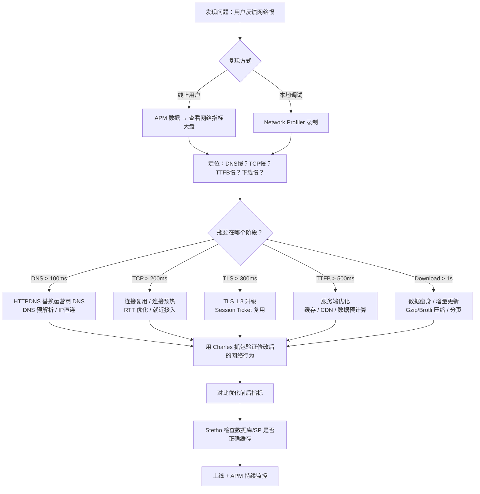

# 网络与IO分析工具 — 面试深度解析

> 本文档按照六层递进结构组织，覆盖 Network Profiler、Stetho、Charles/Fiddler、OkHttp EventListener 的完整知识体系。

---

## 目录

1. [第一层：面试高频考点（5+ 问）](#第一层面试高频考点5-问)
2. [第二层：Charles/Fiddler HTTPS 抓包原理 — 中间人证书机制](#第二层charlesfiddler-https-抓包原理--中间人证书机制)
3. [第三层：OkHttp EventListener — 网络全链路监控](#第三层okhttp-eventlistener--网络全链路监控)
4. [第四层：网络分析全流程（含 Mermaid 流程图）](#第四层网络分析全流程)
5. [第五层：实战 — 用 Network Profiler + Stetho 定位线上网络慢问题](#第五层实战--用-network-profiler--stetho-定位线上网络慢问题)
6. [第六层：网络优化 SOP 与面试应答模板](#第六层网络优化-sop-与面试应答模板)

---

## 第一层：面试高频考点（5+ 问）

### Q1：Android Studio Network Profiler 的使用和核心指标

**面试问题：** "Network Profiler 能分析哪些内容？如何使用它定位网络问题？"

#### Network Profiler 的三层视图

```
Network Profiler 界面结构:

┌─────────────────────────────────────────────────────┐
│  [时间线]  带 Radio State（网络状态）和请求分布       │
│  ▓▓▓▓▓▓▓░░░░░░░░░░░░▓▓▓▓░░░░░░░░░░░░░░░░░░░░░░░░░  │
│  ↑发送    ↑空闲      ↑接收       ↑空闲               │
├─────────────────────────────────────────────────────┤
│  [连接视图]  按域名分组的 HTTP 连接                   │
│  api.example.com ───── 15 requests, 共 2.3MB         │
│  cdn.example.com ───── 8 requests, 共 5.1MB          │
│  tracking.sdk.com ──── 42 requests, 共 120KB         │
├─────────────────────────────────────────────────────┤
│  [详情视图] 选中单个请求的详细信息                     │
│  URL: https://api.example.com/v1/products            │
│  Method: GET  |  Status: 200  |  Size: 12KB         │
│  Timeline Breakdown:                                 │
│    ├── DNS Lookup:    45ms                           │
│    ├── TCP Connect:   120ms (3-way handshake)        │
│    ├── TLS Handshake: 230ms (TLS 1.3)                │
│    ├── Request Sent:  2ms                            │
│    ├── Waiting (TTFB): 850ms ← 重点关注               │
│    └── Download:      35ms                           │
└─────────────────────────────────────────────────────┘
```

#### 核心指标解读

| 指标 | 全称 | 含义 | 面试关注点 |
|:---|:---|:---|:---|
| **DNS Lookup** | Domain Name System 解析 | 域名 → IP 的时间 | >50ms 说明 DNS 服务器慢，可考虑 HTTPDNS |
| **TCP Connect** | TCP 三次握手 | 建立 TCP 连接的时间 | 与服务器物理距离正相关，>100ms 需关注 |
| **TLS Handshake** | TLS/SSL 握手 | 协商加密密钥的时间 | TLS 1.2 需 2-RTT, TLS 1.3 需 1-RTT |
| **Request Sent** | 请求发送 | 上行数据传输时间 | 一般 <10ms（请求体小）|
| **Waiting (TTFB)** | Time To First Byte | 等待服务器响应第一个字节 | **核心瓶颈指标**，>500ms 说明服务端处理慢 |
| **Download** | 内容下载 | 接收响应体的时间 | 受带宽和响应体积影响 |
| **Radio State** | 无线模块状态 | Full / Low / Standby | 频繁切换导致额外耗电和延迟 |

**面试标准回答：**
> Network Profiler 的核心作用是可视化每个 HTTP 请求的生命周期。在 Timeline 视图中，重点关注 TTFB（Waiting）指标——它反映了服务端处理耗时，是网络慢的最常见瓶颈。如果 TTFB 正常但 Download 很长，说明响应体过大，需要做数据瘦身或分页。如果 DNS 耗时异常（>100ms），考虑换用 HTTPDNS。同时可以监控 Radio Power State——频繁的 Full→Standby→Full 切换说明请求过于零散，应做请求合并。

---

### Q2：Stetho 的网络拦截 + 数据库查看

**面试问题：** "Stetho 是什么？它如何实现网络拦截和数据库查看？"

#### Stetho 架构

```
Stetho 的核心分层：

┌─────────────────────────────────────────────┐
│  Chrome DevTools (浏览器端)                   │
│    Network 面板 ← 像调试 Web 一样看 App 网络  │
│    Resources 面板 ← 查看 SharedPreferences    │
│    Console ← 执行 JS 表达式操作 App 对象       │
└──────────────┬──────────────────────────────┘
               │ Chrome DevTools Protocol (WebSocket)
┌──────────────▼──────────────────────────────┐
│  Stetho (App 进程内)                         │
│  ┌────────────┐  ┌──────────────────────┐   │
│  │ Dumpapp    │  │ Inspector            │   │
│  │ 插件系统    │  │ (WebSocket Server)   │   │
│  └────────────┘  └──────────────────────┘   │
│  ┌──────────────────────────────────────┐   │
│  │ Network Interceptor (OkHttp Hook)    │   │
│  │ → 拦截所有 OkHttp 请求/响应          │   │
│  │ → 通过 WebSocket 发送到 Chrome       │   │
│  ├──────────────────────────────────────┤   │
│  │ Database Inspector                   │   │
│  │ → 反射访问 SQLiteDatabase            │   │
│  │ → 执行 SQL 查询并返回结果             │   │
│  ├──────────────────────────────────────┤   │
│  │ SharedPreferences Inspector          │   │
│  │ → 读取 /data/data/.../shared_prefs/  │   │
│  └──────────────────────────────────────┘   │
└──────────────────────────────────────────────┘
```

#### 初始化代码

```java
// Application.onCreate() 中一行接入
public class MyApp extends Application {
    @Override
    public void onCreate() {
        super.onCreate();
        if (BuildConfig.DEBUG) {
            Stetho.initializeWithDefaults(this);
        }
    }
}

// OkHttp 拦截器（Stetho 自动通过 OkHttp Interceptor 拦截）
OkHttpClient client = new OkHttpClient.Builder()
    .addNetworkInterceptor(new StethoInterceptor()) // 网络拦截
    .build();
```

#### 数据库查看原理

```java
// Stetho 通过 ContentProvider 机制暴露数据库：
// 1. 注册 Stetho content provider
// 2. 通过反射读取 SQLiteDatabase 的表结构和数据
// 3. Chrome DevTools 发送 SQL 查询请求 → Stetho 在 App 进程中执行 → 返回结果集

// 面试关键：Stetho 的 database 插件基于
// android.database.sqlite.SQLiteDatabase 的 rawQuery() 方法
// 通过反射获取数据库实例并执行用户从 Chrome 输入的 SQL
```

**面试常见追问 — Stetho vs Network Profiler 的区别：**

| 维度 | Stetho | Network Profiler |
|:---|:---|:---|
| **查看方式** | Chrome DevTools（浏览器） | Android Studio 内置 |
| **数据库查看** | ✅ 支持 SQL 查询 | ❌ 不支持 |
| **SP 查看** | ✅ 可视化 | ❌ 需 Device File Explorer |
| **View 层级** | ✅ Element 面板 | ❌ 需 Layout Inspector |
| **网络请求** | ✅ 请求/响应 Headers + Body | ✅ 更详细的 Timeline |
| **实时性** | 接近实时 | 需开启录制 |
| **断点调试** | ❌ | ❌（两者都不支持） |
| **证书问题** | 不涉及（仅拦截 OkHttp） | 不涉及 |

---

### Q3：Charles/Fiddler 的 HTTPS 抓包原理 — 中间人 + 证书

**面试问题：** "Charles 是如何抓取 HTTPS 请求的？描述中间人攻击（MITM）在抓包中的应用。"

#### HTTPS 正常通信流程

```
正常 HTTPS 通信（无抓包工具）:

客户端                              服务器
  │                                   │
  │ ──── ClientHello ──────────────> │
  │ <──── ServerHello + 证书 ─────── │
  │ (验证证书链 → 证书有效)          │
  │ ──── 加密通信开始 ────────────> │
  │      (端到端加密，中间无法解密)    │
```

#### Charles 抓包 = 合法的中间人代理

```
Charles MITM 抓包流程:

客户端              Charles (代理)              服务器
  │                     │                         │
  │ ── ClientHello ──> │                         │
  │                     │ ── ClientHello ──────> │
  │                     │ <── 真实服务器证书 ──── │
  │                     │ (Charles 持有 CA 证书)  │
  │                     │ → 动态生成伪造证书      │
  │ <-- Charles 伪造证书 │                         │
  │ (客户端需信任 Charles│                         │
  │  的 CA 根证书)      │                         │
  │ ── 加密数据 ───────>│                         │
  │  (用伪造证书的公钥   │ → 解密 → 明文查看       │
  │   加密，Charles可解密)│ → 重新加密 ──────────> │
  │                     │ <── 加密响应 ────────── │
  │ <── 加密响应 ────── │                         │
  │  (同上，Charles解密  │                         │
  │   后再加密发回)      │                         │
```

#### 关键步骤详解

**Step 1 — 安装 Charles CA 根证书到设备：**

```bash
# 1. Charles → Help → SSL Proxying → Install Charles Root Certificate on Mobile

# 2. 手机设置代理（WiFi → 代理 → 手动）
#    代理主机名: <电脑IP>
#    代理端口: 8888 (Charles 默认)

# 3. 手机浏览器访问 http://chls.pro/ssl → 下载证书

# 4. Android 7+ 额外步骤（系统不再信任用户安装的 CA 证书）：
#    - 方案 A：root 后将证书安装为系统证书
#    - 方案 B：在 App 的 network_security_config.xml 中信任用户证书
#    - 方案 C：使用 VirtualXposed / Parallel Space 等沙箱环境
```

**Step 2 — Android 7+ 证书限制的绕过：**

```xml
<!-- res/xml/network_security_config.xml -->
<network-security-config>
    <!-- 仅在 debug 构建中信任用户安装的证书 -->
    <debug-overrides>
        <trust-anchors>
            <certificates src="user" />
            <certificates src="system" />
        </trust-anchors>
    </debug-overrides>
</network-security-config>
```

```xml
<!-- AndroidManifest.xml -->
<application
    android:networkSecurityConfig="@xml/network_security_config"
    ...>
```

**面试关键点：**

> Charles/Fiddler 的本质是充当一个 **HTTPS 代理中间人**。客户端与 Charles 建立 TLS 连接（使用 Charles 动态签发的伪造证书），Charles 与真实服务器建立另一个 TLS 连接。Charles 在中间解密所有流量，查看明文后再转发。这一切的前提是：客户端设备信任了 Charles 的 CA 根证书。Android 7.0+ 默认不信任用户安装的 CA 证书，需要通过 `network_security_config.xml` 的 `debug-overrides` 或 root 后安装为系统证书来绕过。

---

### Q4：Fiddler vs Charles vs Wireshark 使用场景对比

| 工具 | 定位 | 优势 | 劣势 | 适用场景 |
|:---|:---|:---|:---|:---|
| **Charles** | HTTP/HTTPS 代理抓包 | 界面友好、Map Local/Remote、Rewrite、Breakpoint | 付费（$50） | 日常 HTTP API 调试 |
| **Fiddler** | HTTP/HTTPS 代理抓包 | 免费（Windows）、强大脚本（FiddlerScript）、Composer | 界面较老、Mac版功能受限 | Windows 用户首选 |
| **Wireshark** | 网卡级全协议抓包 | 所有协议（TCP/UDP/DNS/HTTP）、过滤器强大 | 无法解密 HTTPS（除非有私钥） | 底层网络问题排查 |
| **mitmproxy** | 命令行 HTTP/HTTPS 代理 | Python API 可编程、开源免费 | 命令行学习成本高 | 自动化测试、CI 集成 |

---

### Q5：Network Profiler 看不到某些请求，可能是哪些原因？

**面试场景：** 面试官问你在 Network Profiler 中发现某些 HTTP 请求没有被捕获。

**排查清单：**

1. **使用了非标准 HTTP 库：** Network Profiler 通过字节码插桩 Hook `HttpURLConnection` 和 `OkHttp`。如果你用的是 Cronet、自定义 Socket 或 Native 层的网络库（如 libcurl），Profiler 无法捕获。
2. **请求发生在 Profiler 未启动时：** Profiler 只记录录制期间的网络活动。
3. **TLS 加密导致数据不可读：** 虽然请求会被记录，但 Request/Response Body 显示为加密。
4. **使用了 WebSocket / gRPC：** Network Profiler 对 WebSocket 和 gRPC 的支持有限，可能不显示或显示不完整。
5. **请求太快：** 在 Profiler 启动前就已经完成的请求不会被记录。

---

## 第二层：Charles/Fiddler HTTPS 抓包原理 — 中间人证书机制

### 完整的证书链验证与绕过

```
正常证书链验证：

  根 CA（预装在系统信任库）
    │ 签名
    ▼
  中间 CA
    │ 签名
    ▼
  网站证书（server.crt）
    │
    ▼
  客户端 → 验证: 网站证书 ← 中间 CA ← 根 CA → 全部可信 ✓

Charles 的伪造证书链：

  根 CA（预装在系统信任库）
    │
    ▼
  Charles CA 根证书（用户手动安装到系统信任库或用户信任库）
    │ 签名
    ▼
  Charles 动态签发的伪造证书（CN = api.example.com）
    │
    ▼
  客户端 → 验证: 伪造证书 ← Charles CA 根 ← 系统信任库 → 可信 ✓
```

### TLS 握手的详细过程（TLS 1.2 vs TLS 1.3）

```
TLS 1.2 握手（2-RTT）:

Client                          Charles (代理)                   Server
  │                                  │                              │
  │ ── ClientHello ────────────────>│                              │
  │  (支持的密码套件、random_c)      │ ── ClientHello ──────────>  │
  │                                  │ <── ServerHello ──────────  │
  │                                  │     + 真实证书               │
  │                                  │     + random_s               │
  │                                  │ (Charles: 签发伪造证书)     │
  │ <── ServerHello ─────────────── │                              │
  │     + Charles 伪造证书           │                              │
  │     + random_s'                  │                              │
  │                                  │                              │
  │ ── 客户端密钥交换 ────────────> │                              │
  │  (用伪造证书的公钥加密 PreMaster)│ ── 密钥交换 ──────────────> │
  │                                  │  (用真实证书的公钥加密)      │
  │                                  │ <── 完成 ─────────────────   │
  │ <── 完成 ────────────────────── │                              │
  │                                  │                              │
  │ <=========== 加密通信（两段） ==============>                  │

TLS 1.3 握手（1-RTT）：

Client                          Charles (代理)                   Server
  │                                  │                              │
  │ ── ClientHello ────────────────>│                              │
  │  + 密钥共享参数                  │ ── ClientHello ──────────>  │
  │                                  │ <── ServerHello ──────────  │
  │                                  │     + 证书（加密的）         │
  │                                  │     + 密钥共享               │
  │                                  │                              │
  │ <── ServerHello ─────────────── │ (Charles同时完成两端握手)   │
  │     + Charles 伪造证书（加密）   │                              │
  │                                  │                              │
  │ <======= 加密通信开始 ========> <======= 加密通信 ======>     │
```

**面试加分点：** TLS 1.3 相比 1.2 减少了 1 个 RTT，握手阶段不再明文传输证书（证书在加密通道内传输），这反而增加了抓包工具的复杂度——Charles 需要更早介入握手流程。

---

## 第三层：OkHttp EventListener — 网络全链路监控

### EventListener 的完整事件体系

OkHttp 从 3.11 开始提供 `EventListener`，可以监听一次 HTTP 请求生命周期的每一个阶段：

```
OkHttp 一次请求的完整事件序列：

  dnsStart()          ─┐
  dnsEnd()            ─┤ DNS 解析阶段
                       ─┘
  connectStart()      ─┐
  secureConnectStart() │
  secureConnectEnd()   ├─ 连接建立阶段（含 TLS）
  connectEnd()        ─┘
                       
  connectionAcquired() ── 从连接池获取或新建连接
                       
  requestHeadersStart() ─┐
  requestHeadersEnd()    ├─ 请求发送阶段
  requestBodyStart()     │
  requestBodyEnd()      ─┘
                       
  responseHeadersStart()─┐
  responseHeadersEnd()   ├─ 响应接收阶段
  responseBodyStart()    │
  responseBodyEnd()     ─┘
                       
  connectionReleased()  ── 连接归还给连接池
  callEnd()             ── 请求完全结束
```

### EventListener 实现网络全链路监控

```kotlin
// ===== 完整的网络监控 EventListener =====
class NetworkMonitorEventListener(
    private val requestId: String
) : EventListener() {
    
    private var dnsStartTime = 0L
    private var connectStartTime = 0L
    private var tlsStartTime = 0L
    private var requestStartTime = 0L
    private var responseStartTime = 0L
    
    // 各阶段耗时统计
    data class NetworkMetrics(
        val url: String,
        val dnsMs: Long,        // DNS 耗时
        val tcpMs: Long,        // TCP 握手耗时
        val tlsMs: Long,        // TLS 握手耗时
        val requestMs: Long,    // 请求发送耗时
        val ttfbMs: Long,       // 等待首字节耗时
        val downloadMs: Long,   // 下载耗时
        val totalMs: Long,      // 总耗时
        val isReused: Boolean   // 是否复用连接
    )
    
    override fun dnsStart(call: Call, domainName: String) {
        dnsStartTime = System.currentTimeMillis()
    }
    
    override fun dnsEnd(call: Call, domainName: String, inetAddressList: List<InetAddress>) {
        val dnsDuration = System.currentTimeMillis() - dnsStartTime
        
        // 线上监控：DNS 耗时超过阈值 → 上报
        if (dnsDuration > 200) {
            reportSlowDns(domainName, dnsDuration)
        }
    }
    
    override fun connectStart(call: Call, inetSocketAddress: InetSocketAddress, proxy: Proxy) {
        connectStartTime = System.currentTimeMillis()
    }
    
    override fun secureConnectStart(call: Call) {
        tlsStartTime = System.currentTimeMillis()
    }
    
    override fun secureConnectEnd(call: Call, handshake: Handshake?) {
        val tlsDuration = System.currentTimeMillis() - tlsStartTime
        metricsCollector.recordTls(tlsDuration)
    }
    
    override fun connectEnd(call: Call, inetSocketAddress: InetSocketAddress, 
                            proxy: Proxy, protocol: Protocol?) {
        // TCP 耗时 = 总 connect 时间 - TLS 耗时
    }
    
    override fun callEnd(call: Call) {
        // 收集所有指标，上报到 APM
        val metrics = buildMetrics(call)
        apmReporter.reportNetworkMetrics(metrics)
    }
    
    // ===== 关键监控点 =====
    
    // 1. 连接建立失败
    override fun connectFailed(call: Call, inetSocketAddress: InetSocketAddress,
                               proxy: Proxy, protocol: Protocol?, ioe: IOException) {
        apmReporter.reportConnectError(ioe)
    }
    
    // 2. 请求失败（含超时）
    override fun callFailed(call: Call, ioe: IOException) {
        apmReporter.reportRequestError(call.request().url.toString(), ioe)
    }
    
    // 3. 连接复用（连接池命中率监控）
    override fun connectionAcquired(call: Call, connection: Connection) {
        // 连接池命中率 = 复用的连接数 / 总连接数
    }
    
    // 4. DNS 解析失败
    override fun dnsStart(call: Call, domainName: String) {
        // 可在此处集成 HTTPDNS 预解析
    }
}

// ===== 注册 EventListener =====
val client = OkHttpClient.Builder()
    .eventListenerFactory(object : EventListener.Factory {
        override fun create(call: Call): EventListener {
            // 每次请求创建一个新的 EventListener 实例
            return NetworkMonitorEventListener(generateRequestId())
        }
    })
    .build()
```

### EventListener.Factory 的重要面试点

**Q：为什么 EventListener 用 Factory 模式而不用单例？**

> **A：** 因为 OkHttp 支持并发请求。如果使用单例 EventListener，多个并发请求会共享同一个 EventListener 实例，导致事件交叉、状态混乱。Factory 模式保证每次 `Call` 创建时生成一个全新的 EventListener 实例，天然线程安全。这也意味着 EventListener 内部可以安全地持有请求级别的状态（如时间戳）。

**Q：EventListener vs Interceptor 的区别？**

| 维度 | EventListener | Interceptor |
|:---|:---|:---|
| **位置** | 观察者（旁路） | 参与者（链路内） |
| **能否修改请求/响应** | ❌ 纯监听 | ✅ 可修改 |
| **DNS 事件** | ✅ `dnsStart/dnsEnd` | ❌ 无法感知 |
| **TLS 握手事件** | ✅ `secureConnectStart/End` | ❌ 无法感知 |
| **连接复用** | ✅ `connectionAcquired` | ❌ 无法感知 |
| **适合场景** | 性能监控、APM 上报 | 加解密、日志、重试 |

---

## 第四层：网络分析全流程



### 一次完整的网络问题排查视图

```
Network Profiler 时间线解读:

  DNS  TTFB
  [▓▓] [  ▓▓▓▓▓▓▓▓▓▓▓▓▓▓▓▓▓▓▓▓▓▓▓▓▓▓▓▓▓▓▓▓▓▓▓  ]  [▓▓▓] 
  45ms   ████████████ Waiting = 850ms ██████████  Download = 35ms
         ↑
         └── 瓶颈！TTFB 占 850/932 = 91% 的总耗时
              → DNS 正常（45ms）
              → Download 正常（35ms）
              → 问题在服务端处理时间过长
              
  下一步：结合 Charles 抓包查看请求体和响应体的具体内容，
         确认是否请求参数导致全表扫描、响应体是否包含多余字段。
```

---

## 第五层：实战 — 用 Network Profiler + Stetho 定位线上网络慢问题

### 场景：用户反馈商品列表页加载超过 5 秒

#### Step 1：Network Profiler 录制

```
操作：打开商品列表页 → 等待数据加载 → 停止录制

Network Profiler 显示：

1. GET /api/products?page=1&size=20
   ├── DNS:       12ms   (复用已有连接，OK)
   ├── TCP:       0ms    (连接池复用)
   ├── TLS:       0ms    (同上)
   ├── Waiting:   3200ms ← 主要瓶颈！
   └── Download:  180ms

2. GET /api/categories
   ├── DNS:       8ms
   ├── TCP:       85ms   (新建连接)
   ├── TLS:       210ms
   ├── Waiting:   45ms
   └── Download:  12ms

3. GET /api/banners
   ├── ... (类似第2个请求)
```

**初步判断：`/api/products` 的 Waiting 时间 3200ms 是主要瓶颈。**

#### Step 2：Charles 抓包验证

```
Charles 中查看该请求的详细内容：

Request:
  GET /api/products?page=1&size=20
  Headers: Authorization: Bearer xxx, Accept: application/json

Response:
  Status: 200 OK
  Headers: Content-Type: application/json, Content-Length: 184320
  Body: {
    "data": [
      {
        "id": 1,
        "name": "商品A",
        "images": ["url1","url2",...,"url15"],  ← 每个商品15张图
        "comments": [...10条最新评论...],        ← 额外数据
        "relatedProducts": [...5个相关商品...],   ← 额外数据
        "seller": {...完整卖家信息...},           ← 额外数据
        ...
      },
      ... (共20个商品)
    ]
  }

关键发现：
1. 响应体 184KB（过大！）
2. 列表页只需要名称+价格+首图，但接口返回了完整卖家信息、评论、关
   联商品等
3. 每个商品返回15张图片URL（列表页只需要1张首图）
4. 服务端查数据库需要关联多张表 → 导致 TTFB 3200ms
```

#### Step 3：Stetho 辅助分析

```
Chrome DevTools → Resources → Web SQL / IndexedDB

使用 Stetho 查看本地数据库：
  1. 本地是否有缓存？
     → SHARED_PREFERENCES 中无列表缓存
     → SQLite 中无离线数据表
  2. 确认了每次都从网络加载全量数据，没有本地缓存策略

Stetho Console 执行：
  > var cache = Context.getSharedPreferences("cache", 0)
  > cache.getString("product_list", null)
  < null   ← 确认无缓存
```

#### Step 4：优化方案

```kotlin
// ===== 优化1：字段瘦身 =====
// 服务端新增精简接口：
// GET /api/products/lite?page=1&size=20
// Response 只包含：id, name, price, thumbnail

// ===== 优化2：客户端添加缓存策略 =====
@GET("/api/products/lite")
suspend fun getProducts(@Query("page") Int page): Response<ProductList>

// 使用 Room 做离线缓存
@Dao
interface ProductDao {
    @Query("SELECT * FROM products ORDER BY id LIMIT :size OFFSET :offset")
    suspend fun getProducts(offset: Int, size: Int): List<ProductEntity>
    
    @Insert(onConflict = OnConflictStrategy.REPLACE)
    suspend fun insertAll(products: List<ProductEntity>)
}

// Repository 层：先返回缓存，再请求网络
suspend fun getProducts(page: Int): Flow<Resource<List<Product>>> = flow {
    // 1. 立即发射缓存数据
    val cached = productDao.getProducts(page * 20, 20)
    if (cached.isNotEmpty()) emit(Resource.Cache(cached))
    
    // 2. 请求网络更新
    try {
        val response = api.getProducts(page)
        if (response.isSuccessful) {
            val products = response.body()!!
            productDao.insertAll(products.toEntities())
            emit(Resource.Success(products.toDomain()))
        }
    } catch (e: Exception) {
        if (cached.isEmpty()) emit(Resource.Error(e))
    }
}

// ===== 优化3：连接预热 =====
// Application.onCreate() 中预热连接池
class MyApp : Application() {
    override fun onCreate() {
        super.onCreate()
        // 启动时预建到 API 服务器的连接
        OkHttpClient.Builder()
            .addInterceptor { chain ->
                // 首次请求预热 DNS 和 TCP
                chain.proceed(chain.request())
            }
    }
}
```

#### Step 5：优化后验证

| 指标 | 优化前 | 优化后 | 改善 |
|:---|:---|:---|:---|
| TTFB (Waiting) | 3200ms | 180ms | **-94%** |
| 响应体大小 | 184KB | 8KB | **-96%** |
| 首次加载（无缓存） | 5200ms | 600ms | **-88%** |
| 二次加载（有缓存） | 5200ms | 50ms | **-99%** |
| 用户感知 | 白屏 5s+ | 马上有内容 | ✅ |

---

## 第六层：网络优化 SOP 与面试应答模板

### 网络性能优化 Checklist

```
Phase 1：问题发现
├── □ 用户反馈 / APM 告警 → 定位时间范围和场景
├── □ Network Profiler → 录制典型操作
├── □ 确认瓶颈阶段：DNS / TCP / TLS / TTFB / Download
└── □ 确定是偶发还是必现

Phase 2：根因分析
├── □ DNS 慢 → 检查 DNS 服务器、域名解析次数
├── □ TCP 慢 → 检查 连接数、RTT、连接复用率
├── □ TLS 慢 → 检查 TLS 版本、证书链长度
├── □ TTFB 慢 → Charles 抓包看请求/响应体 → 服务端排查
├── □ Download 慢 → 检查响应体大小、压缩率、带宽
└── □ 弱网环境 → Charles Throttle 模拟 2G/3G 测试

Phase 3：优化策略
├── □ 协议优化
│   ├── HTTP/2（多路复用、Header压缩、Server Push）
│   ├── TLS 1.3（减少握手 RTT）
│   ├── QUIC（UDP-based，0-RTT）
│   └── Protobuf 替代 JSON（减少序列化体积和时间）
├── □ 连接优化
│   ├── 连接池复用（OkHttp 默认 5 个空闲连接）
│   ├── 连接预热（启动时预建连接）
│   ├── HTTPDNS（避免运营商 DNS 劫持和慢解析）
│   └── IP 直连（跳过 DNS 步骤）
├── □ 数据优化
│   ├── 字段瘦身（接口只返回必要字段）
│   ├── Gzip/Brotli 压缩
│   ├── 增量更新（If-Modified-Since / ETag）
│   ├── 图片 WebP/AVIF 格式
│   └── 分页/懒加载
├── □ 缓存策略
│   ├── OkHttp Cache（HTTP 标准缓存头）
│   ├── 本地数据库缓存（Room）
│   ├── 预加载（空闲时预取下一页数据）
│   └── 离线优先（先显示缓存再更新）
└── □ 请求管理
    ├── 请求合并（批量接口）
    ├── 请求优先级（关键请求优先）
    ├── 请求去重（相同请求合并）
    └── 弱网降级（降低图片质量/减少数据量）

Phase 4：验证 & 监控
├── □ Network Profiler 对比优化前后
├── □ Charles 弱网模拟测试
├── □ OkHttp EventListener 上报 APM 指标
├── □ 建立网络性能监控大盘（DNS/TCP/TLS/TTFB 的 p50/p90/p99）
└── □ 定期 Review 第三方 SDK 的网络请求
```

### 面试终极模板

**当面试官问："你们是怎么做网络优化的？"**

> **标准回答模板：**
>
> "我们的网络优化体系分四层。第一层是问题发现——通过 OkHttp EventListener 全链路监控，上报每次请求的 DNS、TCP、TLS、TTFB、Download 各阶段耗时到 APM，建立 p50/p90/p99 监控大盘。
>
> 第二层是协议层优化——HTTP/2 多路复用减少连接数，TLS 1.3 减少握手 RTT，关键数据用 Protobuf 替代 JSON。
>
> 第三层是数据层优化——有一次我们发现商品列表加载超过 5 秒，通过 Network Profiler 定位到 TTFB 占 3.2 秒，Charles 抓包发现响应体 184KB。优化方案是接口字段瘦身（列表只返回名称+价格+缩略图，详情页再加载完整数据），响应体降到 8KB，TTFB 降到 180ms。同时加了本地 Room 缓存，二次加载 50ms 内完成。
>
> 第四层是弱网策略——用 Charles Throttle 模拟 2G/3G 测试，确保核心流程在弱网下可用，非核心资源做降级处理。"

---

## 附录：工具速查表

### Charles 常用功能

| 功能 | 操作 | 场景 |
|:---|:---|:---|
| **Map Local** | Tools → Map Local → 将远程文件映射到本地文件 | Mock 接口数据、测试异常情况 |
| **Map Remote** | Tools → Map Remote → 将请求重定向到另一个地址 | 测试环境切换 |
| **Rewrite** | Tools → Rewrite → 自动修改请求/响应 | 修改 Header/Body 做测试 |
| **Breakpoint** | 右键请求 → Breakpoints → 拦截并手动修改 | 调试特定请求 |
| **Throttle** | Proxy → Throttle Settings → 限制带宽 | 模拟弱网环境 |
| **Repeat** | 右键请求 → Repeat / Repeat Advanced | 压力测试、复现问题 |

### OkHttp 优化配置速查

```kotlin
val optimizedClient = OkHttpClient.Builder()
    // 连接池：5 个空闲连接，存活 5 分钟
    .connectionPool(ConnectionPool(5, 5, TimeUnit.MINUTES))
    // 连接超时
    .connectTimeout(10, TimeUnit.SECONDS)
    // 读取超时
    .readTimeout(30, TimeUnit.SECONDS)
    // DNS 缓存
    .dns(DnsOverHttps.Builder()
        .client(OkHttpClient())
        .url("https://dns.google/dns-query".toHttpUrl())
        .build())
    // HTTP/2 和 HTTP/1.1 都支持（自动协商）
    .protocols(listOf(Protocol.HTTP_2, Protocol.HTTP_1_1))
    // 全链路监控
    .eventListenerFactory(NetworkMonitorFactory())
    // 日志拦截（debug）
    .addInterceptor(HttpLoggingInterceptor().apply {
        level = HttpLoggingInterceptor.Level.BODY
    })
    // 缓存
    .cache(Cache(File(cacheDir, "http_cache"), 10 * 1024 * 1024)) // 10MB
    .build()
```

---

> **本文档定位**：面试导向的网络与 IO 分析工具深度解析，覆盖 Network Profiler / Stetho / Charles / Fiddler / OkHttp EventListener 从使用方式到底层原理、从理论到实战的完整知识体系。
