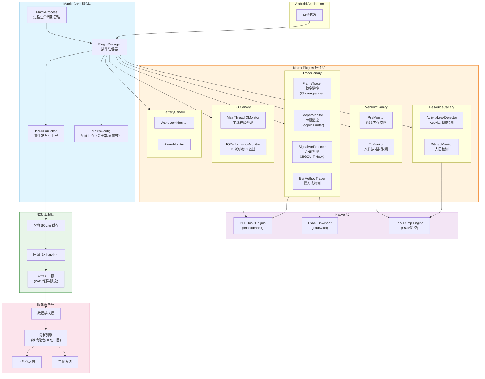

# APM监控工具 — 面试深度解析

> 本文档按照六层递进结构组织，覆盖 Matrix、BlockCanary、Sentry/Bugly、KOOM 等核心 APM 工具的完整知识体系，并延伸至自研 APM 平台架构设计。

---

## 目录

1. [第一层：面试高频考点（5+ 问）](#第一层面试高频考点5-问)
2. [第二层：Matrix TraceCanary — ANR检测与慢方法检测](#第二层matrix-tracecanary--anr检测与慢方法检测)
3. [第三层：ResourceCanary & IO Canary — 泄漏检测与IO监控](#第三层resourcecanary--io-canary--泄漏检测与io监控)
4. [第四层：Matrix 框架架构全览（含 Mermaid 架构图）](#第四层matrix-框架架构全览)
5. [第五层：自研 APM 系统设计 — 采集→处理→存储→展示](#第五层自研-apm-系统设计--采集处理存储展示)
6. [第六层：APM 平台落地 SOP 与面试应答模板](#第六层apm-平台落地-sop-与面试应答模板)

---

## 第一层：面试高频考点（5+ 问）

### Q1：Matrix 的卡顿监控原理是什么？

**面试问题：** "Matrix 如何实现卡顿监控？Choreographer 回调和 Looper Printer 分别做什么？"

#### 卡顿的定义与检测目标

卡顿（Jank）的本质是 **主线程在 16.6ms（60Hz）/ 8.3ms（120Hz）内未能完成一帧的绘制工作**。APM 工具需要在线上持续监控主线程的运行状态，当出现超过阈值的卡顿帧时，捕获关键现场信息（堆栈、CPU、内存等）上报分析。

Matrix 的卡顿监控（TraceCanary 中的 FrameTracer）采用 **双机制互补** 策略：

#### 机制一：Choreographer 回调帧耗时监控

```
Choreographer 帧回调流程：

VSYNC 信号到达
    │
    ▼
Choreographer.doFrame(frameTimeNanos)
    │
    ├── INPUT 回调    ← 处理输入事件（触摸、按键）
    │   （Choreographer.CALLBACK_INPUT）
    │
    ├── ANIMATION 回调 ← 执行动画（ObjectAnimator、ViewPropertyAnimator）
    │   （Choreographer.CALLBACK_ANIMATION）
    │
    ├── TRAVERSAL 回调  ← 执行 measure → layout → draw 三阶段
    │   （Choreographer.CALLBACK_TRAVERSAL）
    │
    └── COMMIT 回调    ← 提交绘制请求到 RenderThread
        （Choreographer.CALLBACK_COMMIT）
```

Matrix 向 Choreographer 注册 `FrameCallback`，在每一帧的 `doFrame` 回调中：

1. **记录帧开始时间**：在 `FrameCallback.doFrame(frameTimeNanos)` 中获取当前帧的时间戳
2. **计算帧间隔**：`frameInterval = currentFrameTime - lastFrameTime`
3. **判定丢帧**：当 `frameInterval > 2 * 刷新周期`（即超过 2 个 VSYNC 周期），判定为发生了掉帧（Dropped Frame）
4. **分级上报**：
   - 掉帧 3 帧以内：正常抖动，不触发
   - 掉帧 3~10 帧：轻度卡顿，采样上报
   - 掉帧 10+ 帧：严重卡顿，全量上报并 dump 堆栈

```
Matrix FrameTracer 核心逻辑（伪代码）：

Choreographer.getInstance().postFrameCallback(new FrameCallback() {
    @Override
    public void doFrame(long frameTimeNanos) {
        long currentMs = frameTimeNanos / 1_000_000;
        long diff = currentMs - lastFrameTimeMs;

        if (diff > DROPPED_THRESHOLD) {  // e.g. 100ms = 约6帧
            int droppedFrames = (int) (diff / REFRESH_PERIOD_MS);
            if (droppedFrames >= SEVERE_THRESHOLD) {
                // 严重卡顿：立即 dump 所有线程堆栈
                dumpStacks();
            }
            reportJank(droppedFrames, diff);
        }

        lastFrameTimeMs = currentMs;
        // 持续注册下一帧回调
        Choreographer.getInstance().postFrameCallback(this);
    }
});
```

#### 机制二：Looper Printer 消息耗时监控

**为什么还需要 Looper Printer？**

Choreographer 只能感知帧的耗时，但无法精确知道是 **哪个 Message 造成了卡顿**。Looper Printer 通过在每条 Message 执行前后插入日志，精确测量每个消息的处理耗时，从而定位具体耗时方法。

```
Android 主线程消息循环：

for (;;) {
    Message msg = queue.next();  // 取下一个消息（可能阻塞等待）
    msg.target.dispatchMessage(msg);  // 分发执行
    msg.recycleUnchecked();
}
```

Looper 提供了 `setMessageLogging(Printer)` 方法，MessageQueue 在 `dispatchMessage` 前后会调用 `Printer.println()`：

```java
// MessageQueue.dispatchMessage 前
if (logging != null) {
    logging.println(">>>>> Dispatching to " + msg.target + " " +
                    msg.callback + ": " + msg.what);
}

msg.target.dispatchMessage(msg);

// MessageQueue.dispatchMessage 后
if (logging != null) {
    logging.println("<<<<< Finished to " + msg.target + " " + msg.callback);
}
```

Matrix 通过 Hook 这个 Printer 实现消息级别的耗时监控：

```java
Looper.getMainLooper().setMessageLogging(new Printer() {
    long startTime = 0;
    boolean isDispatchStart = false;

    @Override
    public void println(String x) {
        if (x.startsWith(">>>>> Dispatching")) {
            // 记录消息开始处理的时间
            startTime = System.currentTimeMillis();
            isDispatchStart = true;

            // 启动一个延迟检测线程
            // 如果 startTime 之后 DISPATCH_THRESHOLD (e.g. 2000ms)
            // 仍没有收到 "<<<<< Finished"，则判定为 ANR
            startLagDetector(startTime);

        } else if (x.startsWith("<<<<< Finished")) {
            isDispatchStart = false;
            long cost = System.currentTimeMillis() - startTime;

            if (cost > SLOW_METHOD_THRESHOLD) {  // e.g. 700ms
                // 慢方法：dump 堆栈并上报
                String stack = dumpCurrentThreadStack();
                reportSlowMethod(cost, stack);
            }

            // 取消延迟检测线程
            stopLagDetector();
        }
    }
});
```

#### 两种机制的分工总结

| 维度 | Choreographer 帧回调 | Looper Printer |
|:---|:---|:---|
| **监控粒度** | 帧级别（16.6ms 为单位） | Message 级别（精确到哪个 Handler + Message.what） |
| **感知内容** | 知道"掉了几帧" | 知道"哪个消息耗时多少" |
| **ANR 检测** | 间接感知（连续丢帧→可能 ANR） | 直接感知（主线程阻塞超过阈值） |
| **堆栈捕获** | 帧结束时 dump | 超时时立即 dump（堆栈更准） |
| **性能开销** | 极低（仅时间戳计算） | 低（println 为字符串匹配） |
| **互补关系** | 宏观帧率监控 | 微观方法耗时定位 |

**面试标准回答：**
> Matrix 的卡顿监控采用"帧监控 + 消息监控"双管齐下的策略。Choreographer 帧回调监控从帧维度持续追踪掉帧数量——当帧间隔超过 2 个 VSYNC 周期就判定丢帧，超过阈值则触发堆栈采集。Looper Printer 替换则从消息维度精确度量每个 Message 的 dispatch 耗时——通过在 `>>>>> Dispatching` 和 `<<<<< Finished` 标记之间计时，既能发现耗时超过 700ms 的慢方法，又能通过超时检测机制识别 ANR。两者结合，一个告诉你"卡了"，一个告诉你"哪儿卡的"。

---

### Q2：BlockCanary 的 Looper Printer 实现与 Matrix 有何异同？

**面试问题：** "BlockCanary 是如何检测卡顿的？和 Matrix 的 Looper 监控有什么区别？"

#### BlockCanary 核心原理

BlockCanary 同样是基于 `Looper.setMessageLogging()` 机制，但设计更轻量，专注于 **主线程卡顿检测** 这一个点。

```
BlockCanary 工作流程：

                 ┌──────────────────────┐
                 │  App 启动初始化        │
                 │  BlockCanary.install() │
                 └──────────┬───────────┘
                            │
                            ▼
                 ┌──────────────────────┐
                 │  设置 Looper Printer  │
                 │  监听主线程消息队列    │
                 └──────────┬───────────┘
                            │
              ┌─────────────┴─────────────┐
              │                           │
              ▼                           ▼
    ">>>>> Dispatching"         "<<<<< Finished"
              │                           │
              ▼                           ▼
       记录 startTime             计算 cost = now - startTime
       启动 WatchDog 线程               │
              │                  ┌──────┴──────┐
              │                  │             │
              │              cost > 阈值    cost ≤ 阈值
              │                  │             │
              │                  ▼             ▼
              │          判定为卡顿       正常，忽略
              │          dump 堆栈
              │          通知 UI 展示
              │
              ▼
    WatchDog 线程定时检查：
    if (startTime 存在 && 主线程无响应 > 阈值)
        → dump 主线程堆栈
        → 判定为卡顿
```

#### BlockCanary vs Matrix Looper Monitor 对比

| 维度 | BlockCanary | Matrix (LooperMonitor) |
|:---|:---|:---|
| **检测机制** | `Looper.setMessageLogging()` + 独立 WatchDog 线程 | 同机制，但作为 TraceCanary 的一个子模块 |
| **卡顿判定** | 单消息耗时 > 阈值（默认 500ms） | 多级阈值：ANR(5s) / Lag(2s) / Slow(700ms) |
| **堆栈获取** | `Thread.getStackTrace()` 获取主线程堆栈 | 同时 dump 所有线程 + CPU 使用率 + 内存信息 |
| **信息丰富度** | 卡顿时间 + 主线程堆栈 + CPU 信息 | 卡顿时间 + 全线程堆栈 + 进程状态 + 场景信息 |
| **UI 展示** | 自带通知栏 + 悬浮窗展示 | 无 UI，数据上报到 Matrix 后台 |
| **定位精度** | 精准到 Message | 精准到 Message，还能关联帧掉帧信息 |
| **线上化** | 主要面向 Debug 阶段 | 线上全量/采样开启 |
| **扩展性** | 单一功能 | Matrix 插件体系的一部分 |

**面试标准回答：**
> BlockCanary 是主线程卡顿检测的经典实现，核心思路是通过 Hook Looper Printer 获取每个 Message 的处理耗时。当 `dispatchMessage` 耗时超过阈值（默认 500ms），BlockCanary 通过独立 WatchDog 线程 dump 主线程堆栈并在通知栏展示。相比 Matrix 的 LooperMonitor，BlockCanary 更轻量、更聚焦，适合 Debug 阶段的快速定位；而 Matrix 作为完整的 APM 框架，提供了分级卡顿检测（Slow/Lag/ANR）、全线程堆栈采集、进程状态快照等更丰富的诊断信息，更适合线上全量监控。

---

### Q3：Sentry / Bugly 的崩溃收集机制

**面试问题：** "Sentry 或 Bugly 是如何实现 Native Crash 和 Java Crash 捕获的？"

#### Java Crash 捕获 — UncaughtExceptionHandler

```java
// 系统默认的异常处理链
Thread.setDefaultUncaughtExceptionHandler(myHandler);

// 实现
class CrashHandler implements Thread.UncaughtExceptionHandler {
    private Thread.UncaughtExceptionHandler originHandler;

    @Override
    public void uncaughtException(Thread t, Throwable e) {
        // 1. 采集崩溃现场信息
        CrashInfo info = collectCrashInfo(t, e);

        // 2. 写入本地文件（防止进程被杀丢失）
        writeToFile(info);

        // 3. 下次启动时上传（或立即上传到 Sentry/Bugly 服务端）
        scheduleUpload();

        // 4. 交给系统默认处理器（弹出 ANR 对话框、杀死进程）
        if (originHandler != null) {
            originHandler.uncaughtException(t, e);
        } else {
            Process.killProcess(Process.myPid());
        }
    }
}
```

**崩溃现场信息采集清单：**

```
Java Crash 采集字段：

├── 基础崩溃信息
│   ├── Exception 类型 & 消息 & 堆栈
│   ├── 崩溃线程名 & 线程状态
│   └── 崩溃时间戳
│
├── 应用状态
│   ├── App 版本号 & build 号
│   ├── 前后台状态
│   ├── 当前 Activity/Fragment
│   └── 用户操作路径（面包屑）
│
├── 设备环境
│   ├── 设备型号、品牌、CPU ABI
│   ├── 系统版本、API Level
│   ├── 内存总量 / 可用内存
│   ├── 存储总量 / 可用存储
│   └── 屏幕分辨率 & 密度
│
└── 自定义上下文
    ├── User ID
    ├── 自定义标签 / Breadcrumbs
    └── 最近网络请求日志
```

#### Native Crash 捕获 — Signal Handler

Native Crash（如 SIGSEGV、SIGABRT）不能被 Java 层 `UncaughtExceptionHandler` 捕获，需要通过 Linux Signal 机制：

```
Native Crash 捕获流程：

1. 注册 Signal Handler
   sigaction(SIGSEGV, &handler, &old_handler)
   sigaction(SIGABRT, &handler, &old_handler)
   sigaction(SIGBUS,  &handler, &old_handler)
   ...

2. Crash 发生时
   Kernel 发送 Signal → handler() 被调用
       │
       ├── 在 Signal Handler 中（async-signal-safe 环境）
       │   ├── unwind 调用栈（libunwind / libcorkscrew）
       │   ├── 读取 /proc/self/maps 获取内存映射
       │   ├── 读取寄存器状态
       │   └── 写入 tombstone 文件
       │
       ├── 通知 Java 层（通过 socket / 管道 / 文件标志位）
       │   └── Java 层负责上报
       │
       └── 调用旧的 signal handler 或终止进程
```

**关键难点与解决方案：**

| 难点 | 解决方案 |
|:---|:---|
| **Signal Handler 中不能安全分配内存** | 预分配缓冲区，使用 mmap 预留空间 |
| **unwind 调用栈需要依赖 .eh_frame / .debug_info** | 使用 libunwind 的动态 unwind，不依赖调试信息 |
| **堆栈可能被编译器优化破坏** | 保留 `.eh_frame` 段（GCC/Clang 编译参数 `-funwind-tables`） |
| **多线程同时发送信号** | Signal Handler 中加锁，或使用 `sigaction` 的 SA_ONSTACK 标志 |
| **Android 不同版本差异** | Sentry/Bugly SDK 内置多版本适配层 |

**Sentry vs Bugly 差异：**

| 维度 | Sentry | Bugly |
|:---|:---|:---|
| **开源** | 完全开源（客户端+服务端） | 客户端 SDK 部分开源，服务端闭源 |
| **符号化** | 需自建 symbol server 或上传符号表 | 内置符号表管理服务 |
| **事件类型** | Error/Exception 通用（支持 Breadcrumbs、User Feedback） | 专注 Crash + ANR + Error |
| **性能监控** | 支持 Transaction 追踪（APM 能力） | 基础性能大盘 |
| **私有化部署** | 支持（Docker/K8s） | 不支持（仅 SaaS） |

**面试标准回答：**
> Sentry/Bugly 的崩溃收集分 Java 和 Native 两层。Java 层通过 `UncaughtExceptionHandler` 全局捕获未处理异常，在 App 崩溃时将异常类型、堆栈、设备信息、用户上下文等写入本地文件，下次启动时上报。Native 层通过注册 SIGSEGV/SIGABRT 等 Signal Handler，在 async-signal-safe 环境中使用 libunwind 回溯调用栈，写入 tombstone，再通过管道或标志位通知 Java 层上报。Sentry 的优势在于开源、可私有化部署、支持 Transaction 性能追踪；Bugly 的优势在于符号表管理自动化、国内网络优化、免费无配额限制。

---

### Q4：KOOM 的线上 OOM 监控原理（Fork + Suspend + Dump）

**面试问题：** "KOOM 如何在线上环境做 OOM 监控？Fork 进程 dump 解决了什么问题？"

#### 传统 dump hprof 的痛点

```
传统 dump hprof 的问题：

DumpHeap → dumpHprofData(filePath)
    │
    ├── 挂起所有线程（暂停虚拟机）
    ├── 遍历整个堆
    ├── 标记并序列化所有对象
    └── 写入文件

问题：
1. 内存峰值翻倍：dump 过程中产生大量临时内存
2. 应用冻结：卡顿 5~30 秒，直接造成 ANR
3. 磁盘写入 100MB~1GB，占用 IO
4. 线上用户感知极强，基本不可用
```

#### KOOM 的 Fork Dump 方案

KOOM（Kwai OOM）的核心创新是 **利用 Linux fork 的 COW（Copy-On-Write）机制** 实现零冻结 dump：

```
KOOM Fork Dump 流程：

主进程                        Fork 出的子进程
   │                              │
   │  fork()                      │
   ├──────────────────────────────►  子进程诞生
   │                              │  （共享主进程的内存页，COW）
   │                              │
   │  主进程继续运行 ← 不阻塞！    │  挂起自身（suspend）
   │  用户无感知                  │
   │                              │  dumpHprofData()
   │                              │  （遍历堆、写文件）
   │                              │
   │                              │  文件写入完毕
   │                              │  通知主进程（管道/文件标志）
   │                              │
   │  收到通知                    │  _exit(0)
   │  读取 hprof 文件              │
   │  压缩后上报                  │
   │  删除本地文件                 │
   │                              X
```

**Fork COW 原理：**

```
COW (Copy-On-Write) 机制：

Fork 之前：
  物理内存页 A → 属于主进程

Fork 之后：
  物理内存页 A → 主进程 + 子进程 共享（只读标记）

主进程写入页 A：
  触发 page fault → 内核复制 A 为 A'
  物理内存页 A' → 主进程（可读写）
  物理内存页 A  → 子进程（继续只读）

→ 只有主进程修改的内存页才会被复制
→ 子进程 dump 期间主进程正常运行
→ 额外内存开销 = fork 后主进程修改的脏页数量
```

#### KOOM 关键设计细节

```
KOOM 监控流程：

┌─────────────────────────────────────────────────────┐
│  1. 触发条件判断                                      │
│     ├── 内存占用 > 阈值（如 85%）                      │
│     ├── 触发 GC 后内存仍然 > 阈值                      │
│     └── 当前无正在进行的 dump（去重）                   │
├─────────────────────────────────────────────────────┤
│  2. Fork 子进程                                       │
│     ├── Runtime.getRuntime().exec() 间接 fork         │
│     ├── 或 JNI 直接调用 fork() + suspendVM()          │
│     └── 设置子进程 dump 超时（30s，超时则 kill）        │
├─────────────────────────────────────────────────────┤
│  3. 子进程 Dump                                       │
│     ├── Debug.dumpHprofData(path)  // Android 原生    │
│     ├── 或使用 PLT Hook 优化版 dump（跳过无用对象）     │
│     └── 写入完成后通过管道通知主进程                    │
├─────────────────────────────────────────────────────┤
│  4. 主进程后处理                                       │
│     ├── 裁剪 hprof：Strip 字符串/原始数据              │
│     ├── 压缩：使用 zlib/gzip 大幅减小体积              │
│     ├── 分片上传：大文件分片到 CDN/Object Storage      │
│     └── 服务端分析：MAT/Shark 解析 + 自动归因          │
└─────────────────────────────────────────────────────┘
```

**面试标准回答：**
> KOOM 的核心创新是利用 Linux fork 的 Copy-On-Write 机制实现线上 OOM 内存 dump。当内存超过阈值时，主进程 fork 出子进程，子进程在自身空间内 dump hprof 并写入文件，主进程毫无阻塞继续服务用户。COW 意味着子进程与主进程初始共享所有物理内存页，只有在主进程修改内存时才会按页复制，因此额外内存开销可控。相比传统 dump 方案会导致应用挂起数十秒，KOOM 做到了对用户体验零感知的线上 OOM 监控。

---

### Q5：APM 平台的指标采集策略

**面试问题：** "一个完整的 APM 平台需要采集哪些指标？如何平衡采集粒度和性能开销？"

#### 核心指标体系

```
APM 指标全景：

┌──────────────────────────────────────────────────────────────────┐
│                          APM 指标体系                             │
├──────────────┬──────────────┬──────────────┬──────────────────────┤
│   性能指标     │   稳定性指标   │   业务指标     │    资源指标          │
├──────────────┼──────────────┼──────────────┼──────────────────────┤
│ 启动耗时      │ Crash 率     │ 页面PV/UV    │ CPU 使用率           │
│ 页面加载耗时  │ ANR 率       │ 接口成功率    │ 内存占用/PSS         │
│ 帧率 / 掉帧   │ OOM 率       │ 接口耗时 P50  │ GC 频率/耗时         │
│ 网络耗时      │ Native Crash │ 关键路径转化率 │ 磁盘 IO              │
│ UI 渲染耗时   │ 异常退出率    │ 用户操作 Trace │ 流量消耗             │
│ 慢方法监控    │ 启动成功率    │ AB Test 指标  │ 电量消耗             │
│ 卡顿率        │ 升级成功率    │ 用户留存      │ 线程数               │
└──────────────┴──────────────┴──────────────┴──────────────────────┘
```

#### 分级采集策略

| 级别 | 采集频率 | 数据量 | 适用场景 | 示例 |
|:---|:---|:---|:---|:---|
| **L0 - 聚合统计** | 实时聚合 | 极小（计数器） | 大盘指标 | 整体 Crash 率、P99 卡顿率 |
| **L1 - 事件采样** | 事件触发 | 小（事件体） | 异常事件 | Crash 堆栈、ANR 快照 |
| **L2 - 定时采样** | 5~30s/次 | 中（时序点） | 性能趋势 | CPU 使用率曲线、内存水位 |
| **L3 - 全量追踪** | 持续 | 极大 | 本地调试/灰度 | 全方法耗时 Tracing |

#### 采样与限流策略

```
采样策略设计：

1. 用户维度采样
   ├── 全量用户：L0/L1 级别（Crash、ANR 必须全量）
   ├── 灰度用户：L2 级别开启（X% 采样率）
   └── 内部用户：L3 全开

2. 设备维度限制
   ├── 低端机（RAM < 3GB）：仅 L0/L1
   ├── 中端机（3~6GB）：L2 开启
   └── 高端机（>6GB）：全部开启

3. 事件维度节流
   ├── 同类事件去重（同一堆栈 1h 内只上报 1 次）
   ├── 上传频率限制（每进程每分钟最多 N 次上报）
   └── 文件大小限制（单次上报 Body < 100KB）

4. 网络带宽控制
   ├── Wi-Fi：全量上报
   ├── 4G/5G：采样上报、压缩后上报
   └── 省流量模式：延迟到 Wi-Fi 批量上报
```

**面试标准回答：**
> APM 平台的指标采集采用分层分级策略。L0 聚合统计（如 Crash 率、启动 P99）通过客户端上报事件 + 服务端实时聚合，开销为零；L1 事件采样（如 Crash 堆栈、ANR）在异常触发时全量捕获；L2 定时采样（如 CPU、内存趋势）按 5~30 秒间隔做快照；L3 全量追踪仅在灰度或 Debug 环境开启。在客户端通过用户采样率、设备分级、事件去重和网络类型控制四条线来平衡采集精度和性能开销，确保 APM 自身的性能影响 <1%。

---

## 第二层：Matrix TraceCanary — ANR检测与慢方法检测

### ANR 的成因分类与 Matrix 的检测策略

#### Android ANR 的五种触发场景

```
ANR 触发场景：

1. InputDispatching Timeout
   ├── 按键或触摸事件在 5s 内未响应
   └── 最常见的 ANR 类型

2. Broadcast Timeout
   ├── 前台广播 10s 内未完成
   ├── 后台广播 60s 内未完成
   └── onReceive() 在主线程执行耗时操作

3. Service Timeout
   ├── 前台 Service 20s 内未完成
   ├── 后台 Service 200s 内未完成
   └── onStartCommand() 未及时返回

4. ContentProvider Timeout
   └── ContentProvider 发布 10s 内未完成

5. InputEvent 队列积压
   └── MessageQueue 中积压大量未处理消息
```

#### Matrix SignalAnrDetector — 基于 Signal 的 ANR 检测

Matrix 通过监听系统发送给应用进程的 `SIGQUIT` 信号来检测 ANR：

```
ANR 流程中 SIGQUIT 的角色：

系统 ServiceManager / AMS 检测到 ANR
    │
    ▼
向应用主进程发送 SIGQUIT（信号 3）
    │
    ▼
应用进程收到 SIGQUIT
    ├── RuntimeInit 注册的 Signal Catcher 线程收到
    ├── 默认行为：dump 所有线程堆栈到 /data/anr/traces.txt
    └── Matrix Hook：在 SIGQUIT 处理前拦截
        ├── 记录 ANR 时间点
        ├── 采集额外的诊断信息（CPU、内存、Binder 状态）
        └── 上报到 Matrix 平台
```

```
Matrix SignalAnrDetector 核心逻辑：

// 注册 SIGQUIT Handler（在默认 handler 之前执行）
signal(SIGQUIT, matrixSignalHandler);

void matrixSignalHandler(int sig, siginfo_t* info, void* context) {
    // 1. 记录 ANR 发生
    long anrTime = SystemClock.uptimeMillis();

    // 2. 抓取关键信息
    AnrInfo info = new AnrInfo();
    info.anrTime = anrTime;
    info.mainThreadStack = getMainThreadStack();      // 主线程堆栈
    info.cpuUsage = readProcStat();                    // CPU 使用率
    info.memoryInfo = readProcMeminfo();               // 内存信息
    info.binderCalls = getBinderCallInfo();            // Binder 调用信息
    info.recentMessages = recentMsgQueue;              // 最近的消息队列快照

    // 3. 异步上报
    MatrixReporter.post(info);

    // 4. 调用系统原有 handler（写入 traces.txt）
    callOldHandler(sig, info, context);
}
```

#### LooperAnrTracer — 基于 Looper 的 ANR 预判

在 ANR 真正发生之前，Matrix 可以通过 Looper Printer 机制 **提前预测** ANR：

```
LooperAnrTracer 预判逻辑：

┌──────────────────────────────────────────────────────────┐
│  Message 开始处理                                          │
│      │                                                    │
│      ▼                                                    │
│  启动延迟任务：postDelayed(ANR_CHECK_RUNNABLE, 2s)         │
│      │                                                    │
│      ├── 2s 内 Message 处理完毕                            │
│      │   → 取消延迟任务，正常                              │
│      │                                                    │
│      └── 2s 后 Message 仍在处理                            │
│          │                                                │
│          ▼                                                │
│      判定为"高概率即将 ANR"                                 │
│      ├── dump 主线程 + 关键线程堆栈                        │
│      ├── 记录当前 Message.what / target                   │
│      ├── 上报为 Lag 事件（不是 ANR，是预警）               │
│      └── 继续监控，如果到达 InputDispatching 5s 阈值       │
│          → 实际 ANR 确认                                  │
└──────────────────────────────────────────────────────────┘
```

### 慢方法检测 — EvilMethodTracer

除了 ANR，耗时 >700ms 的慢方法是性能劣化的前兆。Matrix 的 EvilMethodTracer 专门追踪慢方法：

```
EvilMethodTracer 实现：

1. 在 Looper Printer 中记录每个 Message 的耗时
2. 当耗时 > 阈值（默认 700ms）：
   ├── 立即 dump 主线程堆栈（Thread.getStackTrace()）
   ├── 记录消息来源（Handler 类名 + Message.what）
   ├── 采集 CPU 使用率 + 各线程状态
   └── 聚合为"慢方法事件"上报

3. 堆栈聚合与去重：
   同一堆栈的慢方法在时间窗口内聚合
   → 避免重复上报
   → 统计频次和分布
```

---

## 第三层：ResourceCanary & IO Canary — 泄漏检测与IO监控

### ResourceCanary — Activity 泄漏检测

#### 基于 WeakReference + IdleHandler 的泄漏检测

```
ResourceCanary 检测流程：

Activity.onDestroy()
    │
    ▼
创建 WeakReference<Activity> 指向刚销毁的 Activity
    │
    ├── 主动触发 GC（Runtime.getRuntime().gc()）
    │
    ▼
向 MessageQueue 注册 IdleHandler
    │
    ▼
IdleHandler.queueIdle() 被回调（主线程空闲）
    │
    ├── 检查 WeakReference.get()
    │   ├── null → Activity 已被回收，无泄漏 ✓
    │   └── 非 null → Activity 仍存活，疑似泄漏 ⚠
    │
    ▼
疑似泄漏：dump 堆并分析 GC Root 引用链
    │
    ├── 通过 Debug.dumpHprofData() 获取 hprof
    ├── 使用 shark/HAHA 库解析 hprof
    ├── 找到 Activity 实例 → GC Root 最短路径
    └── 生成泄漏报告并上报
```

#### 泄漏判定分级

```
泄漏等级：

Level 0 - 无泄漏
  WeakReference 在 IdleHandler 回调前被 GC 回收

Level 1 - 可疑泄漏
  WeakReference 在首次检测时未被回收
  → 等待下一次 IdleHandler 再检测
  → 如果被回收则为虚惊，否则升级到 Level 2

Level 2 - 确认泄漏
  连续 N 次（默认 2 次）检测未被回收
  → dump hprof 并分析 GC Root
  → 上报泄漏报告
```

#### 与 LeakCanary 的对比

| 维度 | LeakCanary | Matrix ResourceCanary |
|:---|:---|:---|
| **检测对象** | Activity、Fragment、ViewModel、View 等 | Activity 为主，可扩展 |
| **dump 方式** | 主进程内 dump（可能卡顿） | 复用 Matrix 框架，支持 fork dump |
| **分析引擎** | Shark（Kotlin 编写，速度快） | Shark / HAHA |
| **线上化** | LeakCanary 2.x 支持线上 | 原生面向线上设计 |
| **内存开销** | 较高（hprof 分析在进程中） | 较低（可裁剪、可延迟分析） |
| **集成方式** | 独立 SDK | Matrix 插件体系 |

### IO Canary — IO 操作监控

#### 监控目标

IO Canary 的核心目标是 **检测主线程 IO 操作** 和 **过大/过频的 IO 操作**：

```
IO Canary 监控维度：

┌─────────────────────────────────────────────┐
│ 主线程 IO 检测（最严重的性能问题）               │
│ ├── FileInputStream/FileOutputStream         │
│ ├── RandomAccessFile                         │
│ ├── SharedPreferences（apply 也会触发 IO）    │
│ └── SQLiteDatabase 操作                      │
├─────────────────────────────────────────────┤
│ IO 性能检测                                   │
│ ├── 单次 IO 耗时 > 阈值（如 300ms）            │
│ ├── 单次 IO 缓冲区 < 合理大小（如 4KB）        │
│ └── 短时间内 IO 次数过多（IO 风暴）             │
└─────────────────────────────────────────────┘
```

#### PLT Hook 实现原理

IO Canary 通过 PLT（Procedure Linkage Table）Hook 拦截 C 库的 IO 函数调用：

```
PLT Hook 原理：

调用方代码:
  open("path", O_RDONLY)
      │
      ▼
  PLT 表（.plt 段）:
      jmp *GOT[open]   ← 通过 GOT 表间接跳转
      │
      ▼
  GOT 表（.got.plt 段）:
      原始地址 → libc.so 的 open()  ← Hook 点：替换此地址
      │
      ▼
  libc.so 的 open() 实现

Hook 后：

  GOT[open] → matrix_open_proxy()  ← Matrix 注入的代理函数
      │
      ├── 记录开始时间 + 调用线程 + 参数
      ├── 调用原始 open()   ← 保留原始函数地址
      ├── 记录结束时间 + 耗时
      ├── 判断是否主线程 / 是否超阈值
      └── 触发上报逻辑
```

```
被 Hook 的 IO 函数集合：

文件操作：
  open(), openat(), fopen(), fread(), fwrite(),
  fclose(), read(), write(), mmap(), msync()

文件属性：
  stat(), lstat(), fstat(), access(), faccessat()

数据库：
  SQLite 的 IO 相关内部函数（xOpen, xRead, xWrite 等）

SharedPreferences：
  XML 文件的 write/read 操作
```

**面试标准回答：**
> ResourceCanary 利用 WeakReference + IdleHandler 机制检测 Activity 泄漏——在 Activity.onDestroy() 后创建弱引用，主线程空闲时检查引用是否被 GC 回收，连续两次未被回收则判定泄漏并 dump hprof 分析 GC Root 引用链。IO Canary 通过 PLT Hook 拦截 libc 的文件 IO 函数（open、read、write 等），监控主线程 IO 操作和大缓冲区/高频率 IO 问题。两者都深度集成在 Matrix 插件框架中，支持线上全量开启。

---

## 第四层：Matrix 框架架构全览

### Matrix 整体架构图



### 插件化架构设计

```
Matrix 插件生命周期：

  Plugin.init(application, config)
       │
       ▼
  onStart()  ← 插件被激活
       │
       ▼
  detect()   ← 开始检测
       │
       ▼
  Issue 检测到
       │
       ▼
  onDetectIssue(Issue)  ← 事件回调
       │
       ├── 采样判断（是否上报）
       ├── 去重判断（是否重复事件）
       └── 上报 Issue
       │
       ▼
  onStop()   ← 插件被停止
       │
       ▼
  onDestroy() ← 插件被销毁
```

### 关键设计原则

| 原则 | 说明 |
|:---|:---|
| **低侵入** | 一行代码初始化，插件按需加载 |
| **低开销** | 核心监控 CPU 开销 <2%，内存开销 <5MB |
| **可配置** | 采样率、阈值、开关均可动态下发 |
| **进程隔离** | fork 子进程 dump，不影响主进程 |
| **插件化** | 每个监控模块独立打包，按需引入 |

---

## 第五层：自研 APM 系统设计 — 采集→处理→存储→展示

### 整体架构

```
自研 APM 系统分层架构：

┌─────────────────────────────────────────────────────────────────┐
│                         展示层 (Dashboard)                        │
│  Grafana / 自研前端  │  实时大盘  │  趋势分析  │  告警管理      │
├─────────────────────────────────────────────────────────────────┤
│                         服务层 (Backend)                          │
│  API Gateway  │  数据清洗  │  聚合引擎  │  告警引擎  │  符号化    │
├─────────────────────────────────────────────────────────────────┤
│                         存储层 (Storage)                          │
│  InfluxDB/TSDB  │  ClickHouse  │  ES  │  HDFS/Object Storage    │
│  (时序指标)       │  (OLAP分析)  │ (全文检索)  │  (堆栈/hprof)   │
├─────────────────────────────────────────────────────────────────┤
│                         消息队列 (MQ)                             │
│  Kafka / Pulsar → 削峰填谷 → 流量控制 → 数据分流                  │
├─────────────────────────────────────────────────────────────────┤
│                         采集层 (SDK)                              │
│  Android SDK  │  iOS SDK  │  Web SDK  │  Backend SDK             │
└─────────────────────────────────────────────────────────────────┘
```

### 采集层设计（Android SDK）

```
SDK 架构：

┌──────────────────────────────────────┐
│  APM SDK Core                        │
│  ├── 配置中心（远程配置 + 本地缓存）    │
│  ├── 采样管理器（多维采样策略）        │
│  ├── 数据管道（Pipe）                 │
│  │   ├── Event → 序列化 → 批量写入    │
│  │   └── 本地 SQLite（WAL 模式）      │
│  ├── 上传调度器                       │
│  │   ├── 网络感知（WiFi/蜂窝/离线）    │
│  │   ├── 限流（令牌桶算法）            │
│  │   └── 退避重试（指数退避）          │
│  └── 生命周期管理                     │
│      ├── 进程启动 → 初始化            │
│      ├── App 前台/后台切换 → 调整采集频率│
│      └── 进程终止 → 刷盘 + 最后上报    │
└──────────────────────────────────────┘
```

#### 数据管道设计

```
数据管道（Pipeline）：

  Event 产生
      │
      ▼
  EventProcessor（预处理）
      ├── 字段校验 & 补全
      ├── 采样判定（if sample rate < random() → drop）
      ├── 敏感信息脱敏（如用户手机号打码）
      └── 添加通用 Tag（app_version, os_version, device_model, ...）
      │
      ▼
  EventBuffer（内存环形缓冲区）
      ├── 缓冲区大小：256KB ~ 2MB
      ├── 缓冲区满 → 触发 flush 到磁盘
      └── 定时 flush（每 10s 或 App 退后台）
      │
      ▼
  LocalDB（SQLite WAL 模式）
      ├── 表结构：events(id, type, payload, timestamp, retry_count, status)
      ├── 存储上限：10MB ~ 50MB（超出后 LRU 淘汰旧事件）
      └── WAL 模式保证写入性能（不阻塞读取）
      │
      ▼
  Uploader（上传器）
      ├── 批量拉取：每次取 50~200 条
      ├── 压缩：gzip 压缩（JSON payload 压缩率 >80%）
      ├── 分片上传：超过 1MB 的 payload 分片
      └── 上传成功 → 标记删除 / 上传失败 → retry_count++
```

### 服务端处理层设计

```
服务端数据流：

  SDK 上报告文
      │
      ▼
  API Gateway（Nginx / Envoy）
      ├── TLS 终结
      ├── 限流（连接数/QPS 限制）
      └── 路由到数据接入服务
      │
      ▼
  Data Ingestion Service
      ├── 报文解压 & 反序列化
      ├── 字段校验（schema validation）
      ├── 补充服务端字段（IP 解析地理位置、User-Agent 解析设备）
      └── 写入 Kafka（按事件类型分区）
      │
      ▼
  Kafka Topic: raw_events
      │
      ├──→ Stream Processor (Flink / Spark Streaming)
      │    ├── 实时聚合：分钟级 Crash 率、ANR 率、卡顿率
      │    ├── 写入 TSDB（InfluxDB / VictoriaMetrics）
      │    └── 触发实时告警
      │
      ├──→ Batch Processor
      │    ├── 符号化：将地址翻译为方法名+行号
      │    ├── 堆栈聚合：相似堆栈归为一类
      │    ├── 写入 ClickHouse（供 OLAP 分析）
      │    └── 冷数据归档到 HDFS / S3
      │
      └──→ Full-text Indexer
           ├── 写入 Elasticsearch
           └── 支持错误日志全文检索
```

### 存储层选型

| 存储引擎 | 数据类型 | 场景 | 保留周期 |
|:---|:---|:---|:---|
| **InfluxDB / VictoriaMetrics** | 时序指标（CPU、内存、帧率趋势） | 实时大盘、趋势图 | 30 天 |
| **ClickHouse** | 事件明细（Crash、ANR 堆栈） | OLAP 多维分析、聚合查询 | 90 天 |
| **Elasticsearch** | 错误日志、用户操作 Trace | 全文检索、问题排查 | 30 天 |
| **HDFS / MinIO** | hprof 文件、原始 Tombstone | 冷数据归档 | 180 天+ |
| **MySQL / PostgreSQL** | 元数据（用户表、配置、告警规则） | 管理后台 | 永久 |
| **Redis** | 实时计数器、去重判定 | 实时统计、限流 | 分钟~小时 |

### 展示层设计

```
大盘设计：

┌─────────────────────────────────────────────────────────────────┐
│  APM 监控大盘                                   时间范围: [24h] ▼│
├──────────────┬──────────────┬──────────────┬────────────────────┤
│   Crash 率    │   ANR 率     │   卡顿率      │   启动耗时 P99       │
│   0.12% ↓    │   0.05% →    │   1.8% ↓     │   2.3s ↓           │
│   较昨日-15%  │   与昨日持平   │   较昨日-8%   │   较昨日-200ms      │
├──────────────┴──────────────┴──────────────┴────────────────────┤
│                                                                 │
│  ▓▓▓▓▓▓▓▓▓▓▓▓▓▓▓▓▓▓▓▓▓▓▓▓ Crash 趋势（24h）                      │
│  ▓▓▓▓▓░░░░░░░░▓▓▓▓▓▓▓▓▓▓░░░                                    │
│  ─────────────────────────────────────────────────────────────  │
│                                                                 │
│  Top Crash 排行:                       最近 Crash 列表:           │
│  1. NullPointerException (1,234次)  │ 2024-01-15 14:32:01       │
│  2. IndexOutOfBoundsException (892次)│ 2024-01-15 14:31:58       │
│  3. SIGSEGV libc.so (453次)         │ 2024-01-15 14:31:45       │
│                                     │ ...                       │
└─────────────────────────────────────────────────────────────────┘
```

---

## 第六层：APM 平台落地 SOP 与面试应答模板

### APM 平台落地 SOP

```
阶段一：需求调研 & 技术选型（1~2 周）
├── 确定监控指标范围（Crash / ANR / 卡顿 / 内存 / 网络 / ...）
├── 技术选型：自研 vs 开源 Matrix vs 商业 Sentry/Bugly
├── 评估接入成本 & 性能开销
└── 输出技术方案文档

阶段二：SDK 开发（2~4 周）
├── 基础框架搭建（生命周期、配置中心、管道、上传）
├── Crash 监控模块（Java + Native）
├── 卡顿监控模块（Choreographer + Looper Printer）
├── 内存监控模块（PSS 监控 + OOM Fork Dump）
├── 网络监控模块（OkHttp EventListener Hook）
├── 启动监控模块
└── 单元测试 + AndroidTest + 性能基线测试

阶段三：服务端搭建（2~4 周）
├── 数据接入层（API + Kafka）
├── 数据处理层（Flink / Spark 实时聚合）
├── 符号化服务（ProGuard mapping + Native so 符号表）
├── 存储层（InfluxDB + ClickHouse + ES）
├── 大盘展示（Grafana / 自研前端）
└── 告警系统（钉钉/企微/邮件/短信 + 聚合降噪）

阶段四：灰度验证（1~2 周）
├── 内部员工灰度
├── 1% → 5% → 20% → 50% → 100% 阶梯放量
├── 监控 SDK 自身性能开销（CPU <2%, 内存 <5MB）
├── 数据准确性校验（与系统 dumpsys 对比）
└── 修复灰度中发现的问题

阶段五：全量上线 & 持续运营
├── 配置下发（采样率、阈值调整）
├── 告警策略调优（降噪、分级、升级）
├── 大盘持续优化
└── 定期输出性能报告 & 推动问题治理
```

### 面试应答模板

**问题：** "如果要你设计一个公司级的 APM 系统，你会怎么做？"

**标准回答模板：**

> 我会从采集、传输、处理、存储、展示五个层面来设计。
>
> **采集层**，Android/iOS/Web 多端 SDK，核心是低开销——CPU 开销 <2%，内存 <5MB。采用分级采集策略：L0 聚合统计实时计算，L1 事件全量捕获（Crash/ANR），L2 定时采样（CPU/内存趋势），L3 只在灰度 Debug 环境全开。Crash 采集通过 UncaughtExceptionHandler 捕获 Java Crash，Signal Handler + libunwind 捕获 Native Crash。卡顿监控采用 Choreographer 帧回调 + Looper Printer 双机制。OOM 监控用 fork+COW 实现零冻结 dump。
>
> **传输层**，SDK 本地 SQLite 做缓冲区（WAL 模式），批量压缩上传（gzip），根据网络状态做 WiFi 全量/蜂窝采样的策略，令牌桶限流防止突发流量打垮服务端。
>
> **处理层**，Kafka 做消息队列削峰填谷，Flink/Spark Streaming 实时聚合 Crash 率、ANR 率等大盘指标，离线做符号化和堆栈聚合归类。
>
> **存储层**，时序数据进 InfluxDB/TSDB 保留 30 天，事件明细进 ClickHouse 保留 90 天，错误日志进 ES 提供全文检索，hprof/tombstone 等大文件进对象存储做冷归档。
>
> **展示层**，Grafana 或自研前端搭建实时大盘，设置多级告警策略（趋势告警/阈值告警/环比告警），接入钉钉/企微通知，建立从发现问题→定位问题→解决问题的闭环流程。

### 高频追问应答

**追问1：** "如何保证 SDK 自身的性能开销在可控范围内？"

> 一是所有采集逻辑都在子线程完成，主线程仅做打标记/时间戳这类 O(1) 操作；二是采样策略严格分级，线上默认只开启 L0/L1；三是堆栈 dump 使用 fork 子进程避免主进程挂起；四是本地 SQLite 使用 WAL 模式 + 批量写入减少 IO 竞争；五是在灰度阶段建立性能基线，确保（CPU +2%, 内存 +5MB）是硬上限。

**追问2：** "线上发现了某个 Crash 激增，排查流程是怎样的？"

> 第一步看 APM 大盘确认 Crash 率异常的时间点和影响用户量级；第二步看 Crash 详情页确认异常类型、堆栈和涉及的版本/设备分布；第三步根据堆栈定位到具体代码行，结合 Git History 找到相关 commit；第四步评估影响面决定是否需要紧急回滚或热修复；第五步修复后观察 Crash 率是否回落。

**追问3：** "APM 系统怎么处理海量上报数据？如何控制成本？"

> 客户端侧做采样和去重，减少无效上报；服务端用 Kafka 做流量削峰，避免高峰期打垮处理服务；存储按冷热分层——热数据（7天）进 ClickHouse 高性能查询，冷数据（30天+）转存 HDFS 压缩存储；大文件（hprof）不解析存储原始文件，只在需要时按需下载分析；定期清理过期数据，保留策略与业务方协商。

---

> **总结：** APM 监控工具是性能优化的"眼睛"——没有监控就无从优化。面试中需要展现出对 Matrix、BlockCanary、Sentry/Bugly 等工具原理的深刻理解，同时能够站在架构师视角阐述自研 APM 系统的完整设计思路。记住：**监控工具的最终目标不是收集数据，而是驱动问题发现和解决**。
