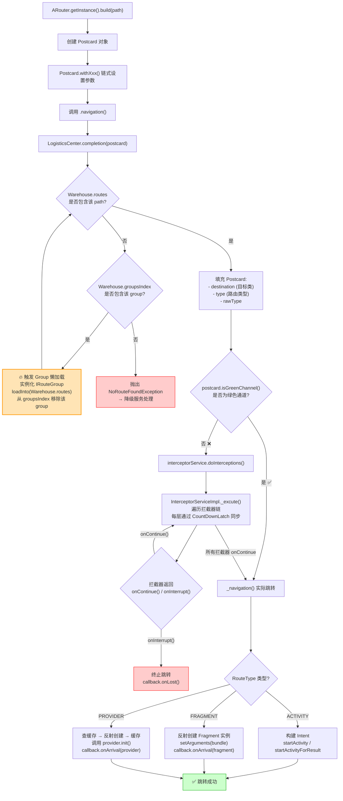

# 04 ARouter 路由框架

> 面向中高级 Android 岗位的 ARouter 深度面试内容，覆盖 APT 路由表生成、分组懒加载、拦截器链、IProvider 服务发现等核心机制。按六层递进结构展开：面试问题 → 核心原理 → 源码深挖 → 流程图 → 组件化通信 → 实战场景。

---

## 目录

1. [第一层：高频面试问题（5+ 道核心题）](#1-第一层高频面试问题5-道核心题)
2. [第二层：LogisticsCenter.init() 初始化流程深度解析](#2-第二层logisticscenterinit-初始化流程深度解析)
3. [第三层：ARouter 跳转完整链路（navigation → build → 拦截器 → 跳转）](#3-第三层arouter-跳转完整链路navigation--build--拦截器--跳转)
4. [第四层：路由跳转完整流程图](#4-第四层路由跳转完整流程图)
5. [第五层：组件化工程中 ARouter 的模块间通信](#5-第五层组件化工程中-arouter-的模块间通信)
6. [第六层：实战场景 — 拦截器、降级策略与 Path 管理规范](#6-第六层实战场景--拦截器降级策略与-path-管理规范)

---

## 1. 第一层：高频面试问题（5+ 道核心题）

### Q1：ARouter 的路由表是如何生成的？APT（注解处理器）的工作原理？

**答案概要**：ARouter 基于 Java APT（Annotation Processing Tool）在**编译期**扫描所有带 `@Route` 注解的类，自动生成路由映射表代码，运行时直接加载即可，避免运行时反射扫描的性能损耗。

**核心流程**：

```
编译期 (APT)
  RouteProcessor.process()
    ├── 收集所有 @Route 注解的类信息
    ├── 按 group 进行分组
    │     group = @Route(path) 中第一段路径作为分组名
    │     如 path="/app/MainActivity" → group="app"
    ├── 为每个 group 生成 ARouter$$Group$$<group>.java
    │     class ARouter$$Group$$app implements IRouteGroup {
    │         @Override public void loadInto(Map<String, RouteMeta> atlas) {
    │             atlas.put("/app/MainActivity",
    │                 RouteMeta.build(RouteType.ACTIVITY,
    │                     MainActivity.class, "/app/MainActivity", "app", ...));
    │         }
    │     }
    └── 生成 ARouter$$Root$$<module>.java (汇总所有 group)
          class ARouter$$Root$$app implements IRouteRoot {
              @Override public void loadInto(Map<String, Class<? extends IRouteGroup>> routes) {
                  routes.put("app", ARouter$$Group$$app.class);
                  routes.put("module_a", ARouter$$Group$$module_a.class);
                  // ...
              }
          }
```

**关键源码要点**：

| 类/文件 | 职责 |
|---------|------|
| `RouteProcessor` | 注解处理器入口，process() 中遍历所有 @Route 注解元素 |
| `RouteMeta` | 路由元数据：存储路由类型(Activity/Fragment/Provider等)、目标类、path、group、paramsType 等 |
| `IRouteGroup` | 接口，loadInto() 方法将当前 group 内所有 RouteMeta 注册到 atlas 中 |
| `IRouteRoot` | 接口，loadInto() 方法建立 group 名 → IRouteGroup 实现的映射 |
| `ARouter$$Root$$<module>` | 编译生成的 Root 类，汇总该模块所有 group |
| `ARouter$$Group$$<group>` | 编译生成的 Group 类，汇总该 group 下所有 path → RouteMeta 映射 |

**典型追问**：为什么 ARouter 只支持运行时注解(POJO)且必须显式依赖 arouter-compiler？

> ARouter 使用 `@Retention(RetentionPolicy.CLASS)` 的注解，APT 在编译期处理这些注解，生成的 Java 代码在 `build/generated/source/apt/` 下。编译完成后注解信息被丢弃，运行时仅依赖生成的类文件。arouter-compiler 即 RouteProcessor 处理器，声明在注解处理器配置中，AGP 会自动发现并执行它。

---

### Q2：路由分组（group → path）懒加载机制是怎样的？

**答案概要**：ARouter 默认按路由 path 的第一段路径作为 **group** 名（如 `/user/LoginActivity` 的 group 为 `"user"`）。初始化时只加载 `IRouteRoot` 类中所有 group 名，**不加载具体 RouteMeta**。只有当某个 group 的路由被首次访问时，才触发该 group 的 IRouteGroup 加载。

**懒加载核心流程**：

```java
// LogisticsCenter.java — completion() 方法中触发懒加载
public static synchronized void completion(Postcard postcard) {
    RouteMeta routeMeta = Warehouse.routes.get(postcard.getPath());
    
    if (routeMeta == null) {
        // 该 group 尚未加载 → 触发懒加载
        Class<? extends IRouteGroup> groupMeta =
            Warehouse.groupsIndex.get(postcard.getGroup());
        
        if (groupMeta == null) {
            throw new NoRouteFoundException("...");
        }
        
        IRouteGroup iGroupInstance = groupMeta.getConstructor().newInstance();
        iGroupInstance.loadInto(Warehouse.routes);  // 将 group 内所有 RouteMeta 注入
        
        Warehouse.groupsIndex.remove(postcard.getGroup()); // 加载完成后移除索引
        // 防止重复加载
        
        // 重试获取
        routeMeta = Warehouse.routes.get(postcard.getPath());
    }
}
```

**设计目的**：

> 大型组件化项目可能包含数十甚至上百个 group，每个 group 下又有大量路由。如果初始化时一次性加载所有 RouteMeta，不仅耗时还会浪费内存。分组懒加载**按需加载**，首次跳转到某 group 的页面时才初始化该 group，极大降低启动开销。

**面试加分项**：可以补充说明 `@Route(path = "/xxx", group = "customGroup")` 可以显式指定分组名，避免默认按第一段路径分组导致 group 过多的问题。

---

### Q3：拦截器链（Interceptor）的实现机制？绿色通道 + 异步拦截？

**答案概要**：ARouter 的拦截器链采用**责任链模式**，所有拦截器注册在 `Warehouse.interceptors` 中并统一按 priority 排序。`InterceptorServiceImpl` 是拦截器的执行引擎，核心在 `_excute()` 方法中通过 `CountDownLatch` 实现异步拦截器支持。

**拦截器接口定义**：

```java
public interface IInterceptor extends IProvider {
    void process(Postcard postcard, InterceptorCallback callback);
    // callback:
    //   -> onContinue(postcard)  继续执行后续拦截器
    //   -> onInterrupt(Throwable) 中断拦截链，不再继续跳转
}
```

**拦截链执行机制（含绿色通道与异步支持）**：

```java
// InterceptorServiceImpl._excute()
private static void _excute(final int index, final CancelableCountDownLatch counter,
                            final Postcard postcard) {
    if (index < Warehouse.interceptors.size()) {
        IInterceptor iInterceptor = Warehouse.interceptors.get(index);
        iInterceptor.process(postcard, new InterceptorCallback() {
            @Override
            public void onContinue(Postcard postcard) {
                counter.countDown();        // 释放当前锁
                _excute(index + 1, counter, postcard); // 递归执行下一个
            }
            @Override
            public void onInterrupt(Throwable exception) {
                // 被打断 → 设置 resultCode 为中断，取消后续
                postcard.setTag("interceptor_interrupt", exception);
                counter.cancel(); // 取消倒计时，立即唤醒等待线程
            }
        });
    }
}
```

**绿色通道（Green Channel）**：

> 某些路由（如登录页、首页）不应该被拦截器拦截（否则陷入死循环：拦截器要求登录 → 跳转登录页 → 拦截器再次拦截）。ARouter 通过 `postcard.greenChannel()` 设置绿色通道标记，拦截器链检测到此标记后**跳过所有拦截器**直接跳转。

```java
// Postcard.greenChannel()
public Postcard greenChannel() {
    extras.putInt(ARouterConsts.GREEN_CHANNEL, 1);
    return this;
}

// 在 _navigation() 中判断
if (!postcard.isGreenChannel()) {
    interceptorService.doInterceptions(postcard, callback);
} else {
    _navigation(context, postcard, requestCode, callback);
}
```

**异步拦截器支持**：

> 拦截器的 `process()` 方法内部可以做异步操作（如网络校验），完成后通过 `callback.onContinue()` / `callback.onInterrupt()` 通知结果。`CancelableCountDownLatch` 保证主流程阻塞等待拦截器链全部完成（或被打断）。

---

### Q4：IProvider 服务发现机制如何实现模块解耦？

**答案概要**：IProvider 是 ARouter 的依赖注入接口，用于跨模块暴露服务接口。**定义方**（通常 library/common 模块）声明接口，**实现方**（业务模块）打 `@Route` 注解标记实现类，**调用方**通过 `ARouter.getInstance().navigation(IProvider.class)` 获取实现。

**典型代码示例**：

```java
// ======= 步骤1: common 模块定义接口 =======
public interface IUserService extends IProvider {
    UserInfo getUserInfo();
    boolean isLogin();
}

// ======= 步骤2: user 模块实现接口 =======
@Route(path = "/user/service")
public class UserServiceImpl implements IUserService {
    @Override public UserInfo getUserInfo() { /* ... */ }
    @Override public boolean isLogin() { /* ... */ }
    @Override public void init(Context ctx) {}
}

// ======= 步骤3: 任意模块调用 =======
IUserService userService = ARouter.getInstance()
    .navigation(IUserService.class);
if (userService.isLogin()) {
    // ...
}
```

**底层原理**：

1. `RouteProcessor` 扫描到 `UserServiceImpl` 实现了 IProvider 子接口，将其标记为 `RouteType.PROVIDER`
2. 生成的 `ARouter$$Providers$$xxx` 类维护 Provider 映射
3. 调用 `navigation(IUserService.class)` 时，ARouter 通过接口全限定名查询 RouteMeta → 反射创建实例 → 缓存到 `Warehouse.providers` 以便下次直接复用

**IProvider 的优势**：

| 对比项 | 传统依赖引入 | IProvider 服务发现 |
|--------|------------|-------------------|
| 模块依赖关系 | 调用方必须依赖实现方模块 | 调用方只依赖 common 接口 |
| 编译速度 | 修改实现需重新编译调用方 | 只依赖接口，实现变更不影响 |
| 可替换性 | 需要修改代码替换实现 | 修改 @Route path 即可切换实现 |

---

### Q5：ARouter 的参数传递方式有哪些？自动注入（@Autowired）如何实现？

**答案概要**：ARouter 支持两种参数传递方式：

**方式一：Bundle 传递**（调用方手动 put）

```java
ARouter.getInstance().build("/app/DetailActivity")
    .withString("title", "文章标题")
    .withInt("id", 123)
    .withObject("data", userObject)
    .navigation();
```

**方式二：@Autowired 自动注入**（目标页声明参数，编译期生成注入代码）

```java
// 目标 Activity
@Route(path = "/app/DetailActivity")
public class DetailActivity extends AppCompatActivity {
    @Autowired
    String title;
    
    @Autowired(name = "id")
    int articleId;
    
    @Override
    protected void onCreate(Bundle savedInstanceState) {
        super.onCreate(savedInstanceState);
        ARouter.getInstance().inject(this); // ← 触发注入
        // 此时 title、articleId 已被赋值
    }
}
```

**@Autowired 的 APT 实现原理**：

> `AutowiredProcessor` 扫描 `@Autowired` 注解的字段，为每个使用了 `@Autowired` 的类生成 `ARouter$$Autowired$$<ClassName>.java`，其中包含 `inject(Object target)` 方法，通过反射将 Bundle 中的值赋给对应字段。`ARouter.getInstance().inject(this)` 内部通过反射找到对应注入类并执行注入。

---

## 2. 第二层：LogisticsCenter.init() 初始化流程深度解析

### 问题

> "ARouter 的初始化流程是怎样的？LogisticsCenter.init() 到底做了什么？路由表数据存在哪里？"

### 答题思路

从 `ARouter.init(application)` 入口开始，逐层讲清 `LogisticsCenter.init()` 的完整职责：加载路由表 → 初始化拦截器索引 → 初始化 Provider 索引 → 分组懒加载预备。重点说明 `Warehouse` 这一核心数据中心的作用，以及不同数据结构的存储分工。

### 核心流程

```
ARouter.init(application)
  └── LogisticsCenter.init(context, executor)
        ├── Step 1: 加载路由 Root 表
        │     └── 通过 ClassUtils.getFileNameByPackageName() 获取所有
        │         ARouter$$Root$$xxx 类的类名列表
        │         来源：编译期生成的 com.alibaba.android.arouter.routes 包
        │     └── 遍历每个 ARouter$$Root$$xxx，调用 loadInto()
        │         → 填充 Warehouse.groupsIndex
        │           Map<String, Class<? extends IRouteGroup>>
        │           记录所有 group 名 → IRouteGroup 实现类 的映射
        │
        ├── Step 2: 加载拦截器索引
        │     └── 获取所有 ARouter$$Interceptors$$xxx 类
        │     └── 调用 loadInto() → 填充 Warehouse.interceptorsIndex
        │           Map<Integer, Class<? extends IInterceptor>>
        │           记录 priority → IInterceptor 实现类的映射
        │     └── 注意：此处仅记录索引，拦截器实例化在首次使用时触发
        │
        ├── Step 3: 加载 Provider 服务索引
        │     └── 获取所有 ARouter$$Providers$$xxx 类
        │     └── 调用 loadInto() → 填充 Warehouse.providersIndex
        │           Map<String, RouteMeta>
        │           记录接口全限定名 → Provider RouteMeta 的映射
        │
        └── Step 4: 注册默认拦截器
              └── 如果有配置，注册默认 IInterceptor 实现
```

**Warehouse 核心数据结构**：

| 字段 | 类型 | 说明 |
|------|------|------|
| `groupsIndex` | `Map<String, Class<? extends IRouteGroup>>` | group 名 → Group 加载器类的映射，加载完成后移除 |
| `routes` | `Map<String, RouteMeta>` | path → RouteMeta 的终极映射，分组懒加载时填充 |
| `interceptorsIndex` | `Map<Integer, Class<? extends IInterceptor>>` | priority → 拦截器类映射 |
| `interceptors` | `List<IInterceptor>` | 已实例化的拦截器列表（按 priority 排序） |
| `providersIndex` | `Map<String, RouteMeta>` | Provider 接口名 → RouteMeta |
| `providers` | `Map<Class, IProvider>` | 已实例化的 Provider 缓存（单例） |

**类扫描机制（自动注册）**：

```java
// ClassUtils.getFileNameByPackageName()
// 原理：读取 dex 文件中的 com/alibaba/android/arouter/routes/ 包下的所有类名
// 通过 Class.forName() 加载并缓存
//
// 优点：零配置，开发体验好
// 缺点：
//   1. 首次启动扫描 dex 有一定耗时（可配置 arouter-auto-register 插件解决）
//   2. 混淆后需要 keep 规则保留 routes 包下的生成类
```

**面试加分项**：可以提 `arouter-register` 插件实现编译期字节码插桩注册，避免运行时 dex 扫描的开销，对启动速度优化有帮助。

---

## 3. 第三层：ARouter 跳转完整链路（navigation → build → 拦截器 → 跳转）

### 问题

> `ARouter.getInstance().build("/app/Main").navigation()` 这一行代码背后发生了什么？

### 答题思路

从 Postcard 创建 → LogisticsCenter 补全 → 拦截器链 → _navigation 实际跳转，完整讲清每一步。

### 完整链路拆解

```java
// ========== Step 1: build() 构建 Postcard ==========
ARouter.getInstance().build("/app/Main")
// → _ARouter.build(String path)
//   创建 Postcard(path="app", group="app")
//   Postcard 是一个承载路由跳转中所有信息的"明信片"：
//     - path：目标路由路径
//     - group：路由分组
//     - bundle：参数容器
//     - flags：Intent flags
//     - tag：自定义标记
//     - greenChannel：绿色通道标记

// ========== Step 2: navigation() 触发路由补全 ==========
.build("/app/Main").navigation()
// → _ARouter.navigation(context, postcard, requestCode, callback)
//   → LogisticsCenter.completion(postcard)
//     核心逻辑：
//       ① 从 Warehouse.routes 查询 path → RouteMeta
//       ② 如果未命中 → 触发分组懒加载
//           → 通过 Warehouse.groupsIndex 找到 Group 类
//           → 实例化并调用 loadInto() 填充 routes
//           → 重试查询
//       ③ 将 RouteMeta 信息填充到 Postcard：
//           - postcard.setDestination(clazz)    // 目标 Activity/Fragment 类
//           - postcard.setType(routeType)       // 路由类型
//           - postcard.setRawType(rawType)      // 原始类型
//       ④ 设置 resultCode = ARouterConsts.SUCCEED

// ========== Step 3: 拦截器链处理 ==========
//   → 判断 postcard.isGreenChannel()
//      - 若是绿色通道 → 直接跳到 _navigation()
//      - 否则 → interceptorService.doInterceptions(postcard, callback)
//         → InterceptorServiceImpl._excute(0, counter, postcard)
//           - 遍历 Warehouse.interceptors
//           - 逐一调用 process(postcard, callback)
//           - 通过 CancelableCountDownLatch 等待所有拦截器完成
//           - 若任何拦截器调用 onInterrupt() → 取消跳转
//           - 全部 onContinue() → 执行 _navigation()

// ========== Step 4: _navigation() 实际跳转 ==========
//   → _ARouter._navigation(context, postcard, requestCode, callback)
//     根据 RouteType 分发：
//     - ACTIVITY → 构建 Intent，调用 startActivity()
//        Intent intent = new Intent(context, postcard.getDestination());
//        intent.putExtras(postcard.getExtras());
//        intent.setFlags(postcard.getFlags());
//        startActivity(intent); // 或 startActivityForResult()
//     - FRAGMENT → 反射 newInstance()，返回 Fragment 实例
//        Fragment fragment = postcard.getDestination()
//            .getConstructor().newInstance();
//        fragment.setArguments(postcard.getExtras());
//        callback.onArrival(postcard); // 回调给调用方
//     - PROVIDER → 查缓存 → 未命中则反射创建 → 缓存 → 调用 init()
//     - SERVICE → 同 PROVIDER
```

**关键时序要点**：

| 阶段 | 线程 | 可阻塞 | 说明 |
|------|------|:---:|------|
| build() | 调用线程 | × | 仅创建 Postcard 对象 |
| completion() | 调用线程 | × | 懒加载 Group 时可能阻塞（首次） |
| 拦截器链 | 调用线程 + 拦截器内部 | ✓ | `CancelableCountDownLatch.await()` 阻塞等待 |
| _navigation() | 调用线程 | × | 实际跳转由系统处理 |

**易错点**：`build()` 返回的 Postcard 是链式调用的核心，所有 withXxx() 都是往 Postcard 的 Bundle 里塞数据；`navigation()` 的 `context` 参数必须传 Activity 上下文（否则启动 Activity 会因缺少 FLAG_ACTIVITY_NEW_TASK 失败）。

---

## 4. 第四层：路由跳转完整流程图



**流程图解读**：虚线框标注了三个核心决策点——① 路由补全阶段的分组懒加载触发器；② 绿色通道判断实现拦截器绕过；③ RouteType 分发完成最终跳转。`CountDownLatch` 是拦截器链实现「同步等待异步结果」的关键。

---

## 5. 第五层：组件化工程中 ARouter 的模块间通信

### 问题

> 在大型组件化工程中，ARouter 如何实现模块间的解耦通信？你们项目是如何管理 Path 的？

### 核心方案

**组件化通信的关键痛点**：

| 痛点 | 传统方式 | ARouter 方案 |
|------|---------|-------------|
| A 模块想跳转 B 模块页面 | A 必须依赖 B | A 只依赖 path 字符串 → ARouter 路由分发 |
| A 模块想调用 B 模块服务 | A 依赖 B 的接口实现 | A 依赖 common 中的 IProvider 接口 → ARouter 注入 |
| 模块间数据传递 | 序列化后 Intent 传递 | Path + Bundle / IProvider 服务方法调用 |

**模块架构示意**：

```
┌────────────────────────────────────────────────┐
│                  app 主壳模块                    │
│        (集成所有模块，初始化 ARouter)             │
└───────────┬────────────────┬───────────────────┘
            │                │
    ┌───────▼──────┐  ┌──────▼────────┐
    │  common 基础库 │  │  lib_router   │
    │  IUserService │  │  Path 常量管理  │
    │  IOrderService│  │  RoutePath.java │
    └───────┬──────┘  └───────────────┘
            │
   ┌────────┼────────┬────────────┐
   │        │        │            │
┌──▼──┐ ┌──▼──┐ ┌───▼──┐ ┌─────▼───┐
│user  │ │order│ │goods │ │  ...    │
│模块  │ │模块  │ │模块  │ │ 业务模块 │
│provide│ │provide│ │provide│ │          │
│ user  │ │ order│ │ goods │ │          │
│service│ │service│ │service│ │          │
└──────┘ └─────┘ └──────┘ └─────────┘
```

**Path 管理中心（推荐工程实践）**：

```java
// lib_router 模块中集中管理所有路由 Path
public final class RoutePath {
    
    // ========== user 模块 ==========
    public static final class User {
        public static final String LOGIN = "/user/LoginActivity";
        public static final String PROFILE = "/user/ProfileActivity";
        public static final String SERVICE = "/user/service";
    }
    
    // ========== order 模块 ==========
    public static final class Order {
        public static final String LIST = "/order/OrderListActivity";
        public static final String DETAIL = "/order/OrderDetailActivity";
    }
    
    // ========== goods 模块 ==========
    public static final class Goods {
        public static final String DETAIL = "/goods/GoodsDetailActivity";
    }
}

// 使用示例
ARouter.getInstance().build(RoutePath.User.LOGIN).navigation();
```

**Provider 服务通信模式**：

```java
// ===== common 模块 =====
public interface IOrderService extends IProvider {
    void createOrder(OrderParams params, Callback callback);
    OrderInfo queryOrder(String orderId);
}

// ===== order 模块 =====
@Route(path = RoutePath.Order.SERVICE)
public class OrderServiceImpl implements IOrderService {
    @Override public void createOrder(OrderParams params, Callback callback) {
        // 实际下单逻辑
    }
    @Override public void init(Context context) {}
}

// ===== user 模块（完全不依赖 order 模块）=====
IOrderService orderService = ARouter.getInstance()
    .navigation(IOrderService.class);
orderService.createOrder(params, new Callback() {
    @Override public void onSuccess(OrderInfo info) { ... }
});
```

**面试亮点**：IProvider 的 `init()` 方法在 Provider 首次实例化时调用一次，可以在这里完成初始化操作（如注入 Application Context）。Provider 实例默认单例缓存，多次调用 `navigation()` 返回同一个实例。

---

## 6. 第六层：实战场景 — 拦截器、降级策略与 Path 管理规范

### 场景 1：全局登录拦截器（标准实现）

```java
@Interceptor(priority = 1, name = "登录拦截器")
public class LoginInterceptor implements IInterceptor {
    
    @Override
    public void process(Postcard postcard, InterceptorCallback callback) {
        // 获取目标路由是否需要登录的标记
        // 方式1：通过 postcard.getExtra() 读取标记
        // 方式2：通过 path 白名单判断
        
        if (needLogin(postcard.getPath())) {
            // 判断是否已登录（通过 IUserService 服务发现）
            IUserService userService = ARouter.getInstance()
                .navigation(IUserService.class);
            
            if (userService != null && userService.isLogin()) {
                callback.onContinue(postcard);  // 已登录，放行
            } else {
                // 未登录 → 跳转登录页（绿色通道，避免死循环）
                ARouter.getInstance()
                    .build(RoutePath.User.LOGIN)
                    .greenChannel()    // ← 关键！登录页走绿色通道
                    .withString("redirectPath", postcard.getPath())
                    .navigation();
                callback.onInterrupt(
                    new RuntimeException("请先登录"));
            }
        } else {
            callback.onContinue(postcard);  // 不需要登录，放行
        }
    }
    
    @Override public void init(Context context) {}
}
```

### 场景 2：降级策略（DegradeService）

```java
// 场景：path 未注册时优雅降级，而不是直接崩溃
@Route(path = "/degrade/service")
public class DegradeServiceImpl implements DegradeService {
    
    @Override
    public void onLost(Context context, Postcard postcard) {
        // 路由丢失时的处理逻辑
        Log.w("ARouter", "路由丢失: " + postcard.getPath());
        
        // 策略1：跳转到公共 H5 兜底页
        ARouter.getInstance()
            .build("/webview/H5FallbackActivity")
            .withString("url", "https://m.example.com" + postcard.getPath())
            .navigation();
        
        // 策略2：跳转首页 + Toast 提示
        // ARouter.getInstance().build("/app/MainActivity").navigation();
        // Toast.makeText(context, "页面未找到", Toast.LENGTH_SHORT).show();
    }
}

// 使用降级服务
ARouter.getInstance()
    .build("/unknown/path")
    .navigation(context, new NavigationCallback() {
        @Override
        public void onFound(Postcard postcard) {}
        
        @Override
        public void onLost(Postcard postcard) {
            // 降级：交由 DegradeService 处理
            DegradeService degradeService = ARouter.getInstance()
                .navigation(DegradeService.class);
            if (degradeService != null) {
                degradeService.onLost(context, postcard);
            }
        }
        
        @Override
        public void onArrival(Postcard postcard) {}
        
        @Override
        public void onInterrupt(Postcard postcard) {}
    });
```

### 场景 3：Path 管理规范（工程实践要点）

| 规范项 | 说明 | 示例 |
|--------|------|------|
| **命名格式** | `/模块名/业务名[/功能名]` | `/user/ProfileActivity` |
| **常量集中管理** | 所有 path 定义在 `lib_router` 模块的常量类中 | `RoutePath.User.LOGIN` |
| **接口下沉** | IProvider 接口定义在 `common` 库，实现留在业务模块 | `IUserService` in common |
| **group 合理规划** | 第一段路径即 group，避免过多或过少 | 约 10-30 个 group 为宜 |
| **绿色通道白名单** | 登录页、首页、H5 兜底页必须加绿色通道 | 避免拦截器死循环 |
| **文档维护** | 维护一份路由表文档（path → 页面/功能说明） | 方便跨团队协作 |

### 场景 4：多模块跳转 + 数据回传

```java
// A 模块跳转到 B 模块页面，并接收回传结果
ARouter.getInstance()
    .build(RoutePath.Order.DETAIL)
    .withString("orderId", "ORD-2024-001")
    .navigation(currentActivity, REQUEST_CODE_ORDER);

// 在 A 模块的 onActivityResult 中接收
@Override
protected void onActivityResult(int requestCode, int resultCode, @Nullable Intent data) {
    super.onActivityResult(requestCode, resultCode, data);
    if (requestCode == REQUEST_CODE_ORDER && resultCode == RESULT_OK) {
        // B 模块已经通过 setResult + finish() 回传数据
        String result = data.getStringExtra("result");
    }
}
```

### 面试自检清单

- [ ] 能讲清 APT 生成路由表的完整流程（RouteProcessor → IRouteRoot / IRouteGroup）
- [ ] 能讲清分组懒加载的 trigger 机制和实现目的
- [ ] 能画出 LogisiticsCenter.init() 的数据流转图
- [ ] 能口述 build() → completion() → 拦截器链 → _navigation() 四步
- [ ] 能解释 CancelableCountDownLatch 如何实现同步等待异步拦截
- [ ] 能对比自动注册 vs 编译插桩注册的优劣
- [ ] 能给出组件化中 Provider 服务通信的真实代码示例
- [ ] 能说清绿色通道的使用场景和死循环陷阱
- [ ] 能结合实际项目讲 Path 管理规范

---

> **参考资料**：ARouter 官方仓库 [alibaba/ARouter](https://github.com/alibaba/ARouter) | 源码核心类：`LogisticsCenter` / `Warehouse` / `RouteProcessor` / `InterceptorServiceImpl` / `_ARouter`
