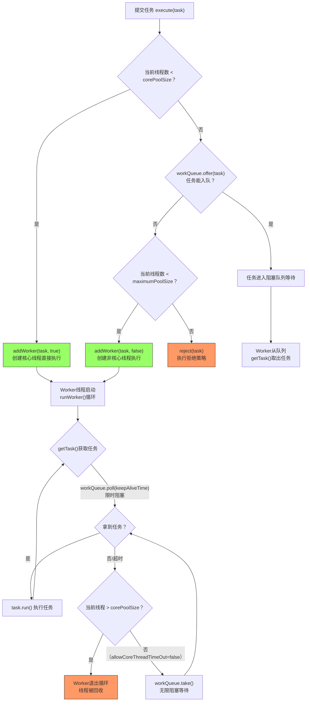

# Java并发基础面试题集

> 面向Android中高级开发者的Java并发编程知识体系，涵盖线程基础、线程池、锁机制、AQS框架、同步工具类等核心考点。

---

## 一、面试层：高频面试题精选（6+题）

### 1. Thread / Runnable / Callable / Future 的对比

| 特性 | Thread | Runnable | Callable | Future |
|------|--------|----------|----------|--------|
| **返回值** | 无 | 无 | 有（泛型） | 承载异步结果 |
| **异常处理** | 只能内部try-catch | 只能内部try-catch | throws Exception | get()抛出异常 |
| **使用方式** | 继承Thread类 | 实现接口，更灵活 | 实现接口，配合线程池 | 与Callable配对使用 |
| **资源共享** | 每个Thread独立 | 同一Runnable可被多个线程共享 | 同Runnable | 可取消任务 |
| **设计模式** | 继承 | 策略模式 | 模板方法模式 | Future模式 |

**关键追问：FutureTask是什么？**

`FutureTask` 同时实现了 `RunnableFuture` 接口（继承自 `Runnable` 和 `Future`），可以同时作为任务执行和获取结果：

```java
FutureTask<String> task = new FutureTask<>(() -> {
    Thread.sleep(1000);
    return "done";
});
new Thread(task).start();
String result = task.get(); // 阻塞等待结果
```

FutureTask 内部维护了7种任务状态（NEW → COMPLETING → NORMAL/EXCEPTIONAL/CANCELLED/INTERRUPTING/INTERRUPTED），通过 `WaitNode` 链表管理等待获取结果的线程队列。

---

### 2. ThreadPoolExecutor的7个核心参数和调参策略

```java
public ThreadPoolExecutor(
    int corePoolSize,      // 核心线程数
    int maximumPoolSize,   // 最大线程数
    long keepAliveTime,    // 空闲非核心线程存活时间
    TimeUnit unit,         // 时间单位
    BlockingQueue<Runnable> workQueue,  // 任务队列
    ThreadFactory threadFactory,        // 线程工厂
    RejectedExecutionHandler handler    // 拒绝策略
)
```

**参数详解：**

| 参数 | 作用 | 调参考量 |
|------|------|----------|
| **corePoolSize** | 常驻线程数量，即使空闲也不回收（除非allowCoreThreadTimeOut=true） | CPU密集型：N+1；IO密集型：2N+1（N=CPU核数） |
| **maximumPoolSize** | 允许的最大线程数 | 受内存、CPU、文件描述符限制 |
| **keepAliveTime** | 非核心线程空闲最大存活时间 | 任务峰值过后快速回收资源 |
| **workQueue** | 缓冲任务的阻塞队列 | 直接影响吞吐量和响应延迟 |
| **threadFactory** | 创建线程的工厂 | 自定义线程名便于排查问题 |
| **handler** | 线程池满载时的拒绝策略 | 决定着任务丢失还是降级处理 |

**四种拒绝策略对比：**

| 策略 | 行为 | 适用场景 |
|------|------|----------|
| **AbortPolicy**（默认） | 抛出RejectedExecutionException | 必须感知任务拒绝的场景 |
| **CallerRunsPolicy** | 由提交任务的线程执行 | 天然的背压机制，减缓提交速率 |
| **DiscardPolicy** | 静默丢弃 | 允许丢失的非关键任务 |
| **DiscardOldestPolicy** | 丢弃队首最老任务，重试提交 | 优先保证最新任务 |

**Android线程池调参建议：**

- 网络IO线程池：core=2~4, max=8, 队列=SynchronousQueue（无界即时交付）
- 图片解码线程池：core=CPU核数, max=CPU核数, 队列=LinkedBlockingQueue(128)
- 数据库操作线程池：core=1, max=4, 队列=LinkedBlockingQueue(64)（保证顺序写入）

---

### 3. synchronized vs ReentrantLock vs volatile 的底层差异

| 维度 | synchronized | ReentrantLock | volatile |
|------|-------------|---------------|----------|
| **实现层面** | JVM内置，Monitor对象（ObjectMonitor） | JDK层面，基于AQS | JVM内存屏障指令 |
| **锁升级** | 偏向锁→轻量级锁→重量级锁（JDK6+） | 无锁升级机制 | 无锁概念 |
| **可中断** | 不可中断 | lockInterruptibly() | N/A |
| **公平性** | 非公平 | 支持公平/非公平（构造函数指定） | N/A |
| **条件变量** | wait/notify单条件 | 多Condition（可精确唤醒） | N/A |
| **释放** | 自动释放（代码块退出或异常） | 必须finally中手动unlock | N/A |
| **保证** | 原子性+可见性+有序性 | 原子性+可见性+有序性 | 仅可见性+有序性，**不保证原子性** |

**底层实现差异：**

- **synchronized字节码**：方法级用 `ACC_SYNCHRONIZED` 标志，代码块用 `monitorenter`/`monitorexit` 指令。HotSpot中每个对象头Mark Word记录锁状态（最后2bit：00轻量锁/10重量锁/01无锁或偏向锁/11GC标记）。
- **ReentrantLock**：调用 `Unsafe.park()`/`unpark()` 实现线程阻塞/唤醒，内部通过AQS的state变量（用CAS操作）实现可重入计数。
- **volatile**：写入时插入 `lock` 前缀指令（StoreLoad屏障），实现缓存一致性协议（MESI），强制刷新写缓冲到主存并使其他CPU缓存行失效。

---

### 4. CAS原理和ABA问题

**CAS（Compare-And-Swap）** 是一条CPU原子指令（`cmpxchg`），包含三个操作数：

```
CAS(V, A, B) → 如果V的值等于A，则将V设为B，否则不操作并返回V的当前值
```

Java通过 `Unsafe.compareAndSwapInt()` 等native方法调用CPU指令。AtomicInteger、AtomicReference等均基于CAS。

**CAS的优缺点：**

- ✅ 无需锁，线程不会被阻塞，适合低竞争场景
- ✅ 不会死锁
- ❌ 自旋会消耗CPU（高竞争时性能劣化）
- ❌ 只能保证单个变量的原子操作
- ❌ **ABA问题**

**ABA问题：**

线程1读取值A → 线程2将A改为B再改回A → 线程1的CAS操作仍然成功，但线程1不知道值已经被修改过。

**解决：AtomicStampedReference（版本号）和AtomicMarkableReference（布尔标记）**

```java
AtomicStampedReference<Integer> ref = new AtomicStampedReference<>(100, 0);
int stamp = ref.getStamp();
// 线程2可能修改了值又改回来，stamp不对则CAS失败
boolean success = ref.compareAndSet(100, 200, stamp, stamp + 1);
```

---

### 5. AQS（AbstractQueuedSynchronizer）框架原理

AQS是 `java.util.concurrent` 包的核心骨架，ReentrantLock、Semaphore、CountDownLatch、ReentrantReadWriteLock 等都基于它。

**核心三要素：**

1. **state（volatile int）**：同步状态，通过 `getState()/setState()/compareAndSetState()` 操作
2. **CLH变种队列**：FIFO双向链表，存储等待获取锁的线程
3. **模板方法模式**：子类只需覆写 `tryAcquire/tryRelease/isHeldExclusively` 等

**CLH队列的节点结构（Node）：**

```java
// Node核心字段
volatile int waitStatus;  // SIGNAL(-1)/CANCELLED(1)/CONDITION(-2)/PROPAGATE(-3)
volatile Node prev;       // 前驱节点
volatile Node next;       // 后继节点
volatile Thread thread;   // 持有的线程
Node nextWaiter;          // 条件队列的下一个节点
```

**独占模式获取锁流程：**

1. 调用 `tryAcquire(arg)` 尝试直接获取锁
2. 失败则将当前线程封装为Node，CAS加入CLH队尾
3. 检查前驱节点是否为head且tryAcquire成功，是则出队；否则判断是否需要park
4. 前驱节点的 `waitStatus = SIGNAL` 时，安全地 `park()` 当前线程
5. 被唤醒后继续自旋尝试获取锁

**共享模式与独占模式的区别：**

- 独占（ReentrantLock）：同一时刻只有一个线程能获取锁
- 共享（Semaphore/CountDownLatch/ReadLock）：多个线程可以同时获取，通过 `tryAcquireShared` 返回值（≥0成功，<0失败）和 `tryReleaseShared` 控制

**AQS为什么使用双向链表而不是单向？**

因为节点取消时需要找到有效的后继节点直接唤醒（`unparkSuccessor`），双向链表可以O(1)定位前驱和后继。此外在出队时，通过prev可以安全地判断队列是否稳定。

---

### 6. CountDownLatch / CyclicBarrier / Semaphore 的使用场景

| 工具 | 核心机制 | 典型场景 |
|------|----------|----------|
| **CountDownLatch** | 计数器减到0释放所有等待线程 | 主线程等待多个子任务完成；服务启动前等待依赖就绪 |
| **CyclicBarrier** | 所有线程到达屏障点后一起继续 | 多线程分批处理数据；王者荣耀匹配（5人齐开） |
| **Semaphore** | 许可证，acquire获取/release归还 | 限流；数据库连接池；滑动窗口限流 |

**关键差异：**

- CountDownLatch **一次性**，state减到0后不可重置；CyclicBarrier **可循环复用**，最后一个到达的线程触发回调后重置
- CountDownLatch 是 "等待别人完成"，由外部线程countDown；CyclicBarrier 是 "我到了等你"，由参与者自己await
- Semaphore 的 acquire/release 可以在不同线程中调用

```java
// CountDownLatch：等3个初始化任务完成
CountDownLatch latch = new CountDownLatch(3);
executor.execute(() -> { initDb(); latch.countDown(); });
executor.execute(() -> { initCache(); latch.countDown(); });
executor.execute(() -> { initConfig(); latch.countDown(); });
latch.await(5, TimeUnit.SECONDS); // 超时等待

// CyclicBarrier：5人匹配
CyclicBarrier barrier = new CyclicBarrier(5, () -> log("匹配成功！"));
for (int i = 0; i < 5; i++) {
    executor.execute(() -> {
        prepareMatch();
        barrier.await(); // 等5人都到达
        startGame();
    });
}

// Semaphore：限流10个并发
Semaphore semaphore = new Semaphore(10);
executor.execute(() -> {
    semaphore.acquire();
    try { doWork(); } finally { semaphore.release(); }
});
```

---

## 二、线程池的工作流程（核心线程→队列→最大线程→拒绝策略）

线程池的对任务的处理遵循严格的阶梯式升级路径：

```
提交任务
   │
   ├─ 当前线程数 < corePoolSize ？
   │   └─ YES → 创建核心线程，立即执行任务
   │
   ├─ 核心线程已满，任务能否入队 workQueue.offer() ？
   │   └─ YES → 任务进入队列等待
   │
   ├─ 队列已满，当前线程数 < maximumPoolSize ？
   │   └─ YES → 创建非核心线程（临时线程），立即执行任务
   │
   └─ 线程数已达 maximumPoolSize且队列满
       └─ 执行拒绝策略 handler.rejectedExecution()
```

**关键细节：**

1. **核心线程与已提交任务的执行顺序不同**：刚创建的核心线程会立即取出新提交的任务执行（`addWorker`后直接取`firstTask`），而队列中的任务需要等worker从队列poll取出。
2. **非核心线程的超时回收**：`getTask()` 方法中，当线程数超过corePoolSize时，使用 `workQueue.poll(keepAliveTime, unit)` 限时阻塞，超时返回null则线程退出循环并被回收。
3. **allowCoreThreadTimeOut设置**：设为true后核心线程也会超时回收，此时线程池可以弹性缩容到0。
4. **Worker继承AQS**：Worker本身是独占锁，保证worker执行任务时不会被重入，同时用于判断线程是否空闲（`tryLock`成功表示空闲）。

---

## 三、volatile的内存屏障（happens-before + store-load barrier）

### volatile的语义

volatile提供了JMM（Java内存模型）中最轻量的同步机制：

1. **可见性**：对一个volatile变量的读，总能看到任意线程最后一次写入
2. **禁止指令重排**：编译器和CPU不会将volatile操作前后的指令重排越过这个"屏障"

### 内存屏障（Memory Barrier）

volatile通过4类内存屏障实现上述语义：

| 屏障类型 | 指令示例 | 作用 |
|----------|----------|------|
| **LoadLoad** | Load1; LoadLoad; Load2 | 确保Load1的数据加载先于Load2及后续Load |
| **StoreStore** | Store1; StoreStore; Store2 | 确保Store1的写入对其他处理器可见先于Store2 |
| **LoadStore** | Load1; LoadStore; Store2 | 确保Load1先于Store2及其后续写入刷新到内存 |
| **StoreLoad** | Store1; StoreLoad; Load2 | 确保Store1对所有处理器可见先于Load2（**最重**，兼具其他三者效果） |

**volatile写操作的内存屏障插入策略：**

```
普通写操作
   │
[StoreStoreBarrier]   ← 禁止上面的普通写与下面的volatile写重排
   │
volatile写
   │
[StoreLoadBarrier]    ← 禁止volatile写与后续volatile读/写重排（保证立即可见）
   │
后续操作
```

**volatile读操作的内存屏障插入策略：**

```
volatile读
   │
[LoadLoadBarrier]     ← 禁止volatile读与后续普通读重排
[LoadStoreBarrier]    ← 禁止volatile读与后续普通写重排
   │
后续操作
```

### Happens-Before规则（与volatile相关）

1. **volatile变量规则**：对一个volatile变量的写，happens-before于后续对这个变量的读
2. **传递性**：A happens-before B，B happens-before C，则A happens-before C

**经典案例：双重检查锁定（DCL）单例为什么需要volatile？**

```java
public class Singleton {
    private static volatile Singleton instance; // 不加volatile可能拿到半初始化对象

    public static Singleton getInstance() {
        if (instance == null) {                    // 第一次检查
            synchronized (Singleton.class) {
                if (instance == null) {            // 第二次检查
                    instance = new Singleton();    // 非原子操作！
                }
            }
        }
        return instance;
    }
}
```

`new Singleton()` 在字节码层面分解为三步：
1. 分配内存空间
2. 初始化对象（调用构造器）
3. 将引用指向内存地址

在没有volatile的情况下，步骤2和3可能被指令重排，导致其他线程读到不为null但尚未初始化的对象（即拿到一个"半成品"单例）。volatile禁止了2和3的重排序，保证了安全发布。

---

## 四、线程池任务执行流程图（Mermaid）



**流程图解读：** 线程池的"弹性"体现在三个阶段——核心线程保证基础吞吐量，队列吸收突发流量，最大线程应对极端峰值。拒绝策略是最后的"泄洪阀"，选择合适的拒绝策略比调参本身更重要。

---

## 五、ThreadPoolExecutor.execute() 源码分析

以下为JDK 8 `execute()` 方法的核心逻辑解析：

```java
public void execute(Runnable command) {
    if (command == null) throw new NullPointerException();

    int c = ctl.get();  // ctl：高3位=运行状态，低29位=线程数量
    // 1. 如果线程数 < corePoolSize
    if (workerCountOf(c) < corePoolSize) {
        if (addWorker(command, true))
            return;
        c = ctl.get();  // 创建失败（如并发竞争），重新读取状态
    }
    // 2. 尝试入队
    if (isRunning(c) && workQueue.offer(command)) {
        int recheck = ctl.get();
        // 二次检查：入队后线程池可能已关闭
        if (!isRunning(recheck) && remove(command))
            reject(command);  // 线程池已关闭，移除任务并拒绝
        else if (workerCountOf(recheck) == 0)
            addWorker(null, false);  // 防止队列有任务但没有worker
    }
    // 3. 尝试创建非核心线程
    else if (!addWorker(command, false))
        reject(command);  // 创建失败（线程数达上限），执行拒绝策略
}
```

**核心方法剖析：**

### addWorker(Runnable firstTask, boolean core)

```java
private boolean addWorker(Runnable firstTask, boolean core) {
    retry:
    for (;;) {
        int c = ctl.get();
        int rs = runStateOf(c);
        // 线程池状态检查：非RUNNING且非(SHUTDOWN且firstTask==null且队列非空)则失败
        if (rs >= SHUTDOWN && !(rs == SHUTDOWN && firstTask == null && !workQueue.isEmpty()))
            return false;
        for (;;) {
            int wc = workerCountOf(c);
            if (wc >= CAPACITY || wc >= (core ? corePoolSize : maximumPoolSize))
                return false;
            if (compareAndIncrementWorkerCount(c))  // CAS增加线程计数
                break retry;  // 成功则跳出双重循环
            c = ctl.get();
            if (runStateOf(c) != rs)  // 状态变化则重试外层循环
                continue retry;
        }
    }

    boolean workerStarted = false;
    boolean workerAdded = false;
    Worker w = null;
    try {
        w = new Worker(firstTask);          // Worker包装firstTask和线程
        final Thread t = w.thread;
        if (t != null) {
            final ReentrantLock mainLock = this.mainLock;
            mainLock.lock();
            try {
                int rs = runStateOf(ctl.get());
                if (rs < SHUTDOWN || (rs == SHUTDOWN && firstTask == null)) {
                    if (t.isAlive()) throw new IllegalThreadStateException();
                    workers.add(w);         // 加入Worker集合
                    workersSizeChanged = true;
                    workerAdded = true;
                }
            } finally {
                mainLock.unlock();
            }
            if (workerAdded) {
                t.start();                 // 启动线程
                workerStarted = true;
            }
        }
    } finally {
        if (!workerStarted)
            addWorkerFailed(w);            // 启动失败，回滚Worker计数并从集合移除
    }
    return workerStarted;
}
```

### runWorker(Worker w) — 工作线程主循环

```java
final void runWorker(Worker w) {
    Thread wt = Thread.currentThread();
    Runnable task = w.firstTask;
    w.firstTask = null;
    w.unlock(); // allow interrupts （释放Worker的AQS锁）
    boolean completedAbruptly = true;
    try {
        while (task != null || (task = getTask()) != null) {
            w.lock();  // 获得Worker锁（防止线程池shutdown时中断正在执行的任务）
            // 检查线程池状态，必要时中断当前线程
            if ((runStateAtLeast(ctl.get(), STOP) ||
                 (Thread.interrupted() && runStateAtLeast(ctl.get(), STOP)))
                && !wt.isInterrupted())
                wt.interrupt();
            try {
                beforeExecute(wt, task);     // 钩子方法
                Throwable thrown = null;
                try {
                    task.run();              // ★ 执行任务
                } catch (RuntimeException x) {
                    thrown = x; throw x;
                } catch (Error x) {
                    thrown = x; throw x;
                } catch (Throwable x) {
                    thrown = x; throw new Error(x);
                } finally {
                    afterExecute(task, thrown); // 钩子方法
                }
            } finally {
                task = null;
                w.completedTasks++;
                w.unlock();
            }
        }
        completedAbruptly = false;
    } finally {
        processWorkerExit(w, completedAbruptly);  // Worker退出处理（回收或补充）
    }
}
```

**源码关键设计点：**

1. **ctl原子变量**：用一个 `AtomicInteger` 同时存储运行状态（高3位）和线程数（低29位），减少锁竞争
2. **二次检查（recheck）**：任务入队后必须再次检查线程池状态，防止 `shutdown()` 的竞态条件
3. **Worker继承AQS**：`tryAcquire`禁止重入（state只能0→1），保证worker仅在线程未执行任务时才能被中断
4. **钩子方法**：`beforeExecute` 和 `afterExecute` 支持扩展（如添加埋点、上下文传递）
5. **completedAbruptly标志**：区分正常退出和异常退出，异常退出时会创建新worker补位

---

## 六、图片加载框架中线程池的配置（网络IO + 解码）

以 Glide 这类图片加载框架为蓝本，分析线程池配置的设计考量：

### 为何需要多个线程池？

图片加载涉及两种截然不同的任务类型：

| 任务类型 | 特征 | 瓶颈 |
|----------|------|------|
| **网络IO** | 低CPU消耗，高延迟，阻塞等待 | 网络带宽、连接数 |
| **图片解码** | 高CPU消耗，Bitmap内存分配 | CPU核心数、内存 |

混用同一个线程池会导致：网络任务占用大量线程（都在等IO），解码任务得不到足够的CPU时间。

### 推荐配置方案

**1. 网络IO线程池（NetWorkerPool）：**

```java
ThreadPoolExecutor netPool = new ThreadPoolExecutor(
    4,                          // corePoolSize：少量核心线程处理常驻连接
    8,                          // maximumPoolSize：峰值时扩展
    60L, TimeUnit.SECONDS,      // 60秒超时回收非核心线程
    new SynchronousQueue<>(),   // 无缓冲队列，任务立即交付线程（不适合用有界队列延后IO请求）
    new NamedThreadFactory("ImageNet"),
    new CallerRunsPolicy()      // 拒绝时由调用线程执行（天然的流量控制）
);
```

- 为什么用 `SynchronousQueue`？网络IO任务本身延迟高，用有界队列只是把延迟雪藏——用户看到的是"加载更慢"而非"加载失败"。SynchronousQueue确保要么立即服务，要么触发拒绝策略。
- `CallerRunsPolicy` 作为背压机制：当所有线程都在忙时，让提交任务的主线程也参与执行，自然降低任务提交速率。

**2. 图片解码线程池（DecodePool）：**

```java
int cpuCount = Runtime.getRuntime().availableProcessors();
ThreadPoolExecutor decodePool = new ThreadPoolExecutor(
    cpuCount,                   // corePoolSize = CPU核数（纯计算任务）
    cpuCount,                   // maximumPoolSize = CPU核数（不需要超配）
    0L, TimeUnit.SECONDS,       // 不回收（核心线程常驻避免重复创建开销）
    new PriorityBlockingQueue<>(128),  // 支持优先级的有界队列
    new NamedThreadFactory("ImageDecode"),
    new ThreadPoolExecutor.DiscardOldestPolicy()  // 丢弃旧任务，优先加载最新可见图片
);
```

- 为什么core = max = CPU核数？纯CPU任务超配线程会导致上下文切换开销大于计算收益。设置相等避免不必要的线程创建/销毁。
- 为什么用 `PriorityBlockingQueue`？图片加载有优先级（当前可见 > 预加载 > 缩略图），低优先级任务应让路给高优先级。
- `DiscardOldestPolicy`：用户滑动时旧图片（已不可见）被丢弃，保留新请求。

### 三级流水线架构

```mermaid
flowchart LR
    A["请求<br/>ImageView"] --> B["内存缓存<br/>LruCache"]
    B -->|Miss| C["网络线程池<br/>下载"]
    C -->|byte[]| D["磁盘缓存<br/>DiskLruCache"]
    D -->|Stream| E["解码线程池<br/>BitmapFactory"]
    E -->|Bitmap| F["主线程<br/>setImageBitmap"]
    
    style B fill:#9cf,stroke:#333
    style D fill:#fc9,stroke:#333
```

### 监控指标

生产环境应监控：

- **队列长度/等待时间**：队列持续增长表示线程池容量不足
- **拒绝次数**：触发 `RejectedExecutionHandler` 的频率
- **活跃线程数**：与 corePoolSize 的比值反映负载
- **任务执行时间P99**：定位慢任务（大图解码）

### 线程工厂规范

```java
public class NamedThreadFactory implements ThreadFactory {
    private final AtomicInteger count = new AtomicInteger(0);
    private final String prefix;

    public NamedThreadFactory(String prefix) {
        this.prefix = prefix;
    }

    @Override
    public Thread newThread(Runnable r) {
        Thread t = new Thread(r, prefix + "-" + count.incrementAndGet());
        t.setDaemon(false);           // 非守护线程防止JVM过早退出
        t.setPriority(Thread.NORM_PRIORITY);
        t.setUncaughtExceptionHandler((th, e) -> {
            Log.e("ThreadPool", "Uncaught in " + th.getName(), e);
        });
        return t;
    }
}
```

统一命名便于通过 `dumpsys` 或 Profiler 定位线程问题。

---

## 总结

Java并发基础是Android高级开发的"内功"。本专题覆盖的6大面试考点——任务模型对比、线程池参数配置、锁机制差异、CAS与ABA、AQS框架、同步工具类——构成了并发编程的核心知识树。实际工作中，线程池配置没有银弹公式，需要根据任务特征（IO密集 vs CPU密集）和业务优先级综合判断。建议结合Debug和Profiler数据持续调优。

> **延伸思考**：Kotlin协程底层也用到了线程池（`Dispatchers.IO` 默认64线程，`Dispatchers.Default` = CPU核数），理解Java线程池原理能帮助你更好地掌控协程调度。
