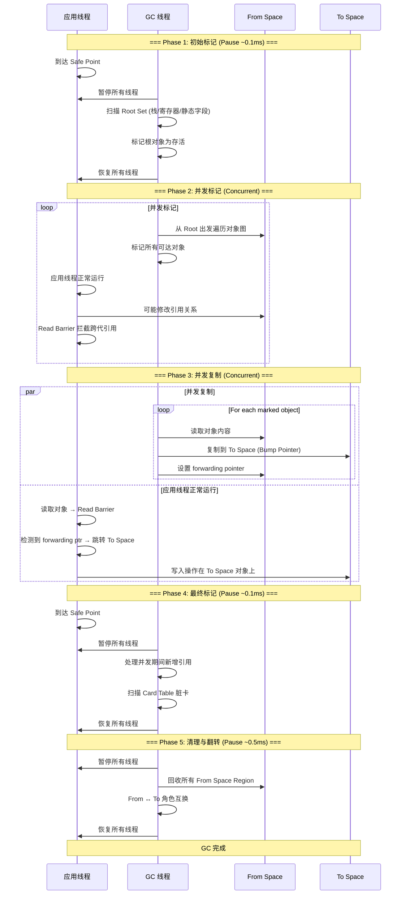
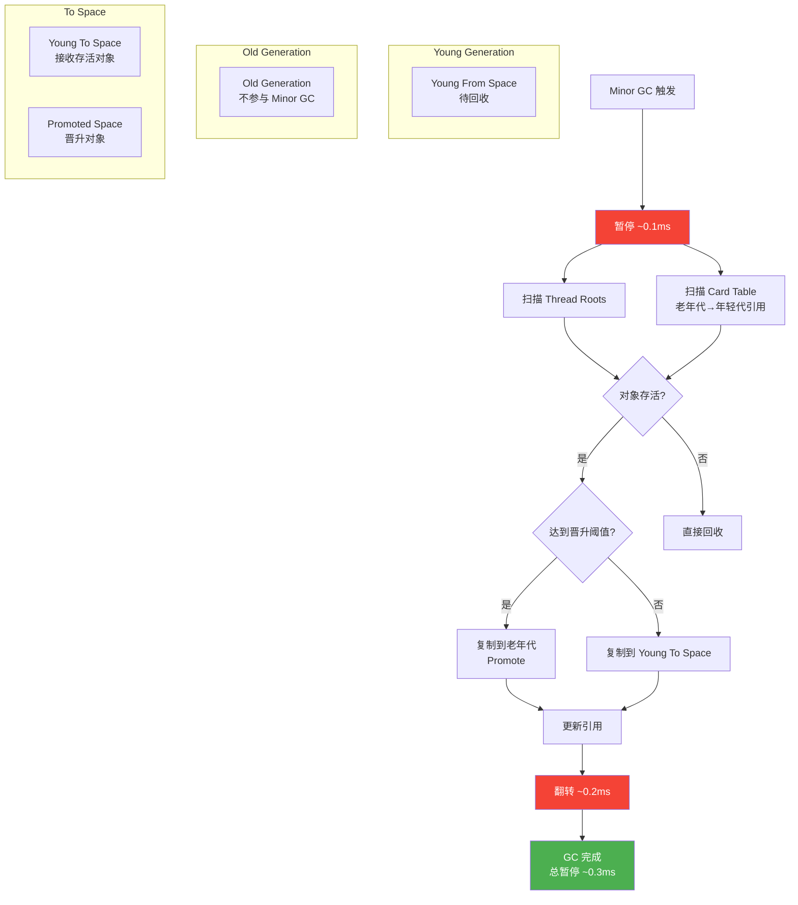

# ART 内存与 GC — 面试深度解析

---

## 一、面试高频五问：ART GC 全景

### Q1: ART 和 Dalvik 的核心差异是什么？（AOT vs JIT vs AOT+JIT 混合）

Dalvik 和 ART 是 Android 的两代运行时，其 GC 和编译策略是完全不同的技术路线。

| 维度 | Dalvik (Android 4.4-) | ART (Android 5.0-6.0) | ART (Android 7.0+) |
|------|----------------------|----------------------|---------------------|
| **编译方式** | JIT (即时编译) | AOT (安装时全量编译) | AOT + JIT 混合 |
| **GC 算法** | Mark-Sweep (并发/非并发) | Concurrent Copying (CC) | Concurrent Copying (CC) |
| **内存碎片** | 严重（无压缩） | 无碎片（复制即整理） | 无碎片 |
| **安装时间** | 快 | 慢（全量编译 oat） | 快（仅解释执行） |
| **启动速度** | 一般 | 快（oat 直接执行） | 首次一般，后续快 |
| **存储占用** | 小（dex） | 大（oat 可达 dex 2-3倍） | 中（profile 引导编译） |
| **暂停时间** | ~10-50ms | ~1-3ms (CC) | ~1-3ms (CC) |
| **内存占用** | 较小 | 较大（代码缓存） | 中（JIT code cache 可控） |

**AOT 编译 (Android 5.0-6.0)：**

```
APK 安装时
    │
    ▼
dex2oat ──► 将全部 dex 字节码编译为 oat (ELF格式的本地机器码)
    │
    ▼
应用启动时直接加载 oat 执行 ──► 无需解释器，无需 JIT 预热
```

优点：启动快、运行时性能稳定。缺点：安装慢（尤其大型应用）、oat 文件占用存储大、无运行时 profile 反馈优化。

**AOT + JIT 混合 (Android 7.0+)：**

```
首次安装:
  dex ──► 解释执行 (快安装，不编译)
             │
             ▼
         JIT 编译器 ──► 热点方法 → JIT Code Cache (内存中)
             │
             ▼
         JIT 收集 profile (方法调用频率、分支概率等)
             │
     ┌───────┴────────┐
     │  空闲 / 充电    │
     ▼                ▼
  dex2oat ──► 根据 profile 选择性 AOT 编译
  (只编译热点代码，非全量)
```

**关键：Profile-Guided Compilation (PGO)**

JIT 在运行时记录 profile 信息（哪个方法被频繁调用、哪个分支更常走），存储在 `/data/misc/profiles/` 下。空闲时 dex2oat 根据 profile 做 AOT 编译。这实现了"用多少编多少"的策略：冷代码解释执行不占空间，热代码编译为本地码获得峰值性能。

**面试深入：为什么 ART 不直接用 JVM 的 HotSpot C2/JIT 架构？**

1. **移动设备约束不同：** 移动端对存储空间和内存极度敏感。HotSpot C2 编译产物（编译后的 nmethod）体积很大，不适合存储受限的移动设备。ART 的 oat 经过裁剪优化。
2. **功耗考量：** C2 激进编译会消耗 CPU 和电量，Android 选择在设备空闲/充电时编译。
3. **启动时间：** JVM 的 C2 分层编译需要较长的预热时间，Android 应用生命周期短，用户频繁切换应用，无法容忍长预热。
4. **平台差异：** HotSpot 设计为服务端 JVM（长时间运行），ART 设计为客户端运行时（频繁启停）。
5. **GC 适配：** G1/ZGC 面向数十GB的服务端堆，Android 设备堆通常只有 128MB-512MB，CC GC 的轻量实现更适合。

---

### Q2: Concurrent Copying GC 的核心原理是什么？（Baker Read Barrier + From Space → To Space）

ART 的 Concurrent Copying (CC) GC 是 Android 8.0+ 的默认 GC，基于 **Baker 算法** 的并发复制回收器。

**核心思想：** 将堆分为两个等大的半区 — **From Space** 和 **To Space**。GC 时，应用线程可以与 GC 线程**并发运行**，GC 把存活对象从 From Space 复制到 To Space，应用线程通过 **Read Barrier（读屏障）** 保证始终访问到正确的对象。

**Baker Read Barrier 的核心机制：**

```
应用线程读取引用 obj.field:
    │
    ▼
  ┌──────────────────────────────┐
  │  读屏障拦截 (Read Barrier)    │
  │  检查对象是否在 From Space   │
  └──────────────┬───────────────┘
                 │
        ┌────────▼────────┐
        │ 对象已复制到     │──是──► 返回 To Space 中的新地址
        │ To Space?       │         (forwarding pointer)
        └────────┬────────┘
                 │否
                 ▼
           直接返回原对象引用
```

**From Space → To Space 复制过程：**

```
GC 周期:

Phase 1: 初始标记 (Pause, ~0.1ms)
  暂停所有线程 → 标记根对象 (Root Set: 栈、寄存器、静态字段)

Phase 2: 并发标记 (Concurrent)
  GC 线程与应用线程并发运行
  从根对象出发遍历对象图 → 标记所有存活对象

Phase 3: 并发复制 (Concurrent)
  GC 线程将标记的存活对象从 From Space 复制到 To Space
  应用线程继续运行，通过 Read Barrier 保证正确性

Phase 4: 并发清理 (Concurrent)
  回收 From Space → 准备作为下次 GC 的 To Space
  (实际上 From Space 的内存页直接回收)

Phase 5: 角色翻转 (Pause, ~0.5ms)
  From Space ↔ To Space 互换
```

**关键数据结构 — Forwarding Pointer（转发指针）：**

当一个对象从 From Space 复制到 To Space 后，在 From Space 的原对象位置安装一个 forwarding pointer 指向 To Space 中的新地址。后续任何访问都会通过 Read Barrier 检查到这个转发指针并跳转到新地址。

```
From Space:                          To Space:
┌─────────────────┐                 ┌─────────────────┐
│ Object A        │                 │                 │
│ (已复制)         │                 │  Object A'      │◄─────┐
│ forward_ptr ────┼────────────────►│  (新地址)        │      │
├─────────────────┤                 ├─────────────────┤      │
│ Object B        │                 │  Object B'      │      │
│ (已复制)         │                 │                 │      │
│ forward_ptr ────┼─────► ...       │                 │      │
└─────────────────┘                 └─────────────────┘      │
                                                              │
              应用线程读 Object A 的字段时:                    │
              Read Barrier 检测到 forward_ptr ─────────────────┘
              自动跳转到 To Space 的新地址
```

---

### Q3: ART 的 Region-based 内存管理是怎样的？（非分代 → Android 10+ 的分代 CC GC）

**Android 8.0-9.0：Region-based 非分代 CC GC**

ART 将堆划分为固定大小的 **region**（通常 256KB），每个 region 独立管理：

```
堆布局 (Region Space):
┌───┬───┬───┬───┬───┬───┬───┬───┬───┬───┐
│R0 │R1 │R2 │R3 │R4 │R5 │R6 │R7 │R8 │R9 │  ... (256KB each)
└───┴───┴───┴───┴───┴───┴───┴───┴───┴───┘
 │   │   │   │   │   │   │   │   │   │
 ▼   ▼   ▼   ▼   ▼   ▼   ▼   ▼   ▼   ▼
Free Used Used Free Free Used Free Used Free Free

Region 状态: kRegionStateAllocated (已分配)
             kRegionStateFree       (空闲)
             kRegionStateLarge      (大对象region)
```

与传统 JVM 的**分代模型**（新生代/Eden/s0/s1/老年代）不同，ART 早期（8.0-9.0）的 CC GC 是**非分代**的——所有对象在同一个 Region Space 中，每次 GC 都是 Full GC，扫描整个堆。但 CC GC 的 Read Barrier 让暂停时间极短（~1ms），即使全堆扫描也不会明显卡顿。

**Android 10+：分代 Concurrent Copying GC (Generational CC)**

Android 10 引入了分代 CC GC，核心改进：

```
堆布局 (Generational CC):
┌────────────────────────────────────────────────────┐
│              Young Generation (年轻代)               │
│  ┌──────┬──────┬──────┬──────┬──────┬──────┐       │
│  │ Y0   │ Y1   │ Y2   │ Y3   │ Y4   │ ...  │       │
│  └──────┴──────┴──────┴──────┴──────┴──────┘       │
│     年轻代 Region Pool (默认占堆的 5-15%)            │
├────────────────────────────────────────────────────┤
│              Old Generation (老年代)                 │
│  ┌──────┬──────┬──────┬──────┬──────┬──────┐       │
│  │ O0   │ O1   │ O2   │ O3   │ O4   │ ...  │       │
│  └──────┴──────┴──────┴──────┴──────┴──────┘       │
│     老年代 Region Pool                              │
└────────────────────────────────────────────────────┘
```

**Minor GC (Young GC)：**

只回收年轻代，不碰老年代。频率高但暂停极短（~0.2ms）。对象分配优先在年轻代，经过若干次 Minor GC 后仍存活的对象晋升 (Promote) 到老年代。

**Major GC (Full GC)：**

回收整个堆（年轻代 + 老年代）。触发条件：老年代空间不足、或应用进入后台触发 Trim。

**分代 CC 的关键机制 — Remembered Set (记忆集)：**

```
老年代对象引用年轻代对象时：
   ┌──────────┐        ┌──────────┐
   │ Old Obj  │───────►│ Young Obj│
   └────┬─────┘        └──────────┘
        │
        ▼ (写屏障记录)
   ┌──────────────┐
   │  Card Table  │  ← 标记老年代中哪些卡页引用了年轻代
   │  [dirty card]│
   └──────────────┘

Minor GC 时:
  只需扫描脏卡页中的老年代对象 + 年轻代所有对象
  无需扫描全部老年代
```

---

### Q4: GC 暂停时间如何控制？影响因素有哪些？

CC GC 设计上暂停时间极短，核心原理是 **将最耗时的工作并发化**。

**暂停的来源：**

| 阶段 | 是否暂停 | 典型耗时 | 说明 |
|------|---------|---------|------|
| 初始标记 (Initial Mark) | **是** | ~0.1-0.5ms | 扫描 Root Set，线程数×栈深度相关 |
| 并发标记 (Concurrent Mark) | 否 | 几十~几百ms | 与应用并发，不阻塞 |
| 并发复制 (Concurrent Copy) | 否 | 几十~几百ms | 与应用并发，不阻塞 |
| 卡片表扫描 (Card Table Scan) | **是** | ~0.1-0.3ms | 扫描脏卡确定跨代引用 |
| 最终标记 (Final Mark) | **是** | ~0.1ms | 处理并发标记漏掉的对象 |
| 翻转 (Flip) | **是** | ~0.5-2ms | From/To Space 互换 |

**CC GC 总暂停时间：通常 1-3ms**，远好于 Dalvik 的 10-50ms。

**影响暂停时间的因素：**

1. **Root Set 大小：** 线程数越多、调用栈越深，初始标记时需要扫描的根就越多。
2. **Card Table 脏卡数量：** 并发期间老年代对年轻代的引用越多，Final Mark 时需要处理的脏卡越多。
3. **大对象数量：** 如果存在频繁分配大对象（如大 Bitmap），可能触发大量 region 分配，影响 GC 频率。
4. **线程挂起时间 (Time To Safe Point)：** GC 需要所有线程到达安全点 (Safe Point) 才能开始暂停阶段。循环中的线程、Native 方法中的线程需要等待它们到达安全点。
5. **堆大小：** 虽然并发标记不暂停，但堆内存越大，GC 周期越长，内存压力越大时频率越高。

**面试技巧：** "CC GC 的暂停时间与堆大小**无关**，只与 Root Set 大小有关"——因为标记和复制都是并发的，暂停只发生在初始标记/最终标记阶段，这两个阶段只扫描 Root Set 而非整个堆。这也是 CC GC 比传统 Mark-Sweep-Compact 暂停低的核心原因。

---

### Q5: Android 为什么不直接用 JVM 的 G1/ZGC？

这是面试中考察"Android vs JVM 设计哲学"的高频追问。

**G1 (Garbage First) 不适合 Android 的理由：**

1. **设计目标不同：** G1 针对的是数十GB堆的服务端应用，追求可控暂停（默认 200ms）。Android 堆通常 128-512MB，200ms 暂停对移动端不可接受。
2. **Remembered Set 开销：** G1 的 RSet 占用内存较大（可达堆的 5%），在内存受限的移动设备上代价过高。
3. **Region 粒度：** G1 的 region 为 1-32MB，ART 为 256KB。大 region 导致内存碎片利用率低。
4. **复杂度：** G1 的 Mixed GC、SATB 快照等机制对移动场景过度设计。

**ZGC 不适合 Android 的理由：**

1. **指针染色 (Colored Pointers)：** ZGC 使用 64 位指针的高位存储 GC 状态（finalizable/remapped/marked0/marked1），这要求 64 位地址空间和虚拟地址重映射。Android 需要额外适配。
2. **堆大小要求：** ZGC 设计目标是亚毫秒级暂停处理 TB 级堆，在 128-512MB 的移动堆上，CC GC 已经能达到 ~1ms 暂停，没必要引入 ZGC 的复杂度。
3. **内存映射开销：** ZGC 使用多重映射（同一物理页映射到多个虚拟地址），增加 TLB 压力，在移动 ARM CPU 上 TLB 条目有限。
4. **功耗：** ZGC 的并发操作更多更频繁，对功耗敏感的移动设备不友好。

**ART CC GC 的优势：**

| 特性 | G1 | ZGC | ART CC GC |
|------|----|----|-----------|
| 暂停时间 | ~100-200ms | <1ms | ~1-3ms |
| 堆大小 | 4GB-64GB | 8GB-16TB | 128MB-512MB |
| 内存开销 | 5-10% | 较小 | 约 50% (半区复制) |
| 碎片 | 无 | 无 | 无 (复制=整理) |
| 复杂度 | 高 | 极高 | 中 |
| 移动端适配 | 无 | 无 | 原生 |

> **核心结论：** G1/ZGC "杀鸡用牛刀"——移动端不需要 TB 级堆支持，但需要极致的内存效率和功耗控制。CC GC 在 500MB 以下的堆上，用 "牺牲一半内存" 的代价换取 "~1ms 暂停" 和 "零碎片"，在移动端是最优解。

---

## 二～三、Baker Read Barrier 底层实现与 Region 状态机

### 2.1 Baker Read Barrier 的 ARM64 汇编实现

Read Barrier 是 CC GC 的灵魂——它必须在每条引用读取指令上生效，因此实现必须极致高效。ARM64 上的 Baker Read Barrier 通常只需 **3 条指令**：

```asm
// 假设 x0 = 待读取的对象引用 (ObjectRef)
// x1 = From Space 起始地址
// x2 = 对象头第一字段 (LockWord, 包含 forwarding status)

LDR   w3, [x0, #0]       // ① 加载对象头 (LockWord)
BIC   w3, w3, #0x1       // ② 清除最低位 (GC 标记位)
CBNZ  w3, .L_forwarded    // ③ 如果非零 → 跳转到转发处理
                          //    (w3 == 0 表示未转发，直接使用原引用)
```

**逐条解析：**

**① `LDR w3, [x0, #0]` — 加载对象头 LockWord**

ART 的对象头第一个 32-bit 字段是 LockWord（类似 HotSpot Mark Word 前 32 位）。CC GC 使用 LockWord 的最低 bit 作为 "已转发" 标记：
- bit[0] = 0 → 对象未被转发（在 From Space 或本身就是 To Space 的对象）
- bit[0] = 1 → 对象已被转发，LockWord 其余位存储 forwarding pointer

```
LockWord 布局 (32-bit, 转发态):
┌────────────────────────────┬───┐
│  Forwarding Pointer (31b)  │ 1 │  ← bit[0] = 1 表示已转发
└────────────────────────────┴───┘
```

**② `BIC w3, w3, #0x1` — 清除转发标记位**

```
BIC = Bit Clear
w3 = w3 & ~0x1  → 将 bit[0] 清零

结果:
  - 如果原 bit[0]=0 (未转发): w3 不变(即 0)
  - 如果原 bit[0]=1 (已转发): w3 = forwarding pointer（相对地址，非零）
```

**③ `CBNZ w3, .L_forwarded` — 判断并跳转**

```
CBNZ = Compare and Branch if Non-Zero
如果 w3 != 0 → 对象已转发，跳转到转发处理逻辑
如果 w3 == 0 → 对象未转发，继续使用原引用
```

**完整 Read Barrier 路径（ARM64）：**

```asm
// 场景：加载 obj.field 的值
// 输入: x0 = 对象的引用

baker_read_barrier:
    LDR     w4, [x0, #0]           // 读取 LockWord
    TST     w4, #0x1               // 测试 bit[0] (转发标记)
    B.EQ    .L_not_forwarded       // bit[0]=0 → 未转发，直接使用

.L_forwarded:
    AND     x0, x4, #0xFFFFFFFE    // 清除 bit[0]，得到 forwarding pointer
    // x0 现在指向 To Space 中的新对象地址

.L_not_forwarded:
    LDR     x5, [x0, #field_offset] // 加载字段值
    // 正常使用 x5
```

**性能考量：**

- Read Barrier 在每次引用读取时执行，因此必须极快——3-5 条指令，~2-3 个 CPU 周期。
- 在 ARM64 上，LDR + TST + B.cond 的组合可以完美利用 Pipeline，几乎无分支预测惩罚（未转发是常见路径）。
- 相比 Dalvik 的 GC（需要 STW 暂停所有线程），Read Barrier 的开销分摊到了每次对象访问，以"微小且均匀"的代价换取了"几乎无暂停"。

---

### 2.2 CC GC 的 Region 状态机

ART 的 Region Space 中每个 region 在 GC 周期内经历多个状态转移：

```
Region 状态机:

              创建
               │
               ▼
    ┌──────────────────┐
    │  kRegionStateFree │ ◄──────── 初始状态
    └────────┬─────────┘
             │ 分配对象
             ▼
    ┌──────────────────────┐
    │ kRegionStateAllocated │ ◄──── GC 标记后确认存活
    └──────────┬───────────┘
               │ GC 开始
               ▼
    ┌─────────────────────────┐
    │ kRegionStateMarking     │ ◄── 并发标记阶段
    └──────────┬──────────────┘
               │ 确认存活对象
               ▼
    ┌──────────────────────────────┐
    │ kRegionStateToBeCopied       │ ◄── 等待复制
    └──────────┬───────────────────┘
               │ GC 线程复制
               ▼
    ┌──────────────────────────────┐
    │ kRegionStateCopying          │ ◄── 并发复制中
    └──────────┬───────────────────┘
               │ 复制完成
               ▼
    ┌──────────────────────────────┐
    │ kRegionStateToBeReclaimed    │ ◄── 等待回收
    └──────────┬───────────────────┘
               │ Flip (From→To互换)
               ▼
    ┌──────────────────┐
    │  kRegionStateFree │ ◄── 回收完成，回到初始
    └──────────────────┘
```

**特殊状态：**

| 状态 | 说明 |
|------|------|
| `kRegionStateLarge` | 大对象专用 region（对象 ≥ 3/4 region 大小），不走常规分配路径 |
| `kRegionStateLargeMarking` | 大对象 region 在标记阶段的状态 |
| `kRegionStateNonMoving` | 不可移动 region（如 Class 对象、Method 对象等运行时内部结构） |

**并发复制期间的状态变化：**

```
From Space Region (正在被 GC 复制):
  ┌──────────────────────────────────┐
  │ ObjA │ ObjB │ ObjC │ ...        │  ObjA,B,C 正在被复制到 To Space
  │  ✓    │  ✓   │      │            │  ✓ = 已复制，含 forwarding ptr
  └──────────────────────────────────┘

To Space Region (接收复制对象):
  ┌──────────────────────────────────┐
  │ ObjA' │ ObjB' │ ... │  top →   │  Bump Pointer 连续分配
  └──────────────────────────────────┘
```

---

### 2.3 分代 CC 的 Young Generation 与 Minor GC

**年轻代 Region 的分配策略：**

```
年轻代分配路径:
  Thread Local Allocation Buffer (TLAB) → 每个线程有独立的 Bump Pointer
    │
    │ TLAB 用尽
    ▼
  Young Region 直接分配 → Bump Pointer 无需锁 (Region 级 TLAB)
    │
    │ 对象太大
    ▼
  Large Object Region → 专用大对象空间

晋升 (Promotion) 策略:
  对象在 Minor GC 中存活次数 ≥ threshold → 晋升到老年代
  默认 threshold = 1（即第二次 Minor GC 后晋升）
```

**Minor GC 流程：**

```
1. 暂停 (Pause, ~0.1ms)
   ├── 扫描 Thread Roots (各线程栈中的引用)
   ├── 扫描 Card Table 脏卡 (老年代→年轻代的引用)
   └── 确定年轻代存活对象集合

2. 并发复制 (Concurrent)
   ├── 将存活对象从 Young From → Young To
   ├── 达到晋升阈值的 → Old Generation
   └── Read Barrier 保证应用线程正确性

3. 清理 (Cleanup)
   ├── 回收 Young From Space 的 region
   └── Young To Space 变为新的 Young From（或继续使用）

4. 翻转 (Flip, ~0.2ms)
   └── 角色互换
```

**分代 CC 与全堆 CC 的对比：**

| 维度 | 全堆 CC (8.0-9.0) | 分代 CC (10+) |
|------|-------------------|---------------|
| GC 频率 | 低 (内存用满才触发) | 低 + 高 (Major + Minor) |
| 单次扫描量 | 全堆 | Minor: 仅年轻代; Major: 全堆 |
| 暂停时间 | ~1-3ms | Minor: ~0.2ms; Major: ~1-3ms |
| 总吞吐量 | 中等 | 高（短命对象快速回收） |
| 内存效率 | 高(无额外结构) | 中(需 Card Table) |
| 碎片 | 无 | 无 |

---

## 四、CC GC 并发标记与并发复制流程图

### 4.1 CC GC 完整周期流程图



### 4.2 Read Barrier 触发流程 (对象读取路径)

```mermaid
flowchart TD
    A[应用线程读取 obj.field] --> B{对象在 From Space?}
    B -->|否| C[直接读取 field<br/>最快路径: 2-3 CPU周期]
    B -->|是| D[执行 Baker Read Barrier]
    D --> E{LDR LockWord<br/>bit[0] == 1?}
    E -->|否: 未转发| F[原子自转发<br/>CAS 设置 forwarding ptr]
    E -->|是: 已转发| G[读取 forwarding ptr<br/>跳转到 To Space 新地址]
    F --> H[返回 To Space 对象引用]
    G --> H
    H --> I[从 To Space 读取 field]
    C --> J[返回 field 值]

    style C fill:#4CAF50,color:#fff
    style J fill:#4CAF50,color:#fff
    style D fill:#FF9800,color:#fff
    style F fill:#FF9800,color:#fff
```

### 4.3 分代 CC Minor GC 流程图



---

## 五、ART GC 源码级解析

### 5.1 `gc_plan` — GC 计划与触发决策

ART 中的 GC 触发策略定义在 `runtime/gc/gc_cause.h`，核心逻辑在 `Heap::CollectGarbageInternal()`：

```cpp
// art/runtime/gc/heap.cc (简化)

// GC 触发原因枚举
enum GcCause {
    kGcCauseForAlloc,      // 分配失败触发
    kGcCauseBackground,    // 后台触发 (应用进入后台)
    kGcCauseExplicit,      // 显式调用 System.gc()
    kGcCauseForNativeAlloc,// Native 分配触发
    kGcCauseCollectorTransition, // 收集器切换
    kGcCauseDisableMovingGc,     // 禁用移动 GC
    kGcCauseTrim,          // 内存裁剪 (onTrimMemory)
    kGcCauseHomogeneousSpaceCompact, // 同构空间压缩
};

// GC 计划决策核心函数
void Heap::CollectGarbageInternal(collector::GcType gc_type,
                                   GcCause gc_cause,
                                   bool clear_soft_references) {
    // 1. 检查是否正在 GC
    if (gc_plan_.IsRunning()) {
        LOG(INFO) << "GC already in progress, waiting...";
        gc_plan_.WaitForCompletion();
        return;
    }

    // 2. 根据 gc_cause 决定 GC 类型
    collector::GcType actual_type = gc_type;
    if (gc_cause == kGcCauseForAlloc) {
        // 分配失败 → 尝试快速回收年轻代
        actual_type = collector::kGcTypeSticky; // Minor GC
    }

    // 3. 选择收集器
    if (IsGenerational() && actual_type == collector::kGcTypeSticky) {
        // 分代模式：Minor GC (仅年轻代)
        collector_ = generational_collector_.get();
    } else {
        // Full GC (全堆)
        collector_ = full_collector_.get();
    }

    // 4. 执行 GC
    collector_->Run(gc_cause, clear_soft_references);

    // 5. GC 完成后检查内存状态
    if (GetFreeMemory() < min_free_) {
        // 内存仍然不足 → 尝试更激进的 GC
        CollectGarbageInternal(collector::kGcTypeFull,
                               kGcCauseForAlloc,
                               /*clear_soft_references=*/true);
    }
}
```

**GC 触发阈值 (gc_plan 的核心参数)：**

```cpp
// art/runtime/gc/heap.h
struct GcPlan {
    // 触发 GC 的各项阈值
    size_t target_footprint;    // 目标堆占用 (GC 后的期望值)
    size_t min_free;            // 最小空闲空间
    size_t max_free;            // 最大空闲空间
    size_t target_utilization;  // 目标利用率 (默认 0.5)

    // 分代 GC 参数
    size_t young_generation_size;    // 年轻代大小
    size_t promotion_threshold;      // 晋升阈值 (GC 次数)
    size_t minor_gc_trigger;         // 触发 Minor GC 的年轻代占用

    // 自适应调整
    double gc_throughput_goal;       // GC 吞吐量目标 (默认 0.99)
    size_t max_pause_ns;             // 最大暂停时间 (默认 5ms)
};
```

### 5.2 `CollectorTransition` — 收集器切换机制

ART 支持在运行时动态切换 GC 策略，`CollectorTransition` 是切换的核心：

```cpp
// art/runtime/gc/collector_transition.h

class CollectorTransition {
 public:
    // 收集器类型
    enum CollectorType {
        kCollectorTypeCC,              // Concurrent Copying (默认)
        kCollectorTypeCCBackground,    // 后台 CC (更保守)
        kCollectorTypeCMC,             // Concurrent Mark-Compact (备用)
        kCollectorTypeSS,              // Semi-Space (Foremem 情况)
        kCollectorTypeMS,              // Mark-Sweep (极端 OOM)
    };

    // 触发切换的条件
    struct TransitionCondition {
        bool low_memory_mode;          // 设备低内存模式
        bool background_mode;          // 应用在后台
        bool foreground_mode;          // 应用在前台
        bool oom_risk;                 // OOM 风险 (分配失败)
        bool space_pressure;           // 空间压力 (堆利用率 > 阈值)
        bool explicit_gc;              // 显式 GC
    };

    // 核心切换逻辑
    CollectorType SelectCollector(const TransitionCondition& cond) {
        if (cond.oom_risk) {
            // OOM 风险 → 最激进回收
            return kCollectorTypeCMC;  // 停止移动，全力回收
        }

        if (cond.low_memory_mode || cond.background_mode) {
            // 低内存/后台 → 保守模式
            return kCollectorTypeCCBackground;
        }

        if (cond.space_pressure && GetFreeMemory() < critical_threshold_) {
            // 空间压力大 → 压缩
            return kCollectorTypeCMC;
        }

        // 默认：前台标准 CC
        return kCollectorTypeCC;
    }

    // 执行收集器切换
    void TransitionTo(CollectorType new_type) {
        if (current_type_ == new_type) return;

        LOG(INFO) << "GC Transition: "
                  << CollectorTypeToString(current_type_)
                  << " → " << CollectorTypeToString(new_type);

        // 1. 停止当前收集器
        current_collector_->Stop();

        // 2. 初始化新收集器
        InitializeCollector(new_type);

        // 3. 迁移 Retained 对象
        MigrateRetainedObjects();

        // 4. 启动新收集器
        current_collector_->Start();

        current_type_ = new_type;
    }

 private:
    CollectorType current_type_ = kCollectorTypeCC;
    std::unique_ptr<GarbageCollector> current_collector_;
    size_t critical_threshold_;  // 临界阈值 (默认 ~16MB)
};
```

**收集器切换场景：**

| 场景 | 触发条件 | 切换方向 | 影响 |
|------|---------|---------|------|
| 应用进入后台 | onTrimMemory(TRIM_MEMORY_UI_HIDDEN) | CC → CCBackground | 降低 GC 频率，省电 |
| OOM 分配失败 | 连续分配失败 3 次 | CC → CMC | 暂停移动，全力回收 |
| 应用回到前台 | 用户切回应用 | CCBackground → CC | 恢复正常回收频率 |
| 长时间空闲 | 无 GC 触发超过 30s | CC → CC (idle compact) | 整理堆碎片 |
| 显式 System.gc() | 开发者调用 | 保持 CC | 执行一次 Full GC |

---

## 六、通过 GC 日志分析内存问题

### 6.1 启用 GC 日志

**Android 9.0+：**

```bash
# 查看所有 GC 日志
adb logcat -s art:V

# 仅 GC 相关
adb logcat | grep -E "GC_|gc_|collector"

# 详细 GC 日志 (需 root/debuggable)
adb shell setprop dalvik.vm.extra-opts -verbose:gc
```

**Android Studio Profiler：**

在 Memory Profiler 中可以直接看到 GC 事件时间线，每个 GC 事件的类型、耗时和回收量。

### 6.2 GC 日志格式解析

**典型 CC GC 日志：**

```
I/art: Explicit concurrent copying GC freed 1247(64KB) AllocSpace objects,
       4(128KB) LOS objects, 49% free, 23MB/45MB, paused 1.234ms
       total 45.678ms
```

**逐字段解析：**

```
Explicit concurrent copying GC    ← GC 类型
  freed                          ← 操作
  1247(64KB) AllocSpace objects  ← 释放对象数量 + 大小
  4(128KB) LOS objects           ← 大对象 (Large Object Space)
  49% free                       ← GC 后空闲比例
  23MB/45MB                      ← 当前占用 / 堆总大小
  paused 1.234ms                 ← 暂停时间 (应用卡顿时间)
  total 45.678ms                 ← GC 总时间 (含并发部分)
```

**Minor GC 日志（分代模式）：**

```
I/art: Background young concurrent copying GC freed 28316(1396KB)
       AllocSpace objects, 1(32KB) LOS objects, 78% free,
       12MB/56MB, paused 217us total 38.921ms
```

关键差异：`young` 表示仅回收年轻代，`paused 217us` (微秒级！) 表明暂停极短。

### 6.3 GC 日志分析实战

**问题 1：频繁 GC（GC Storm）**

```
日志特征: 每秒多次 GC，每次回收量很小

I/art: GC freed 5(320B) ... paused 0.8ms total 12ms
I/art: GC freed 8(512B) ... paused 0.7ms total 14ms   ← 间隔 < 1s
I/art: GC freed 3(192B) ... paused 0.9ms total 11ms

诊断: 堆空间不足，刚 GC 完又被迅速填满
根因:
  1. 短命大对象频繁创建 (如频繁 new Bitmap)
  2. 堆大小配置过小 (largeHeap=false 但实际需要)
  3. 内存泄漏导致可用空间持续减少
```

**问题 2：长时间暂停 (Long Pause)**

```
日志特征: paused 时间远超正常 (1-3ms)

I/art: GC paused 15.234ms total 89.123ms  ← 异常！

诊断: paused 过长通常意味着:
  1. 线程无法快速到达 Safe Point (循环中)
  2. Card Table 脏卡过多 (大量跨代引用)
  3. Thread Roots 过多 (RxJava/协程大量挂起线程)
```

**问题 3：Growing Heap (堆持续增长)**

```
日志特征: GC 后堆占用持续上升

GC#1: 45MB/64MB  (70%)
GC#2: 52MB/72MB  (72%)  ← 堆扩容了，占用也在涨
GC#3: 58MB/80MB  (72%)
GC#4: 63MB/96MB  (65%)

诊断: 内存泄漏或 Bump Pointer 分配导致的堆膨胀
根因: Activity/Fragment 泄漏、静态引用、单例持有 Context
```

### 6.4 GC 日志分析 Checklist

| 日志指标 | 正常值 | 异常值 | 排查方向 |
|---------|--------|--------|---------|
| `freed` | 占比 20-50% | <5% 或 >80% | <5%: 泄漏; >80%: 堆太小 |
| `% free` | 40-70% | <10% 或 >90% | <10%: 即将 OOM |
| `paused` | 1-3ms | >10ms | Safe Point 延迟 |
| `total` | 20-100ms | >500ms | 堆过大或线程竞争 |
| GC 间隔 | >5s | <1s | GC Storm，泄漏或堆小 |
| 堆增长趋势 | 持平 | 持续增长 | 内存泄漏 |

### 6.5 进阶：Perfetto 追踪 GC 行为

```bash
# 录制 GC 相关的 trace
adb shell perfetto \
  -c - --txt \
  -o /data/misc/perfetto-traces/trace \
  <<EOF
buffers: {
    size_kb: 65536
}
data_sources: {
    config {
        name: "android.gc"
    }
}
duration_ms: 10000
EOF

adb pull /data/misc/perfetto-traces/trace
```

在 Perfetto UI (https://ui.perfetto.dev) 中打开 trace 文件，可以看到：
- 每个 GC 周期的精确时间线
- 各阶段耗时 (Pause / Concurrent Mark / Concurrent Copy)
- 堆内存占用变化曲线
- 与帧率、CPU 调度的关联关系

这是面试中展示"工程深度"的加分项——不只是看 logcat，而是用系统级 Tracing 工具做根因分析。

---

## 附录：面试速记表

| 对比维度 | Dalvik | ART (8.0-9.0) | ART (10+) |
|---------|--------|---------------|-----------|
| GC 算法 | Mark-Sweep | Concurrent Copying (CC) | Generational CC |
| 暂停时间 | 10-50ms | 1-3ms | 0.2-3ms |
| 碎片 | 有 | 无 | 无 |
| 内存开销 | 低 | 50% (半区) | 50% + Card Table |
| 分代 | 无 | 无 | Young/Old |
| Read Barrier | 无 | Baker Barrier | Baker Barrier |
| Write Barrier | 有(卡表) | 无 | 有(Card Table脏卡标记) |

> **一句话总结：** CC GC 用"50% 内存换 1ms 暂停"，是移动端 GC 的最优解；Android 10+ 通过分代优化进一步提升了吞吐量，Minor GC 暂停仅约 0.2ms。
