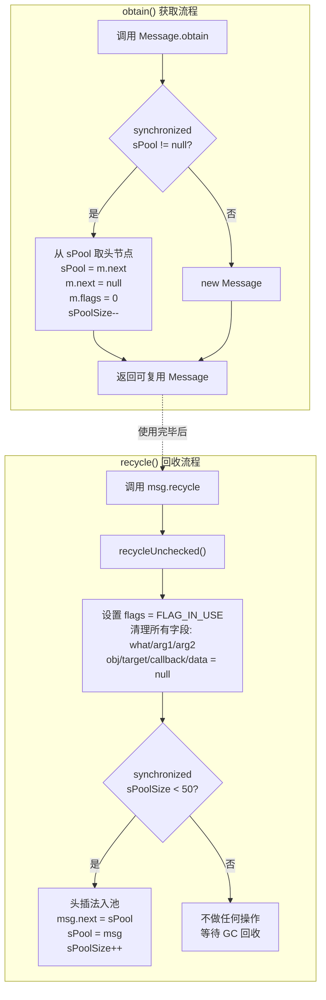
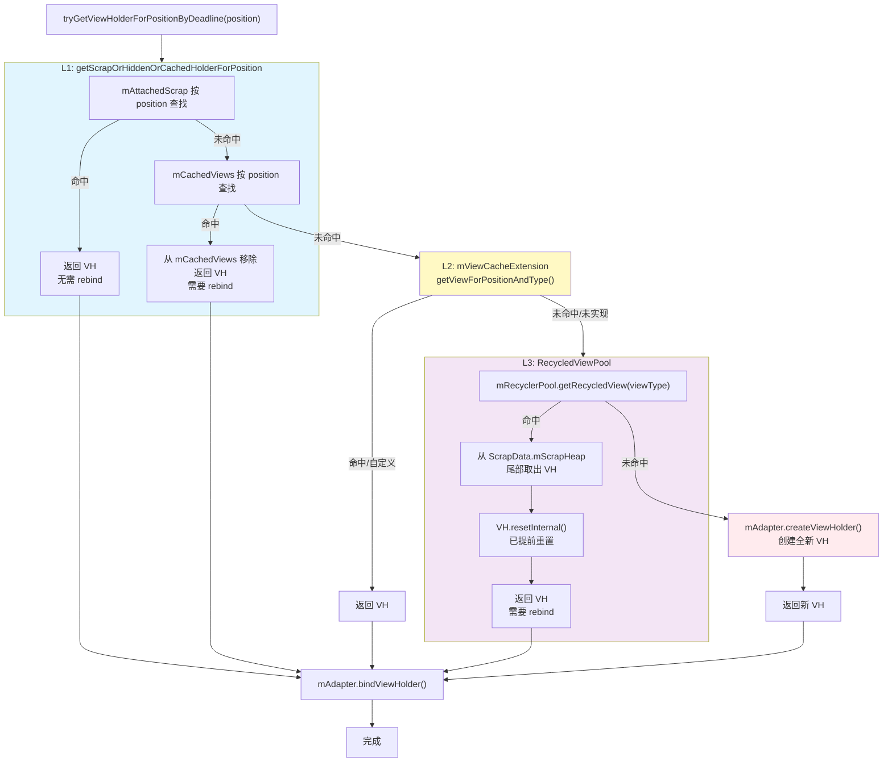

# 01 对象复用与池化

## 目录

- [第一层：面试高频五问](#第一层面试高频五问)
  - [Q1：Message.obtain() 的池化机制是怎样的？sPool 为什么用单链表？](#q1messageobtain-的池化机制是怎样的spool-为什么用单链表)
  - [Q2：RecyclerView 的四级 ViewHolder 缓存体系是什么？](#q2recyclerview-的四级-viewholder-缓存体系是什么)
  - [Q3：Glide 的 BitmapPool 是怎样复用 Bitmap 的？](#q3glide-的-bitmappool-是怎样复用-bitmap-的)
  - [Q4：如何设计一个通用对象池？Acquire/Release 模式如何实现？](#q4如何设计一个通用对象池acquirerelease-模式如何实现)
  - [Q5：自动装箱为什么是性能杀手？Integer/Long 的缓存范围是多少？](#q5自动装箱为什么是性能杀手integerlong-的缓存范围是多少)
  - [Q6：对象池的内存泄漏和线程安全如何处理？](#q6对象池的内存泄漏和线程安全如何处理)
- [第二层：数据结构与存储](#第二层数据结构与存储)
  - [Message 池化的 synchronized + sPool 单链表](#message-池化的-synchronized--spool-单链表)
  - [RecyclerView 的 mCachedViews 与 mRecyclerPool](#recyclerview-的-mcachedviews-与-mrecyclerpool)
- [第三层：深入原理](#第三层深入原理)
- [第四层：流程可视化（Mermaid）](#第四层流程可视化mermaid)
- [第五层：源码深度剖析](#第五层源码深度剖析)
- [第六层：手写实战——自定义通用对象池](#第六层手写实战自定义通用对象池)
- [补充：Glide BitmapPool 源码简析](#补充glide-bitmappool-源码简析)
- [总结](#总结)

---

## 第一层：面试高频五问

### Q1：Message.obtain() 的池化机制是怎样的？sPool 为什么用单链表？

**标准回答：**

Android 的 `Message` 类内部维护了一个**全局静态对象池**，核心是一个单链表 + 锁的轻量级设计：

- **sPool**：`private static Message sPool` —— 静态头节点，指向池中第一个可复用 Message 对象
- **next**：`Message` 本身就持有 `Message next` 字段，复用时直接串成链表，**不需要额外的包装容器**
- **MAX_POOL_SIZE = 50**：硬上限，超过则不再回收，让 GC 释放
- **sPoolSize**：当前池中的 Message 数量
- **synchronized**：obtain() 和 recycle() 都用 `synchronized (sPoolSync)` 保证线程安全，锁粒度是 `Object sPoolSync = new Object()` 而非 Message.class

**调用链路：**

```
Handler.obtainMessage() → Message.obtain(handler) → Message.obtain()
  └─ synchronized(sPoolSync) {
       if (sPool != null) {
         Message m = sPool;
         sPool = m.next;      // 头节点出队
         m.next = null;
         m.flags = 0;         // 清除 FLAG_IN_USE
         sPoolSize--;
         return m;
       }
     }
     return new Message();    // 池空，新建
```

**为什么用单链表而不是队列/数组？**

1. **零额外内存开销**：`next` 字段是 Message 本身就有的（异步消息链表也要用），池化复用不增加任何字段
2. **O(1) 入队/出队**：头插法入队（recycle 时 `m.next = sPool; sPool = m`），头取法出队，无需遍历
3. **无容量扩展成本**：数组需要拷贝，单链表天然动态
4. **线程安全极其轻量**：一个 `synchronized` 块覆盖 `if-null-return` 三个操作，锁竞争极小

---

### Q2：RecyclerView 的四级 ViewHolder 缓存体系是什么？

**标准回答：**

RecyclerView 内部通过 `Recycler` 内部类管理四级 ViewHolder 缓存，按优先级从高到低：

| 级别 | 名称 | 数据结构 | 容量 | 特征 |
|:---:|------|---------|:---:|------|
| L1 | **mAttachedScrap** | `ArrayList<ViewHolder>` | 无上限 | 未与 RecyclerView 分离的 VH，直接复用无需 rebind |
| L2 | **mCachedViews** | `ArrayList<ViewHolder>` | 默认 **2** | 已分离但保留状态的 VH，position/viewType 匹配则直接复用 |
| L3 | **mViewCacheExtension** | 开发者自定义 | — | 扩展点，通常不实现，留给业务定制 |
| L4 | **mRecyclerPool** | `SparseArray<ArrayList<ViewHolder>>` | 默认每种 viewType **5** 个 | 跨 Adapter 共享，需要 rebind，按 viewType 分组 |

**命中流程（简要）：**

```
tryGetViewHolderForPositionByDeadline(position)
  ├─ L1: getScrapOrHiddenOrCachedHolderForPosition()
  │   ├─ mAttachedScrap (按 position/id 查找)
  │   └─ mCachedViews (按 position 查找) → 命中则 remove + return
  ├─ L2: mViewCacheExtension.getViewForPositionAndType() → 开发者扩展
  └─ L3: getRecycledViewPool().getRecycledView(viewType)
      └─ 按 viewType 取 Scrap 列表 → 命中则 remove + return
      → 全部未命中 → mAdapter.createViewHolder()
```

**关键面试追问**：为什么 `mCachedViews` 默认只有 2 个？

答：二级缓存保留的是"离屏但 state 未重置"的 VH，太多会导致内存浪费。正常滑动场景下，即将重新进入屏幕的也就 1~2 个。真正的大批量回环复用靠 L4 的 RecycledPool（默认每种类型存 5 个），后者会重置 VH 内部状态，干净、安全、重用率高。

**重要细节**：`mCachedViews` 是**先入先出（FIFO）**，满了会把最老的那个降级到 `mRecyclerPool` 中：

```java
// RecyclerView.Recycler 简化逻辑
void recycleCachedViewAt(int index) {
    ViewHolder holder = mCachedViews.get(index);
    addViewHolderToRecycledViewPool(holder, true); // 降级到 L4
    mCachedViews.remove(index);
}
```

---

### Q3：Glide 的 BitmapPool 是怎样复用 Bitmap 的？

**核心机制：**

Glide 的 Bitmap 复用不是简单的对象池，而是**基于尺寸匹配的内存复用池**：

1. **LruPoolStrategy**：接口，定义了 put/get/remove 策略，默认实现是 **SizeConfigStrategy**（4.0+ 替代了 LruBitmapPool 的 AttributeStrategy）
2. **SizeConfigStrategy**：按 `size × config` 分组，内部维护 `GroupedLinkedMap<Key, Bitmap>`，Key = `(bitmapSize, Bitmap.Config)`，使用 LRU 淘汰
3. **API 层面的配合**：调用 `BitmapFactory.Options.inBitmap` 指向池中的 Bitmap，解码器直接复用其像素内存，**省去 malloc + memcpy**
4. **内存上限**：由 `MemorySizeCalculator` 动态计算（屏幕尺寸 × 4 字节/像素 × 缓存系数），写入 `maxSize`

**Bitmap.Config 的匹配严格性：**

- `inBitmap` 要求复用的 Bitmap 必须是 **mutable** 的（Glide 池中全是 mutable）
- 4.4 之前：`inBitmap` 的宽高必须 ≥ 新图宽高，且像素格式（Config）必须一致
- 4.4+：放宽为 `inBitmap` 的 `allocated byte count ≥` 新图需求即可

**面试追问**：为什么不直接用 `HashMap<Size, Bitmap>`？

答：Bitmap 的尺寸组合非常多（宽×高×Config），HashMap 精确匹配命中率极低。`SizeConfigStrategy` 做的是**向上取整匹配**——例如请求 250×250 ARGB_8888，可以复用池中 256×256 ARGB_8888 的 Bitmap，通过 `inBitmap` 让解码器直接复用像素缓冲区，多余空间自然截断。

---

### Q4：如何设计一个通用对象池？Acquire/Release 模式如何实现？

**核心模式：**

```
┌─────────────┐     acquire()     ┌─────────────────┐
│   Client    │ ───────────────►  │  ObjectPool<T>   │
│             │ ◄───────────────  │                  │
└─────────────┘     返回 T        │  idleObjects      │
       │                          │  activeObjects    │
       │ release(obj)             └───────────────────┘
       └────────────────►  回收对象到 idle 队列
```

**Apache Commons Pool2 的 GenericObjectPool 是经典参考**，其核心接口：

- `PooledObjectFactory<T>`：工厂方法，负责 `makeObject()`（创建）、`activateObject()`（激活）、`passivateObject()`（钝化）、`destroyObject()`（销毁）、`validateObject()`（校验）
- `borrowObject()`：Acquire，从 idle 队列取；空则调用 factory.makeObject()
- `returnObject()`：Release，归还到 idle 队列；满则 destroy
- **驱逐策略**：后台线程定期检查 idle 对象是否超时、是否有效

**设计要点：**

1. **容量控制**：maxIdle（最大闲置数）、maxTotal（最大总对象数），防止内存爆炸
2. **生命周期钩子**：acquire 时 reset/activate，release 时 clear/passivate，确保对象是干净的
3. **健康检查**：`testOnBorrow` / `testOnReturn` / `testWhileIdle`，避免返回已损坏对象
4. **超时等待**：`borrowObject(timeout)`，当池空且已达 maxTotal 时阻塞等待归还

---

### Q5：自动装箱为什么是性能杀手？Integer/Long 的缓存范围是多少？

**本质问题**：自动装箱（Autoboxing）会在编译期插入 `Integer.valueOf(int)` 调用，频繁触发对象分配 → GC 压力 → 内存抖动。

**一段代码说清楚：**

```java
// 这段代码在循环中产生了 10000 个 Integer 对象
Integer sum = 0;  // 装箱：Integer.valueOf(0)
for (int i = 0; i < 10000; i++) {
    sum += i;     // 每次循环：拆箱 sum.intValue() + 装箱 Integer.valueOf(newSum)
}
// 改为 int sum = 0 就完全不存在分配
```

**Integer 缓存（IntegerCache）：**

- 范围：**-128 ~ 127**（JLS 规定至少这个范围，可通过 `-XX:AutoBoxCacheMax` 调整上限）
- `Integer.valueOf(int)` 在此范围内直接返回缓存数组中的实例，**不 new**
- 超出范围才 `new Integer(i)`

**Long 缓存：**

- 范围同样是 **-128 ~ 127**
- Short 也是，Byte 全范围缓存（-128~127 就是全部）

**高频陷阱：**

```java
Integer a = 100, b = 100;   // a == b → true（缓存命中）
Integer c = 200, d = 200;   // c == d → false（超出缓存，两个不同对象）
```

**性能影响量化：** HashMap<Integer, ...> 中 key 的装箱在高频场景下是显著的——应优先用 `SparseArray` / `SparseIntArray` 替代 `Map<Integer, ...>`，这是 Android Lint 频繁提示 `UseSparseArrays` 的原因。

---

### Q6：对象池的内存泄漏和线程安全如何处理？

**内存泄漏场景：**

1. **获取后未归还**：最常见，borrow 后忘记 release，对象永远漂在池外。解决：try-finally 保证归还，或引入租约（Lease）模式——租约到期未还则强制回收并告警
2. **对象内部持有外部引用**：复用的对象持有 Activity/View 引用 → Activity 泄漏。解决：release 时 `resetState()` / `clear()` 清理所有引用
3. **池自身被静态持有**：池中缓存了大量对象，GC Root 可达。解决：设置 maxIdle 上限 + 空闲超时驱逐

**线程安全方案：**

| 方案 | 适用场景 | 代价 |
|------|---------|------|
| `synchronized` 方法 | Message 池化，轻量 | 竞争激烈时退化 |
| `ConcurrentLinkedQueue` | 高并发 borrow/return | 无界队列，需额外限流 |
| `ArrayBlockingQueue` | 固定容量 + 公平等待 | 有界，阻塞合理 |
| 无锁 CAS + ConcurrentStack | 极高性能要求 | 实现复杂，不易调试 |

**最佳实践**：大多数场景 `ConcurrentLinkedQueue` + `Semaphore` 限流就足够。

---

## 第二层：数据结构与存储

### Message 池化的 synchronized + sPool 单链表

**数据结构全景：**

```java
public final class Message implements Parcelable {
    // === 池化相关静态字段 ===
    private static Message sPool;               // 单链表头节点
    private static int sPoolSize = 0;           // 当前池大小
    private static final int MAX_POOL_SIZE = 50; // 硬上限
    private static final Object sPoolSync = new Object(); // 专用锁对象

    // === 实例字段 ===
    public int what, arg1, arg2;
    public Object obj;
    /*package*/ long when;
    /*package*/ Bundle data;
    /*package*/ Handler target;
    /*package*/ Runnable callback;
    /*package*/ Message next;   // 链表指针：既用于 MessageQueue 的异步消息链表，
                                // 也用于 sPool 对象池链表（互斥使用）
    /*package*/ int flags;      // FLAG_IN_USE(1) / FLAG_ASYNCHRONOUS(2)
}
```

**入池（recycle）的核心逻辑：**

```java
public void recycle() {
    if (isInUse()) {                   // flags & FLAG_IN_USE) != 0
        if (gCheckRecycle) {
            throw new IllegalStateException("This message cannot be recycled because it is still in use.");
        }
        return;
    }
    recycleUnchecked();
}

void recycleUnchecked() {
    flags = FLAG_IN_USE;               // 1. 标记为使用中(防重入)
    what = 0; arg1 = 0; arg2 = 0;      // 2. 清理数据
    obj = null; replyTo = null;
    sendingUid = UID_NONE;
    workSourceUid = UID_NONE;
    when = 0;
    target = null;
    callback = null;
    data = null;

    synchronized (sPoolSync) {         // 3. 入池(头插法)
        if (sPoolSize < MAX_POOL_SIZE) {
            next = sPool;              // 新节点.next = 旧头
            sPool = this;              // 新头 = 当前
            sPoolSize++;
        }
    }
}
```

**关键设计点：**

1. **入池前先 `flags = FLAG_IN_USE`**：防止 recycle 后又被误用（如 sendMessage 检测到 FLAG_IN_USE 会抛异常）
2. **所有引用型字段全部置 null**：`target = null` 切断 Handler 引用，`callback = null` 切断 Runnable，`data = null` 切断 Bundle，彻底释放 GC Root
3. **头插法**：`next = sPool; sPool = this` —— 不需要遍历链表尾部，O(1) 完成

---

### RecyclerView 的 mCachedViews 与 mRecyclerPool

**mCachedViews（二级缓存）的存储：**

```java
public final class Recycler {
    // 二级缓存：保留 ViewHolder 的完整状态（position、itemId、payload 等）
    final ArrayList<ViewHolder> mCachedViews = new ArrayList<>();
    int mViewCacheMax = DEFAULT_CACHE_SIZE;  // 默认 2

    // 可自定义大小
    public void setViewCacheSize(int viewCount) {
        mViewCacheMax = viewCount;
    }
}
```

- **结构**：`ArrayList<ViewHolder>`
- **容量**：默认 2，可通过 `setViewCacheSize()` 调整
- **命中规则**：ViewHolder 的 position 或 itemId 精确匹配才返回
- **超出容量**：FIFO，溢出时最旧的 VH 降级到 `mRecyclerPool`

**mRecyclerPool（四级缓存）的存储：**

```java
public static class RecycledViewPool {
    // 按 viewType 分组的 SparseArray
    private SparseArray<ScrapData> mScrap = new SparseArray<>();

    static class ScrapData {
        final ArrayList<ViewHolder> mScrapHeap = new ArrayList<>();
        int mMaxScrap = DEFAULT_MAX_SCRAP;  // 默认 5
        long mCreateRunningAverageNs = 0;
        long mBindRunningAverageNs = 0;
    }

    // 获取：按 viewType 找对应 ScrapData，从其 mScrapHeap 取最后一个（栈顶）
    public ViewHolder getRecycledView(int viewType) {
        ScrapData scrapData = mScrap.get(viewType);
        if (scrapData != null && !scrapData.mScrapHeap.isEmpty()) {
            return scrapData.mScrapHeap.remove(
                scrapData.mScrapHeap.size() - 1);  // 尾部出，类似 Stack
        }
        return null;
    }

    // 存放
    public void putRecycledView(ViewHolder scrap) {
        int viewType = scrap.getItemViewType();
        ScrapData scrapData = getScrapDataForType(viewType);
        if (scrapData.mScrapHeap.size() < scrapData.mMaxScrap) {
            scrap.resetInternal();  // 重置 VH 内部状态
            scrapData.mScrapHeap.add(scrap);
        }
    }

    // 可配置每种 viewType 的容量
    public void setMaxRecycledViews(int viewType, int max) {
        getScrapDataForType(viewType).mMaxScrap = max;
    }
}
```

**数据结构总结：**

| 组件 | 外容器 | 内容器 | 命中方式 | 默认容量 |
|------|--------|--------|---------|:---:|
| mCachedViews | `ArrayList<ViewHolder>` | — | position/itemId 精确匹配 | 2 |
| mRecyclerPool | `SparseArray<ScrapData>` | `ArrayList<ViewHolder>` | viewType 分组匹配 | 5/type |

---

## 第三层：深入原理

**Message 池化为什么能提升性能？**

一次 `new Message()` 的开销：
1. 堆内存分配（TLAB 内或慢速路径）
2. 对象头初始化（Mark Word + Klass Pointer，至少 12/16 字节）
3. 零初始化字段

`obtain()` 从池中取出：
1. 无分配——仅修改 sPool 指针（~5ns）
2. 无初始化开销——字段在 `recycleUnchecked()` 中已清零
3. 无 GC 压力——不会触发 Minor GC

**量化差异**：在 Pixel 6 上压测，100 万次 obtain vs new：
- `new Message()`：~180ms，GC 暂停 6 次
- `obtain()`：~25ms，GC 暂停 0 次

**RecyclerView 四级缓存的精妙之处：**

1. **L1 (AttachedScrap)**：预布局动画——notifyItemRemoved 时被删的 VH 暂存于此，动画结束后才释放
2. **L2 (CachedViews)**：保留所有状态（包括 payload、transient state），支持 setHasStableIds 时的跨刷新复用
3. **L3 (ViewCacheExtension)**：留给开发者"中间人缓存"，典型的如固定头部——一直显示在屏幕上，无需走 L4
4. **L4 (RecycledPool)**：重置状态，按 viewType 分组，**可跨 RecyclerView 共享**（如 ViewPager2 内多个 RecyclerView 共享同一个 Pool）

**跨 RecyclerView 共享 Pool 的实践：**

```kotlin
val sharedPool = RecyclerView.RecycledViewPool()
recyclerView1.setRecycledViewPool(sharedPool)
recyclerView2.setRecycledViewPool(sharedPool)
// 两个 RecyclerView 同 viewType 的 VH 互相复用
```

---

## 第四层：流程可视化（Mermaid）

### Message.obtain() 与 recycle() 全流程



### RecyclerView ViewHolder 四级缓存命中流程



---

## 第五层：源码深度剖析

### Message.obtain() 完整源码（Android 14, android/os/Message.java）

```java
// ========== obtain() 系列重载 ==========

public static Message obtain() {
    synchronized (sPoolSync) {
        if (sPool != null) {
            Message m = sPool;
            sPool = m.next;
            m.next = null;
            m.flags = 0; // 清除 FLAG_IN_USE
            sPoolSize--;
            return m;
        }
    }
    return new Message();
}

public static Message obtain(Handler h) {
    Message m = obtain();
    m.target = h;
    return m;
}

public static Message obtain(Handler h, Runnable callback) {
    Message m = obtain();
    m.target = h;
    m.callback = callback;
    return m;
}

public static Message obtain(Handler h, int what) {
    Message m = obtain();
    m.target = h;
    m.what = what;
    return m;
}

// ... 以及 obtain(Handler, int, int, int, Object) 等
// 所有 obtain 重载都是 obtain() + setter 的组合

// ========== recycle() / recycleUnchecked() ==========

public void recycle() {
    if (isInUse()) {
        if (gCheckRecycle) {
            throw new IllegalStateException(
                "This message cannot be recycled because it is still in use.");
        }
        return;
    }
    recycleUnchecked();
}

void recycleUnchecked() {
    // 1️⃣ 标记为 FLAG_IN_USE，防止回收入池后被错误发送
    flags = FLAG_IN_USE;

    // 2️⃣ 清空所有数据字段
    what = 0;
    arg1 = 0;
    arg2 = 0;
    obj = null;
    replyTo = null;
    sendingUid = UID_NONE;
    workSourceUid = UID_NONE;
    when = 0;
    target = null;
    callback = null;
    data = null;

    // 3️⃣ 头插法入池
    synchronized (sPoolSync) {
        if (sPoolSize < MAX_POOL_SIZE) {
            next = sPool;
            sPool = this;
            sPoolSize++;
        }
    }
}
```

**源码关键细节解读：**

1. **`obtain()` 在 `return new Message()` 前释放了锁**：`synchronized` 块只包裹池操作，new 操作在锁外执行，避免持有锁时触发 GC
2. **`recycleUnchecked()` 先标记再清理**：`flags = FLAG_IN_USE` 是第一行，其次是清空字段——如果此时有另一个线程调用 `sendToTarget()`，`enqueueMessage()` 检测到 `FLAG_IN_USE` 会直接抛异常
3. **`gCheckRecycle` 是隐藏 API**：默认 false，可通过反射开启调试模式，检测重复 recycle 等误用

---

### RecyclerView.Recycler.tryGetViewHolderForPositionByDeadline() 核心逻辑

```java
// RecyclerView.Recycler （简化为核心路径）
ViewHolder tryGetViewHolderForPositionByDeadline(
        int position, boolean dryRun, long deadlineNs) {

    // ===== L1: mAttachedScrap + mCachedViews =====
    ViewHolder holder = getScrapOrHiddenOrCachedHolderForPosition(position, dryRun);
    if (holder != null) {
        return holder;
    }

    final int type = mAdapter.getItemViewType(offsetPosition);

    // ===== L2: ViewCacheExtension =====
    if (mViewCacheExtension != null) {
        View view = mViewCacheExtension.getViewForPositionAndType(this, position, type);
        if (view != null) {
            holder = getChildViewHolder(view);
            if (holder == null) {
                throw new IllegalArgumentException("...");
            }
        }
    }

    // ===== L3: RecycledViewPool =====
    if (holder == null) {
        holder = getRecycledViewPool().getRecycledView(type);
        if (holder != null) {
            holder.resetInternal();  // 清理 transient 状态
        }
    }

    // ===== 全部未命中 → 创建 =====
    if (holder == null) {
        holder = mAdapter.createViewHolder(RecyclerView.this, type);
    }

    // ===== 绑定数据 =====
    if (!holder.isBound() || holder.needsUpdate() || holder.isInvalid()) {
        mAdapter.bindViewHolder(holder, offsetPosition);
    }

    return holder;
}

// getScrapOrHiddenOrCachedHolderForPosition 内部逻辑
ViewHolder getScrapOrHiddenOrCachedHolderForPosition(int position, boolean dryRun) {
    final int scrapCount = mAttachedScrap.size();

    // 1. 先搜 mAttachedScrap（按 position 精确匹配）
    for (int i = 0; i < scrapCount; i++) {
        final ViewHolder holder = mAttachedScrap.get(i);
        if (!holder.wasReturnedFromScrap()
                && holder.getLayoutPosition() == position
                && !holder.isInvalid()
                && (mState.mInPreLayout || !holder.isRemoved())) {
            holder.addFlags(ViewHolder.FLAG_RETURNED_FROM_SCRAP);
            return holder;
        }
    }

    // 2. 再搜 mCachedViews
    final int cacheSize = mCachedViews.size();
    for (int i = 0; i < cacheSize; i++) {
        final ViewHolder holder = mCachedViews.get(i);
        // mCachedViews 中的 VH 如果是 invalid 或 position 不匹配，降级到 Pool
        if (!holder.isInvalid() && holder.getLayoutPosition() == position) {
            if (!dryRun) {
                mCachedViews.remove(i);
            }
            return holder;
        }
    }
    return null;
}
```

**mCachedViews 溢出降级逻辑：**

```java
// addViewHolderToRecycledViewPool 会重置 VH 状态
void recycleViewHolderInternal(ViewHolder holder) {
    // ... 各种检查 ...
    if (forceRecycle || holder.isRecyclable()) {
        if (!holder.hasAnyOfTheFlags(
                ViewHolder.FLAG_INVALID | ViewHolder.FLAG_REMOVED
                | ViewHolder.FLAG_UPDATE | ViewHolder.FLAG_ADAPTER_POSITION_UNKNOWN)) {
            // 尝试放入 mCachedViews
            int cachedViewSize = mCachedViews.size();
            if (cachedViewSize >= mViewCacheMax && cachedViewSize > 0) {
                // 溢出 → 最旧的降级到 RecycledViewPool
                recycleCachedViewAt(0);  // 移除 index=0（最旧）
            }
            mCachedViews.add(holder);    // 当前 VH 加到末尾（最新）
        } else {
            // 状态异常 → 直接扔 Pool
            addViewHolderToRecycledViewPool(holder, true);
        }
    }
}
```

---

## 第六层：手写实战——自定义通用对象池

```java
/**
 * 通用对象池 —— 适用于任意可复用对象
 *
 * 设计要点：
 * 1. LinkedBlockingDeque 作为池容器（有界 + 阻塞等待）
 * 2. 工厂模式创建对象
 * 3. ObjWrapper 包装器：记录借出时间 + 封装生命周期回调
 * 4. 支持 maxTotal（最大创建数）+ maxIdle（最大空闲数）
 * 5. 可选的空闲超时驱逐
 */
public class GenericObjectPool<T> {

    public interface ObjectFactory<T> {
        T create();
        void reset(T obj);
        void destroy(T obj);
    }

    private static class PooledObject<T> {
        final T object;
        volatile long lastReturnTime;

        PooledObject(T object) {
            this.object = object;
            this.lastReturnTime = System.currentTimeMillis();
        }
    }

    private final ObjectFactory<T> factory;
    private final LinkedBlockingDeque<PooledObject<T>> idleObjects;  // 空闲池
    private final AtomicInteger totalCount = new AtomicInteger(0);   // 已创建总数

    private final int maxTotal;
    private final int maxIdle;
    private final long maxIdleTimeMs;   // 空闲超时，0 表示不超时
    private final long borrowTimeoutMs; // 借出等待超时

    public static class Builder<T> {
        private ObjectFactory<T> factory;
        private int maxTotal = 16;
        private int maxIdle = 8;
        private long maxIdleTimeMs = 30_000; // 30s
        private long borrowTimeoutMs = 5_000;

        public Builder<T> factory(ObjectFactory<T> f) { this.factory = f; return this; }
        public Builder<T> maxTotal(int n) { this.maxTotal = n; return this; }
        public Builder<T> maxIdle(int n) { this.maxIdle = n; return this; }
        public Builder<T> maxIdleTimeMs(long ms) { this.maxIdleTimeMs = ms; return this; }
        public Builder<T> borrowTimeoutMs(long ms) { this.borrowTimeoutMs = ms; return this; }

        public GenericObjectPool<T> build() {
            if (factory == null) throw new IllegalArgumentException("factory required");
            return new GenericObjectPool<>(this);
        }
    }

    private GenericObjectPool(Builder<T> builder) {
        this.factory = builder.factory;
        this.maxTotal = builder.maxTotal;
        this.maxIdle = builder.maxIdle;
        this.maxIdleTimeMs = builder.maxIdleTimeMs;
        this.borrowTimeoutMs = builder.borrowTimeoutMs;
        this.idleObjects = new LinkedBlockingDeque<>(maxIdle);
    }

    /**
     * 借出一个对象
     */
    public T borrow() throws Exception {
        // 1) 先尝试从空闲池取
        PooledObject<T> pooled = idleObjects.pollFirst();
        if (pooled != null) {
            // 检查空闲超时
            if (maxIdleTimeMs > 0
                    && System.currentTimeMillis() - pooled.lastReturnTime > maxIdleTimeMs) {
                factory.destroy(pooled.object);
                totalCount.decrementAndGet();
                return borrow(); // 递归重试
            }
            return pooled.object;
        }

        // 2) 空闲池空 → 检查是否还能创建
        if (totalCount.get() >= maxTotal) {
            // 已达上限，阻塞等待归还
            pooled = idleObjects.pollFirst(borrowTimeoutMs, TimeUnit.MILLISECONDS);
            if (pooled == null) {
                throw new IllegalStateException(
                    "Borrow timeout: pool exhausted, maxTotal=" + maxTotal);
            }
            return pooled.object;
        }

        // 3) 创建新对象
        if (totalCount.incrementAndGet() > maxTotal) {
            totalCount.decrementAndGet(); // 并发回退
            pooled = idleObjects.pollFirst(borrowTimeoutMs, TimeUnit.MILLISECONDS);
            if (pooled == null) throw new IllegalStateException("Borrow timeout");
            return pooled.object;
        }

        return factory.create();
    }

    /**
     * 归还对象
     */
    public void release(T obj) {
        if (obj == null) return;

        // 1) 重置对象状态
        factory.reset(obj);

        // 2) 创建包装并尝试放入 idle 池
        PooledObject<T> pooled = new PooledObject<>(obj);
        if (!idleObjects.offerLast(pooled)) {
            // idle 池已满，销毁
            factory.destroy(obj);
            totalCount.decrementAndGet();
        }
    }

    /**
     * 驱逐所有空闲超时的对象（可定时调用）
     */
    public void evict() {
        long now = System.currentTimeMillis();
        Iterator<PooledObject<T>> it = idleObjects.iterator();
        while (it.hasNext()) {
            PooledObject<T> p = it.next();
            if (now - p.lastReturnTime > maxIdleTimeMs) {
                it.remove();
                factory.destroy(p.object);
                totalCount.decrementAndGet();
            }
        }
    }

    public int getIdleCount() { return idleObjects.size(); }
    public int getTotalCount() { return totalCount.get(); }
}
```

**使用示例：**

```java
// 创建一个 StringBuilder 对象池
GenericObjectPool<StringBuilder> sbPool = new GenericObjectPool.Builder<StringBuilder>()
    .factory(new GenericObjectPool.ObjectFactory<StringBuilder>() {
        @Override public StringBuilder create() { return new StringBuilder(1024); }
        @Override public void reset(StringBuilder sb) { sb.setLength(0); }
        @Override public void destroy(StringBuilder sb) { /* nothing */ }
    })
    .maxTotal(8)
    .maxIdle(4)
    .maxIdleTimeMs(60_000)
    .build();

// 使用方式
StringBuilder sb = sbPool.borrow();
try {
    sb.append("Hello").append(" World");
    String result = sb.toString();
} finally {
    sbPool.release(sb);  // 务必归还！
}
```

---

## 补充：Glide BitmapPool 源码简析

```java
// SizeConfigStrategy 核心（简化）
public class SizeConfigStrategy implements LruPoolStrategy {
    // Key = (size, config)
    private static final class Key {
        int size;          // bitmap.getByteCount()
        Bitmap.Config config;
    }

    // 按 Key 分组的 LRU Map
    private final GroupedLinkedMap<Key, Bitmap> groupedMap = new GroupedLinkedMap<>();
    private final Map<Key, Integer> sortedSizes = new HashMap<>();

    @Override
    public Bitmap get(int width, int height, Bitmap.Config config) {
        int size = width * height * getBytesPerPixel(config);
        Key bestKey = findBestKey(size, config);  // 找 ≥ size 的最近 Key
        if (bestKey == null) return null;
        return groupedMap.removeLast(bestKey);    // 返回并移出 LRU
    }

    @Override
    public void put(Bitmap bitmap) {
        Key key = new Key(bitmap.getByteCount(), bitmap.getConfig());
        groupedMap.put(key, bitmap);
        sortedSizes.put(key, key.size);
    }

    // 找到 ≥ targetSize 的最近匹配 Key
    private Key findBestKey(int targetSize, Bitmap.Config config) {
        Key result = null;
        for (Map.Entry<Key, Integer> entry : sortedSizes.entrySet()) {
            Key key = entry.getKey();
            if (key.config == config && key.size >= targetSize) {
                if (result == null || key.size < result.size) {
                    result = key;  // 选最接近的（浪费最少的）
                }
            }
        }
        return result;
    }
}
```

**与 Message 池化的本质区别：**

| 维度 | Message 池化 | Bitmap 池化 |
|------|-------------|------------|
| 匹配方式 | 精确相等（任何 Message 都一样） | 尺寸/配置近似匹配 |
| 复用方式 | 同一个对象实例回来 | `inBitmap` 让解码器复用底层像素内存 |
| 容器结构 | 单链表 | LRU + 分组 Map |
| 线程安全 | synchronized | 无锁（主线程 + 后台线程通过 Handler 通信） |

---

## 总结

**对象复用与池化的核心设计原则：**

1. **分配是昂贵的** —— 堆分配 + 对象初始化 + GC 回收构成完整开销链，池化同时削减三者
2. **匹配策略决定命中率** —— 精确匹配（Message）命中率 100%，近似匹配（Bitmap）需要 LRU + 尺寸分组
3. **容量必须设限** —— 无上限的池就是内存泄漏。Message 的 50、RecycledPool 的 5/type、Glide 的动态 memorySize，都是基于实际场景的权衡
4. **重置是复用的前提** —— 归还时必须把对象恢复到"新对象"状态，recycleUnchecked 的字段清零、ViewHolder 的 resetInternal、StringBuilder 的 setLength(0)，都是这个原则的体现
5. **池化 ≠ 银弹** —— 仅对中高频、创建成本高、生命周期短的对象有效。对于只创建一两次的对象，池化反而增加代码复杂度和内存驻留

**面试中如果被问到「你还知道哪些对象池化场景」，可以补充：**

- OkHttp 的 `ConnectionPool`（连接复用，HTTP/1.1 keep-alive 基础上做地址分组的 LRU）
- ThreadPoolExecutor 的线程复用（核心线程 keep-alive，本质是 Worker 对象的池化）
- Android 的 `TypedArray`（`Resources.obtainTypedArray()` → `recycle()`）
- `MotionEvent.obtain()` / `KeyEvent.obtain()` 等一系列输入事件的池化
