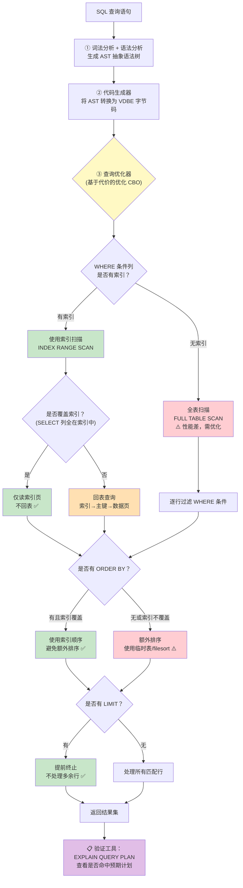

# IO与存储优化 — 面试深度解析

> **面试权重**: ⭐⭐⭐⭐☆ | **难度**: ★★★★☆ | **字数**: 约 5000 字

---

## 第一层：常见面试问题（5+ 高频考点）

### Q1: NIO 和 BIO 的区别是什么？Channel + Buffer vs Stream 的设计差异？

**核心答案**: BIO（Blocking I/O）基于**面向流的字节读写**，每次操作一个字节或字节数组，流是单向的（InputStream/OutputStream 分离）；NIO（Non-blocking I/O）基于**面向块的 Channel + Buffer**，读写以 Buffer 为单位，Channel 是双向的，支持非阻塞模式和**多路复用（Selector）**。

**本质差异对照表**：

| 维度 | BIO (java.io) | NIO (java.nio) |
|------|--------------|----------------|
| **数据模型** | 面向流（Stream），逐字节处理 | 面向块（Block），Buffer 批量操作 |
| **方向性** | 单向（Input/Output 严格分离） | 双向（Channel 可同时读写） |
| **阻塞模式** | 阻塞（read/write 必须等待数据就绪） | 非阻塞（可配置为非阻塞模式） |
| **多路复用** | ❌ 一个线程只能处理一个连接 | ✅ Selector 单线程管理多 Channel |
| **零拷贝** | ❌ read+write 需 4 次拷贝 | ✅ transferTo/transferFrom 支持零拷贝 |
| **缓冲区** | JVM 堆内字节数组 | DirectBuffer（堆外）或 HeapBuffer（堆内） |

**Stream vs Buffer 的核心区别**：

```
BIO Stream 模型：
  InputStream in = socket.getInputStream();
  int b;
  while ((b = in.read()) != -1) {   // 逐字节读取，每次系统调用！
      process(b);
  }

NIO Buffer 模型：
  SocketChannel channel = SocketChannel.open();
  ByteBuffer buf = ByteBuffer.allocateDirect(8192);  // 8KB 块
  while (channel.read(buf) != -1) {  // 一次读满整个缓冲区
      buf.flip();
      process(buf);
      buf.clear();
  }
```

**面试追问：NIO 比 BIO 一定快吗？**

不是绝对的：
- **小数据量、简单场景**：BIO 足够好，NIO 的 Buffer 分配/flip 操作反而有额外开销
- **高并发、长连接**：NIO + Selector 大幅减少线程数，优势明显
- **文件 I/O**：FileChannel 支持零拷贝（transferTo），NIO 胜出
- **Android 主线程**：两者都不应该用，应使用 Okio（基于 NIO 封装）+ 异步调度

---

### Q2: mmap 文件读写是怎样实现的？MMKV 如何利用 mmap 做到高性能？

**核心答案**: mmap 将文件映射到进程虚拟地址空间，使文件数据直接映射为用户可访问的内存。进程对映射内存的读写操作，由内核的缺页中断机制自动同步到磁盘 Page Cache，**省去「内核缓冲区 → 用户缓冲区」的数据拷贝**。MMKV 正是利用这一机制，将键值对序列化后直接写入 mmap 映射区，实现零拷贝的持久化。

**mmap 零拷贝原理**：

```
传统 write() 流程：
  用户缓冲区 ──CPU copy──▶ 内核 Page Cache ──DMA──▶ 磁盘
  （每次写入都需 CPU 拷贝用户数据到内核空间）

mmap 流程：
  用户虚拟地址空间 ──直接映射──▶ 内核 Page Cache ──DMA──▶ 磁盘
  （用户写入 = 直接修改 Page Cache，无需任何拷贝！）
```

**MMKV 的核心实现**：

```cpp
// MMKV 初始化时的 mmap 映射
void MMKV::loadFromFile() {
    // 1. 打开文件
    m_fd = open(m_path.c_str(), O_RDWR | O_CREAT, S_IRWXU);

    // 2. 调整文件大小（预分配空间）
    m_size = DEFAULT_MMAP_SIZE; // 通常为 getpagesize() 的整数倍
    ftruncate(m_fd, m_size);

    // 3. 核心：mmap 映射 —— 文件内容映射到进程地址空间
    m_ptr = (char *) mmap(nullptr, m_size,
                          PROT_READ | PROT_WRITE,  // 可读可写
                          MAP_SHARED,              // 修改会写回文件
                          m_fd, 0);

    // m_ptr 现在就是文件的「内存视图」
    // 读写 m_ptr = 读写文件，完全在用户态完成！
}

// 写操作：直接内存拷贝，零系统调用
void MMKV::writeInt(const string &key, int32_t value) {
    // 计算 key 存储位置
    auto offset = m_dic[key].offset;
    // 直接 memcpy 到 mmap 映射区（Page Cache）
    memcpy(m_ptr + offset, &value, sizeof(int32_t));
    // 无需 fsync！MAP_SHARED + 内核脏页回写 = 自动落盘
}

// 读操作：指针解引用，零系统调用
int32_t MMKV::readInt(const string &key) {
    auto offset = m_dic[key].offset;
    // 直接指针解引用读取，没有任何 read() 系统调用
    return *(int32_t *)(m_ptr + offset);
}
```

**mmap 的缺页机制**（为什么第一次访问会慢）：

```
首次访问 mmap 映射区：
  CPU 访问 m_ptr[offset]
    → MMU 发现该虚拟地址无物理页映射
    → 触发缺页中断（Page Fault）
    → 内核加载对应文件页到 Page Cache
    → 建立虚拟地址 ↔ 物理页的页表映射
    → 返回用户态继续执行
  （后续访问直接命中 Page Cache，不再中断）
```

**MMKV 的扩展机制**（文件增长时）：

当写入数据超出当前 mmap 区域时，MMKV 需要扩展：
1. 用 `ftruncate` 扩展文件大小
2. 用 `munmap` 解除旧映射
3. 用 `mmap` 重新映射新大小

这是 mmap 方案的主要缺点之一——扩展时开销较大。这也是为什么 MMKV 通常预分配较大空间（如 4KB 页对齐），减少扩展频率。

**面试追问：mmap 每次都保证数据落盘吗？**

不保证。mmap 的写入默认只修改 Page Cache（内存），实际落盘由内核的脏页回写机制控制（`pdflush` 周期性刷盘，周期约 30 秒）。如果应用崩溃，Page Cache 中的数据会丢失。需要强一致性时可调用 `msync(m_ptr, size, MS_SYNC)` 强制同步。

---

### Q3: WAL（Write-Ahead Log）日志机制是如何工作的？为什么先写日志再写数据？

**核心答案**: WAL 是数据库和存储系统中保证**原子性和持久性**的核心机制：在修改数据页之前，**先把修改记录（日志）写入磁盘**。当系统崩溃恢复时，通过重放日志恢复未完成的修改。

**WAL 核心原理**：

```
                    内存                             磁盘
              ┌─────────────┐              ┌──────────────────┐
 事务开始      │ 修改数据页   │              │                  │
    │          │ (内存操作)   │              │                  │
    │          └──────┬──────┘              │                  │
    │                 │                     │                  │
    ▼          ┌──────▼──────┐              │                  │
 写 WAL 日志   │ 生成日志记录  │───fsync────▶│ WAL 日志文件      │
    │          │ (redo log)  │   先落盘     │ (顺序追加写)      │
    │          └─────────────┘              └──────────────────┘
    │
    ▼          ┌─────────────┐              ┌──────────────────┐
 提交事务      │ 标记事务提交  │              │ 日志写入 COMMIT   │
    │          └─────────────┘              │ 标记              │
    │                                       └──────────────────┘
    │                 (后续异步)
    ▼          ┌─────────────┐              ┌──────────────────┐
 Checkpoint   │ 将脏数据页    │───写回────▶│ 数据库文件        │
    │          │ 批量写入磁盘  │   (异步)    │ (随机写)          │
    ▼          └─────────────┘              └──────────────────┘
```

**WAL 的两大核心价值**：

1. **原子性保证**：事务的修改记录要么完整写入日志（事务成功），要么完全没有（事务失败）。恢复时通过日志的 COMMIT 标记判断事务是否完成。
2. **性能提升**：日志是**顺序追加写**（Append-Only），比直接修改数据文件的**随机写**快 10-100 倍。数据页的最终写入可以延迟、批量、异步完成。

**WAL 在 SQLite 中的应用**：

SQLite 支持两种日志模式：

| 模式 | 日志文件 | 原理 | 性能 |
|------|---------|------|------|
| **DELETE 模式**（默认） | `数据库名-journal` | 事务前备份原始页到 journal，回滚时恢复 | 差，需备份+删除文件 |
| **WAL 模式** | `数据库名-wal` + `数据库名-shm` | 修改写入 WAL 文件追加，不修改主数据库 | **好**，顺序写+读写并发 |

```sql
-- 开启 WAL 模式（Android 强烈推荐）
PRAGMA journal_mode=WAL;

-- WAL 模式下的并发规则：
-- 写操作：独占锁，追加到 WAL 文件末尾
-- 读操作：可从 WAL 或主数据库读取，与写操作不冲突（读写并发！）
```

**Android 中开启 WAL 的关键 API**：

```java
// SQLiteOpenHelper 中启用 WAL
@Override
public void onConfigure(SQLiteDatabase db) {
    super.onConfigure(db);
    db.enableWriteAheadLogging();  // 等价于 PRAGMA journal_mode=WAL
}
```

---

### Q4: SQLite 的优化手段有哪些？WAL 模式 + 批量事务 + 索引优化 + EXPLAIN QUERY PLAN？

**核心答案**: SQLite 在 Android 中的优化遵循四个层次——① 开启 WAL 模式解决读写锁竞争 ② 批量事务减少 fsync 次数 ③ 合理索引和查询优化 ④ 用 EXPLAIN QUERY PLAN 验证查询计划。

#### ① WAL 模式 — 读写并发

```java
// 方式一：onConfigure 中全局开启
@Override
public void onConfigure(SQLiteDatabase db) {
    super.onConfigure(db);
    db.enableWriteAheadLogging();
}

// 方式二：直接执行 PRAGMA（需在每个数据库连接上执行）
db.execSQL("PRAGMA journal_mode=WAL");
db.execSQL("PRAGMA synchronous=NORMAL");   // 降低同步级别，性能↑
db.execSQL("PRAGMA cache_size=10000");     // 加大页缓存（单位：页，默认 2000）
```

WAL 模式下最重要的收益是**读写不再互斥**——写操作追加 WAL 文件不影响读操作从主数据库读取。

#### ② 批量事务 — 减少 fsync 开销

SQLite 默认每条 SQL 语句都是**隐式事务**（自动提交），每次提交都会触发一次 fsync，导致大量磁盘 I/O。

```java
// ❌ 每条插入都是一次事务 + fsync，慢！
for (int i = 0; i < 10000; i++) {
    db.execSQL("INSERT INTO users VALUES (?, ?)", new Object[]{i, "name" + i});
}

// ✅ 批量事务：10000 条数据仅一次事务 + fsync，快 50-100 倍！
db.beginTransaction();
try {
    for (int i = 0; i < 10000; i++) {
        db.execSQL("INSERT INTO users VALUES (?, ?)", new Object[]{i, "name" + i});
    }
    db.setTransactionSuccessful();
} finally {
    db.endTransaction();
}
```

**性能对比（实测数据，10000 条插入）**：

| 方式 | 耗时 | fsync 次数 |
|------|------|-----------|
| 逐条插入 | ~8000ms | 10000 次 |
| 批量事务 | ~150ms | 1 次 |

> **原理**：SQLite 在事务提交时才会将数据刷写到 WAL 文件并执行 fsync。批量事务将 N 条写操作合并为一次 fsync。

#### ③ 索引优化

```sql
-- 1. 为频繁查询的列创建索引
CREATE INDEX idx_users_name ON users(name);

-- 2. 复合索引：列顺序 = 查询条件顺序
CREATE INDEX idx_users_age_city ON users(age, city);
-- 查询 WHERE age = 25 AND city = '北京' 会命中
-- 查询 WHERE city = '北京' 不会命中（不满足最左前缀）

-- 3. 避免在 WHERE 子句中对列使用函数
-- ❌ 不会使用索引
SELECT * FROM users WHERE UPPER(name) = 'ALICE';
-- ✅ 使用索引
SELECT * FROM users WHERE name = 'Alice';

-- 4. 覆盖索引：查询列全部在索引中，避免回表
CREATE INDEX idx_users_name_age ON users(name, age);
SELECT name, age FROM users WHERE name = 'Bob'; -- 仅查索引，不回表！
```

#### ④ EXPLAIN QUERY PLAN — 验证查询计划

```sql
-- 查看查询是否使用索引
EXPLAIN QUERY PLAN SELECT * FROM users WHERE name = 'Alice';

-- 输出示例：
-- 0|0|0|SEARCH TABLE users USING INDEX idx_users_name (name=?)
--                                              ↑ 使用了索引

-- 如果输出是 SCAN TABLE（全表扫描），说明索引未命中，需排查
```

**综合优化 Checklist**：

| 优化项 | 命令/做法 | 效果 |
|--------|----------|------|
| WAL 模式 | `PRAGMA journal_mode=WAL` | 读写并发，性能提升 3-5x |
| 同步级别 | `PRAGMA synchronous=NORMAL` | 减少 fsync 频率，写入加速 |
| 页缓存 | `PRAGMA cache_size=10000` | 减少缺页 I/O |
| 批量事务 | `beginTransaction()` | 合并 fsync，写入加速 50x+ |
| 合理索引 | `CREATE INDEX` | 查询提速 10-1000x |
| 覆盖索引 | 索引包含查询列 | 避免回表 I/O |
| 查询计划 | `EXPLAIN QUERY PLAN` | 验证索引命中 |

---

### Q5: 磁盘缓存策略如何设计？LRU + 过期策略 + 容量控制？

**核心答案**: 磁盘缓存设计的三大核心维度——**淘汰策略**（LRU，优先淘汰最久未使用的条目）、**过期策略**（基于时间的 TTL，过期数据自动失效）、**容量控制**（总大小上限，超出时触发 LRU 淘汰）。

**DiskLruCache 的设计**：

Android 中最经典的磁盘缓存实现是 Jake Wharton 的 DiskLruCache，其核心设计：

```
磁盘目录结构：
├── journal           ← 日志文件（记录操作顺序，用于恢复 LRU 状态）
├── key1.0            ← 条目1的内容文件（.0 是索引0）
├── key1.1            ← 条目1的内容文件（.1 是索引1，支持多文件）
├── key2.0
└── key2.1

journal 文件格式：
libcore.io.DiskLruCache   ← 魔数
1                         ← 版本号
1                         ← 应用版本
2                         ← 每个条目关联的文件数
                          ← 空行
DIRTY 1a2b3c              ← 正在编辑中
CLEAN 1a2b3c 1024 2048    ← 已提交，记录文件大小
READ 1a2b3c               ← 最近被读取
READ 4d5e6f
DIRTY 4d5e6f
CLEAN 4d5e6f 512 1024
```

**LRU 淘汰的核心流程**：

```java
// DiskLruCache 的核心：journal 日志 = LRU 顺序
// 日志末尾的记录 = 最近使用的（MRU，Most Recently Used）
// 日志开头的记录 = 最久未使用的（LRU，Least Recently Used）

// 淘汰逻辑（trimToSize）：
void trimToSize() {
    while (currentSize > maxSize) {
        // 从日志文件头部找到最老的条目
        Entry entry = lruEntries.head();
        // 删除其文件
        entry.delete();
        // 从日志中移除
        lruEntries.remove(entry.key);
        // 更新当前大小
        currentSize -= entry.totalSize;
    }
}

// 读取时提升到 MRU 位置（日志末尾追加 READ 记录）
Value get(String key) {
    // ... 读取文件 ...
    journalWriter.write("READ " + key + "\n"); // 追加到 journal 末尾
    // LruEntries 链表移动到末尾
    Entry entry = lruEntries.get(key);
    lruEntries.moveToTail(entry);
    return value;
}
```

**三大维度的实现**：

```
┌─────────────────────────────────────────────────────────────┐
│                    磁盘缓存三大维度                           │
│                                                             │
│  ① LRU 淘汰策略（DiskLruCache 标配）                        │
│     ├─ journal 日志记录访问顺序                              │
│     ├─ 最近访问的条目在日志末尾（MRU）                       │
│     ├─ 最久未访问的在日志头部（LRU）                         │
│     └─ 容量超限时从头部开始淘汰                              │
│                                                             │
│  ② 过期策略（TTL，需自行扩展）                              │
│     ├─ 方式1：存储时记录时间戳（存入文件名/额外文件）         │
│     ├─ 方式2：读取时检查 System.currentTimeMillis() - 存储时间 │
│     └─ 方式3：结合 HTTP 缓存头（Cache-Control: max-age=xxx）  │
│                                                             │
│  ③ 容量控制                                                  │
│     ├─ maxSize：总容量上限（如 100MB）                       │
│     ├─ minSize：保留的最小空间（≤ maxSize）                  │
│     ├─ 每次写入后检查 size > maxSize → trimToSize()         │
│     └─ 按文件系统实际占用计算（非估算）                       │
└─────────────────────────────────────────────────────────────┘
```

**带过期策略的扩展实现**：

```java
class TtlDiskCache {
    static class CacheEntry {
        File file;
        long expiresAt;  // 过期时间戳
        long size;
    }

    LinkedHashMap<String, CacheEntry> entries = new LinkedHashMap<>(
        16, 0.75f, true  // accessOrder=true → 自动 LRU 排序！
    );

    // 读取时检查过期
    CacheEntry get(String key) {
        CacheEntry entry = entries.get(key);
        if (entry == null) return null;

        if (System.currentTimeMillis() > entry.expiresAt) {
            // 过期：立即删除
            entry.file.delete();
            entries.remove(key);
            return null;
        }
        return entry;
    }

    // 写入时设置 TTL
    void put(String key, byte[] data, long ttlMillis) {
        // 先检查容量，必要时淘汰
        while (currentSize + data.length > maxSize) {
            evictOldest();
        }
        // 写入文件 + 记录过期时间
        File file = new File(cacheDir, key);
        Files.write(file.toPath(), data);
        CacheEntry entry = new CacheEntry();
        entry.file = file;
        entry.expiresAt = System.currentTimeMillis() + ttlMillis;
        entry.size = data.length;
        entries.put(key, entry);
        currentSize += data.length;
    }
}
```

---

## 第二层：FileChannel Direct Buffer 与 Heap Buffer 深度对比

### ByteBuffer 的两条内存路径

NIO 的 `ByteBuffer` 有两个核心子类，它们的内存分配路径完全不同：

```
┌─────────────────────────────────────────────────────────────────┐
│                    ByteBuffer 内存模型                           │
│                                                                 │
│  HeapByteBuffer                   DirectByteBuffer              │
│  ┌──────────────────┐             ┌──────────────────┐          │
│  │  JVM Heap 内存    │             │  堆外 Native 内存  │          │
│  │                  │             │                  │          │
│  │  byte[] hb ──────│─ JNI copy ─▶│  原生地址 address  │          │
│  │  (GC 管理)       │  (每次I/O)  │  (需要手动释放)    │          │
│  │                  │             │                  │          │
│  │  优点：分配快     │             │  优点：零拷贝      │          │
│  │  缺点：I/O 需拷贝  │             │  缺点：分配慢      │          │
│  └──────────────────┘             └──────────────────┘          │
│                                                                 │
│  分配方式：                     分配方式：                       │
│  ByteBuffer.allocate(1024)     ByteBuffer.allocateDirect(1024)  │
│  → new byte[1024]              → unsafe.allocateMemory(1024)    │
│  → JVM 堆分配（~10ns）          → malloc()（~1μs，慢 100 倍）    │
└─────────────────────────────────────────────────────────────────┘
```

### FileChannel 中使用两种 Buffer 的内部路径

```java
// === 场景 1：HeapByteBuffer + FileChannel.read() ===
ByteBuffer heapBuf = ByteBuffer.allocate(4096);  // 堆内分配
FileChannel fc = FileChannel.open(Paths.get("file.bin"));
fc.read(heapBuf);
// 内部流程：
// 1. JNI 调用 read()，传入 byte[] hb 的引用
// 2. 如果 hb 不在 JNI critical 区域，GC 可能移动它
// 3. 内核需要稳定的物理地址 → JNI 创建临时 DirectBuffer
// 4. 内核将数据读入临时 DirectBuffer
// 5. JNI 将临时 DirectBuffer 拷贝到 byte[] hb
// 总拷贝次数：磁盘→PageCache→临时DirectBuffer→hb（多了一次拷贝）

// === 场景 2：DirectByteBuffer + FileChannel.read() ===
ByteBuffer directBuf = ByteBuffer.allocateDirect(4096); // 堆外分配
FileChannel fc = FileChannel.open(Paths.get("file.bin"));
fc.read(directBuf);
// 内部流程：
// 1. JNI 调用 read()，传入 stable 的 Native 地址
// 2. 内核直接将数据 DMA/拷贝到该地址
// 3. 无需任何中间拷贝
// 总拷贝次数：磁盘→PageCache→DirectBuffer（少一次拷贝！）
```

**DirectBuffer 的零拷贝优势总结**：

| I/O 操作 | HeapByteBuffer | DirectByteBuffer |
|----------|---------------|------------------|
| FileChannel.read/write | 需要 1 次额外 JNI 拷贝 | **零额外拷贝** |
| SocketChannel.read/write | 需要 1 次额外 JNI 拷贝 | **零额外拷贝** |
| transferTo/transferFrom | 不直接支持 | **零拷贝传递** |
| JNI GetDirectBufferAddress | 不支持 | 直接获取原生指针 |

**面试追问：什么时候应该用 HeapByteBuffer？**

- 数据量小（< 8KB）且生命周期短：分配开销远小于 DirectBuffer
- 纯 Java 层处理数据（不涉及 I/O）：无 JNI 拷贝开销
- 需要频繁创建/销毁：Heap 分配轻量，GC 自动回收

---

## 第三层：SQLite 的页缓存（Pager Cache）与 B 树结构

### SQLite 的存储架构

SQLite 将数据库文件组织为**固定大小的页**（Page），默认 4096 字节。所有数据（表、索引、空闲列表）都以页为单位存储，通过 B 树（B-Tree）结构组织。

```
┌──────────────────────────────────────────────────────────────┐
│                    SQLite 存储架构                            │
│                                                              │
│  ┌──────────────────────────────────────────────────────┐    │
│  │              Pager（页管理器）                        │    │
│  │  ┌────────────────────────────────────────────┐      │    │
│  │  │          Page Cache（页缓存）               │      │    │
│  │  │  [Page0][Page1][Page2]...[PageN]           │      │    │
│  │  │  默认 2000 页 × 4KB = 8MB                   │      │    │
│  │  │  LRU 淘汰：缺页时淘汰最久未使用的页          │      │    │
│  │  └────────────────────────────────────────────┘      │    │
│  │         ↕ 加载/写回                                   │    │
│  │  ┌────────────────────────────────────────────┐      │    │
│  │  │         数据库文件 (.db)                     │      │    │
│  │  │  ┌──────┬──────┬──────┬──────┬──────┐      │      │    │
│  │  │  │Page0 │Page1 │...   │ B树  │ B树  │      │      │    │
│  │  │  │Header│Schema│      │Root  │Leaf  │      │      │    │
│  │  │  └──────┴──────┴──────┴──────┴──────┘      │      │    │
│  │  └────────────────────────────────────────────┘      │    │
│  └──────────────────────────────────────────────────────┘    │
│                                                              │
│  在 WAL 模式下：                                              │
│  ┌─────────────────────┐   ┌─────────────────────┐          │
│  │   数据库文件 (.db)    │   │   WAL 文件 (.wal)    │          │
│  │   (B树页的快照)       │   │   (修改的追加日志)    │          │
│  └─────────────────────┘   └─────────────────────┘          │
│           ↕                           ↕                      │
│      读操作从 .db               写入追加到 .wal               │
│      或 .wal 读取               + 更新 .shm (共享内存索引)    │
└──────────────────────────────────────────────────────────────┘
```

### B 树结构在 SQLite 中的体现

SQLite 使用 B+ 树的变体，每个表对应一棵 B 树：

```
                     ┌───────────────┐
                     │  B-Tree Root  │  ← 根页（1页）
                     │  Page #3      │
                     └───┬───────┬───┘
              ┌──────────┘       └──────────┐
              ▼                             ▼
     ┌────────────────┐          ┌────────────────┐
     │ Internal Page   │          │ Internal Page   │  ← 内部页
     │ Page #5         │          │ Page #8         │
     │ keys: [1..100]  │          │ keys: [101..200]│
     └───┬─────────┬───┘          └───┬─────────┬───┘
    ┌────┘         └────┐        ┌────┘         └────┐
    ▼                   ▼        ▼                   ▼
┌─────────┐      ┌─────────┐ ┌─────────┐      ┌─────────┐
│Leaf Page│      │Leaf Page │ │Leaf Page│      │Leaf Page│  ← 叶子页
│Page #9  │      │Page #12  │ │Page #15 │      │Page #18 │
│ Rows:   │      │ Rows:    │ │ Rows:   │      │ Rows:   │
│ id=1-25 │      │id=26-50  │ │id=101-..│      │id=176-..│
└─────────┘      └─────────┘ └─────────┘      └─────────┘
```

**B 树查询性能**：每个内部页包含约 100-200 个键（取决于键大小），对于百万级数据，B 树高度仅 3-4 层，意味着查询最多需要读取 3-4 页（12-16KB），远优于全表扫描。

### WAL 的 Checkpoint 合并过程

Checkpoint 是将 WAL 文件中的修改合并回主数据库的过程：

```
WAL 文件状态（Checkpoint 前）：
┌─────────────────────────────────────────────────────────┐
│ Frame1  Frame2  Frame3  Frame4  ...  FrameN             │
│ (已       (已       (未       (未           (未           │
│  checkpoint) checkpoint) checkpoint) checkpoint) checkpoint)│
│                                                         │
│               ↑ checkpoint 进度指针                      │
└─────────────────────────────────────────────────────────┘

Checkpoint 过程：
1. 锁定数据库（短暂的写锁）
2. 从上次 checkpoint 位置开始，逐帧读取 WAL
3. 将修改的页写回 .db 文件
4. 更新 WAL 文件的 checkpoint 指针
5. 释放锁

Checkpoint 触发时机：
- 自动：WAL 文件达到 1000 页（PRAGMA wal_autocheckpoint=1000）
- 手动：调用 PRAGMA wal_checkpoint
- 被动：最后一个数据库连接关闭时
```

---

## 第四层：SQLite 查询优化流程图



**查询优化器的核心决策**：

1. **索引选择**：多个可用索引时，基于 `ANALYZE` 生成的统计信息（每列的数据分布）估算成本，选择代价最低的索引
2. **连接顺序**：多表 JOIN 时通过动态规划找到最优连接顺序
3. **子查询展开**：尝试将子查询扁平化为 JOIN（`subquery flattening`）
4. **自动索引**：某些情况下自动创建临时索引（`automatic index`）

**常见慢查询及对应优化**：

| 慢查询特征 | 原因 | 优化手段 |
|-----------|------|---------|
| `SCAN TABLE` | 无可用索引 | 为 WHERE 列创建索引 |
| `USING TEMP B-TREE` | ORDER BY 列无索引 | 创建覆盖 ORDER BY 的复合索引 |
| `USING INDEX + 回表` | 非覆盖索引 | 扩展索引为覆盖索引 |
| `SUBQUERY N` | 子查询未展开 | 改写为 JOIN |

---

## 第五层：SQLiteDatabase 源码剖析 — beginTransaction 与 WAL 模式

### beginTransaction 的完整调用链

```java
// ========== Android Framework 层 ==========
// SQLiteDatabase.java (AOSP)

public void beginTransaction() {
    beginTransaction(null);  // 默认使用 EXCLUSIVE 事务模式
}

public void beginTransaction(SQLiteTransactionListener transactionListener) {
    // 1. 线程安全检查：必须在创建数据库连接的线程中调用
    verifyLockOwner();
    // 2. 通知 Hook 回调
    if (mConnectionPool == null) {
        mConnectionPool = new SQLiteConnectionPool(this);
    }
    // 3. 如果已在外层事务中，仅增加嵌套计数
    if (mTransactionStack == null) {
        mTransactionStack = new ArrayDeque<>();
    }
    mTransactionStack.push(transactionListener);

    // 4. 核心：执行 BEGIN EXCLUSIVE 或 BEGIN IMMEDIATE
    if (mTransactionStack.size() == 1) {
        // WAL 模式用 BEGIN IMMEDIATE，非 WAL 用 BEGIN EXCLUSIVE
        execSQL("BEGIN EXCLUSIVE;");  // 或 BEGIN IMMEDIATE
    }
}
```

### endTransaction 的处理

```java
public void endTransaction() {
    verifyLockOwner();

    if (mTransactionStack == null || mTransactionStack.isEmpty()) {
        throw new IllegalStateException("Cannot perform this operation " +
            "because there is no current transaction.");
    }

    SQLiteTransactionListener listener = mTransactionStack.pop();

    if (mTransactionStack.isEmpty()) {
        // 最外层事务：执行 COMMIT 或 ROLLBACK
        if (mTransactionIsSuccessful) {
            execSQL("COMMIT;");
            if (listener != null) listener.onCommit();
        } else {
            execSQL("ROLLBACK;");
            if (listener != null) listener.onRollback();
        }
    } else if (!mTransactionIsSuccessful) {
        // 嵌套事务失败：标记外层也失败
        mTransactionSuccessful = false;
    }
}
```

### WAL 模式的实现

```java
// SQLiteDatabase.java
public boolean enableWriteAheadLogging() {
    // 1. 检查是否已在 WAL 模式
    if (isReadOnlyDatabase()) {
        return false;
    }

    // 2. 确保所有连接已关闭（WAL 模式需要重启连接）
    if (mConnectionPool != null) {
        mConnectionPool.close();
    }

    // 3. 打开 WAL 模式连接
    mConnectionPool = new SQLiteConnectionPool(this);
    mConnectionPool.setWriteAheadLoggingEnabled(true);

    // 4. 连接池内部会执行
    //    PRAGMA journal_mode=WAL;
    //    PRAGMA wal_autocheckpoint=1000;
    return true;
}
```

### WAL 模式下的连接池架构

```
┌────────────────────────────────────────────────────────────┐
│              SQLiteConnectionPool                          │
│                                                            │
│  ┌──────────────────────┐   ┌──────────────────────┐      │
│  │  主连接 (Primary)     │   │  WAL 写连接 (Writer)  │      │
│  │  只读，从 .db 读取    │   │  写入 WAL 文件        │      │
│  │  可多个               │   │  仅 1 个              │      │
│  └──────────────────────┘   └──────────────────────┘      │
│                                                            │
│  读操作流程：                                               │
│  1. 检查 WAL 中是否有更新版本的页                           │
│  2. 有 → 从 WAL 读取                                       │
│  3. 无 → 从 .db 读取                                       │
│                                                            │
│  写操作流程：                                               │
│  1. 获取 WAL 写锁（互斥）                                   │
│  2. 将修改追加到 WAL 文件末尾                               │
│  3. 更新 .shm 共享内存中的 WAL 索引                         │
│  4. 释放写锁                                               │
│                                                            │
│  关键：读操作不需要锁，可以与写操作并发！                    │
└────────────────────────────────────────────────────────────┘
```

**beginTransaction 在 WAL 模式下的行为差异**：

```
非 WAL (DELETE 模式) 事务：
  BEGIN EXCLUSIVE → 获取数据库级 RESERVED 锁
  INSERT/UPDATE/DELETE → 数据写入 rollback journal
  COMMIT → 1. 将数据写入主数据库 2. fsync 3. 删除 journal
  全程排他锁，读操作被阻塞！

WAL 模式事务：
  BEGIN IMMEDIATE → 获取 WAL 写锁（轻量级）
  INSERT/UPDATE/DELETE → 追加到 WAL 文件末尾（顺序写！）
  COMMIT → 1. 将 WAL 帧标记为已提交 2. fsync WAL 文件
  读操作不受影响（从 .db 或 WAL 快照读取），读写并发！
```

---

## 第六层：手写实战 — 设计一个高性能磁盘缓存

### 需求定义

设计一个类似 DiskLruCache 的高性能磁盘缓存，要求：

1. **LRU 淘汰**：容量超限时淘汰最久未使用的条目
2. **过期策略**：每个条目支持 TTL，过期自动失效
3. **容量控制**：总大小可配置，精确控制
4. **线程安全**：多线程并发读写安全
5. **崩溃恢复**：进程被杀后能恢复缓存状态
6. **journal 日志**：通过操作日志记录 LRU 顺序

### 完整实现

```java
/**
 * 高性能磁盘缓存 — 自实现版 DiskLruCache
 *
 * 核心设计：
 * 1. journal 文件记录操作顺序，进程重启时重建 LRU 状态
 * 2. LinkedHashMap(accessOrder=true) 作为内存索引
 * 3. 读写锁（ReentrantReadWriteLock）保证线程安全
 */
public class HighPerformanceDiskCache {
    private static final String MAGIC = "HP_DISK_CACHE";
    private static final int VERSION = 1;
    private static final String JOURNAL_FILE = "journal";

    private final File cacheDir;
    private final long maxSize;
    private long currentSize;

    // LinkedHashMap accessOrder=true：自动按访问顺序排序
    // 最近访问的在尾部，最久未访问的在头部
    private final LinkedHashMap<String, CacheEntry> entries;
    private final ReentrantReadWriteLock lock = new ReentrantReadWriteLock();
    private final Lock readLock = lock.readLock();
    private final Lock writeLock = lock.writeLock();

    // Journal 日志写入器
    private Writer journalWriter;

    // ============ 数据结构 ============

    static class CacheEntry {
        final String key;
        long size;          // 磁盘占用大小
        long expiresAt;     // 过期时间戳（0 = 永不过期）
        boolean isDirty;    // 是否正在编辑中

        CacheEntry(String key) {
            this.key = key;
        }

        File getCleanFile() { return new File(key + ".0"); }
        File getDirtyFile() { return new File(key + ".tmp"); }
    }

    // ============ 构造函数 ============

    public HighPerformanceDiskCache(File cacheDir, long maxSize) throws IOException {
        this.cacheDir = cacheDir;
        this.maxSize = maxSize;
        this.entries = new LinkedHashMap<>(16, 0.75f, true); // accessOrder=true

        if (!cacheDir.exists()) {
            cacheDir.mkdirs();
        }

        // 从 journal 文件恢复状态
        recoverFromJournal();
    }

    // ============ Journal 恢复（崩溃恢复） ============

    private void recoverFromJournal() throws IOException {
        File journalFile = new File(cacheDir, JOURNAL_FILE);

        if (!journalFile.exists()) {
            // 新缓存：创建 journal
            journalWriter = new BufferedWriter(new FileWriter(journalFile));
            journalWriter.write(MAGIC + "\n");
            journalWriter.write(VERSION + "\n");
            journalWriter.write(maxSize + "\n\n");
            journalWriter.flush();
            return;
        }

        // 读取 journal 重建 LRU 状态
        try (BufferedReader reader = new BufferedReader(new FileReader(journalFile))) {
            String magic = reader.readLine();
            if (!MAGIC.equals(magic)) {
                throw new IOException("Invalid journal magic: " + magic);
            }
            int version = Integer.parseInt(reader.readLine());
            long savedMaxSize = Long.parseLong(reader.readLine());
            reader.readLine(); // 空行

            String line;
            while ((line = reader.readLine()) != null) {
                String[] parts = line.split(" ");
                if (parts.length < 2) continue;

                String action = parts[0];
                String key = parts[1];

                switch (action) {
                    case "DIRTY":
                        // 上次未完成的操作 → 删除脏文件
                        new File(cacheDir, key + ".tmp").delete();
                        entries.remove(key);
                        break;

                    case "CLEAN":
                        // 已完成的操作 → 加入 LRU 列表
                        long size = Long.parseLong(parts[2]);
                        long expiresAt = parts.length > 3
                            ? Long.parseLong(parts[3]) : 0;
                        CacheEntry entry = new CacheEntry(key);
                        entry.size = size;
                        entry.expiresAt = expiresAt;
                        entries.put(key, entry);
                        currentSize += size;
                        break;

                    case "READ":
                        // 读取操作 → 将条目移到 LRU 尾部（已由 LinkedHashMap 自动处理）
                        break;
                }
            }
        }

        // 重新打开 journal 用于追加写入
        journalWriter = new BufferedWriter(
            new FileWriter(journalFile, true)); // append=true
    }

    // ============ 读取操作 ============

    public CacheEntry get(String key) {
        readLock.lock();
        try {
            CacheEntry entry = entries.get(key); // LinkedHashMap 自动移到尾部！
            if (entry == null) return null;

            // 检查过期
            if (entry.expiresAt > 0 && System.currentTimeMillis() > entry.expiresAt) {
                readLock.unlock(); // 升级为写锁前先释放读锁
                writeLock.lock();
                try {
                    removeLocked(key);
                } finally {
                    writeLock.unlock();
                    readLock.lock();
                }
                return null;
            }

            // 记录 READ 到 journal
            journalWriter.write("READ " + key + "\n");
            journalWriter.flush();
            return entry;
        } catch (IOException e) {
            return null;
        } finally {
            readLock.unlock();
        }
    }

    // ============ 写入操作 ============

    public void put(String key, byte[] data) throws IOException {
        put(key, data, 0); // TTL=0 表示永不过期
    }

    public void put(String key, byte[] data, long ttlMillis) throws IOException {
        writeLock.lock();
        try {
            long expiresAt = ttlMillis > 0
                ? System.currentTimeMillis() + ttlMillis
                : 0;

            // ① 如果 key 已存在，先移除旧条目
            CacheEntry old = entries.get(key);
            if (old != null) {
                removeLocked(key);
            }

            // ② 容量检查：确保有足够空间
            while (currentSize + data.length > maxSize && !entries.isEmpty()) {
                // 淘汰最老的条目（LinkedHashMap 头部）
                String oldestKey = entries.keySet().iterator().next();
                removeLocked(oldestKey);
            }

            // ③ 写入数据文件
            File file = new File(cacheDir, key + ".0");
            try (FileOutputStream fos = new FileOutputStream(file)) {
                fos.write(data);
                fos.getFD().sync(); // 确保落盘
            }

            // ④ 创建条目并记录到 journal
            CacheEntry entry = new CacheEntry(key);
            entry.size = data.length;
            entry.expiresAt = expiresAt;
            entries.put(key, entry);
            currentSize += data.length;

            // 先写 DIRTY（标记开始编辑）
            journalWriter.write("DIRTY " + key + "\n");
            // 再写 CLEAN（标记编辑完成）
            journalWriter.write("CLEAN " + key + " " + data.length
                + " " + expiresAt + "\n");
            journalWriter.flush();

        } finally {
            writeLock.unlock();
        }
    }

    // ============ 淘汰与删除 ============

    private void removeLocked(String key) {
        // 该方法的调用者已持有 writeLock
        CacheEntry entry = entries.remove(key);
        if (entry != null) {
            currentSize -= entry.size;
            new File(cacheDir, key + ".0").delete();
            new File(cacheDir, key + ".tmp").delete();
        }
    }

    public void remove(String key) {
        writeLock.lock();
        try {
            removeLocked(key);
        } finally {
            writeLock.unlock();
        }
    }

    // ============ 清理过期条目 ============

    public int purgeExpired() {
        writeLock.lock();
        try {
            long now = System.currentTimeMillis();
            int count = 0;
            Iterator<Map.Entry<String, CacheEntry>> it = entries.entrySet().iterator();
            while (it.hasNext()) {
                CacheEntry entry = it.next().getValue();
                if (entry.expiresAt > 0 && now > entry.expiresAt) {
                    it.remove();
                    currentSize -= entry.size;
                    new File(cacheDir, entry.key + ".0").delete();
                    count++;
                }
            }
            return count;
        } finally {
            writeLock.unlock();
        }
    }

    // ============ 状态查询 ============

    public long getCurrentSize() { return currentSize; }
    public long getMaxSize() { return maxSize; }
    public int getEntryCount() { return entries.size(); }

    // ============ 关闭 ============

    public void close() throws IOException {
        writeLock.lock();
        try {
            if (journalWriter != null) {
                journalWriter.close();
                journalWriter = null;
            }
        } finally {
            writeLock.unlock();
        }
    }
}
```

### 设计要点总结

| 设计要素 | 实现方案 | 原理 |
|---------|---------|------|
| **LRU 淘汰** | `LinkedHashMap(accessOrder=true)` | 自动维护访问顺序，头部=LRU |
| **线程安全** | `ReentrantReadWriteLock` | 读并发，写互斥，读可升级为写 |
| **崩溃恢复** | journal 日志文件 | 记录 DIRTY/CLEAN/READ，启动时重建状态 |
| **过期策略** | `CacheEntry.expiresAt` | 读取时检查，超时删除；支持 `purgeExpired()` 批量清理 |
| **容量控制** | 写入前检查 + 循环淘汰 | `while(currentSize + newSize > maxSize)` |
| **数据落盘** | `FileDescriptor.sync()` | 确保写入后 fsync |
| **读操作优化** | journal 的 READ 行 | 仅追加一行，不触发容量检查和 I/O |

### 使用示例

```java
// 创建 100MB 的磁盘缓存
HighPerformanceDiskCache cache = new HighPerformanceDiskCache(
    new File(context.getCacheDir(), "my_cache"), 100 * 1024 * 1024);

// 写入带 1 小时 TTL 的缓存
cache.put("user_profile", jsonData, 3600 * 1000);

// 读取
CacheEntry entry = cache.get("user_profile");
if (entry != null) {
    byte[] data = Files.readAllBytes(entry.getCleanFile().toPath());
    // 使用数据...
}

// 定期清理过期条目（可在后台线程执行）
cache.purgeExpired();

// 关闭
cache.close();
```

---

## 总结

| 技术点 | 核心原理 | 面试重点 |
|--------|---------|---------|
| **NIO vs BIO** | Channel+Buffer 块操作 vs Stream 流操作 | Buffer 的双向性、DirectBuffer 零拷贝 |
| **mmap** | 文件映射到虚拟地址空间，零拷贝 | MMKV 实现、缺页中断、msync |
| **WAL** | 先写日志再写数据，崩溃恢复 | 顺序写 vs 随机写、checkpoint |
| **SQLite WAL** | 读写并发、追加写入 | enableWriteAheadLogging、journal_mode |
| **批量事务** | 合并多次写入为一次 fsync | beginTransaction/endTransaction |
| **索引优化** | B树索引、覆盖索引、最左前缀 | EXPLAIN QUERY PLAN 验证 |
| **磁盘缓存** | LRU + journal + 容量控制 | LinkedHashMap(accessOrder=true) |
| **DirectBuffer** | 堆外内存，JNI 零拷贝 | allocateDirect vs allocate |
