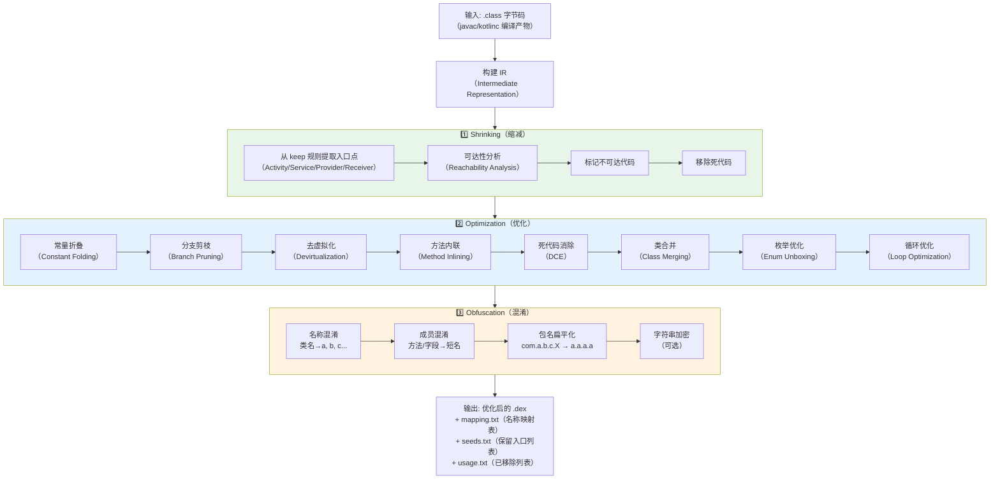
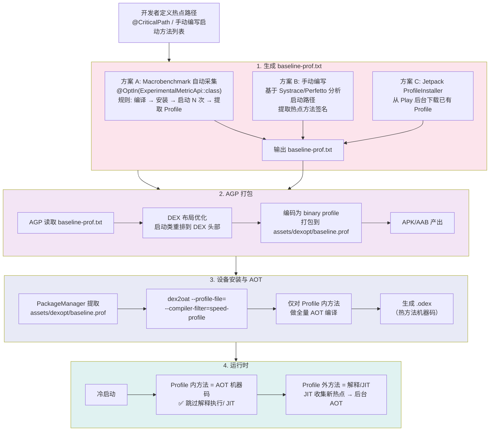

# 05 编译优化与基线

## 目录

- [第一层：面试高频五问](#第一层面试高频五问)
  - [Q1：R8 的三种优化（Shrinking→Optimization→Obfuscation）分别做了什么？](#q1r8-的三种优化shrinkingoptimizationobfuscation分别做了什么)
  - [Q2：ProGuard/R8 keep 规则的最佳实践和常见错误是什么？](#q2proguardr8-keep-规则的最佳实践和常见错误是什么)
  - [Q3：DEX 布局优化（启动类重排序 + classdata reordering）如何加速启动？](#q3dex-布局优化启动类重排序--classdata-reordering如何加速启动)
  - [Q4：Baseline Profile 的原理是什么？Cloud Profiles 如何工作？](#q4baseline-profile-的原理是什么cloud-profiles-如何工作)
  - [Q5：PGO（Profile Guided Optimization）和 AOT 编译的关系是什么？](#q5pgoprofile-guided-optimization和-aot-编译的关系是什么)
  - [Q6：R8 的 Full Mode 和 ProGuard 兼容模式有何区别？](#q6r8-的-full-mode-和-proguard-兼容模式有何区别)
- [第二层：数据结构与存储](#第二层数据结构与存储)
  - [R8 方法内联：仅对非虚拟方法](#r8-方法内联仅对非虚拟方法)
  - [去虚拟化（Devirtualization）](#去虚拟化devirtualization)
  - [分支剪枝（Branch Pruning）](#分支剪枝branch-pruning)
- [第三层：深入原理](#第三层深入原理)
  - [Baseline Profile 如何触发 ART AOT 编译](#baseline-profile-如何触发-art-aot-编译)
  - [AOT 编译的文件存储：.vdex / .odex / .art](#aot-编译的文件存储vdex--odex--art)
- [第四层：流程可视化（Mermaid）](#第四层流程可视化mermaid)
  - [R8 优化流水线](#r8-优化流水线)
  - [Baseline Profile 生成流程](#baseline-profile-生成流程)
- [第五层：源码深度剖析](#第五层源码深度剖析)
  - [R8 method inlining 源码逻辑](#r8-method-inlining-源码逻辑)
- [第六层：手写实战——Baseline Profile 优化启动速度完整流程](#第六层手写实战baseline-profile-优化启动速度完整流程)
- [总结](#总结)

---

## 第一层：面试高频五问

### Q1：R8 的三种优化（Shrinking→Optimization→Obfuscation）分别做了什么？

**标准回答：**

R8 是 Android 官方替代 ProGuard 的代码缩减/优化/混淆工具，从 AGP 3.4 开始成为默认工具。它是一条 **三阶段流水线**，阶段之间有严格依赖关系：

| 阶段 | 英文名 | 核心动作 | 产出 |
|:---:|-------|---------|------|
| 1️⃣ | **Shrinking（缩减）** | 从入口点出发进行**可达性分析**，移除未使用的类、方法、字段 | 更小的 DEX |
| 2️⃣ | **Optimization（优化）** | 在缩减后的代码上执行 100+ 优化 pass：内联、去虚拟化、分支剪枝、常量折叠、死代码消除 | 更快更小的字节码 |
| 3️⃣ | **Obfuscation（混淆）** | 将类名、方法名、字段名替换为短无意义名称（如 `a`, `b`, `c`） | 难读的 DEX（反编译阻力） |

**关键细节：**

- **Shrinking 的入口点**：`AndroidManifest.xml` 中声明的 Activity/Service/Receiver/Provider + `-keep` 规则中指定的类。R8 从这些入口出发，遍历所有引用关系，未被引用的代码标记为"可移除"。
- **Optimization 默认关闭**：`minifyEnabled true` 只开启 Shrinking + Obfuscation。要开启 Optimization 必须在 `gradle.properties` 中设置 `android.enableR8.fullMode=true`（AGP 7.0+ 默认 true）。
- **R8 vs ProGuard 的区别**：R8 将 shrinking/optimization/obfuscation 整合在同一个 IR（Intermediate Representation）上执行，避免了 ProGuard 先读 `.class` → 写 → 再读的重复 IO，速度提升显著。

---

### Q2：ProGuard/R8 keep 规则的最佳实践和常见错误是什么？

**标准回答：**

Keep 规则是控制 Shrinking/Obfuscation 的白名单，格式为 `-keep` 指令 + 类/成员匹配模式。规则写错会导致 ClassNotFoundException（过度缩减）或保留过多无用代码（缩减失效）。

**核心指令手册：**

```
-keep              # 保留类及其所有成员（最强保护）
-keepclassmembers  # 仅保留指定成员，类本身可被缩减/混淆
-keepnames         # 保留类名和成员名不变，但不阻止被缩减
-keepclassmembernames  # 仅保留成员名不变
```

**通配符速查：**

| 通配符 | 含义 | 示例 |
|-------|------|-----|
| `*` | 匹配任意字符（不含包分隔符 `.`） | `com.example.*` 匹配 `com.example.Foo` 但不匹配 `com.example.foo.Bar` |
| `**` | 匹配任意字符（含包分隔符） | `com.example.**` 匹配 `com.example.foo.Bar` |
| `***` | 匹配任意字符（含包分隔符）+ 任意参数 | `void set*(***)` 匹配所有 setter |
| `<init>(...)` | 匹配构造函数 | `-keep class * { <init>(...); }` |

**最佳实践：**

1. **反射调用的类必须 `-keep`**：Gson/Moshi 序列化、ButterKnife 注解、JNI 方法、动态加载的类
2. **使用 `@Keep` 注解替代全局规则**：`androidx.annotation.Keep`，直接在源码标注
3. **数据类（DTO）保留无参构造函数**：`-keepclassmembers class com.example.model.** { <init>(); }`
4. **规则写在 `proguard-rules.pro`，库模块用 `consumer-rules.pro`**（会被消费方继承）
5. **保留行号信息用于 Crash 堆栈还原**：`-keepattributes SourceFile, LineNumberTable`

**常见错误：**

| 错误 | 症状 | 修复 |
|------|------|------|
| `-keep class *` | 完全不缩减，APK 体积不变 | 改成精确匹配 |
| 不保留序列化类的字段 | Gson 反序列化字段为 null | `-keepclassmembers` 保留字段名 |
| 混淆了 WebView JS 接口方法 | H5 调 Native 失败 | `-keepclassmembers class * { @android.webkit.JavascriptInterface <methods>; }` |
| 混淆了 Parcelable 的 CREATOR | `android.os.BadParcelableException` | `-keepclassmembers class * implements android.os.Parcelable { public static final android.os.Parcelable$Creator CREATOR; }` |

---

### Q3：DEX 布局优化（启动类重排序 + classdata reordering）如何加速启动？

**标准回答：**

APK 安装时，`dex2oat` 将 DEX 编译为 OAT（AOT 编译产物）。启动过程中，ART 需要反复从磁盘读取类定义（class metadata）和方法字节码。DEX 布局优化通过**物理重排**减少磁盘 IO 的 seek 次数。

**两大核心优化：**

**1. 启动类重排序（Class Reordering）**

- **原理**：收集启动阶段实际加载的类列表（从 Baseline Profile / App Startup 库埋点），在 DEX 生成时将启动类**连续排列在 DEX 文件头部**。
- **效果**：ART 读取启动类时变成顺序读（sequential read），I/O Page Fault 从多次随机寻道变为一次大块读取。Google 官方数据：**冷启动速度提升 5%~15%**。
- **工具链**：AGP 7.0+ 通过 `dexStartupClassesOptimization` 自动分析 Profile 中的启动类；也可通过 Redex 的 InterDex 工具手动实现。

**2. Class Data Reordering**

- **原理**：将类的方法/字段按照访问频率排序。热方法（从 Profile 获得）放在 class_data_item 的前部，冷方法放在后部。
- **效果**：ART 加载类时，热方法的字节码更早进入 Page Cache，减少后续 JIT/AOT 编译时的 IO 开销。

**底层机制（DEX 文件格式视角）：**

```
DEX 文件结构:
┌──────────────────────┐
│  header              │  ← 魔数、校验和、各区段偏移
├──────────────────────┤
│  string_ids          │  ← 字符串表
├──────────────────────┤
│  type_ids            │  ← 类型表
├──────────────────────┤
│  proto_ids           │  ← 方法原型表
├──────────────────────┤
│  field_ids           │  ← 字段表
├──────────────────────┤
│  method_ids          │  ← 方法表
├──────────────────────┤
│  class_defs          │  ← 类定义区（★ 重排序的核心区域）
├──────────────────────┤
│  call_site_ids       │
├──────────────────────┤
│  method_handles      │
├──────────────────────┤
│  data                │  ← 实际数据区
├──────────────────────┤
│  link_data           │
└──────────────────────┘
```

class_defs 区段包含每个类的 class_data_item，记录了该类的所有方法（direct_methods + virtual_methods）和字段（instance_fields + static_fields）。启动类重排序就是把 class_defs 中启动类的条目挪到前面，classdata reordering 是把各条目内部的热方法挪到前面。

---

### Q4：Baseline Profile 的原理是什么？Cloud Profiles 如何工作？

**标准回答：**

**核心问题**：Android 5.0+ 引入 ART 运行时，应用首次安装/更新后，dex2oat 会进行 AOT 编译。但**全量 AOT 编译极其耗时**（应用安装慢、占用空间大增），因此 Android 7.0+ 引入混合编译模式——安装时只做轻量 verify，运行时由 JIT 动态识别热点方法，后台（设备空闲+充电时）再做 AOT。这带来的问题是：**冷启动前几次运行时，热点方法尚未被识别，启动/关键路径性能差**。

**Baseline Profile 的解决方案**：

- 应用**内置一份预定义的 Profile 文件**（`baseline-prof.txt`），随 APK 发布。内容是指定类的指定方法列表。
- 安装时，dex2oat 根据这份 Profile **直接对列表中的方法做 AOT 编译**，无需等待 JIT 识别。
- 跳过"JIT 热身"阶段，**首次启动即享 AOT 性能**。

**Profile 文件格式示例：**

```
HSPLandroidx/compose/runtime/ComposerImpl;->startRestartGroup(I)I
HSPLandroidx/compose/ui/layout/LayoutNodeSubcompositionsState$createSubcomposition$1;->invoke(Landroidx/compose/runtime/Composer;I)V
HLandroidx/compose/runtime/ComposerImpl;  # L = 加载类时预初始化
```

- `H` = hot method
- `S` = startup method（启动阶段调用）
- `P` = post-startup（启动后调用）
- `L` = 类本身需要预加载

**Cloud Profiles 机制**：

Cloud Profiles 是 Google Play Store 的增强方案。原理：

1. 多个用户的设备在运行时通过 JIT 收集热点方法 Profile
2. 匿名化上传到 Play 后台聚合
3. 当其他用户安装/更新同一应用时，Play Store 下发**聚合后的 Cloud Profile**
4. 安装时的 AOT 编译使用这份更大样本量的 Profile，覆盖更多用户的真实热点路径

**优势**：不需要开发者手动生成 Profile，且覆盖多种设备/场景。

---

### Q5：PGO（Profile Guided Optimization）和 AOT 编译的关系是什么？

**标准回答：**

**PGO（Profile Guided Optimization）** 是一种通用的编译优化策略：先运行程序收集运行时数据（Profile），再用这些数据指导编译器做出更好的优化决策。AOT 编译使用 PGO 数据后，可以做：

| 优化项 | 无 Profile | 有 Profile |
|-------|-----------|-----------|
| **方法内联** | 仅内联简单/小方法 | 精准内联热点调用路径 |
| **代码布局** | 默认顺序排列 | **热点代码紧凑排列**（提高 I-Cache 命中率） |
| **分支预测** | 编译器盲猜 | 根据 Profile 中分支频率生成更优的跳转指令 |
| **虚方法去虚拟化** | 保守处理 | Profile 显示只有单一实现 → 转为直接调用 |

**在 Android 上的具体实现**：

- **Profile 来源**：Baseline Profile（开发者定义）+ Cloud Profile（Play 下发）+ JIT Profile（设备自身运行时收集）
- **消费方**：dex2oat 工具（`dex2oat --profile-file=xxx.prof`）
- **编译产物**：.odex / .vdex 文件中的机器码布局按 Profile 重排

**AOT 编译模式对比**：

| 模式 | 触发时机 | Profile 来源 | 性能 |
|------|---------|-------------|------|
| **Full AOT**（Android 5） | 安装时 | 无（全量编译） | 最好，但安装慢、占用大 |
| **JIT + 后台 AOT**（Android 7+） | 后台空闲时 | JIT 收集的热点 | 需要预热 |
| **Baseline Profile AOT**（Android 9+） | 安装时 | 内置 baseline-prof.txt | 首次启动即优 |
| **Cloud Profile AOT** | 安装时 | Play 云端聚合 | 覆盖更多场景 |

**一句话总结**：PGO 是"怎么让 AOT 更聪明"的方法论，Baseline Profile / Cloud Profile 是 Android 上的 PGO 落地实践。

---

### Q6：R8 的 Full Mode 和 ProGuard 兼容模式有何区别？

**标准回答：**

AGP 3.4 ~ 6.x 中，R8 默认运行在 **ProGuard 兼容模式**，仅做缩减和混淆，不执行高级字节码优化。AGP 7.0+ 默认开启 **Full Mode**。

| 维度 | ProGuard 兼容模式 | Full Mode |
|------|-------------------|-----------|
| **优化范围** | 仅 ProGuard 支持的简单优化 | 100+ 专有优化（内联、去虚拟化、分支剪枝、枚举优化等） |
| **方法内联** | 极少 | 广泛内联（包括跨类） |
| **Class merging** | 不支持 | 支持（合并仅垂直继承的类） |
| **常量传播** | 基础 | 跨方法的常量折叠 |
| **枚举优化** | 不支持 | 将枚举 switch 转为查表 |
| **APK 体积** | 缩减较小 | 额外缩减 5%~10% |
| **兼容性风险** | 低 | 需更严格的 keep 规则（因为更多代码被内联/合并） |

**迁移注意事项**：

1. 全面测试反射调用路径——Full Mode 的内联/合并可能湮没原本通过反射访问的类/方法
2. `-keep` 规则可能需额外补充：被内联的私有方法如需通过调试/反射访问，需要显式 keep
3. 如果遇到问题可临时回退：`android.enableR8.fullMode=false`

---

## 第二层：数据结构与存储

### R8 方法内联：仅对非虚拟方法

R8 的 method inlining 是最重要的代码优化之一，但有一个核心约束：**仅内联非虚拟方法**。

**为什么不能内联虚方法？**

```
class Base {
    void foo() { ... }         // virtual — 子类可能 override
    private void bar() { ... } // non-virtual — private 不可 override
    static void baz() { ... }  // non-virtual — static 不可 override
}
```

虚方法的分派在运行时由 ART 的 vtable 决定，R8 在编译时无法确定调用点的实际接收者类型。强制内联会破坏多态语义。

**R8 内联的候选条件（全部满足才内联）：**

1. **方法非虚**：`private`、`static`、`final`、`<init>`（构造函数）
2. **方法体足够小**：默认阈值 ~30 条指令（根据调用频率可上调）
3. **非递归**：递归方法绝不被内联
4. **调用点唯一或极少**：单调用点必然内联；多调用点需权衡体积累增 vs 性能收益
5. **跨类内联时不违反访问控制**：private 方法仅在同一类内被内联

**内联的 IR 层面变化**：

```
Before inlining:                After inlining:
reg0 = load param0              reg0 = load param0
reg1 = constant 42              reg1 = constant 42
call methodX(reg0, reg1)   →    reg2 = reg0 + reg1     // methodX 的字节码直接嵌入
reg2 = move-result              reg2 = reg2 * 2
```

---

### 去虚拟化（Devirtualization）

去虚拟化是将虚方法调用转换为直接方法调用的优化，使后续内联成为可能。

**两种策略：**

**1. 静态去虚拟化（Class Hierarchy Analysis）**

R8 分析整个 class hierarchy，若某虚方法**整个应用中只有一个实现**，所有调用点可转为直接调用：

```
// 原代码
interface Renderer { void render(); }
class GlRenderer implements Renderer { void render() { ... } }
// 全工程无其他 Renderer 实现

// R8 优化后
// invoke-interface Renderer.render() → invoke-virtual GlRenderer.render()
// 如果 GlRenderer.render() 是 final，可进一步内联
```

**2. Profile-Guided 去虚拟化**

通过 Profile 数据（Baseline Profile / JIT Profile）确定某个调用点的实际接收者类型的**频率分布**。如果 95%+ 的调用都指向同一个实现，可以生成带 guard 的直接调用：

```
if (receiver.getClass() == ExpectedType.class) {
    // 直接内联 ExpectedType.method() —— 热路径
} else {
    // 保留原虚方法调用 —— 冷路径（极少触发）
}
```

---

### 分支剪枝（Branch Pruning）

R8 的分支剪枝基于**常量传播 + 死代码消除**的组合优化。

**典型场景：**

```java
// 源码
public static final boolean DEBUG = false;

void someMethod() {
    if (DEBUG) {
        Log.d(TAG, "expensive debug info: " + buildDebugString());
    }
    doRealWork();
}

// R8 优化后（常量传播 + 分支剪枝）
void someMethod() {
    // if(false) 块被完全移除
    // buildDebugString() 如果再无其他调用点，也被 shrinking 移除
    doRealWork();
}
```

**支持的条件：**

| 条件类型 | 示例 | 优化 |
|---------|------|------|
| `if(false)` 常量 | `if (BuildConfig.DEBUG == false)` | 整个 then 分支移除 |
| `if(true)` 常量 | `if (VERSION >= 29)` 且 minSdk=29 | 移除条件判断，保留 then 分支 |
| null 检查优化 | `if (obj == null) return; obj.foo();` 且 obj 可证非 null | null 检查移除 |
| 枚举 switch 优化 | 将 switch-case 转为查表或条件分支 | 减少指令数 |
| 范围检查消除 | 数组索引可证明在界内 | 移除 ArrayIndexOutOfBounds 检查 |

---

## 第三层：深入原理

### Baseline Profile 如何触发 ART AOT 编译

**完整触发链路：**

```
APK 安装
    │
    ├─ 系统提取 APK 中的 assets/dexopt/baseline.prof
    │  （由 AGP 根据 baseline-prof.txt 自动打包）
    │
    ├─ PackageManagerService 调用 dex2oat
    │   dex2oat --dex-file=base.apk \
    │            --oat-file=/data/app/.../base.odex \
    │            --profile-file=baseline.prof \     ← 关键参数
    │            --compiler-filter=speed-profile     ← 编译模式
    │
    └─ dex2oat 内部流程：
        │
        ├─ 1. 解析 baseline.prof → 得到热方法列表
        │
        ├─ 2. CompilerFilter=="speed-profile"
        │     = 对 Profile 中的方法做全量 AOT（optimizing 后端）
        │     = Profile 之外的方法只做 verify（运行时 JIT 处理）
        │
        ├─ 3. Optimizing Compiler 后端执行：
        │     ├─ 方法寄存器分配（Linear Scan）
        │     ├─ SSA 构造
        │     ├─ 循环优化（LICM, 循环展开）
        │     ├─ 内联（基于 Profile 的调用频率）
        │     ├─ 指令选择（ARM64/x86 机器码生成）
        │     └─ 代码布局优化（热代码紧凑排列）
        │
        └─ 4. 输出 .odex (AOT 机器码) + .vdex (已验证的字节码)
```

**compiler-filter 级别的选择：**

| Filter | Profile 方法 | 非 Profile 方法 | 安装时间 | 启动性能 |
|--------|:-----------:|:-------------:|:------:|:------:|
| `verify` | 仅验证 | 仅验证 | 极短 | 最差 |
| `speed-profile` ★ | **全量 AOT** | 仅验证 | 中等 | 优秀 |
| `speed` | 全量 AOT | **全量 AOT** | 长 | 最好 |
| `everything` | 全量 AOT（含调试信息） | 全量 AOT | 最长 | 最好 |

> ★ `speed-profile` 是 Baseline Profile 场景的默认值，平衡安装速度和启动性能。

**ART 运行时的编译决策**：

应用运行时，ART 的 JIT 线程持续监控方法调用计数。对于 Profile 中未覆盖但频繁调用的方法：
1. JIT 先编译为机器码（存储在 JIT Code Cache）
2. 方法被标记为"hot"，记录到运行时 Profile
3. 设备空闲+充电时，`bg-dexopt` 守护进程读取运行时 Profile，重新 dex2oat（完整 AOT）
4. 下次冷启动，这些方法直接走 AOT 机器码

---

### AOT 编译的文件存储：.vdex / .odex / .art

```
/data/app/com.example.app-xxxxxx/oat/arm64/
├── base.vdex       # 已验证的 DEX 字节码（无 JIT 需要时直接解释执行）
├── base.odex       # AOT 编译的机器码（函数代码段）
└── base.art        # ART 内部数据（类初始化状态、镜像数据）
```

- **`.vdex`**：包含已验证的 DEX 字节码。`verify` filter 只生成这个。体积小，运行时需要 JIT 或解释执行。
- **`.odex`**：AOT 编译产出的 ELF 文件，包含 `.text` 段（机器码）和 `.rodata` 段（只读数据）。
- **`.art`**：ART 的 heap 镜像数据，包含类初始化状态、intern 字符串表，加速 Zygote fork 后的应用进程启动。

---

## 第四层：流程可视化（Mermaid）

### R8 优化流水线



### Baseline Profile 生成流程



---

## 第五层：源码深度剖析

### R8 method inlining 源码逻辑

R8 的 inlining 由 `Inliner` 类驱动（位于 `r8/src/main/java/com/android/tools/r8/ir/optimize/Inliner.java`）。以下是核心逻辑的简化解读：

```java
/**
 * R8 Inliner 核心决策逻辑（简化版）
 *
 * R8 源码位置: com.android.tools.r8.ir.optimize.Inliner
 * Method: performForcedInlining / performInlining
 */
class Inliner {

    // ❶ Inlining 决策的入口：对 IR 中的每个 invoke 指令做决策
    void performInlining(IRCode code, ...) {
        for (BasicBlock block : code.blocks) {
            for (Instruction instr : block.getInstructions()) {
                if (instr.isInvokeMethod() || instr.isInvokeInterface()) {
                    InvokeMethod invoke = instr.asInvokeMethod();
                    DexMethod target = invoke.getInvokedMethod();

                    // 获取目标方法的 IR（可能从 classpath 加载）
                    DexEncodedMethod definition = appView.definitionFor(target);
                    if (definition == null) continue;  // 外部库方法不可内联

                    // 检查内联的强制原因
                    Reason reason = shouldInline(invoke, definition);
                    if (reason == Reason.FORCE || reason == Reason.SIMPLE) {
                        inlineInvoke(code, block, invoke, definition, reason);
                    }
                }
            }
        }
    }

    // ❷ 核心决策函数：判断一个调用是否应该被内联
    Reason shouldInline(InvokeMethod invoke, DexEncodedMethod target) {

        // --- 排除条件（任一命中则不内联） ---

        // (1) 虚拟方法检查
        //     invoke-virtual / invoke-interface → 不能确定实际接收者
        if (invoke.isInvokeVirtual() || invoke.isInvokeInterface()) {
            // 尝试去虚拟化
            DexType receiverType = ...; // 静态分析得到的最精确类型
            DexClass singleImpl = findSingleImplementation(target, receiverType);
            if (singleImpl == null) {
                return Reason.SKIP;  // 多个实现存在 → 放弃内联
            }
            // 去虚拟化成功：将 invoke-virtual 转为 invoke-direct
            target = singleImpl.lookupVirtualMethod(target);
            invoke = new InvokeDirect(target, ...); // 替换指令类型
        }

        // (2) 方法签名排除
        //     - <clinit> 类初始化器不可内联
        //     - synchronized 方法暂不支持内联（需要生成 monitor enter/exit）
        //     - 方法上有 @DoNotInline 等注解
        if (target.isClassInitializer())     return Reason.SKIP;
        if (target.isSynchronized())          return Reason.SKIP;
        if (target.hasAnnotation(DoNotInline.class)) return Reason.SKIP;

        // (3) 递归 / 循环调用排除
        if (isRecursive(invoke, target)) return Reason.SKIP;

        // (4) 方法体过大
        int instructionCount = target.getCode().getInstructionCount();
        if (instructionCount > MAX_INLINING_INSTRUCTIONS) {
            // 默认阈值 ~30，单调用点场景可放宽至 ~100
            if (callSiteCount(target) > 1) return Reason.SKIP;
            if (instructionCount > MAX_SINGLE_CALLER_INLINING) return Reason.SKIP;
        }

        // (5) 跨类访问控制
        if (!isAccessibleFrom(invoke.getHolder(), target)) {
            return Reason.SKIP;  // 如调用其他类的 private 方法
        }

        // --- 正面条件 ---

        // 如果调用点是唯一调用者，且目标方法 ≤ 阈值 → 强制内联
        if (callSiteCount(target) == 1 && instructionCount <= MAX_SINGLE_CALLER_INLINING) {
            return Reason.FORCE;
        }

        // 小方法（≤ 5 条指令）→ 总是内联
        if (instructionCount <= 5) return Reason.SIMPLE;

        return Reason.SKIP;
    }

    // ❸ 执行内联：将目标方法的 IR 嵌入调用方
    void inlineInvoke(IRCode code, BasicBlock block,
                      InvokeMethod invoke, DexEncodedMethod target, Reason reason) {

        // 1. 获取目标方法的 IR（可能从 classpath 或已编译的方法中获得）
        IRCode calleeCode = target.buildIR(appView, origin);

        // 2. 参数映射
        //    invoke 的实参 → calleeCode 的输入寄存器
        List<Value> arguments = invoke.arguments();
        calleeCode.remapInputArguments(arguments);

        // 3. 分割调用方的基本块
        //    [before] → [invoke] → [after]
        //    变为:
        //    [before] → [callee.entry] → ... → [callee.exit] → [after]
        BasicBlock splitBlock = block.splitBefore(invoke);

        // 4. 将 callee 的 basic blocks 插入到 split 位置
        //    此时 return 指令替换为 move-result 赋值
        code.blocks.insertAfter(splitBlock, calleeCode.getBlocks());

        // 5. return 值映射
        //    将 callee 的 return-value 映射到 invoke 的 out-value（move-result 的下游消费方）
        Value returnValue = calleeCode.getReturnValue();
        code.replaceAllUsesOf(invoke.outValue(), returnValue);

        // 6. 清理：移除被内联的 invoke 指令
        invoke.remove();

        // 7. 处理内联后的副作用
        //    - 可能释放了新的内联机会（callee 内部又有小方法调用）
        //    - 可能产生新的死代码（callee 中根据参数常量可剪枝的分支）
        //    → 这些由后续的 optimization passes 处理
    }
}
```

**源码解读要点：**

1. **Inlining 不是一次性全图优化**：R8 采用迭代方式，每次内联后重新扫描，因为内联过程会暴露新的优化机会（例如 target 内部又调用了可内联的小方法）。

2. **单调用者（Single Caller）是强力信号**：如果某个 private 方法只有一处调用，R8 几乎必定内联它——因为内联后可以完全删除该方法，减小体积的同时消除调用开销。

3. **跨类内联的访问控制处理**：R8 在 IR 层面已经消除了访问控制，因此可以将其他类的 private 方法内联到调用方（代价是调用方类会多一个 synthetic access$xxx 桥接方法，除非调用方和被调用方在同一编译单元）。

4. **去虚拟化是内联的前置条件**：`shouldInline` 中如果没有成功的去虚拟化，虚方法调用直接 SKIP，因为 R8 无法确定运行时接收者类型。

5. **阈值权衡**：
   - `MAX_INLINING_INSTRUCTIONS`（默认 ~30）：多调用点方法的体量上限
   - `MAX_SINGLE_CALLER_INLINING`（默认 ~100）：唯一调用点方法的宽容上限
   - 小方法（≤5 条指令）无条件内联，因为内联开销（调用指令 + 参数传递）本身就可能接近 5 条指令

---

## 第六层：手写实战——Baseline Profile 优化启动速度完整流程

### 场景描述

一个电商 App，冷启动到首页完全可交互需 ~2.5s。通过分析 Systrace，发现启动路径上大量时间消耗在 ART 的 JIT 编译和解释执行上。目标是利用 Baseline Profile 将首次冷启动降到 ~1.5s。

### 完整操作流程

#### Step 1：添加 Macrobenchmark 依赖

```kotlin
// app/build.gradle.kts
dependencies {
    // Macrobenchmark 库
    androidTestImplementation("androidx.benchmark:benchmark-macro-junit4:1.2.3")
    androidTestImplementation("androidx.test.ext:junit:1.1.5")
    androidTestImplementation("androidx.test.uiautomator:uiautomator:2.2.0")
}

// 确保 ProfileInstaller 依赖已在主模块
// build.gradle.kts (app)
dependencies {
    implementation("androidx.profileinstaller:profileinstaller:1.3.1")
}
```

#### Step 2：编写 Macrobenchmark 测试采集 Profile

```kotlin
// app/src/androidTest/.../StartupBenchmark.kt
@RunWith(AndroidJUnit4::class)
class StartupBenchmark {

    @Test
    fun generateBaselineProfile() {
        // 关键：设置 ProfileRule 用于收集 Profile
        val rule = MacrobenchmarkRule()

        // collectBaselineProfile 方法
        // 内部会: compile → install → cold-start N 次 → 聚合 Profile
        rule.collectBaselineProfile(
            packageName = "com.example.shop"
        ) {
            // 定义"启动完成"的动作
            pressHome()
            startActivityAndWait()

            // 模拟完整的用户启动路径
            device.wait(Until.hasObject(By.res("home_container")), 5_000)
            // 滚动首页
            device.findObject(By.res("recycler_view")).scroll(Direction.DOWN, 1.0f)
            device.waitForIdle()
        }
    }
}
```

#### Step 3：执行测试生成 baseline-prof.txt

```bash
# 在工程根目录执行
./gradlew :app:generateBaselineProfile \
    -Pandroid.testInstrumentationRunnerArguments.class=\
        com.example.shop.benchmark.StartupBenchmark
```

成功后在 `app/src/main/` 下自动生成：
```
app/src/main/
└── baseline-prof.txt    ← AGP 自动生成的 Profile 文件
```

如果手动创建，可以这样写：

```
# baseline-prof.txt — 手动编写版本
# 格式: <flags><class-descriptor>-><method-name>(<args>)<return-type>

# 启动类（Application / 首屏 Activity）
HSPLcom/example/shop/ShopApplication;
HSPLcom/example/shop/MainActivity;

# Application.onCreate 热路径
HSPLcom/example/shop/ShopApplication;->onCreate()V
HSPLcom/example/shop/di/AppComponent;->init()V

# MainActivity 启动路径
HSPLcom/example/shop/MainActivity;->onCreate(Landroid/os/Bundle;)V
HSPLcom/example/shop/MainActivity;->initViewModel()V
HSPLcom/example/shop/ui/home/HomeViewModel;-><init>()V
HSPLcom/example/shop/ui/home/HomeViewModel;->loadHomeData()V

# 首页数据加载
HSPLcom/example/shop/data/repo/HomeRepository;->fetchRecommendations()Ljava/util/List;
HSPLcom/example/shop/data/remote/ApiService;->getHomeFeed()Lretrofit2/Call;

# RecyclerView Adapter 绑定
HSPLcom/example/shop/ui/home/HomeAdapter;->onCreateViewHolder(Landroid/view/ViewGroup;I)Landroidx/recyclerview/widget/RecyclerView$ViewHolder;
HSPLcom/example/shop/ui/home/HomeAdapter;->onBindViewHolder(Landroidx/recyclerview/widget/RecyclerView$ViewHolder;I)V

# Compose（如果有）
HSPLandroidx/compose/runtime/ComposerImpl;->startRestartGroup(I)I
HSPLandroidx/compose/ui/layout/LayoutNodeSubcompositionsState$createSubcomposition$1;->invoke(Landroidx/compose/runtime/Composer;I)V
```

#### Step 4：在 AGP 中启用 Baseline Profile

```kotlin
// app/build.gradle.kts
android {
    // AGP 7.0+ 自动识别 baseline-prof.txt
    // 无需额外配置，但可显式声明：
    experimentalProperties["android.experimental.enableArtProfiles"] = true

    // 额外的 DEX 布局优化
    packaging {
        dex {
            useLegacyPackaging = false  // 使用新的 DEX 布局 API
        }
    }
}

// src/main/ 下已有 baseline-prof.txt 即生效
```

#### Step 5：验证集成效果

```bash
# 编译 Release APK
./gradlew :app:assembleRelease

# 检查 APK 是否包含 Profile
unzip -l app/build/outputs/apk/release/app-release.apk | grep baseline

# 应输出类似:
#   ... assets/dexopt/baseline.prof

# 安装到设备后检查 AOT 编译状态
adb shell dumpsys package dexopt | grep com.example.shop

# 应显示:
#   path: /data/app/.../base.apk
#   compiler-filter: speed-profile     ← 确认使用了 Profile 驱动编译
#   compilation-reason: install
```

#### Step 6：Macrobenchmark 对比测试

```kotlin
// 冷启动性能对比测试
@RunWith(AndroidJUnit4::class)
class ColdStartupBenchmark {
    @get:Rule
    val benchmarkRule = MacrobenchmarkRule()

    @Test
    fun coldStartup() {
        benchmarkRule.measureRepeated(
            packageName = "com.example.shop",
            metrics = listOf(
                StartupTimingMetric(),      // 测量启动时间
                FrameTimingMetric(),         // 测量首帧时间
            ),
            iterations = 10,
            startupMode = StartupMode.COLD   // 确保每次都是冷启动
        ) {
            pressHome()
            startActivityAndWait()
            device.waitForIdle()
        }
    }
}
```

**执行对比：**

```bash
# 有 Baseline Profile
./gradlew :app:connectedCheck -P android.testInstrumentationRunnerArguments.class=\
    com.example.shop.benchmark.ColdStartupBenchmark

# 预期结果示例：
# ColdStartupBenchmark_coldStartup
#   timeToInitialDisplayMs   min  1156.2,   median 1203.1,   max 1341.5
#   timeToFullDisplayMs      min  1437.8,   median 1522.3,   max 1702.1

# 无 Baseline Profile（删除 baseline-prof.txt 后重新编译）
# ColdStartupBenchmark_coldStartup
#   timeToInitialDisplayMs   min  1623.4,   median 1789.2,   max 2051.3
#   timeToFullDisplayMs      min  2104.1,   median 2341.6,   max 2788.9
#
# → 中位数提升: 1522ms vs 2342ms，约 35% 的冷启动性能提升
```

#### Step 7：持续维护 Profile

```kotlin
// 在 CI 流水线中集成
// .github/workflows/benchmark.yml
jobs:
  baseline-profile:
    runs-on: ubuntu-latest
    steps:
      - uses: actions/checkout@v4
      - name: Generate Baseline Profile
        run: |
          ./gradlew :app:generateBaselineProfile
      - name: Check for changes
        run: |
          if git diff --exit-code app/src/main/baseline-prof.txt; then
            echo "No Profile changes"
          else
            echo "Profile updated — commit changes"
            # 可以自动提交 PR
          fi
```

### 关键注意事项

1. **Profile 文件不要过大**：ART 安装时读取 Profile 的时间与文件大小成正比。只保留启动关键路径（约 500~2000 条方法），过大反而延长安装时间。

2. **DEX 布局优化与 Profile 协同**：AGP 看到 baseline-prof.txt 后会自动重排启动类到 DEX 头部。这是"1+1>2"的协同——Profile 告诉 dex2oat 编译什么，类布局让 IO 更高效。

3. **Cloud Profile 是补充而非替代**：Baseline Profile 保证所有用户的首次体验（无网络依赖）；Cloud Profile 在后续更新时进一步优化（更多样本）。

4. **Profile 版本兼容**：每次发布新版 APK 前，重新生成 Profile，因为代码变更后方法签名可能变化（R8 混淆后更是如此）。

---

## 总结

编译优化与 Baseline Profile 是 Android 性能优化的"最后一公里"——它们不改变业务逻辑，却能在安装时/运行时对代码执行效率产生量级级的影响。

**核心知识体系**：

| 层级 | 技术 | 作用 | 关键约束 |
|:---:|------|------|---------|
| 编译期 | R8 Shrinking | 移除死代码，减小 APK 体积 | keep 规则要精准 |
| 编译期 | R8 Optimization | 内联/去虚拟化/分支剪枝 | 仅非虚方法可内联 |
| 编译期 | DEX 布局优化 | 启动类重排序，减少 IO | 需要 Profile 数据指导 |
| 编译期 | Obfuscation | 名称混淆，增加逆向难度 | 反射/JNI/序列化需 keep |
| 安装时 | Baseline Profile AOT | 热点方法提前编译 | speed-profile filter |
| 运行时 | JIT + 后台 AOT | 动态识别新热点 | 需要预热 |
| 云端 | Cloud Profiles | 聚合多用户 Profile | 仅 Play Store |

**面试应答策略**：当被问"如何优化 Android 启动速度"时，除了常见的 Application.onCreate 优化、懒加载、异步初始化之外，**Baseline Profile 是必须提到的系统性方案**——它体现的是从运行时（JIT 预热）到安装时（AOT 预编译）的范式转移，是 Google 官方推荐的"无侵入"优化手段。
