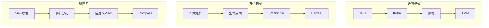
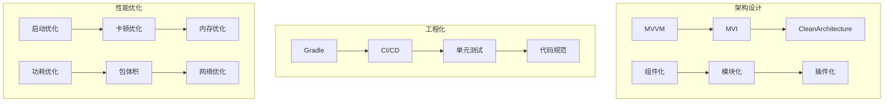
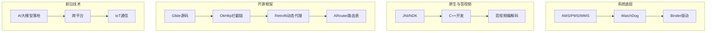

# 资深安卓应用工程师面试备战知识库

## 项目定位

面向 **30k+ 资深安卓应用工程师** 岗位的全方位面试准备工程，覆盖从基础到深入的系统化技术知识体系。  
每个技术点按 **问题 → 答案 → 原理讲解 → 流程图 → 核心源码 → 应用场景** 六层递进方式组织。

---

## 目录总览

| 序号 | 技术方向 | 核心考察点 | 优先级 |
|:---:|---------|-----------|:-----:|
| 01 | [安卓语言基础](./01-安卓语言基础/) | Java/Kotlin 语言特性、协程、KMM | ★★★★★ |
| 02 | [安卓核心机制](./02-安卓核心机制/) | 四大组件、生命周期、Binder、Handler | ★★★★★ |
| 03 | [数据结构与算法](./03-数据结构与算法/) | 数据结构、排序查找、动态规划 | ★★★★☆ |
| 04 | [UI 与 View 体系](./04-UI与View体系/) | View 绘制、事件分发、自定义View、动画 | ★★★★★ |
| 05 | [Jetpack 组件体系](./05-Jetpack组件体系/) | ViewModel/LiveData、Room、Hilt、Compose | ★★★★★ |
| 06 | [应用架构设计](./06-应用架构设计/) | MVVM/MVI/Clean、组件化、插件化 | ★★★★★ |
| 07 | [安卓系统与 Framework](./07-安卓系统与Framework/) | 系统架构、AMS/PMS/WMS、WatchDog | ★★★★☆ |
| 08 | [性能优化](./08-性能优化/) | 启动/卡顿/内存/功耗/包体积/网络优化 | ★★★★★ |
| 09 | [稳定性与异常处理](./09-稳定性与异常处理/) | ANR、崩溃、System Restart、监控体系 | ★★★★★ |
| 10 | [原生开发与 NDK](./10-原生开发与NDK/) | JNI 基础、NDK 开发、C++ 与安卓 | ★★★★☆ |
| 11 | [音视频开发](./11-音视频开发/) | 编解码、播放器、推流拉流、FFmpeg | ★★★★☆ |
| 12 | [跨平台开发](./12-跨平台开发/) | Flutter、React Native、Compose Multiplatform | ★★★☆☆ |
| 13 | [构建与工程化](./13-构建与工程化/) | Gradle、CI/CD、单元测试、代码规范 | ★★★★☆ |
| 14 | [AI 与安卓结合](./14-AI与安卓结合/) | AI 辅助开发、大模型落地、AI 编程思维 | ★★★★☆ |
| 15 | [性能优化工具专题](./15-性能优化工具专题/) | Systrace/Perfetto/Memory Profiler/APM | ★★★★★ |
| 16 | [物联网与通信](./16-物联网与通信/) | BLE/Wi-Fi/Matter 协议 | ★★★☆☆ |
| 17 | [出海应用与适配](./17-出海应用与适配/) | 隐私权限、厂商兼容性、国际化 | ★★★☆☆ |
| 18 | [高频面试题汇总](./18-高频面试题汇总/) | 基础/架构/性能/系统与底层题 | ★★★★★ |
| 19 | [开源框架专题](./19-开源框架专题/) | Glide/OkHttp/Retrofit/ARouter/RxJava/Tinker | ★★★★★ |
| 20 | [并发编程与线程安全](./20-并发编程与线程安全/) | Java并发/线程池/锁优化/协程并发/Android线程 | ★★★★★ |
| 21 | [内存管理](./21-内存管理/) | JVM内存/ART GC/内存分配/Native内存/内存压力 | ★★★★★ |
| 22 | [高性能编程](./22-高性能编程/) | 对象池/零拷贝/序列化/IO优化/编译优化 | ★★★★☆ |

---

## 知识组织形式

### 每个技术点包含以下六层内容：

```
┌──────────────────────────────────────────┐
│  1. 常见面试问题                          │
│     ↓                                    │
│  2. 标准答案与要点解析                     │
│     ↓                                    │
│  3. 核心原理深度讲解                       │
│     ↓                                    │
│  4. 原理流程图（时序图/状态图）             │
│     ↓                                    │
│  5. 核心源码分析（Android 源码/示例代码）    │
│     ↓                                    │
│  6. 实际应用场景与项目经验举例               │
└──────────────────────────────────────────┘
```

### 文件格式说明

- 内容简单的技术点使用 **Markdown** 格式
- 涉及时序图、架构图、流程图的复杂内容使用 **HTML** 格式展示
- 每个目录下的 `README.md` 为该方向的内容索引

---

## 技术能力全景图

### 基础层（required for all levels）


### 架构与工程层（required for senior）


### 深度专项层（30k+ differentiation）


---

## 使用指南

1. **按优先级学习**：先攻克 ★★★★★ 方向，再深入 ★★★★☆，最后扩展 ★★★☆☆
2. **六层递进**：每个技术点先看面试题建立认知，再通过原理和源码深入理解，最后对标项目经验
3. **工具专题**：第15章性能优化工具专题独立成章，按工具类别和先进程度排序
4. **开源框架专题**：第19章开源框架专题，覆盖 Glide/OkHttp/Retrofit/ARouter/RxJava 等核心框架的源码级原理
5. **面试前冲刺**：第18章高频面试题汇总适合考前快速回顾

---

## 当前进度

| 模块 | 内容完成度 | 状态 |
|-----|:---------:|:----:|
| 目录结构 | 100% | ✅ 已完成 |
| 根索引文件 | 100% | ✅ 已完成 |
| 各技术点内容 | 0% | 🔜 待填充 |

---

> 最后更新：2026-05-08  
> 项目基于 AGENTS.md 规范构建
